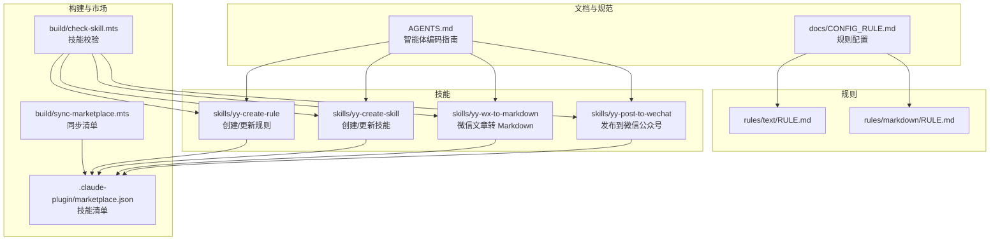
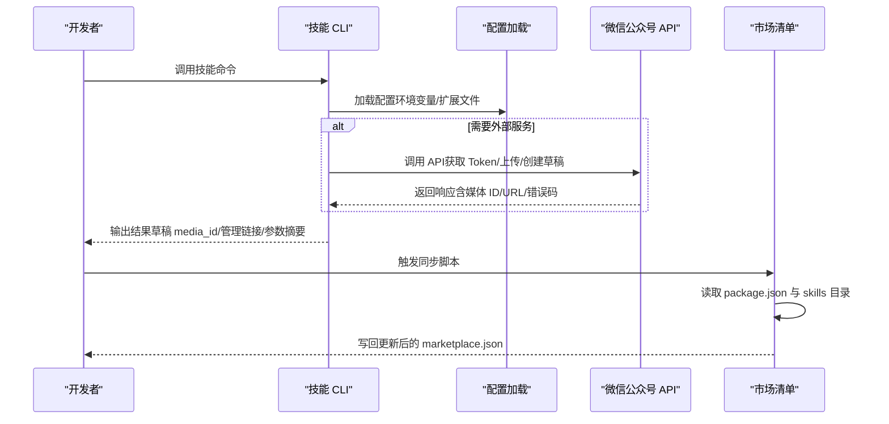
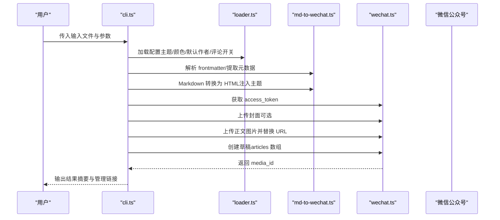
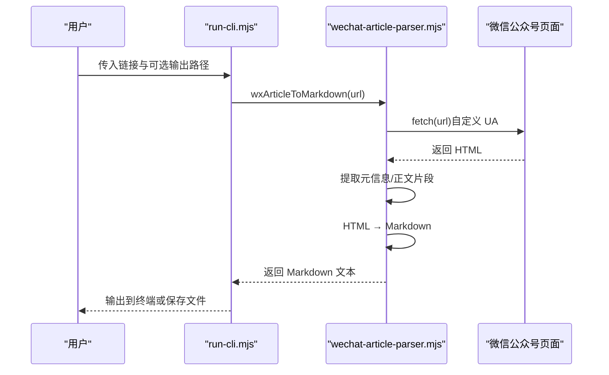
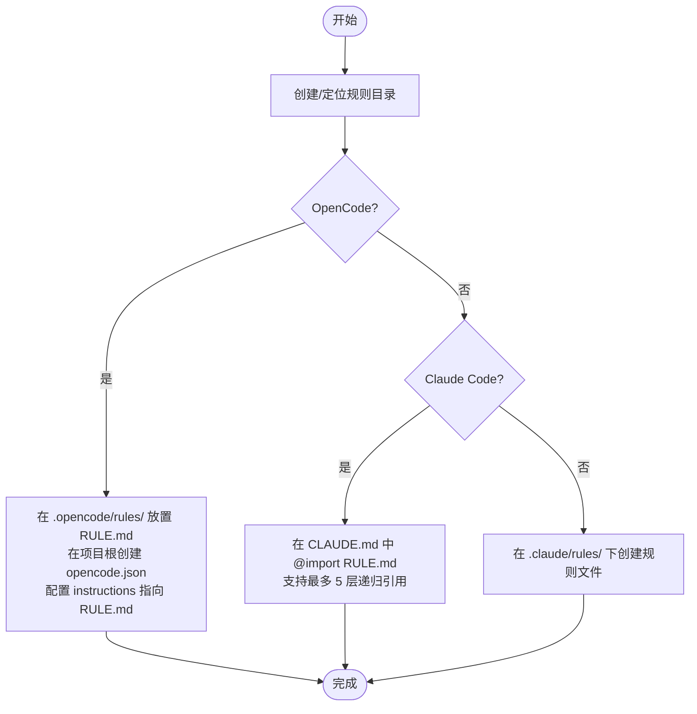
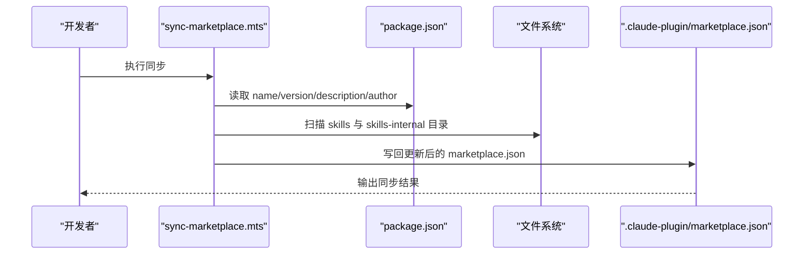
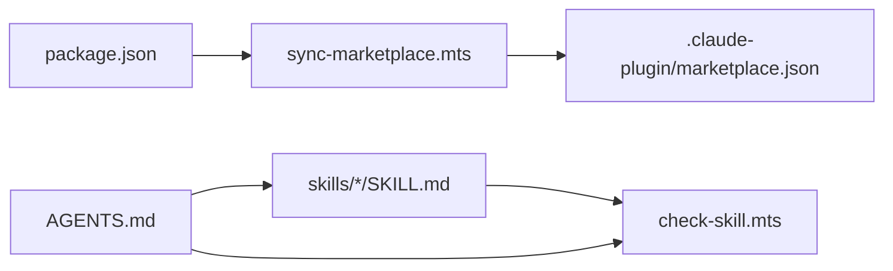

# API 参考

<cite>
**本文引用的文件**
- [package.json](file://package.json)
- [AGENTS.md](file://AGENTS.md)
- [CLAUDE.md](file://CLAUDE.md)
- [skills/yy-post-to-wechat/SKILL.md](file://skills/yy-post-to-wechat/SKILL.md)
- [skills/yy-post-to-wechat/scripts/src/cli.ts](file://skills/yy-post-to-wechat/scripts/src/cli.ts)
- [skills/yy-post-to-wechat/scripts/src/config/loader.ts](file://skills/yy-post-to-wechat/scripts/src/config/loader.ts)
- [skills/yy-post-to-wechat/scripts/src/api/wechat.ts](file://skills/yy-post-to-wechat/scripts/src/api/wechat.ts)
- [skills/yy-post-to-wechat/scripts/src/converter/md-to-wechat.ts](file://skills/yy-post-to-wechat/scripts/src/converter/md-to-wechat.ts)
- [skills/yy-post-to-wechat/scripts/src/themes/index.ts](file://skills/yy-post-to-wechat/scripts/src/themes/index.ts)
- [skills/yy-wx-to-markdown/SKILL.md](file://skills/yy-wx-to-markdown/SKILL.md)
- [skills/yy-wx-to-markdown/scripts/wechat-article-parser.mjs](file://skills/yy-wx-to-markdown/scripts/wechat-article-parser.mjs)
- [skills/yy-create-skill/SKILL.md](file://skills/yy-create-skill/SKILL.md)
- [skills/yy-create-rule/SKILL.md](file://skills/yy-create-rule/SKILL.md)
- [build/sync-marketplace.mts](file://build/sync-marketplace.mts)
- [build/check-skill.mts](file://build/check-skill.mts)
- [.claude-plugin/marketplace.json](file://.claude-plugin/marketplace.json)
- [docs/CONFIG_RULE.md](file://docs/CONFIG_RULE.md)
</cite>

## 目录
1. [简介](#简介)
2. [项目结构](#项目结构)
3. [核心组件](#核心组件)
4. [架构总览](#架构总览)
5. [详细组件分析](#详细组件分析)
6. [依赖分析](#依赖分析)
7. [性能考虑](#性能考虑)
8. [故障排除指南](#故障排除指南)
9. [结论](#结论)
10. [附录](#附录)

## 简介
本文件为“技能系统”的完整 API 参考，覆盖以下方面：
- 技能接口定义：公开的技能调用入口、参数、返回与示例
- 规则系统 API：规则注册、应用与查询的流程与配置
- 构建工具 CLI：命令行参数、配置文件格式与输出格式
- 市场集成 API：技能清单同步、版本与元数据管理
- 市场集成 API（微信公众号）：数据格式、认证方法与错误码
- 版本管理与向后兼容性
- 故障排除与性能优化建议
- 限制与最佳实践

## 项目结构
该项目以“技能”为核心产物，围绕技能的创建、规则、市场同步与工具链形成闭环。

图表来源
- [skills/yy-post-to-wechat/SKILL.md:1-174](file://skills/yy-post-to-wechat/SKILL.md#L1-L174)
- [skills/yy-wx-to-markdown/SKILL.md:1-83](file://skills/yy-wx-to-markdown/SKILL.md#L1-L83)
- [skills/yy-create-skill/SKILL.md:1-213](file://skills/yy-create-skill/SKILL.md#L1-L213)
- [skills/yy-create-rule/SKILL.md:1-133](file://skills/yy-create-rule/SKILL.md#L1-L133)
- [.claude-plugin/marketplace.json:1-65](file://.claude-plugin/marketplace.json#L1-L65)
- [build/sync-marketplace.mts:1-93](file://build/sync-marketplace.mts#L1-L93)
- [build/check-skill.mts:1-230](file://build/check-skill.mts#L1-L230)
- [AGENTS.md:1-155](file://AGENTS.md#L1-L155)
- [docs/CONFIG_RULE.md:1-34](file://docs/CONFIG_RULE.md#L1-L34)

章节来源
- [package.json:1-46](file://package.json#L1-L46)
- [AGENTS.md:1-155](file://AGENTS.md#L1-L155)
- [.claude-plugin/marketplace.json:1-65](file://.claude-plugin/marketplace.json#L1-L65)

## 核心组件
- 技能：以 SKILL.md 为入口的可复用任务说明书，支持可执行脚本与静态文档两种形态
- 规则：以 RULE.md 为载体的项目规范与最佳实践，支持在不同平台（Claude Code、OpenCode）中引用
- 构建工具：同步市场清单、校验技能元数据、统一 lint 流程
- 市场集成：通过 marketplace.json 维护技能清单与版本元数据

章节来源
- [skills/yy-create-skill/SKILL.md:1-213](file://skills/yy-create-skill/SKILL.md#L1-L213)
- [skills/yy-create-rule/SKILL.md:1-133](file://skills/yy-create-rule/SKILL.md#L1-L133)
- [build/sync-marketplace.mts:1-93](file://build/sync-marketplace.mts#L1-L93)
- [build/check-skill.mts:1-230](file://build/check-skill.mts#L1-L230)

## 架构总览
技能系统围绕“技能 + 规则 + 市场 + 构建工具”的协作模式运行：

图表来源
- [skills/yy-post-to-wechat/scripts/src/cli.ts:148-258](file://skills/yy-post-to-wechat/scripts/src/cli.ts#L148-L258)
- [skills/yy-post-to-wechat/scripts/src/config/loader.ts:130-145](file://skills/yy-post-to-wechat/scripts/src/config/loader.ts#L130-L145)
- [skills/yy-post-to-wechat/scripts/src/api/wechat.ts:4-105](file://skills/yy-post-to-wechat/scripts/src/api/wechat.ts#L4-L105)
- [build/sync-marketplace.mts:12-93](file://build/sync-marketplace.mts#L12-L93)

## 详细组件分析

### 组件 A：微信发布技能（yy-post-to-wechat）
- 技能定位：将本地 Markdown/HTML 文章发布到微信公众号草稿箱，支持主题与颜色预设、自动上传图片
- 公开接口：命令行入口，参数与行为在 SKILL.md 中定义
- 关键流程：
  1) 配置加载（环境变量/扩展文件）
  2) 输入解析（frontmatter 元数据、封面、正文图片）
  3) 转换与渲染（Markdown → 微信兼容 HTML，主题样式注入）
  4) 图片上传（正文图片与封面）
  5) 调用草稿 API 创建草稿
  6) 输出草稿 media_id 与管理链接

图表来源
- [skills/yy-post-to-wechat/scripts/src/cli.ts:148-258](file://skills/yy-post-to-wechat/scripts/src/cli.ts#L148-L258)
- [skills/yy-post-to-wechat/scripts/src/config/loader.ts:130-145](file://skills/yy-post-to-wechat/scripts/src/config/loader.ts#L130-L145)
- [skills/yy-post-to-wechat/scripts/src/converter/md-to-wechat.ts:30-90](file://skills/yy-post-to-wechat/scripts/src/converter/md-to-wechat.ts#L30-L90)
- [skills/yy-post-to-wechat/scripts/src/api/wechat.ts:4-105](file://skills/yy-post-to-wechat/scripts/src/api/wechat.ts#L4-L105)

章节来源
- [skills/yy-post-to-wechat/SKILL.md:1-174](file://skills/yy-post-to-wechat/SKILL.md#L1-L174)
- [skills/yy-post-to-wechat/scripts/src/cli.ts:14-63](file://skills/yy-post-to-wechat/scripts/src/cli.ts#L14-L63)
- [skills/yy-post-to-wechat/scripts/src/config/loader.ts:1-150](file://skills/yy-post-to-wechat/scripts/src/config/loader.ts#L1-L150)
- [skills/yy-post-to-wechat/scripts/src/converter/md-to-wechat.ts:1-142](file://skills/yy-post-to-wechat/scripts/src/converter/md-to-wechat.ts#L1-L142)
- [skills/yy-post-to-wechat/scripts/src/themes/index.ts:1-479](file://skills/yy-post-to-wechat/scripts/src/themes/index.ts#L1-L479)
- [skills/yy-post-to-wechat/scripts/src/api/wechat.ts:1-106](file://skills/yy-post-to-wechat/scripts/src/api/wechat.ts#L1-L106)

#### API 定义（微信公众号）
- 认证
  - 方法：GET /cgi-bin/token
  - 参数：grant_type=client_credential&appid={}&secret={}
  - 成功响应：access_token
  - 失败响应：errcode、errmsg
- 上传图片（正文图片）
  - 方法：POST /cgi-bin/media/uploadimg
  - 参数：access_token
  - 成功响应：url
  - 失败响应：errcode、errmsg
- 上传封面（thumb_media_id）
  - 方法：POST /cgi-bin/material/add_material?type=image
  - 参数：access_token
  - 成功响应：media_id
  - 失败响应：errcode、errmsg
- 创建草稿
  - 方法：POST /cgi-bin/draft/add
  - 参数：access_token，JSON.body.articles=[{title,author,digest,content,thumb_media_id,need_open_comment,only_fans_can_comment}]
  - 成功响应：media_id
  - 失败响应：errcode、errmsg

章节来源
- [skills/yy-post-to-wechat/scripts/src/api/wechat.ts:4-105](file://skills/yy-post-to-wechat/scripts/src/api/wechat.ts#L4-L105)

#### 参数规格与返回值
- 命令行参数
  - 必填：<file>（.md/.html/.txt）
  - 可选：--theme <name>、--color <color>、--title <title>、--summary <text>、--author <name>、--cover <path>、--no-cite
- 配置文件
  - EXTEND.md：default_theme、default_color、default_author、need_open_comment、only_fans_can_comment
  - 环境变量：WECHAT_APP_ID、WECHAT_APP_SECRET
- 返回值
  - 控制台输出：文章信息摘要、图片数量、评论开关、草稿 media_id、管理链接

章节来源
- [skills/yy-post-to-wechat/SKILL.md:121-154](file://skills/yy-post-to-wechat/SKILL.md#L121-L154)
- [skills/yy-post-to-wechat/scripts/src/config/loader.ts:35-77](file://skills/yy-post-to-wechat/scripts/src/config/loader.ts#L35-L77)
- [skills/yy-post-to-wechat/scripts/src/cli.ts:14-63](file://skills/yy-post-to-wechat/scripts/src/cli.ts#L14-L63)

#### 使用示例
- 发布 Markdown 文件：node skills/yy-post-to-wechat/scripts/ ./my-article.md --theme default --color blue
- 指定作者与封面：node skills/yy-post-to-wechat/scripts/ ./post.md --author "宝玉" --cover ./imgs/cover.png
- 禁用引用转换：node skills/yy-post-to-wechat/scripts/ ./article.md --no-cite

章节来源
- [skills/yy-post-to-wechat/SKILL.md:143-154](file://skills/yy-post-to-wechat/SKILL.md#L143-L154)

### 组件 B：微信文章转 Markdown（yy-wx-to-markdown）
- 技能定位：将微信公众号文章链接转换为 Markdown，提取标题、作者、正文并生成带 frontmatter 的 Markdown
- 公开接口：CLI 入口，支持直接输出到终端或保存到文件
- 关键流程：
  1) 验证输入链接（仅 mp.weixin.qq.com）
  2) 请求网页 HTML（自定义 UA）
  3) 提取元信息（标题、作者）
  4) 提取正文 HTML 片段
  5) HTML → Markdown 转换（标题、粗体、列表、引用、代码块、链接、图片）
  6) 拼装 Markdown（frontmatter：title、author、source、date）

图表来源
- [skills/yy-wx-to-markdown/SKILL.md:67-75](file://skills/yy-wx-to-markdown/SKILL.md#L67-L75)
- [skills/yy-wx-to-markdown/scripts/wechat-article-parser.mjs:136-192](file://skills/yy-wx-to-markdown/scripts/wechat-article-parser.mjs#L136-L192)

章节来源
- [skills/yy-wx-to-markdown/SKILL.md:1-83](file://skills/yy-wx-to-markdown/SKILL.md#L1-L83)
- [skills/yy-wx-to-markdown/scripts/wechat-article-parser.mjs:1-193](file://skills/yy-wx-to-markdown/scripts/wechat-article-parser.mjs#L1-L193)

#### 参数规格与返回值
- 输入：微信公众号文章链接（仅支持 mp.weixin.qq.com）
- 输出：Markdown 文本（含 YAML frontmatter）
- 保存：可选输出到文件，返回保存位置与字符统计

章节来源
- [skills/yy-wx-to-markdown/SKILL.md:67-75](file://skills/yy-wx-to-markdown/SKILL.md#L67-L75)

#### 使用示例
- 直接输出到终端：node skills/yy-wx-to-markdown/scripts/run-cli.mjs https://mp.weixin.qq.com/s/xxx
- 保存到文件：node skills/yy-wx-to-markdown/scripts/run-cli.mjs https://mp.weixin.qq.com/s/xxx output.md

章节来源
- [skills/yy-wx-to-markdown/SKILL.md:67-75](file://skills/yy-wx-to-markdown/SKILL.md#L67-L75)

### 组件 C：规则系统 API（注册、应用与查询）
- 注册
  - OpenCode：将规则文件放入 .opencode/rules/，在项目根目录创建 opencode.json，添加 instructions 指向 RULE.md
  - Claude Code：在 CLAUDE.md 中通过 @path/to/import 引入规则文件，支持最多 5 层递归引用；也可在 .claude/rules/ 下创建规则文件
- 应用
  - 规则文件为 Markdown，Claude Code 会遍历 rules 目录及其子目录
- 查询
  - 通过技能引用或项目配置文件（如 AGENTS.md）进行检索与导航

图表来源
- [docs/CONFIG_RULE.md:1-34](file://docs/CONFIG_RULE.md#L1-L34)
- [AGENTS.md:135-143](file://AGENTS.md#L135-L143)

章节来源
- [docs/CONFIG_RULE.md:1-34](file://docs/CONFIG_RULE.md#L1-L34)
- [AGENTS.md:135-143](file://AGENTS.md#L135-L143)

### 组件 D：构建工具 CLI（命令行接口）
- 同步市场清单
  - 脚本：build/sync-marketplace.mts
  - 功能：同步 package.json 的 name/version/description/author 到 marketplace.json；扫描 skills 与 skills-internal 目录，按字母排序填充 plugins 列表
- 技能校验
  - 脚本：build/check-skill.mts
  - 功能：校验 SKILL.md 的 YAML frontmatter、name 与目录名一致性；对比 metadata.json（abstract/author/version）并输出警告

图表来源
- [build/sync-marketplace.mts:12-93](file://build/sync-marketplace.mts#L12-L93)
- [.claude-plugin/marketplace.json:1-65](file://.claude-plugin/marketplace.json#L1-L65)
- [package.json:1-46](file://package.json#L1-L46)

章节来源
- [build/sync-marketplace.mts:1-93](file://build/sync-marketplace.mts#L1-L93)
- [build/check-skill.mts:1-230](file://build/check-skill.mts#L1-L230)
- [package.json:1-46](file://package.json#L1-L46)

#### 命令行参数与配置
- 同步市场清单
  - 输入：package.json、skills/、skills-internal/、.claude-plugin/marketplace.json
  - 输出：更新后的 marketplace.json
- 技能校验
  - 输入：skills/ 下每个技能的 SKILL.md 与可选 metadata.json
  - 输出：错误/警告汇总与退出码

章节来源
- [build/sync-marketplace.mts:1-93](file://build/sync-marketplace.mts#L1-L93)
- [build/check-skill.mts:177-230](file://build/check-skill.mts#L177-L230)

### 组件 E：市场集成 API（技能清单）
- 数据格式
  - marketplace.json：包含 name、owner、metadata（description、version）、plugins（name、description、source、strict、skills[]）
- 版本与元数据
  - 通过同步脚本将 package.json 的字段映射到 marketplace.json
- 技能清单
  - 自动扫描 skills 与 skills-internal 目录，过滤空目录并按字母排序

章节来源
- [.claude-plugin/marketplace.json:1-65](file://.claude-plugin/marketplace.json#L1-L65)
- [build/sync-marketplace.mts:18-61](file://build/sync-marketplace.mts#L18-L61)
- [package.json:1-46](file://package.json#L1-L46)

## 依赖分析
- 技能与市场：技能目录变化会触发 marketplace.json 的同步更新
- 技能与规则：技能编写遵循 AGENTS.md 的质量门禁与交付规范
- 构建工具：统一 lint、类型检查、市场同步与技能校验

图表来源
- [package.json:1-46](file://package.json#L1-L46)
- [build/sync-marketplace.mts:1-93](file://build/sync-marketplace.mts#L1-L93)
- [build/check-skill.mts:1-230](file://build/check-skill.mts#L1-L230)
- [AGENTS.md:1-155](file://AGENTS.md#L1-L155)
- [.claude-plugin/marketplace.json:1-65](file://.claude-plugin/marketplace.json#L1-L65)

章节来源
- [package.json:1-46](file://package.json#L1-L46)
- [build/sync-marketplace.mts:1-93](file://build/sync-marketplace.mts#L1-L93)
- [build/check-skill.mts:1-230](file://build/check-skill.mts#L1-L230)
- [AGENTS.md:1-155](file://AGENTS.md#L1-L155)

## 性能考虑
- 图片上传
  - 逐张上传正文图片与封面，建议控制图片数量与尺寸，减少网络往返
- 转换与渲染
  - Markdown 转换与主题注入为本地计算，建议缓存模板与主题 CSS
- 请求与重试
  - 对微信 API 调用建议增加指数退避与超时控制（当前实现未包含重试逻辑）
- 批量处理
  - 若需批量发布，建议在上层封装并发控制与错误聚合

[本节为通用建议，不直接分析具体文件]

## 故障排除指南
- 配置缺失
  - 症状：提示未找到 API 凭证或颜色配置
  - 处理：在 .yy-skills/.env 或 ~/.yy-skills/.env 设置 WECHAT_APP_ID/WECHAT_APP_SECRET；或在 EXTEND.md 设置 default_color
- 文件不存在
  - 症状：提示文件不存在或封面图片不存在
  - 处理：确认输入路径与封面路径（支持相对路径与绝对路径）
- 微信 API 错误
  - 症状：获取 access_token/上传图片/创建草稿失败，返回 errcode/errmsg
  - 处理：检查 AppID/AppSecret、服务器 IP 白名单、公众号权限与网络连通性
- 技能校验失败
  - 症状：SKILL.md 格式错误、name 与目录名不匹配、metadata.json 字段不一致
  - 处理：修正 YAML frontmatter、name 与目录名一致、同步 metadata.json 字段

章节来源
- [skills/yy-post-to-wechat/scripts/src/cli.ts:202-205](file://skills/yy-post-to-wechat/scripts/src/cli.ts#L202-L205)
- [skills/yy-post-to-wechat/scripts/src/config/loader.ts:147-150](file://skills/yy-post-to-wechat/scripts/src/config/loader.ts#L147-L150)
- [skills/yy-post-to-wechat/scripts/src/api/wechat.ts:10-18](file://skills/yy-post-to-wechat/scripts/src/api/wechat.ts#L10-L18)
- [build/check-skill.mts:58-122](file://build/check-skill.mts#L58-L122)

## 结论
本 API 参考系统性梳理了技能、规则、市场与构建工具的接口与流程，明确了参数、返回与使用示例，并提供了故障排除与性能优化建议。通过 marketplace.json 与同步脚本，实现了技能清单的自动化维护；通过规则配置文档，确保不同平台的一致性与可复用性。

[本节为总结性内容，不直接分析具体文件]

## 附录

### API 版本管理与向后兼容
- marketplace.json 与 package.json 的字段映射
  - name、version、description、author 同步更新
- 技能目录结构
  - 保持 SKILL.md 与 metadata.json 的一致性，避免破坏既有调用方
- 规则文件
  - 通过 AGENTS.md 统一引用，避免硬编码路径导致的升级成本

章节来源
- [build/sync-marketplace.mts:18-30](file://build/sync-marketplace.mts#L18-L30)
- [build/check-skill.mts:127-172](file://build/check-skill.mts#L127-L172)
- [AGENTS.md:135-143](file://AGENTS.md#L135-L143)

### 限制与最佳实践
- 限制
  - 仅支持 mp.weixin.qq.com 域名的微信文章链接（yy-wx-to-markdown）
  - 微信公众号需具备开发者权限与服务器 IP 白名单
- 最佳实践
  - 使用 EXTEND.md 统一默认主题与颜色，减少命令行参数
  - 在 CI 中执行 npm run lint 与技能校验，保证质量门禁
  - 将敏感配置置于环境变量，避免提交到仓库

章节来源
- [skills/yy-wx-to-markdown/SKILL.md:28-36](file://skills/yy-wx-to-markdown/SKILL.md#L28-L36)
- [skills/yy-post-to-wechat/SKILL.md:156-162](file://skills/yy-post-to-wechat/SKILL.md#L156-L162)
- [AGENTS.md:13-17](file://AGENTS.md#L13-L17)