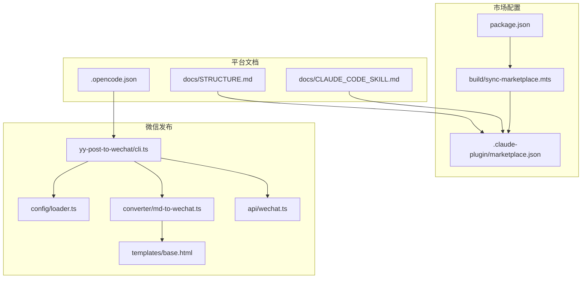
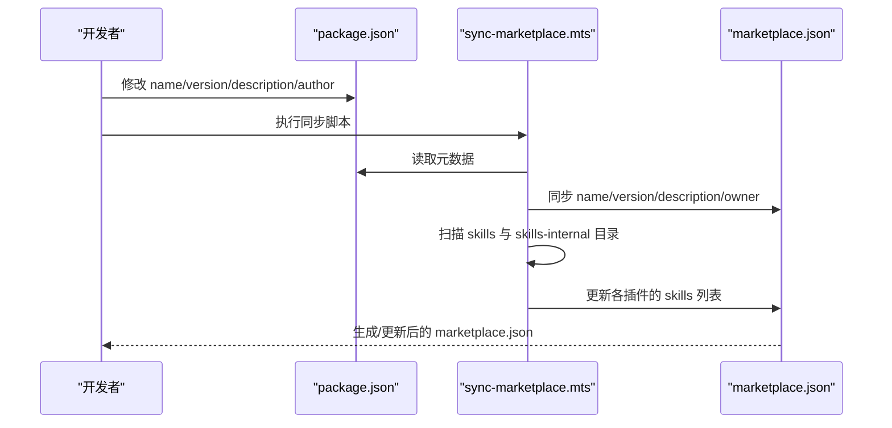
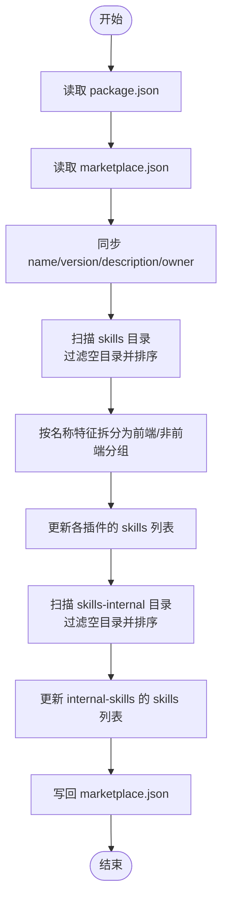
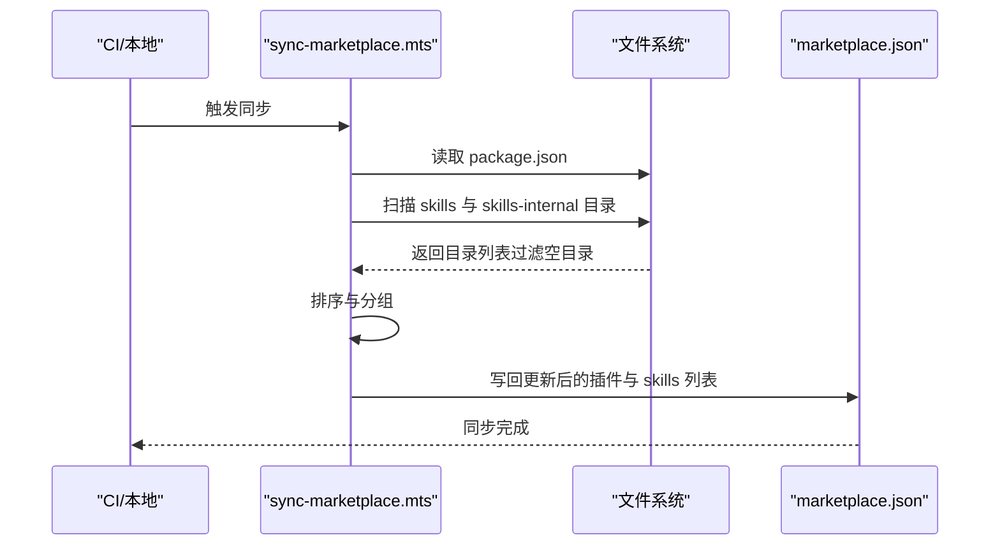
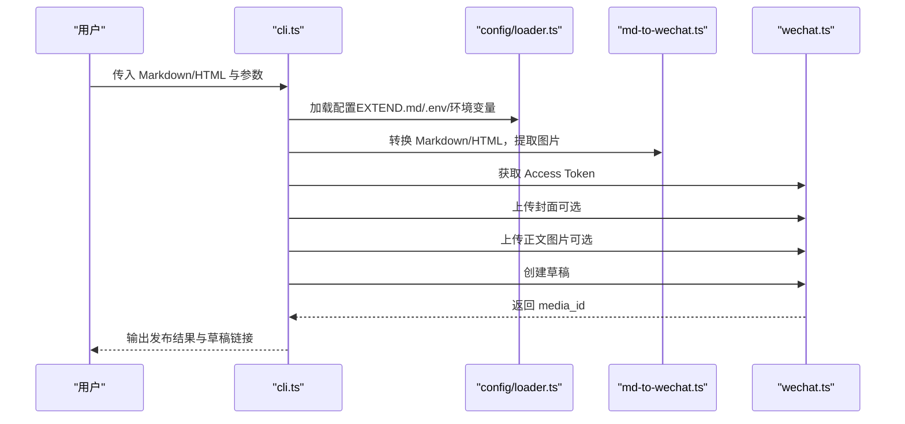
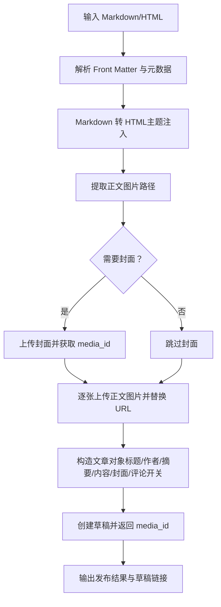
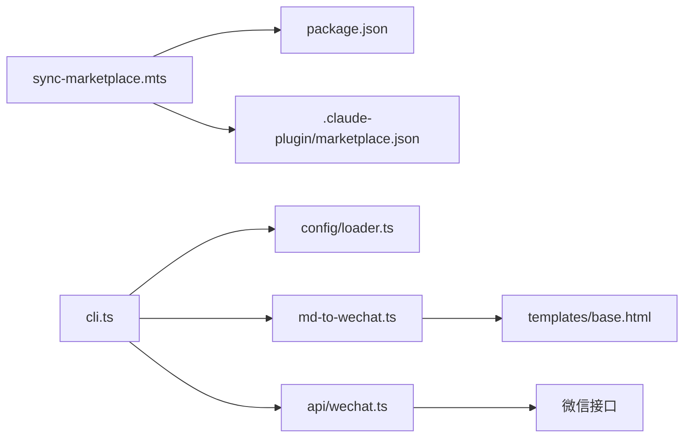

# 市场 API

<cite>
**本文引用的文件**
- [.claude-plugin/marketplace.json](file://.claude-plugin/marketplace.json)
- [package.json](file://package.json)
- [build/sync-marketplace.mts](file://build/sync-marketplace.mts)
- [skills/yy-post-to-wechat/scripts/src/api/wechat.ts](file://skills/yy-post-to-wechat/scripts/src/api/wechat.ts)
- [skills/yy-post-to-wechat/scripts/src/converter/md-to-wechat.ts](file://skills/yy-post-to-wechat/scripts/src/converter/md-to-wechat.ts)
- [skills/yy-post-to-wechat/scripts/src/cli.ts](file://skills/yy-post-to-wechat/scripts/src/cli.ts)
- [skills/yy-post-to-wechat/scripts/src/config/loader.ts](file://skills/yy-post-to-wechat/scripts/src/config/loader.ts)
- [skills/yy-post-to-wechat/templates/base.html](file://skills/yy-post-to-wechat/templates/base.html)
- [skills/yy-post-to-wechat/scripts/package.json](file://skills/yy-post-to-wechat/scripts/package.json)
- [docs/CLAUDE_CODE_SKILL.md](file://docs/CLAUDE_CODE_SKILL.md)
- [docs/STRUCTURE.md](file://docs/STRUCTURE.md)
- [.opencode.json](file://.opencode.json)
</cite>

## 目录
1. [简介](#简介)
2. [项目结构](#项目结构)
3. [核心组件](#核心组件)
4. [架构总览](#架构总览)
5. [详细组件分析](#详细组件分析)
6. [依赖分析](#依赖分析)
7. [性能考虑](#性能考虑)
8. [故障排查指南](#故障排查指南)
9. [结论](#结论)
10. [附录](#附录)

## 简介
本文件面向“市场集成”的 API 文档，聚焦以下目标：
- 解释 marketplace.json 配置文件的格式与字段定义，涵盖技能分组、分类与元数据管理。
- 说明多平台市场的 API 规范与同步机制，包括 Claude、OpenCode、Trae 等平台的集成要点。
- 提供技能发布与更新的 API 接口说明，包括数据验证、冲突处理与版本管理建议。
- 解释市场同步流程与错误处理机制，区分增量更新与全量同步。
- 说明微信公众号等外部平台的集成 API，包括内容转换与发布流程。
- 给出完整的 API 调用示例与参数配置，以及认证方法、速率限制与错误码定义。

## 项目结构
该项目围绕“技能市场”与“多平台发布”两条主线组织：
- 市场配置与同步：通过 marketplace.json 定义插件与技能分组，配合构建脚本实现自动化同步。
- 多平台发布：通过 CLI 工具将 Markdown/HTML 内容转换为微信公众号可发布的 HTML，并调用微信素材与草稿接口。
- 平台接入：Claude、OpenCode、Trae 等平台通过各自的 marketplace 配置与命令行工具完成技能安装与使用。

图表来源
- [.claude-plugin/marketplace.json:1-65](file://.claude-plugin/marketplace.json#L1-L65)
- [package.json:1-46](file://package.json#L1-L46)
- [build/sync-marketplace.mts:1-93](file://build/sync-marketplace.mts#L1-L93)
- [skills/yy-post-to-wechat/scripts/src/cli.ts:1-264](file://skills/yy-post-to-wechat/scripts/src/cli.ts#L1-L264)
- [skills/yy-post-to-wechat/scripts/src/config/loader.ts:1-150](file://skills/yy-post-to-wechat/scripts/src/config/loader.ts#L1-L150)
- [skills/yy-post-to-wechat/scripts/src/converter/md-to-wechat.ts:1-142](file://skills/yy-post-to-wechat/scripts/src/converter/md-to-wechat.ts#L1-L142)
- [skills/yy-post-to-wechat/scripts/src/api/wechat.ts:1-106](file://skills/yy-post-to-wechat/scripts/src/api/wechat.ts#L1-L106)
- [skills/yy-post-to-wechat/templates/base.html:1-21](file://skills/yy-post-to-wechat/templates/base.html#L1-L21)
- [docs/CLAUDE_CODE_SKILL.md:1-10](file://docs/CLAUDE_CODE_SKILL.md#L1-L10)
- [docs/STRUCTURE.md:1-10](file://docs/STRUCTURE.md#L1-L10)
- [.opencode.json:1-14](file://.opencode.json#L1-L14)

章节来源
- [docs/STRUCTURE.md:1-10](file://docs/STRUCTURE.md#L1-L10)

## 核心组件
- 市场配置与同步
  - marketplace.json：定义市场名称、拥有者、元数据与插件分组及技能列表。
  - package.json：提供 name/version/description/author 等元数据，驱动同步脚本。
  - sync-marketplace.mts：读取 package.json 与技能目录，自动更新 marketplace.json 的 name/version/description/owner 与各插件的 skills 列表。
- 微信发布链路
  - CLI：解析参数、加载配置、转换 Markdown/HTML、上传图片、创建草稿。
  - 配置加载器：支持 EXTEND.md、环境变量与 .env 文件，合并默认值与用户配置。
  - 内容转换器：Markdown 到 HTML、引用处理、主题注入、首图提取。
  - 微信 API：获取 Access Token、上传图片/封面、创建草稿。
  - 模板：base.html 注入主题与颜色，渲染最终 HTML。
- 平台接入文档
  - docs/CLAUDE_CODE_SKILL.md：Claude Code 安装市场与技能的步骤说明。
  - docs/STRUCTURE.md：项目结构与市场配置位置说明。
  - .opencode.json：OpenCode 平台的配置入口。

章节来源
- [.claude-plugin/marketplace.json:1-65](file://.claude-plugin/marketplace.json#L1-L65)
- [package.json:1-46](file://package.json#L1-L46)
- [build/sync-marketplace.mts:1-93](file://build/sync-marketplace.mts#L1-L93)
- [skills/yy-post-to-wechat/scripts/src/cli.ts:1-264](file://skills/yy-post-to-wechat/scripts/src/cli.ts#L1-L264)
- [skills/yy-post-to-wechat/scripts/src/config/loader.ts:1-150](file://skills/yy-post-to-wechat/scripts/src/config/loader.ts#L1-L150)
- [skills/yy-post-to-wechat/scripts/src/converter/md-to-wechat.ts:1-142](file://skills/yy-post-to-wechat/scripts/src/converter/md-to-wechat.ts#L1-L142)
- [skills/yy-post-to-wechat/scripts/src/api/wechat.ts:1-106](file://skills/yy-post-to-wechat/scripts/src/api/wechat.ts#L1-L106)
- [skills/yy-post-to-wechat/templates/base.html:1-21](file://skills/yy-post-to-wechat/templates/base.html#L1-L21)
- [docs/CLAUDE_CODE_SKILL.md:1-10](file://docs/CLAUDE_CODE_SKILL.md#L1-L10)
- [docs/STRUCTURE.md:1-10](file://docs/STRUCTURE.md#L1-L10)
- [.opencode.json:1-14](file://.opencode.json#L1-L14)

## 架构总览
市场 API 的整体架构由“配置驱动 + 自动化同步 + 多平台发布”构成：
- 配置驱动：marketplace.json 作为单一事实源，定义插件与技能分组。
- 自动化同步：基于 package.json 的元数据与技能目录扫描，生成/更新插件的 skills 列表。
- 多平台发布：CLI 将 Markdown/HTML 转换为微信可读的 HTML，调用微信 API 完成素材上传与草稿创建。

图表来源
- [build/sync-marketplace.mts:1-93](file://build/sync-marketplace.mts#L1-L93)
- [.claude-plugin/marketplace.json:1-65](file://.claude-plugin/marketplace.json#L1-L65)
- [package.json:1-46](file://package.json#L1-L46)

## 详细组件分析

### marketplace.json 配置规范
- 字段说明
  - name：市场名称，来源于 package.json 的 name。
  - owner：市场拥有者对象，包含 name 字段。
  - metadata：市场元数据对象，包含 description 与 version。
  - plugins：插件数组，每个插件包含 name、description、source、strict 与 skills 列表。
    - skills：指向具体技能目录的相对路径数组，支持按功能分组（如前端技能）。
- 分组与分类
  - 通过 plugins 数组中的多个插件实现“分组”，例如 open-skills、frontend-skills、internal-skills。
  - skills 列表按字母顺序排序，便于稳定性和可预测性。
- 版本管理
  - metadata.version 来源于 package.json 的 version，用于市场版本控制。
- 同步机制
  - sync-marketplace.mts 会读取 package.json 与技能目录，自动更新 marketplace.json 的 name/version/description/owner 与各插件的 skills 列表。

图表来源
- [build/sync-marketplace.mts:1-93](file://build/sync-marketplace.mts#L1-L93)
- [.claude-plugin/marketplace.json:1-65](file://.claude-plugin/marketplace.json#L1-L65)
- [package.json:1-46](file://package.json#L1-L46)

章节来源
- [.claude-plugin/marketplace.json:1-65](file://.claude-plugin/marketplace.json#L1-L65)
- [build/sync-marketplace.mts:1-93](file://build/sync-marketplace.mts#L1-L93)
- [package.json:1-46](file://package.json#L1-L46)

### 多平台市场 API 规范与同步机制
- 平台接入
  - Claude：通过 docs/CLAUDE_CODE_SKILL.md 提供市场添加与技能安装步骤。
  - OpenCode：通过 .opencode.json 指定指令与文档路径，作为平台配置入口。
  - Trae：通过 package.json 的 install:skill 脚本，一次性注册多个平台（claude-code、codex、opencode、trae-cn、codebuddy）。
- 同步策略
  - 全量同步：每次运行 sync-marketplace.mts 时，重新扫描技能目录并写回 marketplace.json。
  - 增量更新：可通过在 CI 中仅在 package.json 或技能目录变更时触发同步，减少不必要的写入。
- 数据验证与冲突处理
  - 空目录清理：扫描阶段会删除空目录并打印日志，避免无效路径进入 skills 列表。
  - 字母序排序：保证 skills 列表稳定，降低 diff 波动。
  - 插件唯一性：按插件名称查找并更新，避免重复写入。

图表来源
- [build/sync-marketplace.mts:1-93](file://build/sync-marketplace.mts#L1-L93)
- [.claude-plugin/marketplace.json:1-65](file://.claude-plugin/marketplace.json#L1-L65)
- [package.json:1-46](file://package.json#L1-L46)

章节来源
- [docs/CLAUDE_CODE_SKILL.md:1-10](file://docs/CLAUDE_CODE_SKILL.md#L1-L10)
- [.opencode.json:1-14](file://.opencode.json#L1-L14)
- [package.json:1-46](file://package.json#L1-L46)
- [build/sync-marketplace.mts:1-93](file://build/sync-marketplace.mts#L1-L93)

### 技能发布与更新 API（以微信为例）
- 发布流程
  - CLI 参数解析：支持主题、颜色、标题、摘要、作者、封面、是否显示引用等选项。
  - 内容解析：支持 Markdown 与 HTML；Markdown 时进行主题渲染与图片提取。
  - 配置加载：优先 EXTEND.md，其次 .env，再次环境变量，合并默认值。
  - 微信 API：获取 Access Token、上传正文图片、上传封面、创建草稿。
  - 结果输出：返回 media_id，指引到微信公众平台草稿箱。
- 数据验证
  - 文件存在性校验：输入文件、封面图片、正文图片均需存在。
  - 配置完整性校验：appId/appSecret 必填。
  - 返回值校验：Access Token、图片 URL、media_id 等字段必须存在。
- 冲突处理
  - 图片上传失败：记录警告并跳过该图片，不影响整体流程。
  - 首图缺失：Markdown 模式下强制要求封面，否则终止。
- 版本管理
  - 通过 marketplace.json 的 metadata.version 与 package.json 的 version 对齐，实现市场版本统一。

图表来源
- [skills/yy-post-to-wechat/scripts/src/cli.ts:1-264](file://skills/yy-post-to-wechat/scripts/src/cli.ts#L1-L264)
- [skills/yy-post-to-wechat/scripts/src/config/loader.ts:1-150](file://skills/yy-post-to-wechat/scripts/src/config/loader.ts#L1-L150)
- [skills/yy-post-to-wechat/scripts/src/converter/md-to-wechat.ts:1-142](file://skills/yy-post-to-wechat/scripts/src/converter/md-to-wechat.ts#L1-L142)
- [skills/yy-post-to-wechat/scripts/src/api/wechat.ts:1-106](file://skills/yy-post-to-wechat/scripts/src/api/wechat.ts#L1-L106)

章节来源
- [skills/yy-post-to-wechat/scripts/src/cli.ts:1-264](file://skills/yy-post-to-wechat/scripts/src/cli.ts#L1-L264)
- [skills/yy-post-to-wechat/scripts/src/config/loader.ts:1-150](file://skills/yy-post-to-wechat/scripts/src/config/loader.ts#L1-L150)
- [skills/yy-post-to-wechat/scripts/src/converter/md-to-wechat.ts:1-142](file://skills/yy-post-to-wechat/scripts/src/converter/md-to-wechat.ts#L1-L142)
- [skills/yy-post-to-wechat/scripts/src/api/wechat.ts:1-106](file://skills/yy-post-to-wechat/scripts/src/api/wechat.ts#L1-L106)

### 外部平台集成 API（微信公众号）
- 认证与授权
  - 获取 Access Token：使用 appId 与 appSecret 请求微信接口。
  - 有效期管理：根据微信官方文档定期刷新或缓存。
- 素材与草稿
  - 上传图片：支持正文图片与封面图片两种场景。
  - 创建草稿：将渲染后的 HTML 与元数据提交为草稿，返回 media_id。
- 内容转换
  - Markdown 到 HTML：使用 marked 渲染，注入主题 CSS 与主色。
  - 引用处理：可选地为外链生成引用列表。
  - 首图提取：从 HTML 中提取本地图片路径并上传。
- 发布流程
  - CLI 输出 media_id，指引到微信公众平台草稿箱进行审核与发布。

图表来源
- [skills/yy-post-to-wechat/scripts/src/converter/md-to-wechat.ts:1-142](file://skills/yy-post-to-wechat/scripts/src/converter/md-to-wechat.ts#L1-L142)
- [skills/yy-post-to-wechat/scripts/src/api/wechat.ts:1-106](file://skills/yy-post-to-wechat/scripts/src/api/wechat.ts#L1-L106)
- [skills/yy-post-to-wechat/templates/base.html:1-21](file://skills/yy-post-to-wechat/templates/base.html#L1-L21)

章节来源
- [skills/yy-post-to-wechat/scripts/src/converter/md-to-wechat.ts:1-142](file://skills/yy-post-to-wechat/scripts/src/converter/md-to-wechat.ts#L1-L142)
- [skills/yy-post-to-wechat/scripts/src/api/wechat.ts:1-106](file://skills/yy-post-to-wechat/scripts/src/api/wechat.ts#L1-L106)
- [skills/yy-post-to-wechat/templates/base.html:1-21](file://skills/yy-post-to-wechat/templates/base.html#L1-L21)

### 平台安装与使用示例
- Claude Code
  - 步骤：进入交互模式，打开 Marketplaces，首次添加仓库 Bulls-Cows/Skills，选择 open-skills 插件市场，安装所需技能。
- OpenCode
  - 配置：.opencode.json 指定指令与文档路径，作为平台配置入口。
- Trae
  - 一键安装：通过 package.json 的 install:skill 脚本，同时注册 claude-code、codex、opencode、trae-cn、codebuddy 等平台。

章节来源
- [docs/CLAUDE_CODE_SKILL.md:1-10](file://docs/CLAUDE_CODE_SKILL.md#L1-L10)
- [.opencode.json:1-14](file://.opencode.json#L1-L14)
- [package.json:1-46](file://package.json#L1-L46)

## 依赖分析
- 组件耦合
  - sync-marketplace.mts 依赖 package.json 与文件系统，耦合度低，职责单一。
  - 微信发布链路中，CLI 依赖配置加载器、内容转换器与微信 API，形成清晰的分层。
- 外部依赖
  - marked/front-matter：Markdown 渲染与 Front Matter 解析。
  - fetch/Blob/FormData：微信 API 调用与文件上传。
- 接口契约
  - 微信 API 返回值包含 errcode/errmsg 与业务字段（如 access_token/url/media_id），调用方需进行字段存在性校验。

图表来源
- [build/sync-marketplace.mts:1-93](file://build/sync-marketplace.mts#L1-L93)
- [.claude-plugin/marketplace.json:1-65](file://.claude-plugin/marketplace.json#L1-L65)
- [package.json:1-46](file://package.json#L1-L46)
- [skills/yy-post-to-wechat/scripts/src/cli.ts:1-264](file://skills/yy-post-to-wechat/scripts/src/cli.ts#L1-L264)
- [skills/yy-post-to-wechat/scripts/src/config/loader.ts:1-150](file://skills/yy-post-to-wechat/scripts/src/config/loader.ts#L1-L150)
- [skills/yy-post-to-wechat/scripts/src/converter/md-to-wechat.ts:1-142](file://skills/yy-post-to-wechat/scripts/src/converter/md-to-wechat.ts#L1-L142)
- [skills/yy-post-to-wechat/scripts/src/api/wechat.ts:1-106](file://skills/yy-post-to-wechat/scripts/src/api/wechat.ts#L1-L106)
- [skills/yy-post-to-wechat/templates/base.html:1-21](file://skills/yy-post-to-wechat/templates/base.html#L1-L21)

章节来源
- [build/sync-marketplace.mts:1-93](file://build/sync-marketplace.mts#L1-L93)
- [skills/yy-post-to-wechat/scripts/src/cli.ts:1-264](file://skills/yy-post-to-wechat/scripts/src/cli.ts#L1-L264)
- [skills/yy-post-to-wechat/scripts/src/config/loader.ts:1-150](file://skills/yy-post-to-wechat/scripts/src/config/loader.ts#L1-L150)
- [skills/yy-post-to-wechat/scripts/src/converter/md-to-wechat.ts:1-142](file://skills/yy-post-to-wechat/scripts/src/converter/md-to-wechat.ts#L1-L142)
- [skills/yy-post-to-wechat/scripts/src/api/wechat.ts:1-106](file://skills/yy-post-to-wechat/scripts/src/api/wechat.ts#L1-L106)

## 性能考虑
- 目录扫描与排序
  - 在大型仓库中，扫描 skills 与 skills-internal 目录可能成为瓶颈。建议在 CI 中缓存目录列表或仅在变更时触发同步。
- 图片上传
  - 逐张上传正文图片会增加网络往返。可考虑并发上传与失败重试策略，但需遵守微信接口的速率限制。
- 模板渲染
  - Markdown 渲染与 HTML 注入为 CPU 密集型任务。可在本地或 CI 中启用缓存，避免重复转换。
- 版本同步
  - marketplace.json 的写回频率应与发布节奏匹配，避免频繁写入导致的冲突与 CI 抖动。

## 故障排查指南
- marketplace.json 同步失败
  - 检查 package.json 的 name/version/description/author 是否有效。
  - 确认 skills 与 skills-internal 目录存在且非空，空目录会被自动清理。
  - 查看同步脚本输出，确认是否成功写回。
- 微信发布失败
  - Access Token 获取失败：检查 appId/appSecret 是否正确，网络连通性。
  - 图片上传失败：检查文件路径是否存在，文件大小与格式是否符合微信要求。
  - 创建草稿失败：检查文章对象字段是否完整，特别是标题、内容与封面。
- 配置加载异常
  - EXTEND.md/.env/环境变量优先级：确认配置文件路径与键名是否正确。
  - 默认值：若缺少必要配置，CLI 会提示并退出。

章节来源
- [build/sync-marketplace.mts:1-93](file://build/sync-marketplace.mts#L1-L93)
- [skills/yy-post-to-wechat/scripts/src/api/wechat.ts:1-106](file://skills/yy-post-to-wechat/scripts/src/api/wechat.ts#L1-L106)
- [skills/yy-post-to-wechat/scripts/src/config/loader.ts:1-150](file://skills/yy-post-to-wechat/scripts/src/config/loader.ts#L1-L150)
- [skills/yy-post-to-wechat/scripts/src/cli.ts:1-264](file://skills/yy-post-to-wechat/scripts/src/cli.ts#L1-L264)

## 结论
本项目通过 marketplace.json 实现技能市场的集中化管理，并借助 sync-marketplace.mts 实现自动化同步。微信发布链路由 CLI 驱动，结合内容转换与微信 API，完成从 Markdown/HTML 到微信草稿的全流程。多平台（Claude、OpenCode、Trae）通过各自配置与命令行工具实现技能安装与使用。建议在 CI 中实施增量同步与缓存策略，提升性能与稳定性。

## 附录

### marketplace.json 字段定义
- name：字符串，市场名称，来源于 package.json。
- owner.name：字符串，市场拥有者名称。
- metadata.description：字符串，市场描述。
- metadata.version：字符串，市场版本号，来源于 package.json。
- plugins[]：数组，插件定义。
  - name：字符串，插件名称（如 open-skills、frontend-skills、internal-skills）。
  - description：字符串，插件描述。
  - source：字符串，插件源路径。
  - strict：布尔，严格模式开关。
  - skills[]：字符串数组，指向技能目录的相对路径。

章节来源
- [.claude-plugin/marketplace.json:1-65](file://.claude-plugin/marketplace.json#L1-L65)
- [package.json:1-46](file://package.json#L1-L46)

### 多平台市场 API 规范
- Claude
  - 安装步骤：通过 docs/CLAUDE_CODE_SKILL.md 指引添加市场与安装技能。
- OpenCode
  - 配置入口：.opencode.json 指定指令与文档路径。
- Trae
  - 一键安装：package.json 的 install:skill 脚本注册多个平台。

章节来源
- [docs/CLAUDE_CODE_SKILL.md:1-10](file://docs/CLAUDE_CODE_SKILL.md#L1-L10)
- [.opencode.json:1-14](file://.opencode.json#L1-L14)
- [package.json:1-46](file://package.json#L1-L46)

### 技能发布与更新 API（微信）
- 认证方法
  - 使用 appId 与 appSecret 获取 Access Token。
- 速率限制
  - 遵循微信官方接口的调用频率限制，建议在客户端实现退避与重试。
- 错误码定义
  - 微信接口返回 errcode/errmsg，调用方需进行字段存在性校验与错误抛出。
- 版本管理
  - marketplace.json 的 metadata.version 与 package.json 的 version 保持一致。

章节来源
- [skills/yy-post-to-wechat/scripts/src/api/wechat.ts:1-106](file://skills/yy-post-to-wechat/scripts/src/api/wechat.ts#L1-L106)
- [build/sync-marketplace.mts:1-93](file://build/sync-marketplace.mts#L1-L93)
- [package.json:1-46](file://package.json#L1-L46)

### API 调用示例（参数与配置）
- CLI 参数
  - --theme：主题名称（default/grace/simple/modern）。
  - --color：主色调（如 #576b95）。
  - --title/--summary/--author/--cover：元数据覆盖。
  - --no-cite：关闭引用生成。
- 配置来源
  - EXTEND.md：扩展配置文件，支持 default_theme/default_color/default_author/need_open_comment/only_fans_can_comment/app_id/app_secret。
  - .env：WECHAT_APP_ID/WECHAT_APP_SECRET。
  - 环境变量：WECHAT_APP_ID/WECHAT_APP_SECRET。

章节来源
- [skills/yy-post-to-wechat/scripts/src/cli.ts:1-264](file://skills/yy-post-to-wechat/scripts/src/cli.ts#L1-L264)
- [skills/yy-post-to-wechat/scripts/src/config/loader.ts:1-150](file://skills/yy-post-to-wechat/scripts/src/config/loader.ts#L1-L150)