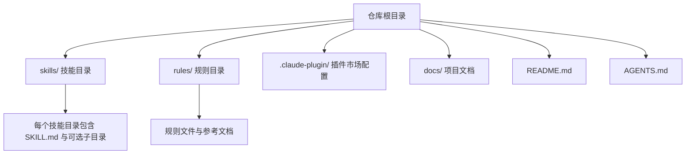
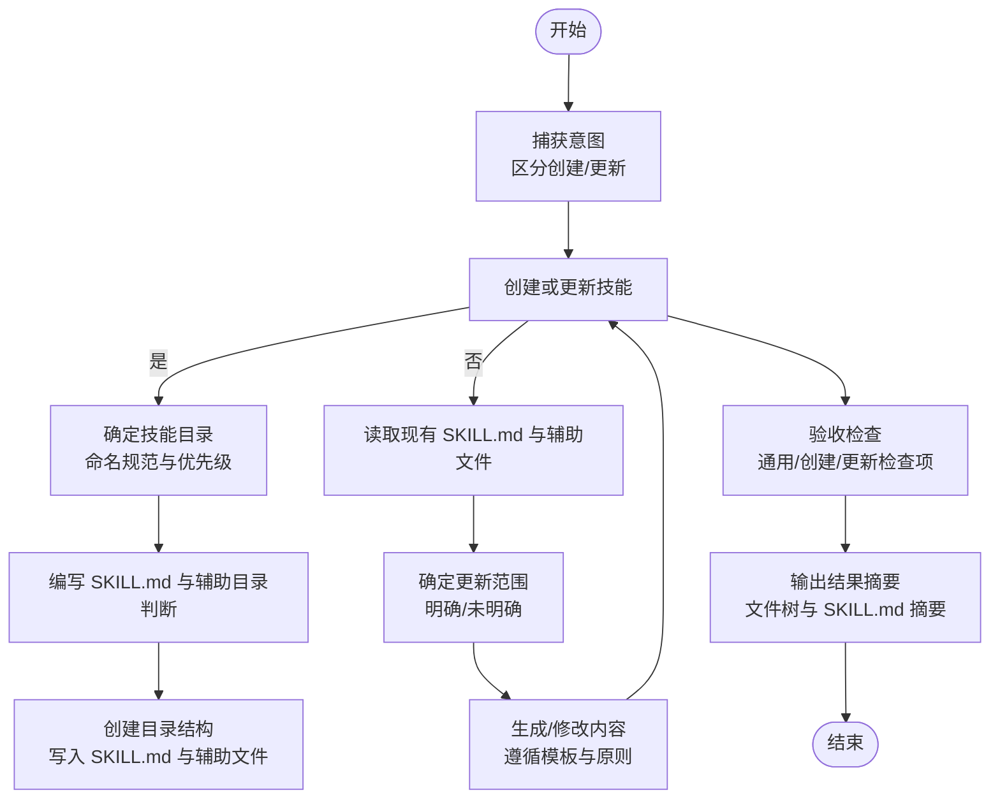
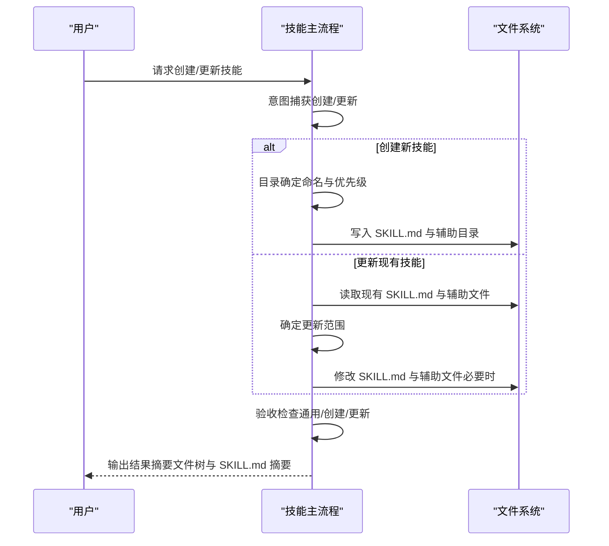
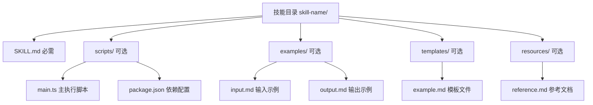
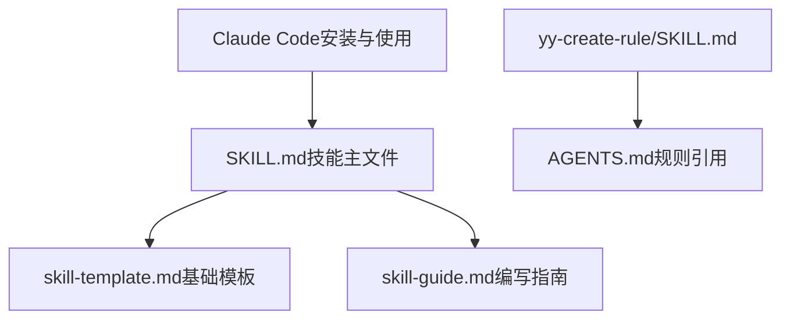
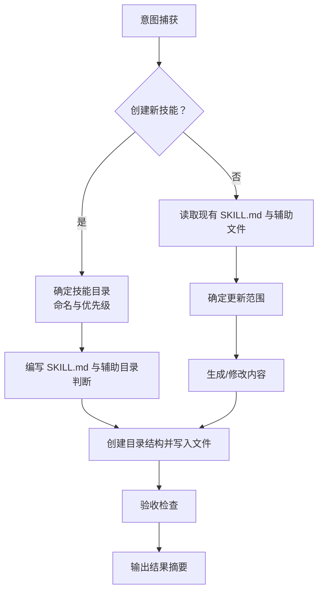

# 技能 API

<cite>
**本文引用的文件**
- [SKILL.md](file://skills/yy-create-skill/SKILL.md)
- [技能编写指南](file://skills/yy-create-skill/resources/skill-guide.md)
- [基础技能模板](file://skills/yy-create-skill/templates/skill-template.md)
- [项目结构](file://docs/STRUCTURE.md)
- [本地开发调试指南](file://docs/DEVELOP.md)
- [配置自定义规则](file://docs/CONFIG_RULE.md)
- [在 Claude Code 中安装技能](file://docs/CLAUDE_CODE_SKILL.md)
- [README.md](file://README.md)
- [AGENTS.md](file://AGENTS.md)
- [yy-create-rule/SKILL.md](file://skills/yy-create-rule/SKILL.md)
- [yy-create-readme/SKILL.md](file://skills/yy-create-readme/SKILL.md)
- [yy-mode-spec/SKILL.md](file://skills/yy-mode-spec/SKILL.md)
- [yy-frontend-vue2-review/SKILL.md](file://skills/yy-frontend-vue2-review/SKILL.md)
</cite>

## 目录
1. [简介](#简介)
2. [项目结构](#项目结构)
3. [核心组件](#核心组件)
4. [架构总览](#架构总览)
5. [详细组件分析](#详细组件分析)
6. [依赖分析](#依赖分析)
7. [性能考虑](#性能考虑)
8. [故障排查指南](#故障排查指南)
9. [结论](#结论)
10. [附录](#附录)

## 简介
本文件系统化阐述“技能 API”的标准规范与实践流程，面向技能开发者与使用者，提供从 YAML frontmatter、章节组织、内容要求到创建/更新流程、模板使用、目录结构、命名与描述规范、决策点显式化、质量检查清单与常见问题的完整说明。文档以仓库中的技能示例与指南为依据，结合项目结构与开发调试说明，帮助读者高效产出高质量、可复用、可维护的技能。

## 项目结构
仓库采用“技能 + 规则 + 插件市场配置”的分层组织：
- skills/：公共技能集合，每个技能以独立目录存在，包含 SKILL.md 与可选的 scripts/、examples/、templates/、resources/ 等子目录
- rules/：自定义规则与参考材料，支持多层级组织
- .claude-plugin/：插件市场配置，定义插件与技能分组
- docs/：项目文档，包含结构、开发调试、规则配置与安装说明
- 根目录：README.md、AGENTS.md、LICENSE.txt 等

图表来源
- [项目结构:1-10](file://docs/STRUCTURE.md#L1-L10)

章节来源
- [项目结构:1-10](file://docs/STRUCTURE.md#L1-L10)

## 核心组件
- 技能主文件 SKILL.md：定义技能的 YAML frontmatter、描述、使用场景、指令、相关资源与验收清单
- 技能模板与指南：提供基础模板、编写原则、命名规范、交互设计、验收清单与常见问题
- 目录结构规范：必需与可选目录及其职责
- 触发与安装：技能可通过自动触发或显式调用；可在 Claude Code 中安装与使用
- 规则与知识沉淀：通过规则技能创建与维护规则文档，并在 AGENTS.md 中建立引用关系

章节来源
- [SKILL.md:1-213](file://skills/yy-create-skill/SKILL.md#L1-L213)
- [技能编写指南:1-395](file://skills/yy-create-skill/resources/skill-guide.md#L1-L395)
- [基础技能模板:1-37](file://skills/yy-create-skill/templates/skill-template.md#L1-L37)
- [在 Claude Code 中安装技能:1-10](file://docs/CLAUDE_CODE_SKILL.md#L1-L10)

## 架构总览
技能 API 的整体工作流由“意图捕获 → 目录确定 → 内容编写 → 验收检查”构成，贯穿创建与更新两条主线。技能主文件 SKILL.md 作为“任务说明书”，通过 YAML frontmatter 与正文章节共同定义触发条件、边界、步骤与输出格式；可选的 scripts/examples/templates/resources 子目录承载脚本、示例、模板与参考文档，确保技能可执行、可演示、可扩展。

图表来源
- [SKILL.md:36-177](file://skills/yy-create-skill/SKILL.md#L36-L177)

章节来源
- [SKILL.md:36-177](file://skills/yy-create-skill/SKILL.md#L36-L177)

## 详细组件分析

### YAML frontmatter 字段定义
- 字段要求
  - name：技能名称（字符串）
  - description：技能用途与触发场景（长段落使用折叠式语法）
- 限制与约束
  - 仅允许上述两个字段
  - description 使用折叠式语法，避免行内写法
  - description 仅用于触发判断，不包含实现细节

章节来源
- [SKILL.md:99-103](file://skills/yy-create-skill/SKILL.md#L99-L103)
- [技能编写指南:7-26](file://skills/yy-create-skill/resources/skill-guide.md#L7-L26)

### 章节组织与内容要求
- 描述：1-2 句话概括技能核心作用，帮助 AI 理解用途
- 使用场景：明确触发条件与不应触发场景
- 指令：清晰的分步说明，最后一步描述输出格式
- 相关资源：列出 examples/、templates/、resources/ 等辅助文件
- 安全边界：涉及敏感操作时明确禁止行为
- 决策点显式化：将隐含分支转化为明确规则，避免模糊表述

章节来源
- [SKILL.md:9-129](file://skills/yy-create-skill/SKILL.md#L9-L129)
- [技能编写指南:27-125](file://skills/yy-create-skill/resources/skill-guide.md#L27-L125)

### 技能创建与更新流程详解
- 创建新技能
  - 意图捕获：明确技能名称与至少一个触发场景
  - 目录确定：遵循命名规范（小写、短横线分隔、动宾结构、单数）
  - 输出目录：按优先级检测已有技能目录，无则在根目录创建 skills/
  - 内容编写：生成 SKILL.md，按需创建 scripts/、examples/、templates/、resources/
  - 目录结构：写入 SKILL.md 与辅助文件
  - 验收：通用检查项、创建后检查项
- 更新现有技能
  - 读取现有 SKILL.md 与辅助文件
  - 确定更新范围：明确/未明确
  - 生成/修改内容：默认补充+优化，必要时覆盖
  - 同步检查辅助文件：引用的步骤编号、章节名称、字段名保持一致
  - 验收：通用检查项、更新后检查项

图表来源
- [SKILL.md:36-177](file://skills/yy-create-skill/SKILL.md#L36-L177)

章节来源
- [SKILL.md:36-177](file://skills/yy-create-skill/SKILL.md#L36-L177)

### 技能模板使用指南
- 基础模板
  - 提供最小可用结构：YAML frontmatter、描述、使用场景、指令、相关资源
  - 参考路径：templates/skill-template.md
- 高级模板
  - 高级模板在基础模板之上增加更丰富的章节与示例，适合复杂技能
  - 参考路径：resources/skill-guide.md（包含编写原则、交互设计、验收清单等）

章节来源
- [基础技能模板:1-37](file://skills/yy-create-skill/templates/skill-template.md#L1-L37)
- [技能编写指南:1-395](file://skills/yy-create-skill/resources/skill-guide.md#L1-L395)

### 技能目录结构规范
- 必需文件
  - SKILL.md：技能主文件，定义技能名称、描述、使用场景、指令
- 可选目录
  - scripts/：可执行技能的脚本与依赖配置
  - examples/：输入/输出示例
  - templates/：模板文件（内容超过阈值时使用）
  - resources/：参考文档与素材

图表来源
- [技能编写指南:167-191](file://skills/yy-create-skill/resources/skill-guide.md#L167-L191)

章节来源
- [技能编写指南:167-191](file://skills/yy-create-skill/resources/skill-guide.md#L167-L191)

### 命名规范与描述编写原则
- 命名规范
  - 小写、短横线分隔
  - 名词使用单数形式
  - 优先动宾结构（如 create-skill、read-pdf、lint-code）
- 描述编写原则
  - 精确性：明确定义单一任务边界
  - 路由性：包含触发条件，避免误触发
  - 简洁性：控制在 2-3 句话内
  - 不混入实现细节，实现细节放入正文

章节来源
- [SKILL.md:56-98](file://skills/yy-create-skill/SKILL.md#L56-L98)
- [技能编写指南:27-44](file://skills/yy-create-skill/resources/skill-guide.md#L27-L44)

### 决策点显式化要求
- 将隐含分支转化为明确规则，避免“根据情况处理”、“视情况而定”等模糊表述
- 使用表格或列表格式呈现决策逻辑
- 对多条件场景，采用表格形式统一呈现

章节来源
- [技能编写指南:78-125](file://skills/yy-create-skill/resources/skill-guide.md#L78-L125)

### 其他技能示例与对比
- 规则技能（yy-create-rule）
  - 用于创建/更新规则文档，并更新 AGENTS.md 中的引用关系
  - 关注规则主题归类与引用一致性
- README 技能（yy-create-readme）
  - 自动分析项目结构，生成 README.md
  - 关注项目类型识别与内容结构
- 规格优先模式（yy-mode-spec）
  - 复杂需求先制定规格，再实施
  - 关注规格文件的生成与任务分解
- Vue2 代码审核（yy-frontend-vue2-review）
  - 严格限制审核范围与严重程度分级
  - 关注审核维度与输出格式

章节来源
- [yy-create-rule/SKILL.md:1-133](file://skills/yy-create-rule/SKILL.md#L1-L133)
- [yy-create-readme/SKILL.md:1-120](file://skills/yy-create-readme/SKILL.md#L1-L120)
- [yy-mode-spec/SKILL.md:1-115](file://skills/yy-mode-spec/SKILL.md#L1-L115)
- [yy-frontend-vue2-review/SKILL.md:1-167](file://skills/yy-frontend-vue2-review/SKILL.md#L1-L167)

## 依赖分析
- 技能主文件 SKILL.md 依赖模板与指南
- 规则技能依赖 AGENTS.md 的引用关系
- 安装与使用依赖 Claude Code 的市场配置与安装流程

图表来源
- [SKILL.md:1-213](file://skills/yy-create-skill/SKILL.md#L1-L213)
- [基础技能模板:1-37](file://skills/yy-create-skill/templates/skill-template.md#L1-L37)
- [技能编写指南:1-395](file://skills/yy-create-skill/resources/skill-guide.md#L1-L395)
- [yy-create-rule/SKILL.md:1-133](file://skills/yy-create-rule/SKILL.md#L1-L133)
- [在 Claude Code 中安装技能:1-10](file://docs/CLAUDE_CODE_SKILL.md#L1-L10)

章节来源
- [SKILL.md:1-213](file://skills/yy-create-skill/SKILL.md#L1-L213)
- [基础技能模板:1-37](file://skills/yy-create-skill/templates/skill-template.md#L1-L37)
- [技能编写指南:1-395](file://skills/yy-create-skill/resources/skill-guide.md#L1-L395)
- [yy-create-rule/SKILL.md:1-133](file://skills/yy-create-rule/SKILL.md#L1-L133)
- [在 Claude Code 中安装技能:1-10](file://docs/CLAUDE_CODE_SKILL.md#L1-L10)

## 性能考虑
- 减少不必要的交互轮次：默认采用最常见策略，仅在用户明确要求时提供选项
- 精简引导问题：只保留核心必要问题
- 快速提交模式：支持跳过确认的关键字

章节来源
- [技能编写指南:192-264](file://skills/yy-create-skill/resources/skill-guide.md#L192-L264)

## 故障排查指南
- 常见问题与解决方案
  - 技能写成知识文档：指令应具体可执行，而非纯知识性描述
  - 缺少负例：必须列出不应触发场景
  - 指令不清晰：使用祈使语气，最后一步描述输出格式
  - 决策点模糊：将隐含分支转化为明确规则
- 验收清单
  - 通用检查项：描述准确性、触发条件、场景边界、指令完整性、YAML 格式、决策显式化、文件一致性、安全边界
  - 创建后检查项：命名规范、中文描述、代码示例语言标签、模板迁移、脚本命名与依赖配置、evals 格式、非知识文档
  - 更新后检查项：description 仅保留触发判断所需信息、辅助文件同步更新

章节来源
- [技能编写指南:270-385](file://skills/yy-create-skill/resources/skill-guide.md#L270-L385)
- [SKILL.md:148-177](file://skills/yy-create-skill/SKILL.md#L148-L177)

## 结论
通过统一的 YAML frontmatter、严谨的章节组织、明确的命名与描述规范、显式化的决策点以及完善的验收清单，技能 API 能够帮助开发者高效产出高质量、可复用、可维护的技能。结合模板与指南，配合 Claude Code 的安装与使用流程，可显著提升技能开发与交付效率。

## 附录

### 技能创建与更新流程图（代码级）

图表来源
- [SKILL.md:36-177](file://skills/yy-create-skill/SKILL.md#L36-L177)

### 技能质量检查清单（摘录）
- 通用检查项
  - 描述准确反映技能用途，避免误触发
  - 使用场景明确（触发与不应触发）
  - 指令步骤完整可执行，最后一步描述输出格式
  - YAML frontmatter 格式正确
  - 决策点显式化
  - 文件间一致性
  - 安全边界明确
- 创建后检查项
  - 文件命名符合规范（kebab-case）
  - 使用中文描述
  - 代码示例包含语言标签
  - 模板迁移（内容超过阈值移至 templates/）
  - 脚本命名与依赖配置规范
- 更新后检查项
  - description 仅保留触发判断所需信息
  - 辅助文件同步更新（步骤编号、章节名称、术语一致）

章节来源
- [技能编写指南:356-385](file://skills/yy-create-skill/resources/skill-guide.md#L356-L385)
- [SKILL.md:150-177](file://skills/yy-create-skill/SKILL.md#L150-L177)

### 开发与安装指引
- 本地开发调试
  - 在根目录执行命令调试 skills/ 目录下的技能
  - 注意忽略生成的本地调试文件
- 安装技能（Claude Code）
  - 添加插件市场、选择 open-skills、安装所需技能
  - 重启后通过 /<技能名> 调用

章节来源
- [本地开发调试指南:1-18](file://docs/DEVELOP.md#L1-L18)
- [在 Claude Code 中安装技能:1-10](file://docs/CLAUDE_CODE_SKILL.md#L1-L10)