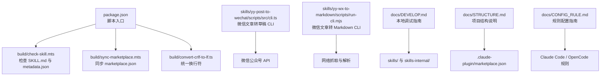
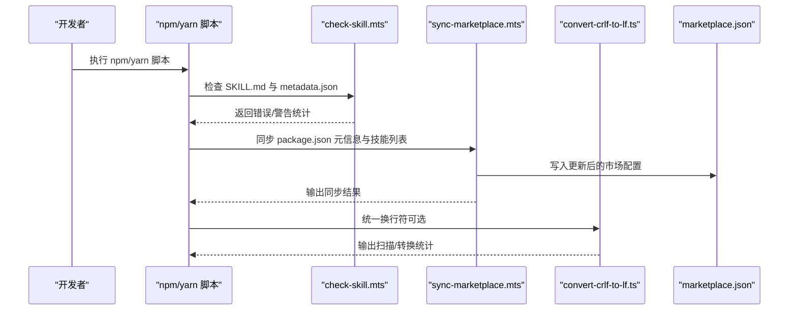
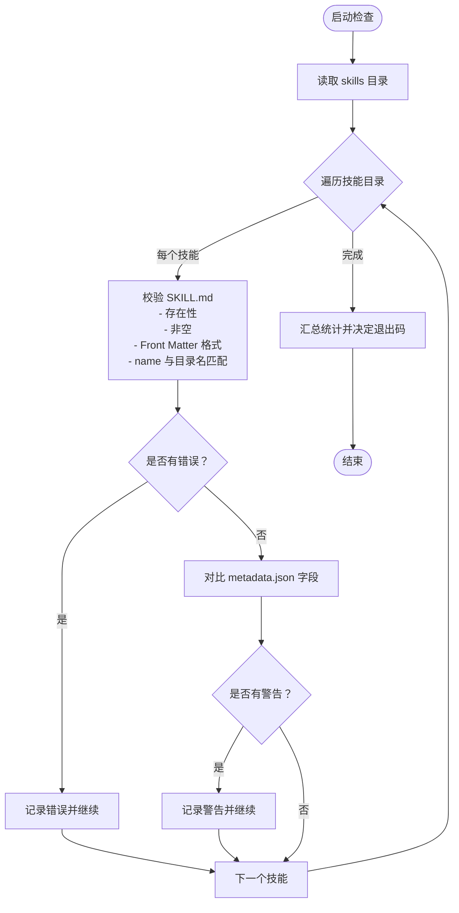
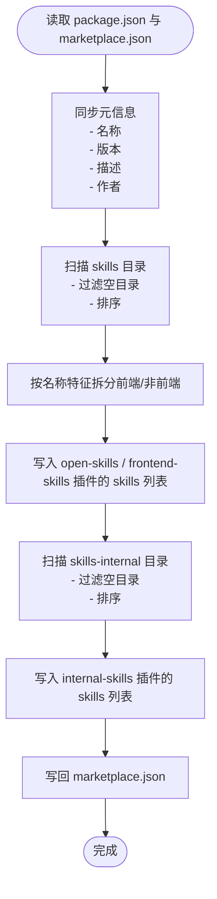
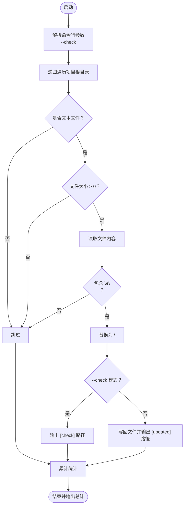
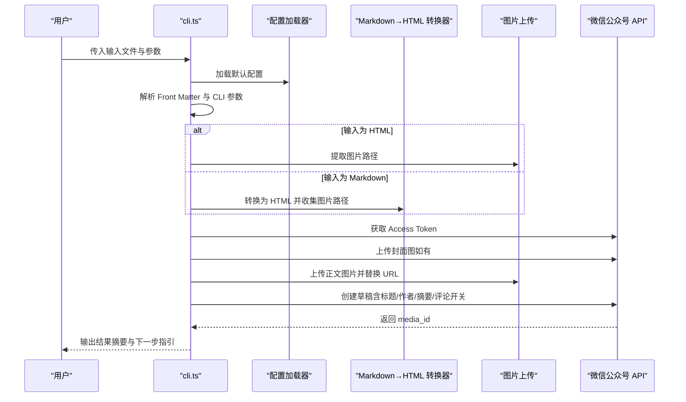
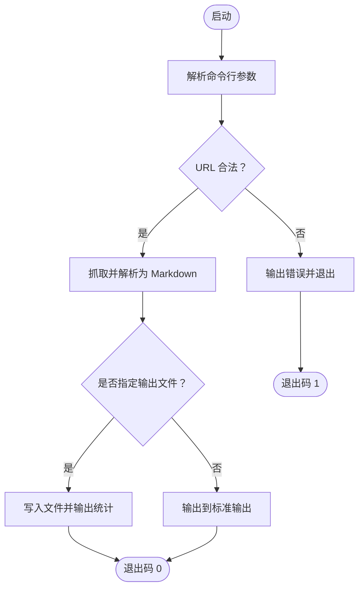
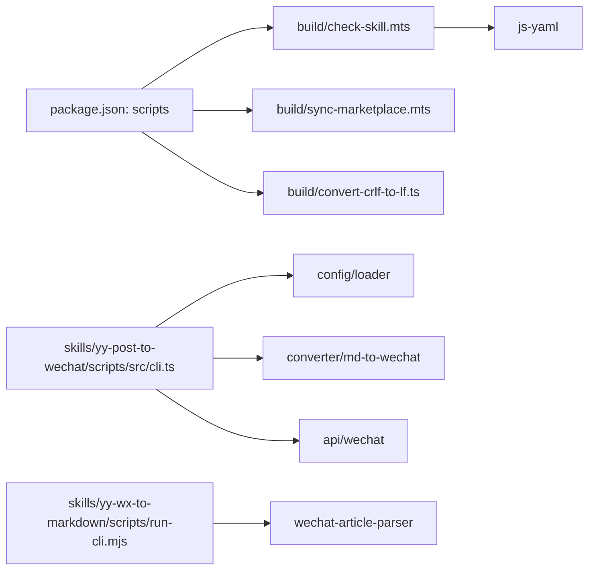

# 构建工具 API

<cite>
**本文引用的文件**
- [package.json](file://package.json)
- [check-skill.mts](file://build/check-skill.mts)
- [sync-marketplace.mts](file://build/sync-marketplace.mts)
- [convert-crlf-to-lf.ts](file://build/convert-crlf-to-lf.ts)
- [cli.ts](file://skills/yy-post-to-wechat/scripts/src/cli.ts)
- [run-cli.mjs](file://skills/yy-wx-to-markdown/scripts/run-cli.mjs)
- [DEVELOP.md](file://docs/DEVELOP.md)
- [STRUCTURE.md](file://docs/STRUCTURE.md)
- [CONFIG_RULE.md](file://docs/CONFIG_RULE.md)
</cite>

## 目录
1. [简介](#简介)
2. [项目结构](#项目结构)
3. [核心组件](#核心组件)
4. [架构总览](#架构总览)
5. [详细组件分析](#详细组件分析)
6. [依赖关系分析](#依赖关系分析)
7. [性能考量](#性能考量)
8. [故障排查指南](#故障排查指南)
9. [结论](#结论)
10. [附录](#附录)

## 简介
本文件为仓库内“构建工具”的 API 文档，聚焦以下能力：
- 命令行接口与参数选项：涵盖自动化检查、市场同步、文件转换等。
- 配置文件格式：如 marketplace.json、技能元数据、规则配置等。
- 构建流程 API：从本地开发调试到技能发布前的自动化校验与同步。
- 环境变量与输出格式控制：如何通过 CLI 参数与配置文件影响行为。
- 与技能系统的集成：如何将技能目录与市场配置联动。
- 错误处理与日志记录：统一的错误码与输出策略。
- 使用示例：覆盖常见场景的命令与参数组合。
- 扩展接口与自定义流程：如何基于现有脚本扩展新的构建步骤。

## 项目结构
仓库采用“技能 + 规则 + 构建脚本”的组织方式：
- skills/：公共技能集合，每个技能以独立目录存放，包含 SKILL.md、metadata.json 等。
- skills-internal/：内部技能集合，用于维护仓库自身。
- rules/：自定义规则集合，面向不同平台（Claude Code、OpenCode）。
- build/：构建期脚本，负责检查、同步与格式转换。
- docs/：开发与配置说明文档。
- .claude-plugin/marketplace.json：技能市场配置，定义插件与技能分组。

图表来源
- [package.json:1-46](file://package.json#L1-L46)
- [check-skill.mts:1-230](file://build/check-skill.mts#L1-L230)
- [sync-marketplace.mts:1-93](file://build/sync-marketplace.mts#L1-L93)
- [convert-crlf-to-lf.ts:1-119](file://build/convert-crlf-to-lf.ts#L1-L119)
- [cli.ts:1-264](file://skills/yy-post-to-wechat/scripts/src/cli.ts#L1-L264)
- [run-cli.mjs:1-50](file://skills/yy-wx-to-markdown/scripts/run-cli.mjs#L1-L50)
- [DEVELOP.md:1-18](file://docs/DEVELOP.md#L1-L18)
- [STRUCTURE.md:1-10](file://docs/STRUCTURE.md#L1-L10)
- [CONFIG_RULE.md:1-34](file://docs/CONFIG_RULE.md#L1-L34)

章节来源
- [STRUCTURE.md:1-10](file://docs/STRUCTURE.md#L1-L10)
- [DEVELOP.md:1-18](file://docs/DEVELOP.md#L1-L18)

## 核心组件
- 自动化检查工具：对 skills 目录下每个技能的 SKILL.md 与 metadata.json 进行一致性与格式校验。
- 市场同步工具：将 package.json 的元信息与技能目录同步至 marketplace.json，并按类型分类。
- 统一换行符工具：批量扫描文本文件，将 CRLF 转换为 LF，支持仅检查模式。
- 技能发布 CLI：将 Markdown 或 HTML 转换为微信公众号草稿，自动上传图片并创建草稿。
- 微信文章转 Markdown CLI：从微信公众号文章 URL 抓取并导出 Markdown。

章节来源
- [check-skill.mts:1-230](file://build/check-skill.mts#L1-L230)
- [sync-marketplace.mts:1-93](file://build/sync-marketplace.mts#L1-L93)
- [convert-crlf-to-lf.ts:1-119](file://build/convert-crlf-to-lf.ts#L1-L119)
- [cli.ts:1-264](file://skills/yy-post-to-wechat/scripts/src/cli.ts#L1-L264)
- [run-cli.mjs:1-50](file://skills/yy-wx-to-markdown/scripts/run-cli.mjs#L1-L50)

## 架构总览
构建工具围绕 package.json 的 scripts 统一调度，形成“检查 → 同步 → 转换”的流水线；同时提供独立 CLI 供技能发布与内容转换使用。

图表来源
- [package.json:7-16](file://package.json#L7-L16)
- [check-skill.mts:177-229](file://build/check-skill.mts#L177-L229)
- [sync-marketplace.mts:12-93](file://build/sync-marketplace.mts#L12-L93)
- [convert-crlf-to-lf.ts:56-119](file://build/convert-crlf-to-lf.ts#L56-L119)

## 详细组件分析

### 自动化检查工具（check-skill）
- 功能概述
  - 遍历 skills 目录，逐个校验 SKILL.md 的 Front Matter 格式与必需字段。
  - 对比 metadata.json 与 SKILL.md 的描述、作者、版本等字段，给出一致性警告。
  - 支持非零退出码，便于 CI 失败阻断。
- 关键参数与行为
  - 无命令行参数，全量扫描 skills 目录。
  - 通过 process.exit 控制退出码。
- 输出与日志
  - 错误：以 ❌ 标识并列出具体问题。
  - 警告：以 ⚠️ 标识，给出建议性修复提示。
- 数据模型
  - SKILL.md Front Matter 结构：name、description、icon、examples、metadata（含 author、version 等）。
  - metadata.json 结构：version、date、author、abstract、references、tags。

图表来源
- [check-skill.mts:50-122](file://build/check-skill.mts#L50-L122)
- [check-skill.mts:127-172](file://build/check-skill.mts#L127-L172)
- [check-skill.mts:177-229](file://build/check-skill.mts#L177-L229)

章节来源
- [check-skill.mts:10-36](file://build/check-skill.mts#L10-L36)
- [check-skill.mts:41-45](file://build/check-skill.mts#L41-L45)
- [check-skill.mts:50-122](file://build/check-skill.mts#L50-L122)
- [check-skill.mts:127-172](file://build/check-skill.mts#L127-L172)
- [check-skill.mts:177-229](file://build/check-skill.mts#L177-L229)

### 市场同步工具（sync-marketplace）
- 功能概述
  - 从 package.json 读取名称、版本、描述、作者等元信息，写回 marketplace.json。
  - 扫描 skills 与 skills-internal 目录，过滤空目录并按字母排序，分别填充到对应插件的 skills 列表。
  - 将前端相关技能与非前端技能拆分，分别写入 frontend-skills 与 open-skills 插件。
- 关键参数与行为
  - 无命令行参数，直接读取项目根目录文件。
- 输出与日志
  - 成功时输出同步完成提示；对空目录删除并打印删除日志。

图表来源
- [sync-marketplace.mts:12-93](file://build/sync-marketplace.mts#L12-L93)

章节来源
- [sync-marketplace.mts:12-93](file://build/sync-marketplace.mts#L12-L93)

### 统一换行符工具（convert-crlf-to-lf）
- 功能概述
  - 递归扫描项目根目录，识别文本文件（含特定扩展名与基名），将 CRLF 替换为 LF。
  - 支持 --check 仅检查模式，不修改文件。
- 关键参数与行为
  - --check：仅输出可转换文件清单，不实际写入。
- 输出与日志
  - 输出扫描与转换统计；检查模式输出 [check] 前缀，修改模式输出 [updated] 前缀。

图表来源
- [convert-crlf-to-lf.ts:56-119](file://build/convert-crlf-to-lf.ts#L56-L119)

章节来源
- [convert-crlf-to-lf.ts:7-42](file://build/convert-crlf-to-lf.ts#L7-L42)
- [convert-crlf-to-lf.ts:56-119](file://build/convert-crlf-to-lf.ts#L56-L119)

### 技能发布 CLI（yy-post-to-wechat）
- 功能概述
  - 将 Markdown 或 HTML 转换为微信公众号草稿，自动上传封面与正文图片，创建草稿并返回 media_id。
- 命令行参数
  - 输入文件：必填（Markdown 或 HTML）。
  - --theme：主题名称（默认 default）。
  - --color：颜色值（若未设置且主题为 default，则需在配置中设置 defaultColor）。
  - --title：标题（优先级：CLI > Front Matter > 提取首标题）。
  - --summary：摘要（优先级：CLI > Front Matter > 提取首段）。
  - --author：作者（优先级：CLI > Front Matter > 配置 defaultAuthor）。
  - --cover：封面图路径（优先级：CLI > Front Matter > 默认 imgs/cover.png）。
  - --no-cite：关闭引用标注。
- 配置文件
  - 通过配置加载器读取默认主题、颜色、作者、评论开关等。
- 输出与日志
  - 逐步输出操作状态（获取 Token、上传封面、上传图片、创建草稿）。
  - 最终输出文章摘要与媒体 ID，并提示后续操作入口。

图表来源
- [cli.ts:14-63](file://skills/yy-post-to-wechat/scripts/src/cli.ts#L14-L63)
- [cli.ts:76-120](file://skills/yy-post-to-wechat/scripts/src/cli.ts#L76-L120)
- [cli.ts:148-258](file://skills/yy-post-to-wechat/scripts/src/cli.ts#L148-L258)

章节来源
- [cli.ts:14-63](file://skills/yy-post-to-wechat/scripts/src/cli.ts#L14-L63)
- [cli.ts:76-120](file://skills/yy-post-to-wechat/scripts/src/cli.ts#L76-L120)
- [cli.ts:148-258](file://skills/yy-post-to-wechat/scripts/src/cli.ts#L148-L258)

### 微信文章转 Markdown CLI（yy-wx-to-markdown）
- 功能概述
  - 从微信公众号文章 URL 抓取并解析为 Markdown。
- 命令行参数
  - 必填：微信文章 URL。
  - 可选：输出文件路径（省略则输出到标准输出）。
- 行为与错误处理
  - 校验 URL 是否包含目标域名。
  - 成功时输出统计信息；失败时输出错误并以非零退出码退出。

图表来源
- [run-cli.mjs:11-49](file://skills/yy-wx-to-markdown/scripts/run-cli.mjs#L11-L49)

章节来源
- [run-cli.mjs:11-49](file://skills/yy-wx-to-markdown/scripts/run-cli.mjs#L11-L49)

## 依赖关系分析
- 脚本入口
  - package.json 的 scripts 定义了 lint、check:skill、lint:markdown、lint:lf、check:type、sync:marketplace 等任务。
- 构建脚本
  - check-skill.mts 依赖 js-yaml 解析 Front Matter。
  - sync-marketplace.mts 依赖 Node 内置 fs/path。
  - convert-crlf-to-lf.ts 使用 Node fs/promises 与路径工具。
- 技能 CLI
  - yy-post-to-wechat 的 cli.ts 依赖内部模块（配置加载、转换器、微信 API）。
  - yy-wx-to-markdown 的 run-cli.mjs 依赖内部解析模块。

图表来源
- [package.json:7-16](file://package.json#L7-L16)
- [check-skill.mts:4](file://build/check-skill.mts#L4)
- [cli.ts:4-12](file://skills/yy-post-to-wechat/scripts/src/cli.ts#L4-L12)
- [run-cli.mjs:7](file://skills/yy-wx-to-markdown/scripts/run-cli.mjs#L7)

章节来源
- [package.json:7-16](file://package.json#L7-L16)
- [check-skill.mts:4](file://build/check-skill.mts#L4)
- [cli.ts:4-12](file://skills/yy-post-to-wechat/scripts/src/cli.ts#L4-L12)
- [run-cli.mjs:7](file://skills/yy-wx-to-markdown/scripts/run-cli.mjs#L7)

## 性能考量
- 文件扫描
  - convert-crlf-to-lf.ts 采用递归遍历，忽略若干目录（.git、node_modules 等），避免不必要的 IO。
  - check-skill.mts 与 sync-marketplace.mts 仅读取必要文件，避免大文件解析。
- 并发与 I/O
  - 当前脚本为串行处理，适合仓库规模；如需提升性能，可在保证幂等的前提下引入并发（例如批量上传图片）。
- 日志与输出
  - CLI 逐步输出状态，便于定位问题；建议在 CI 中结合 --check 模式预检。

## 故障排查指南
- check-skill
  - 现象：name 与目录名不匹配、Front Matter 缺失、YAML 解析失败、metadata.json 不一致。
  - 处理：修正 SKILL.md Front Matter 与 metadata.json 字段；确保 name 与目录一致。
- sync-marketplace
  - 现象：marketplace.json 未更新、空目录未清理。
  - 处理：确认 package.json 元信息完整；检查 skills 与 skills-internal 目录权限。
- convert-crlf-to-lf
  - 现象：未检测到 CRLF 或未修改文件。
  - 处理：使用 --check 查看可转换文件；确认文件扩展名在白名单中。
- yy-post-to-wechat
  - 现象：缺少封面图、颜色未设置、API 凭证缺失。
  - 处理：通过 --cover 或 Front Matter 设置封面；在配置中设置 defaultColor；确保 appId/appSecret。
- yy-wx-to-markdown
  - 现象：URL 非法或抓取失败。
  - 处理：确认 URL 来自目标域名；检查网络连通性。

章节来源
- [check-skill.mts:58-121](file://build/check-skill.mts#L58-L121)
- [check-skill.mts:127-171](file://build/check-skill.mts#L127-L171)
- [sync-marketplace.mts:31-83](file://build/sync-marketplace.mts#L31-L83)
- [convert-crlf-to-lf.ts:66-103](file://build/convert-crlf-to-lf.ts#L66-L103)
- [cli.ts:156-205](file://skills/yy-post-to-wechat/scripts/src/cli.ts#L156-L205)
- [run-cli.mjs:23-27](file://skills/yy-wx-to-markdown/scripts/run-cli.mjs#L23-L27)

## 结论
本构建工具通过一组轻量脚本与 CLI，实现了技能质量检查、市场配置同步与内容格式统一，配合规则系统与技能目录，形成从开发到发布的闭环。建议在 CI 中串联 lint、check:skill、sync:marketplace、convert-crlf-to-lf 等步骤，确保质量与一致性。

## 附录

### 命令行接口与参数总览
- 自动化检查（check-skill）
  - 无参数，全量扫描 skills 目录。
- 市场同步（sync-marketplace）
  - 无参数，读取 package.json 与技能目录。
- 统一换行符（convert-crlf-to-lf）
  - --check：仅检查模式。
- 技能发布 CLI（yy-post-to-wechat）
  - 必填：输入文件（Markdown 或 HTML）。
  - 可选：--theme、--color、--title、--summary、--author、--cover、--no-cite。
- 微信文章转 Markdown（yy-wx-to-markdown）
  - 必填：微信文章 URL；可选：输出文件路径。

章节来源
- [check-skill.mts:177-229](file://build/check-skill.mts#L177-L229)
- [sync-marketplace.mts:12-93](file://build/sync-marketplace.mts#L12-L93)
- [convert-crlf-to-lf.ts:7](file://build/convert-crlf-to-lf.ts#L7)
- [cli.ts:14-63](file://skills/yy-post-to-wechat/scripts/src/cli.ts#L14-L63)
- [run-cli.mjs:11-18](file://skills/yy-wx-to-markdown/scripts/run-cli.mjs#L11-L18)

### 配置文件格式
- marketplace.json
  - 顶层字段：name、metadata（version、description）、owner（name）、plugins（数组）。
  - plugins 中包含 open-skills、frontend-skills、internal-skills 等插件，各插件包含 skills 列表。
- 技能元数据（SKILL.md Front Matter）
  - 必需字段：name、description。
  - 可选字段：icon、examples、metadata（author、version 等）。
- metadata.json
  - 字段：version、date、author、abstract、references、tags。
- 规则配置（OpenCode / Claude Code）
  - OpenCode：在项目根目录创建 opencode.json，配置 instructions 引用路径。
  - Claude Code：在 CLAUDE.md 中使用 @path/to/import 引入规则文件，支持多层递归。

章节来源
- [sync-marketplace.mts:12-30](file://build/sync-marketplace.mts#L12-L30)
- [check-skill.mts:10-29](file://build/check-skill.mts#L10-L29)
- [CONFIG_RULE.md:9-15](file://docs/CONFIG_RULE.md#L9-L15)
- [CONFIG_RULE.md:17-31](file://docs/CONFIG_RULE.md#L17-L31)

### 构建脚本调用与参数配置
- 调用方式
  - 通过 npm/yarn scripts 统一入口：lint、check:skill、lint:markdown、lint:lf、check:type、sync:marketplace。
- 环境变量
  - 技能发布 CLI 依赖配置文件中的 appId、appSecret；可通过环境变量注入（需在配置加载器中支持）。
- 输出格式控制
  - convert-crlf-to-lf.ts：--check 输出可转换文件清单；修改模式输出已更新文件清单。
  - 技能发布 CLI：输出文章摘要与 media_id，便于后续人工审核。

章节来源
- [package.json:7-16](file://package.json#L7-L16)
- [cli.ts:150-159](file://skills/yy-post-to-wechat/scripts/src/cli.ts#L150-L159)
- [convert-crlf-to-lf.ts:96-101](file://build/convert-crlf-to-lf.ts#L96-L101)

### 使用示例
- 全量质量检查与同步
  - npm run lint
- 仅检查技能元数据
  - npm run check:skill
- 同步市场配置
  - npm run sync:marketplace
- 统一换行符（仅检查）
  - npm run lint:lf
- 本地调试技能
  - 在根目录执行 npx skills add ./
- 技能发布到微信公众号
  - node ./skills/yy-post-to-wechat/scripts/src/cli.ts article.md --theme default --color blue
- 微信文章转 Markdown
  - node ./skills/yy-wx-to-markdown/scripts/run-cli.mjs https://mp.weixin.qq.com/s/xxx output.md

章节来源
- [package.json:7-16](file://package.json#L7-L16)
- [DEVELOP.md:10-12](file://docs/DEVELOP.md#L10-L12)
- [cli.ts:55-62](file://skills/yy-post-to-wechat/scripts/src/cli.ts#L55-L62)
- [run-cli.mjs:14-17](file://skills/yy-wx-to-markdown/scripts/run-cli.mjs#L14-L17)

### 扩展接口与自定义构建流程
- 新增检查项
  - 在 check-skill.mts 中新增字段校验逻辑，并在结果中记录错误/警告。
- 新增同步插件
  - 在 sync-marketplace.mts 中读取新目录并写入对应插件的 skills 列表。
- 新增 CLI 工具
  - 参照现有 CLI 的参数解析、配置加载与错误处理模式，保持一致的退出码与日志风格。
- 规则系统集成
  - 在 opencode.json 或 CLAUDE.md 中引入自定义规则文件，实现跨技能的一致性约束。

章节来源
- [check-skill.mts:177-229](file://build/check-skill.mts#L177-L229)
- [sync-marketplace.mts:52-83](file://build/sync-marketplace.mts#L52-L83)
- [CONFIG_RULE.md:9-15](file://docs/CONFIG_RULE.md#L9-L15)
- [CONFIG_RULE.md:17-31](file://docs/CONFIG_RULE.md#L17-L31)