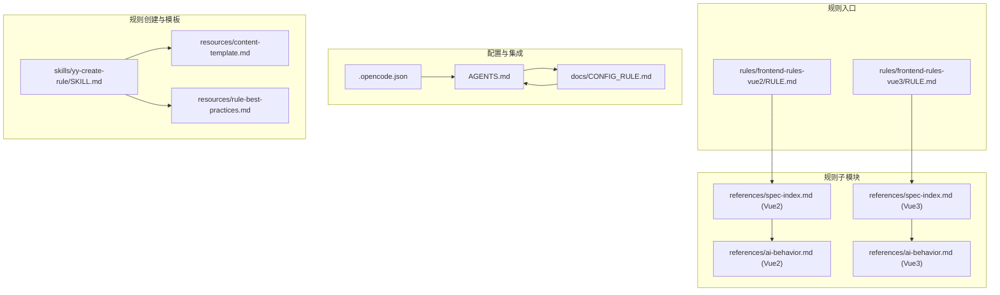
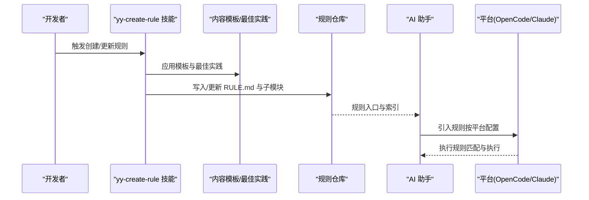
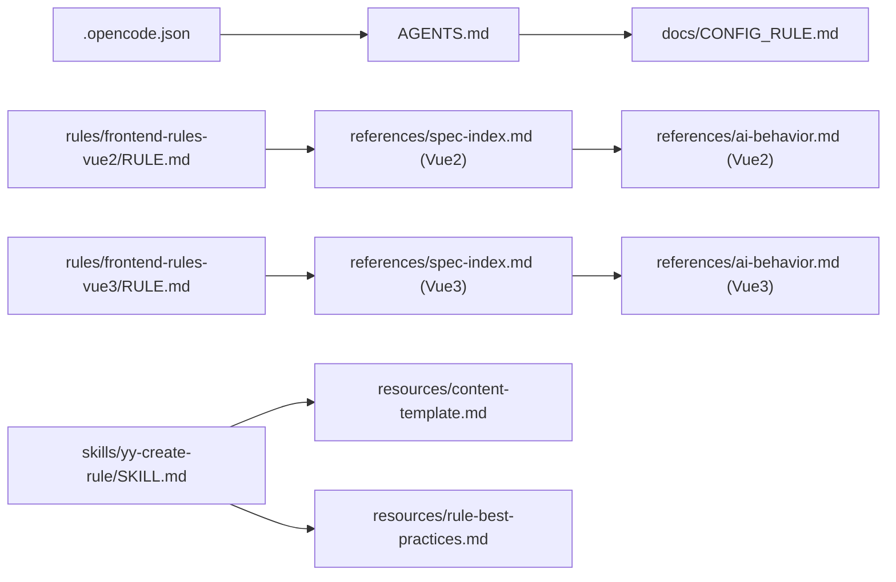

# 规则 API

<cite>
**本文引用的文件**
- [RULE.md（Vue2 规则入口）](file://rules/frontend-rules-vue2/RULE.md)
- [RULE.md（Vue3 规则入口）](file://rules/frontend-rules-vue3/RULE.md)
- [metadata.json（Vue3 规则结构元数据）](file://rules/frontend-rules-vue3/metadata.json)
- [CONFIG_RULE.md（规则配置与引入）](file://docs/CONFIG_RULE.md)
- [AGENTS.md（项目规则与知识库总纲）](file://AGENTS.md)
- [.opencode.json（OpenCode 规则注入配置）](file://.opencode.json)
- [SKILL.md（yy-create-rule 技能）](file://skills/yy-create-rule/SKILL.md)
- [content-template.md（规则内容模板）](file://skills/yy-create-rule/resources/content-template.md)
- [rule-best-practices.md（规则编写最佳实践）](file://skills/yy-create-rule/resources/rule-best-practices.md)
- [spec-index.md（Vue2 规则总纲索引）](file://rules/frontend-rules-vue2/references/spec-index.md)
- [spec-index.md（Vue3 规则总纲索引）](file://rules/frontend-rules-vue3/references/spec-index.md)
- [ai-behavior.md（Vue2 AI 行为约束）](file://rules/frontend-rules-vue2/references/ai-behavior.md)
- [ai-behavior.md（Vue3 AI 行为约束）](file://rules/frontend-rules-vue3/references/ai-behavior.md)
- [RULE.md（Markdown 规范）](file://rules/markdown/RULE.md)
</cite>

## 目录
1. [简介](#简介)
2. [项目结构](#项目结构)
3. [核心组件](#核心组件)
4. [架构总览](#架构总览)
5. [详细组件分析](#详细组件分析)
6. [依赖分析](#依赖分析)
7. [性能考量](#性能考量)
8. [故障排查指南](#故障排查指南)
9. [结论](#结论)
10. [附录](#附录)

## 简介
本文件为“规则系统”的 API 文档，聚焦 RULE.md 的格式规范与结构定义，覆盖规则类型、应用范围与执行逻辑；详解前端开发规则的 API 接口（Vue2/Vue3 特定规则集）；说明规则的应用机制（注册、匹配与执行顺序）；提供规则创建与自定义指南（模板与最佳实践）；解释规则与技能系统的集成方式及验证测试方法；并给出完整规则示例与扩展接口指引。

## 项目结构
规则系统围绕“规则入口文件 + 子模块索引 + AI 行为约束 + 配置注入”组织，形成“入口 + 分类索引 + 元数据 + 引入配置”的闭环。

图表来源
- [RULE.md（Vue2 规则入口）:1-62](file://rules/frontend-rules-vue2/RULE.md#L1-L62)
- [RULE.md（Vue3 规则入口）:1-68](file://rules/frontend-rules-vue3/RULE.md#L1-L68)
- [spec-index.md（Vue2 规则总纲索引）:1-61](file://rules/frontend-rules-vue2/references/spec-index.md#L1-L61)
- [spec-index.md（Vue3 规则总纲索引）:1-60](file://rules/frontend-rules-vue3/references/spec-index.md#L1-L60)
- [ai-behavior.md（Vue2 AI 行为约束）:1-29](file://rules/frontend-rules-vue2/references/ai-behavior.md#L1-L29)
- [ai-behavior.md（Vue3 AI 行为约束）:1-29](file://rules/frontend-rules-vue3/references/ai-behavior.md#L1-L29)
- [CONFIG_RULE.md（规则配置与引入）:1-34](file://docs/CONFIG_RULE.md#L1-L34)
- [AGENTS.md（项目规则与知识库总纲）:1-155](file://AGENTS.md#L1-L155)
- [.opencode.json（OpenCode 规则注入配置）:1-14](file://.opencode.json#L1-L14)
- [SKILL.md（yy-create-rule 技能）:1-133](file://skills/yy-create-rule/SKILL.md#L1-L133)
- [content-template.md（规则内容模板）:1-122](file://skills/yy-create-rule/resources/content-template.md#L1-L122)
- [rule-best-practices.md（规则编写最佳实践）:1-92](file://skills/yy-create-rule/resources/rule-best-practices.md#L1-L92)

章节来源
- [RULE.md（Vue2 规则入口）:1-62](file://rules/frontend-rules-vue2/RULE.md#L1-L62)
- [RULE.md（Vue3 规则入口）:1-68](file://rules/frontend-rules-vue3/RULE.md#L1-L68)
- [CONFIG_RULE.md（规则配置与引入）:1-34](file://docs/CONFIG_RULE.md#L1-L34)
- [AGENTS.md（项目规则与知识库总纲）:1-155](file://AGENTS.md#L1-L155)
- [.opencode.json（OpenCode 规则注入配置）:1-14](file://.opencode.json#L1-L14)

## 核心组件
- 规则入口文件（RULE.md）
  - 定义规则描述、是否始终应用、适用范围、快速导航与模块索引。
  - Vue2/Vue3 分别提供独立入口，承载各自子模块与优先级分类。
- 规则总纲索引（references/spec-index.md）
  - 以“基础规范/强烈推荐/风格指南”三级优先级组织规则要点，提供“详见”链接直达子模块。
- AI 行为约束（references/ai-behavior.md）
  - 明确修改权限、文档生成与直接输出的边界，限定规则作用范围。
- 规则元数据（metadata.json，Vue3）
  - 描述版本、作者、摘要、标签与结构（分类与子模块数量），便于自动化集成与校验。
- 配置与引入（docs/CONFIG_RULE.md、AGENTS.md、.opencode.json）
  - 定义规则文件在不同平台（OpenCode、Claude Code）的引入方式与路径格式。
- 规则创建与模板（skills/yy-create-rule、resources/*）
  - 提供规则内容结构模板、最佳实践与创建流程，支撑规则的持续演进。

章节来源
- [RULE.md（Vue2 规则入口）:1-62](file://rules/frontend-rules-vue2/RULE.md#L1-L62)
- [RULE.md（Vue3 规则入口）:1-68](file://rules/frontend-rules-vue3/RULE.md#L1-L68)
- [metadata.json（Vue3 规则结构元数据）:1-17](file://rules/frontend-rules-vue3/metadata.json#L1-L17)
- [spec-index.md（Vue2 规则总纲索引）:1-61](file://rules/frontend-rules-vue2/references/spec-index.md#L1-L61)
- [spec-index.md（Vue3 规则总纲索引）:1-60](file://rules/frontend-rules-vue3/references/spec-index.md#L1-L60)
- [ai-behavior.md（Vue2 AI 行为约束）:1-29](file://rules/frontend-rules-vue2/references/ai-behavior.md#L1-L29)
- [ai-behavior.md（Vue3 AI 行为约束）:1-29](file://rules/frontend-rules-vue3/references/ai-behavior.md#L1-L29)
- [CONFIG_RULE.md（规则配置与引入）:1-34](file://docs/CONFIG_RULE.md#L1-L34)
- [AGENTS.md（项目规则与知识库总纲）:1-155](file://AGENTS.md#L1-L155)
- [.opencode.json（OpenCode 规则注入配置）:1-14](file://.opencode.json#L1-L14)
- [SKILL.md（yy-create-rule 技能）:1-133](file://skills/yy-create-rule/SKILL.md#L1-L133)
- [content-template.md（规则内容模板）:1-122](file://skills/yy-create-rule/resources/content-template.md#L1-L122)
- [rule-best-practices.md（规则编写最佳实践）:1-92](file://skills/yy-create-rule/resources/rule-best-practices.md#L1-L92)

## 架构总览
规则系统以“入口文件 + 子模块索引 + 行为约束 + 配置注入”为核心，形成“规则定义—平台引入—AI 执行—持续演进”的闭环。

图表来源
- [SKILL.md（yy-create-rule 技能）:1-133](file://skills/yy-create-rule/SKILL.md#L1-L133)
- [content-template.md（规则内容模板）:1-122](file://skills/yy-create-rule/resources/content-template.md#L1-L122)
- [rule-best-practices.md（规则编写最佳实践）:1-92](file://skills/yy-create-rule/resources/rule-best-practices.md#L1-L92)
- [RULE.md（Vue2 规则入口）:1-62](file://rules/frontend-rules-vue2/RULE.md#L1-L62)
- [RULE.md（Vue3 规则入口）:1-68](file://rules/frontend-rules-vue3/RULE.md#L1-L68)
- [CONFIG_RULE.md（规则配置与引入）:1-34](file://docs/CONFIG_RULE.md#L1-L34)

## 详细组件分析

### 规则入口文件（RULE.md）格式规范与结构定义
- 文件头（YAML 片段）
  - 字段：description、alwaysApply（布尔，决定是否始终应用）
  - 用途：向平台与 AI 提供规则概览与执行策略
- 主题与结构
  - 标题：规则总标题
  - 子模块索引：按“总纲索引/模块列表”组织，支持跨文件引用
  - 适用范围：明确目录约束与文件类型
  - 快速导航：表格化索引核心模块与要点
- Vue2 与 Vue3 的差异
  - Vue2：强调 Options API、src 目录下 .vue/.js/.css 等文件
  - Vue3：强调 <script setup>、支持 .ts、src 目录下 .vue/.ts/.js 等文件
- 执行逻辑
  - alwaysApply=true 时，AI 在满足适用范围前提下优先应用该规则
  - 子模块通过“总纲索引”与“AI 行为约束”共同决定具体执行边界

章节来源
- [RULE.md（Vue2 规则入口）:1-62](file://rules/frontend-rules-vue2/RULE.md#L1-L62)
- [RULE.md（Vue3 规则入口）:1-68](file://rules/frontend-rules-vue3/RULE.md#L1-L68)

### 规则总纲索引（references/spec-index.md）
- 三级优先级组织
  - 基础规范（Essential）：规避错误与潜在 Bug 的强制规则
  - 强烈推荐（Strongly Recommended）：提升可读性与开发体验的高价值规则
  - 风格指南（Recommended）：统一风格的实践建议
- 导航与链接
  - 每条规则提供“详见”链接，指向具体子模块
  - AI 行为约束单独列出，作为执行边界

章节来源
- [spec-index.md（Vue2 规则总纲索引）:1-61](file://rules/frontend-rules-vue2/references/spec-index.md#L1-L61)
- [spec-index.md（Vue3 规则总纲索引）:1-60](file://rules/frontend-rules-vue3/references/spec-index.md#L1-L60)

### AI 行为约束（references/ai-behavior.md）
- 适用范围：限定在 src 目录下的文件
- 行为准则
  - 直接输出：允许在对话中直接输出文字说明、总结或代码片段
  - 文档生成：允许修改注释与 JSDoc，禁止未经明确要求创建 README 等
  - 修改权限：允许修改注释与 JSDoc、允许修改 src 目录下文件；禁止修改 src 目录外文件（特殊需求除外）

章节来源
- [ai-behavior.md（Vue2 AI 行为约束）:1-29](file://rules/frontend-rules-vue2/references/ai-behavior.md#L1-L29)
- [ai-behavior.md（Vue3 AI 行为约束）:1-29](file://rules/frontend-rules-vue3/references/ai-behavior.md#L1-L29)

### 规则元数据（metadata.json，Vue3）
- 字段：version、date、author、abstract、tags、structure（分类与子模块数量）
- 用途：辅助自动化工具识别结构、生成索引与校验规则完整性

章节来源
- [metadata.json（Vue3 规则结构元数据）:1-17](file://rules/frontend-rules-vue3/metadata.json#L1-L17)

### 规则创建与自定义（yy-create-rule 技能）
- 流程
  - 意图捕获：内容类型（最佳实践/规范约定/bug 修复/架构决策）、适用范围、核心要点
  - 初始化：检查规则目录与 AGENTS.md
  - 决策：在现有文档中插入、创建新文档或追加内容
  - 格式化：依据模板与最佳实践组织内容
  - 更新：必要时更新 AGENTS.md 引用
- 模板与最佳实践
  - 内容模板：章节结构、示例与注意事项的标准化格式
  - 最佳实践：面向 AI 的可操作性、具体示例、避免碎片化与重复

章节来源
- [SKILL.md（yy-create-rule 技能）:1-133](file://skills/yy-create-rule/SKILL.md#L1-L133)
- [content-template.md（规则内容模板）:1-122](file://skills/yy-create-rule/resources/content-template.md#L1-L122)
- [rule-best-practices.md（规则编写最佳实践）:1-92](file://skills/yy-create-rule/resources/rule-best-practices.md#L1-L92)

### 规则应用机制（注册、匹配与执行顺序）
- 注册
  - OpenCode：在 opencode.json 的 instructions 中加入规则路径
  - Claude Code：在 CLAUDE.md 中使用 @path/to/import 引入，支持最多 5 层递归
- 匹配算法
  - 以 RULE.md 的适用范围与 AI 行为约束为过滤条件
  - alwaysApply=true 的规则在满足范围条件下优先匹配
  - 子模块通过 spec-index.md 的“详见”链接参与匹配
- 执行顺序
  - 先执行基础规范（Essential），再执行强烈推荐（Strongly Recommended），最后风格指南（Recommended）
  - 子模块内的具体顺序以子模块内部规范为准

章节来源
- [CONFIG_RULE.md（规则配置与引入）:1-34](file://docs/CONFIG_RULE.md#L1-L34)
- [AGENTS.md（项目规则与知识库总纲）:1-155](file://AGENTS.md#L1-L155)
- [.opencode.json（OpenCode 规则注入配置）:1-14](file://.opencode.json#L1-L14)
- [RULE.md（Vue2 规则入口）:1-62](file://rules/frontend-rules-vue2/RULE.md#L1-L62)
- [RULE.md（Vue3 规则入口）:1-68](file://rules/frontend-rules-vue3/RULE.md#L1-L68)
- [spec-index.md（Vue2 规则总纲索引）:1-61](file://rules/frontend-rules-vue2/references/spec-index.md#L1-L61)
- [spec-index.md（Vue3 规则总纲索引）:1-60](file://rules/frontend-rules-vue3/references/spec-index.md#L1-L60)

### 规则与技能系统的集成
- AGENTS.md 作为“智能体编码指南”，集中列出关键参考与需要遵守的规则
- 技能（如 yy-create-rule）负责规则的创建、更新与维护，确保规则与 AGENTS.md 的引用一致性
- 平台配置（OpenCode/Claude）通过 instructions/imports 将规则注入 AI 执行环境

章节来源
- [AGENTS.md（项目规则与知识库总纲）:1-155](file://AGENTS.md#L1-L155)
- [SKILL.md（yy-create-rule 技能）:1-133](file://skills/yy-create-rule/SKILL.md#L1-L133)
- [CONFIG_RULE.md（规则配置与引入）:1-34](file://docs/CONFIG_RULE.md#L1-L34)

### 规则验证与测试方法
- 内容一致性验证
  - 交叉比对：比较多个文件对同一事项的规定，识别结构性矛盾
  - 分类组织：用“类别-数量”方式组织发现，标注矛盾点位置
- 目标驱动执行
  - 将任务转化为可验证目标，循环推进直至验证通过
- 逆向逻辑验证
  - 从预期结果反推规则是否合理，检验描述是否显式化

章节来源
- [AGENTS.md（项目规则与知识库总纲）:95-120](file://AGENTS.md#L95-L120)

### 规则示例与应用场景
- Vue2 示例
  - 组件开发：Options API 结构、name 声明、JSDoc、元素顺序、方法职责、页面拆分
  - 交互通信：Props 定义、Emit 白名单、$refs 访问、provide/inject、禁用 $parent
  - 模板指令：v-for/key、v-if 冲突、v-html 安全、指令简写、属性顺序
  - 结构顺序：3 组 import 排序、<script> 内部 8 段 Options 结构
  - 命名规范：文件/组件/API/事件/常量/布尔值/BEM
  - 网络请求：async/await、单次解构、防重复提交、安全规范、== 偏好
  - 代码风格：Prettier 配置、箭头函数优先
  - 注释规范：模板/脚本/样式区注释格式、注释保护原则
  - CSS 样式：BEM 命名、scoped 优先、全局样式标注
  - 性能优化：懒加载、KeepAlive、虚拟滚动、防抖节流、$set 响应式陷阱
  - 约束清单：禁止项/推荐项/注意事项速查表
- Vue3 示例
  - 组件开发：<script setup> 脚本结构、JSDoc、元素顺序、方法职责、页面拆分
  - 交互通信：Props 定义、Emit 白名单、defineExpose、provide/inject、禁用 $parent/$children
  - 模板指令：v-for/key、v-if 冲突、v-html 安全、指令简写、属性顺序
  - 结构顺序：4 组 import 排序、<script setup> 内部 5 段结构
  - 命名规范：文件/组件/API/事件/常量/布尔值/Hooks（Props/Emit 详见交互通信）
  - Hooks：命名/返回值/使用规范、抽离建议、组件中导入顺序
  - 响应式：ref 优先、reactive 转 ref、computed 规范、try/catch 包裹
  - 监听：watch 深度/立即、清理资源、与 computed 选择策略
  - 网络请求：async/await、统一响应解构、错误处理、安全规范
  - 代码风格：Prettier 配置、箭头函数优先
  - 注释：模板/脚本/样式注释格式、注释保护原则
  - CSS/BEM：BEM 命名、scoped 优先、自定义指令
  - TypeScript：禁止 any/as any/@ts-ignore、类型注解规范、import type
  - 性能：懒加载、KeepAlive、虚拟滚动、防抖节流、图片优化
  - 约束清单：10 项禁止、5 项推荐、2 项不推荐、注意事项

章节来源
- [RULE.md（Vue2 规则入口）:1-62](file://rules/frontend-rules-vue2/RULE.md#L1-L62)
- [RULE.md（Vue3 规则入口）:1-68](file://rules/frontend-rules-vue3/RULE.md#L1-L68)
- [spec-index.md（Vue2 规则总纲索引）:1-61](file://rules/frontend-rules-vue2/references/spec-index.md#L1-L61)
- [spec-index.md（Vue3 规则总纲索引）:1-60](file://rules/frontend-rules-vue3/references/spec-index.md#L1-L60)

### 扩展接口与自定义规则开发指南
- 自定义规则创建
  - 使用 yy-create-rule 技能捕获意图、初始化目录与文件、决定放置位置、格式化并插入内容、更新 AGENTS.md 引用
  - 遵循内容模板与最佳实践，确保规则面向 AI 的可操作性与一致性
- 平台集成
  - OpenCode：在 opencode.json 的 instructions 中加入自定义规则路径
  - Claude Code：在 CLAUDE.md 中使用 @path/to/import 引入自定义规则文件
- 元数据与结构
  - Vue3 规则可提供 metadata.json，描述版本、摘要、标签与结构，便于自动化工具识别与校验

章节来源
- [SKILL.md（yy-create-rule 技能）:1-133](file://skills/yy-create-rule/SKILL.md#L1-L133)
- [content-template.md（规则内容模板）:1-122](file://skills/yy-create-rule/resources/content-template.md#L1-L122)
- [rule-best-practices.md（规则编写最佳实践）:1-92](file://skills/yy-create-rule/resources/rule-best-practices.md#L1-L92)
- [CONFIG_RULE.md（规则配置与引入）:1-34](file://docs/CONFIG_RULE.md#L1-L34)
- [metadata.json（Vue3 规则结构元数据）:1-17](file://rules/frontend-rules-vue3/metadata.json#L1-L17)

## 依赖分析
规则系统的关键依赖关系如下：

图表来源
- [AGENTS.md（项目规则与知识库总纲）:1-155](file://AGENTS.md#L1-L155)
- [CONFIG_RULE.md（规则配置与引入）:1-34](file://docs/CONFIG_RULE.md#L1-L34)
- [.opencode.json（OpenCode 规则注入配置）:1-14](file://.opencode.json#L1-L14)
- [RULE.md（Vue2 规则入口）:1-62](file://rules/frontend-rules-vue2/RULE.md#L1-L62)
- [RULE.md（Vue3 规则入口）:1-68](file://rules/frontend-rules-vue3/RULE.md#L1-L68)
- [spec-index.md（Vue2 规则总纲索引）:1-61](file://rules/frontend-rules-vue2/references/spec-index.md#L1-L61)
- [spec-index.md（Vue3 规则总纲索引）:1-60](file://rules/frontend-rules-vue3/references/spec-index.md#L1-L60)
- [ai-behavior.md（Vue2 AI 行为约束）:1-29](file://rules/frontend-rules-vue2/references/ai-behavior.md#L1-L29)
- [ai-behavior.md（Vue3 AI 行为约束）:1-29](file://rules/frontend-rules-vue3/references/ai-behavior.md#L1-L29)
- [SKILL.md（yy-create-rule 技能）:1-133](file://skills/yy-create-rule/SKILL.md#L1-L133)
- [content-template.md（规则内容模板）:1-122](file://skills/yy-create-rule/resources/content-template.md#L1-L122)
- [rule-best-practices.md（规则编写最佳实践）:1-92](file://skills/yy-create-rule/resources/rule-best-practices.md#L1-L92)

章节来源
- [AGENTS.md（项目规则与知识库总纲）:1-155](file://AGENTS.md#L1-L155)
- [CONFIG_RULE.md（规则配置与引入）:1-34](file://docs/CONFIG_RULE.md#L1-L34)
- [.opencode.json（OpenCode 规则注入配置）:1-14](file://.opencode.json#L1-L14)
- [RULE.md（Vue2 规则入口）:1-62](file://rules/frontend-rules-vue2/RULE.md#L1-L62)
- [RULE.md（Vue3 规则入口）:1-68](file://rules/frontend-rules-vue3/RULE.md#L1-L68)
- [spec-index.md（Vue2 规则总纲索引）:1-61](file://rules/frontend-rules-vue2/references/spec-index.md#L1-L61)
- [spec-index.md（Vue3 规则总纲索引）:1-60](file://rules/frontend-rules-vue3/references/spec-index.md#L1-L60)
- [ai-behavior.md（Vue2 AI 行为约束）:1-29](file://rules/frontend-rules-vue2/references/ai-behavior.md#L1-L29)
- [ai-behavior.md（Vue3 AI 行为约束）:1-29](file://rules/frontend-rules-vue3/references/ai-behavior.md#L1-L29)
- [SKILL.md（yy-create-rule 技能）:1-133](file://skills/yy-create-rule/SKILL.md#L1-L133)
- [content-template.md（规则内容模板）:1-122](file://skills/yy-create-rule/resources/content-template.md#L1-L122)
- [rule-best-practices.md（规则编写最佳实践）:1-92](file://skills/yy-create-rule/resources/rule-best-practices.md#L1-L92)

## 性能考量
- 规则规模与解析成本
  - 入口文件与索引文件体量适中，解析成本低；子模块按需引用，避免一次性加载全部内容
- 执行效率
  - alwaysApply=true 的规则在满足范围条件下优先匹配，减少不必要的扫描
  - 三级优先级组织使 AI 能快速定位关键规则，降低执行开销
- 维护成本
  - 元数据与模板化流程降低规则维护成本，提高一致性与可扩展性

## 故障排查指南
- 规则未生效
  - 检查 opencode.json 或 CLAUDE.md 中的规则路径是否正确
  - 确认 RULE.md 的适用范围与 AI 行为约束是否覆盖当前文件
- 内容不一致
  - 使用交叉比对法识别矛盾点，按“类别-数量”组织发现并同步修改关联文件
- 创建规则失败
  - 确认 AGENTS.md 是否存在，必要时使用初始化模板创建
  - 遵循内容模板与最佳实践，避免碎片化与重复

章节来源
- [CONFIG_RULE.md（规则配置与引入）:1-34](file://docs/CONFIG_RULE.md#L1-L34)
- [AGENTS.md（项目规则与知识库总纲）:95-120](file://AGENTS.md#L95-L120)
- [SKILL.md（yy-create-rule 技能）:48-51](file://skills/yy-create-rule/SKILL.md#L48-L51)

## 结论
规则系统通过“入口文件 + 子模块索引 + 行为约束 + 配置注入 + 模板化创建流程”构建了可维护、可扩展、可验证的规则生态。Vue2/Vue3 规则分别覆盖 Options API 与 Composition API 的开发场景，结合 AI 行为约束与三级优先级组织，确保规则在不同平台与环境下稳定执行。通过元数据与模板化流程，规则的创建与演进具备高度一致性与可操作性。

## 附录
- Markdown 规范（rules/markdown/RULE.md）
  - 代码块语言标识：所有围栏代码块必须声明语言
  - 内容格式选择：简单键值对映射优先使用列表而非表格
  - 常用语言标识对照：Shell/YAML/JSON/TypeScript/JavaScript/Markdown/文本等

章节来源
- [RULE.md（Markdown 规范）:1-79](file://rules/markdown/RULE.md#L1-L79)