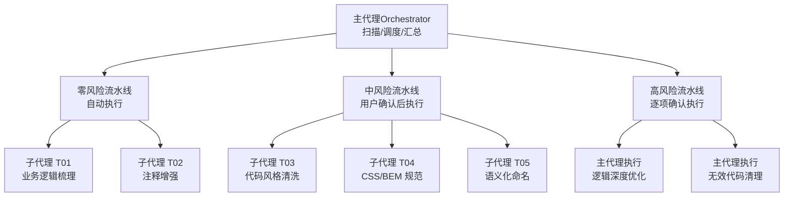
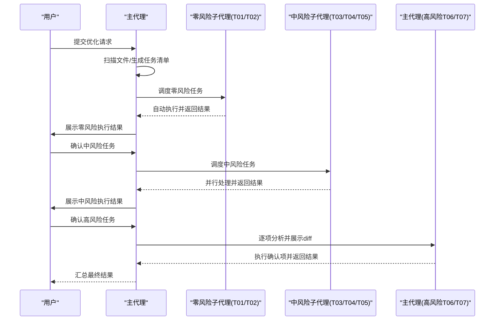
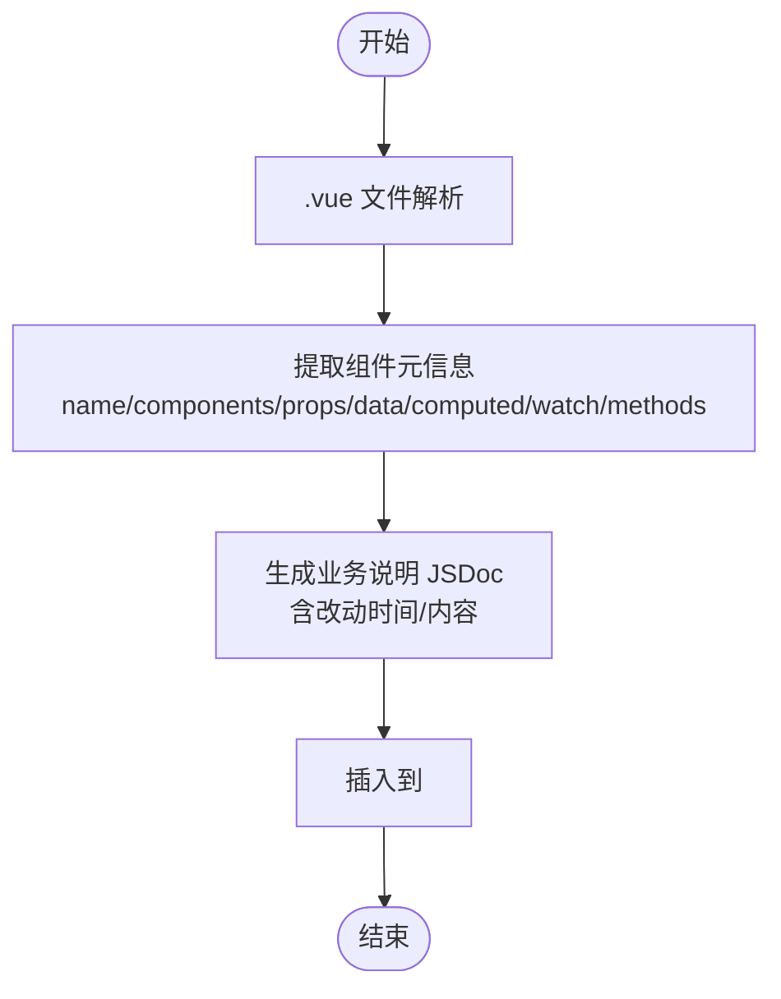
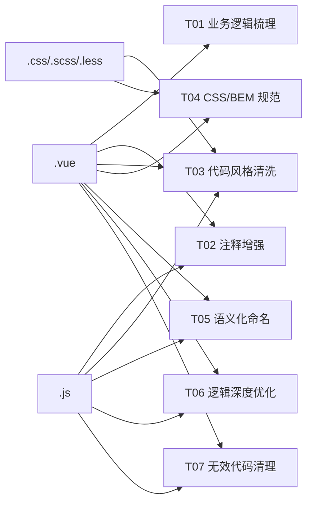

# Vue2 代码优化工具

<cite>
**本文引用的文件**
- [SKILL.md](file://skills/yy-frontend-vue2-code-optimization/SKILL.md)
- [business-logic.md](file://skills/yy-frontend-vue2-code-optimization/sub-skills/business-logic.md)
- [css-style.md](file://skills/yy-frontend-vue2-code-optimization/sub-skills/css-style.md)
- [naming.md](file://skills/yy-frontend-vue2-code-optimization/sub-skills/naming.md)
- [performance.md](file://skills/yy-frontend-vue2-code-optimization/rules/performance.md)
- [code-style.md](file://skills/yy-frontend-vue2-code-optimization/rules/code-style.md)
- [naming.md](file://skills/yy-frontend-vue2-code-optimization/rules/naming.md)
- [order.md](file://skills/yy-frontend-vue2-code-optimization/rules/order.md)
- [directives.md](file://skills/yy-frontend-vue2-code-optimization/rules/directives.md)
- [comments.md](file://skills/yy-frontend-vue2-code-optimization/rules/comments.md)
- [constraints.md](file://skills/yy-frontend-vue2-code-optimization/rules/constraints.md)
- [.prettierrc.json](file://skills/yy-frontend-vue2-code-optimization/assets/.prettierrc.json)
</cite>

## 目录
1. [简介](#简介)
2. [项目结构](#项目结构)
3. [核心组件](#核心组件)
4. [架构总览](#架构总览)
5. [详细组件分析](#详细组件分析)
6. [依赖分析](#依赖分析)
7. [性能考虑](#性能考虑)
8. [故障排查指南](#故障排查指南)
9. [结论](#结论)
10. [附录](#附录)

## 简介
本工具面向 Vue2 项目（Options API），提供系统化的代码优化与重构能力，覆盖性能优化、代码风格、命名规范、注释增强、CSS/BEM 规范、逻辑深度优化与无效代码清理等。工具采用“零风险自动执行 + 中风险确认执行 + 高风险逐项确认”的三级风险控制，确保在不改变业务逻辑的前提下提升代码质量与可维护性。

## 项目结构
该技能包围绕“主代理 + 多子代理”的流水线架构组织，按任务风险等级划分执行通道，支持对 .vue、.js、.css/.scss/.less 文件的差异化处理。

图表来源
- [SKILL.md:72-120](file://skills/yy-frontend-vue2-code-optimization/SKILL.md#L72-L120)

章节来源
- [SKILL.md:18-54](file://skills/yy-frontend-vue2-code-optimization/SKILL.md#L18-L54)
- [SKILL.md:122-130](file://skills/yy-frontend-vue2-code-optimization/SKILL.md#L122-L130)

## 核心组件
- 主代理（Orchestrator）：负责文件扫描、任务清单生成、按风险等级分组、子代理调度、结果汇总与输出。
- 子代理（T01-T05）：独立处理特定任务，职责单一、可并行、故障隔离。
- 高风险任务（T06、T07）：由主代理逐项分析，展示 diff 预览后用户确认执行，确保可控性。

章节来源
- [SKILL.md:72-120](file://skills/yy-frontend-vue2-code-optimization/SKILL.md#L72-L120)
- [SKILL.md:132-164](file://skills/yy-frontend-vue2-code-optimization/SKILL.md#L132-L164)

## 架构总览
整体执行流程分为四个阶段：文件扫描、任务清单生成、零风险自动执行、中/高风险确认执行。中风险任务需用户确认后执行，高风险任务逐项展示 diff 并确认。

图表来源
- [SKILL.md:134-155](file://skills/yy-frontend-vue2-code-optimization/SKILL.md#L134-L155)

章节来源
- [SKILL.md:132-164](file://skills/yy-frontend-vue2-code-optimization/SKILL.md#L132-L164)

## 详细组件分析

### 任务 T01：业务逻辑梳理（零风险）
- 目标：在 .vue 组件 `<script>` 顶部生成结构化业务说明 JSDoc，记录组件职责、数据来源、交互关系与核心流程。
- 输出：包含改动时间与改动内容的注释块，支持多次改动追加，倒序排列。
- 与规则关联：组件职责、数据流、交互关系、核心流程等维度。

图表来源
- [business-logic.md:13-78](file://skills/yy-frontend-vue2-code-optimization/sub-skills/business-logic.md#L13-L78)

章节来源
- [business-logic.md:1-127](file://skills/yy-frontend-vue2-code-optimization/sub-skills/business-logic.md#L1-L127)

### 任务 T02：注释增强（零风险）
- 目标：为模板区、脚本区、样式区添加必要的注释，遵循“只增不改”原则，保持注释与代码行为一致。
- 输出：模板注释、行内注释、JSDoc、样式模块注释等。

章节来源
- [comments.md:1-106](file://skills/yy-frontend-vue2-code-optimization/rules/comments.md#L1-L106)

### 任务 T03：代码风格与格式清洗（中风险）
- 目标：优先使用 Prettier 格式化；其次按导入分组与顺序、Options API 结构顺序、模板属性顺序进行规范化。
- 关键规则：
  - 导入分组：外部依赖 → 内部全局 → 内部相对，组间空一行，组内字母排序。
  - Options API 顺序：name → components → props → data → computed → watch → methods → 生命周期。
  - 模板属性顺序：is → v-for → v-if/v-else-if/v-else → v-show/v-cloak → id → props/attrs → v-on → v-html/v-text → v-slot。

章节来源
- [code-style.md:1-63](file://skills/yy-frontend-vue2-code-optimization/rules/code-style.md#L1-L63)
- [order.md:1-131](file://skills/yy-frontend-vue2-code-optimization/rules/order.md#L1-L131)

### 任务 T04：CSS/BEM 规范（中风险）
- 目标：将类名转换为 BEM 规范，限制嵌套深度，推荐使用 scoped 样式，模板 class 属性需同步修改。
- 关键规则：
  - 块/元素/修饰符：block、block__element、block--modifier。
  - 嵌套最大深度 2 层，推荐使用 `&` 引用父选择器。
  - scoped 样式修改需同步更新模板 class 属性。
  - 响应式适配、定位层级、内外边距方向等布局建议。

章节来源
- [css-style.md:1-323](file://skills/yy-frontend-vue2-code-optimization/sub-skills/css-style.md#L1-L323)

### 任务 T05：语义化命名重构（中风险）
- 目标：对 API 函数、事件函数、常量、Props/Emits、布尔值、变量/方法等进行语义化命名，必要时进行全局替换。
- 风险控制：使用 LSP/AST-grep 全局查找，逐项 diff 预览，确认后执行。

章节来源
- [naming.md:1-41](file://skills/yy-frontend-vue2-code-optimization/sub-skills/naming.md#L1-L41)
- [naming.md:1-73](file://skills/yy-frontend-vue2-code-optimization/rules/naming.md#L1-L73)

### 任务 T06：逻辑深度优化（高风险）
- 目标：将 .then() 转换为 async/await，优先使用 computed，网络请求统一模式，方法拆分与复用，Props 增强，性能优化（动态导入、keep-alive、虚拟滚动、防抖节流）。
- 执行方式：主代理逐项分析，展示 diff → 用户确认 → 执行。

章节来源
- [SKILL.md:256-271](file://skills/yy-frontend-vue2-code-optimization/SKILL.md#L256-L271)
- [performance.md:1-179](file://skills/yy-frontend-vue2-code-optimization/rules/performance.md#L1-L179)

### 任务 T07：无效代码清理（高风险）
- 目标：清理未使用的导入、未使用的变量/函数，逐项确认，谨慎判断动态引用与全局注册。
- 执行方式：主代理逐项展示变更 → 用户确认 → 执行。

章节来源
- [SKILL.md:272-286](file://skills/yy-frontend-vue2-code-optimization/SKILL.md#L272-L286)

## 依赖分析
- 文件类型与任务映射：
  - .vue：T01-T07
  - .js：T02、T03、T05、T06、T07
  - .css/.scss/.less：T03、T04
- 风险等级与执行规则：
  - 零风险：自动执行（无需确认）
  - 中风险：用户确认后执行（可并行）
  - 高风险：逐项确认（主代理执行）

图表来源
- [SKILL.md:122-129](file://skills/yy-frontend-vue2-code-optimization/SKILL.md#L122-L129)

章节来源
- [SKILL.md:40-63](file://skills/yy-frontend-vue2-code-optimization/SKILL.md#L40-L63)

## 性能考虑
- 组件懒加载与路由懒加载：使用动态导入惰性加载大组件与页面路由，减少首屏体积。
- KeepAlive 缓存：通过 include/exclude 精确控制缓存范围，避免内存泄漏。
- 虚拟滚动：长列表（≥100 项）使用虚拟滚动，仅渲染可视区域元素。
- 防抖节流：搜索（防抖 300ms）、滚动（节流 100ms）、resize（节流）、按钮点击（防抖/锁）。
- 图片优化：WebP 优先、合适尺寸、非首屏图片 lazy 加载。
- 模板层轻量化：模板只负责展示，避免复杂表达式与逻辑，优先使用 computed。
- 响应式性能：优先使用 computed 派生状态，大数据使用 Object.freeze 冻结响应式，避免在 watch 中同步 DOM 操作。
- 指令清理：在 unbind 钩子中清理事件监听与定时器。
- 过滤器：优先使用局部 filters，保持纯函数且不修改外部状态。
- Vue2 响应式陷阱：新增对象属性、数组索引赋值、数组长度修改需使用 $set 或 splice 替代。

章节来源
- [performance.md:1-179](file://skills/yy-frontend-vue2-code-optimization/rules/performance.md#L1-L179)
- [constraints.md:48-57](file://skills/yy-frontend-vue2-code-optimization/rules/constraints.md#L48-L57)

## 故障排查指南
- 风险等级与执行规则
  - 零风险：自动执行，无需等待
  - 中风险：需用户明确确认后执行
  - 高风险：逐项展示 diff → 用户确认 → 执行
- 强制执行规则
  - 零风险任务（T01、T02）：自动执行
  - 中风险任务（T03、T04、T05）：用户确认后执行
  - 高风险任务（T06）：逐项确认，展示 diff
- 边界条件
  - 不生成新组件、不修改业务逻辑、运算符转换需用户确认、建议先提交当前状态以便回滚、大型文件建议分批优化、部分优化时跳过其他任务、已符合规范的文件标注“无需优化”。

章节来源
- [SKILL.md:64-80](file://skills/yy-frontend-vue2-code-optimization/SKILL.md#L64-L80)
- [SKILL.md:169-180](file://skills/yy-frontend-vue2-code-optimization/SKILL.md#L169-L180)

## 结论
本工具通过“主代理 + 多子代理”的架构，将 Vue2 代码优化任务按风险等级分层执行，既保证了零风险任务的自动化与高效，又确保中/高风险任务在用户可控的前提下逐步推进。结合性能优化、命名规范、注释增强与 CSS/BEM 规范，能够显著提升代码质量、可读性与可维护性，为后续 Vue3 迁移打下坚实基础。

## 附录

### 与传统前端工具链的集成
- Prettier：遵循统一配置，优先使用 Prettier 格式化；若失败则参考 fallback 规则手动格式化。
- ESLint：用于静态检查（注释与约束规则），与本工具协同工作。
- Webpack：与动态导入、路由懒加载配合，实现按需加载与分包优化。

章节来源
- [code-style.md:5-28](file://skills/yy-frontend-vue2-code-optimization/rules/code-style.md#L5-L28)
- [.prettierrc.json](file://skills/yy-frontend-vue2-code-optimization/assets/.prettierrc.json)

### 与 Vue3 迁移相关的优化策略
- 从 Options API 向 Composition API 的转换建议
  - 将 methods 中的函数抽取为组合式函数，提升复用与测试性。
  - 将 data 属性迁移为 ref/reactive，computed 保持不变或迁移为 computed。
  - 将 watch 迁移为 watchEffect 或显式 watch，注意副作用清理。
  - 将生命周期钩子迁移为 onMounted/onUnmounted 等组合式 API。
- 组件重构指导
  - 将大组件拆分为更小的可复用组件，遵循单一职责。
  - 使用 provide/inject 替代深层 props 传递。
- 最佳实践迁移
  - 使用 async/await 替代 Promise 链式调用。
  - 使用 computed 优先派生状态，减少 data 冗余。
  - 使用 Teleport、Suspense 等新特性优化用户体验。

章节来源
- [SKILL.md:256-271](file://skills/yy-frontend-vue2-code-optimization/SKILL.md#L256-L271)

### 具体优化案例与对比
- 异步优化：将 .then() 链式调用转换为 async/await + try/catch/finally，统一响应解构与错误处理。
- 模板优化：将复杂表达式迁移到 computed，模板只负责展示。
- 性能优化：长列表使用虚拟滚动，频繁事件使用防抖/节流，图片使用懒加载与合适尺寸。
- 命名优化：API 函数、事件函数、常量、Props/Emits、布尔值等按规范重命名，提升可读性与一致性。

章节来源
- [performance.md:46-73](file://skills/yy-frontend-vue2-code-optimization/rules/performance.md#L46-L73)
- [performance.md:86-98](file://skills/yy-frontend-vue2-code-optimization/rules/performance.md#L86-L98)
- [performance.md:108-111](file://skills/yy-frontend-vue2-code-optimization/rules/performance.md#L108-L111)
- [naming.md:19-50](file://skills/yy-frontend-vue2-code-optimization/rules/naming.md#L19-L50)