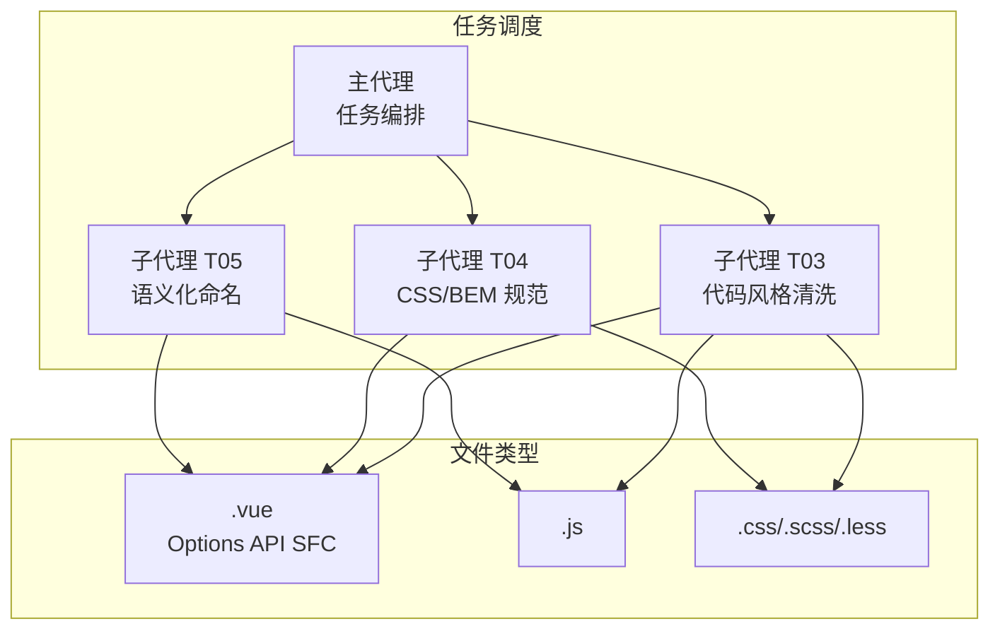
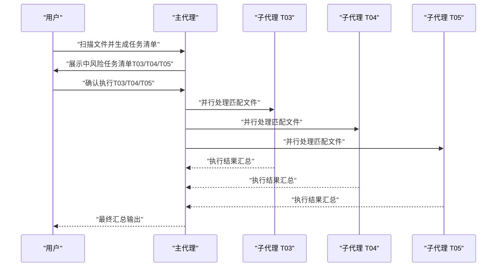
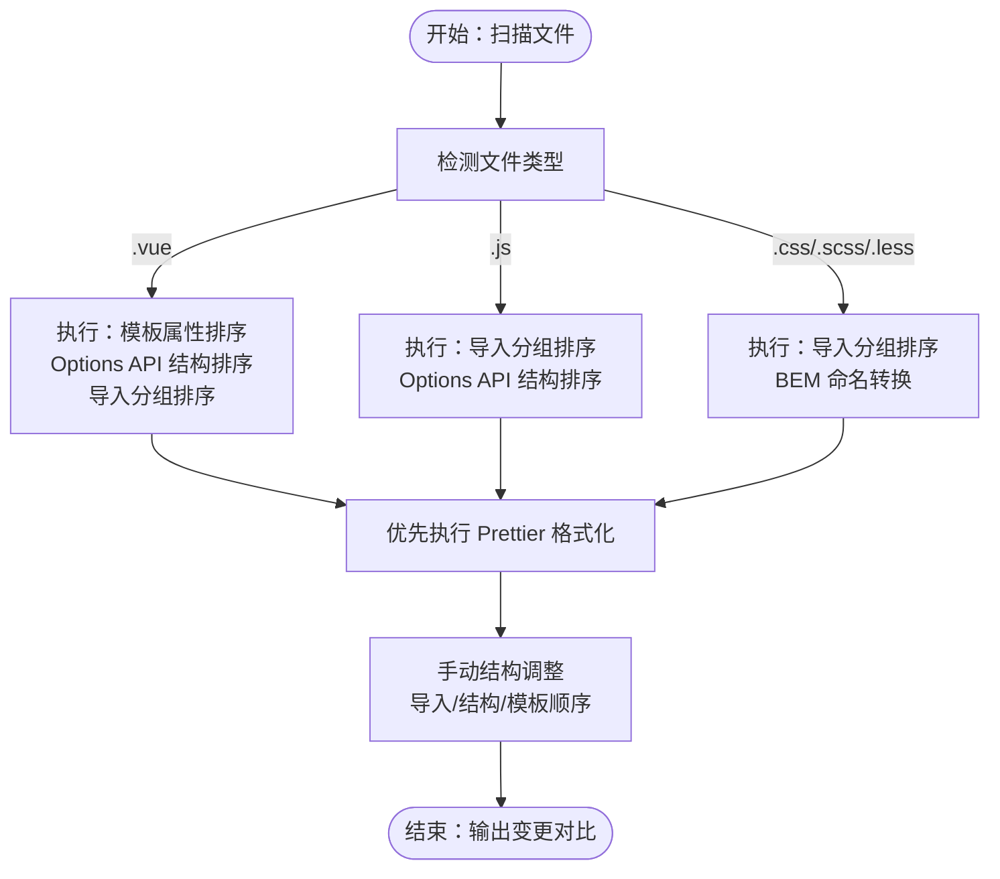
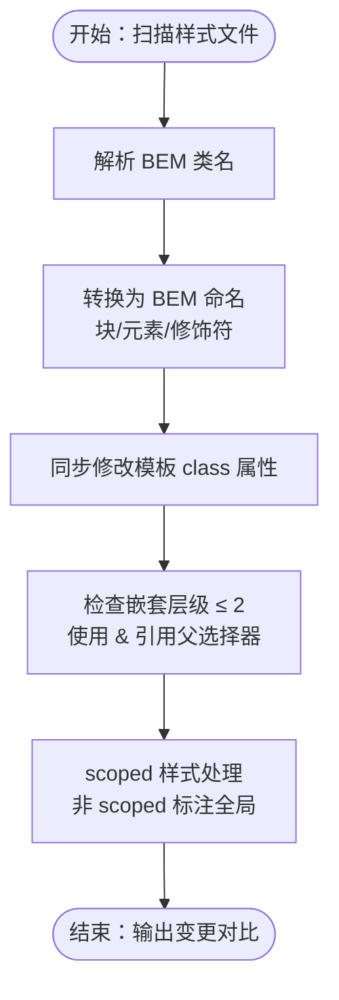
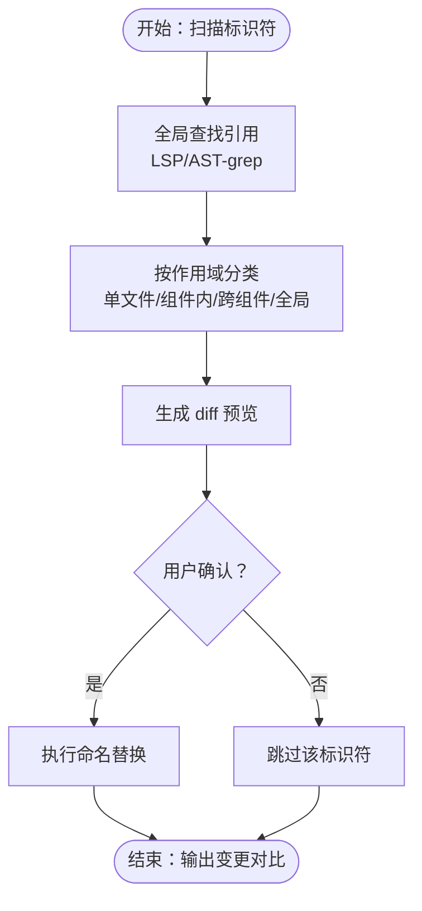
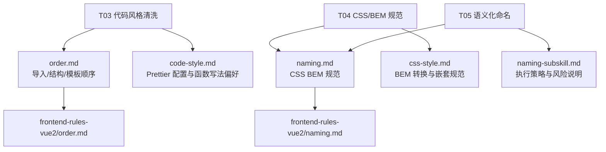

# 中风险优化任务

<cite>
**本文引用的文件**
- [SKILL.md](file://skills/yy-frontend-vue2-code-optimization/SKILL.md)
- [code-style.md](file://skills/yy-frontend-vue2-code-optimization/rules/code-style.md)
- [order.md](file://skills/yy-frontend-vue2-code-optimization/rules/order.md)
- [naming.md](file://skills/yy-frontend-vue2-code-optimization/rules/naming.md)
- [css-style.md](file://skills/yy-frontend-vue2-code-optimization/sub-skills/css-style.md)
- [naming-subskill.md](file://skills/yy-frontend-vue2-code-optimization/sub-skills/naming.md)
- [skill-prompts.md](file://skills/yy-frontend-vue2-code-optimization/prompts/skill-prompts.md)
- [frontend-naming.md](file://rules/frontend-rules-vue2/references/naming.md)
- [frontend-order.md](file://rules/frontend-rules-vue2/references/order.md)
</cite>

## 目录
1. [简介](#简介)
2. [项目结构](#项目结构)
3. [核心组件](#核心组件)
4. [架构概览](#架构概览)
5. [详细组件分析](#详细组件分析)
6. [依赖分析](#依赖分析)
7. [性能考虑](#性能考虑)
8. [故障排除指南](#故障排除指南)
9. [结论](#结论)

## 简介
本文件面向 Vue2 代码优化工具的中风险优化任务，系统性阐述 T03 代码风格清洗、T04 CSS/BEM 规范和 T05 语义化命名三大任务。这些任务均需用户明确确认后方可执行，旨在通过统一代码风格、规范 CSS 命名与结构以及标准化标识符命名，显著提升代码一致性、可读性与长期可维护性。

## 项目结构
该技能围绕 Vue2 Options API 项目，提供针对 .vue、.js、.css/.scss/.less 文件的优化能力。中风险任务在任务清单中以独立子代理执行，支持并行处理多个文件，并在执行前要求用户确认。

**图表来源**
- [SKILL.md: 72-120:72-120](file://skills/yy-frontend-vue2-code-optimization/SKILL.md#L72-L120)
- [SKILL.md: 122-129:122-129](file://skills/yy-frontend-vue2-code-optimization/SKILL.md#L122-L129)

**章节来源**
- [SKILL.md: 40-70:40-70](file://skills/yy-frontend-vue2-code-optimization/SKILL.md#L40-L70)
- [SKILL.md: 122-129:122-129](file://skills/yy-frontend-vue2-code-optimization/SKILL.md#L122-L129)

## 核心组件
- T03 代码风格清洗：统一导入分组、Options API 结构排序、模板属性顺序，结合 Prettier 配置确保格式一致性。
- T04 CSS/BEM 规范：实施 BEM 命名约定、块/元素/修饰符规范、scoped 样式同步修改，提供布局与兼容性指导。
- T05 语义化命名：规范 API 函数、事件函数、常量与 Props 的命名，强调全局替换时的引用查找与安全确认。

**章节来源**
- [SKILL.md: 203-255:203-255](file://skills/yy-frontend-vue2-code-optimization/SKILL.md#L203-L255)

## 架构概览
中风险任务采用子代理并行执行模型，确保每个任务类型独立处理，同时在执行前进行用户确认，降低风险。

**图表来源**
- [SKILL.md: 132-164:132-164](file://skills/yy-frontend-vue2-code-optimization/SKILL.md#L132-L164)

**章节来源**
- [SKILL.md: 132-164:132-164](file://skills/yy-frontend-vue2-code-optimization/SKILL.md#L132-L164)

## 详细组件分析

### T03 代码风格清洗
该任务涵盖三个层面的规范化：

1) 导入排序规则（3 组）
- 外部依赖（node_modules）→ 内部全局（@src/）→ 内部相对（./、../）
- 组间空一行，组内按字母顺序排序
- 适用于 .vue、.js、.css/.scss/.less 文件

2) Options API 结构排序
- name → components → props → data → computed → watch → methods → 生命周期
- methods 内部进一步按 init...() → async 网络请求 → 事件处理 → 特殊计算排序

3) 模板属性顺序规范
- is → v-for → v-if/v-else-if/v-else → v-show/v-cloak → id → props/attrs → v-on → v-html/v-text → v-slot
- 模板仅负责展示，不写复杂表达式；简单逻辑可内联

**图表来源**
- [order.md: 104-131:104-131](file://skills/yy-frontend-vue2-code-optimization/rules/order.md#L104-L131)
- [order.md: 15-30:15-30](file://skills/yy-frontend-vue2-code-optimization/rules/order.md#L15-L30)
- [code-style.md: 53-63:53-63](file://skills/yy-frontend-vue2-code-optimization/rules/code-style.md#L53-L63)
- [skill-prompts.md: 68-71:68-71](file://skills/yy-frontend-vue2-code-optimization/prompts/skill-prompts.md#L68-L71)

**章节来源**
- [order.md: 104-131:104-131](file://skills/yy-frontend-vue2-code-optimization/rules/order.md#L104-L131)
- [order.md: 15-30:15-30](file://skills/yy-frontend-vue2-code-optimization/rules/order.md#L15-L30)
- [code-style.md: 53-63:53-63](file://skills/yy-frontend-vue2-code-optimization/rules/code-style.md#L53-L63)
- [skill-prompts.md: 68-71:68-71](file://skills/yy-frontend-vue2-code-optimization/prompts/skill-prompts.md#L68-L71)

### T04 CSS/BEM 规范
该任务将现有类名转换为 BEM 命名体系，并同步修改 scoped 样式与模板中的 class 属性。

1) BEM 命名约定
- 块（Block）：独立模块直接命名（如 card、form）
- 元素（Element）：块内子元素用 __ 连接（如 card__title、form__input）
- 修饰符（Modifier）：状态/样式变体用 -- 连接（如 card--dark、card__title--large）
- 命名规则：全小写、横线连接、类名唯一

2) 嵌套结构规范
- 嵌套最大深度 2 层，推荐使用 & 引用父选择器
- 禁止深层嵌套、元素类型选择器嵌套与后代选择器嵌套

3) scoped 样式同步修改
- 修改 scoped 样式中的 class 时，必须同步修改模板中的 class 属性
- 非 scoped 样式需在顶部标注 /* 全局 */

**图表来源**
- [css-style.md: 13-131:13-131](file://skills/yy-frontend-vue2-code-optimization/sub-skills/css-style.md#L13-L131)
- [css-style.md: 128-170:128-170](file://skills/yy-frontend-vue2-code-optimization/sub-skills/css-style.md#L128-L170)

**章节来源**
- [css-style.md: 13-131:13-131](file://skills/yy-frontend-vue2-code-optimization/sub-skills/css-style.md#L13-L131)
- [css-style.md: 128-170:128-170](file://skills/yy-frontend-vue2-code-optimization/sub-skills/css-style.md#L128-L170)

### T05 语义化命名
该任务对 API 函数、事件函数、常量与 Props 进行命名规范化，强调全局替换时的安全性与准确性。

1) 命名规范
- API 函数：api + Method + URLPath（如 apiGetUserInfo）
- 事件函数：on + EventName（如 onClickSubmit）
- 常量：全大写 + 下划线（如 MAX_RETRY_COUNT）
- Props：camelCase（如 userName），组件名：PascalCase（如 <UserList />）
- 布尔值：isXX / hasXX / showXX 前缀

2) 执行策略
- 全局查找：使用 LSP 或 AST-grep 查找所有引用，确保不遗漏
- 分类替换：按作用域范围（单文件 → 组件内 → 跨组件 → 全局 API）逐个替换
- diff 预览：展示变更前后对比，确认无误后执行

**图表来源**
- [naming-subskill.md: 14-41:14-41](file://skills/yy-frontend-vue2-code-optimization/sub-skills/naming.md#L14-L41)

**章节来源**
- [naming.md: 19-43:19-43](file://skills/yy-frontend-vue2-code-optimization/rules/naming.md#L19-L43)
- [naming.md: 53-73:53-73](file://skills/yy-frontend-vue2-code-optimization/rules/naming.md#L53-L73)
- [naming-subskill.md: 14-41:14-41](file://skills/yy-frontend-vue2-code-optimization/sub-skills/naming.md#L14-L41)

## 依赖分析
中风险任务依赖于以下规则与子技能文件，形成完整的执行依据：

**图表来源**
- [order.md: 1-131:1-131](file://skills/yy-frontend-vue2-code-optimization/rules/order.md#L1-L131)
- [code-style.md: 1-63:1-63](file://skills/yy-frontend-vue2-code-optimization/rules/code-style.md#L1-L63)
- [naming.md: 1-73:1-73](file://skills/yy-frontend-vue2-code-optimization/rules/naming.md#L1-L73)
- [css-style.md: 1-323:1-323](file://skills/yy-frontend-vue2-code-optimization/sub-skills/css-style.md#L1-L323)
- [naming-subskill.md: 1-41:1-41](file://skills/yy-frontend-vue2-code-optimization/sub-skills/naming.md#L1-L41)
- [frontend-order.md: 1-131:1-131](file://rules/frontend-rules-vue2/references/order.md#L1-L131)
- [frontend-naming.md: 1-73:1-73](file://rules/frontend-rules-vue2/references/naming.md#L1-L73)

**章节来源**
- [order.md: 1-131:1-131](file://skills/yy-frontend-vue2-code-optimization/rules/order.md#L1-L131)
- [code-style.md: 1-63:1-63](file://skills/yy-frontend-vue2-code-optimization/rules/code-style.md#L1-L63)
- [naming.md: 1-73:1-73](file://skills/yy-frontend-vue2-code-optimization/rules/naming.md#L1-L73)
- [css-style.md: 1-323:1-323](file://skills/yy-frontend-vue2-code-optimization/sub-skills/css-style.md#L1-L323)
- [naming-subskill.md: 1-41:1-41](file://skills/yy-frontend-vue2-code-optimization/sub-skills/naming.md#L1-L41)
- [frontend-order.md: 1-131:1-131](file://rules/frontend-rules-vue2/references/order.md#L1-L131)
- [frontend-naming.md: 1-73:1-73](file://rules/frontend-rules-vue2/references/naming.md#L1-L73)

## 性能考虑
- 代码风格清洗：Prettier 格式化可能产生较大的 diff，建议在干净分支执行，避免多人协作分支合并冲突。
- CSS/BEM 规范：BEM 命名与嵌套限制有助于减少样式特异性与选择器复杂度，提升渲染性能。
- 语义化命名：统一的命名规范减少查找与理解成本，间接提升开发与调试效率。

## 故障排除指南
- Prettier 执行失败：参考项目内置配置进行手动格式化，确保缩进、引号、分号等符合规范。
- BEM 嵌套违规：检查嵌套层级是否超过 2 层，避免使用后代选择器与元素类型选择器嵌套。
- 全局命名替换风险：对于可能与第三方库冲突的标识符，需谨慎确认；API 函数重命名时保持 HTTP 请求路径不变。
- scoped 同步修改：修改样式类名后务必同步更新模板中的 class 属性，避免样式失效。

**章节来源**
- [code-style.md: 31-51:31-51](file://skills/yy-frontend-vue2-code-optimization/rules/code-style.md#L31-L51)
- [css-style.md: 86-114:86-114](file://skills/yy-frontend-vue2-code-optimization/sub-skills/css-style.md#L86-L114)
- [naming-subskill.md: 20-41:20-41](file://skills/yy-frontend-vue2-code-optimization/sub-skills/naming.md#L20-L41)

## 结论
中风险优化任务通过 T03、T04、T05 三个子技能，系统性地提升了 Vue2 项目的代码风格一致性、CSS 命名规范性与标识符语义化程度。这些优化不仅改善了代码可读性与可维护性，也为后续的高风险优化（如逻辑深度优化与无效代码清理）奠定了坚实基础。建议在执行前充分评估变更影响，并在确认后按子代理并行处理，以最大化效率与安全性。