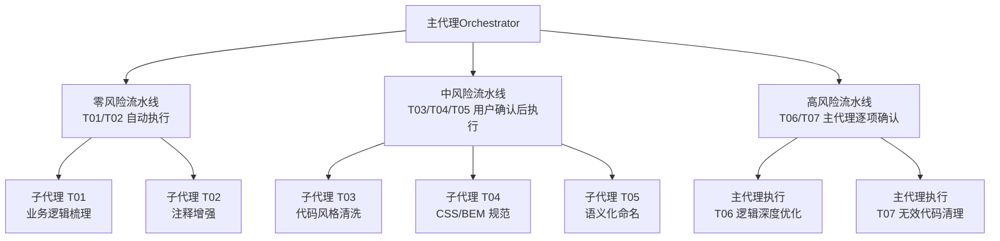
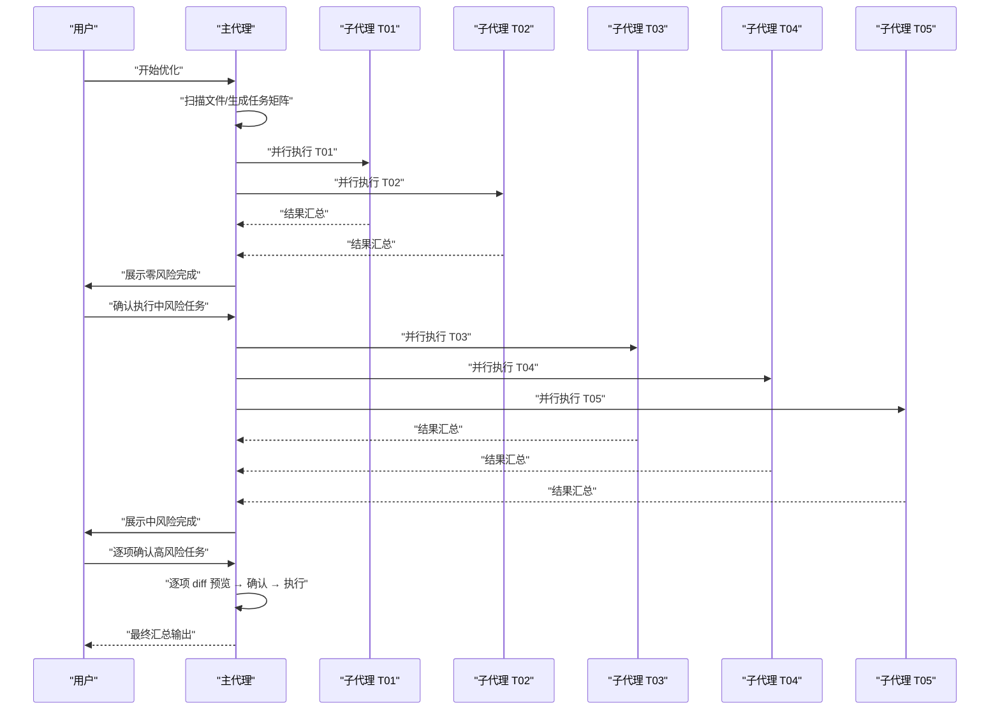
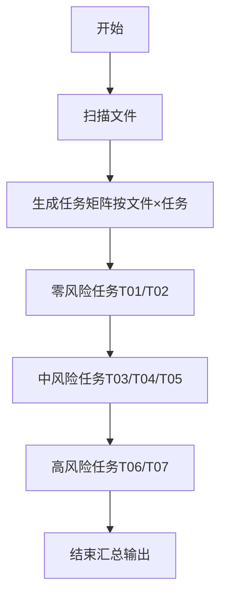

# 优化任务概览

<cite>
**本文引用的文件**
- [SKILL.md](file://skills/yy-frontend-vue2-code-optimization/SKILL.md)
- [business-logic.md](file://skills/yy-frontend-vue2-code-optimization/sub-skills/business-logic.md)
- [code-style.md](file://skills/yy-frontend-vue2-code-optimization/sub-skills/code-style.md)
- [css-style.md](file://skills/yy-frontend-vue2-code-optimization/sub-skills/css-style.md)
- [naming.md](file://skills/yy-frontend-vue2-code-optimization/sub-skills/naming.md)
- [optimization.md](file://skills/yy-frontend-vue2-code-optimization/sub-skills/optimization.md)
- [code-style.md](file://skills/yy-frontend-vue2-code-optimization/rules/code-style.md)
- [comments.md](file://skills/yy-frontend-vue2-code-optimization/rules/comments.md)
- [naming.md](file://skills/yy-frontend-vue2-code-optimization/rules/naming.md)
- [directives.md](file://skills/yy-frontend-vue2-code-optimization/rules/directives.md)
- [constraints.md](file://skills/yy-frontend-vue2-code-optimization/rules/constraints.md)
- [performance.md](file://skills/yy-frontend-vue2-code-optimization/rules/performance.md)
- [.prettierrc.json](file://skills/yy-frontend-vue2-code-optimization/assets/.prettierrc.json)
- [order.md](file://rules/frontend-rules-vue2/references/order.md)
</cite>

## 目录
1. [简介](#简介)
2. [项目结构](#项目结构)
3. [核心任务总览](#核心任务总览)
4. [架构总览](#架构总览)
5. [详细任务解析](#详细任务解析)
6. [依赖关系与执行顺序](#依赖关系与执行顺序)
7. [性能与风险考量](#性能与风险考量)
8. [故障排查与最佳实践](#故障排查与最佳实践)
9. [结论](#结论)

## 简介
本文件面向使用 Vue2 代码优化工具的工程团队与个人开发者，系统化梳理七个核心优化任务（T01–T07）的功能定位、风险等级、执行机制与适用场景。文档强调“零风险自动执行、中风险需确认、高风险逐项确认”的三层治理策略，帮助用户在保证业务安全的前提下，高效完成代码风格、注释、命名、样式与逻辑层面的优化。

## 项目结构
该技能位于前端技能仓库的 Vue2 优化子目录，围绕“主代理调度 + 子代理执行”的流水线架构组织任务，配套规则与资产文件确保一致性与可追溯性。

图表来源
- [SKILL.md:72-120](file://skills/yy-frontend-vue2-code-optimization/SKILL.md#L72-L120)

章节来源
- [SKILL.md:1-415](file://skills/yy-frontend-vue2-code-optimization/SKILL.md#L1-L415)

## 核心任务总览
七个任务按风险与影响范围分为三类，分别由子代理或主代理执行，并在不同阶段并行处理：

- 零风险（T01/T02）：自动执行，不改变业务逻辑，仅生成/增强注释与说明。
- 中风险（T03/T04/T05）：用户确认后执行，涉及格式化、结构排序、命名重构等，需关注合并冲突与风格一致性。
- 高风险（T06/T07）：主代理逐项确认，展示 diff 后执行，涉及运行时行为变更与潜在逻辑差异。

章节来源
- [SKILL.md:40-70](file://skills/yy-frontend-vue2-code-optimization/SKILL.md#L40-L70)

## 架构总览
主代理负责扫描文件、生成任务矩阵、按风险分组、调度子代理或主代理执行，并汇总输出。子代理职责单一、并行度高、故障隔离；高风险任务由主代理逐项把关，确保可控。

图表来源
- [SKILL.md:132-155](file://skills/yy-frontend-vue2-code-optimization/SKILL.md#L132-L155)

章节来源
- [SKILL.md:72-120](file://skills/yy-frontend-vue2-code-optimization/SKILL.md#L72-L120)

## 详细任务解析

### T01 业务逻辑梳理（🟢 零风险 · 仅 .vue）
- 功能定位：在 .vue 组件 `<script>` 顶部生成结构化业务说明 JSDoc，记录组件职责、数据来源、交互关系与核心流程，支持多次改动追加与倒序排列。
- 适用场景：新接手项目、需求变更后梳理、知识沉淀与交接。
- 核心规则：
  - 分析组件职责、数据流向、交互关系、核心业务流程。
  - 在 `<script>` 顶部生成 JSDoc，每次改动需记录“改动时间”和“改动内容”，倒序排列。
  - 若已有同类注释，追加新记录而非覆盖。
- 预期效果：提升可读性与可维护性，降低沟通成本与回归风险。
- 依赖规则：需结合注释规范与交互规范，确保描述准确。

章节来源
- [business-logic.md:1-127](file://skills/yy-frontend-vue2-code-optimization/sub-skills/business-logic.md#L1-L127)
- [comments.md:34-81](file://skills/yy-frontend-vue2-code-optimization/rules/comments.md#L34-L81)

### T02 注释增强（🟢 零风险）
- 功能定位：对模板/脚本/样式区进行注释增强，只增不改，保持已有注释正确性。
- 适用场景：代码评审、注释缺失或不规范、提升可读性。
- 核心规则：
  - 模板区：根节点、循环、条件、区块、插槽、动态组件添加注释。
  - 脚本区：关键方法添加 JSDoc（≤5 行），Props/Data/Computed/Methods 添加行内注释。
  - 样式区：模块分组、子模块、响应式区块添加注释。
  - 中文描述，只增不改。
- 预期效果：统一注释风格，减少歧义，便于后续维护。

章节来源
- [comments.md:1-106](file://skills/yy-frontend-vue2-code-optimization/rules/comments.md#L1-L106)

### T03 代码风格与格式清洗（🟡 中风险）
- 功能定位：优先使用 Prettier 格式化，随后按规则进行结构与顺序整理（SFC 块顺序、导入分组、Options API 顺序、模板属性顺序、指令简写、函数写法偏好）。
- 适用场景：多人协作、分支合并前、统一团队风格。
- 核心规则：
  - 优先执行 Prettier 命令；失败时参考项目资产中的 .prettierrc.json 规则手动格式化。
  - 导入分组：外部依赖 → 全局内部 → 相对内部，组间空一行，组内字母排序。
  - Options API 顺序：name → components → props → data → computed → watch → methods → 生命周期。
  - 模板属性顺序：is → v-for → v-if/v-else-if/v-else → v-show/v-cloak → id → props/attrs → v-on → v-html/v-text → v-slot。
  - 函数写法偏好：优先箭头函数声明（独立函数），Options API methods 中仍使用传统方法定义。
- 风险提示：可能造成 Git Diff 膨胀、多人协作合并冲突、风格不一致等问题，建议在干净分支执行。

章节来源
- [code-style.md:1-150](file://skills/yy-frontend-vue2-code-optimization/sub-skills/code-style.md#L1-L150)
- [code-style.md:1-63](file://skills/yy-frontend-vue2-code-optimization/rules/code-style.md#L1-L63)
- [order.md:1-131](file://rules/frontend-rules-vue2/references/order.md#L1-L131)
- [directives.md:85-102](file://skills/yy-frontend-vue2-code-optimization/rules/directives.md#L85-L102)

### T04 CSS/BEM 规范（🟡 中风险）
- 功能定位：将类名转换为 BEM 规范，限制嵌套深度，推荐 scoped 与媒体查询写法，同步修改模板 class 属性。
- 适用场景：样式模块化改造、组件样式隔离、响应式适配。
- 核心规则：
  - 块/元素/修饰符：block、block__element、block--modifier，全小写、横线连接、类名唯一。
  - 嵌套最大深度 2 层，SCSS/LESS 使用 `&` 引用父选择器。
  - scoped 样式必须同步修改模板中的 class 属性。
  - 推荐布局：定位层级、padding/margin 方向、媒体查询位置。
  - 兼容性：对 gap、aspect-ratio、100vh、inset、will-change、content-visibility、subgrid 等属性提供降级方案。
- 风险提示：类名替换需与模板同步，避免运行时样式失效。

章节来源
- [css-style.md:1-323](file://skills/yy-frontend-vue2-code-optimization/sub-skills/css-style.md#L1-L323)
- [naming.md:53-72](file://skills/yy-frontend-vue2-code-optimization/rules/naming.md#L53-L72)

### T05 语义化命名（🟡 中风险）
- 功能定位：对 API/事件/常量/Props/Data/Computed 等进行语义化命名重构，支持跨文件替换，需展示 diff 预览。
- 适用场景：命名混乱、可读性差、跨文件引用多。
- 核心规则：
  - API 函数：api + Method + URLPath（如 apiGetUserInfo）。
  - 事件函数：on + EventName（如 onClickSubmit）。
  - 常量：全大写 + 下划线（如 MAX_RETRY_COUNT）。
  - Props/Emits：camelCase，必须注释；布尔值：isXX/hasXX/showXX 前缀。
  - 命名变更需全局查找并分类替换，展示 diff 后确认执行。
- 风险提示：可能遗漏动态字符串引用、第三方库冲突、API 路径变更需保持不变。

章节来源
- [naming.md:1-41](file://skills/yy-frontend-vue2-code-optimization/sub-skills/naming.md#L1-L41)
- [naming.md:1-73](file://skills/yy-frontend-vue2-code-optimization/rules/naming.md#L1-L73)

### T06 逻辑深度优化（🔴 高风险 · 主代理执行）
- 功能定位：涉及运行时行为改变，必须逐项确认并展示 diff 后执行。
- 适用场景：异步链路复杂、计算属性滥用、watch 深度监听、Vue2 响应式陷阱、性能瓶颈。
- 核心规则：
  - 相等运算符转换：不主动变更 `==`/`===`，仅在接口响应 code 场景建议统一使用 `===`，需逐项确认。
  - 异步优化：`.then()` → `async/await`，统一响应模式 `{code,data,msg}`，错误处理使用 `try/catch + console.warn`。
  - 计算属性优先：computed 优先派生状态，computed 必须 try/catch 包裹。
  - watch 优化：按需使用 `deep: true`/`immediate: true`。
  - Vue2 响应式陷阱：新增对象属性、数组索引赋值、数组长度修改必须使用 `$set` 或替代方案。
  - 性能优化：防抖节流、组件懒加载、KeepAlive 缓存、虚拟滚动等。
- 风险提示：任何逻辑变更均可能影响运行时行为，必须逐项确认。

章节来源
- [optimization.md:1-234](file://skills/yy-frontend-vue2-code-optimization/sub-skills/optimization.md#L1-L234)
- [constraints.md:1-57](file://skills/yy-frontend-vue2-code-optimization/rules/constraints.md#L1-L57)
- [performance.md:1-179](file://skills/yy-frontend-vue2-code-optimization/rules/performance.md#L1-L179)

### T07 无效代码清理（🔴 高风险 · 主代理执行）
- 功能定位：清理未使用的导入、未使用的变量/函数，逐项确认后执行。
- 适用场景：长期演进遗留、重构后未清理的死代码。
- 核心规则：
  - 清理未使用的导入语句（import/require）、未使用的变量声明（const/let/var）、未使用的函数定义。
  - 逐项确认：每发现一个无效项，先展示位置和代码，由用户确认是否删除。
  - 谨慎判断：仅删除确实未被引用的代码；保留可能在运行时动态使用的代码（如全局注册的组件）、可能通过字符串动态调用的方法。
  - 不处理的类型：样式文件（.css/.scss/.less）无此任务。
- 风险提示：动态引用与运行时特性可能导致误删，需人工复核。

章节来源
- [SKILL.md:272-286](file://skills/yy-frontend-vue2-code-optimization/SKILL.md#L272-L286)

## 依赖关系与执行顺序
- 文件类型与任务匹配：
  - .vue：T01–T07
  - .js：T02、T03、T05、T06、T07
  - .css/.scss/.less：T03、T04
- 阶段划分与并行度：
  - 阶段一（零风险）：T01、T02 自动执行，同类型任务并行。
  - 阶段二（中风险）：T03、T04、T05 用户确认后执行，同类型任务并行。
  - 阶段三（高风险）：T06、T07 主代理逐项确认执行，同类型任务并行。
- 执行顺序：
  - 零风险任务优先，确保基础规范先行。
  - 中风险任务在用户确认后执行，平衡效率与安全。
  - 高风险任务严格逐项确认，保障业务安全。

图表来源
- [SKILL.md:132-155](file://skills/yy-frontend-vue2-code-optimization/SKILL.md#L132-L155)

章节来源
- [SKILL.md:122-164](file://skills/yy-frontend-vue2-code-optimization/SKILL.md#L122-L164)

## 性能与风险考量
- 风险等级与执行规则：
  - 零风险：自动执行，无需等待。
  - 中风险：用户明确确认后执行，关注合并冲突与风格一致性。
  - 高风险：逐项展示 diff → 用户确认 → 执行，确保可控。
- 性能建议：
  - 异步优化：优先 async/await，减少 .then 链式。
  - 计算优先：除与后端交互和定时器外，尽可能使用 computed。
  - 性能优化：防抖节流、组件懒加载、KeepAlive 缓存、虚拟滚动。
- 风险规避：
  - 大文件建议分批优化。
  - 建议先提交当前状态，以便随时回滚。
  - 对于 .vue 文件，确保 scoped 样式与模板 class 同步修改。

章节来源
- [SKILL.md:56-70](file://skills/yy-frontend-vue2-code-optimization/SKILL.md#L56-L70)
- [performance.md:1-179](file://skills/yy-frontend-vue2-code-optimization/rules/performance.md#L1-L179)

## 故障排查与最佳实践
- 常见问题与对策：
  - Prettier 未安装：参考项目资产中的 .prettierrc.json 规则手动格式化。
  - 合并冲突：在干净分支执行格式化，避免与他人分支产生冲突。
  - 类名替换后样式失效：检查模板 class 是否同步修改。
  - 命名替换遗漏：使用 LSP/AST-grep 全局查找，逐项确认。
  - 高风险任务误删：对动态引用与运行时特性保持谨慎，必要时回滚。
- 最佳实践建议：
  - 先执行零风险任务，再执行中风险任务，最后逐项确认高风险任务。
  - 对 .vue 文件，优先统一 Options API 结构与 BEM 样式。
  - 对 .js 文件，优先统一导入顺序与命名规范。
  - 对样式文件，优先 BEM 规范与 scoped 隔离。
  - 大型重构建议分模块、分批次执行，保留中间提交以便回滚。

章节来源
- [code-style.md:25-48](file://skills/yy-frontend-vue2-code-optimization/sub-skills/code-style.md#L25-L48)
- [css-style.md:128-130](file://skills/yy-frontend-vue2-code-optimization/sub-skills/css-style.md#L128-L130)
- [naming.md:14-18](file://skills/yy-frontend-vue2-code-optimization/sub-skills/naming.md#L14-L18)
- [SKILL.md:169-179](file://skills/yy-frontend-vue2-code-optimization/SKILL.md#L169-L179)

## 结论
通过“零风险自动、中风险确认、高风险逐项”的三层治理策略，Vue2 代码优化工具能够在不改变业务逻辑的前提下，系统性提升代码风格、注释质量、命名语义与样式规范，并在主代理的严格把关下，安全地推进逻辑深度优化与无效代码清理。建议团队结合自身流程，制定分阶段执行计划，确保优化过程可控、可追溯、可回滚。