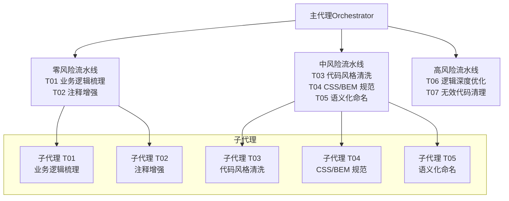
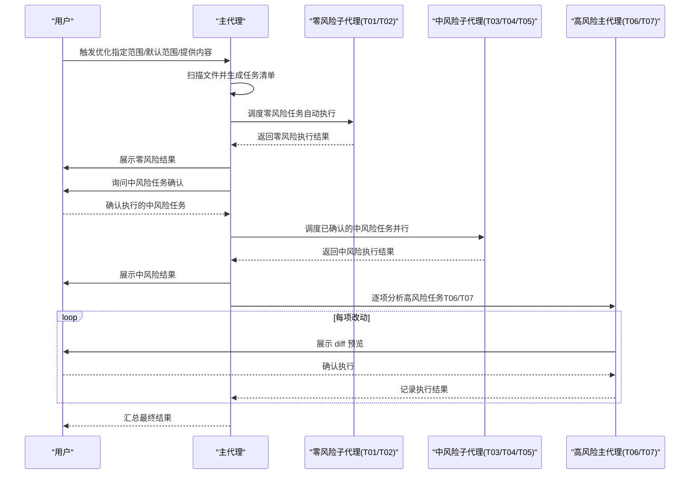
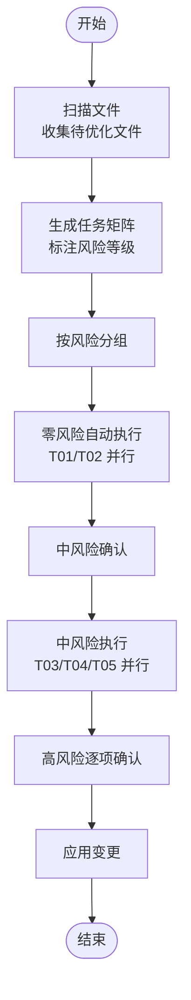
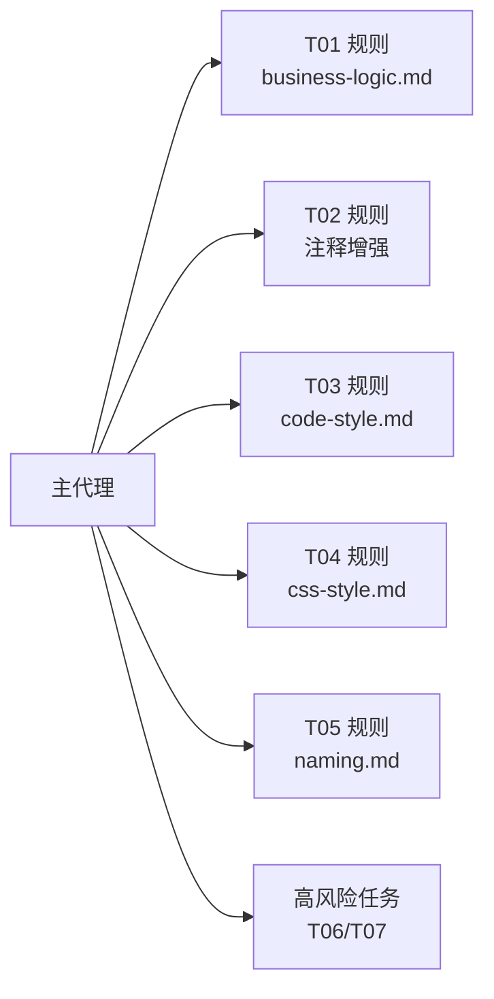

# 执行流程与调度

<cite>
**本文引用的文件**
- [SKILL.md](file://skills/yy-frontend-vue2-code-optimization/SKILL.md)
- [metadata.json](file://skills/yy-frontend-vue2-code-optimization/metadata.json)
- [business-logic.md](file://skills/yy-frontend-vue2-code-optimization/sub-skills/business-logic.md)
- [code-style.md](file://skills/yy-frontend-vue2-code-optimization/sub-skills/code-style.md)
- [css-style.md](file://skills/yy-frontend-vue2-code-optimization/sub-skills/css-style.md)
- [naming.md](file://skills/yy-frontend-vue2-code-optimization/sub-skills/naming.md)
</cite>

## 目录
1. [简介](#简介)
2. [项目结构](#项目结构)
3. [核心组件](#核心组件)
4. [架构总览](#架构总览)
5. [详细组件分析](#详细组件分析)
6. [依赖分析](#依赖分析)
7. [性能考虑](#性能考虑)
8. [故障排查指南](#故障排查指南)
9. [结论](#结论)
10. [附录](#附录)

## 简介
本文件面向 Vue2 代码优化工具的执行流程与调度机制，系统阐述从“文件扫描”到“结果汇总”的完整工作流，涵盖零风险任务自动执行、中风险任务用户确认执行、高风险任务逐项确认执行的三级确认策略；并基于子代理调度架构设计原则，说明主代理与子代理的职责分工、并行度与故障隔离能力。文档同时提供执行流程图与具体执行示例，帮助用户理解优化过程的工作原理与预期效果。

## 项目结构
该技能以“主代理 + 多子代理”的分层架构组织，主代理负责文件扫描、任务清单生成、按风险分组与调度、结果汇总；各子代理负责单一任务类型的自动化执行。子技能规则文档集中于子技能目录，主技能文档定义任务清单、风险分级与执行规则。

图表来源
- [SKILL.md:72-120](file://skills/yy-frontend-vue2-code-optimization/SKILL.md#L72-L120)

章节来源
- [SKILL.md:18-415](file://skills/yy-frontend-vue2-code-optimization/SKILL.md#L18-L415)
- [metadata.json:1-40](file://skills/yy-frontend-vue2-code-optimization/metadata.json#L1-L40)

## 核心组件
- 主代理（Orchestrator）
  - 职责：扫描文件、生成任务清单、按风险等级分组、调度子代理、汇总结果。
  - 关键流程：文件扫描 → 任务矩阵生成 → 零风险自动执行 → 中风险用户确认 → 高风险逐项确认。
- 子代理（T01-T05）
  - 职责：单一任务类型自动化执行，支持同类型任务并行处理多个文件。
  - 优势：职责单一、并行执行、故障隔离、上下文轻量。
- 子技能规则（T01-T05）
  - 业务逻辑梳理、注释增强、代码风格清洗、CSS/BEM 规范、语义化命名。
- 高风险任务（T06、T07）
  - 由主代理执行，逐项展示 diff → 用户确认 → 执行，确保用户对每项改动完全可控。

章节来源
- [SKILL.md:40-120](file://skills/yy-frontend-vue2-code-optimization/SKILL.md#L40-L120)
- [business-logic.md:1-127](file://skills/yy-frontend-vue2-code-optimization/sub-skills/business-logic.md#L1-L127)
- [code-style.md:1-150](file://skills/yy-frontend-vue2-code-optimization/sub-skills/code-style.md#L1-L150)
- [css-style.md:1-323](file://skills/yy-frontend-vue2-code-optimization/sub-skills/css-style.md#L1-L323)
- [naming.md:1-41](file://skills/yy-frontend-vue2-code-optimization/sub-skills/naming.md#L1-L41)

## 架构总览
主代理与子代理的协作遵循“职责单一、并行执行、故障隔离、上下文轻量”的设计原则。主代理负责协调与控制，子代理专注执行，高风险任务由主代理直接介入，确保变更可控。

图表来源
- [SKILL.md:132-164](file://skills/yy-frontend-vue2-code-optimization/SKILL.md#L132-L164)

## 详细组件分析

### 任务清单与风险分级
- 零风险（T01、T02）：仅注释与结构化梳理，自动执行，无需等待。
- 中风险（T03、T04、T05）：涉及格式化与命名调整，需用户明确确认后执行。
- 高风险（T06、T07）：逻辑深度优化与无效代码清理，逐项展示 diff → 用户确认 → 执行。

图表来源
- [SKILL.md:40-164](file://skills/yy-frontend-vue2-code-optimization/SKILL.md#L40-L164)

章节来源
- [SKILL.md:40-164](file://skills/yy-frontend-vue2-code-optimization/SKILL.md#L40-L164)

### 子代理调度架构设计原则
- 职责单一：每个子代理仅处理一个任务类型，规则清晰、边界明确。
- 并行执行：同类型任务可并行处理多个文件，提升吞吐。
- 故障隔离：单个子代理失败不影响其他任务的调度与执行。
- 上下文轻量：单个子代理处理的上下文窗口压力小，利于稳定执行。

章节来源
- [SKILL.md:72-82](file://skills/yy-frontend-vue2-code-optimization/SKILL.md#L72-L82)

### 零风险任务（T01、T02）
- T01 业务逻辑梳理（仅 .vue）：在 `<script>` 顶部生成结构化业务说明 JSDoc，追加记录而非覆盖，倒序排列。
- T02 注释增强：模板/脚本/样式注释只增不改，中文描述，保持原有逻辑不变。
- 执行方式：自动执行，无需等待用户确认。

章节来源
- [SKILL.md:181-202](file://skills/yy-frontend-vue2-code-optimization/SKILL.md#L181-L202)
- [business-logic.md:1-127](file://skills/yy-frontend-vue2-code-optimization/sub-skills/business-logic.md#L1-L127)
- [SKILL.md:192-202](file://skills/yy-frontend-vue2-code-optimization/SKILL.md#L192-L202)

### 中风险任务（T03、T04、T05）
- T03 代码风格清洗：优先调用 Prettier 格式化，失败时参考内置配置进行手动格式化；随后执行结构与顺序整理（SFC 块顺序、Options API 顺序、导入分组、模板属性顺序、指令简写、函数写法偏好）。
- T04 CSS/BEM 规范：BEM 命名、嵌套结构、scoped 样式与模板 class 同步修改、布局推荐、兼容性降级方案。
- T05 语义化命名：全局查找与替换，按作用域范围分类替换，提供 diff 预览，确保引用准确。
- 执行方式：用户确认后执行，子代理并行处理。

章节来源
- [SKILL.md:203-287](file://skills/yy-frontend-vue2-code-optimization/SKILL.md#L203-L287)
- [code-style.md:1-150](file://skills/yy-frontend-vue2-code-optimization/sub-skills/code-style.md#L1-L150)
- [css-style.md:1-323](file://skills/yy-frontend-vue2-code-optimization/sub-skills/css-style.md#L1-L323)
- [naming.md:1-41](file://skills/yy-frontend-vue2-code-optimization/sub-skills/naming.md#L1-L41)

### 高风险任务（T06、T07）
- T06 逻辑深度优化：主代理执行，逐项展示 diff → 用户确认 → 执行；涉及 async/await、computed 优先、逻辑拆分、Props 增强、性能优化等。
- T07 无效代码清理：主代理执行，逐项展示 diff → 用户确认 → 执行；清理未使用导入、变量、函数，谨慎判断动态引用与运行时可能使用的代码。
- 执行方式：主代理直接介入，确保用户对每项改动有完全控制。

章节来源
- [SKILL.md:256-287](file://skills/yy-frontend-vue2-code-optimization/SKILL.md#L256-L287)

### 文件类型与任务匹配
- .vue：支持全部任务（T01-T07）。
- .js：支持注释增强、代码风格清洗、语义化命名、逻辑深度优化、无效代码清理。
- .css/.scss/.less：支持代码风格清洗与 CSS/BEM 规范，不含无效代码清理。

章节来源
- [SKILL.md:122-129](file://skills/yy-frontend-vue2-code-optimization/SKILL.md#L122-L129)

### 执行顺序与并行度
- 阶段一：T01、T02（零风险）→ 自动执行，同类型任务并行。
- 阶段二：T03、T04、T05（中风险）→ 用户确认后执行，同类型任务并行。
- 阶段三：T06、T07（高风险）→ 主代理逐项确认，同类型任务并行。

章节来源
- [SKILL.md:157-164](file://skills/yy-frontend-vue2-code-optimization/SKILL.md#L157-L164)

### 输出契约与汇总格式
- 子代理输出：任务类型、处理文件数量、文件执行详情、关键变更 diff。
- 主代理汇总：处理文件总数、执行/跳过的任务统计、警告提醒、执行详情分组（零风险/中风险/高风险）。

章节来源
- [SKILL.md:323-397](file://skills/yy-frontend-vue2-code-optimization/SKILL.md#L323-L397)

## 依赖分析
- 主代理依赖子技能规则与子代理执行能力，负责任务编排与结果汇总。
- 子代理依赖各自子技能规则文档，确保执行一致性与质量。
- 高风险任务不依赖子代理，直接由主代理控制，保证变更可控性。

图表来源
- [SKILL.md:181-287](file://skills/yy-frontend-vue2-code-optimization/SKILL.md#L181-L287)
- [business-logic.md:1-127](file://skills/yy-frontend-vue2-code-optimization/sub-skills/business-logic.md#L1-L127)
- [code-style.md:1-150](file://skills/yy-frontend-vue2-code-optimization/sub-skills/code-style.md#L1-L150)
- [css-style.md:1-323](file://skills/yy-frontend-vue2-code-optimization/sub-skills/css-style.md#L1-L323)
- [naming.md:1-41](file://skills/yy-frontend-vue2-code-optimization/sub-skills/naming.md#L1-L41)

## 性能考虑
- 并行度：同类型任务在子代理层面并行处理，显著缩短整体执行时间。
- 上下文轻量：子代理处理单一任务类型，上下文窗口小，降低执行失败概率。
- 故障隔离：单个子代理失败不影响其他任务，提高整体稳定性。
- 风险控制：高风险任务逐项确认，避免大规模不可控变更引发的回滚成本。

## 故障排查指南
- 零风险任务异常
  - 现象：T01/T02 未执行或结果异常。
  - 排查：确认文件类型为 .vue（T01 仅 .vue），检查注释生成是否覆盖已有注释。
- 中风险任务异常
  - 现象：格式化失败或结构顺序未调整。
  - 排查：确认 Prettier 是否可用；若失败，参考内置配置进行手动格式化；检查结构与顺序规则是否满足。
- 高风险任务异常
  - 现象：逐项确认耗时长或 diff 不准确。
  - 排查：确认 diff 预览是否完整；对于动态引用，确认是否需要人工核对；必要时分批执行。
- 文件类型不匹配
  - 现象：某些任务未出现在任务清单。
  - 排查：确认文件类型与任务匹配表，.css/.scss/.less 不包含 T07。

章节来源
- [SKILL.md:122-129](file://skills/yy-frontend-vue2-code-optimization/SKILL.md#L122-L129)
- [code-style.md:15-49](file://skills/yy-frontend-vue2-code-optimization/sub-skills/code-style.md#L15-L49)
- [naming.md:20-41](file://skills/yy-frontend-vue2-code-optimization/sub-skills/naming.md#L20-L41)

## 结论
该优化工具通过“主代理 + 多子代理”的调度架构，实现了从文件扫描到结果汇总的高效闭环。零风险任务自动执行、中风险任务用户确认、高风险任务逐项确认的三级确认策略，既提升了执行效率，又保障了变更的安全性与可控性。子代理的职责单一、并行执行、故障隔离与上下文轻量等设计原则，进一步增强了系统的稳定性与可维护性。

## 附录
- 执行示例（概念性说明）
  - 零风险阶段：对 3 个 .vue 文件执行 T01，对 5 个 .js 文件执行 T02，均自动完成。
  - 中风险阶段：用户确认执行 T03、T04、T05，分别对 5 个、3 个、3 个文件并行处理。
  - 高风险阶段：主代理逐项展示 T06/T07 的 diff，用户确认后执行，确保每项改动可控。
- 输出示例（概念性说明）
  - 子代理输出：包含任务类型、处理文件数、文件执行详情与关键变更 diff。
  - 主代理汇总：处理文件总数、执行/跳过的任务统计、警告提醒、分组执行详情。