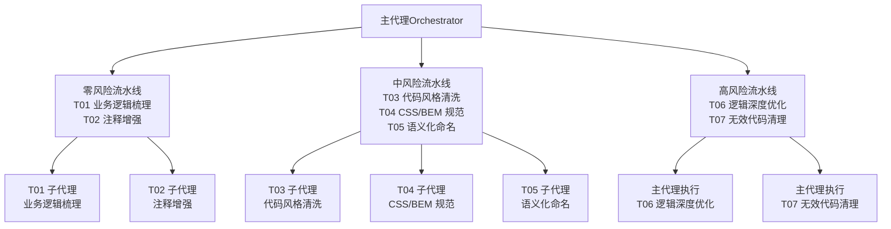
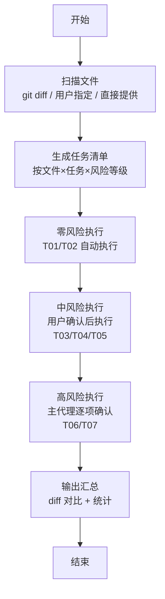
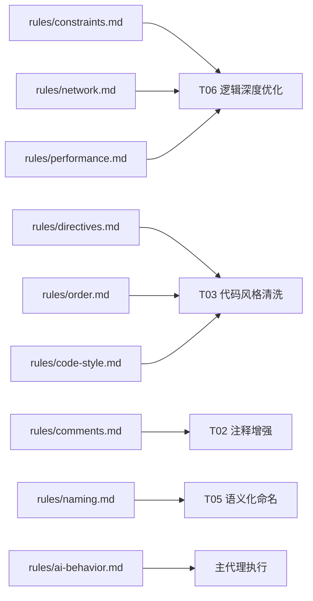

# 最佳实践与注意事项

<cite>
**本文引用的文件**
- [yy-frontend-vue2-code-optimization/SKILL.md](file://skills/yy-frontend-vue2-code-optimization/SKILL.md)
- [yy-frontend-vue2-code-optimization/rules/ai-behavior.md](file://skills/yy-frontend-vue2-code-optimization/rules/ai-behavior.md)
- [yy-frontend-vue2-code-optimization/rules/code-style.md](file://skills/yy-frontend-vue2-code-optimization/rules/code-style.md)
- [yy-frontend-vue2-code-optimization/rules/comments.md](file://skills/yy-frontend-vue2-code-optimization/rules/comments.md)
- [yy-frontend-vue2-code-optimization/rules/constraints.md](file://skills/yy-frontend-vue2-code-optimization/rules/constraints.md)
- [yy-frontend-vue2-code-optimization/rules/directives.md](file://skills/yy-frontend-vue2-code-optimization/rules/directives.md)
- [yy-frontend-vue2-code-optimization/rules/naming.md](file://skills/yy-frontend-vue2-code-optimization/rules/naming.md)
- [yy-frontend-vue2-code-optimization/rules/network.md](file://skills/yy-frontend-vue2-code-optimization/rules/network.md)
- [yy-frontend-vue2-code-optimization/rules/order.md](file://skills/yy-frontend-vue2-code-optimization/rules/order.md)
- [yy-frontend-vue2-code-optimization/rules/performance.md](file://skills/yy-frontend-vue2-code-optimization/rules/performance.md)
- [yy-frontend-vue2-code-optimization/sub-skills/css-style.md](file://skills/yy-frontend-vue2-code-optimization/sub-skills/css-style.md)
- [yy-frontend-vue2-code-optimization/sub-skills/business-logic.md](file://skills/yy-frontend-vue2-code-optimization/sub-skills/business-logic.md)
- [yy-frontend-vue2-code-optimization/sub-skills/comments.md](file://skills/yy-frontend-vue2-code-optimization/sub-skills/comments.md)
- [yy-frontend-vue2-code-optimization/sub-skills/naming.md](file://skills/yy-frontend-vue2-code-optimization/sub-skills/naming.md)
</cite>

## 目录
1. [简介](#简介)
2. [项目结构](#项目结构)
3. [核心组件](#核心组件)
4. [架构概览](#架构概览)
5. [详细组件分析](#详细组件分析)
6. [依赖分析](#依赖分析)
7. [性能考虑](#性能考虑)
8. [故障排查指南](#故障排查指南)
9. [结论](#结论)
10. [附录](#附录)

## 简介
本文件面向 Vue2（Options API）代码优化与评审，系统梳理“禁止规则”“不推荐项”“推荐实践”，并结合项目内置规则与子技能，给出可落地的优化策略与注意事项。目标是帮助团队统一代码风格、规避常见陷阱、提升可读性与可维护性。

## 项目结构
该技能围绕“任务分层 + 子代理并行执行”的架构设计，将不同风险级别的优化任务拆分为独立子技能，配合主代理对高风险项进行逐项确认与执行。

图表来源
- [yy-frontend-vue2-code-optimization/SKILL.md:72-120](file://skills/yy-frontend-vue2-code-optimization/SKILL.md#L72-L120)

章节来源
- [yy-frontend-vue2-code-optimization/SKILL.md:10-415](file://skills/yy-frontend-vue2-code-optimization/SKILL.md#L10-L415)

## 核心组件
- 任务调度与风险分级：按零风险（自动）、中风险（确认后执行）、高风险（逐项确认）三档执行，确保可控与可回溯。
- 子代理并行：同类型任务可并行处理多个文件，提升效率。
- 执行顺序：先零风险，再中风险，最后高风险逐项确认。
- 输出契约：提供子代理输出格式与最终汇总输出格式，关键变更提供 diff 对比。

章节来源
- [yy-frontend-vue2-code-optimization/SKILL.md:40-180](file://skills/yy-frontend-vue2-code-optimization/SKILL.md#L40-L180)
- [yy-frontend-vue2-code-optimization/SKILL.md:323-397](file://skills/yy-frontend-vue2-code-optimization/SKILL.md#L323-L397)

## 架构概览
下图展示从文件扫描到任务执行、再到结果汇总的整体流程。

图表来源
- [yy-frontend-vue2-code-optimization/SKILL.md:132-164](file://skills/yy-frontend-vue2-code-optimization/SKILL.md#L132-L164)

章节来源
- [yy-frontend-vue2-code-optimization/SKILL.md:132-164](file://skills/yy-frontend-vue2-code-optimization/SKILL.md#L132-L164)

## 详细组件分析

### 禁止规则（绝对不可触碰）
- 禁止连续解构（如 ...data.data）
- 禁止直接修改 props
- 禁止使用 mixins
- 禁止多层 try/catch 嵌套
- 禁止无意义命名（如 data1、temp2）
- 禁止父组件直接修改子组件数据
- 禁止多次修改 data 属性类型
- 禁止在生命周期中直接触发业务逻辑
- 基础组件生命周期禁止主动 emit
- 简单逻辑不额外封装为函数

说明与依据
- 连续解构破坏可读性与健壮性，易引发深层访问异常。
- props 只读，直接修改会破坏单向数据流。
- mixins 降低可读性与可测试性，建议使用组合式函数或组件组合。
- 多层 try/catch 嵌套增加维护成本，应扁平化处理。
- 无意义命名降低可读性，不利于协作与检索。
- 父子状态耦合破坏组件边界，建议通过 props 与事件通信。
- data 类型频繁变更导致响应式陷阱与调试困难。
- 生命周期中混入业务逻辑导致副作用与难以追踪。
- 基础组件主动 emit 易造成上层滥用。
- 过度封装导致模板臃肿与性能下降。

章节来源
- [yy-frontend-vue2-code-optimization/SKILL.md:290-302](file://skills/yy-frontend-vue2-code-optimization/SKILL.md#L290-L302)
- [yy-frontend-vue2-code-optimization/rules/constraints.md:3-17](file://skills/yy-frontend-vue2-code-optimization/rules/constraints.md#L3-L17)

### 不推荐项（尽量避免）
- 可选链操作符 `?.`：建议使用 lodash get() 替代，便于统一错误兜底。
- CSS 嵌套原生写法：需经 PostCSS 编译后使用，避免浏览器兼容性问题。
- `:has()` 伪类：Safari 15.4-15.6 存在渲染 Bug，谨慎使用。

说明与依据
- 可选链在复杂链路中易掩盖错误，get() 可提供默认值与统一日志。
- 原生嵌套需构建管线，直接使用易导致产物不一致。
- 某些伪类在特定版本 Safari 上存在已知缺陷，影响稳定性。

章节来源
- [yy-frontend-vue2-code-optimization/SKILL.md:303-308](file://skills/yy-frontend-vue2-code-optimization/SKILL.md#L303-L308)
- [yy-frontend-vue2-code-optimization/rules/constraints.md:29-38](file://skills/yy-frontend-vue2-code-optimization/rules/constraints.md#L29-L38)

### 推荐实践（建议统一）
- 错误处理：函数用 try/catch 包裹，catch 中 console.warn 打印。
- 异步优化：尽可能使用 async/await，少用 .then() 链式。
- 计算优先：除与后端交互和定时器外，其他尽可能使用 computed。
- v-html 必须防范 XSS，避免直接操作未过滤的字符串。
- 未使用变量需自行清理（ESLint 已关闭检查，需人工把关）。
- 组件拆分：弹窗→独立组件，表格→表格+业务分离，表单→表单+校验分离。
- 性能：路由和大组件使用动态 import，合理使用 <keep-alive>。

说明与依据
- 统一的错误处理与日志策略有助于问题定位。
- async/await 提升可读性与可维护性。
- computed 可缓存与复用，减少重复计算。
- v-html 存在 XSS 风险，必须经 DOMPurify 过滤。
- 未使用变量会增加包体与心智负担，应主动清理。
- 组件拆分提升内聚与可测试性。
- 动态导入与 keep-alive 是常见的性能优化手段。

章节来源
- [yy-frontend-vue2-code-optimization/SKILL.md:311-321](file://skills/yy-frontend-vue2-code-optimization/SKILL.md#L311-L321)
- [yy-frontend-vue2-code-optimization/rules/network.md:120-140](file://skills/yy-frontend-vue2-code-optimization/rules/network.md#L120-L140)
- [yy-frontend-vue2-code-optimization/rules/performance.md:7-21](file://skills/yy-frontend-vue2-code-optimization/rules/performance.md#L7-L21)

### 子技能与规则映射
- T01 业务逻辑梳理：在 <script> 顶部生成结构化业务说明 JSDoc，记录改动时间与改动内容，倒序排列。
- T02 注释增强：模板/脚本/样式注释只增不改，遵循注释保护原则。
- T03 代码风格清洗：优先 Prettier，其次 fallback 规则；导入分组、Options API 结构排序、模板属性顺序统一。
- T04 CSS/BEM 规范：块/元素/修饰符命名，嵌套最大深度 2 层，scoped 同步修改模板 class。
- T05 语义化命名：API/事件/常量命名规范，全局替换前需 diff 预览与确认。
- T06 逻辑深度优化：async/await、computed 优先、网络请求统一模式、方法拆分、Props 增强、性能优化。
- T07 无效代码清理：未使用导入/变量/函数清理，逐项确认，谨慎判断。

章节来源
- [yy-frontend-vue2-code-optimization/SKILL.md:181-287](file://skills/yy-frontend-vue2-code-optimization/SKILL.md#L181-L287)
- [yy-frontend-vue2-code-optimization/sub-skills/business-logic.md:13-127](file://skills/yy-frontend-vue2-code-optimization/sub-skills/business-logic.md#L13-L127)
- [yy-frontend-vue2-code-optimization/sub-skills/comments.md:12-197](file://skills/yy-frontend-vue2-code-optimization/sub-skills/comments.md#L12-L197)
- [yy-frontend-vue2-code-optimization/sub-skills/css-style.md:13-323](file://skills/yy-frontend-vue2-code-optimization/sub-skills/css-style.md#L13-L323)
- [yy-frontend-vue2-code-optimization/sub-skills/naming.md:14-41](file://skills/yy-frontend-vue2-code-optimization/sub-skills/naming.md#L14-L41)

## 依赖分析
- 任务耦合与内聚：各子代理职责单一，耦合度低；主代理集中处理高风险项，避免误操作扩散。
- 外部依赖：Prettier（格式化）、DOMPurify（v-html 安全）、lodash（防抖/节流、get 等）。
- 规则依赖：各子技能均依赖 rules 目录下的规范文件，形成“总纲—细则—子技能”的层次化结构。

图表来源
- [yy-frontend-vue2-code-optimization/rules/constraints.md:1-57](file://skills/yy-frontend-vue2-code-optimization/rules/constraints.md#L1-L57)
- [yy-frontend-vue2-code-optimization/rules/network.md:1-180](file://skills/yy-frontend-vue2-code-optimization/rules/network.md#L1-L180)
- [yy-frontend-vue2-code-optimization/rules/performance.md:1-179](file://skills/yy-frontend-vue2-code-optimization/rules/performance.md#L1-L179)
- [yy-frontend-vue2-code-optimization/rules/directives.md:1-116](file://skills/yy-frontend-vue2-code-optimization/rules/directives.md#L1-L116)
- [yy-frontend-vue2-code-optimization/rules/order.md:1-131](file://skills/yy-frontend-vue2-code-optimization/rules/order.md#L1-L131)
- [yy-frontend-vue2-code-optimization/rules/comments.md:1-106](file://skills/yy-frontend-vue2-code-optimization/rules/comments.md#L1-L106)
- [yy-frontend-vue2-code-optimization/rules/naming.md:1-73](file://skills/yy-frontend-vue2-code-optimization/rules/naming.md#L1-L73)
- [yy-frontend-vue2-code-optimization/rules/code-style.md:1-63](file://skills/yy-frontend-vue2-code-optimization/rules/code-style.md#L1-L63)
- [yy-frontend-vue2-code-optimization/rules/ai-behavior.md:1-29](file://skills/yy-frontend-vue2-code-optimization/rules/ai-behavior.md#L1-L29)

章节来源
- [yy-frontend-vue2-code-optimization/rules/constraints.md:1-57](file://skills/yy-frontend-vue2-code-optimization/rules/constraints.md#L1-L57)
- [yy-frontend-vue2-code-optimization/rules/network.md:1-180](file://skills/yy-frontend-vue2-code-optimization/rules/network.md#L1-L180)
- [yy-frontend-vue2-code-optimization/rules/performance.md:1-179](file://skills/yy-frontend-vue2-code-optimization/rules/performance.md#L1-L179)
- [yy-frontend-vue2-code-optimization/rules/directives.md:1-116](file://skills/yy-frontend-vue2-code-optimization/rules/directives.md#L1-L116)
- [yy-frontend-vue2-code-optimization/rules/order.md:1-131](file://skills/yy-frontend-vue2-code-optimization/rules/order.md#L1-L131)
- [yy-frontend-vue2-code-optimization/rules/comments.md:1-106](file://skills/yy-frontend-vue2-code-optimization/rules/comments.md#L1-L106)
- [yy-frontend-vue2-code-optimization/rules/naming.md:1-73](file://skills/yy-frontend-vue2-code-optimization/rules/naming.md#L1-L73)
- [yy-frontend-vue2-code-optimization/rules/code-style.md:1-63](file://skills/yy-frontend-vue2-code-optimization/rules/code-style.md#L1-L63)
- [yy-frontend-vue2-code-optimization/rules/ai-behavior.md:1-29](file://skills/yy-frontend-vue2-code-optimization/rules/ai-behavior.md#L1-L29)

## 性能考虑
- 组件懒加载与路由懒加载：使用动态导入惰性加载，减少首屏体积。
- KeepAlive 缓存：通过 include/exclude 精确控制缓存范围，避免内存泄漏。
- 虚拟滚动：长列表（≥100 项）使用虚拟滚动，降低 DOM 数量。
- 防抖/节流：搜索（防抖 300ms）、滚动（节流 100ms）、resize（节流）、按钮点击（防抖/锁）。
- 图片优化：WebP 优先、合适尺寸、非首屏 lazy。
- 模板层轻量化：模板只负责展示，避免复杂表达式与昂贵计算，优先使用 computed。
- 响应式性能：优先 computed 派生，大数据 Object.freeze 冻结响应式，避免在 watch 中同步 DOM 操作。
- 指令清理：unbind 钩子清理事件监听与定时器。
- 路由守卫清理：beforeRouteLeave 清理定时器、取消未完成请求、关闭弹窗。
- 过滤器：优先使用局部 filters，保持纯函数，不修改外部状态。

章节来源
- [yy-frontend-vue2-code-optimization/rules/performance.md:7-179](file://skills/yy-frontend-vue2-code-optimization/rules/performance.md#L7-L179)

## 故障排查指南
- v-for 与 v-if 同元素：禁止在同一元素上同时使用，可通过 <template> 包裹或 computed 预过滤。
- index 作为 key：必须使用唯一 ID，避免列表重排与状态错位。
- setTimeout 替代 $nextTick：DOM 更新操作必须用 $nextTick。
- v-html 安全：必须用 DOMPurify 过滤，防止 XSS。
- 等于运算符：优先推荐 ==，如将 === 改为 == 需用户手动确认。
- 注释检查：注释相关问题默认忽略，不进行检查。
- 未使用变量：ESLint 已关闭检查，需自行清理无用代码。

章节来源
- [yy-frontend-vue2-code-optimization/rules/directives.md:22-46](file://skills/yy-frontend-vue2-code-optimization/rules/directives.md#L22-L46)
- [yy-frontend-vue2-code-optimization/rules/network.md:157-180](file://skills/yy-frontend-vue2-code-optimization/rules/network.md#L157-L180)
- [yy-frontend-vue2-code-optimization/rules/constraints.md:39-47](file://skills/yy-frontend-vue2-code-optimization/rules/constraints.md#L39-L47)

## 结论
通过“禁止规则 + 不推荐项 + 推荐实践”的三位一体策略，并结合子技能与规则文件的协同，可有效提升 Vue2 项目的代码质量与可维护性。建议在团队内固化执行流程与输出契约，确保每次优化都有据可依、有迹可循。

## 附录

### 禁止规则与不推荐项对照表
- 禁止项
  - 连续解构
  - 直接修改 props
  - 使用 mixins
  - 多层 try/catch 嵌套
  - 无意义命名
  - 父组件修改子组件数据
  - 多次修改 data 类型
  - 生命周期中直接触发业务逻辑
  - 基础组件生命周期主动 emit
  - 简单逻辑过度封装
- 不推荐项
  - 可选链操作符 `?.`
  - CSS 嵌套原生写法
  - `:has()` 伪类

章节来源
- [yy-frontend-vue2-code-optimization/SKILL.md:290-308](file://skills/yy-frontend-vue2-code-optimization/SKILL.md#L290-L308)
- [yy-frontend-vue2-code-optimization/rules/constraints.md:3-38](file://skills/yy-frontend-vue2-code-optimization/rules/constraints.md#L3-L38)

### 推荐实践速查
- 错误处理：try/catch + console.warn
- 异步优化：async/await 优先
- 计算优先：computed 优先
- v-html 安全：DOMPurify 过滤
- 未使用变量：自行清理
- 组件拆分：弹窗/表格/表单分离
- 性能：动态导入 + keep-alive

章节来源
- [yy-frontend-vue2-code-optimization/SKILL.md:311-321](file://skills/yy-frontend-vue2-code-optimization/SKILL.md#L311-L321)
- [yy-frontend-vue2-code-optimization/rules/network.md:120-140](file://skills/yy-frontend-vue2-code-optimization/rules/network.md#L120-L140)
- [yy-frontend-vue2-code-optimization/rules/performance.md:7-21](file://skills/yy-frontend-vue2-code-optimization/rules/performance.md#L7-L21)

### 子技能执行要点
- T01 业务逻辑梳理：仅生成注释，不改变逻辑；每次改动记录时间与内容，倒序排列。
- T02 注释增强：只增不改；注释保护原则明确三种可修改情形。
- T03 代码风格清洗：Prettier 优先；导入分组与 Options API 结构顺序统一。
- T04 CSS/BEM 规范：BEM 命名与嵌套深度限制；scoped 与模板 class 同步修改。
- T05 语义化命名：全局替换前 diff 预览；注意 API 路径与第三方库冲突。
- T06 逻辑深度优化：主代理执行，逐项确认；async/await、computed 优先、网络请求统一模式。
- T07 无效代码清理：逐项确认；谨慎判断动态引用与全局注册。

章节来源
- [yy-frontend-vue2-code-optimization/sub-skills/business-logic.md:13-127](file://skills/yy-frontend-vue2-code-optimization/sub-skills/business-logic.md#L13-L127)
- [yy-frontend-vue2-code-optimization/sub-skills/comments.md:12-197](file://skills/yy-frontend-vue2-code-optimization/sub-skills/comments.md#L12-L197)
- [yy-frontend-vue2-code-optimization/sub-skills/css-style.md:13-323](file://skills/yy-frontend-vue2-code-optimization/sub-skills/css-style.md#L13-L323)
- [yy-frontend-vue2-code-optimization/sub-skills/naming.md:14-41](file://skills/yy-frontend-vue2-code-optimization/sub-skills/naming.md#L14-L41)
- [yy-frontend-vue2-code-optimization/SKILL.md:256-287](file://skills/yy-frontend-vue2-code-optimization/SKILL.md#L256-L287)