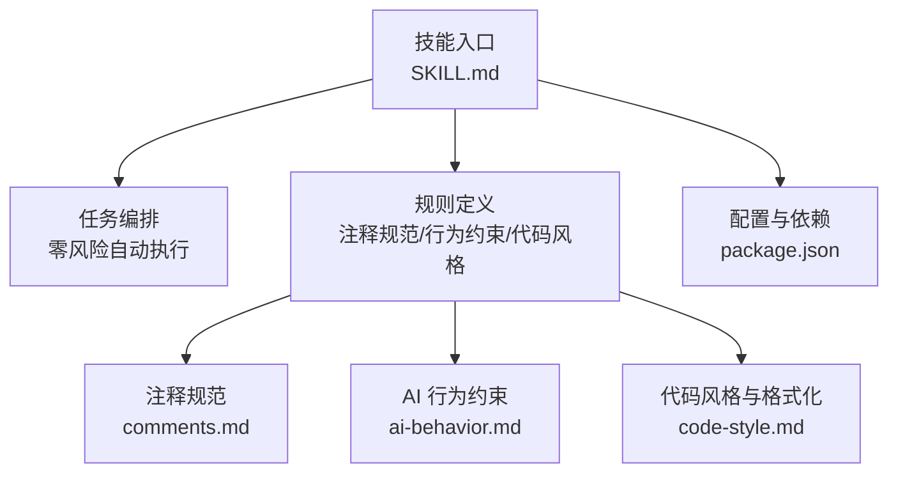
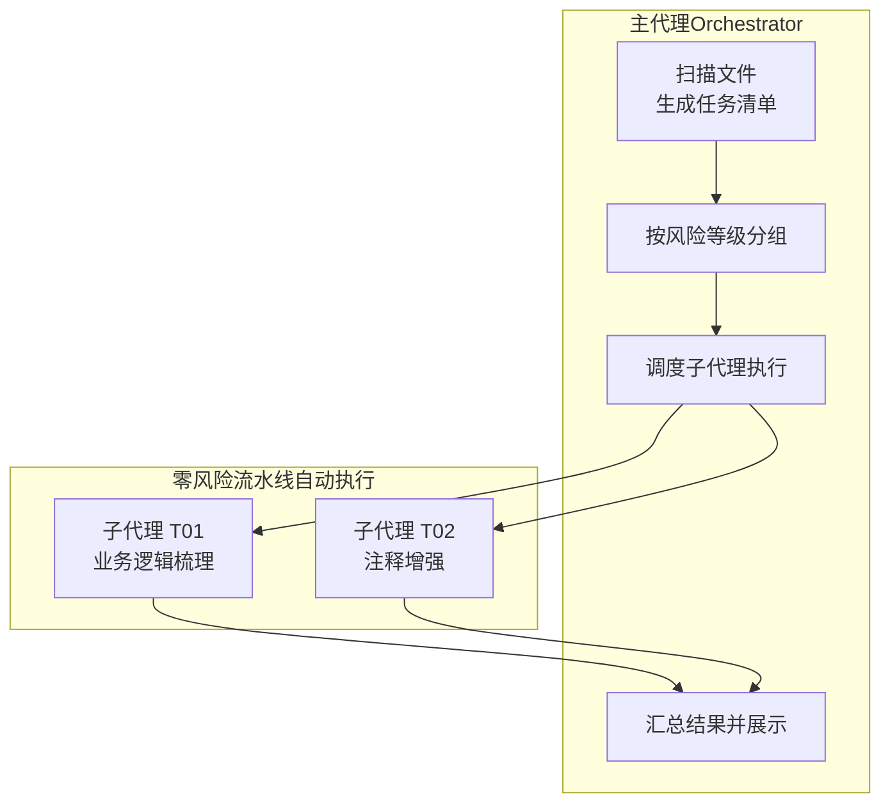
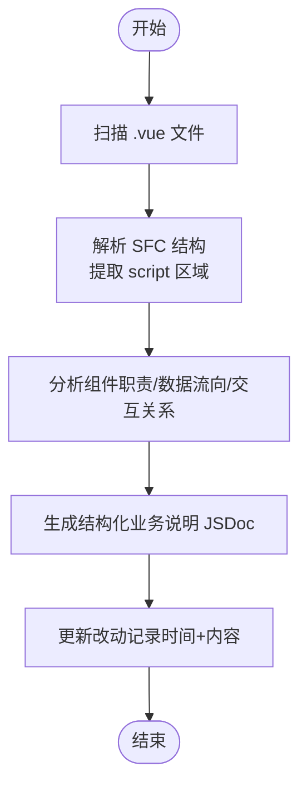
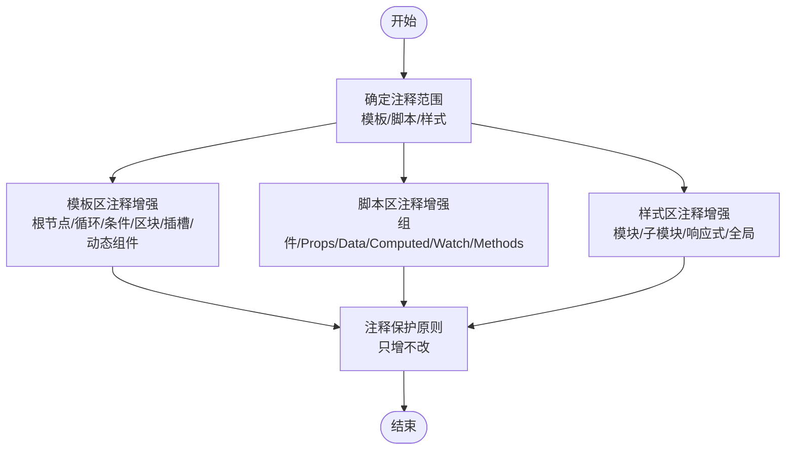
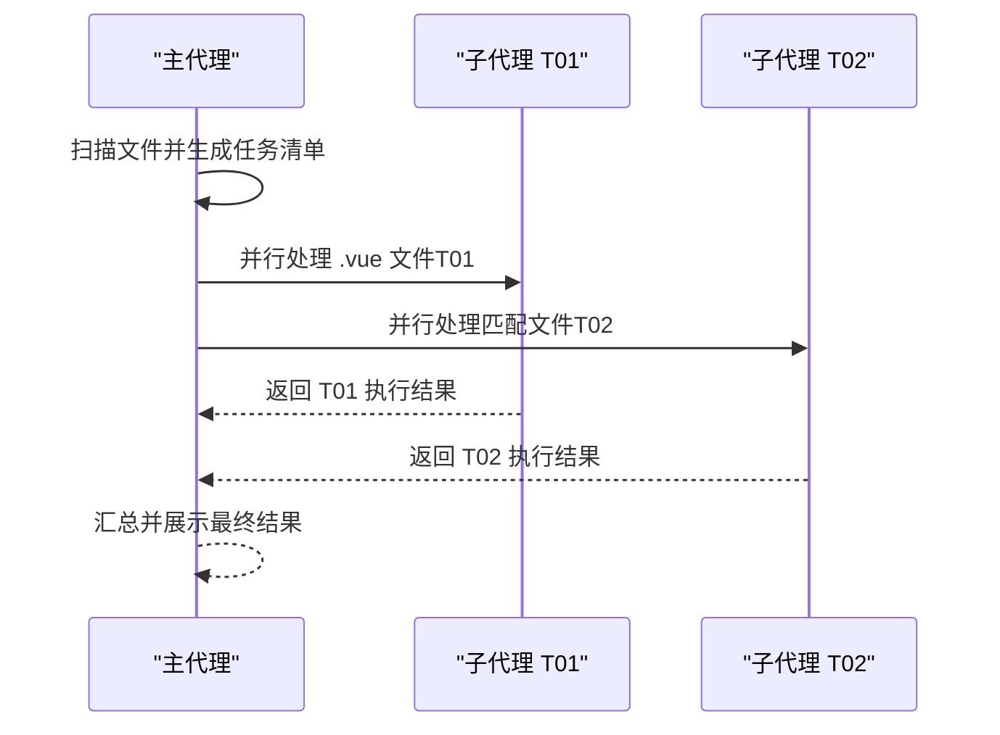
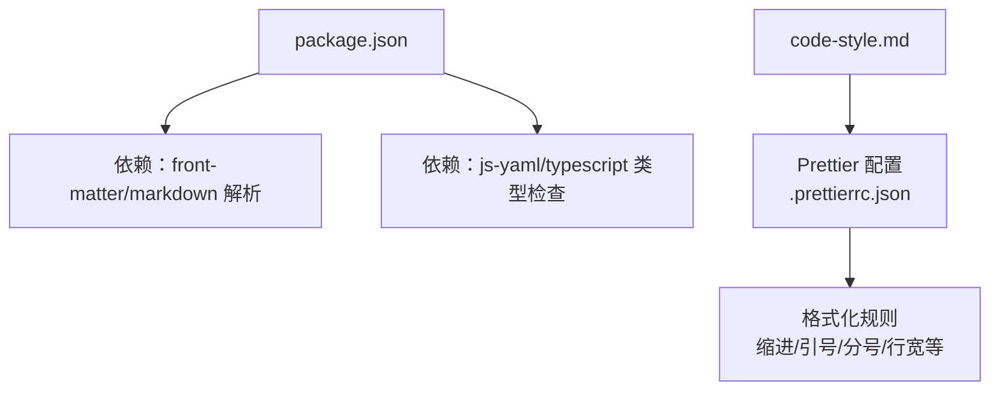

# 零风险优化任务

<cite>
**本文引用的文件**
- [yy-frontend-vue2-code-optimization/SKILL.md](file://skills/yy-frontend-vue2-code-optimization/SKILL.md)
- [yy-frontend-vue2-code-optimization/rules/comments.md](file://skills/yy-frontend-vue2-code-optimization/rules/comments.md)
- [yy-frontend-vue2-code-optimization/rules/ai-behavior.md](file://skills/yy-frontend-vue2-code-optimization/rules/ai-behavior.md)
- [yy-frontend-vue2-code-optimization/rules/code-style.md](file://skills/yy-frontend-vue2-code-optimization/rules/code-style.md)
- [package.json](file://package.json)
</cite>

## 目录
1. [简介](#简介)
2. [项目结构](#项目结构)
3. [核心组件](#核心组件)
4. [架构概览](#架构概览)
5. [详细组件分析](#详细组件分析)
6. [依赖分析](#依赖分析)
7. [性能考虑](#性能考虑)
8. [故障排除指南](#故障排除指南)
9. [结论](#结论)
10. [附录](#附录)

## 简介
本文件聚焦 Vue2 代码优化工具中的零风险优化任务，系统阐述 T01 业务逻辑梳理与 T02 注释增强两大自动执行任务的实现原理与操作流程。T01 专注于仅 .vue 文件的组件职责、数据流向与交互关系分析，并在 `<script>` 标签顶部生成结构化业务说明 JSDoc；T02 则面向模板区、脚本区与样式区，提供规范化注释增强，涵盖根节点、循环、条件、区块、插槽、动态组件等元素的注释规范。两大任务均属于零风险范畴，无需用户确认即可自动执行，旨在提升代码可读性与团队协作效率。

## 项目结构
该技能位于前端 Vue2 优化子技能目录下，围绕任务编排、规则定义与行为约束构建：

- 顶层技能说明：定义任务清单、风险等级、执行顺序与输出契约
- 规则模块：注释规范、AI 行为约束、代码风格与格式化
- 配置与依赖：Prettier 配置与项目依赖管理

图表来源
- [yy-frontend-vue2-code-optimization/SKILL.md:40-70](file://skills/yy-frontend-vue2-code-optimization/SKILL.md#L40-L70)
- [yy-frontend-vue2-code-optimization/rules/comments.md:1-106](file://skills/yy-frontend-vue2-code-optimization/rules/comments.md#L1-L106)
- [yy-frontend-vue2-code-optimization/rules/ai-behavior.md:1-29](file://skills/yy-frontend-vue2-code-optimization/rules/ai-behavior.md#L1-L29)
- [yy-frontend-vue2-code-optimization/rules/code-style.md:1-63](file://skills/yy-frontend-vue2-code-optimization/rules/code-style.md#L1-L63)
- [package.json:1-46](file://package.json#L1-L46)

章节来源
- [yy-frontend-vue2-code-optimization/SKILL.md:1-130](file://skills/yy-frontend-vue2-code-optimization/SKILL.md#L1-L130)
- [package.json:1-46](file://package.json#L1-L46)

## 核心组件
- 零风险任务流水线
  - T01 业务逻辑梳理：仅 .vue 文件，自动生成结构化业务说明 JSDoc
  - T02 注释增强：模板/脚本/样式注释增强，只增不改
- 子代理调度架构
  - 每个任务类型分配独立子代理，职责单一、并行执行、故障隔离
- 执行顺序与并行度
  - 阶段一：T01、T02 自动执行，同类型任务并行处理

章节来源
- [yy-frontend-vue2-code-optimization/SKILL.md:40-164](file://skills/yy-frontend-vue2-code-optimization/SKILL.md#L40-L164)

## 架构概览
零风险优化任务采用"主代理 + 子代理"的分布式架构，确保零风险任务自动执行且互不干扰：

图表来源
- [yy-frontend-vue2-code-optimization/SKILL.md:72-120](file://skills/yy-frontend-vue2-code-optimization/SKILL.md#L72-L120)

章节来源
- [yy-frontend-vue2-code-optimization/SKILL.md:72-120](file://skills/yy-frontend-vue2-code-optimization/SKILL.md#L72-L120)

## 详细组件分析

### T01 业务逻辑梳理（零风险）
- 适用范围：仅 .vue 文件
- 核心目标：分析组件职责、数据流向、交互关系与核心业务流程
- 实施方式：在 `<script>` 标签顶部生成结构化业务说明 JSDoc
- 更新策略：每次修改需记录改动时间与改动内容，倒序排列；若已有同类注释，追加新记录而非覆盖

图表来源
- [yy-frontend-vue2-code-optimization/SKILL.md:181-191](file://skills/yy-frontend-vue2-code-optimization/SKILL.md#L181-L191)

章节来源
- [yy-frontend-vue2-code-optimization/SKILL.md:181-191](file://skills/yy-frontend-vue2-code-optimization/SKILL.md#L181-L191)

### T02 注释增强（零风险）
- 适用范围：模板区、脚本区、样式区
- 核心目标：规范化注释，只增不改
- 模板区注释规范
  - 根节点：组件名称
  - 循环节点：循环描述
  - 条件分支：条件描述
  - 关键区块：区块名称
  - 插槽节点：插槽名称
  - 动态组件：动态组件描述
- 脚本区注释规范
  - 组件名称、props、data、computed、watch、methods、组件引入、provide、inject 等行内注释
  - 关键方法添加 ≤5 行的 JSDoc
- 样式区注释规范
  - 模块分组、子模块、响应式区块、全局样式等注释
- 注释保护原则
  - 代码逻辑发生变更时，对应注释必须同步更新
  - 已有注释若正确，只增不改；仅在三种情况下可修改：注释明显错误、业务逻辑实质性变更、命名变更导致引用失效

图表来源
- [yy-frontend-vue2-code-optimization/rules/comments.md:7-106](file://skills/yy-frontend-vue2-code-optimization/rules/comments.md#L7-L106)

章节来源
- [yy-frontend-vue2-code-optimization/rules/comments.md:1-106](file://skills/yy-frontend-vue2-code-optimization/rules/comments.md#L1-L106)

### 子代理执行流程（T01/T02）
- 并行处理：同类型任务可并行处理多个文件
- 自动执行：零风险任务无需等待用户确认
- 上下文轻量：单个子代理处理的上下文窗口压力小

图表来源
- [yy-frontend-vue2-code-optimization/SKILL.md:132-164](file://skills/yy-frontend-vue2-code-optimization/SKILL.md#L132-L164)

章节来源
- [yy-frontend-vue2-code-optimization/SKILL.md:132-164](file://skills/yy-frontend-vue2-code-optimization/SKILL.md#L132-L164)

## 依赖分析
- Prettier 配置：统一代码风格与格式化，确保注释增强与风格清洗的一致性
- 项目依赖：Markdown 解析与 YAML 支持，保障规则文档与技能元数据的正确解析

图表来源
- [package.json:34-44](file://package.json#L34-L44)
- [yy-frontend-vue2-code-optimization/rules/code-style.md:5-28](file://skills/yy-frontend-vue2-code-optimization/rules/code-style.md#L5-L28)

章节来源
- [package.json:1-46](file://package.json#L1-L46)
- [yy-frontend-vue2-code-optimization/rules/code-style.md:1-63](file://skills/yy-frontend-vue2-code-optimization/rules/code-style.md#L1-L63)

## 性能考虑
- 零风险任务的并行执行能力显著提升处理吞吐量，适合批量优化场景
- 子代理职责单一，减少上下文切换开销，降低内存占用
- 注释增强与业务逻辑梳理均为纯文本处理，对大型文件建议分批执行以避免单次处理耗时过长

## 故障排除指南
- 注释保护原则冲突
  - 现象：已有注释与当前逻辑不一致
  - 处理：仅在注释明显错误、业务逻辑实质性变更或命名变更导致引用失效时进行修改
- AI 行为边界
  - 现象：AI 想要创建 README 或修改非 src 目录文件
  - 处理：严格遵守 AI 行为约束，仅允许修改 src 目录下的注释与 JSDoc
- 格式化一致性
  - 现象：注释增强后格式不一致
  - 处理：确保遵循 Prettier 配置，必要时重新执行格式化

章节来源
- [yy-frontend-vue2-code-optimization/rules/ai-behavior.md:1-29](file://skills/yy-frontend-vue2-code-optimization/rules/ai-behavior.md#L1-L29)
- [yy-frontend-vue2-code-optimization/rules/comments.md:96-106](file://skills/yy-frontend-vue2-code-optimization/rules/comments.md#L96-L106)
- [yy-frontend-vue2-code-optimization/rules/code-style.md:1-63](file://skills/yy-frontend-vue2-code-optimization/rules/code-style.md#L1-L63)

## 结论
T01 业务逻辑梳理与 T02 注释增强作为零风险优化任务，通过结构化 JSDoc 与规范化注释，显著提升了 Vue2 组件的可读性与可维护性。其自动执行、并行处理的设计降低了人工干预成本，配合严格的注释保护原则与 AI 行为约束，确保优化过程安全可控。建议在团队协作中优先启用零风险任务，为后续中/高风险优化奠定良好基础。

## 附录
- 任务匹配与文件类型
  - .vue：T01、T02、T03、T04、T05、T06、T07
  - .js：T02、T03、T05、T06、T07
  - .css/.scss/.less：T03、T04
- 输出契约
  - 子代理输出包含任务类型、处理文件数量、文件执行详情与关键变更 diff
  - 最终汇总包含处理文件总数、各任务完成状态与跳过/警告提醒统计

章节来源
- [yy-frontend-vue2-code-optimization/SKILL.md:122-130](file://skills/yy-frontend-vue2-code-optimization/SKILL.md#L122-L130)
- [yy-frontend-vue2-code-optimization/SKILL.md:323-397](file://skills/yy-frontend-vue2-code-optimization/SKILL.md#L323-L397)