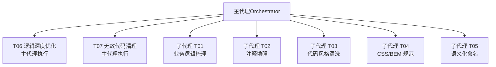
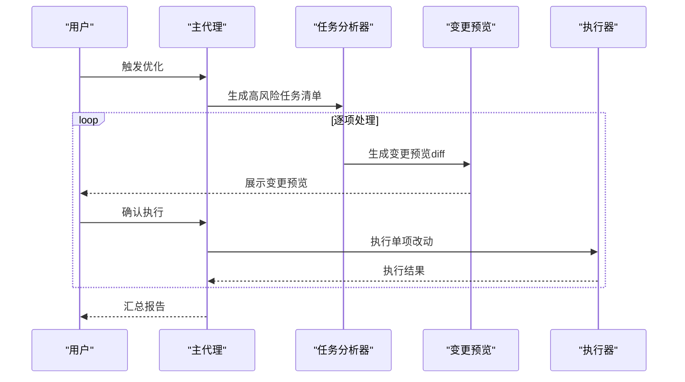
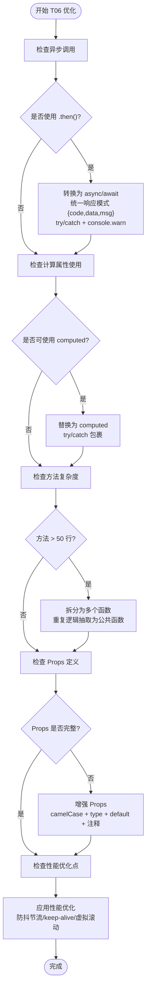
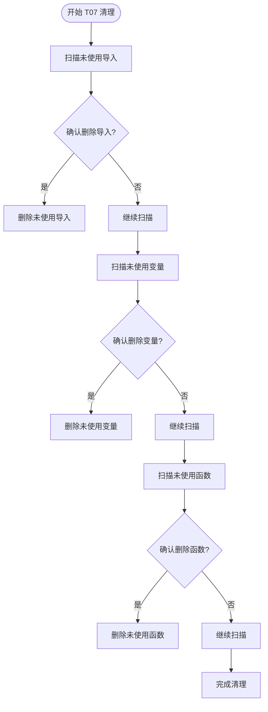
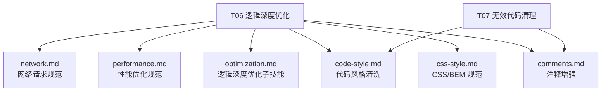

# 高风险优化任务

<cite>
**本文档引用的文件**
- [SKILL.md](file://skills/yy-frontend-vue2-code-optimization/SKILL.md)
- [optimization.md](file://skills/yy-frontend-vue2-code-optimization/sub-skills/optimization.md)
- [skill-prompts-simple.md](file://skills/yy-frontend-vue2-code-optimization/prompts/skill-prompts-simple.md)
- [performance.md](file://skills/yy-frontend-vue2-code-optimization/rules/performance.md)
- [network.md](file://skills/yy-frontend-vue2-code-optimization/rules/network.md)
- [code-style.md](file://skills/yy-frontend-vue2-code-optimization/sub-skills/code-style.md)
- [css-style.md](file://skills/yy-frontend-vue2-code-optimization/sub-skills/css-style.md)
- [comments.md](file://skills/yy-frontend-vue2-code-optimization/sub-skills/comments.md)
</cite>

## 目录
1. [简介](#简介)
2. [项目结构](#项目结构)
3. [核心组件](#核心组件)
4. [架构概览](#架构概览)
5. [详细组件分析](#详细组件分析)
6. [依赖分析](#依赖分析)
7. [性能考虑](#性能考虑)
8. [故障排除指南](#故障排除指南)
9. [结论](#结论)

## 简介
本文件面向 Vue2 代码优化工具的高风险优化任务，重点阐述两类高风险任务的执行策略与风险控制机制：
- T06 逻辑深度优化：涉及运行时行为变更的深度重构，包括 async/await 转换、computed 优先使用、网络请求统一模式、方法拆分与 Props 增强等。
- T07 无效代码清理：涉及删除未使用代码的高风险操作，包括未使用导入、未使用变量/函数的识别与删除。

为确保安全性，这两类任务均采用"主代理执行 + 逐项确认 + 变更预览"的严格流程，任何改动必须在用户明确确认后才执行。

## 项目结构
该技能围绕 Vue2 前端代码优化，提供从零风险到高风险的多级任务体系。高风险任务（T06、T07）由主代理直接执行，不使用子代理，确保用户对每项改动拥有完全控制权。

**图表来源**
- [SKILL.md: 72-120:72-120](file://skills/yy-frontend-vue2-code-optimization/SKILL.md#L72-L120)

**章节来源**
- [SKILL.md: 40-69:40-69](file://skills/yy-frontend-vue2-code-optimization/SKILL.md#L40-L69)
- [SKILL.md: 112-120:112-120](file://skills/yy-frontend-vue2-code-optimization/SKILL.md#L112-L120)

## 核心组件
- 主代理（Orchestrator）：负责扫描文件、生成任务清单、按风险等级分组、调度子代理执行、汇总结果并展示。对于高风险任务（T06、T07），主代理直接分析并逐项确认执行。
- 子代理：每个任务类型分配独立子代理，实现职责单一、并行执行、故障隔离与上下文轻量。
- 风险等级与执行规则：
  - 零风险（T01、T02）：自动执行，无需等待
  - 中风险（T03、T04、T05）：必须用户明确确认后执行
  - 高风险（T06、T07）：必须逐项单独确认，展示 diff 预览

**章节来源**
- [SKILL.md: 56-69:56-69](file://skills/yy-frontend-vue2-code-optimization/SKILL.md#L56-L69)
- [SKILL.md: 72-120:72-120](file://skills/yy-frontend-vue2-code-optimization/SKILL.md#L72-L120)

## 架构概览
高风险任务的执行遵循严格的"逐项确认 + 变更预览"流程，确保用户对每处改动有完全掌控。

**图表来源**
- [SKILL.md: 151-155:151-155](file://skills/yy-frontend-vue2-code-optimization/SKILL.md#L151-L155)
- [SKILL.md: 380-386:380-386](file://skills/yy-frontend-vue2-code-optimization/SKILL.md#L380-L386)

**章节来源**
- [SKILL.md: 132-164:132-164](file://skills/yy-frontend-vue2-code-optimization/SKILL.md#L132-L164)

## 详细组件分析

### T06 逻辑深度优化
T06 是高风险任务，涉及运行时行为的深度优化，必须由主代理执行并逐项确认。

#### 核心优化策略
- 异步与网络请求优化
  - 将 `.then()` 链式调用转换为 `async/await`
  - 统一响应模式：`{ code, data, msg }` 解构处理
  - 错误处理使用 `try/catch + console.warn`
- 计算属性优先
  - 除与后端交互和定时器外，尽可能使用 `computed`
  - computed 必须用 try/catch 包裹，避免计算属性报错影响渲染
- 方法拆分与 Props 增强
  - 单个方法超过 50 行必须拆分
  - 重复 ≥2 次逻辑抽离为公共函数
  - Props 增强：camelCase、明确 `type` 和 `default`、添加注释
- 性能优化
  - 动态导入、`<keep-alive>`、虚拟滚动、防抖节流
  - 避免在 watch 中同步 DOM 操作

**图表来源**
- [optimization.md: 38-234:38-234](file://skills/yy-frontend-vue2-code-optimization/sub-skills/optimization.md#L38-L234)
- [performance.md: 7-179:7-179](file://skills/yy-frontend-vue2-code-optimization/rules/performance.md#L7-L179)
- [network.md: 7-180:7-180](file://skills/yy-frontend-vue2-code-optimization/rules/network.md#L7-L180)

#### 相等运算符转换（高风险）
- 核心原则：不主动变更 `==` 和 `===`，保持代码原有写法
- 建议转换场景（需确认后执行）：
  - 接口响应的 `code` 字段比较：`code === 0` 或 `code === 200`
  - 明确类型已知的比较：`typeof x === 'string'`、`x === null`、`x === undefined`
- 风险说明：任何 `==` ↔ `===` 之间的转换都属于逻辑变更，可能改变代码的实际行为

**章节来源**
- [optimization.md: 15-37:15-37](file://skills/yy-frontend-vue2-code-optimization/sub-skills/optimization.md#L15-L37)
- [optimization.md: 38-87:38-87](file://skills/yy-frontend-vue2-code-optimization/sub-skills/optimization.md#L38-L87)

#### Vue2 响应式陷阱处理
- 新增对象属性：`this.obj.newKey = val` → `this.$set(this.obj, 'newKey', val)`
- 数组索引赋值：`this.arr[i] = val` → `this.$set(this.arr, i, val)`
- 数组长度修改：`this.arr.length = n` → `this.arr.splice(n)`

**章节来源**
- [optimization.md: 159-184:159-184](file://skills/yy-frontend-vue2-code-optimization/sub-skills/optimization.md#L159-L184)

### T07 无效代码清理
T07 是高风险任务，涉及删除未使用代码，必须由主代理执行并逐项确认。

#### 清理策略
- 清理未使用的导入语句（import/require）
- 清理未使用的变量声明（`const`/`let`/`var`）
- 清理未使用的函数定义
- 逐项确认：每发现一个无效项，先展示位置和代码，由用户确认是否删除
- 谨慎判断原则：
  - 仅删除确实未被引用的代码
  - 保留可能在运行时动态使用的代码（如全局注册的组件）
  - 保留可能通过字符串动态调用的方法

**图表来源**
- [SKILL.md: 272-287:272-287](file://skills/yy-frontend-vue2-code-optimization/SKILL.md#L272-L287)

**章节来源**
- [SKILL.md: 272-287:272-287](file://skills/yy-frontend-vue2-code-optimization/SKILL.md#L272-L287)

### 主代理执行机制与逐项确认流程
- 主代理负责扫描文件、生成任务清单、按风险等级分组
- 高风险任务（T06、T07）由主代理直接分析，不使用子代理
- 每项改动必须展示 diff 预览 → 用户确认 → 执行 → 下一项
- 不使用子代理，确保用户对每项改动有完全控制

**章节来源**
- [SKILL.md: 151-155:151-155](file://skills/yy-frontend-vue2-code-optimization/SKILL.md#L151-L155)
- [SKILL.md: 380-386:380-386](file://skills/yy-frontend-vue2-code-optimization/SKILL.md#L380-L386)

## 依赖分析
T06 逻辑深度优化与 T07 无效代码清理分别依赖不同的规则与子技能：

**图表来源**
- [optimization.md: 5-14:5-14](file://skills/yy-frontend-vue2-code-optimization/sub-skills/optimization.md#L5-L14)
- [SKILL.md: 256-287:256-287](file://skills/yy-frontend-vue2-code-optimization/SKILL.md#L256-L287)

**章节来源**
- [optimization.md: 5-14:5-14](file://skills/yy-frontend-vue2-code-optimization/sub-skills/optimization.md#L5-L14)
- [SKILL.md: 256-287:256-287](file://skills/yy-frontend-vue2-code-optimization/SKILL.md#L256-L287)

## 性能考虑
- 异步优化：尽可能使用 async/await，减少 .then() 链式调用
- 计算优先：除与后端交互和定时器外，一律尽可能使用 computed
- 性能优化：路由和大组件使用动态 import，合理使用 `<keep-alive>`
- 防抖节流：搜索（防抖300ms）、滚动（节流100ms）、resize（节流）、按钮点击（防抖/锁）

**章节来源**
- [SKILL.md: 311-320:311-320](file://skills/yy-frontend-vue2-code-optimization/SKILL.md#L311-L320)
- [performance.md: 7-179:7-179](file://skills/yy-frontend-vue2-code-optimization/rules/performance.md#L7-L179)

## 故障排除指南
- 零风险任务（T01、T02）：自动执行，无需等待
- 中风险任务（T03、T04、T05）：必须用户明确确认后执行
- 高风险任务（T06、T07）：必须逐项单独确认，展示 diff 预览
- 边界条件：
  - 不生成新组件：组件拆分属于架构调整，必须用户确认后执行
  - 不修改业务逻辑：绝不修改业务逻辑或变更功能
  - 运算符转换：`==`/`===` 保持原有写法，仅接口响应 `code` 例外使用 `===`
  - 回滚机制：建议用户先提交当前状态，以便随时回滚
  - 大型文件：超过 1000 行的文件建议分批优化

**章节来源**
- [SKILL.md: 169-180:169-180](file://skills/yy-frontend-vue2-code-optimization/SKILL.md#L169-L180)
- [SKILL.md: 290-320:290-320](file://skills/yy-frontend-vue2-code-optimization/SKILL.md#L290-L320)

## 结论
T06 逻辑深度优化与 T07 无效代码清理作为高风险任务，通过"主代理执行 + 逐项确认 + 变更预览"的严格流程，确保用户对每项改动拥有完全控制权。建议在执行前：
- 先进行完整的代码审查，识别潜在的动态引用与运行时依赖
- 对于 T06 任务，优先处理异步转换与计算属性优化，再进行方法拆分与性能优化
- 对于 T07 任务，仔细核对未使用代码的引用范围，避免误删动态调用或全局注册的组件
- 建议在执行前提交当前状态，以便随时回滚