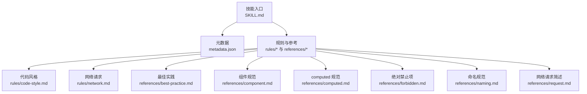
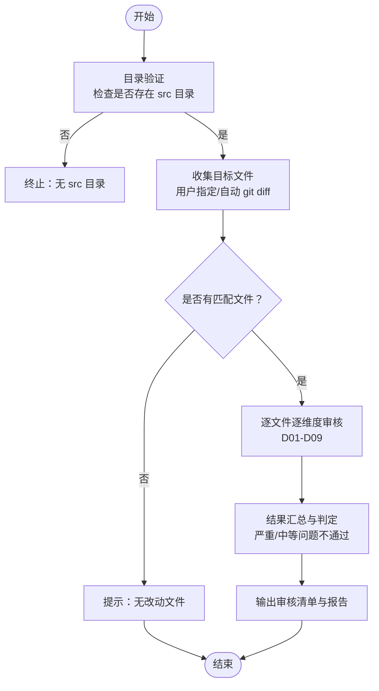
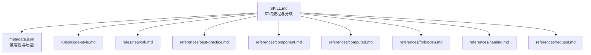
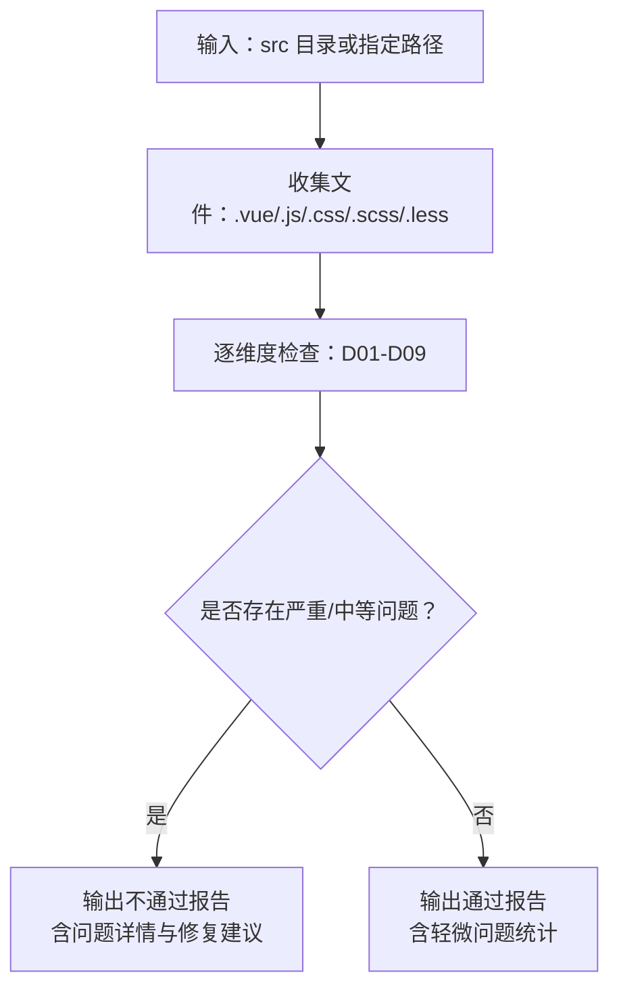

# Vue2 代码审核系统

<cite>
**本文档引用的文件**
- [SKILL.md](file://skills/yy-frontend-vue2-review/SKILL.md)
- [metadata.json](file://skills/yy-frontend-vue2-review/metadata.json)
- [code-style.md](file://skills/yy-frontend-vue2-review/rules/code-style.md)
- [network.md](file://skills/yy-frontend-vue2-review/rules/network.md)
- [best-practice.md](file://skills/yy-frontend-vue2-review/references/best-practice.md)
- [component.md](file://skills/yy-frontend-vue2-review/references/component.md)
- [computed.md](file://skills/yy-frontend-vue2-review/references/computed.md)
- [forbidden.md](file://skills/yy-frontend-vue2-review/references/forbidden.md)
- [naming.md](file://skills/yy-frontend-vue2-review/references/naming.md)
- [request.md](file://skills/yy-frontend-vue2-review/references/request.md)
</cite>

## 目录
1. [简介](#简介)
2. [项目结构](#项目结构)
3. [核心组件](#核心组件)
4. [架构总览](#架构总览)
5. [详细组件分析](#详细组件分析)
6. [依赖关系分析](#依赖关系分析)
7. [性能考量](#性能考量)
8. [故障排查指南](#故障排查指南)
9. [结论](#结论)
10. [附录](#附录)

## 简介
本系统是面向 Vue2 项目的专用代码审核技能，专注于在 src 目录范围内对 .vue/.js/.css/.scss/.less 文件进行 9 大维度的自动化代码质量检查。系统采用严格的边界控制（仅 src 目录）、三级严重程度分级（🔴 严重/🟡 中等/🟢 轻微）以及“仅审核不修改”的原则，确保审核结果可追溯、可修复且不影响现有工作流。

## 项目结构
该技能位于 skills/yy-frontend-vue2-review 目录，包含技能元数据、规则与参考文档。核心结构如下：
- 技能描述与执行流程：SKILL.md
- 兼容性与功能清单：metadata.json
- 规则与参考文档：
  - 代码风格与格式化：rules/code-style.md
  - 网络请求规范：rules/network.md
  - 最佳实践：references/best-practice.md
  - 组件规范：references/component.md
  - computed 规范：references/computed.md
  - 绝对禁止项：references/forbidden.md
  - 命名规范：references/naming.md
  - 网络请求规范（简述）：references/request.md

图表来源
- [SKILL.md:1-167](file://skills/yy-frontend-vue2-review/SKILL.md#L1-L167)
- [metadata.json:1-34](file://skills/yy-frontend-vue2-review/metadata.json#L1-L34)

章节来源
- [SKILL.md:1-167](file://skills/yy-frontend-vue2-review/SKILL.md#L1-L167)
- [metadata.json:1-34](file://skills/yy-frontend-vue2-review/metadata.json#L1-L34)

## 核心组件
- 审核边界与目标选择
  - 严格限制在 src 目录内审核，支持用户指定路径或自动收集 git diff 变动文件。
  - 支持的文件类型：.vue/.js/.css/.scss/.less。
- 9 大审核维度
  - D01 代码风格（2 空格缩进、JS 单引号、分号、尾随逗号、箭头函数、3 组导入顺序）
  - D02 最佳实践（调试代码、scoped、未使用变量等）
  - D03 Vue2 组件规范（脚本结构、Props、Emit 等）
  - D04 命名规范（API、事件、常量、组件名等）
  - D05 网络请求规范（async/await、统一响应等）
  - D06 computed 规范（try/catch、有意义命名）
  - D07 逻辑错误（空指针、数组越界、判断遗漏等）
  - D08 安全漏洞（XSS、敏感信息泄露）
  - D09 绝对禁止项（连续解构、修改 props 等）
- 严重程度分级
  - 🔴 严重：D07/D08/D09 发现即不通过
  - 🟡 中等：D03/D04/D05/D06 发现则列出，不通过但可建议修复
  - 🟢 轻微：D01/D02 发现则列出，不影响通过结论
- 输出与汇总
  - 生成按文件×维度的审核矩阵，支持按严重程度分组输出问题详情与修复建议。

章节来源
- [SKILL.md:27-96](file://skills/yy-frontend-vue2-review/SKILL.md#L27-L96)
- [SKILL.md:101-152](file://skills/yy-frontend-vue2-review/SKILL.md#L101-L152)

## 架构总览
系统以“边界控制 + 维度规则 + 严重程度分级 + 结果汇总”为核心，形成闭环的审核流程。

图表来源
- [SKILL.md:61-96](file://skills/yy-frontend-vue2-review/SKILL.md#L61-L96)

## 详细组件分析

### D01 代码风格与格式化
- 规则来源：基于 Prettier 配置，强调 2 空格缩进、JS 单引号、HTML 属性双引号、分号、行宽、尾随逗号、箭头函数省括号、对象括号保留空格等。
- 导入顺序与脚本结构顺序：详见后续“组件规范”与“代码风格”规则文件。
- 实施要点
  - 通过统一的 .prettierrc.json 配置确保团队一致性。
  - 优先使用箭头函数写法，避免 function 声明。
  - 严格遵循“3 组导入顺序”与“<script> 结构顺序”。

章节来源
- [code-style.md:1-63](file://skills/yy-frontend-vue2-review/rules/code-style.md#L1-L63)

### D02 最佳实践
- 调试代码清理：必须清理 console.log、debugger、alert；catch 块中的 console.warn 允许保留。
- 样式规范：BEM 命名、scoped 作用域、::v-deep 穿透、嵌套不超过 3 层、推荐使用 PostCSS 编译后的嵌套。
- CSS 布局与兼容性：定位层级、内外边距方向、兼容性风险与降级方案。
- 未使用变量：需自行清理（ESLint 已关闭检查，但审核需指出）。
- Props 解构：可解构，需注意响应式丢失问题。

章节来源
- [best-practice.md:1-107](file://skills/yy-frontend-vue2-review/references/best-practice.md#L1-L107)

### D03 Vue2 组件规范
- 脚本结构顺序：name → components → props → data → computed → watch → methods → 生命周期钩子。
- 生命周期标准顺序：beforeCreate → created → beforeMount → mounted → beforeUpdate → updated → activated → deactivated → beforeDestroy → destroyed。
- 模板元素特性顺序：is → v-for → v-if/v-else-if/v-else → v-show/v-cloak → id → props/attrs → v-on → v-html/v-text → v-slot。
- Props 规范：camelCase 命名、明确类型与默认值、添加用途注释。
- Emit 事件规范：顺序 input → 其它自定义事件 → change/click 等交互事件；基础组件禁止在生命周期中 emit。
- v-slot 语法：使用动态风格（# 或 v-slot:），避免废弃语法。
- 组件命名：模板引用 PascalCase，文件名多个单词 + PascalCase。
- data/computed 使用原则：除后端交互与定时器外，尽量使用 computed。
- 模块化原则：单一职责、高内聚低耦合，超过 500 行应拆分。

章节来源
- [component.md:1-195](file://skills/yy-frontend-vue2-review/references/component.md#L1-L195)

### D04 命名规范
- API 函数：api + Method + URLPath（小驼峰）
- 事件函数：on + EventName（小驼峰）
- 常量：全大写 + 下划线
- Props：小驼峰
- 组件名：PascalCase
- 组件文件名：多个单词 + PascalCase
- emit 事件：小驼峰
- 普通方法：小驼峰（动词开头）
- data 属性：小驼峰（名词/形容词）
- computed 属性：小驼峰（前缀标识类型）
- computed 前缀约定：is/has/visible/show/formatted/parsed/total/count 等。

章节来源
- [naming.md:1-35](file://skills/yy-frontend-vue2-review/references/naming.md#L1-L35)

### D05 网络请求规范
- 异步处理：必须使用 async/await，统一 try/catch/finally 结构。
- 响应处理：单次解构，禁止连续解构；先判断成功再使用数据。
- 错误处理：禁止空 catch；业务错误在 else 分支 console.warn 记录。
- 等于运算符：优先推荐 ==；若将 === 改为 ==，需提醒用户手动确认。
- 防重复提交：表单提交等写操作在请求中通过 loading 状态禁用按钮。
- 安全规范：v-html 必须用 DOMPurify.sanitize() 过滤；敏感数据不在 URL 传 token/密码，不 console.log 用户凭证。

章节来源
- [network.md:1-180](file://skills/yy-frontend-vue2-review/rules/network.md#L1-L180)
- [request.md:1-44](file://skills/yy-frontend-vue2-review/references/request.md#L1-L44)

### D06 computed 规范
- 必须使用 try/catch：所有 computed 内部必须包裹 try/catch，失败时返回合理默认值并记录日志。
- 有意义的命名：使用 isXxx/hasXxx/visibleXxx/formattedXxx/totalXxx 等前缀标识类型。

章节来源
- [computed.md:1-31](file://skills/yy-frontend-vue2-review/references/computed.md#L1-L31)

### D07 逻辑错误
- 空指针：禁止连续解构；统一响应模式下先判断成功再访问数据。
- 数组越界：访问数组前进行长度校验。
- 判断遗漏：分支覆盖不全，需补充边界条件与异常分支。

章节来源
- [network.md:79-116](file://skills/yy-frontend-vue2-review/rules/network.md#L79-L116)
- [forbidden.md:10-17](file://skills/yy-frontend-vue2-review/references/forbidden.md#L10-L17)

### D08 安全漏洞
- XSS：v-html 必须用 DOMPurify.sanitize() 过滤。
- 敏感信息泄露：不在 URL 传 token/密码；不 console.log 用户凭证。

章节来源
- [network.md:176-180](file://skills/yy-frontend-vue2-review/rules/network.md#L176-L180)

### D09 绝对禁止项
- 连续解构：禁止 const { ...data.data } 等连续解构。
- 修改子组件数据：禁止父组件通过 $refs/$children 直接修改子组件数据。
- 修改 data 类型：禁止多次修改 data 属性类型。
- 直接修改 props：禁止直接修改组件 props。

章节来源
- [forbidden.md:10-35](file://skills/yy-frontend-vue2-review/references/forbidden.md#L10-L35)

## 依赖关系分析
- 规则与参考文档的组织关系
  - SKILL.md 作为入口，定义审核流程与严重程度分级，并引用各维度的参考文档。
  - metadata.json 提供版本、兼容性与功能清单，确保系统边界与能力清晰。
  - 各维度规则文件相互独立，便于维护与扩展。

图表来源
- [SKILL.md:1-167](file://skills/yy-frontend-vue2-review/SKILL.md#L1-L167)
- [metadata.json:1-34](file://skills/yy-frontend-vue2-review/metadata.json#L1-L34)

章节来源
- [SKILL.md:1-167](file://skills/yy-frontend-vue2-review/SKILL.md#L1-L167)
- [metadata.json:1-34](file://skills/yy-frontend-vue2-review/metadata.json#L1-L34)

## 性能考量
- 审核范围控制：仅 src 目录，避免无关文件扫描，降低 IO 与解析开销。
- 并行处理：对不同文件的维度检查可并行执行，提升整体吞吐。
- 规则缓存：对 Prettier 配置与规则集进行缓存，减少重复解析成本。
- 输出聚合：按文件×维度矩阵输出，便于快速定位问题，减少二次扫描。

## 故障排查指南
- 无 src 目录：系统将终止审核并提示。
- 无匹配文件：提示“当前 src 目录下没有需要审核的改动文件”，无需继续。
- Vue3/React 项目：自动识别并拒绝处理，避免误用。
- 仅审核不修改：若需修复，请明确要求后再执行修复流程。
- 严重问题不通过：优先修复 D07/D08/D09，再处理中等问题，最后关注轻微问题。

章节来源
- [SKILL.md:39-46](file://skills/yy-frontend-vue2-review/SKILL.md#L39-L46)
- [SKILL.md:82-96](file://skills/yy-frontend-vue2-review/SKILL.md#L82-L96)

## 结论
本系统通过严格的边界控制、清晰的 9 大维度规则与三级严重程度分级，构建了面向 Vue2 项目的高质量代码审核体系。结合统一的输出格式与问题分组展示，能够帮助团队持续提升代码质量与安全性，同时保持与现有工作流的无缝衔接。

## 附录
- 审核流程图（概念示意）

