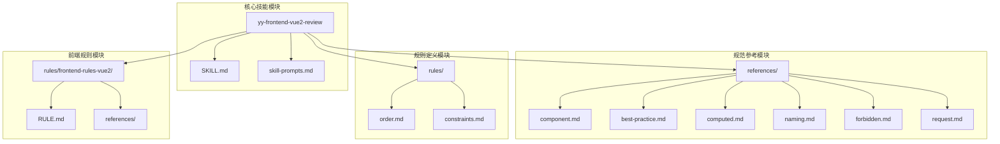
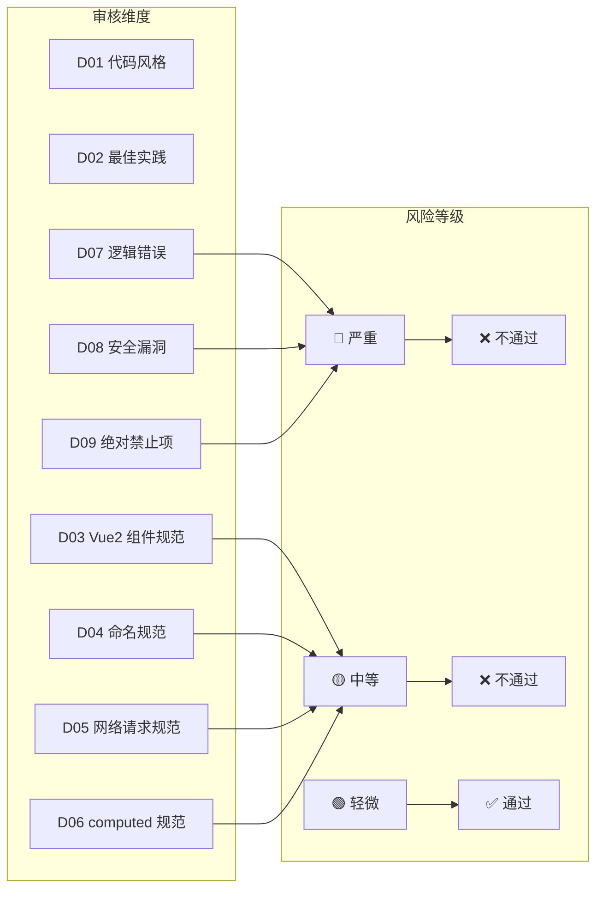
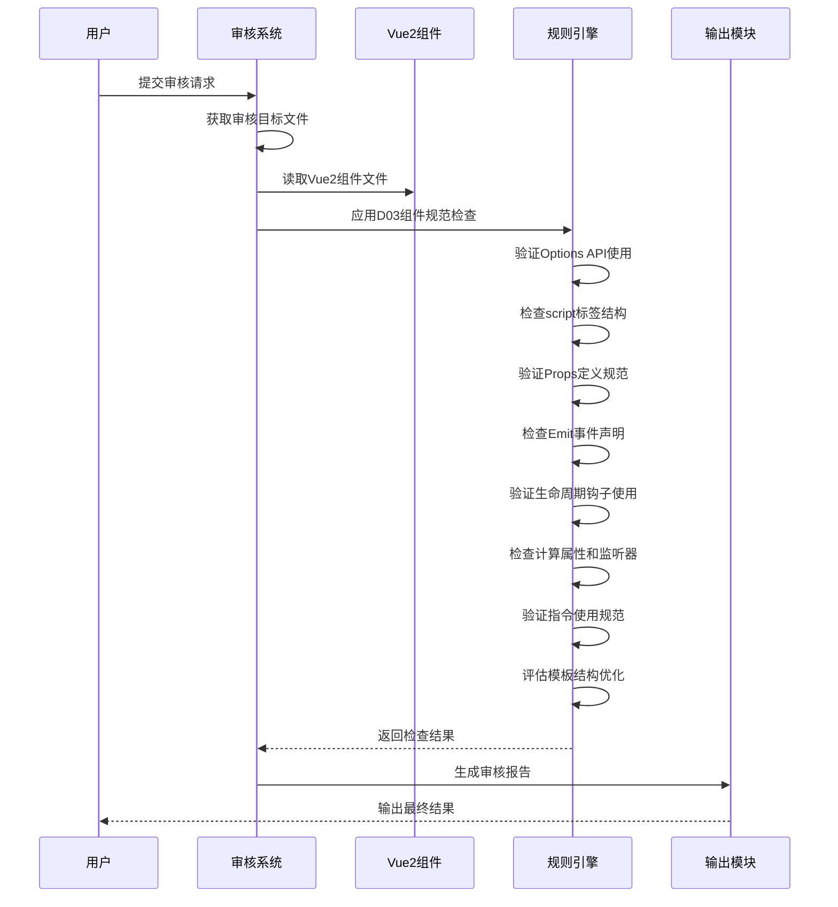
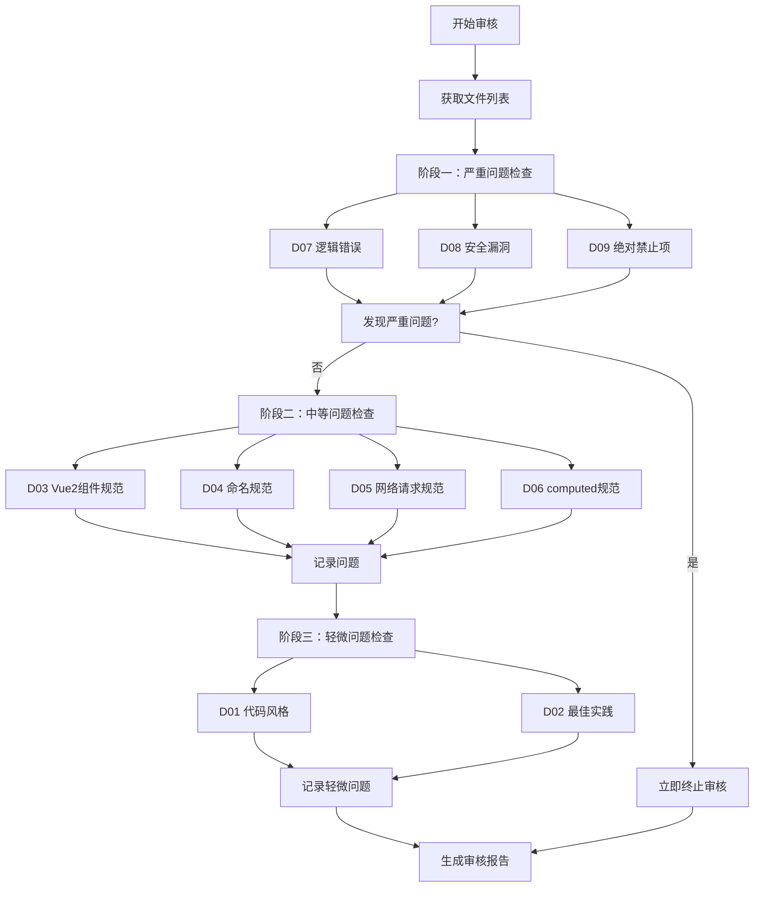
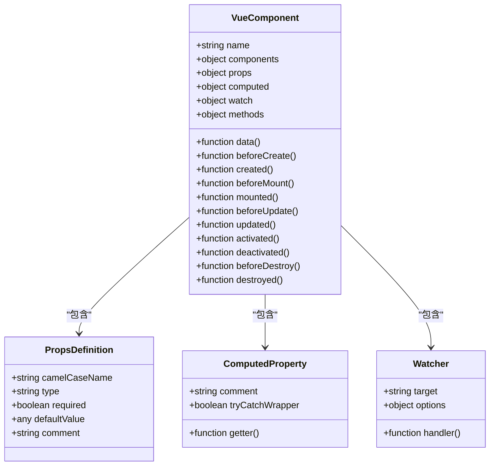
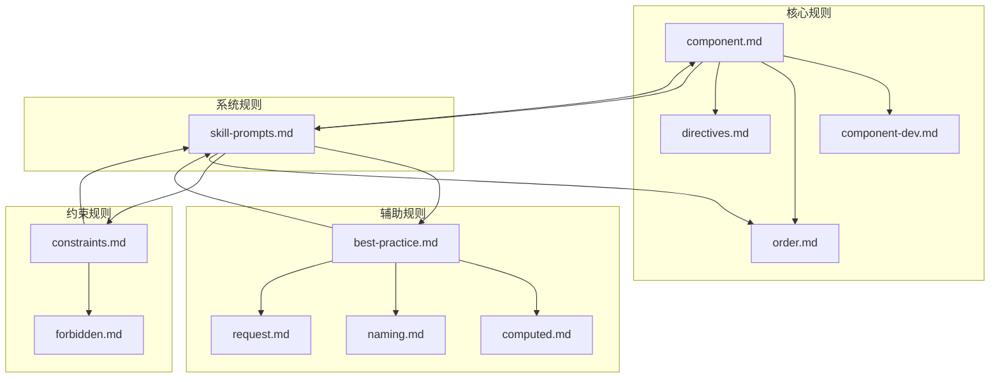

# Vue2 组件规范检查

<cite>
**本文档引用的文件**
- [SKILL.md](file://skills/yy-frontend-vue2-review/SKILL.md)
- [skill-prompts.md](file://skills/yy-frontend-vue2-review/prompts/skill-prompts.md)
- [component.md](file://skills/yy-frontend-vue2-review/references/component.md)
- [order.md](file://skills/yy-frontend-vue2-review/rules/order.md)
- [constraints.md](file://skills/yy-frontend-vue2-review/rules/constraints.md)
- [best-practice.md](file://skills/yy-frontend-vue2-review/references/best-practice.md)
- [computed.md](file://skills/yy-frontend-vue2-review/references/computed.md)
- [naming.md](file://skills/yy-frontend-vue2-review/references/naming.md)
- [forbidden.md](file://skills/yy-frontend-vue2-review/references/forbidden.md)
- [request.md](file://skills/yy-frontend-vue2-review/references/request.md)
- [RULE.md](file://rules/frontend-rules-vue2/RULE.md)
- [component-dev.md](file://rules/frontend-rules-vue2/references/component-dev.md)
- [order.md](file://rules/frontend-rules-vue2/references/order.md)
- [directives.md](file://rules/frontend-rules-vue2/references/directives.md)
</cite>

## 目录
1. [简介](#简介)
2. [项目结构](#项目结构)
3. [核心组件](#核心组件)
4. [架构概览](#架构概览)
5. [详细组件分析](#详细组件分析)
6. [依赖分析](#依赖分析)
7. [性能考虑](#性能考虑)
8. [故障排除指南](#故障排除指南)
9. [结论](#结论)
10. [附录](#附录)

## 简介

Vue2 组件规范检查是针对 Vue2 项目代码质量审核的重要工具，专注于 Options API 使用规范、组件开发最佳实践和代码质量评估。该系统通过严格的维度检查确保 Vue2 组件遵循统一的开发标准，提高代码的可维护性和一致性。

本系统覆盖 9 大审核维度，其中 D03 维度专门负责 Vue2 组件规范检查，包括 Options API 使用规范、script 标签结构要求、Props 定义规范、Emit 事件声明、生命周期钩子使用、计算属性和监听器规范、指令使用规范、模板结构优化等方面。

## 项目结构

Vue2 组件规范检查系统采用模块化设计，主要包含以下核心组件：



**图表来源**
- [SKILL.md:1-167](file://skills/yy-frontend-vue2-review/SKILL.md#L1-L167)
- [skill-prompts.md:1-628](file://skills/yy-frontend-vue2-review/prompts/skill-prompts.md#L1-L628)

**章节来源**
- [SKILL.md:1-167](file://skills/yy-frontend-vue2-review/SKILL.md#L1-L167)
- [skill-prompts.md:1-628](file://skills/yy-frontend-vue2-review/prompts/skill-prompts.md#L1-L628)

## 核心组件

### 审核维度体系

系统采用三层风险分级机制，确保不同严重程度的问题得到适当处理：



**图表来源**
- [skill-prompts.md:31-60](file://skills/yy-frontend-vue2-review/prompts/skill-prompts.md#L31-L60)

### 文件类型支持

系统支持多种文件类型的审核，每种文件类型关注不同的审核维度：

| 文件类型 | 涉及维度 | 审核重点 |
|---------|---------|---------|
| `.vue` | D01, D02, D03, D04, D05, D06, D07, D08, D09 | 完整组件审核 |
| `.js` | D01, D03, D04, D05, D06, D07, D09 | 逻辑和组件规范 |
| `.css/.scss/.less` | D01, D02 | 样式规范 |

**章节来源**
- [SKILL.md:47-56](file://skills/yy-frontend-vue2-review/SKILL.md#L47-L56)
- [skill-prompts.md:67-74](file://skills/yy-frontend-vue2-review/prompts/skill-prompts.md#L67-L74)

## 架构概览

### 审核流程架构



**图表来源**
- [skill-prompts.md:121-142](file://skills/yy-frontend-vue2-review/prompts/skill-prompts.md#L121-L142)

### 组件规范检查机制

系统采用分层审核架构，确保每个维度的检查独立且准确：



**图表来源**
- [skill-prompts.md:144-151](file://skills/yy-frontend-vue2-review/prompts/skill-prompts.md#L144-L151)

**章节来源**
- [skill-prompts.md:77-117](file://skills/yy-frontend-vue2-review/prompts/skill-prompts.md#L77-L117)

## 详细组件分析

### D03 维度：Vue2 组件规范

#### Options API 使用规范

Options API 是 Vue2 组件开发的核心模式，系统要求严格遵循以下使用规范：

**组件选项顺序要求**：
1. `name` - 组件名称声明
2. `components` - 局部组件注册
3. `props` - 父组件传入属性定义
4. `data()` - 组件内部状态
5. `computed` - 计算属性
6. `watch` - 侦听器
7. `methods` - 方法集合
8. `生命周期钩子` - 标准生命周期顺序

**生命周期钩子标准顺序**：
`beforeCreate` → `created` → `beforeMount` → `mounted` → `beforeUpdate` → `updated` → `activated` → `deactivated` → `beforeDestroy` → `destroyed`

#### script 标签结构要求

script 标签内部必须遵循严格的结构顺序和组织规范：



**图表来源**
- [component.md:9-25](file://skills/yy-frontend-vue2-review/references/component.md#L9-L25)
- [order.md:15-29](file://skills/yy-frontend-vue2-review/rules/order.md#L15-L29)

#### Props 定义规范

Props 定义必须遵循严格的规范以确保组件的可维护性和类型安全性：

**命名规范**：
- JavaScript 侧使用 camelCase 命名
- 模板中自动转换为 kebab-case
- 必须添加含义注释说明用途

**类型要求**：
- 必须明确指定类型：`String`、`Number`、`Boolean`、`Array`、`Object`、`Function`
- 推荐提供默认值（非 required 时）
- 避免使用 `null` 作为默认值

**示例结构**：
```javascript
props: {
  // 用户 ID，必填
  userId: {
    type: String,
    required: true
  },
  // 是否显示加载状态
  isLoading: {
    type: Boolean,
    default: false
  }
}
```

**章节来源**
- [component.md:92-128](file://skills/yy-frontend-vue2-review/references/component.md#L92-L128)
- [component-dev.md:8-11](file://rules/frontend-rules-vue2/references/component-dev.md#L8-L11)

#### Emit 事件声明

Emit 事件声明必须遵循严格的顺序和白名单规范：

**事件顺序要求**：
1. `input` - 输入事件
2. 其它自定义事件
3. `change` / `click` 等交互事件

**事件白名单分类**：
- **交互类**：`change`、`click`、`select`、`expand`、`input`、`clear`、`remove`、`add`
- **弹窗类**：`open`、`close`、`show`、`hide`
- **操作类**：`cancel`、`confirm`、`ok`、`editSuccess`、`error`

**生命周期限制**：
- **基础组件**：禁止在生命周期钩子中 emit 事件
- **业务组件**：允许但不推荐在生命周期中 emit

#### 生命周期钩子使用

生命周期钩子的使用必须遵循 Vue2 的标准模式和最佳实践：

**标准生命周期顺序**：
1. `beforeCreate` - 组件实例创建前
2. `created` - 组件实例创建后
3. `beforeMount` - 挂载前
4. `mounted` - 挂载后
5. `beforeUpdate` - 更新前
6. `updated` - 更新后
7. `activated` - keep-alive激活时
8. `deactivated` - keep-alive停用时
9. `beforeDestroy` - 销毁前
10. `destroyed` - 销毁后

**使用建议**：
- 避免在生命周期钩子中直接触发业务逻辑
- 在 `mounted` 中进行 DOM 操作
- 在 `beforeDestroy` 中清理定时器和事件监听器

#### 计算属性和监听器规范

**计算属性规范**：
- 必须使用 try/catch 包裹，避免计算属性报错
- 使用有意义的命名（`isXxx`/`hasXxx`/`visibleXxx` 等前缀）
- 除后端交互和定时器外，其它尽可能使用 `computed`

**监听器规范**：
- 深度监听和立即监听按需使用
- 避免不必要的深度监听
- 监听器函数应保持简洁

#### 指令使用规范

**v-for 与 key**：
- 必须使用唯一 ID 作为 key
- 禁止使用 `index` 作为 key
- 在组件上使用 v-for 时必须使用 key

**v-if 与 v-for 冲突**：
- 禁止在同一元素上同时使用 v-if 和 v-for
- 使用 `<template>` 包裹或使用 computed 预先过滤

**v-html 安全**：
- 可使用，但必须防范 XSS 风险
- 必须使用 DOMPurify 过滤 HTML

#### 模板结构优化

**模板元素特性顺序**：
1. `is` - 定义
2. `v-for` - 列表渲染
3. `v-if` / `v-else-if` / `v-else` - 条件渲染
4. `v-show` / `v-cloak` - 显示控制
5. `id` - 元素标识
6. `props` / `attrs` - 属性绑定
7. `v-on`（事件监听）
8. `v-html` / `v-text` - 文本渲染

**v-slot 语法**：
- 使用动态风格（`#` 或 `v-slot:`）
- 避免废弃的静态默认插槽写法

**章节来源**
- [component.md:132-176](file://skills/yy-frontend-vue2-review/references/component.md#L132-L176)
- [directives.md:85-102](file://rules/frontend-rules-vue2/references/directives.md#L85-L102)

### 组件开发示例对比

#### 规范组件示例

一个符合规范的 Vue2 组件应该具备以下特征：

**正确的 Options API 使用**：
- 严格遵循选项顺序
- 所有必需选项都已声明
- 方法职责单一且清晰

**规范的 Props 定义**：
- 明确的类型声明
- 合理的默认值设置
- 详细的用途注释

**标准的生命周期使用**：
- 在适当的生命周期钩子中执行相应操作
- 避免在生命周期中直接触发业务逻辑

#### 反模式组件示例

常见的反模式包括：

**选项顺序错误**：
```javascript
// ❌ 错误：选项顺序混乱
export default {
  data() { return {} },
  name: 'Component',
  methods: {},
  props: {}
}
```

**Props 定义不规范**：
```javascript
// ❌ 错误：缺少类型声明和注释
props: {
  userId: '123',  // 缺少类型
  isLoading: true  // 缺少注释
}
```

**生命周期使用不当**：
```javascript
// ❌ 错误：在生命周期中直接触发业务逻辑
mounted() {
  this.fetchData(); // 不推荐
  this.validateForm(); // 不推荐
}
```

**章节来源**
- [component.md:26-49](file://skills/yy-frontend-vue2-review/references/component.md#L26-L49)
- [order.md:30-100](file://skills/yy-frontend-vue2-review/rules/order.md#L30-L100)

## 依赖分析

### 规则依赖关系



**图表来源**
- [component.md:1-195](file://skills/yy-frontend-vue2-review/references/component.md#L1-L195)
- [skill-prompts.md:154-291](file://skills/yy-frontend-vue2-review/prompts/skill-prompts.md#L154-L291)

### 组件间依赖检查

系统在审核过程中会检查组件间的依赖关系，确保：

1. **导入顺序**：严格遵循 3 组导入顺序（外部依赖 → 内部全局 → 内部相对）
2. **组件引用**：局部组件注册的正确性
3. **Props 传递**：父子组件 Props 传递的一致性
4. **事件通信**：emit 事件声明与使用的匹配性

**章节来源**
- [order.md:104-131](file://skills/yy-frontend-vue2-review/rules/order.md#L104-L131)
- [component-dev.md:81-92](file://rules/frontend-rules-vue2/references/component-dev.md#L81-L92)

## 性能考虑

### 组件性能优化策略

基于 Vue2 的响应式系统特点，系统建议以下性能优化策略：

**计算属性优化**：
- 使用 `computed` 替代冗余的 `data` 属性
- 在计算属性中使用 try/catch 防止错误传播
- 避免在计算属性中进行昂贵的操作

**监听器优化**：
- 合理使用 `deep: true` 和 `immediate: true`
- 避免不必要的深度监听
- 监听器函数应保持简洁高效

**DOM 操作优化**：
- 在 `mounted` 中进行一次性 DOM 操作
- 避免在 `updated` 中进行 DOM 操作
- 使用 `v-show` 替代频繁切换的 `v-if`

**响应式陷阱避免**：
- 使用 `$set` 添加新属性
- 使用数组方法或 `splice` 修改数组
- 避免直接索引赋值

### 性能监控指标

系统建议监控以下性能指标：

- **组件渲染时间**：单个组件的渲染耗时
- **内存使用**：组件实例的内存占用
- **事件处理效率**：用户交互的响应时间
- **网络请求性能**：异步操作的完成时间

## 故障排除指南

### 常见问题诊断

#### 组件选项顺序错误

**问题表现**：
- ESLint 报告选项顺序错误
- 审核系统标记为中等问题

**解决方法**：
1. 按照标准顺序重新排列组件选项
2. 确保每个选项都有适当的注释说明
3. 验证选项之间的依赖关系

#### Props 类型不匹配

**问题表现**：
- 运行时类型检查失败
- 审核系统标记为中等问题

**解决方法**：
1. 明确指定 Props 的类型
2. 提供合理的默认值
3. 添加详细的用途注释

#### 生命周期钩子使用不当

**问题表现**：
- 组件行为异常
- 审核系统标记为中等问题

**解决方法**：
1. 在正确的生命周期钩子中执行相应操作
2. 避免在生命周期中直接触发业务逻辑
3. 确保清理工作在 `beforeDestroy` 中完成

#### 模板指令使用错误

**问题表现**：
- 模板渲染异常
- 审核系统标记为中等问题

**解决方法**：
1. 检查 v-for 和 v-if 的使用
2. 确保 v-html 的安全性
3. 遵循指令简写规范

### 修复建议模板

当发现组件规范问题时，系统提供标准化的修复建议：

**格式化修复**：
```
问题：组件选项顺序错误
修复建议：请按照以下顺序重新排列组件选项：
1. name
2. components  
3. props
4. data()
5. computed
6. watch
7. methods
8. 生命周期钩子
```

**类型修复**：
```
问题：Props 类型不明确
修复建议：请为所有 Props 指定明确的类型，并提供合理的默认值：
- userId: { type: String, required: true }
- isLoading: { type: Boolean, default: false }
```

**章节来源**
- [constraints.md:1-57](file://skills/yy-frontend-vue2-review/rules/constraints.md#L1-L57)
- [skill-prompts.md:479-501](file://skills/yy-frontend-vue2-review/prompts/skill-prompts.md#L479-L501)

## 结论

Vue2 组件规范检查系统通过严格的维度检查和多层次的风险分级机制，为 Vue2 项目的代码质量提供了全面的保障。系统不仅能够识别现有的问题，还能提供具体的修复建议，帮助开发者改进代码质量。

### 主要优势

1. **全面覆盖**：涵盖 9 大审核维度，确保代码质量的各个方面都得到检查
2. **风险分级**：通过三级风险分级机制，确保严重问题得到及时处理
3. **标准化流程**：提供标准化的审核流程和输出格式
4. **实用性强**：提供具体的修复建议和最佳实践指导

### 改进建议

1. **自动化修复**：在用户授权的情况下提供自动修复功能
2. **实时预览**：提供代码修改前后的对比预览
3. **学习资源**：集成相关的学习资源和最佳实践案例
4. **团队协作**：支持团队级别的代码规范管理和协作

## 附录

### 规范速查表

#### 组件选项顺序速查
- `name` → `components` → `props` → `data()` → `computed` → `watch` → `methods` → 生命周期钩子

#### Props 定义速查
- 必须明确类型：`String`、`Number`、`Boolean`、`Array`、`Object`、`Function`
- 推荐提供默认值
- 必须添加用途注释

#### Emit 事件白名单
- **交互类**：`change`、`click`、`select`、`expand`、`input`、`clear`、`remove`、`add`
- **弹窗类**：`open`、`close`、`show`、`hide`
- **操作类**：`cancel`、`confirm`、`ok`、`editSuccess`、`error`

#### 生命周期钩子速查
- 标准顺序：`beforeCreate` → `created` → `beforeMount` → `mounted` → `beforeUpdate` → `updated` → `activated` → `deactivated` → `beforeDestroy` → `destroyed`

**章节来源**
- [component.md:138-150](file://skills/yy-frontend-vue2-review/references/component.md#L138-L150)
- [component-dev.md:12-18](file://rules/frontend-rules-vue2/references/component-dev.md#L12-L18)