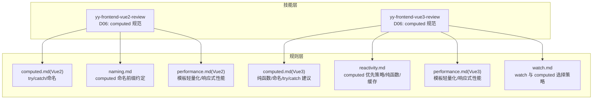
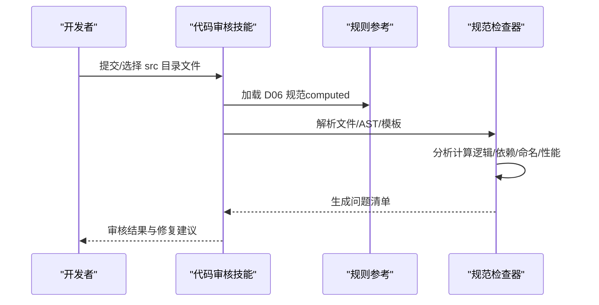
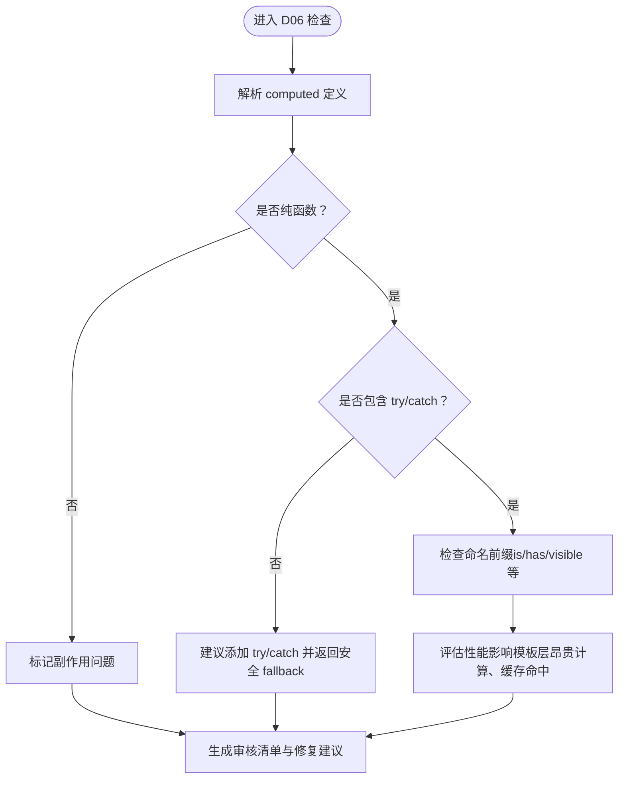
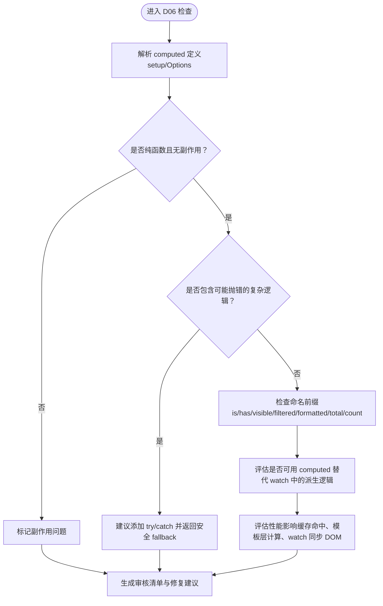
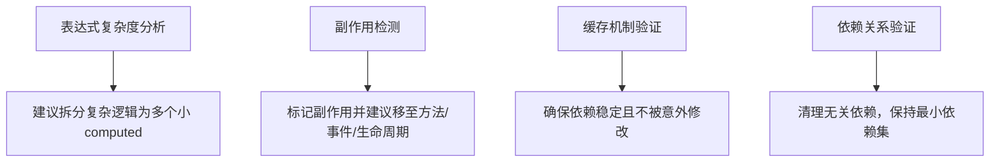
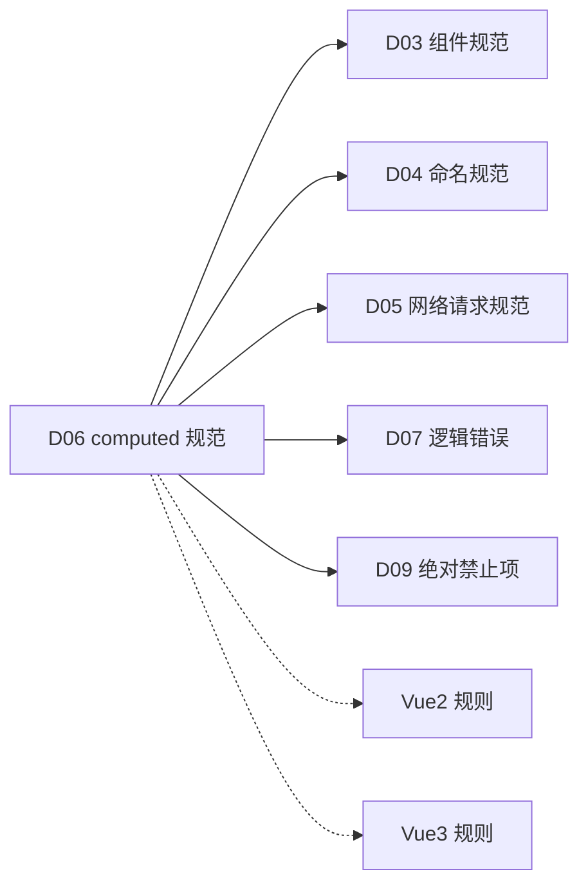

# computed 规范检查

<cite>
**本文引用的文件**
- [computed.md](file://skills/yy-frontend-vue2-review/references/computed.md)
- [computed.md](file://skills/yy-frontend-vue3-review/references/computed.md)
- [reactivity.md](file://rules/frontend-rules-vue3/references/reactivity.md)
- [performance.md](file://rules/frontend-rules-vue3/references/performance.md)
- [performance.md](file://rules/frontend-rules-vue2/references/performance.md)
- [watch.md](file://rules/frontend-rules-vue3/references/watch.md)
- [SKILL.md](file://skills/yy-frontend-vue2-review/SKILL.md)
- [SKILL.md](file://skills/yy-frontend-vue3-review/SKILL.md)
- [naming.md](file://skills/yy-frontend-vue2-review/references/naming.md)
</cite>

## 目录
1. [简介](#简介)
2. [项目结构](#项目结构)
3. [核心组件](#核心组件)
4. [架构总览](#架构总览)
5. [详细组件分析](#详细组件分析)
6. [依赖分析](#依赖分析)
7. [性能考量](#性能考量)
8. [故障排查指南](#故障排查指南)
9. [结论](#结论)
10. [附录](#附录)

## 简介
本文件面向 Vue2/Vue3 项目的 computed 规范检查，聚焦 D06 维度：try/catch 异常处理、有意义的命名规范、性能优化考虑、复杂计算分解、响应式依赖管理。文档系统阐述 computed 属性检查的实现机制，包括计算逻辑分析、依赖关系验证和性能影响评估，并给出技术实现要点（表达式复杂度分析、副作用检测、缓存机制验证），辅以示例与最佳实践，帮助团队建立一致的 computed 设计与审查标准。

## 项目结构
本仓库围绕“技能”与“规则”两条主线组织 Vue 前端规范：
- 技能层：提供可执行的代码审核能力（如 yy-frontend-vue2-review、yy-frontend-vue3-review），定义审核维度与严重等级，输出审核清单与修复建议。
- 规则层：提供规范参考文档（如 reactivity.md、performance.md、watch.md），支撑技能层的判定依据与检查标准。

图表来源
- [SKILL.md](file://skills/yy-frontend-vue2-review/SKILL.md)
- [SKILL.md](file://skills/yy-frontend-vue3-review/SKILL.md)
- [reactivity.md](file://rules/frontend-rules-vue3/references/reactivity.md)
- [performance.md](file://rules/frontend-rules-vue3/references/performance.md)
- [performance.md](file://rules/frontend-rules-vue2/references/performance.md)
- [watch.md](file://rules/frontend-rules-vue3/references/watch.md)
- [computed.md](file://skills/yy-frontend-vue2-review/references/computed.md)
- [computed.md](file://skills/yy-frontend-vue3-review/references/computed.md)
- [naming.md](file://skills/yy-frontend-vue2-review/references/naming.md)

章节来源
- [SKILL.md](file://skills/yy-frontend-vue2-review/SKILL.md)
- [SKILL.md](file://skills/yy-frontend-vue3-review/SKILL.md)

## 核心组件
- computed 规范（Vue2/Vue3）
  - Vue2：强调 computed 必须使用 try/catch 包裹，命名采用 isXxx/hasXxx/visibleXxx 等前缀。
  - Vue3：强调 computed 为纯函数、无副作用；复杂逻辑建议 try/catch 包裹并返回安全 fallback；优先使用 computed 替代 watch 中的派生逻辑。
- 响应式与缓存机制
  - computed 为纯同步 getter，具备缓存能力；优先使用 computed 替代 watch 中的派生逻辑，减少冗余计算与副作用。
- 性能优化
  - 模板层避免昂贵计算，优先使用 computed；大型数据列表可考虑 shallowRef；watch 中避免同步 DOM 操作。
- 命名规范
  - computed 属性使用 isXxx/hasXxx/visibleXxx/formattedXxx/filteredXxx/totalXxx/countXxx 等前缀，体现布尔、存在性、可见性、转换、统计等语义。

章节来源
- [computed.md](file://skills/yy-frontend-vue2-review/references/computed.md)
- [computed.md](file://skills/yy-frontend-vue3-review/references/computed.md)
- [reactivity.md](file://rules/frontend-rules-vue3/references/reactivity.md)
- [performance.md](file://rules/frontend-rules-vue3/references/performance.md)
- [performance.md](file://rules/frontend-rules-vue2/references/performance.md)
- [naming.md](file://skills/yy-frontend-vue2-review/references/naming.md)

## 架构总览
computed 规范检查的总体流程如下：
- 输入：src 目录下改动的 .vue/.js 文件
- 审核维度：D06 computed 规范（Vue2/Vue3）
- 检查项：
  - 计算逻辑是否为纯函数（无副作用）
  - 是否对可能抛错的计算进行防御性 try/catch
  - 命名是否具有明确语义（is/has/visible/formatted/filtered/total/count 等前缀）
  - 依赖关系是否清晰、是否滥用 watch 替代 computed
  - 性能影响评估（模板层昂贵计算、缓存命中率、watch 中同步 DOM 操作）
- 输出：审核清单、问题统计、修复建议

图表来源
- [SKILL.md](file://skills/yy-frontend-vue2-review/SKILL.md)
- [SKILL.md](file://skills/yy-frontend-vue3-review/SKILL.md)
- [computed.md](file://skills/yy-frontend-vue2-review/references/computed.md)
- [computed.md](file://skills/yy-frontend-vue3-review/references/computed.md)

## 详细组件分析

### Vue2 computed 规范检查
- 异常处理
  - computed 内部必须使用 try/catch 包裹，捕获异常后返回合理默认值，避免中断渲染。
- 命名规范
  - 使用 isXxx/hasXxx/visibleXxx 等前缀，体现布尔、存在性、可见性等语义。
- 依赖与缓存
  - 依赖 ref/reactive 值，遵循纯函数原则；避免在 computed 中发起网络请求或修改响应式数据。
- 性能影响
  - 模板层避免昂贵计算，优先使用 computed；watch 中避免同步 DOM 操作。

图表来源
- [computed.md](file://skills/yy-frontend-vue2-review/references/computed.md)
- [naming.md](file://skills/yy-frontend-vue2-review/references/naming.md)
- [performance.md](file://rules/frontend-rules-vue2/references/performance.md)

章节来源
- [computed.md](file://skills/yy-frontend-vue2-review/references/computed.md)
- [naming.md](file://skills/yy-frontend-vue2-review/references/naming.md)
- [performance.md](file://rules/frontend-rules-vue2/references/performance.md)

### Vue3 computed 规范检查
- 纯函数与缓存
  - computed 必须为纯同步 getter，具备缓存能力；复杂逻辑建议 try/catch 包裹并返回安全 fallback。
- 依赖与替代策略
  - 优先使用 computed 替代 watch 中的派生逻辑，减少冗余 ref 与 watch 滥用。
- 命名规范
  - 使用 isXxx/hasXxx/visibleXxx/filteredXxx/formattedXxx/totalXxx/countXxx 等前缀，体现语义类型。
- 性能优化
  - 模板层避免昂贵计算；大型数据列表考虑 shallowRef；watch 中避免同步 DOM 操作。

图表来源
- [computed.md](file://skills/yy-frontend-vue3-review/references/computed.md)
- [reactivity.md](file://rules/frontend-rules-vue3/references/reactivity.md)
- [watch.md](file://rules/frontend-rules-vue3/references/watch.md)
- [performance.md](file://rules/frontend-rules-vue3/references/performance.md)

章节来源
- [computed.md](file://skills/yy-frontend-vue3-review/references/computed.md)
- [reactivity.md](file://rules/frontend-rules-vue3/references/reactivity.md)
- [watch.md](file://rules/frontend-rules-vue3/references/watch.md)
- [performance.md](file://rules/frontend-rules-vue3/references/performance.md)

### 技术实现要点
- 表达式复杂度分析
  - 识别多层三元、链式调用、JSON.parse/map/filter.reduce 等潜在高成本表达式，建议拆分为多个 computed 或本地变量。
- 副作用检测
  - 检测是否在 computed 中出现 API 调用、DOM 操作、定时器设置、事件绑定等副作用。
- 缓存机制验证
  - 确认 computed 依赖的 ref/reactive 值是否稳定、是否被 watch 或方法修改导致缓存失效。
- 依赖关系验证
  - 校验 computed 仅依赖已声明的响应式数据；避免跨组件直接访问外部状态。

图表来源
- [reactivity.md](file://rules/frontend-rules-vue3/references/reactivity.md)
- [watch.md](file://rules/frontend-rules-vue3/references/watch.md)

章节来源
- [reactivity.md](file://rules/frontend-rules-vue3/references/reactivity.md)
- [watch.md](file://rules/frontend-rules-vue3/references/watch.md)

### 示例与最佳实践
- 正确示例
  - 使用 is/has/visible 前缀命名布尔/存在性/可见性 computed。
  - 将昂贵计算拆分为多个小 computed，提升缓存命中率。
  - 在复杂逻辑处添加 try/catch 并返回安全 fallback。
- 常见问题
  - 在 computed 中发起网络请求或修改响应式数据。
  - 命名无语义，使用无意义的 data1/temp2。
  - 将 watch 中的派生逻辑直接写在 watch 回调中，未使用 computed 缓存。
- 优化建议
  - 优先使用 computed 替代 watch 中的派生逻辑。
  - 模板层避免昂贵计算，将逻辑下沉到 computed。
  - 大型数据列表使用 shallowRef，减少深层响应式开销。

章节来源
- [computed.md](file://skills/yy-frontend-vue2-review/references/computed.md)
- [computed.md](file://skills/yy-frontend-vue3-review/references/computed.md)
- [reactivity.md](file://rules/frontend-rules-vue3/references/reactivity.md)
- [performance.md](file://rules/frontend-rules-vue3/references/performance.md)
- [performance.md](file://rules/frontend-rules-vue2/references/performance.md)
- [naming.md](file://skills/yy-frontend-vue2-review/references/naming.md)

## 依赖分析
- 维度耦合
  - D06 computed 与 D03 组件规范、D04 命名规范、D05 网络请求规范、D07 逻辑错误、D09 绝对禁止项存在交叉影响。
- 直接依赖
  - Vue2：computed.md、naming.md、performance.md(Vue2)
  - Vue3：computed.md、reactivity.md、watch.md、performance.md(Vue3)
- 外部集成点
  - 审核技能通过引用规则文件进行判定，输出统一的审核清单与修复建议。

图表来源
- [SKILL.md](file://skills/yy-frontend-vue2-review/SKILL.md)
- [SKILL.md](file://skills/yy-frontend-vue3-review/SKILL.md)

章节来源
- [SKILL.md](file://skills/yy-frontend-vue2-review/SKILL.md)
- [SKILL.md](file://skills/yy-frontend-vue3-review/SKILL.md)

## 性能考量
- 模板层轻量化
  - 避免在模板中执行昂贵计算，优先使用 computed。
- 缓存与派生
  - 优先使用 computed 派生状态，减少 watch 滥用；watch 中避免同步 DOM 操作。
- 大数据优化
  - 大型数据列表考虑使用 shallowRef 减少深层响应式开销。
- 侦听器与 computed 的选择
  - watch 中的派生逻辑应优先使用 computed 替代，利用缓存机制降低重复计算。

章节来源
- [performance.md](file://rules/frontend-rules-vue3/references/performance.md)
- [performance.md](file://rules/frontend-rules-vue2/references/performance.md)
- [reactivity.md](file://rules/frontend-rules-vue3/references/reactivity.md)
- [watch.md](file://rules/frontend-rules-vue3/references/watch.md)

## 故障排查指南
- 常见问题定位
  - 命名不规范：使用无意义命名或缺少语义前缀。
  - 副作用：在 computed 中发起网络请求、修改响应式数据、操作 DOM。
  - 性能问题：模板中存在昂贵计算、watch 中同步 DOM 操作、未使用 computed 替代派生逻辑。
- 修复建议
  - 添加 try/catch 并返回安全 fallback。
  - 将复杂逻辑拆分为多个小 computed，提升缓存命中率。
  - 使用 is/has/visible/formatted/filtered/total/count 等前缀命名。
  - 优先使用 computed 替代 watch 中的派生逻辑。

章节来源
- [computed.md](file://skills/yy-frontend-vue2-review/references/computed.md)
- [computed.md](file://skills/yy-frontend-vue3-review/references/computed.md)
- [reactivity.md](file://rules/frontend-rules-vue3/references/reactivity.md)
- [watch.md](file://rules/frontend-rules-vue3/references/watch.md)
- [performance.md](file://rules/frontend-rules-vue3/references/performance.md)
- [performance.md](file://rules/frontend-rules-vue2/references/performance.md)
- [naming.md](file://skills/yy-frontend-vue2-review/references/naming.md)

## 结论
D06 computed 规范检查的核心在于：确保计算逻辑为纯函数、具备防御性 try/catch、使用有意义的命名前缀、优先使用 computed 替代 watch 中的派生逻辑，并结合性能优化策略（模板层轻量化、缓存命中、shallowRef 等）。通过规则层与技能层协同，可形成覆盖全面、可执行、可追溯的审核体系，持续提升代码质量与运行效率。

## 附录
- 审核维度与严重等级
  - D06 computed 规范：🟡 中等
- 相关参考文件
  - Vue2：computed.md、naming.md、performance.md
  - Vue3：computed.md、reactivity.md、watch.md、performance.md