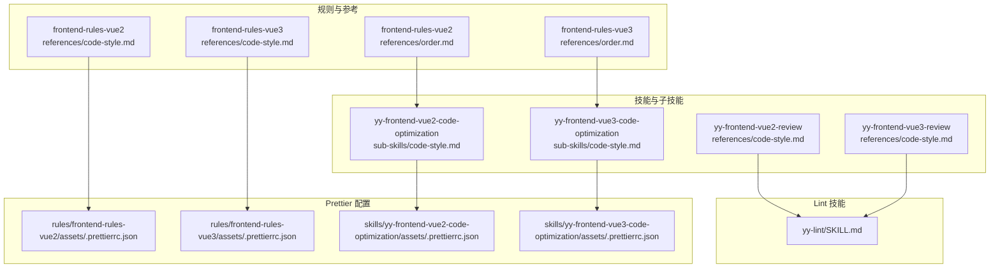
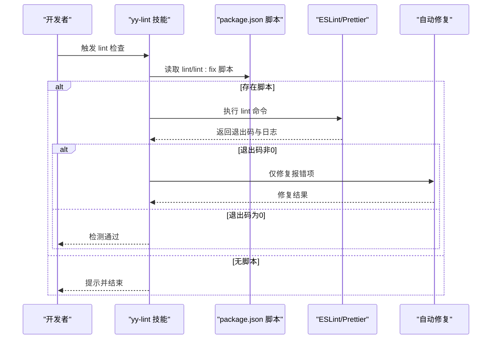
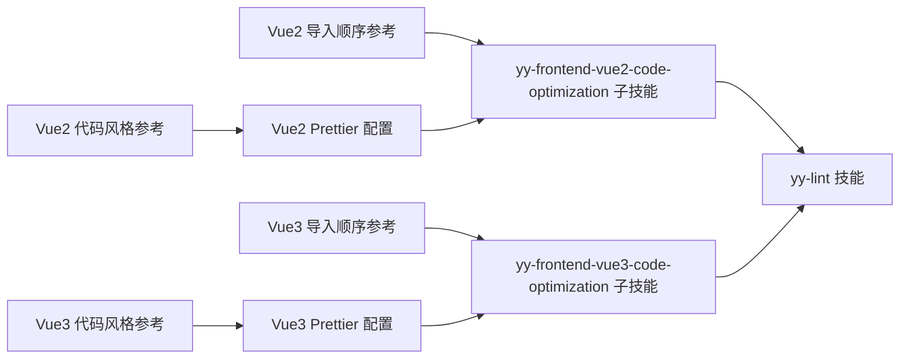

# 代码风格检查规范

<cite>
**本文引用的文件**
- [rules/frontend-rules-vue2/references/code-style.md](file://rules/frontend-rules-vue2/references/code-style.md)
- [rules/frontend-rules-vue3/references/code-style.md](file://rules/frontend-rules-vue3/references/code-style.md)
- [skills/yy-frontend-vue2-review/references/code-style.md](file://skills/yy-frontend-vue2-review/references/code-style.md)
- [skills/yy-frontend-vue3-review/references/code-style.md](file://skills/yy-frontend-vue3-review/references/code-style.md)
- [rules/frontend-rules-vue2/references/order.md](file://rules/frontend-rules-vue2/references/order.md)
- [rules/frontend-rules-vue3/references/order.md](file://rules/frontend-rules-vue3/references/order.md)
- [skills/yy-frontend-vue2-code-optimization/sub-skills/code-style.md](file://skills/yy-frontend-vue2-code-optimization/sub-skills/code-style.md)
- [skills/yy-frontend-vue3-code-optimization/sub-skills/code-style.md](file://skills/yy-frontend-vue3-code-optimization/sub-skills/code-style.md)
- [skills/yy-lint/SKILL.md](file://skills/yy-lint/SKILL.md)
- [rules/frontend-rules-vue2/assets/.prettierrc.json](file://rules/frontend-rules-vue2/assets/.prettierrc.json)
- [rules/frontend-rules-vue3/assets/.prettierrc.json](file://rules/frontend-rules-vue3/assets/.prettierrc.json)
- [skills/yy-frontend-vue2-code-optimization/assets/.prettierrc.json](file://skills/yy-frontend-vue2-code-optimization/assets/.prettierrc.json)
- [skills/yy-frontend-vue3-code-optimization/assets/.prettierrc.json](file://skills/yy-frontend-vue3-code-optimization/assets/.prettierrc.json)
</cite>

## 目录
1. [简介](#简介)
2. [项目结构](#项目结构)
3. [核心组件](#核心组件)
4. [架构总览](#架构总览)
5. [详细组件分析](#详细组件分析)
6. [依赖分析](#依赖分析)
7. [性能考虑](#性能考虑)
8. [故障排查指南](#故障排查指南)
9. [结论](#结论)
10. [附录](#附录)

## 简介
本文件面向“代码风格检查维度 D01”的六大检查项，系统阐述其规则定义、检查逻辑、违规识别算法与修复建议，并解释自动化实现机制（AST 解析、正则匹配与静态分析）。同时提供正确/错误示例的路径指引与最佳实践，帮助开发者快速理解并落地统一的前端代码风格。

## 项目结构
围绕 D01 维度，仓库中与前端代码风格强相关的知识与资产分布如下：
- 规则与参考文档：位于 rules/frontend-rules-vue2 与 rules/frontend-rules-vue3 下的 references 目录，包含代码风格与导入顺序规范。
- 技能与子技能：位于 skills/yy-frontend-vue2-review、skills/yy-frontend-vue3-review、skills/yy-frontend-vue2-code-optimization、skills/yy-frontend-vue3-code-optimization 下，提供格式化与风格检查的执行步骤与配置参考。
- Lint 技能：skills/yy-lint 提供统一的 lint 执行流程与修复策略。
- Prettier 配置：各规则与技能目录下均包含 .prettierrc.json，作为格式化与风格检查的权威依据。

图表来源
- [rules/frontend-rules-vue2/references/code-style.md](file://rules/frontend-rules-vue2/references/code-style.md)
- [rules/frontend-rules-vue3/references/code-style.md](file://rules/frontend-rules-vue3/references/code-style.md)
- [rules/frontend-rules-vue2/references/order.md](file://rules/frontend-rules-vue2/references/order.md)
- [rules/frontend-rules-vue3/references/order.md](file://rules/frontend-rules-vue3/references/order.md)
- [skills/yy-frontend-vue2-code-optimization/sub-skills/code-style.md](file://skills/yy-frontend-vue2-code-optimization/sub-skills/code-style.md)
- [skills/yy-frontend-vue3-code-optimization/sub-skills/code-style.md](file://skills/yy-frontend-vue3-code-optimization/sub-skills/code-style.md)
- [skills/yy-lint/SKILL.md](file://skills/yy-lint/SKILL.md)
- [rules/frontend-rules-vue2/assets/.prettierrc.json](file://rules/frontend-rules-vue2/assets/.prettierrc.json)
- [rules/frontend-rules-vue3/assets/.prettierrc.json](file://rules/frontend-rules-vue3/assets/.prettierrc.json)
- [skills/yy-frontend-vue2-code-optimization/assets/.prettierrc.json](file://skills/yy-frontend-vue2-code-optimization/assets/.prettierrc.json)
- [skills/yy-frontend-vue3-code-optimization/assets/.prettierrc.json](file://skills/yy-frontend-vue3-code-optimization/assets/.prettierrc.json)

章节来源
- [rules/frontend-rules-vue2/references/code-style.md](file://rules/frontend-rules-vue2/references/code-style.md)
- [rules/frontend-rules-vue3/references/code-style.md](file://rules/frontend-rules-vue3/references/code-style.md)
- [rules/frontend-rules-vue2/references/order.md](file://rules/frontend-rules-vue2/references/order.md)
- [rules/frontend-rules-vue3/references/order.md](file://rules/frontend-rules-vue3/references/order.md)
- [skills/yy-frontend-vue2-review/references/code-style.md](file://skills/yy-frontend-vue2-review/references/code-style.md)
- [skills/yy-frontend-vue3-review/references/code-style.md](file://skills/yy-frontend-vue3-review/references/code-style.md)
- [skills/yy-frontend-vue2-code-optimization/sub-skills/code-style.md](file://skills/yy-frontend-vue2-code-optimization/sub-skills/code-style.md)
- [skills/yy-frontend-vue3-code-optimization/sub-skills/code-style.md](file://skills/yy-frontend-vue3-code-optimization/sub-skills/code-style.md)
- [skills/yy-lint/SKILL.md](file://skills/yy-lint/SKILL.md)
- [rules/frontend-rules-vue2/assets/.prettierrc.json](file://rules/frontend-rules-vue2/assets/.prettierrc.json)
- [rules/frontend-rules-vue3/assets/.prettierrc.json](file://rules/frontend-rules-vue3/assets/.prettierrc.json)
- [skills/yy-frontend-vue2-code-optimization/assets/.prettierrc.json](file://skills/yy-frontend-vue2-code-optimization/assets/.prettierrc.json)
- [skills/yy-frontend-vue3-code-optimization/assets/.prettierrc.json](file://skills/yy-frontend-vue3-code-optimization/assets/.prettierrc.json)

## 核心组件
- 规则定义与规范：Vue2/Vue3 的代码风格与导入顺序规范，明确 D01 维度的检查项与要求。
- Prettier 配置：提供缩进、引号、分号、尾随逗号、箭头函数等格式化规则的权威配置。
- 技能与子技能：给出格式化执行步骤与结构顺序整理的指导。
- Lint 技能：统一的 lint 执行流程、修复边界与并行约束。

章节来源
- [rules/frontend-rules-vue2/references/code-style.md](file://rules/frontend-rules-vue2/references/code-style.md)
- [rules/frontend-rules-vue3/references/code-style.md](file://rules/frontend-rules-vue3/references/code-style.md)
- [rules/frontend-rules-vue2/references/order.md](file://rules/frontend-rules-vue2/references/order.md)
- [rules/frontend-rules-vue3/references/order.md](file://rules/frontend-rules-vue3/references/order.md)
- [skills/yy-frontend-vue2-code-optimization/sub-skills/code-style.md](file://skills/yy-frontend-vue2-code-optimization/sub-skills/code-style.md)
- [skills/yy-frontend-vue3-code-optimization/sub-skills/code-style.md](file://skills/yy-frontend-vue3-code-optimization/sub-skills/code-style.md)
- [skills/yy-lint/SKILL.md](file://skills/yy-lint/SKILL.md)

## 架构总览
D01 维度的自动化检查以“配置驱动 + 工具链执行”为核心：
- 配置驱动：以 Prettier 配置为权威依据，覆盖缩进、引号、分号、尾随逗号、箭头函数等基础格式。
- 工具链执行：通过 yy-lint 技能统一调度 lint 命令，优先执行项目脚本，自动修复报错（不修复警告）。
- 结构顺序：由技能子技能指导进行导入分组与结构顺序整理，Prettier 无法覆盖的部分由人工修正。

图表来源
- [skills/yy-lint/SKILL.md](file://skills/yy-lint/SKILL.md)

章节来源
- [skills/yy-lint/SKILL.md](file://skills/yy-lint/SKILL.md)

## 详细组件分析

### 2空格缩进规则
- 规则来源：Prettier 配置中的 tabWidth: 2；代码风格参考文档明确基础格式为“2 空格缩进”。
- 检查逻辑：
  - AST/正则：扫描源码中的缩进字符，统计制表符与空格数，识别不符合 2 空格的行。
  - 静态分析：结合编辑器/格式化工具，优先使用 Prettier 统一缩进。
- 违规识别算法：
  - 逐行扫描，若行首包含制表符或超过 2 空格的缩进，则标记为违规。
  - 对于混合缩进（如部分行用制表符、部分用空格）统一替换为 2 空格。
- 修复建议：
  - 使用 Prettier 格式化；若 Prettier 不可用，参考 assets/.prettierrc.json 的 tabWidth: 2 进行手动调整。
- 示例路径（正确/错误对照与修复方案请参见对应文件）：
  - [rules/frontend-rules-vue2/references/code-style.md](file://rules/frontend-rules-vue2/references/code-style.md)
  - [rules/frontend-rules-vue3/references/code-style.md](file://rules/frontend-rules-vue3/references/code-style.md)
  - [rules/frontend-rules-vue2/assets/.prettierrc.json](file://rules/frontend-rules-vue2/assets/.prettierrc.json)
  - [rules/frontend-rules-vue3/assets/.prettierrc.json](file://rules/frontend-rules-vue3/assets/.prettierrc.json)

章节来源
- [rules/frontend-rules-vue2/references/code-style.md](file://rules/frontend-rules-vue2/references/code-style.md)
- [rules/frontend-rules-vue3/references/code-style.md](file://rules/frontend-rules-vue3/references/code-style.md)
- [rules/frontend-rules-vue2/assets/.prettierrc.json](file://rules/frontend-rules-vue2/assets/.prettierrc.json)
- [rules/frontend-rules-vue3/assets/.prettierrc.json](file://rules/frontend-rules-vue3/assets/.prettierrc.json)

### JS单引号使用
- 规则来源：Prettier 配置 singleQuote: true；代码风格参考文档明确 JS/TS 使用单引号。
- 检查逻辑：
  - AST/正则：识别字符串字面量，判断是否使用单引号；对 JSX/TSX 同样适用。
  - 静态分析：结合 quoteProps 与 jsxSingleQuote 等配置，确保一致性。
- 违规识别算法：
  - 匹配双引号包裹的字符串字面量，排除模板字符串与不可变的 HTML 属性（HTML 属性使用双引号）。
  - 对于可改为单引号的字符串，标记为可修复。
- 修复建议：
  - 优先使用 Prettier；若不可用，参考 assets/.prettierrc.json 的 singleQuote: true 进行批量替换。
- 示例路径
  - [rules/frontend-rules-vue2/references/code-style.md](file://rules/frontend-rules-vue2/references/code-style.md)
  - [rules/frontend-rules-vue3/references/code-style.md](file://rules/frontend-rules-vue3/references/code-style.md)
  - [rules/frontend-rules-vue2/assets/.prettierrc.json](file://rules/frontend-rules-vue2/assets/.prettierrc.json)
  - [rules/frontend-rules-vue3/assets/.prettierrc.json](file://rules/frontend-rules-vue3/assets/.prettierrc.json)

章节来源
- [rules/frontend-rules-vue2/references/code-style.md](file://rules/frontend-rules-vue2/references/code-style.md)
- [rules/frontend-rules-vue3/references/code-style.md](file://rules/frontend-rules-vue3/references/code-style.md)
- [rules/frontend-rules-vue2/assets/.prettierrc.json](file://rules/frontend-rules-vue2/assets/.prettierrc.json)
- [rules/frontend-rules-vue3/assets/.prettierrc.json](file://rules/frontend-rules-vue3/assets/.prettierrc.json)

### 分号使用规范
- 览
- 规则来源：Prettier 配置 semi: true；代码风格参考文档明确“语句末尾必须有分号”。
- 检查逻辑：
  - AST/正则：扫描语句结尾，识别缺失分号的位置；对 IIFE、箭头函数体等特殊语法进行兼容处理。
- 违规识别算法：
  - 在行末或显式换行处查找分号；对自动分号插入（ASI）安全的场景进行白名单处理。
- 修复建议：
  - 使用 Prettier 统一分号；若不可用，参考 assets/.prettierrc.json 的 semi: true 进行补全。
- 示例路径
  - [rules/frontend-rules-vue2/references/code-style.md](file://rules/frontend-rules-vue2/references/code-style.md)
  - [rules/frontend-rules-vue3/references/code-style.md](file://rules/frontend-rules-vue3/references/code-style.md)
  - [rules/frontend-rules-vue2/assets/.prettierrc.json](file://rules/frontend-rules-vue2/assets/.prettierrc.json)
  - [rules/frontend-rules-vue3/assets/.prettierrc.json](file://rules/frontend-rules-vue3/assets/.prettierrc.json)

章节来源
- [rules/frontend-rules-vue2/references/code-style.md](file://rules/frontend-rules-vue2/references/code-style.md)
- [rules/frontend-rules-vue3/references/code-style.md](file://rules/frontend-rules-vue3/references/code-style.md)
- [rules/frontend-rules-vue2/assets/.prettierrc.json](file://rules/frontend-rules-vue2/assets/.prettierrc.json)
- [rules/frontend-rules-vue3/assets/.prettierrc.json](file://rules/frontend-rules-vue3/assets/.prettierrc.json)

### 尾随逗号处理
- 规则来源：Prettier 配置 trailingComma: "all"；代码风格参考文档明确“多行对象/数组末尾必须加逗号”。
- 检查逻辑：
  - AST/正则：定位多行对象与数组字面量，检查末尾元素后是否有逗号。
- 违规识别算法：
  - 判断起止符号对（如 { ... }、[ ... ]）是否跨行；若跨行且末尾元素后无逗号，则标记为违规。
- 修复建议：
  - 使用 Prettier 自动添加；若不可用，参考 assets/.prettierrc.json 的 trailingComma: "all" 进行补全。
- 示例路径
  - [rules/frontend-rules-vue2/references/code-style.md](file://rules/frontend-rules-vue2/references/code-style.md)
  - [rules/frontend-rules-vue3/references/code-style.md](file://rules/frontend-rules-vue3/references/code-style.md)
  - [rules/frontend-rules-vue2/assets/.prettierrc.json](file://rules/frontend-rules-vue2/assets/.prettierrc.json)
  - [rules/frontend-rules-vue3/assets/.prettierrc.json](file://rules/frontend-rules-vue3/assets/.prettierrc.json)

章节来源
- [rules/frontend-rules-vue2/references/code-style.md](file://rules/frontend-rules-vue2/references/code-style.md)
- [rules/frontend-rules-vue3/references/code-style.md](file://rules/frontend-rules-vue3/references/code-style.md)
- [rules/frontend-rules-vue2/assets/.prettierrc.json](file://rules/frontend-rules-vue2/assets/.prettierrc.json)
- [rules/frontend-rules-vue3/assets/.prettierrc.json](file://rules/frontend-rules-vue3/assets/.prettierrc.json)

### 箭头函数使用限制
- 规则来源：Vue2/Vue3 代码风格参考文档明确“优先使用 const 函数名 = () => {} 箭头函数写法”，并给出单参数省略括号的偏好。
- 检查逻辑：
  - AST/正则：识别函数声明与函数表达式，统计使用 function 声明的比例；对箭头函数的参数括号进行校验。
- 违规识别算法：
  - 发现 function 声明时标记为可优化；单参数箭头函数若保留括号则标记为不必要；多参数或无参数时若省略括号则标记为不规范。
- 修复建议：
  - 将 function 声明转换为箭头函数；单参数时省略括号；多参数/无参数时保留括号；使用 Prettier 格式化确保一致性。
- 示例路径
  - [rules/frontend-rules-vue2/references/code-style.md](file://rules/frontend-rules-vue2/references/code-style.md)
  - [rules/frontend-rules-vue3/references/code-style.md](file://rules/frontend-rules-vue3/references/code-style.md)
  - [rules/frontend-rules-vue2/assets/.prettierrc.json](file://rules/frontend-rules-vue2/assets/.prettierrc.json)
  - [rules/frontend-rules-vue3/assets/.prettierrc.json](file://rules/frontend-rules-vue3/assets/.prettierrc.json)

章节来源
- [rules/frontend-rules-vue2/references/code-style.md](file://rules/frontend-rules-vue2/references/code-style.md)
- [rules/frontend-rules-vue3/references/code-style.md](file://rules/frontend-rules-vue3/references/code-style.md)
- [rules/frontend-rules-vue2/assets/.prettierrc.json](file://rules/frontend-rules-vue2/assets/.prettierrc.json)
- [rules/frontend-rules-vue3/assets/.prettierrc.json](file://rules/frontend-rules-vue3/assets/.prettierrc.json)

### 3组导入顺序规范（Vue2）
- 规则来源：Vue2 导入顺序规范明确“外部依赖 → 内部全局（@src/） → 内部相对（./、../）”，组间空一行，组内字母排序。
- 检查逻辑：
  - AST/正则：解析 import 语句，按路径前缀分类；检查组间空行与组内字母序。
- 违规识别算法：
  - 按 import 语句出现顺序比对分组；若组内非字母序或组间无空行，则标记为违规。
- 修复建议：
  - 使用 ESLint 插件或手动重排；参考 assets/.prettierrc.json 的 printWidth: 120 与 tabWidth: 2 辅助对齐。
- 示例路径
  - [rules/frontend-rules-vue2/references/order.md](file://rules/frontend-rules-vue2/references/order.md)
  - [rules/frontend-rules-vue2/references/code-style.md](file://rules/frontend-rules-vue2/references/code-style.md)
  - [rules/frontend-rules-vue2/assets/.prettierrc.json](file://rules/frontend-rules-vue2/assets/.prettierrc.json)

章节来源
- [rules/frontend-rules-vue2/references/order.md](file://rules/frontend-rules-vue2/references/order.md)
- [rules/frontend-rules-vue2/references/code-style.md](file://rules/frontend-rules-vue2/references/code-style.md)
- [rules/frontend-rules-vue2/assets/.prettierrc.json](file://rules/frontend-rules-vue2/assets/.prettierrc.json)

### 4组导入顺序规范（Vue3）
- 规则来源：Vue3 导入顺序规范明确“node_modules（外部依赖） → types（类型导入） → 内部全局（@src/） → 内部相对（./、../）”，组间空一行，组内字母排序。
- 检查逻辑：
  - AST/正则：区分 import 与 import type，按四组分类；检查组间空行与组内字母序。
- 违规识别算法：
  - 按 import 语句出现顺序比对四组；若组内非字母序或组间无空行，则标记为违规。
- 修复建议：
  - 使用 ESLint 插件或手动重排；参考 assets/.prettierrc.json 的 printWidth: 120 与 tabWidth: 2 辅助对齐。
- 示例路径
  - [rules/frontend-rules-vue3/references/order.md](file://rules/frontend-rules-vue3/references/order.md)
  - [rules/frontend-rules-vue3/references/code-style.md](file://rules/frontend-rules-vue3/references/code-style.md)
  - [rules/frontend-rules-vue3/assets/.prettierrc.json](file://rules/frontend-rules-vue3/assets/.prettierrc.json)

章节来源
- [rules/frontend-rules-vue3/references/order.md](file://rules/frontend-rules-vue3/references/order.md)
- [rules/frontend-rules-vue3/references/code-style.md](file://rules/frontend-rules-vue3/references/code-style.md)
- [rules/frontend-rules-vue3/assets/.prettierrc.json](file://rules/frontend-rules-vue3/assets/.prettierrc.json)

## 依赖分析
- 规则到配置的依赖：代码风格参考文档与 Prettier 配置共同构成 D01 维度的权威依据。
- 技能到规则的依赖：yy-frontend-* 技能通过子技能指导格式化与结构顺序整理，间接依赖规则与配置。
- Lint 技能到工具链的依赖：统一调度 lint 命令，自动修复报错，不修复警告。

图表来源
- [rules/frontend-rules-vue2/references/code-style.md](file://rules/frontend-rules-vue2/references/code-style.md)
- [rules/frontend-rules-vue3/references/code-style.md](file://rules/frontend-rules-vue3/references/code-style.md)
- [rules/frontend-rules-vue2/references/order.md](file://rules/frontend-rules-vue2/references/order.md)
- [rules/frontend-rules-vue3/references/order.md](file://rules/frontend-rules-vue3/references/order.md)
- [rules/frontend-rules-vue2/assets/.prettierrc.json](file://rules/frontend-rules-vue2/assets/.prettierrc.json)
- [rules/frontend-rules-vue3/assets/.prettierrc.json](file://rules/frontend-rules-vue3/assets/.prettierrc.json)
- [skills/yy-frontend-vue2-code-optimization/sub-skills/code-style.md](file://skills/yy-frontend-vue2-code-optimization/sub-skills/code-style.md)
- [skills/yy-frontend-vue3-code-optimization/sub-skills/code-style.md](file://skills/yy-frontend-vue3-code-optimization/sub-skills/code-style.md)
- [skills/yy-lint/SKILL.md](file://skills/yy-lint/SKILL.md)

章节来源
- [skills/yy-lint/SKILL.md](file://skills/yy-lint/SKILL.md)

## 性能考虑
- Prettier 格式化：优先使用项目自有配置，减少二次处理成本；对大型文件建议分批处理。
- ESLint/插件：仅在需要结构顺序与复杂规则时启用，避免重复扫描。
- 并行约束：yy-lint 技能在并行任务较多时延迟执行，降低冲突与重复检查成本。

## 故障排查指南
- 无可用 lint 命令：确认 package.json 中是否存在 lint 或 lint:fix 脚本；若不存在，根据技能指引手动执行。
- Node 版本不满足：检查 .nvmrc 与当前环境版本，确保满足要求后再执行。
- 自动修复边界：仅修复报错项，不修复警告；避免引入类型放宽或删除功能性代码。
- Prettier 不可用：参考 assets/.prettierrc.json 的配置规则进行手动格式化，优先保证缩进、引号、分号、尾随逗号与箭头函数单参数无括号。

章节来源
- [skills/yy-lint/SKILL.md](file://skills/yy-lint/SKILL.md)

## 结论
D01 维度的代码风格检查以 Prettier 配置为权威依据，结合 yy-lint 技能统一执行与自动修复，辅以技能子技能的人工结构调整，形成“配置驱动 + 工具链执行 + 人工把关”的闭环。开发者应优先使用项目自有 Prettier 配置，配合导入顺序与结构顺序规范，确保代码风格的一致性与可维护性。

## 附录
- 示例路径（正确/错误对照与修复方案）
  - Vue2 代码风格参考：[rules/frontend-rules-vue2/references/code-style.md](file://rules/frontend-rules-vue2/references/code-style.md)
  - Vue3 代码风格参考：[rules/frontend-rules-vue3/references/code-style.md](file://rules/frontend-rules-vue3/references/code-style.md)
  - Vue2 导入顺序参考：[rules/frontend-rules-vue2/references/order.md](file://rules/frontend-rules-vue2/references/order.md)
  - Vue3 导入顺序参考：[rules/frontend-rules-vue3/references/order.md](file://rules/frontend-rules-vue3/references/order.md)
  - Vue2 子技能格式化步骤：[skills/yy-frontend-vue2-code-optimization/sub-skills/code-style.md](file://skills/yy-frontend-vue2-code-optimization/sub-skills/code-style.md)
  - Vue3 子技能格式化步骤：[skills/yy-frontend-vue3-code-optimization/sub-skills/code-style.md](file://skills/yy-frontend-vue3-code-optimization/sub-skills/code-style.md)
  - Lint 技能流程：[skills/yy-lint/SKILL.md](file://skills/yy-lint/SKILL.md)
  - Vue2 Prettier 配置：[rules/frontend-rules-vue2/assets/.prettierrc.json](file://rules/frontend-rules-vue2/assets/.prettierrc.json)
  - Vue3 Prettier 配置：[rules/frontend-rules-vue3/assets/.prettierrc.json](file://rules/frontend-rules-vue3/assets/.prettierrc.json)
  - Vue2 技能 Prettier 配置：[skills/yy-frontend-vue2-code-optimization/assets/.prettierrc.json](file://skills/yy-frontend-vue2-code-optimization/assets/.prettierrc.json)
  - Vue3 技能 Prettier 配置：[skills/yy-frontend-vue3-code-optimization/assets/.prettierrc.json](file://skills/yy-frontend-vue3-code-optimization/assets/.prettierrc.json)