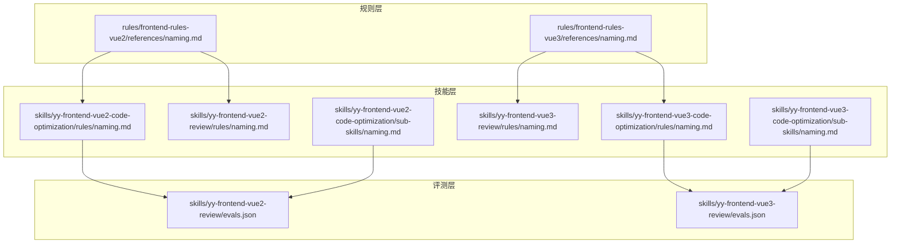
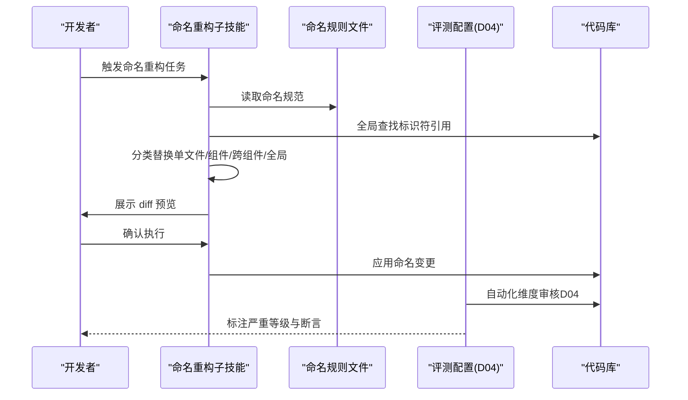
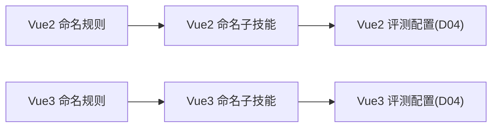

# 命名规范检查

<cite>
**本文引用的文件**
- [rules/frontend-rules-vue2/references/naming.md](file://rules/frontend-rules-vue2/references/naming.md)
- [rules/frontend-rules-vue3/references/naming.md](file://rules/frontend-rules-vue3/references/naming.md)
- [skills/yy-frontend-vue2-code-optimization/rules/naming.md](file://skills/yy-frontend-vue2-code-optimization/rules/naming.md)
- [skills/yy-frontend-vue2-review/rules/naming.md](file://skills/yy-frontend-vue2-review/rules/naming.md)
- [skills/yy-frontend-vue3-code-optimization/rules/naming.md](file://skills/yy-frontend-vue3-code-optimization/rules/naming.md)
- [skills/yy-frontend-vue3-review/rules/naming.md](file://skills/yy-frontend-vue3-review/rules/naming.md)
- [skills/yy-frontend-vue3-review/evals.json](file://skills/yy-frontend-vue3-review/evals.json)
- [skills/yy-frontend-vue2-review/evals.json](file://skills/yy-frontend-vue2-review/evals.json)
- [skills/yy-frontend-vue3-code-optimization/sub-skills/naming.md](file://skills/yy-frontend-vue3-code-optimization/sub-skills/naming.md)
- [skills/yy-frontend-vue2-code-optimization/sub-skills/naming.md](file://skills/yy-frontend-vue2-code-optimization/sub-skills/naming.md)
- [rules/frontend-rules-vue2/prompts/rule-prompts-simple.md](file://rules/frontend-rules-vue2/prompts/rule-prompts-simple.md)
- [skills/yy-frontend-vue3-review/references/logic-error.md](file://skills/yy-frontend-vue3-review/references/logic-error.md)
</cite>

## 目录
1. [简介](#简介)
2. [项目结构](#项目结构)
3. [核心组件](#核心组件)
4. [架构总览](#架构总览)
5. [详细组件分析](#详细组件分析)
6. [依赖关系分析](#依赖关系分析)
7. [性能考量](#性能考量)
8. [故障排查指南](#故障排查指南)
9. [结论](#结论)
10. [附录](#附录)

## 简介
本文件围绕“命名规范检查”维度（D04）构建系统化技术文档，聚焦于以下方面：
- API 接口命名、事件命名规范、常量命名规则、组件名称规范、变量与函数命名、文件命名约定、目录结构命名
- 命名规范的检查机制：标识符识别、命名模式匹配、语义一致性验证
- 命名规范检查的实现逻辑：上下文分析、作用域检查、命名冲突检测
- 丰富的命名示例：正确命名与常见错误对照，以及具体改进建议
- 团队协作中的命名一致性维护策略与最佳实践

## 项目结构
本仓库将命名规范以“规则文件 + 技能任务 + 评测配置”的形式组织，便于在不同 Vue 版本与工作流中复用与落地。

图示来源
- [rules/frontend-rules-vue2/references/naming.md](file://rules/frontend-rules-vue2/references/naming.md)
- [rules/frontend-rules-vue3/references/naming.md](file://rules/frontend-rules-vue3/references/naming.md)
- [skills/yy-frontend-vue2-code-optimization/rules/naming.md](file://skills/yy-frontend-vue2-code-optimization/rules/naming.md)
- [skills/yy-frontend-vue2-review/rules/naming.md](file://skills/yy-frontend-vue2-review/rules/naming.md)
- [skills/yy-frontend-vue3-code-optimization/rules/naming.md](file://skills/yy-frontend-vue3-code-optimization/rules/naming.md)
- [skills/yy-frontend-vue3-review/rules/naming.md](file://skills/yy-frontend-vue3-review/rules/naming.md)
- [skills/yy-frontend-vue2-code-optimization/sub-skills/naming.md](file://skills/yy-frontend-vue2-code-optimization/sub-skills/naming.md)
- [skills/yy-frontend-vue3-code-optimization/sub-skills/naming.md](file://skills/yy-frontend-vue3-code-optimization/sub-skills/naming.md)
- [skills/yy-frontend-vue2-review/evals.json](file://skills/yy-frontend-vue2-review/evals.json)
- [skills/yy-frontend-vue3-review/evals.json](file://skills/yy-frontend-vue3-review/evals.json)

章节来源
- [rules/frontend-rules-vue2/references/naming.md](file://rules/frontend-rules-vue2/references/naming.md)
- [rules/frontend-rules-vue3/references/naming.md](file://rules/frontend-rules-vue3/references/naming.md)
- [skills/yy-frontend-vue2-code-optimization/rules/naming.md](file://skills/yy-frontend-vue2-code-optimization/rules/naming.md)
- [skills/yy-frontend-vue2-review/rules/naming.md](file://skills/yy-frontend-vue2-review/rules/naming.md)
- [skills/yy-frontend-vue3-code-optimization/rules/naming.md](file://skills/yy-frontend-vue3-code-optimization/rules/naming.md)
- [skills/yy-frontend-vue3-review/rules/naming.md](file://skills/yy-frontend-vue3-review/rules/naming.md)
- [skills/yy-frontend-vue2-code-optimization/sub-skills/naming.md](file://skills/yy-frontend-vue2-code-optimization/sub-skills/naming.md)
- [skills/yy-frontend-vue3-code-optimization/sub-skills/naming.md](file://skills/yy-frontend-vue3-code-optimization/sub-skills/naming.md)
- [skills/yy-frontend-vue2-review/evals.json](file://skills/yy-frontend-vue2-review/evals.json)
- [skills/yy-frontend-vue3-review/evals.json](file://skills/yy-frontend-vue3-review/evals.json)

## 核心组件
- 规则文件：统一定义 Vue2/Vue3 的命名规范，覆盖文件/组件、函数、变量/常量、事件、TypeScript 类型、CSS BEM 等维度。
- 技能任务：将规则转化为可执行的任务策略，强调“全局查找、分类替换、diff 预览”，降低命名重构风险。
- 评测配置：通过 evals.json 将命名检查纳入自动化维度审核，明确严重等级与断言。

章节来源
- [rules/frontend-rules-vue2/references/naming.md](file://rules/frontend-rules-vue2/references/naming.md)
- [rules/frontend-rules-vue3/references/naming.md](file://rules/frontend-rules-vue3/references/naming.md)
- [skills/yy-frontend-vue2-code-optimization/sub-skills/naming.md](file://skills/yy-frontend-vue2-code-optimization/sub-skills/naming.md)
- [skills/yy-frontend-vue3-code-optimization/sub-skills/naming.md](file://skills/yy-frontend-vue3-code-optimization/sub-skills/naming.md)
- [skills/yy-frontend-vue2-review/evals.json](file://skills/yy-frontend-vue2-review/evals.json)
- [skills/yy-frontend-vue3-review/evals.json](file://skills/yy-frontend-vue3-review/evals.json)

## 架构总览
命名规范检查在本仓库中的运行路径如下：
- 规则定义：前端规则文件提供命名规范细则
- 任务执行：命名重构子技能提供“全局查找 → 分类替换 → diff 预览”的执行策略
- 维度评测：evals.json 将命名检查作为 D04 维度纳入自动化审核，标注严重等级与断言

图示来源
- [skills/yy-frontend-vue2-code-optimization/sub-skills/naming.md](file://skills/yy-frontend-vue2-code-optimization/sub-skills/naming.md)
- [skills/yy-frontend-vue3-code-optimization/sub-skills/naming.md](file://skills/yy-frontend-vue3-code-optimization/sub-skills/naming.md)
- [skills/yy-frontend-vue2-review/evals.json](file://skills/yy-frontend-vue2-review/evals.json)
- [skills/yy-frontend-vue3-review/evals.json](file://skills/yy-frontend-vue3-review/evals.json)

## 详细组件分析

### Vue2 命名规范
- 文件与组件命名
  - 组件文件名：多单词 + PascalCase（如 UserList.vue、UserCard.vue）
  - 目录命名：kebab-case（如 src/components/user-profile/）
  - 组件使用：PascalCase（如 <UserCard />）
- 函数命名体系
  - API 函数：api + Method + URLPath（小驼峰，如 apiGetUserInfo、apiPostLogin）
  - 事件函数：on + EventName（小驼峰，如 onClickSubmit、onChangeInput）
- 变量与常量规范
  - 常量：全大写 + 下划线（如 MAX_RETRY_COUNT、APP_CONFIG）
  - Props/Emits：camelCase，且必须注释（如 userId、userChange）
  - 布尔值：isXX / hasXX / showXX 前缀（如 isVisible、hasPermission）
  - 变量/方法：有意义的驼峰命名，禁止 data1、temp2
  - data() 属性命名：camelCase（如 searchQuery、dataSource、loading）
  - computed：camelCase（如 isSelected、totalPage）
- 事件命名
  - emit 事件名：camelCase（如 userChange）
  - eventBus 事件名：小驼峰（如 userChange、formSubmit）
- CSS 命名（BEM）
  - 块：独立组件/模块（如 card、form）
  - 元素：块内部子元素（如 card__title、form__input）
  - 修饰符：状态/样式变体（如 card--dark、card__title--large）
  - 规则：全小写、__ 连接元素、-- 连接修饰符、类名唯一，禁止使用 _（除 __ 外）

章节来源
- [rules/frontend-rules-vue2/references/naming.md](file://rules/frontend-rules-vue2/references/naming.md)
- [skills/yy-frontend-vue2-code-optimization/rules/naming.md](file://skills/yy-frontend-vue2-code-optimization/rules/naming.md)
- [skills/yy-frontend-vue2-review/rules/naming.md](file://skills/yy-frontend-vue2-review/rules/naming.md)

### Vue3 命名规范
- 文件与组件命名：与 Vue2 相同（多单词 + PascalCase、kebab-case 目录、PascalCase 使用）
- 函数命名体系：与 Vue2 相同（api + Method + URLPath、on + EventName）
- 变量与常量规范：与 Vue2 相同（常量全大写 + 下划线；Props camelCase；布尔值 isXX/hasXX/showXX 前缀；变量/方法有意义驼峰）
- Vue3 组合式 API 命名
  - ref/reactive/computed：camelCase（如 isLoading、userName、formData、dataSource、isSelected、totalPage）
  - Hooks：必须以 use 开头（如 useTable、useSearchForm、useUserFetch）
- TypeScript 类型命名
  - 类型别名/接口：I + PascalCase（如 IUserInfo、ITableConfig、IUser、ITable）
  - 泛型参数：单字母大写（如 T、K、V）
- CSS 命名（BEM）：与 Vue2 相同（块、元素、修饰符；全小写、横线连接、无嵌套、类名唯一）

章节来源
- [rules/frontend-rules-vue3/references/naming.md](file://rules/frontend-rules-vue3/references/naming.md)
- [skills/yy-frontend-vue3-code-optimization/rules/naming.md](file://skills/yy-frontend-vue3-code-optimization/rules/naming.md)
- [skills/yy-frontend-vue3-review/rules/naming.md](file://skills/yy-frontend-vue3-review/rules/naming.md)

### 命名检查机制与实现逻辑
- 标识符识别
  - 全局查找：使用 LSP 或 AST-grep 查找所有引用，确保不遗漏任何引用点（含动态字符串引用风险提示）
  - 分类替换：按作用域范围（单文件 → 组件内 → 跨组件 Hooks → 全局 API）逐个替换
- 命名模式匹配
  - 文件/组件：多单词 + PascalCase；目录 kebab-case；组件使用 PascalCase
  - 函数：api + Method + URLPath（小驼峰）；on + EventName（小驼峰）
  - 变量/常量：全大写 + 下划线；camelCase；isXX/hasXX/showXX 前缀
  - 事件：emit 与 eventBus 使用 camelCase
  - CSS：BEM 命名规则
- 语义一致性验证
  - 仅做命名变更，不修改逻辑行为
  - API 函数重命名时，保持 HTTP 请求路径不变
  - TypeScript 类型重命名后，确认类型引用已同步更新
  - 组件名变更时，同步更新组件注册（如有）
  - data 属性重命名时，需检查 template、computed、watch、methods 中的引用
- 上下文分析与作用域检查
  - 严格区分 Options API 与 Composition API 的命名差异
  - Hooks 必须以 use 开头，避免与普通函数混淆
  - Props/Emits 必须注释，保证可读性与一致性
- 命名冲突检测
  - 通过 diff 预览确认变更前后一致性
  - 避免第三方库 API 名称冲突（不应修改）

章节来源
- [skills/yy-frontend-vue2-code-optimization/sub-skills/naming.md](file://skills/yy-frontend-vue2-code-optimization/sub-skills/naming.md)
- [skills/yy-frontend-vue3-code-optimization/sub-skills/naming.md](file://skills/yy-frontend-vue3-code-optimization/sub-skills/naming.md)

### 维度评测与严重等级
- D04 维度（命名规范）在评测配置中以“组件命名检查”为例，明确断言：
  - PascalCase 检查：组件文件名必须 PascalCase
  - 多单词检查：组件文件名必须多单词
  - 严重等级：中等（🟡）
- 其他维度（如 D07 逻辑错误）用于交叉验证，辅助识别命名相关问题（如空指针、数组越界等）

章节来源
- [skills/yy-frontend-vue2-review/evals.json](file://skills/yy-frontend-vue2-review/evals.json)
- [skills/yy-frontend-vue3-review/evals.json](file://skills/yy-frontend-vue3-review/evals.json)
- [skills/yy-frontend-vue3-review/references/logic-error.md](file://skills/yy-frontend-vue3-review/references/logic-error.md)

### 命名示例与常见错误
- 正确命名示例（来自规则文件）
  - 组件文件名：UserList.vue、UserCard.vue
  - 目录命名：user-profile/
  - 组件使用：<UserCard />
  - API 函数：apiGetUserInfo、apiPostLogin
  - 事件函数：onClickSubmit、onChangeInput
  - 常量：MAX_RETRY_COUNT、APP_CONFIG
  - Props/Emits：userId、userChange
  - 布尔值：isVisible、hasPermission
  - data/computed：searchQuery、dataSource、loading、isSelected、totalPage
  - emit 事件：userChange
  - eventBus 事件：userChange、formSubmit
  - CSS BEM：.card、.card__title、.card--dark、.card__title--large
- 常见错误与改进建议
  - 错误：单字母或无意义变量（如 data1、temp2）
    - 改进：使用语义化驼峰命名（如 searchKeyword、isLoading）
  - 错误：常量未使用全大写 + 下划线
    - 改进：统一为 MAX_RETRY_COUNT、APP_CONFIG
  - 错误：Props/Emits 未注释
    - 改进：添加注释说明用途与类型
  - 错误：组件文件名不符合 PascalCase 或单单词
    - 改进：使用 UserCard.vue、UserProfile.vue
  - 错误：事件命名不一致（混用 snake_case 或 PascalCase）
    - 改进：统一为 camelCase（如 userChange、formSubmit）
  - 错误：CSS 类名使用下划线或大小写混合
    - 改进：遵循 BEM 全小写、__ 与 -- 连接规则

章节来源
- [rules/frontend-rules-vue2/references/naming.md](file://rules/frontend-rules-vue2/references/naming.md)
- [rules/frontend-rules-vue3/references/naming.md](file://rules/frontend-rules-vue3/references/naming.md)
- [skills/yy-frontend-vue2-code-optimization/rules/naming.md](file://skills/yy-frontend-vue2-code-optimization/rules/naming.md)
- [skills/yy-frontend-vue3-code-optimization/rules/naming.md](file://skills/yy-frontend-vue3-code-optimization/rules/naming.md)

### 团队协作中的命名一致性维护策略
- 统一规则来源：以 rules/ 下的命名规范为权威依据，避免多源不一致
- 任务执行策略：命名重构采用“全局查找 → 分类替换 → diff 预览”，降低风险
- 严重等级标注：D04 维度问题标注为中等严重，便于团队优先处理
- 交叉验证：结合 D07 逻辑错误等维度，提升整体代码质量
- 最佳实践
  - 优先使用语义化命名，避免缩写与无意义变量
  - Hooks 必须以 use 开头，保持一致性
  - Props/Emits 注释规范化，提升可读性
  - CSS 类名严格遵循 BEM 规范，避免样式污染

章节来源
- [skills/yy-frontend-vue2-code-optimization/sub-skills/naming.md](file://skills/yy-frontend-vue2-code-optimization/sub-skills/naming.md)
- [skills/yy-frontend-vue3-code-optimization/sub-skills/naming.md](file://skills/yy-frontend-vue3-code-optimization/sub-skills/naming.md)
- [skills/yy-frontend-vue2-review/evals.json](file://skills/yy-frontend-vue2-review/evals.json)
- [skills/yy-frontend-vue3-review/evals.json](file://skills/yy-frontend-vue3-review/evals.json)

## 依赖关系分析
- 规则文件是技能任务与评测配置的共同上游依赖
- 子技能文件提供执行策略与风险提示，承接规则文件
- 评测配置将命名检查纳入维度审核，形成闭环

图示来源
- [rules/frontend-rules-vue2/references/naming.md](file://rules/frontend-rules-vue2/references/naming.md)
- [rules/frontend-rules-vue3/references/naming.md](file://rules/frontend-rules-vue3/references/naming.md)
- [skills/yy-frontend-vue2-code-optimization/sub-skills/naming.md](file://skills/yy-frontend-vue2-code-optimization/sub-skills/naming.md)
- [skills/yy-frontend-vue3-code-optimization/sub-skills/naming.md](file://skills/yy-frontend-vue3-code-optimization/sub-skills/naming.md)
- [skills/yy-frontend-vue2-review/evals.json](file://skills/yy-frontend-vue2-review/evals.json)
- [skills/yy-frontend-vue3-review/evals.json](file://skills/yy-frontend-vue3-review/evals.json)

章节来源
- [rules/frontend-rules-vue2/references/naming.md](file://rules/frontend-rules-vue2/references/naming.md)
- [rules/frontend-rules-vue3/references/naming.md](file://rules/frontend-rules-vue3/references/naming.md)
- [skills/yy-frontend-vue2-code-optimization/sub-skills/naming.md](file://skills/yy-frontend-vue2-code-optimization/sub-skills/naming.md)
- [skills/yy-frontend-vue3-code-optimization/sub-skills/naming.md](file://skills/yy-frontend-vue3-code-optimization/sub-skills/naming.md)
- [skills/yy-frontend-vue2-review/evals.json](file://skills/yy-frontend-vue2-review/evals.json)
- [skills/yy-frontend-vue3-review/evals.json](file://skills/yy-frontend-vue3-review/evals.json)

## 性能考量
- 命名检查主要依赖静态分析与规则匹配，性能开销较低
- 全局查找与 diff 预览会增加时间成本，建议在本地或 CI 中分批执行
- 建议结合增量检查与缓存策略，减少重复扫描

## 故障排查指南
- 引用遗漏
  - 现象：某些动态字符串引用（如 this[name]）未被替换
  - 处理：手动检查并补充替换，或在后续版本中完善解析器
- 第三方库冲突
  - 现象：某些标识符为第三方库 API 名称，不应修改
  - 处理：在 diff 预览阶段人工核对，排除第三方 API
- API 路径变更
  - 现象：API 函数重命名导致后端请求路径变化
  - 处理：仅做命名变更，保持 HTTP 请求路径不变
- 组件名变更
  - 现象：组件名变更后未同步更新注册
  - 处理：在 diff 预览中确认注册处同步更新

章节来源
- [skills/yy-frontend-vue2-code-optimization/sub-skills/naming.md](file://skills/yy-frontend-vue2-code-optimization/sub-skills/naming.md)
- [skills/yy-frontend-vue3-code-optimization/sub-skills/naming.md](file://skills/yy-frontend-vue3-code-optimization/sub-skills/naming.md)

## 结论
本仓库通过“规则文件 + 技能任务 + 评测配置”的组合，实现了对命名规范的系统化检查与治理。Vue2/Vue3 的命名规范覆盖全面，执行策略强调安全性与可追溯性，评测配置将命名检查纳入维度审核，有助于团队长期维持命名一致性与代码质量。

## 附录
- 规则速查（Vue2）
  - 文件与组件：组件文件多单词 + PascalCase；目录 kebab-case；组件使用 PascalCase
  - 函数：api + Method + URLPath（小驼峰）；on + EventName（小驼峰）
  - 变量/常量：全大写 + 下划线；camelCase；isXX/hasXX/showXX 前缀
  - 事件：emit 与 eventBus camelCase
  - CSS：BEM 全小写、__ 与 -- 连接
- 规则速查（Vue3）
  - 组合式 API：ref/reactive/computed camelCase；Hooks 以 use 开头
  - TypeScript：I + PascalCase；泛型参数单字母大写
  - CSS：BEM 全小写、横线连接、无嵌套、类名唯一

章节来源
- [rules/frontend-rules-vue2/prompts/rule-prompts-simple.md](file://rules/frontend-rules-vue2/prompts/rule-prompts-simple.md)
- [rules/frontend-rules-vue2/references/naming.md](file://rules/frontend-rules-vue2/references/naming.md)
- [rules/frontend-rules-vue3/references/naming.md](file://rules/frontend-rules-vue3/references/naming.md)