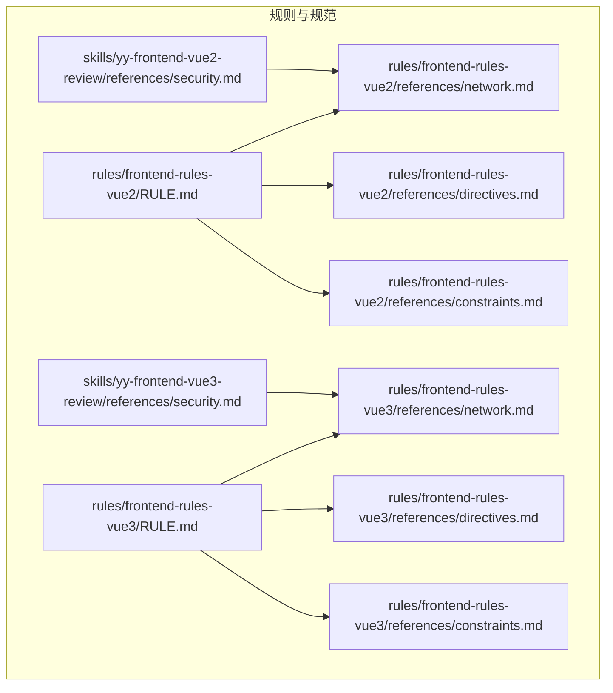
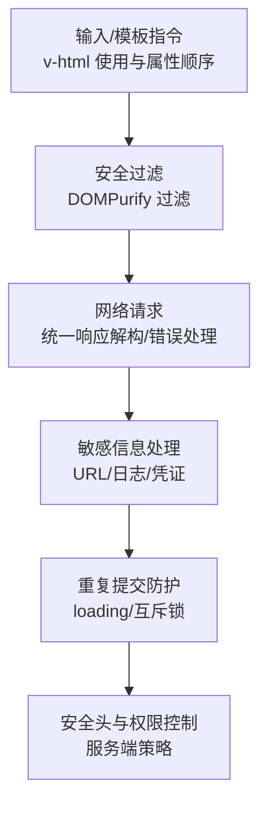
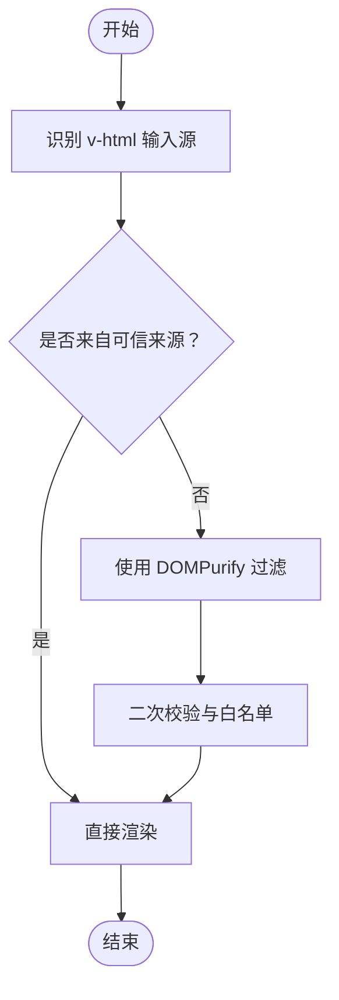
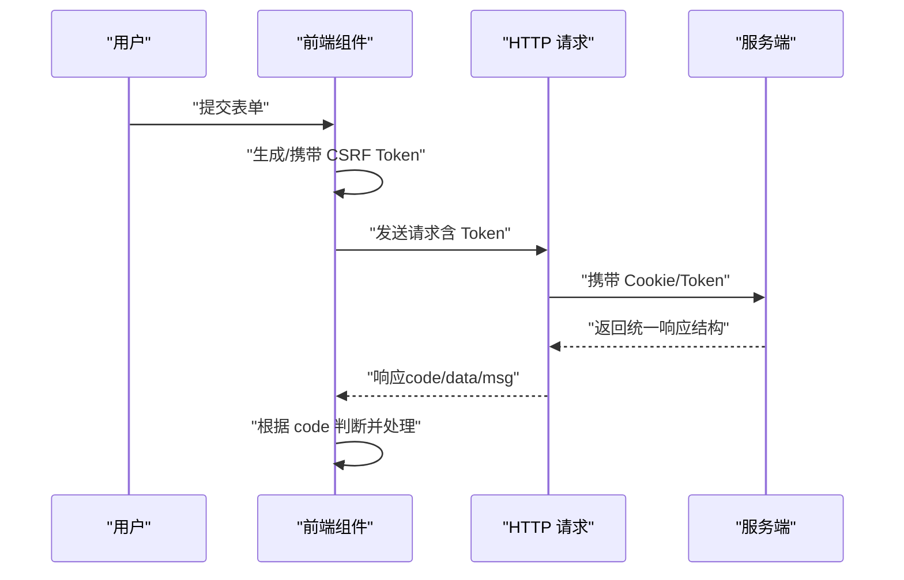
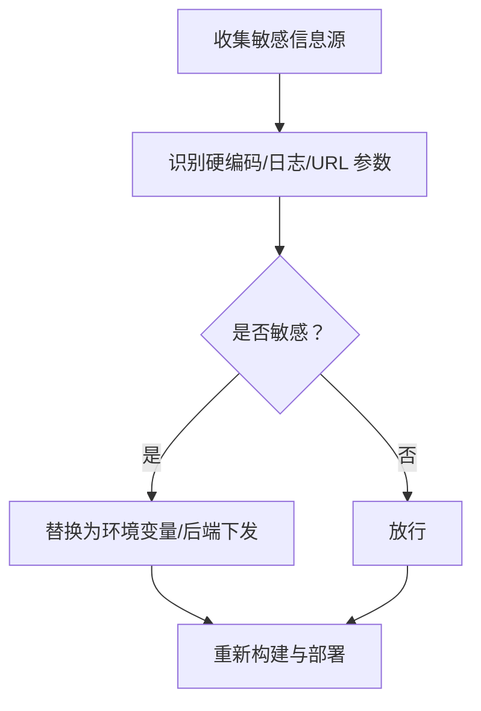
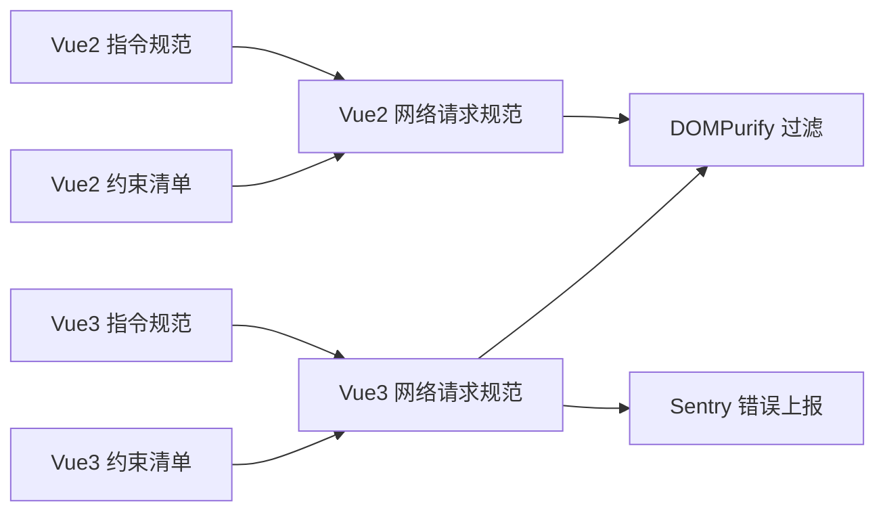

# 安全漏洞检查

<cite>
**本文引用的文件**
- [security.md（Vue2 安全规范）](file://skills/yy-frontend-vue2-review/references/security.md)
- [security.md（Vue3 安全规范）](file://skills/yy-frontend-vue3-review/references/security.md)
- [network.md（Vue2 网络请求规范）](file://rules/frontend-rules-vue2/references/network.md)
- [network.md（Vue3 网络请求规范）](file://rules/frontend-rules-vue3/references/network.md)
- [directives.md（Vue2 指令规范）](file://rules/frontend-rules-vue2/references/directives.md)
- [directives.md（Vue3 指令规范）](file://rules/frontend-rules-vue3/references/directives.md)
- [constraints.md（Vue2 约束清单）](file://rules/frontend-rules-vue2/references/constraints.md)
- [constraints.md（Vue3 约束清单）](file://rules/frontend-rules-vue3/references/constraints.md)
- [RULE.md（Vue2 规则总览）](file://rules/frontend-rules-vue2/RULE.md)
- [RULE.md（Vue3 规则总览）](file://rules/frontend-rules-vue3/RULE.md)
</cite>

## 目录
1. [简介](#简介)
2. [项目结构](#项目结构)
3. [核心组件](#核心组件)
4. [架构总览](#架构总览)
5. [详细组件分析](#详细组件分析)
6. [依赖分析](#依赖分析)
7. [性能考虑](#性能考虑)
8. [故障排查指南](#故障排查指南)
9. [结论](#结论)
10. [附录](#附录)

## 简介
本文件聚焦“安全漏洞检查”维度（D08），系统梳理并解释仓库中与前端安全相关的核心规则与实现要点，覆盖以下主题：
- XSS 跨站脚本攻击防护
- CSRF 跨站请求伪造防范
- SQL 注入防护
- 敏感信息泄露检测
- 输入验证与清理
- 权限控制机制
- 安全头设置

同时，结合仓库现有规则，给出安全检查的实现机制（输入输出分析、数据流向追踪、威胁模式识别）、静态代码分析与安全规则验证方法，并提供常见安全问题示例与修复建议，以及安全开发生命周期（SDL）与测试评估最佳实践。

## 项目结构
本仓库围绕“前端开发规范与审核技能”组织内容，其中与安全检查直接相关的关键位置如下：
- Vue2/Vue3 安全规范与网络请求规范：位于规则目录的 references 子目录中，提供安全维度的约束与实践建议。
- 审核技能的安全参考文件：位于 skills/*/references 下，提供 D08 维度的条目与示例。
- 规则总览文件：位于 rules/*/RULE.md，用于快速定位各模块与适用范围。

图表来源
- [RULE.md（Vue2 规则总览）:1-62](file://rules/frontend-rules-vue2/RULE.md#L1-L62)
- [RULE.md（Vue3 规则总览）:1-68](file://rules/frontend-rules-vue3/RULE.md#L1-L68)
- [network.md（Vue2 网络请求规范）:1-180](file://rules/frontend-rules-vue2/references/network.md#L1-L180)
- [network.md（Vue3 网络请求规范）:1-363](file://rules/frontend-rules-vue3/references/network.md#L1-L363)
- [directives.md（Vue2 指令规范）:1-116](file://rules/frontend-rules-vue2/references/directives.md#L1-L116)
- [directives.md（Vue3 指令规范）:1-105](file://rules/frontend-rules-vue3/references/directives.md#L1-L105)
- [constraints.md（Vue2 约束清单）:1-57](file://rules/frontend-rules-vue2/references/constraints.md#L1-L57)
- [constraints.md（Vue3 约束清单）:1-45](file://rules/frontend-rules-vue3/references/constraints.md#L1-L45)
- [security.md（Vue2 安全规范）:1-32](file://skills/yy-frontend-vue2-review/references/security.md#L1-L32)
- [security.md（Vue3 安全规范）:1-16](file://skills/yy-frontend-vue3-review/references/security.md#L1-L16)

章节来源
- [RULE.md（Vue2 规则总览）:1-62](file://rules/frontend-rules-vue2/RULE.md#L1-L62)
- [RULE.md（Vue3 规则总览）:1-68](file://rules/frontend-rules-vue3/RULE.md#L1-L68)

## 核心组件
- 安全维度条目（D08）：由技能参考文件提供，明确严重等级、适用文件类型与检查要点（如 XSS、敏感信息）。
- 网络请求与安全约束：由 Vue2/Vue3 网络请求规范提供，强调响应解构、错误处理、重复提交防护与安全规范（含 v-html 过滤与敏感数据处理）。
- 指令与模板安全：由 Vue2/Vue3 指令规范提供，重点强调 v-html 的安全使用与模板属性顺序。
- 约束清单：提供绝对禁止项与注意事项，强化安全基线（如禁止连续解构、禁止在模板中直接使用 v-html 且必须过滤等）。

章节来源
- [security.md（Vue2 安全规范）:1-32](file://skills/yy-frontend-vue2-review/references/security.md#L1-L32)
- [security.md（Vue3 安全规范）:1-16](file://skills/yy-frontend-vue3-review/references/security.md#L1-L16)
- [network.md（Vue2 网络请求规范）:176-180](file://rules/frontend-rules-vue2/references/network.md#L176-L180)
- [network.md（Vue3 网络请求规范）:347-354](file://rules/frontend-rules-vue3/references/network.md#L347-L354)
- [directives.md（Vue2 指令规范）:43-61](file://rules/frontend-rules-vue2/references/directives.md#L43-L61)
- [directives.md（Vue3 指令规范）:43-56](file://rules/frontend-rules-vue3/references/directives.md#L43-L56)
- [constraints.md（Vue2 约束清单）:4-16](file://rules/frontend-rules-vue2/references/constraints.md#L4-L16)
- [constraints.md（Vue3 约束清单）:3-16](file://rules/frontend-rules-vue3/references/constraints.md#L3-L16)

## 架构总览
下图展示安全检查在前端代码中的关键触点与规则映射关系，体现从“输入/模板指令”到“网络请求/响应处理”的整体流程与安全约束。

图表来源
- [directives.md（Vue2 指令规范）:43-61](file://rules/frontend-rules-vue2/references/directives.md#L43-L61)
- [directives.md（Vue3 指令规范）:43-56](file://rules/frontend-rules-vue3/references/directives.md#L43-L56)
- [network.md（Vue2 网络请求规范）:176-180](file://rules/frontend-rules-vue2/references/network.md#L176-L180)
- [network.md（Vue3 网络请求规范）:347-354](file://rules/frontend-rules-vue3/references/network.md#L347-L354)

## 详细组件分析

### XSS 跨站脚本攻击防护
- 规则要点
  - v-html 使用必须进行 XSS 过滤，推荐使用 DOMPurify 过滤后再渲染。
  - 模板属性顺序中 v-html 应靠后，降低误用风险。
  - 禁止直接将用户输入通过 v-html 渲染。
- 实施机制
  - 输入输出分析：对 v-html 的输入源进行溯源，确保仅来自可信来源或已过滤内容。
  - 数据流向追踪：从用户输入到 DOMPurify 过滤再到 v-html 渲染的链路需清晰可控。
  - 威胁模式识别：识别“反射型 XSS（用户输入直接进入页面）”“存储型 XSS（持久化到数据库/模板）”等模式。
- 修复建议
  - 将 v-html 替换为纯文本显示或使用受控组件。
  - 对动态内容统一走 DOMPurify 过滤，过滤后仍需进行二次校验。
  - 限制可渲染的标签与属性白名单。
- 示例与路径
  - Vue2 指令规范中对 v-html 的安全要求与过滤示例。
  - Vue3 指令规范中对 v-html 的安全要求与过滤示例。
  - 约束清单中对 v-html 的注意事项。

图表来源
- [directives.md（Vue2 指令规范）:43-61](file://rules/frontend-rules-vue2/references/directives.md#L43-L61)
- [directives.md（Vue3 指令规范）:43-56](file://rules/frontend-rules-vue3/references/directives.md#L43-L56)

章节来源
- [directives.md（Vue2 指令规范）:43-61](file://rules/frontend-rules-vue2/references/directives.md#L43-L61)
- [directives.md（Vue3 指令规范）:43-56](file://rules/frontend-rules-vue3/references/directives.md#L43-L56)
- [constraints.md（Vue2 约束清单）:42-42](file://rules/frontend-rules-vue2/references/constraints.md#L42-L42)
- [constraints.md（Vue3 约束清单）:41-41](file://rules/frontend-rules-vue3/references/constraints.md#L41-L41)

### CSRF 跨站请求伪造防范
- 规则要点
  - 网络请求规范中强调统一的响应解构与错误处理，避免因错误处理不当导致的状态泄漏。
  - 未在仓库中直接出现 CSRF 的显式规则，通常需要服务端配合 Token 校验与 SameSite Cookie 设置。
- 实施机制
  - 输入输出分析：对请求参数与响应结构进行一致性校验，确保业务状态码与消息体一致。
  - 数据流向追踪：从表单提交到请求发送，再到响应处理的全流程需具备幂等性与状态校验。
  - 威胁模式识别：识别“无 CSRF Token 的状态变更请求”“Cookie 泄漏导致的跨站会话劫持”等模式。
- 修复建议
  - 在请求头或表单中携带 CSRF Token，并在服务端严格校验。
  - 使用 SameSite=Strict/Lax 的 Cookie 策略，限制第三方上下文中的 Cookie 发送。
  - 对写操作请求增加二次确认与互斥锁，降低重复提交风险。
- 示例与路径
  - Vue2/Vue3 网络请求规范中的错误处理与重复提交防护。

图表来源
- [network.md（Vue2 网络请求规范）:120-173](file://rules/frontend-rules-vue2/references/network.md#L120-L173)
- [network.md（Vue3 网络请求规范）:113-335](file://rules/frontend-rules-vue3/references/network.md#L113-L335)

章节来源
- [network.md（Vue2 网络请求规范）:120-173](file://rules/frontend-rules-vue2/references/network.md#L120-L173)
- [network.md（Vue3 网络请求规范）:113-335](file://rules/frontend-rules-vue3/references/network.md#L113-L335)

### SQL 注入防护
- 规则要点
  - 仓库未提供前端侧 SQL 注入的直接规则；SQL 注入主要发生在后端。
  - 前端侧应避免将用户输入直接拼接到查询语句中，统一通过后端接口传递参数。
- 实施机制
  - 输入输出分析：对前端传参进行类型与范围校验，避免将原始输入直接拼接为 SQL 片段。
  - 数据流向追踪：从前端参数到后端接口再到数据库查询的链路需遵循参数化查询。
  - 威胁模式识别：识别“前端拼接 SQL 字符串”“后端未参数化查询”等模式。
- 修复建议
  - 所有查询参数通过接口传递，避免在前端构造 SQL。
  - 后端使用参数化查询与 ORM，禁止字符串拼接。
  - 对异常与错误信息进行脱敏处理，避免泄露数据库结构。
- 示例与路径
  - 本节为通用安全建议，不直接对应具体文件。

### 敏感信息泄露检测
- 规则要点
  - 禁止在前端硬编码密码、密钥、Token、私钥等敏感信息。
  - 禁止在日志中输出敏感数据（如凭证、Token）。
  - 禁止在前端暴露后端内部接口地址。
  - 网络请求规范强调不在 URL 传输 token/密码，不在控制台输出用户凭证。
- 实施机制
  - 输入输出分析：对构建产物与运行时日志进行扫描，识别敏感字符串与 URL 参数。
  - 数据流向追踪：从配置文件到运行时变量再到网络请求的全链路检查。
  - 威胁模式识别：识别“硬编码密钥”“日志泄露凭证”“前端暴露内网接口”等模式。
- 修复建议
  - 使用环境变量与后端下发配置，避免硬编码。
  - 对日志输出进行脱敏与白名单控制。
  - 通过代理或网关隐藏后端内部接口地址。
- 示例与路径
  - Vue2/Vue3 安全规范与网络请求规范中的敏感信息处理要求。

图表来源
- [security.md（Vue2 安全规范）:25-32](file://skills/yy-frontend-vue2-review/references/security.md#L25-L32)
- [security.md（Vue3 安全规范）:13-16](file://skills/yy-frontend-vue3-review/references/security.md#L13-L16)
- [network.md（Vue2 网络请求规范）:179-180](file://rules/frontend-rules-vue2/references/network.md#L179-L180)
- [network.md（Vue3 网络请求规范）:349-352](file://rules/frontend-rules-vue3/references/network.md#L349-L352)

章节来源
- [security.md（Vue2 安全规范）:25-32](file://skills/yy-frontend-vue2-review/references/security.md#L25-L32)
- [security.md（Vue3 安全规范）:13-16](file://skills/yy-frontend-vue3-review/references/security.md#L13-L16)
- [network.md（Vue2 网络请求规范）:179-180](file://rules/frontend-rules-vue2/references/network.md#L179-L180)
- [network.md（Vue3 网络请求规范）:349-352](file://rules/frontend-rules-vue3/references/network.md#L349-L352)

### 输入验证与清理
- 规则要点
  - 禁止连续解构（如 ...data.data），避免深层访问引发的异常。
  - 统一响应模式与先判后用的处理方式，提升健壮性。
  - 模板中避免将 v-if 与 v-for 同元素使用，推荐使用 template 包裹或 computed 预过滤。
- 实施机制
  - 输入输出分析：对输入参数与响应结构进行类型守卫与边界检查。
  - 数据流向追踪：从用户输入到组件状态再到网络请求的每一步均需校验。
  - 威胁模式识别：识别“越界访问”“空值访问”“条件渲染冲突”等模式。
- 修复建议
  - 使用单次解构与类型守卫，避免连续解构。
  - 对模板指令使用进行规范化，避免 v-if 与 v-for 同元素。
  - 在网络请求前对表单数据进行格式化与白名单校验。
- 示例与路径
  - Vue2/Vue3 约束清单与网络请求规范中的相关条目。

章节来源
- [constraints.md（Vue2 约束清单）:7-16](file://rules/frontend-rules-vue2/references/constraints.md#L7-L16)
- [constraints.md（Vue3 约束清单）:7-16](file://rules/frontend-rules-vue3/references/constraints.md#L7-L16)
- [network.md（Vue2 网络请求规范）:79-116](file://rules/frontend-rules-vue2/references/network.md#L79-L116)
- [network.md（Vue3 网络请求规范）:72-109](file://rules/frontend-rules-vue3/references/network.md#L72-L109)

### 权限控制机制
- 规则要点
  - 禁止父组件直接修改子组件内部状态，避免越权访问。
  - 禁止在 Options API 中使用 this（Vue3 中禁止在 <script setup> 使用 this），避免上下文混乱。
  - 禁止使用 mixins，改用 Hooks/组合式函数，降低耦合与权限边界模糊。
- 实施机制
  - 输入输出分析：对组件间通信与状态变更进行权限边界检查。
  - 数据流向追踪：从用户操作到组件状态再到子组件更新的权限链路。
  - 威胁模式识别：识别“越权修改子组件状态”“上下文污染”“权限蔓延”等模式。
- 修复建议
  - 使用 props/$emit 或 provide/inject 等受控通道进行通信。
  - 使用组合式函数与 Hooks 抽离可复用逻辑，避免混用多种 API。
  - 对写操作请求增加权限校验与二次确认。
- 示例与路径
  - Vue2/Vue3 约束清单中的相关条目。

章节来源
- [constraints.md（Vue2 约束清单）:8-12](file://rules/frontend-rules-vue2/references/constraints.md#L8-L12)
- [constraints.md（Vue3 约束清单）:8-14](file://rules/frontend-rules-vue3/references/constraints.md#L8-L14)

### 安全头设置
- 规则要点
  - Vue3 网络请求规范中提到“全局错误捕获需配置 app.config.errorHandler，并配合 Sentry 上报”，这属于前端错误监控层面的安全实践。
  - 仓库未提供浏览器安全头（如 CSP、HSTS、X-Frame-Options 等）的具体配置规则。
- 实施机制
  - 输入输出分析：对错误上报与日志脱敏进行统一处理。
  - 数据流向追踪：从前端错误捕获到后端日志系统的链路需具备审计能力。
  - 威胁模式识别：识别“错误信息泄露”“日志未脱敏”等模式。
- 修复建议
  - 在服务端配置安全头，前端通过 HTTPS 与安全策略减少中间层风险。
  - 对错误上报进行白名单与脱敏处理，避免敏感信息外泄。
- 示例与路径
  - Vue3 网络请求规范中的全局错误捕获与上报建议。

章节来源
- [network.md（Vue3 网络请求规范）:353-353](file://rules/frontend-rules-vue3/references/network.md#L353-L353)

## 依赖分析
- 规则耦合关系
  - 指令规范与网络请求规范共同构成 v-html 与请求安全的双重保障。
  - 约束清单提供绝对禁止项，作为安全基线，与网络请求规范形成互补。
- 外部依赖
  - DOMPurify 作为 v-html 过滤工具，需在项目中正确引入与配置。
  - Sentry 作为错误上报平台，需在前端配置 errorHandler 并进行脱敏处理。

图表来源
- [directives.md（Vue2 指令规范）:43-61](file://rules/frontend-rules-vue2/references/directives.md#L43-L61)
- [directives.md（Vue3 指令规范）:43-56](file://rules/frontend-rules-vue3/references/directives.md#L43-L56)
- [network.md（Vue2 网络请求规范）:176-180](file://rules/frontend-rules-vue2/references/network.md#L176-L180)
- [network.md（Vue3 网络请求规范）:347-354](file://rules/frontend-rules-vue3/references/network.md#L347-L354)
- [constraints.md（Vue2 约束清单）:1-57](file://rules/frontend-rules-vue2/references/constraints.md#L1-L57)
- [constraints.md（Vue3 约束清单）:1-45](file://rules/frontend-rules-vue3/references/constraints.md#L1-L45)

章节来源
- [directives.md（Vue2 指令规范）:43-61](file://rules/frontend-rules-vue2/references/directives.md#L43-L61)
- [directives.md（Vue3 指令规范）:43-56](file://rules/frontend-rules-vue3/references/directives.md#L43-L56)
- [network.md（Vue2 网络请求规范）:176-180](file://rules/frontend-rules-vue2/references/network.md#L176-L180)
- [network.md（Vue3 网络请求规范）:347-354](file://rules/frontend-rules-vue3/references/network.md#L347-L354)
- [constraints.md（Vue2 约束清单）:1-57](file://rules/frontend-rules-vue2/references/constraints.md#L1-L57)
- [constraints.md（Vue3 约束清单）:1-45](file://rules/frontend-rules-vue3/references/constraints.md#L1-L45)

## 性能考虑
- v-html 过滤成本：DOMPurify 过滤会带来 CPU 与内存开销，建议对高频渲染内容进行缓存与白名单优化。
- 请求并发与互斥：重复提交防护与互斥锁可减少无效请求，提升用户体验与后端压力。
- 错误上报与日志：统一的错误捕获与脱敏处理可降低日志体积与泄露风险。

## 故障排查指南
- v-html 渲染异常
  - 现象：页面出现脚本执行或样式破坏。
  - 排查：确认输入源是否已过滤；检查 DOMPurify 版本与白名单配置。
- 请求失败或状态异常
  - 现象：业务错误码未正确处理或重复提交导致状态错乱。
  - 排查：检查响应解构与错误处理分支；确认 loading/互斥锁逻辑。
- 敏感信息泄露
  - 现象：日志中出现 Token、密码或内部接口地址。
  - 排查：检查构建产物与运行时日志；确认环境变量与脱敏策略。

章节来源
- [network.md（Vue2 网络请求规范）:120-173](file://rules/frontend-rules-vue2/references/network.md#L120-L173)
- [network.md（Vue3 网络请求规范）:113-335](file://rules/frontend-rules-vue3/references/network.md#L113-L335)
- [security.md（Vue2 安全规范）:25-32](file://skills/yy-frontend-vue2-review/references/security.md#L25-L32)
- [security.md（Vue3 安全规范）:13-16](file://skills/yy-frontend-vue3-review/references/security.md#L13-L16)

## 结论
本仓库围绕 D08 安全漏洞检查维度，提供了从模板指令、网络请求到约束清单的多层安全规则与实践建议。结合 v-html 过滤、敏感信息处理、重复提交防护与错误上报等机制，可在前端侧有效降低 XSS、敏感信息泄露与 CSRF 等风险。对于 SQL 注入与安全头设置，建议在后端与服务端配置层面完善，并通过统一的错误上报与日志脱敏加强前端可观测性与安全性。

## 附录
- 安全开发生命周期（SDL）建议
  - 设计阶段：威胁建模与安全需求分解。
  - 开发阶段：静态代码分析与安全规则集成。
  - 测试阶段：单元测试、集成测试与渗透测试。
  - 运维阶段：日志脱敏、错误上报与安全监控。
- 安全测试与漏洞评估最佳实践
  - 使用自动化工具扫描敏感信息与硬编码。
  - 对关键路径进行端到端测试与压力测试。
  - 建立安全回归测试与持续监控机制。