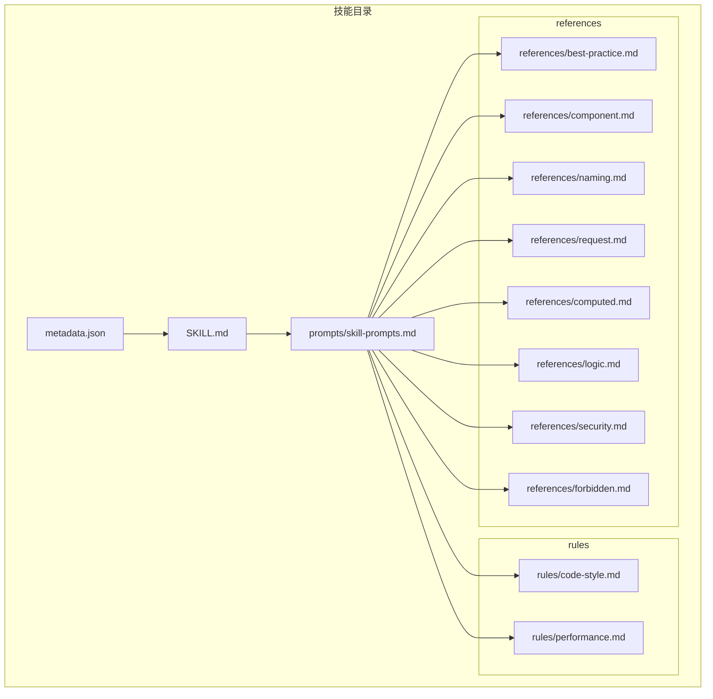
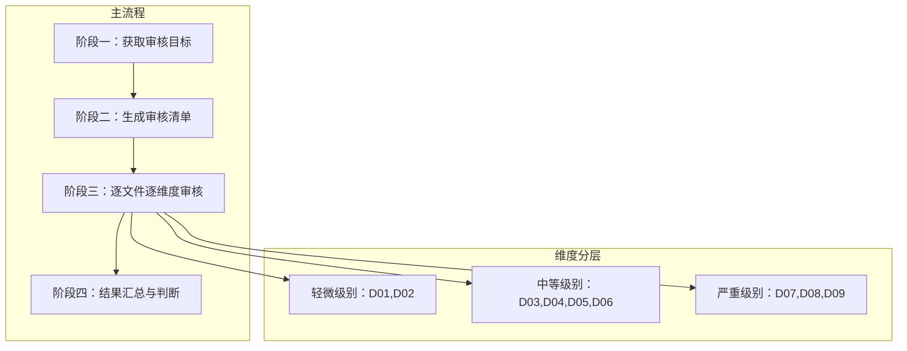
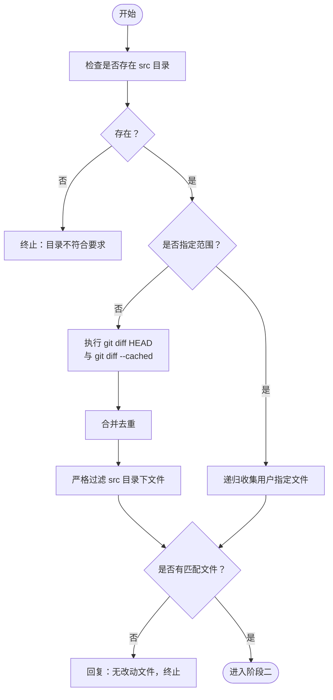
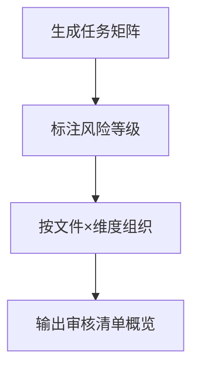
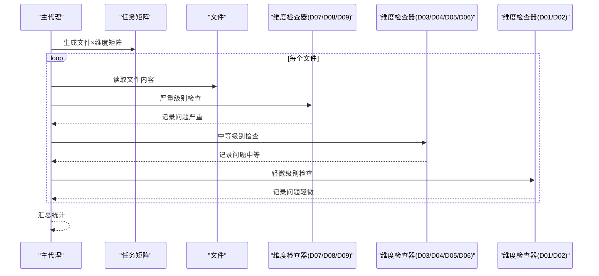
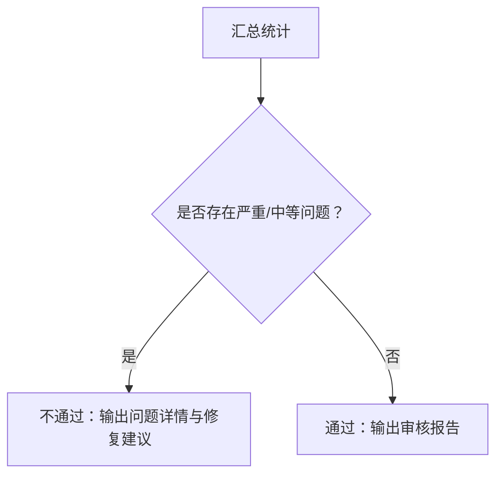
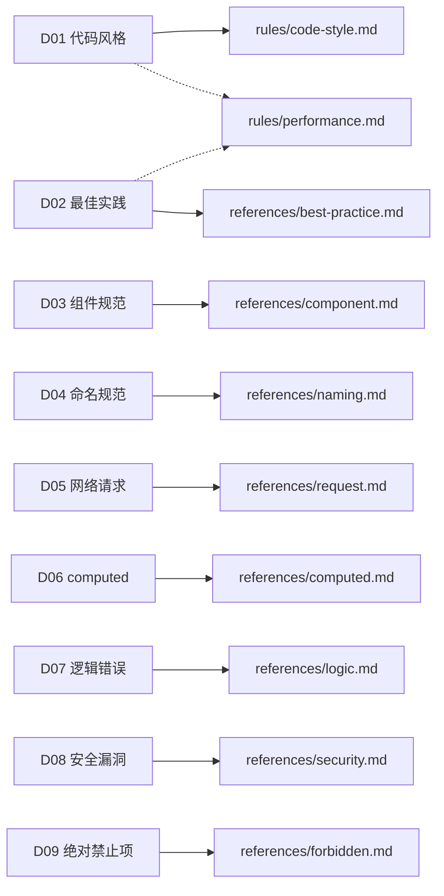

# 审核流程与执行机制

<cite>
**本文引用的文件**
- [metadata.json](file://skills/yy-frontend-vue2-review/metadata.json)
- [SKILL.md](file://skills/yy-frontend-vue2-review/SKILL.md)
- [skill-prompts.md](file://skills/yy-frontend-vue2-review/prompts/skill-prompts.md)
- [code-style.md](file://skills/yy-frontend-vue2-review/rules/code-style.md)
- [best-practice.md](file://skills/yy-frontend-vue2-review/references/best-practice.md)
- [component.md](file://skills/yy-frontend-vue2-review/references/component.md)
- [naming.md](file://skills/yy-frontend-vue2-review/references/naming.md)
- [request.md](file://skills/yy-frontend-vue2-review/references/request.md)
- [computed.md](file://skills/yy-frontend-vue2-review/references/computed.md)
- [logic.md](file://skills/yy-frontend-vue2-review/references/logic.md)
- [security.md](file://skills/yy-frontend-vue2-review/references/security.md)
- [forbidden.md](file://skills/yy-frontend-vue2-review/references/forbidden.md)
- [performance.md](file://skills/yy-frontend-vue2-review/rules/performance.md)
</cite>

## 目录
1. [简介](#简介)
2. [项目结构](#项目结构)
3. [核心组件](#核心组件)
4. [架构总览](#架构总览)
5. [详细组件分析](#详细组件分析)
6. [依赖关系分析](#依赖关系分析)
7. [性能考量](#性能考量)
8. [故障排查指南](#故障排查指南)
9. [结论](#结论)
10. [附录](#附录)

## 简介
本文件面向 Vue2 代码审核流程，系统化梳理“yy-frontend-vue2-review”技能的四阶段执行机制：阶段一（获取审核目标）、阶段二（生成审核清单）、阶段三（逐文件逐维度审核）、阶段四（结果汇总与判断）。文档覆盖各阶段的实现逻辑、边界条件与异常处理，提供流程图与实际执行示例，帮助读者从文件收集到最终报告输出完整理解审核体系。

## 项目结构
该技能位于 skills/yy-frontend-vue2-review 目录，包含元数据、技能说明、系统提示词以及各审核维度的参考与规则文件。核心文件如下：
- 元数据与技能说明：metadata.json、SKILL.md
- 系统提示词与流程：prompts/skill-prompts.md
- 审核维度参考与规则：references/*.md、rules/*.md

图表来源
- [metadata.json:1-34](file://skills/yy-frontend-vue2-review/metadata.json#L1-L34)
- [SKILL.md:1-167](file://skills/yy-frontend-vue2-review/SKILL.md#L1-L167)
- [skill-prompts.md:1-628](file://skills/yy-frontend-vue2-review/prompts/skill-prompts.md#L1-L628)

章节来源
- [metadata.json:1-34](file://skills/yy-frontend-vue2-review/metadata.json#L1-L34)
- [SKILL.md:1-167](file://skills/yy-frontend-vue2-review/SKILL.md#L1-L167)

## 核心组件
- 审核目标收集器：负责目录验证、用户指定文件收集、Git 变动文件检测与过滤。
- 审核清单生成器：定义 9 大维度与严重程度分级，形成按文件×维度的任务矩阵。
- 审核执行器：按阶段顺序逐维度检查，记录问题并统计风险等级。
- 结果汇总器：统计问题数量、判定通过/不通过、输出报告与修复建议。

章节来源
- [SKILL.md:59-96](file://skills/yy-frontend-vue2-review/SKILL.md#L59-L96)
- [skill-prompts.md:31-74](file://skills/yy-frontend-vue2-review/prompts/skill-prompts.md#L31-L74)

## 架构总览
整体采用分层架构，实现维度单一、并行审核、故障隔离与自动判断。

图表来源
- [skill-prompts.md:77-117](file://skills/yy-frontend-vue2-review/prompts/skill-prompts.md#L77-L117)

章节来源
- [skill-prompts.md:77-117](file://skills/yy-frontend-vue2-review/prompts/skill-prompts.md#L77-L117)

## 详细组件分析

### 阶段一：获取审核目标
- 目录验证：严格限定在 src 目录内审核，若不存在则终止。
- 用户指定：递归收集指定路径下的支持文件类型（.vue/.js/.css/.scss/.less）。
- 未指定：执行 git diff 与 git diff --cached，合并去重后严格过滤 src 目录下文件。
- 无匹配：返回“当前 src 目录下没有需要审核的改动文件”，终止流程。

图表来源
- [SKILL.md:61-66](file://skills/yy-frontend-vue2-review/SKILL.md#L61-L66)
- [skill-prompts.md:9-13](file://skills/yy-frontend-vue2-review/prompts/skill-prompts.md#L9-L13)

章节来源
- [SKILL.md:61-66](file://skills/yy-frontend-vue2-review/SKILL.md#L61-L66)
- [skill-prompts.md:9-13](file://skills/yy-frontend-vue2-review/prompts/skill-prompts.md#L9-L13)

### 阶段二：生成审核清单
- 维度与严重程度：
  - D01 代码风格（🟢 轻微）
  - D02 最佳实践（🟢 轻微）
  - D03 组件规范（🟡 中等）
  - D04 命名规范（🟡 中等）
  - D05 网络请求（🟡 中等）
  - D06 computed（🟡 中等）
  - D07 逻辑错误（🔴 严重）
  - D08 安全漏洞（🔴 严重）
  - D09 绝对禁止项（🔴 严重）
- 执行规则：
  - 严重：发现即不通过，必须修复
  - 中等：发现则不通过，建议修复
  - 轻微：发现则列出，不影响通过结论
- 文件类型覆盖：
  - .vue：全部 9 维度
  - .js：D01,D03,D04,D05,D06,D07,D09
  - .css/.scss/.less：D01,D02

图表来源
- [SKILL.md:68-87](file://skills/yy-frontend-vue2-review/SKILL.md#L68-L87)
- [skill-prompts.md:31-74](file://skills/yy-frontend-vue2-review/prompts/skill-prompts.md#L31-L74)

章节来源
- [SKILL.md:68-87](file://skills/yy-frontend-vue2-review/SKILL.md#L68-L87)
- [skill-prompts.md:31-74](file://skills/yy-frontend-vue2-review/prompts/skill-prompts.md#L31-L74)

### 阶段三：逐文件逐维度审核
- 审核顺序（分阶段）：
  - 阶段一（严重优先）：D07,D08,D09
  - 阶段二（中等）：D03,D04,D05,D06
  - 阶段三（轻微）：D01,D02
- 检查策略：
  - 严重问题：检测到即标记，继续完成其他维度以保证完整性
  - 中等问题：影响不通过结论
  - 轻微问题：仅记录，不影响通过结论
- 维度要点（示例）：
  - D01 代码风格：缩进、引号、分号、行宽、尾随逗号、导入顺序分组
  - D02 最佳实践：调试代码清理、BEM 命名、scoped、未使用变量、Props 解构
  - D03 组件规范：脚本结构顺序、生命周期顺序、模板特性顺序、Props/Emit 规范、v-slot、命名、data/computed 使用原则、模块化
  - D04 命名规范：API/事件/常量/Props/组件名/emit/方法/data/computed 命名与前缀
  - D05 网络请求：async/await + try/catch/finally、统一响应模式、禁止多层嵌套
  - D06 computed：必须 try/catch、有意义命名
  - D07 逻辑错误：空指针、数组越界、判断遗漏、方法内部顺序
  - D08 安全漏洞：XSS、敏感信息泄露
  - D09 绝对禁止项：连续解构、修改子组件数据、修改 data 类型、直接修改 props

图表来源
- [skill-prompts.md:144-151](file://skills/yy-frontend-vue2-review/prompts/skill-prompts.md#L144-L151)
- [SKILL.md:88-96](file://skills/yy-frontend-vue2-review/SKILL.md#L88-L96)

章节来源
- [skill-prompts.md:144-151](file://skills/yy-frontend-vue2-review/prompts/skill-prompts.md#L144-L151)
- [SKILL.md:88-96](file://skills/yy-frontend-vue2-review/SKILL.md#L88-L96)

### 阶段四：结果汇总与判断
- 统计与判定：
  - 存在严重/中等问题 → ❌ 不通过，输出问题详情与修复建议
  - 仅轻微问题或无问题 → ✅ 通过，输出审核报告
- 报告结构：
  - 审核清单展示（文件×维度）
  - 通过/不通过结论与统计
  - 严重问题与中等问题分组输出

图表来源
- [SKILL.md:92-96](file://skills/yy-frontend-vue2-review/SKILL.md#L92-L96)

章节来源
- [SKILL.md:92-96](file://skills/yy-frontend-vue2-review/SKILL.md#L92-L96)

## 依赖关系分析
- 维度规则依赖：
  - D01/D02：依赖 rules/code-style.md、references/best-practice.md
  - D03：依赖 references/component.md
  - D04：依赖 references/naming.md
  - D05：依赖 references/request.md
  - D06：依赖 references/computed.md
  - D07：依赖 references/logic.md
  - D08：依赖 references/security.md
  - D09：依赖 references/forbidden.md
  - 性能相关：依赖 rules/performance.md（用于补充建议）

图表来源
- [skill-prompts.md:31-74](file://skills/yy-frontend-vue2-review/prompts/skill-prompts.md#L31-L74)
- [code-style.md:1-63](file://skills/yy-frontend-vue2-review/rules/code-style.md#L1-L63)
- [best-practice.md:1-107](file://skills/yy-frontend-vue2-review/references/best-practice.md#L1-L107)
- [component.md:1-195](file://skills/yy-frontend-vue2-review/references/component.md#L1-L195)
- [naming.md:1-35](file://skills/yy-frontend-vue2-review/references/naming.md#L1-L35)
- [request.md:1-44](file://skills/yy-frontend-vue2-review/references/request.md#L1-L44)
- [computed.md:1-31](file://skills/yy-frontend-vue2-review/references/computed.md#L1-L31)
- [logic.md:1-64](file://skills/yy-frontend-vue2-review/references/logic.md#L1-L64)
- [security.md:1-32](file://skills/yy-frontend-vue2-review/references/security.md#L1-L32)
- [forbidden.md:1-36](file://skills/yy-frontend-vue2-review/references/forbidden.md#L1-L36)
- [performance.md:1-179](file://skills/yy-frontend-vue2-review/rules/performance.md#L1-L179)

章节来源
- [skill-prompts.md:31-74](file://skills/yy-frontend-vue2-review/prompts/skill-prompts.md#L31-L74)

## 性能考量
- 并行审核：多个文件可并行审核，提升吞吐
- 故障隔离：单个文件问题不影响其他审核
- 大文件处理：超过阈值可分段审核
- 性能优化建议：组件懒加载、KeepAlive、虚拟滚动、防抖节流、图片优化、响应式性能（computed、freeze、watch 优化）

章节来源
- [skill-prompts.md:77-86](file://skills/yy-frontend-vue2-review/prompts/skill-prompts.md#L77-L86)
- [performance.md:1-179](file://skills/yy-frontend-vue2-review/rules/performance.md#L1-L179)

## 故障排查指南
- 非 Vue2 项目：检测到 Vue3 特征或 React 语法时拒绝处理
- 无 src 目录：终止并提示目录要求不符
- 仅轻微问题：审核通过，问题列表仍展示
- 存在中/严重问题：审核不通过，按文件分组、按严重程度排序输出问题详情
- 重复问题：统计总数，提供统一修复方案
- 用户要求修复：仅在用户明确要求后才执行代码修复，否则仅保留审核结果

章节来源
- [skill-prompts.md:19-28](file://skills/yy-frontend-vue2-review/prompts/skill-prompts.md#L19-L28)
- [skill-prompts.md:466-478](file://skills/yy-frontend-vue2-review/prompts/skill-prompts.md#L466-L478)

## 结论
该审核系统围绕“src 目录边界、9 大维度、三级严重程度、分阶段审核”构建，通过明确的规则与严格的边界控制，确保审核结果可解释、可追溯且可落地。系统支持并行处理与故障隔离，结合性能优化建议，能够在保证质量的同时兼顾效率。

## 附录
- 实际执行示例（概念性说明）：
  - 场景一：默认范围审核
    - 输入：git diff HEAD 与 git diff --cached 的 src 目录变动文件
    - 处理：合并去重后严格过滤 src 范围
    - 输出：按文件×维度的审核清单与结论
  - 场景二：用户指定范围审核
    - 输入：用户指定 src 下某文件或文件夹
    - 处理：递归收集支持文件类型
    - 输出：同上
  - 场景三：仅轻微问题
    - 输入：若干轻微问题
    - 处理：统计轻微问题数
    - 输出：通过结论与轻微问题详情（可选）
  - 场景四：存在中/严重问题
    - 输入：若干中等问题或严重问题
    - 处理：按严重程度排序输出问题详情
    - 输出：不通过结论与修复建议