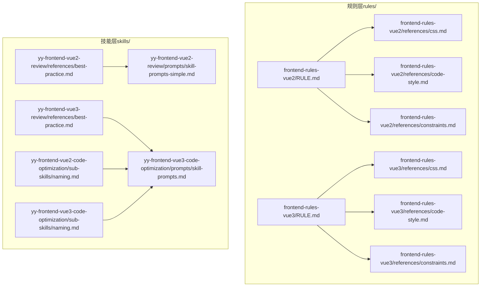
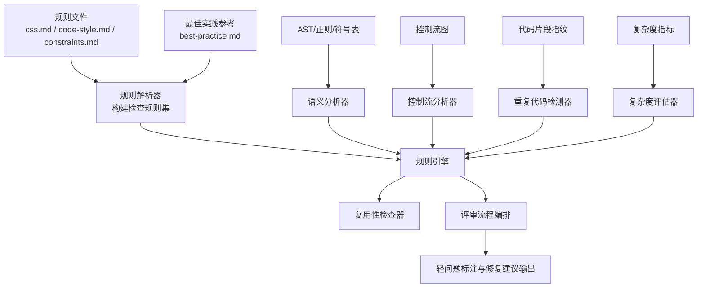
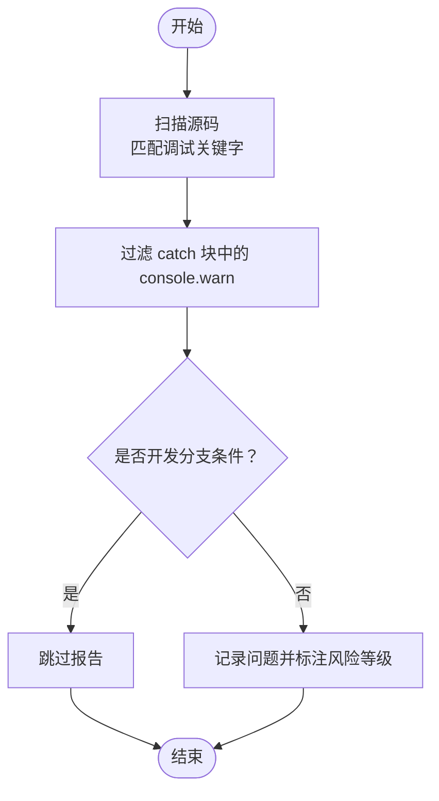
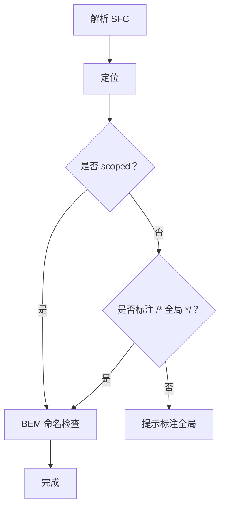
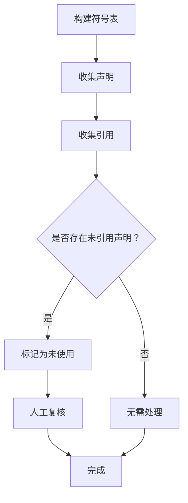
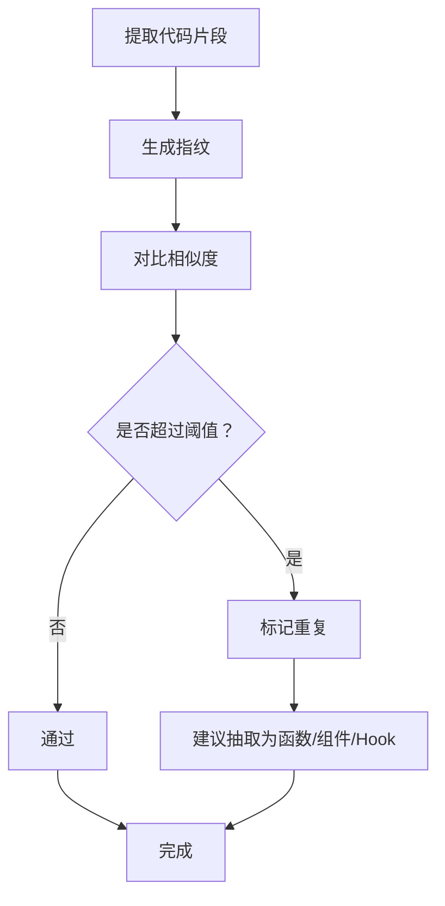
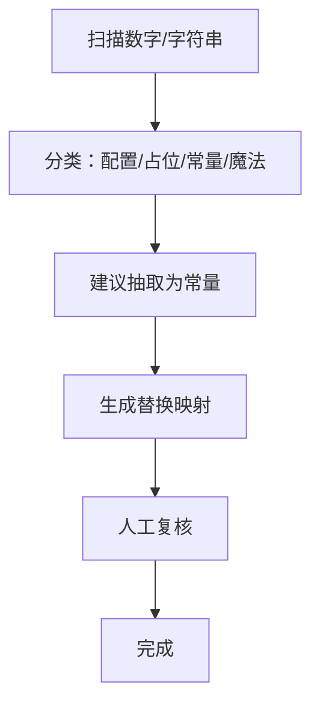
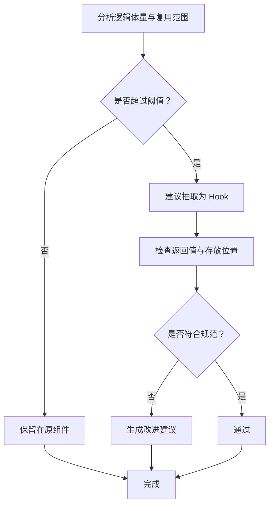
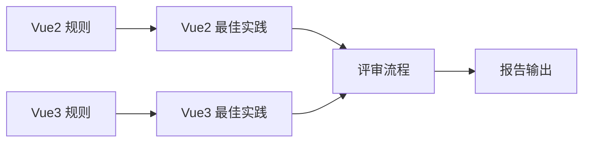

# 最佳实践检查规范

<cite>
**本文档引用的文件**
- [best-practice.md（Vue2）](file://skills/yy-frontend-vue2-review/references/best-practice.md)
- [best-practice.md（Vue3）](file://skills/yy-frontend-vue3-review/references/best-practice.md)
- [css.md（Vue2）](file://rules/frontend-rules-vue2/references/css.md)
- [css.md（Vue3）](file://rules/frontend-rules-vue3/references/css.md)
- [code-style.md（Vue2）](file://rules/frontend-rules-vue2/references/code-style.md)
- [code-style.md（Vue3）](file://rules/frontend-rules-vue3/references/code-style.md)
- [constraints.md（Vue2）](file://rules/frontend-rules-vue2/references/constraints.md)
- [constraints.md（Vue3）](file://rules/frontend-rules-vue3/references/constraints.md)
- [RULE.md（Vue2）](file://rules/frontend-rules-vue2/RULE.md)
- [RULE.md（Vue3）](file://rules/frontend-rules-vue3/RULE.md)
- [skill-prompts-simple.md（Vue2）](file://skills/yy-frontend-vue2-review/prompts/skill-prompts-simple.md)
- [naming.md（Vue2 代码优化）](file://skills/yy-frontend-vue2-code-optimization/sub-skills/naming.md)
- [naming.md（Vue3 代码优化）](file://skills/yy-frontend-vue3-code-optimization/sub-skills/naming.md)
- [skill-prompts.md（Vue3 代码优化）](file://skills/yy-frontend-vue3-code-optimization/prompts/skill-prompts.md)
- [AGENTS.md](file://AGENTS.md)
</cite>

## 目录
1. [简介](#简介)
2. [项目结构](#项目结构)
3. [核心组件](#核心组件)
4. [架构总览](#架构总览)
5. [详细组件分析](#详细组件分析)
6. [依赖分析](#依赖分析)
7. [性能考量](#性能考量)
8. [故障排查指南](#故障排查指南)
9. [结论](#结论)
10. [附录](#附录)

## 简介
本文件面向“最佳实践检查维度（D02）”的系统化技术文档，聚焦以下检查主题：
- 调试代码（console.log、debugger）检测与清理
- scoped 样式作用域使用与 BEM 命名规范
- 未使用变量与未使用函数识别
- 重复代码检测
- 魔法数字与魔法字符串处理
- 组件复用性检查（含 Hooks 规范）

文档将阐述检查机制、代码分析算法、智能化实现（语义分析、控制流分析、复杂度评估）、常见反模式与重构建议，并提供性能优化与可维护性提升策略。

## 项目结构
本仓库围绕“规则与技能”两条主线组织：
- 规则层（rules/）：提供 Vue2/Vue3 的前端开发规范与约束清单，覆盖 CSS、命名、代码风格、性能等模块。
- 技能层（skills/）：提供面向评审、优化、重构的自动化技能，包含提示词、评估用例与执行策略。

图表来源
- [RULE.md（Vue2）:1-62](file://rules/frontend-rules-vue2/RULE.md#L1-L62)
- [RULE.md（Vue3）:1-68](file://rules/frontend-rules-vue3/RULE.md#L1-L68)
- [css.md（Vue2）:1-63](file://rules/frontend-rules-vue2/references/css.md#L1-L63)
- [css.md（Vue3）:1-67](file://rules/frontend-rules-vue3/references/css.md#L1-L67)
- [code-style.md（Vue2）:1-63](file://rules/frontend-rules-vue2/references/code-style.md#L1-L63)
- [code-style.md（Vue3）:1-61](file://rules/frontend-rules-vue3/references/code-style.md#L1-L61)
- [constraints.md（Vue2）:1-57](file://rules/frontend-rules-vue2/references/constraints.md#L1-L57)
- [constraints.md（Vue3）:1-45](file://rules/frontend-rules-vue3/references/constraints.md#L1-L45)
- [best-practice.md（Vue2）:1-107](file://skills/yy-frontend-vue2-review/references/best-practice.md#L1-L107)
- [best-practice.md（Vue3）:1-123](file://skills/yy-frontend-vue3-review/references/best-practice.md#L1-L123)
- [skill-prompts-simple.md（Vue2）:61-101](file://skills/yy-frontend-vue2-review/prompts/skill-prompts-simple.md#L61-L101)
- [naming.md（Vue2 代码优化）:1-41](file://skills/yy-frontend-vue2-code-optimization/sub-skills/naming.md#L1-L41)
- [naming.md（Vue3 代码优化）:1-42](file://skills/yy-frontend-vue3-code-optimization/sub-skills/naming.md#L1-L42)
- [skill-prompts.md（Vue3 代码优化）:1404-1531](file://skills/yy-frontend-vue3-code-optimization/prompts/skill-prompts.md#L1404-L1531)

章节来源
- [RULE.md（Vue2）:1-62](file://rules/frontend-rules-vue2/RULE.md#L1-L62)
- [RULE.md（Vue3）:1-68](file://rules/frontend-rules-vue3/RULE.md#L1-L68)

## 核心组件
- 规则引擎（Rule Engine）
  - 依据规则文件（css.md、code-style.md、constraints.md）构建检查规则集，覆盖样式作用域、命名、代码风格、约束与推荐项。
- 语义分析器（Semantic Analyzer）
  - 基于 AST/正则/符号表进行语义解析，识别调试代码、未使用变量、魔法数字/字符串、重复代码片段。
- 控制流分析器（Control Flow Analyzer）
  - 分析函数/组件控制流，辅助 try/catch 包裹、computed/async 规范、生命周期 emit 等检查。
- 复杂度评估器（Complexity Estimator）
  - 评估函数/组件圈复杂度、嵌套深度、重复度，输出风险评分与改进建议。
- 复用性检查器（Reusability Checker）
  - 基于代码体量、跨组件使用频率、职责边界，判定是否应抽离为 Hook/组件/工具函数。
- 评审流程编排（Review Orchestrator）
  - 按 D01→D09 的顺序生成审核矩阵，对 D02 轻微问题在最终报告中标注并给出修复建议。

章节来源
- [best-practice.md（Vue2）:1-107](file://skills/yy-frontend-vue2-review/references/best-practice.md#L1-L107)
- [best-practice.md（Vue3）:1-123](file://skills/yy-frontend-vue3-review/references/best-practice.md#L1-L123)
- [skill-prompts-simple.md（Vue2）:61-101](file://skills/yy-frontend-vue2-review/prompts/skill-prompts-simple.md#L61-L101)

## 架构总览
下图展示 D02 维度检查在规则与技能之间的协同关系，以及与评审流程的集成。

图表来源
- [css.md（Vue2）:1-63](file://rules/frontend-rules-vue2/references/css.md#L1-L63)
- [css.md（Vue3）:1-67](file://rules/frontend-rules-vue3/references/css.md#L1-L67)
- [code-style.md（Vue2）:1-63](file://rules/frontend-rules-vue2/references/code-style.md#L1-L63)
- [code-style.md（Vue3）:1-61](file://rules/frontend-rules-vue3/references/code-style.md#L1-L61)
- [constraints.md（Vue2）:1-57](file://rules/frontend-rules-vue2/references/constraints.md#L1-L57)
- [constraints.md（Vue3）:1-45](file://rules/frontend-rules-vue3/references/constraints.md#L1-L45)
- [best-practice.md（Vue2）:1-107](file://skills/yy-frontend-vue2-review/references/best-practice.md#L1-L107)
- [best-practice.md（Vue3）:1-123](file://skills/yy-frontend-vue3-review/references/best-practice.md#L1-L123)
- [skill-prompts-simple.md（Vue2）:61-101](file://skills/yy-frontend-vue2-review/prompts/skill-prompts-simple.md#L61-L101)

## 详细组件分析

### 调试代码检测与清理
- 检查机制
  - 文本扫描：在 JS/Vue 源码中检索 console.log、debugger、alert 等关键字。
  - 上下文过滤：允许 catch 块中的 console.warn 保留，避免误报。
  - 文件范围：覆盖 .vue/.js/.ts/.css/.scss/.less。
- 智能化实现
  - 语义分析：结合 AST 判断调用是否处于 try/catch 块，若为 catch 块且为 warn，则标记为允许。
  - 控制流：排除仅在开发阶段的条件分支（如开发环境分支）。
- 改进建议
  - 统一日志门面：引入轻量日志库，集中管理级别与输出。
  - 自动清理：在 CI 中增加“调试代码清理”步骤，失败即阻断。
- 常见反模式
  - 在生产分支仍保留 console.log。
  - debugger 与 alert 混用，导致阻塞与异常。
- 重构示例（路径）
  - [调试代码清理（Vue2）:9-20](file://skills/yy-frontend-vue2-review/references/best-practice.md#L9-L20)
  - [调试代码清理（Vue3）:7-10](file://skills/yy-frontend-vue3-review/references/best-practice.md#L7-L10)

图表来源
- [best-practice.md（Vue2）:9-20](file://skills/yy-frontend-vue2-review/references/best-practice.md#L9-L20)
- [best-practice.md（Vue3）:7-10](file://skills/yy-frontend-vue3-review/references/best-practice.md#L7-L10)

章节来源
- [best-practice.md（Vue2）:9-20](file://skills/yy-frontend-vue2-review/references/best-practice.md#L9-L20)
- [best-practice.md（Vue3）:7-10](file://skills/yy-frontend-vue3-review/references/best-practice.md#L7-L10)

### scoped 样式作用域与 BEM 命名
- 检查机制
  - Vue2：检测 <style> 是否带 scoped；未带则要求标注 /* 全局 */。
  - Vue3：检测 scoped 优先级与非 scoped 标注。
  - BEM 命名：块/元素/修饰符命名规则与连字符规范。
- 智能化实现
  - AST 解析：解析 SFC 的 style 区，识别 scoped 与全局注释。
  - 正则匹配：BEM 命名的块/元素/修饰符格式校验。
- 改进建议
  - 默认启用 scoped，非全局样式必须显式标注。
  - 统一 BEM 命名，避免嵌套与下划线混用。
- 常见反模式
  - 忽视 scoped 导致样式泄漏。
  - 类名混用下划线与连字符，破坏 BEM 语义。
- 重构示例（路径）
  - [CSS 作用域与注释（Vue2）:9-27](file://rules/frontend-rules-vue2/references/css.md#L9-L27)
  - [CSS 作用域与注释（Vue3）:9-27](file://rules/frontend-rules-vue3/references/css.md#L9-L27)
  - [BEM 命名（Vue2）:53-73](file://rules/frontend-rules-vue2/references/naming.md#L53-L73)
  - [BEM 命名（Vue3）:1-73](file://rules/frontend-rules-vue3/references/naming.md#L1-L73)

图表来源
- [css.md（Vue2）:9-27](file://rules/frontend-rules-vue2/references/css.md#L9-L27)
- [css.md（Vue3）:9-27](file://rules/frontend-rules-vue3/references/css.md#L9-L27)
- [naming.md（Vue2）:53-73](file://rules/frontend-rules-vue2/references/naming.md#L53-L73)
- [naming.md（Vue3）:1-73](file://rules/frontend-rules-vue3/references/naming.md#L1-L73)

章节来源
- [css.md（Vue2）:9-27](file://rules/frontend-rules-vue2/references/css.md#L9-L27)
- [css.md（Vue3）:9-27](file://rules/frontend-rules-vue3/references/css.md#L9-L27)
- [naming.md（Vue2）:53-73](file://rules/frontend-rules-vue2/references/naming.md#L53-L73)
- [naming.md（Vue3）:1-73](file://rules/frontend-rules-vue3/references/naming.md#L1-L73)

### 未使用变量与函数识别
- 检查机制
  - 符号表构建：遍历 AST，收集声明与引用。
  - 未使用检测：声明存在但无引用即标记为未使用。
  - ESLint 关闭：规则关闭，需人工审核指出。
- 智能化实现
  - LSP/AST-grep：全局查找引用，避免动态字符串遗漏。
  - 作用域分类：单文件→组件内→跨组件→全局 API，分层替换。
- 改进建议
  - 定期清理未使用变量，降低心智负担。
  - 对跨组件共享的变量建立命名规范与导出清单。
- 常见反模式
  - 临时变量命名无语义，导致误删或误留。
  - 动态字符串引用（如 this[name]）导致漏检。
- 重构示例（路径）
  - [未使用变量（Vue2）:98-107](file://skills/yy-frontend-vue2-review/references/best-practice.md#L98-L107)
  - [未使用变量（Vue3）:28-31](file://skills/yy-frontend-vue3-review/references/best-practice.md#L28-L31)
  - [命名重构策略（Vue2）:1-41](file://skills/yy-frontend-vue2-code-optimization/sub-skills/naming.md#L1-L41)
  - [命名重构策略（Vue3）:1-42](file://skills/yy-frontend-vue3-code-optimization/sub-skills/naming.md#L1-L42)

图表来源
- [best-practice.md（Vue2）:98-107](file://skills/yy-frontend-vue2-review/references/best-practice.md#L98-L107)
- [best-practice.md（Vue3）:28-31](file://skills/yy-frontend-vue3-review/references/best-practice.md#L28-L31)
- [naming.md（Vue2 代码优化）:1-41](file://skills/yy-frontend-vue2-code-optimization/sub-skills/naming.md#L1-L41)
- [naming.md（Vue3 代码优化）:1-42](file://skills/yy-frontend-vue3-code-optimization/sub-skills/naming.md#L1-L42)

章节来源
- [best-practice.md（Vue2）:98-107](file://skills/yy-frontend-vue2-review/references/best-practice.md#L98-L107)
- [best-practice.md（Vue3）:28-31](file://skills/yy-frontend-vue3-review/references/best-practice.md#L28-L31)
- [naming.md（Vue2 代码优化）:1-41](file://skills/yy-frontend-vue2-code-optimization/sub-skills/naming.md#L1-L41)
- [naming.md（Vue3 代码优化）:1-42](file://skills/yy-frontend-vue3-code-optimization/sub-skills/naming.md#L1-L42)

### 重复代码检测
- 检查机制
  - 代码指纹：对函数/方法/组件片段提取哈希，比较相似度。
  - 嵌套与结构：限制嵌套层数，避免深层重复逻辑。
- 智能化实现
  - AST 比对：结构化比较重复节点，排除无关差异（如变量名）。
  - 复杂度阈值：结合圈复杂度与重复度综合评分。
- 改进建议
  - 将重复逻辑抽取为独立函数/组件/Hook。
  - 使用泛型/模板参数减少重复实现。
- 常见反模式
  - 多处复制粘贴逻辑，缺乏抽象。
  - 过度依赖可选链与三元表达式，导致重复判断。
- 重构示例（路径）
  - [重复代码与可选链（Vue2）:29-37](file://rules/frontend-rules-vue2/references/constraints.md#L29-L37)
  - [重复代码与可选链（Vue3）:28-36](file://rules/frontend-rules-vue3/references/constraints.md#L28-L36)

图表来源
- [constraints.md（Vue2）:29-37](file://rules/frontend-rules-vue2/references/constraints.md#L29-L37)
- [constraints.md（Vue3）:28-36](file://rules/frontend-rules-vue3/references/constraints.md#L28-L36)

章节来源
- [constraints.md（Vue2）:29-37](file://rules/frontend-rules-vue2/references/constraints.md#L29-L37)
- [constraints.md（Vue3）:28-36](file://rules/frontend-rules-vue3/references/constraints.md#L28-L36)

### 魔法数字与魔法字符串处理
- 检查机制
  - 数字/字符串扫描：识别硬编码的数字与字符串。
  - 上下文分析：区分配置值、占位符、常量与魔法值。
- 智能化实现
  - 语义标签：为数字/字符串打上用途标签（如“阈值”、“占位文案”）。
  - 常量抽取：自动建议抽取为常量并生成替换映射。
- 改进建议
  - 使用枚举/常量替代魔法值，提升可读性与可维护性。
  - 对国际化文案统一管理。
- 常见反模式
  - 在多处使用相同的 magic number/string，难以维护。
  - 文案直接硬编码，导致多语言扩展困难。
- 重构示例（路径）
  - [函数写法偏好（箭头函数）:51-61](file://rules/frontend-rules-vue3/references/code-style.md#L51-L61)
  - [函数写法偏好（箭头函数）:53-63](file://rules/frontend-rules-vue2/references/code-style.md#L53-L63)

图表来源
- [code-style.md（Vue2）:53-63](file://rules/frontend-rules-vue2/references/code-style.md#L53-L63)
- [code-style.md（Vue3）:51-61](file://rules/frontend-rules-vue3/references/code-style.md#L51-L61)

章节来源
- [code-style.md（Vue2）:53-63](file://rules/frontend-rules-vue2/references/code-style.md#L53-L63)
- [code-style.md（Vue3）:51-61](file://rules/frontend-rules-vue3/references/code-style.md#L51-L61)

### 组件复用性检查（含 Hooks 规范）
- 检查机制
  - 体量阈值：超过 30 行或跨 2+ 组件使用时，建议抽离为 Hook。
  - 结构规范：返回对象（推荐 toRefs 解构），禁止直接返回 reactive 对象。
  - 存放位置：全局 Hooks 放置于 @src/hooks/，局部 Hooks 放置于组件同级目录。
- 智能化实现
  - 依赖图：分析组件间调用关系，识别共享逻辑。
  - 规范对齐：比对命名、返回值、存放位置是否符合规范。
- 改进建议
  - 将可复用逻辑抽取为独立 Hook，提升测试性与可维护性。
  - 明确对外暴露接口（defineExpose），避免内部实现泄露。
- 常见反模式
  - 将 Hook 挂载到响应式数据上，导致响应式污染。
  - 直接返回 reactive 对象，破坏响应式边界。
- 重构示例（路径）
  - [Hooks 规范（Vue3）:40-46](file://skills/yy-frontend-vue3-review/references/best-practice.md#L40-L46)
  - [Hooks 抽离策略（Vue3 代码优化）:1448-1531](file://skills/yy-frontend-vue3-code-optimization/prompts/skill-prompts.md#L1448-L1531)
  - [命名重构策略（Vue3）:1-42](file://skills/yy-frontend-vue3-code-optimization/sub-skills/naming.md#L1-L42)

图表来源
- [best-practice.md（Vue3）:40-46](file://skills/yy-frontend-vue3-review/references/best-practice.md#L40-L46)
- [skill-prompts.md（Vue3 代码优化）:1448-1531](file://skills/yy-frontend-vue3-code-optimization/prompts/skill-prompts.md#L1448-L1531)
- [naming.md（Vue3 代码优化）:1-42](file://skills/yy-frontend-vue3-code-optimization/sub-skills/naming.md#L1-L42)

章节来源
- [best-practice.md（Vue3）:40-46](file://skills/yy-frontend-vue3-review/references/best-practice.md#L40-L46)
- [skill-prompts.md（Vue3 代码优化）:1448-1531](file://skills/yy-frontend-vue3-code-optimization/prompts/skill-prompts.md#L1448-L1531)
- [naming.md（Vue3 代码优化）:1-42](file://skills/yy-frontend-vue3-code-optimization/sub-skills/naming.md#L1-L42)

## 依赖分析
- 规则依赖
  - Vue2：css.md、code-style.md、constraints.md 为 D02 检查提供基础约束与推荐项。
  - Vue3：css.md、code-style.md、constraints.md 与 best-practice.md 共同构成检查依据。
- 技能依赖
  - review 技能依赖规则文件与最佳实践参考，形成审核矩阵。
  - 优化技能依赖命名与 Hooks 规范，指导重构与替换。
- 耦合与内聚
  - 规则层与技能层松耦合，通过文件路径与引用关系连接。
  - 检查器内部模块高内聚，分别负责不同类型的分析任务。

图表来源
- [RULE.md（Vue2）:1-62](file://rules/frontend-rules-vue2/RULE.md#L1-L62)
- [RULE.md（Vue3）:1-68](file://rules/frontend-rules-vue3/RULE.md#L1-L68)
- [best-practice.md（Vue2）:1-107](file://skills/yy-frontend-vue2-review/references/best-practice.md#L1-L107)
- [best-practice.md（Vue3）:1-123](file://skills/yy-frontend-vue3-review/references/best-practice.md#L1-L123)
- [skill-prompts-simple.md（Vue2）:61-101](file://skills/yy-frontend-vue2-review/prompts/skill-prompts-simple.md#L61-L101)

章节来源
- [RULE.md（Vue2）:1-62](file://rules/frontend-rules-vue2/RULE.md#L1-L62)
- [RULE.md（Vue3）:1-68](file://rules/frontend-rules-vue3/RULE.md#L1-L68)
- [best-practice.md（Vue2）:1-107](file://skills/yy-frontend-vue2-review/references/best-practice.md#L1-L107)
- [best-practice.md（Vue3）:1-123](file://skills/yy-frontend-vue3-review/references/best-practice.md#L1-L123)
- [skill-prompts-simple.md（Vue2）:61-101](file://skills/yy-frontend-vue2-review/prompts/skill-prompts-simple.md#L61-L101)

## 性能考量
- 语义分析性能
  - AST 解析与符号表构建成本较高，建议缓存中间结果，增量更新。
  - 正则匹配用于快速过滤，再进入 AST 精确分析。
- 控制流分析
  - 控制流图生成与复杂度计算可并行化，利用多核加速。
- 复用性检查
  - 依赖图与调用关系分析可采用分层扫描，避免全量重建。
- 代码风格与格式化
  - Prettier 配置统一，减少格式化差异带来的二次分析成本。
- 参考配置
  - [Prettier 配置（Vue2）:5-28](file://rules/frontend-rules-vue2/references/code-style.md#L5-L28)
  - [Prettier 配置（Vue3）:5-28](file://rules/frontend-rules-vue3/references/code-style.md#L5-L28)

章节来源
- [code-style.md（Vue2）:5-28](file://rules/frontend-rules-vue2/references/code-style.md#L5-L28)
- [code-style.md（Vue3）:5-28](file://rules/frontend-rules-vue3/references/code-style.md#L5-L28)

## 故障排查指南
- 调试代码误报
  - 现象：catch 块中的 console.warn 被误判为调试代码。
  - 处理：开启上下文过滤，仅在 catch 块中允许 console.warn。
- 未使用变量漏检
  - 现象：动态字符串引用导致未使用变量未被发现。
  - 处理：使用 LSP/AST-grep 全局查找，补充静态分析。
- 重复代码误报
  - 现象：结构相似但逻辑不同的代码被误判为重复。
  - 处理：结合 AST 结构比对与语义标签，降低误报率。
- 复用性检查误判
  - 现象：简单逻辑被错误判定为需要抽离。
  - 处理：结合体量阈值与跨组件使用频率，避免过度封装。
- 审核流程异常
  - 现象：D02 轻微问题未被标注或标注错误。
  - 处理：核对审核矩阵与严重程度分级，确保 D02 轻问题在报告中标注。

章节来源
- [best-practice.md（Vue2）:9-20](file://skills/yy-frontend-vue2-review/references/best-practice.md#L9-L20)
- [best-practice.md（Vue3）:7-10](file://skills/yy-frontend-vue3-review/references/best-practice.md#L7-L10)
- [constraints.md（Vue2）:39-46](file://rules/frontend-rules-vue2/references/constraints.md#L39-L46)
- [constraints.md（Vue3）:38-45](file://rules/frontend-rules-vue3/references/constraints.md#L38-L45)
- [AGENTS.md:69-111](file://AGENTS.md#L69-L111)

## 结论
D02 维度的最佳实践检查以规则与技能为双轮驱动，通过语义分析、控制流分析与复杂度评估实现智能化识别与建议。建议在团队内统一 Prettier 配置、强化命名与作用域规范、定期清理调试代码与未使用变量，并将可复用逻辑及时抽离为 Hook/组件/工具函数，从而显著提升代码质量与可维护性。

## 附录
- 审核流程与维度分级
  - D01→D09 顺序审核，D02 轻微问题在报告中标注并给出修复建议。
- 相关参考
  - [Vue2 规则总览:1-62](file://rules/frontend-rules-vue2/RULE.md#L1-L62)
  - [Vue3 规则总览:1-68](file://rules/frontend-rules-vue3/RULE.md#L1-L68)
  - [Vue2 最佳实践:1-107](file://skills/yy-frontend-vue2-review/references/best-practice.md#L1-L107)
  - [Vue3 最佳实践:1-123](file://skills/yy-frontend-vue3-review/references/best-practice.md#L1-L123)