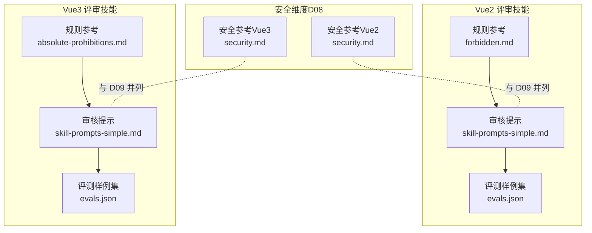
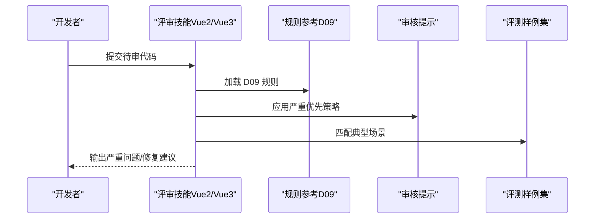
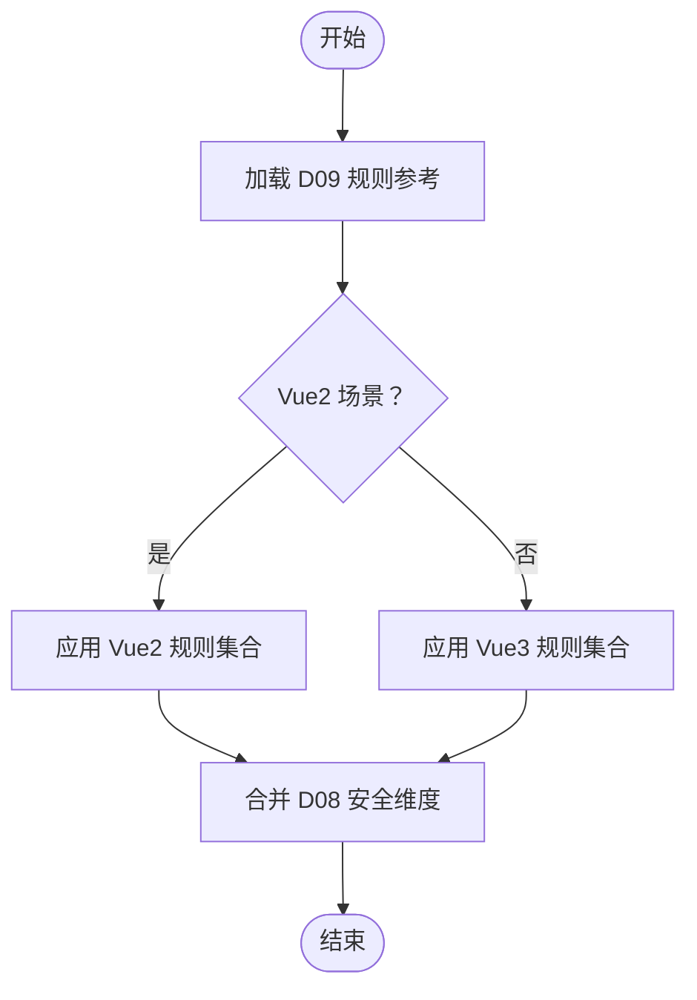
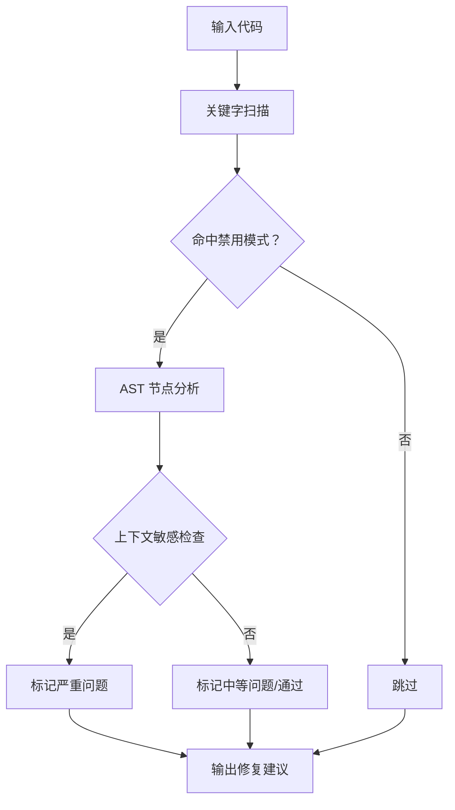
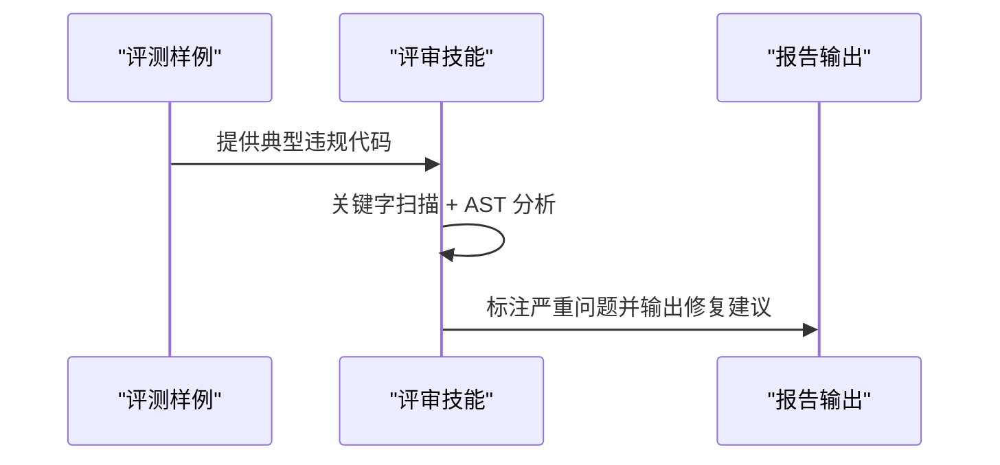
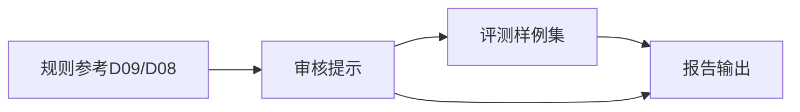

# 绝对禁止项检查

<cite>
**本文引用的文件**
- [绝对禁止项规范（Vue2）](file://skills/yy-frontend-vue2-review/references/forbidden.md)
- [D09·绝对禁止项（Vue3）](file://skills/yy-frontend-vue3-review/references/absolute-prohibitions.md)
- [安全漏洞规范（Vue2）](file://skills/yy-frontend-vue2-review/references/security.md)
- [D08·安全漏洞（Vue3）](file://skills/yy-frontend-vue3-review/references/security.md)
- [Vue2 审核提示（简单版）](file://skills/yy-frontend-vue2-review/prompts/skill-prompts-simple.md)
- [Vue3 审核提示（简单版）](file://skills/yy-frontend-vue3-review/prompts/skill-prompts-simple.md)
- [Vue2 评测样例集](file://skills/yy-frontend-vue2-review/evals.json)
- [Vue3 评测样例集](file://skills/yy-frontend-vue3-review/evals.json)
</cite>

## 目录
1. [引言](#引言)
2. [项目结构](#项目结构)
3. [核心组件](#核心组件)
4. [架构总览](#架构总览)
5. [详细组件分析](#详细组件分析)
6. [依赖关系分析](#依赖关系分析)
7. [性能考量](#性能考量)
8. [故障排查指南](#故障排查指南)
9. [结论](#结论)
10. [附录](#附录)

## 引言
本文件面向“绝对禁止项检查维度（D09）”的技术文档，聚焦于以下禁止行为的识别与治理：连续解构、直接修改 props、eval 函数使用、内联样式硬编码、全局变量滥用、危险 DOM 操作、第三方库安全风险。文档从实现机制、检测技术、示例与修复建议、团队规范制定与代码审查最佳实践等维度展开，帮助研发与评审人员建立统一的安全意识与工程化标准。

## 项目结构
本仓库围绕“技能（skill）”组织前端代码审查与优化能力，其中 D09 维度的规则与提示分别沉淀在 Vue2 与 Vue3 的评审技能中，并配套评测样例与参考规范。关键文件分布如下：
- Vue2 评审技能：规则参考、审核提示、评测样例
- Vue3 评审技能：规则参考、审核提示、评测样例
- 安全维度（D08）：与 D09 并列的高优先级安全检查，补充 XSS 与敏感信息硬编码等风险

图表来源
- [绝对禁止项规范（Vue2）:1-36](file://skills/yy-frontend-vue2-review/references/forbidden.md#L1-L36)
- [D09·绝对禁止项（Vue3）:1-23](file://skills/yy-frontend-vue3-review/references/absolute-prohibitions.md#L1-L23)
- [Vue2 审核提示（简单版）:61-101](file://skills/yy-frontend-vue2-review/prompts/skill-prompts-simple.md#L61-L101)
- [Vue3 审核提示（简单版）:337-341](file://skills/yy-frontend-vue3-review/prompts/skill-prompts-simple.md#L337-L341)
- [Vue2 评测样例集:75-277](file://skills/yy-frontend-vue2-review/evals.json#L75-L277)
- [Vue3 评测样例集:79-162](file://skills/yy-frontend-vue3-review/evals.json#L79-L162)
- [安全漏洞规范（Vue2）:1-32](file://skills/yy-frontend-vue2-review/references/security.md#L1-L32)
- [D08·安全漏洞（Vue3）:1-16](file://skills/yy-frontend-vue3-review/references/security.md#L1-L16)

章节来源
- [绝对禁止项规范（Vue2）:1-36](file://skills/yy-frontend-vue2-review/references/forbidden.md#L1-L36)
- [D09·绝对禁止项（Vue3）:1-23](file://skills/yy-frontend-vue3-review/references/absolute-prohibitions.md#L1-L23)
- [Vue2 审核提示（简单版）:61-101](file://skills/yy-frontend-vue2-review/prompts/skill-prompts-simple.md#L61-L101)
- [Vue3 审核提示（简单版）:337-341](file://skills/yy-frontend-vue3-review/prompts/skill-prompts-simple.md#L337-L341)
- [Vue2 评测样例集:75-277](file://skills/yy-frontend-vue2-review/evals.json#L75-L277)
- [Vue3 评测样例集:79-162](file://skills/yy-frontend-vue3-review/evals.json#L79-L162)
- [安全漏洞规范（Vue2）:1-32](file://skills/yy-frontend-vue2-review/references/security.md#L1-L32)
- [D08·安全漏洞（Vue3）:1-16](file://skills/yy-frontend-vue3-review/references/security.md#L1-L16)

## 核心组件
- 绝对禁止项规则参考（Vue2/Vue3）
  - Vue2：连续解构、修改子组件数据、修改 data 类型、直接修改 props 等
  - Vue3：连续解构、修改子组件数据、修改 ref/reactive 类型、直接修改 props、使用 this、Options API、mixins、多层 try/catch、生命周期 emit、无意义命名、v-for 与 v-if 同元素、index 作为 key 等
- 审核提示与评测样例
  - 提示文件定义了 D09 的严重级别与优先检查策略；评测样例集覆盖“连续解构”等典型场景
- 安全维度（D08）协同
  - 与 D09 并列的高优先级安全检查，涵盖 XSS 风险与敏感信息硬编码

章节来源
- [绝对禁止项规范（Vue2）:9-17](file://skills/yy-frontend-vue2-review/references/forbidden.md#L9-L17)
- [D09·绝对禁止项（Vue3）:7-23](file://skills/yy-frontend-vue3-review/references/absolute-prohibitions.md#L7-L23)
- [Vue2 审核提示（简单版）:94-99](file://skills/yy-frontend-vue2-review/prompts/skill-prompts-simple.md#L94-L99)
- [Vue3 审核提示（简单版）:337-341](file://skills/yy-frontend-vue3-review/prompts/skill-prompts-simple.md#L337-L341)
- [Vue2 评测样例集:108-131](file://skills/yy-frontend-vue2-review/evals.json#L108-L131)
- [Vue3 评测样例集:108-131](file://skills/yy-frontend-vue3-review/evals.json#L108-L131)
- [安全漏洞规范（Vue2）:1-32](file://skills/yy-frontend-vue2-review/references/security.md#L1-L32)
- [D08·安全漏洞（Vue3）:1-16](file://skills/yy-frontend-vue3-review/references/security.md#L1-L16)

## 架构总览
D09 维度的实现由“规则参考 + 审核提示 + 评测样例 + 安全维度协同”构成，整体流程强调“严重优先、即时阻断”。下图展示了从规则到提示再到评测的闭环：

图表来源
- [Vue2 审核提示（简单版）:69-90](file://skills/yy-frontend-vue2-review/prompts/skill-prompts-simple.md#L69-L90)
- [Vue3 审核提示（简单版）:69-90](file://skills/yy-frontend-vue3-review/prompts/skill-prompts-simple.md#L69-L90)
- [Vue2 评测样例集:108-131](file://skills/yy-frontend-vue2-review/evals.json#L108-L131)
- [Vue3 评测样例集:108-131](file://skills/yy-frontend-vue3-review/evals.json#L108-L131)

## 详细组件分析

### 组件一：规则参考与维度映射
- Vue2 绝对禁止项清单（D09）
  - 连续解构、修改子组件数据、修改 data 类型、直接修改 props
- Vue3 绝对禁止项清单（D09）
  - 新增：使用 this、Options API、mixins、多层 try/catch、生命周期 emit、无意义命名、v-for 与 v-if 同元素、index 作为 key、修改 ref/reactive 类型
- 安全维度（D08）
  - XSS 风险、敏感信息硬编码

图表来源
- [绝对禁止项规范（Vue2）:9-17](file://skills/yy-frontend-vue2-review/references/forbidden.md#L9-L17)
- [D09·绝对禁止项（Vue3）:7-23](file://skills/yy-frontend-vue3-review/references/absolute-prohibitions.md#L7-L23)
- [安全漏洞规范（Vue2）:1-32](file://skills/yy-frontend-vue2-review/references/security.md#L1-L32)
- [D08·安全漏洞（Vue3）:1-16](file://skills/yy-frontend-vue3-review/references/security.md#L1-L16)

章节来源
- [绝对禁止项规范（Vue2）:9-17](file://skills/yy-frontend-vue2-review/references/forbidden.md#L9-L17)
- [D09·绝对禁止项（Vue3）:7-23](file://skills/yy-frontend-vue3-review/references/absolute-prohibitions.md#L7-L23)
- [安全漏洞规范（Vue2）:1-32](file://skills/yy-frontend-vue2-review/references/security.md#L1-L32)
- [D08·安全漏洞（Vue3）:1-16](file://skills/yy-frontend-vue3-review/references/security.md#L1-L16)

### 组件二：实现机制与检测技术
- 禁用模式匹配
  - 通过关键词与模式匹配识别典型违规（如连续解构、直接修改 props、使用 this 等）
- 危险操作识别
  - 结合 AST 节点分析与上下文敏感检查，识别 eval、dangerous DOM 操作、第三方库安全风险
- 安全规则验证
  - 与 D08 维度联动，对 v-html、敏感信息硬编码等进行验证

图表来源
- [Vue2 审核提示（简单版）:69-90](file://skills/yy-frontend-vue2-review/prompts/skill-prompts-simple.md#L69-L90)
- [Vue3 审核提示（简单版）:69-90](file://skills/yy-frontend-vue3-review/prompts/skill-prompts-simple.md#L69-L90)
- [Vue2 评测样例集:108-131](file://skills/yy-frontend-vue2-review/evals.json#L108-L131)
- [Vue3 评测样例集:108-131](file://skills/yy-frontend-vue3-review/evals.json#L108-L131)

章节来源
- [Vue2 审核提示（简单版）:69-90](file://skills/yy-frontend-vue2-review/prompts/skill-prompts-simple.md#L69-L90)
- [Vue3 审核提示（简单版）:69-90](file://skills/yy-frontend-vue3-review/prompts/skill-prompts-simple.md#L69-L90)
- [Vue2 评测样例集:108-131](file://skills/yy-frontend-vue2-review/evals.json#L108-L131)
- [Vue3 评测样例集:108-131](file://skills/yy-frontend-vue3-review/evals.json#L108-L131)

### 组件三：评测样例与典型场景
- 连续解构
  - Vue2：错误示例展示深层嵌套解构
  - Vue3：评测样例集中包含“连续解构”专项
- v-html 与 XSS
  - Vue2/Vue3 安全参考均强调 v-html 的 XSS 防范与敏感信息硬编码检查

图表来源
- [Vue2 评测样例集:108-131](file://skills/yy-frontend-vue2-review/evals.json#L108-L131)
- [Vue3 评测样例集:108-131](file://skills/yy-frontend-vue3-review/evals.json#L108-L131)
- [安全漏洞规范（Vue2）:9-21](file://skills/yy-frontend-vue2-review/references/security.md#L9-L21)
- [D08·安全漏洞（Vue3）:7-10](file://skills/yy-frontend-vue3-review/references/security.md#L7-L10)

章节来源
- [Vue2 评测样例集:108-131](file://skills/yy-frontend-vue2-review/evals.json#L108-L131)
- [Vue3 评测样例集:108-131](file://skills/yy-frontend-vue3-review/evals.json#L108-L131)
- [安全漏洞规范（Vue2）:9-21](file://skills/yy-frontend-vue2-review/references/security.md#L9-L21)
- [D08·安全漏洞（Vue3）:7-10](file://skills/yy-frontend-vue3-review/references/security.md#L7-L10)

### 组件四：团队规范制定与最佳实践
- 规范制定要点
  - 将 D09 与 D08 的规则纳入团队代码规范，明确严重级别与优先检查顺序
  - 在评审提示中固化“严重优先、即时阻断”的策略
- 最佳实践建议
  - 采用 AST 工具进行上下文敏感检查，避免误报与漏报
  - 对 eval、dangerous DOM 操作、第三方库引入建立白名单与审计流程
  - 对 v-html、敏感信息硬编码建立自动化扫描与人工复核双保险

章节来源
- [Vue2 审核提示（简单版）:94-99](file://skills/yy-frontend-vue2-review/prompts/skill-prompts-simple.md#L94-L99)
- [Vue3 审核提示（简单版）:94-99](file://skills/yy-frontend-vue3-review/prompts/skill-prompts-simple.md#L94-L99)
- [安全漏洞规范（Vue2）:25-32](file://skills/yy-frontend-vue2-review/references/security.md#L25-L32)
- [D08·安全漏洞（Vue3）:13-16](file://skills/yy-frontend-vue3-review/references/security.md#L13-L16)

## 依赖关系分析
- 维度耦合
  - D09 与 D08 并列高优先级，共同构成“严重问题优先检查”的闭环
- 规则与提示
  - 规则参考为评审技能提供权威依据，提示文件定义检查顺序与优先级
- 评测样例
  - 评测样例集用于验证规则识别与修复建议的有效性

图表来源
- [Vue2 审核提示（简单版）:69-90](file://skills/yy-frontend-vue2-review/prompts/skill-prompts-simple.md#L69-L90)
- [Vue3 审核提示（简单版）:69-90](file://skills/yy-frontend-vue3-review/prompts/skill-prompts-simple.md#L69-L90)
- [Vue2 评测样例集:108-131](file://skills/yy-frontend-vue2-review/evals.json#L108-L131)
- [Vue3 评测样例集:108-131](file://skills/yy-frontend-vue3-review/evals.json#L108-L131)

章节来源
- [Vue2 审核提示（简单版）:69-90](file://skills/yy-frontend-vue2-review/prompts/skill-prompts-simple.md#L69-L90)
- [Vue3 审核提示（简单版）:69-90](file://skills/yy-frontend-vue3-review/prompts/skill-prompts-simple.md#L69-L90)
- [Vue2 评测样例集:108-131](file://skills/yy-frontend-vue2-review/evals.json#L108-L131)
- [Vue3 评测样例集:108-131](file://skills/yy-frontend-vue3-review/evals.json#L108-L131)

## 性能考量
- 关键字扫描与 AST 分析的成本控制
  - 对大文件采用增量扫描与缓存策略，减少重复分析
  - 将高成本的上下文敏感检查限定在命中禁用模式的节点上
- 评测样例集的规模管理
  - 控制典型场景数量，确保评审速度与准确性平衡

## 故障排查指南
- 常见问题
  - 误报：未命中禁用模式却被标记为严重问题
  - 漏报：命中禁用模式但未触发 AST 分析
  - 修复建议不准确：上下文敏感检查不足
- 排查步骤
  - 核对规则参考与提示文件，确认检查顺序与优先级
  - 验证评测样例集中的典型场景是否被正确识别
  - 对疑似误报/漏报的节点进行手动复核与规则细化

章节来源
- [Vue2 审核提示（简单版）:69-90](file://skills/yy-frontend-vue2-review/prompts/skill-prompts-simple.md#L69-L90)
- [Vue3 审核提示（简单版）:69-90](file://skills/yy-frontend-vue3-review/prompts/skill-prompts-simple.md#L69-L90)
- [Vue2 评测样例集:108-131](file://skills/yy-frontend-vue2-review/evals.json#L108-L131)
- [Vue3 评测样例集:108-131](file://skills/yy-frontend-vue3-review/evals.json#L108-L131)

## 结论
D09 绝对禁止项检查通过“规则参考 + 审核提示 + 评测样例 + 安全维度协同”的体系化设计，实现了对连续解构、直接修改 props、eval 使用、内联样式硬编码、全局变量滥用、危险 DOM 操作、第三方库安全风险等高危问题的快速识别与阻断。建议团队将该体系纳入日常评审流程，持续优化规则与提示，提升代码质量与安全性。

## 附录
- 示例与修复建议
  - 连续解构：避免深层嵌套解构，改为分步解构或安全访问
  - 直接修改 props：通过事件向上通信，保持单向数据流
  - eval 使用：替换为安全的替代方案，避免动态执行
  - 内联样式硬编码：使用 CSS 类或主题变量，避免内联样式
  - 全局变量滥用：限制全局作用域污染，使用模块化封装
  - 危险 DOM 操作：避免 innerHTML 等高危 API，使用安全替代
  - 第三方库安全风险：建立白名单与审计流程，定期更新依赖

章节来源
- [绝对禁止项规范（Vue2）:20-35](file://skills/yy-frontend-vue2-review/references/forbidden.md#L20-L35)
- [D09·绝对禁止项（Vue3）:7-23](file://skills/yy-frontend-vue3-review/references/absolute-prohibitions.md#L7-L23)
- [安全漏洞规范（Vue2）:9-21](file://skills/yy-frontend-vue2-review/references/security.md#L9-L21)
- [D08·安全漏洞（Vue3）:7-10](file://skills/yy-frontend-vue3-review/references/security.md#L7-L10)