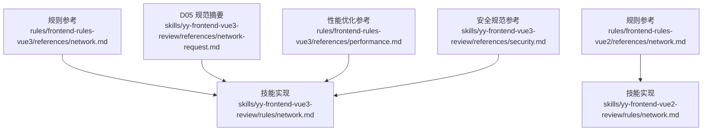
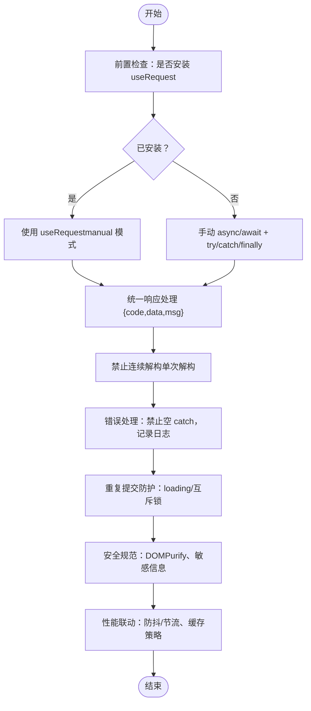
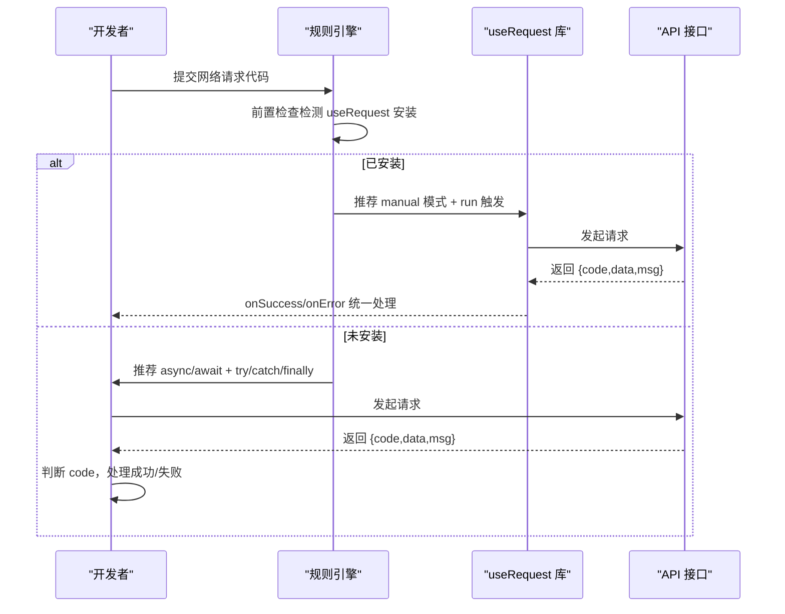
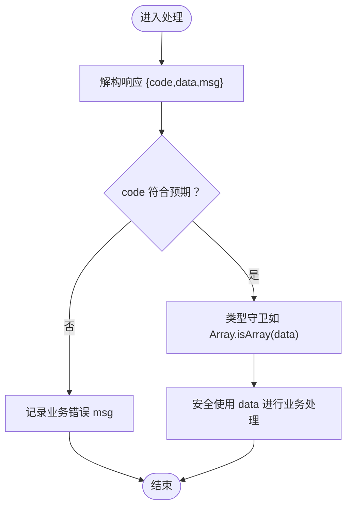
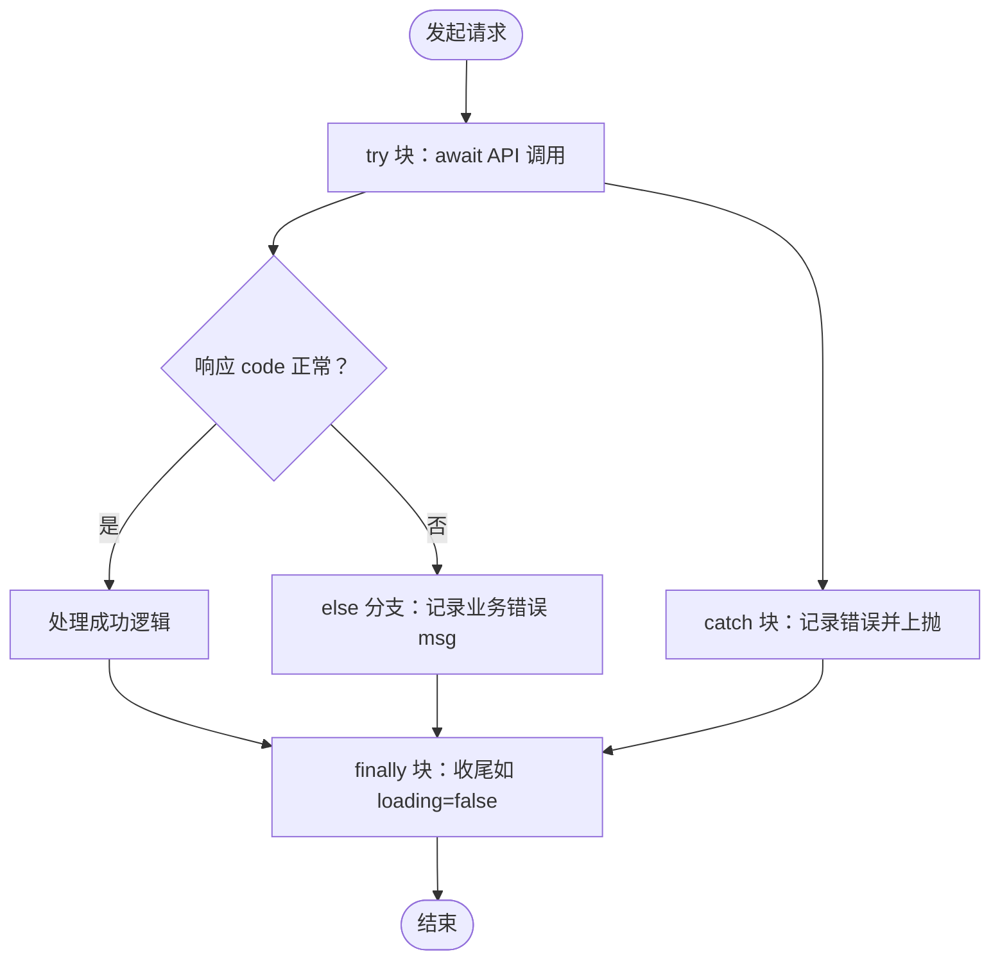
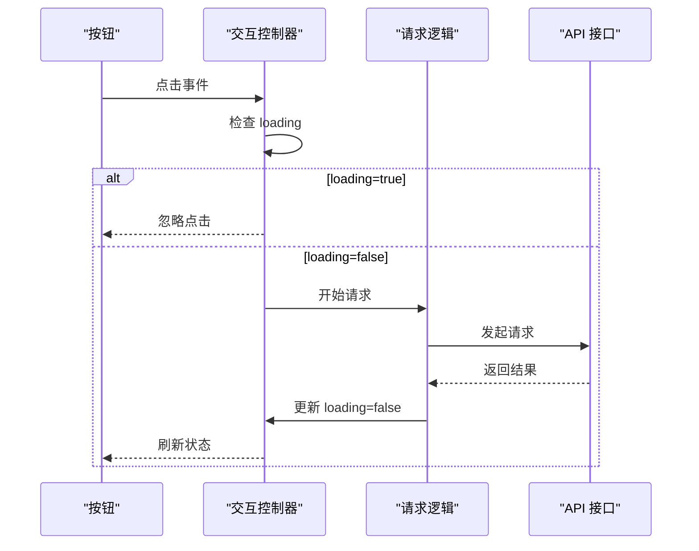
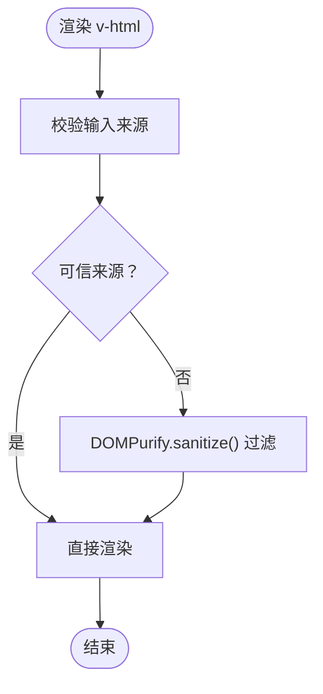
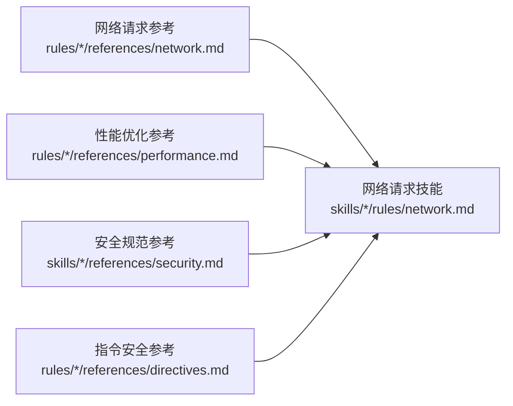

# 网络请求规范检查

<cite>
**本文引用的文件**
- [Vue3 网络请求规范](file://rules/frontend-rules-vue3/references/network.md)
- [Vue2 网络请求规范](file://rules/frontend-rules-vue2/references/network.md)
- [D05 · 网络请求规范](file://skills/yy-frontend-vue3-review/references/network-request.md)
- [Vue3 网络请求规范（技能版）](file://skills/yy-frontend-vue3-review/rules/network.md)
- [Vue2 网络请求规范（技能版）](file://skills/yy-frontend-vue2-review/rules/network.md)
- [Vue3 性能优化规范](file://rules/frontend-rules-vue3/references/performance.md)
- [Vue2 性络请求规范（技能版）](file://skills/yy-frontend-vue2-review/rules/performance.md)
- [Vue3 性能优化规范（技能版）](file://skills/yy-frontend-vue3-review/rules/performance.md)
- [Vue2 性能优化规范（技能版）](file://skills/yy-frontend-vue2-code-optimization/rules/performance.md)
- [Vue3 指令规范](file://rules/frontend-rules-vue3/references/directives.md)
- [Vue3 指令规范（技能版）](file://skills/yy-frontend-vue3-review/rules/directives.md)
- [Vue2 模板指令规范（技能版）](file://skills/yy-frontend-vue2-review/rules/directives.md)
- [Vue2 模板指令规范](file://rules/frontend-rules-vue2/references/directives.md)
- [D08 · 安全漏洞](file://skills/yy-frontend-vue3-review/references/security.md)
- [安全漏洞规范（技能版）](file://skills/yy-frontend-vue2-review/references/security.md)
- [API 调用规范（内容模板）](file://skills/yy-create-rule/resources/content-template.md)
- [yy-frontend-vue3-code-optimization 技能提示](file://skills/yy-frontend-vue3-code-optimization/prompts/skill-prompts.md)
</cite>

## 目录
1. [简介](#简介)
2. [项目结构](#项目结构)
3. [核心组件](#核心组件)
4. [架构总览](#架构总览)
5. [详细组件分析](#详细组件分析)
6. [依赖关系分析](#依赖关系分析)
7. [性能考量](#性能考量)
8. [故障排查指南](#故障排查指南)
9. [结论](#结论)
10. [附录](#附录)

## 简介
本文件围绕 D05 维度“网络请求规范”构建系统化技术文档，覆盖 async/await 使用规范、Promise 链式调用限制、统一响应处理、错误处理机制、重复提交防护、请求写法示例、安全规范与最佳实践。同时给出实现机制与检查要点，帮助开发者在 Vue2/Vue3 项目中建立一致、可靠且安全的网络请求体系。

## 项目结构
该仓库将“网络请求规范”沉淀在两类位置：
- 规则参考文档：位于 rules/frontend-rules-vue2 与 rules/frontend-rules-vue3 下的 references/network.md
- 技能实现文档：位于 skills/yy-frontend-vue3-review 与 skills/yy-frontend-vue2-review 下的 rules/network.md 与 references/network-request.md

此外，性能优化与安全规范分别在对应目录下提供参考与技能版规则，便于在检查时联动评估。

图表来源
- [Vue3 网络请求规范](file://rules/frontend-rules-vue3/references/network.md)
- [Vue2 网络请求规范](file://rules/frontend-rules-vue2/references/network.md)
- [D05 · 网络请求规范](file://skills/yy-frontend-vue3-review/references/network-request.md)
- [Vue3 网络请求规范（技能版）](file://skills/yy-frontend-vue3-review/rules/network.md)
- [Vue3 性能优化规范](file://rules/frontend-rules-vue3/references/performance.md)
- [D08 · 安全漏洞](file://skills/yy-frontend-vue3-review/references/security.md)

章节来源
- [Vue3 网络请求规范](file://rules/frontend-rules-vue3/references/network.md)
- [Vue2 网络请求规范](file://rules/frontend-rules-vue2/references/network.md)
- [D05 · 网络请求规范](file://skills/yy-frontend-vue3-review/references/network-request.md)
- [Vue3 网络请求规范（技能版）](file://skills/yy-frontend-vue3-review/rules/network.md)
- [Vue3 性能优化规范](file://rules/frontend-rules-vue3/references/performance.md)
- [D08 · 安全漏洞](file://skills/yy-frontend-vue3-review/references/security.md)

## 核心组件
- 异步处理与 Promise 链式调用
  - 必须使用 async/await，禁止 .then() 链式调用
  - 未使用 useRequest 时，统一使用 try/catch/finally 结构
- 统一响应处理
  - 统一响应模式 { code, data, msg } 解构处理
  - 禁止连续解构（如 ...data.data），仅允许单次解构
- 错误处理机制
  - 禁止空 catch；捕获错误后必须记录
  - 业务错误在 else 分支中 console.warn 记录
- 重复提交防护
  - 使用 loading 状态禁用按钮，或互斥锁
  - useRequest 的 loading 自动控制
- 请求写法示例
  - 已安装 useRequest：manual 模式，run 触发，onSuccess/onError 统一处理
  - 未安装 useRequest：手动 async/await + try/catch/finally
- 安全规范
  - v-html 必须使用 DOMPurify 过滤
  - 敏感数据不得出现在 URL 或 console.log 中
  - 全局错误捕获建议配置 errorHandler 并结合 Sentry 上报

章节来源
- [Vue3 网络请求规范](file://rules/frontend-rules-vue3/references/network.md)
- [Vue2 网络请求规范](file://rules/frontend-rules-vue2/references/network.md)
- [D05 · 网络请求规范](file://skills/yy-frontend-vue3-review/references/network-request.md)
- [Vue3 网络请求规范（技能版）](file://skills/yy-frontend-vue3-review/rules/network.md)
- [D08 · 安全漏洞](file://skills/yy-frontend-vue3-review/references/security.md)

## 架构总览
网络请求规范检查的实现机制可抽象为“前置检查 + 语法与语义校验 + 安全与性能联动评估”的流水线：

图表来源
- [Vue3 网络请求规范](file://rules/frontend-rules-vue3/references/network.md)
- [Vue3 网络请求规范（技能版）](file://skills/yy-frontend-vue3-review/rules/network.md)
- [Vue3 性能优化规范](file://rules/frontend-rules-vue3/references/performance.md)
- [D08 · 安全漏洞](file://skills/yy-frontend-vue3-review/references/security.md)

## 详细组件分析

### 组件一：异步处理与 Promise 链式调用
- 原则
  - 必须使用 async/await，禁止 .then() 链式调用
  - 未使用 useRequest 时，统一使用 try/catch/finally 结构
- 优化对比
  - 将 Promise 链式调用转换为 async/await + try/catch/finally，finally 中统一收尾 loading
- 实现要点
  - 在技能提示中强调“前置检查项目是否安装 ahooks-vue 或 vue-hooks-plus”，并给出 manual 模式与统一响应模式示例

图表来源
- [Vue3 网络请求规范（技能版）](file://skills/yy-frontend-vue3-review/rules/network.md)
- [yy-frontend-vue3-code-optimization 技能提示](file://skills/yy-frontend-vue3-code-optimization/prompts/skill-prompts.md)

章节来源
- [Vue3 网络请求规范](file://rules/frontend-rules-vue3/references/network.md)
- [Vue3 网络请求规范（技能版）](file://skills/yy-frontend-vue3-review/rules/network.md)
- [yy-frontend-vue3-code-optimization 技能提示](file://skills/yy-frontend-vue3-code-optimization/prompts/skill-prompts.md)

### 组件二：统一响应处理与参数验证
- 统一响应模式
  - 使用 { code, data, msg } 解构，先判断 code 再使用 data
  - 禁止连续解构（如 ...data.data），仅允许单次解构
- 参数验证
  - 对返回值进行类型守卫（如 Array.isArray），确保后续使用安全
- 实现要点
  - 规则示例中明确“先判断成功后使用数据”的处理流程

图表来源
- [Vue3 网络请求规范](file://rules/frontend-rules-vue3/references/network.md)
- [Vue2 网络请求规范](file://rules/frontend-rules-vue2/references/network.md)

章节来源
- [Vue3 网络请求规范](file://rules/frontend-rules-vue3/references/network.md)
- [Vue2 网络请求规范](file://rules/frontend-rules-vue2/references/network.md)

### 组件三：错误处理机制与返回值检查
- 错误处理
  - 禁止空 catch；捕获错误后必须记录（console.warn）
  - 业务错误在 else 分支中记录（console.warn）
- 返回值检查
  - 统一响应模式下，先判断 code，再访问 data
  - 对于预期内的错误，可在处理后返回默认值
- 实现要点
  - 技能提示中给出“统一错误处理”的示例与注意事项

图表来源
- [Vue3 网络请求规范](file://rules/frontend-rules-vue3/references/network.md)
- [API 调用规范（内容模板）](file://skills/yy-create-rule/resources/content-template.md)

章节来源
- [Vue3 网络请求规范](file://rules/frontend-rules-vue3/references/network.md)
- [API 调用规范（内容模板）](file://skills/yy-create-rule/resources/content-template.md)

### 组件四：重复提交防护与互斥锁
- useRequest 方式
  - loading 自动控制，按钮直接 :disabled="loading"
- 互斥锁方式（未安装 useRequest）
  - 使用 ref(false) 标记 loading，请求期间置为 true，finally 中置为 false
- 实现要点
  - 规则示例中明确“防重复提交”的两种实现路径与模板绑定

图表来源
- [Vue3 网络请求规范（技能版）](file://skills/yy-frontend-vue3-review/rules/network.md)
- [Vue2 网络请求规范（技能版）](file://skills/yy-frontend-vue2-review/rules/network.md)

章节来源
- [Vue3 网络请求规范（技能版）](file://skills/yy-frontend-vue3-review/rules/network.md)
- [Vue2 网络请求规范（技能版）](file://skills/yy-frontend-vue2-review/rules/network.md)

### 组件五：安全规范与最佳实践
- v-html 安全
  - 使用 DOMPurify.sanitize() 过滤 HTML，避免 XSS
- 敏感信息
  - 不在 URL 传递 token/密码；不在 console.log 输出用户凭证
- 全局错误捕获
  - 建议配置 app.config.errorHandler，并结合 Sentry 上报
- 实现要点
  - D08 维度的安全规范与网络请求规则相互补充

图表来源
- [D08 · 安全漏洞](file://skills/yy-frontend-vue3-review/references/security.md)
- [Vue3 指令规范](file://rules/frontend-rules-vue3/references/directives.md)

章节来源
- [D08 · 安全漏洞](file://skills/yy-frontend-vue3-review/references/security.md)
- [Vue3 指令规范](file://rules/frontend-rules-vue3/references/directives.md)

## 依赖关系分析
- 规则参考与技能实现的耦合
  - rules 下的参考文档为通用规范，skills 下的规则文档面向具体实现与示例
- 与性能、安全的协作
  - 网络请求规范与性能优化（防抖/节流、缓存）和安全规范（DOMPurify、敏感信息）共同构成完整的前端质量保障体系

图表来源
- [Vue3 网络请求规范](file://rules/frontend-rules-vue3/references/network.md)
- [Vue3 性能优化规范](file://rules/frontend-rules-vue3/references/performance.md)
- [D08 · 安全漏洞](file://skills/yy-frontend-vue3-review/references/security.md)
- [Vue3 指令规范](file://rules/frontend-rules-vue3/references/directives.md)

章节来源
- [Vue3 网络请求规范](file://rules/frontend-rules-vue3/references/network.md)
- [Vue3 性能优化规范](file://rules/frontend-rules-vue3/references/performance.md)
- [D08 · 安全漏洞](file://skills/yy-frontend-vue3-review/references/security.md)
- [Vue3 指令规范](file://rules/frontend-rules-vue3/references/directives.md)

## 性能考量
- 防抖与节流
  - 搜索输入使用防抖（如 300ms），滚动/resize 使用节流，按钮点击使用防抖/互斥锁
- 组件懒加载与缓存
  - 大组件使用动态导入，路由页面惰性加载；合理使用 KeepAlive 控制缓存范围
- 虚拟滚动
  - 长列表使用虚拟滚动，仅渲染可视区域元素
- 与网络请求的协同
  - 在高频交互场景下，结合防抖/节流与 loading 状态，避免不必要的请求与重复提交

章节来源
- [Vue3 性能优化规范](file://rules/frontend-rules-vue3/references/performance.md)
- [Vue2 性能优化规范（技能版）](file://skills/yy-frontend-vue2-code-optimization/rules/performance.md)
- [Vue3 性能优化规范（技能版）](file://skills/yy-frontend-vue3-review/rules/performance.md)
- [Vue2 性能优化规范（技能版）](file://skills/yy-frontend-vue2-review/rules/performance.md)

## 故障排查指南
- 常见问题定位
  - Promise 链式调用未替换为 async/await
  - 空 catch 导致错误被静默忽略
  - 连续解构导致运行时访问异常
  - 未先判断 code 就使用 data，引发类型错误
  - 未禁用按钮导致重复提交
  - v-html 未过滤导致 XSS 风险
- 排查步骤
  - 前置检查：确认是否安装 useRequest，优先使用 manual 模式
  - 语法检查：确保使用 try/catch/finally，无空 catch
  - 语义检查：统一响应模式、单次解构、先判后用
  - 安全检查：v-html 过滤、敏感信息不出现在 URL/日志
  - 性能检查：高频交互是否使用防抖/节流，loading 状态是否正确

章节来源
- [Vue3 网络请求规范](file://rules/frontend-rules-vue3/references/network.md)
- [Vue2 网络请求规范](file://rules/frontend-rules-vue2/references/network.md)
- [D08 · 安全漏洞](file://skills/yy-frontend-vue3-review/references/security.md)

## 结论
D05 维度的网络请求规范以“一致性、安全性、可维护性”为核心目标，通过 useRequest 的自动化与手动 async/await 的规范化组合，辅以统一响应处理、错误处理、重复提交防护与安全规范，形成闭环的质量保障。结合性能优化策略，可在保证用户体验的同时提升系统的稳定性与可扩展性。

## 附录
- 示例与最佳实践
  - 已安装 useRequest：manual 模式 + run 触发 + onSuccess/onError 统一处理
  - 未安装 useRequest：async/await + try/catch/finally + loading 状态管理
  - v-html：DOMPurify 过滤
  - 高频交互：防抖/节流 + loading 状态
- 风险提示
  - 原代码可能使用不同响应结构与错误处理
  - async/await 改变执行时机，转换前必须展示 diff 预览并获用户确认

章节来源
- [Vue3 网络请求规范（技能版）](file://skills/yy-frontend-vue3-review/rules/network.md)
- [Vue2 网络请求规范（技能版）](file://skills/yy-frontend-vue2-review/rules/network.md)
- [D05 · 网络请求规范](file://skills/yy-frontend-vue3-review/references/network-request.md)
- [D08 · 安全漏洞](file://skills/yy-frontend-vue3-review/references/security.md)