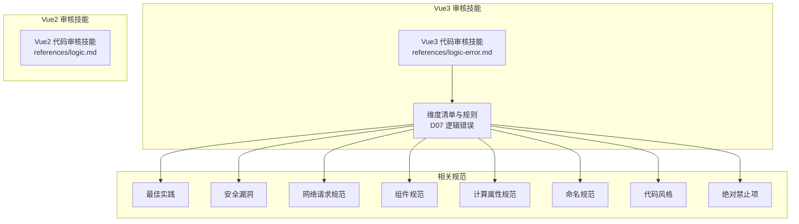
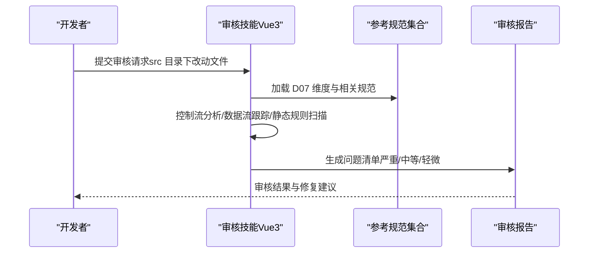
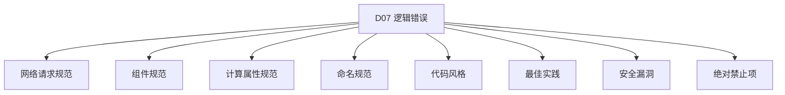

# 逻辑错误检查

<cite>
**本文引用的文件**
- [逻辑错误（Vue3）](file://skills/yy-frontend-vue3-review/references/logic-error.md)
- [Vue3 代码审核技能](file://skills/yy-frontend-vue3-review/SKILL.md)
- [Vue2 代码审核技能](file://skills/yy-frontend-vue2-review/SKILL.md)
- [最佳实践](file://skills/yy-frontend-vue3-review/references/best-practice.md)
- [安全漏洞](file://skills/yy-frontend-vue3-review/references/security.md)
- [网络请求规范](file://skills/yy-frontend-vue3-review/references/network-request.md)
- [组件规范](file://skills/yy-frontend-vue3-review/references/component.md)
- [计算属性规范](file://skills/yy-frontend-vue3-review/references/computed.md)
- [命名规范](file://skills/yy-frontend-vue3-review/references/naming.md)
- [代码风格](file://skills/yy-frontend-vue3-review/references/code-style.md)
- [绝对禁止项](file://skills/yy-frontend-vue3-review/references/absolute-prohibitions.md)
</cite>

## 目录
1. [简介](#简介)
2. [项目结构](#项目结构)
3. [核心组件](#核心组件)
4. [架构总览](#架构总览)
5. [详细组件分析](#详细组件分析)
6. [依赖关系分析](#依赖关系分析)
7. [性能考虑](#性能考虑)
8. [故障排查指南](#故障排查指南)
9. [结论](#结论)
10. [附录](#附录)

## 简介
本技术文档围绕“逻辑错误检查”维度（D07）展开，系统阐述在 Vue3 前端代码审核体系中的逻辑错误识别与治理策略。该维度聚焦以下关键问题：
- 空指针访问检测
- 数组越界访问
- 条件判断遗漏
- 循环逻辑错误
- 分支覆盖不足
- 数据类型不匹配
- 边界条件处理

同时，文档结合仓库现有规范，给出实现机制、静态分析思路、常见错误模式与修复建议，并提供单元测试与集成测试的最佳实践指导，帮助团队建立可持续的质量保障体系。

## 项目结构
本仓库将“逻辑错误检查”作为独立维度纳入 Vue3/Vue2 代码审核技能中，分别由对应的 SKILL.md 与 references 目录下的规范文件支撑。Vue3 的 D07 维度在技能清单中被列为“严重”级别，强调其对系统稳定性与可维护性的直接影响。

图表来源
- [Vue3 代码审核技能](file://skills/yy-frontend-vue3-review/SKILL.md)
- [逻辑错误（Vue3）](file://skills/yy-frontend-vue3-review/references/logic-error.md)
- [最佳实践](file://skills/yy-frontend-vue3-review/references/best-practice.md)
- [安全漏洞](file://skills/yy-frontend-vue3-review/references/security.md)
- [网络请求规范](file://skills/yy-frontend-vue3-review/references/network-request.md)
- [组件规范](file://skills/yy-frontend-vue3-review/references/component.md)
- [计算属性规范](file://skills/yy-frontend-vue3-review/references/computed.md)
- [命名规范](file://skills/yy-frontend-vue3-review/references/naming.md)
- [代码风格](file://skills/yy-frontend-vue3-review/references/code-style.md)
- [绝对禁止项](file://skills/yy-frontend-vue3-review/references/absolute-prohibitions.md)

章节来源
- [Vue3 代码审核技能](file://skills/yy-frontend-vue3-review/SKILL.md)
- [Vue2 代码审核技能](file://skills/yy-frontend-vue2-review/SKILL.md)

## 核心组件
- 审核维度与严重等级
  - D07（逻辑错误）在 Vue3 审核中被标记为“严重”，发现即不通过，必须修复。
- 检查要点
  - 空指针访问：未判空的属性访问。
  - 数组越界：未校验长度的数组索引访问。
  - 逻辑判断：条件判断逻辑是否正确。
  - 方法内部顺序：初始化、网络请求、事件处理、特殊计算的顺序规范。
  - ref 访问：必须使用 .value。
- 关联规范
  - 网络请求规范、组件规范、计算属性规范、命名规范、代码风格、最佳实践、安全漏洞、绝对禁止项等共同构成逻辑错误检查的上下文与约束。

章节来源
- [Vue3 代码审核技能](file://skills/yy-frontend-vue3-review/SKILL.md)
- [逻辑错误（Vue3）](file://skills/yy-frontend-vue3-review/references/logic-error.md)
- [网络请求规范](file://skills/yy-frontend-vue3-review/references/network-request.md)
- [组件规范](file://skills/yy-frontend-vue3-review/references/component.md)
- [计算属性规范](file://skills/yy-frontend-vue3-review/references/computed.md)
- [命名规范](file://skills/yy-frontend-vue3-review/references/naming.md)
- [代码风格](file://skills/yy-frontend-vue3-review/references/code-style.md)
- [最佳实践](file://skills/yy-frontend-vue3-review/references/best-practice.md)
- [安全漏洞](file://skills/yy-frontend-vue3-review/references/security.md)
- [绝对禁止项](file://skills/yy-frontend-vue3-review/references/absolute-prohibitions.md)

## 架构总览
逻辑错误检查在审核流水线中的位置如下：

图表来源
- [Vue3 代码审核技能](file://skills/yy-frontend-vue3-review/SKILL.md)
- [逻辑错误（Vue3）](file://skills/yy-frontend-vue3-review/references/logic-error.md)

## 详细组件分析

### 空指针访问检测
- 规则要点
  - 未判空的属性访问属于严重问题，必须修复。
- 实现机制（静态分析思路）
  - 控制流分析：识别属性访问点与其上游赋值路径，判断是否存在 null/undefined 分支。
  - 数据流跟踪：从变量定义到使用点，追踪可能的空值传播。
  - 符号执行与路径探索：对条件分支进行路径探索，验证空值分支是否可达且未处理。
- 常见错误模式
  - 直接访问深层对象属性而不做判空。
  - 从 API 返回的数据未校验结构即使用。
- 修复建议
  - 在访问前进行显式判空，必要时提供安全回退值。
  - 使用防御式编程，对外部输入与异步数据进行结构校验。
- 预防性编程建议
  - 统一使用类型约束，避免 any/unknown 的滥用。
  - 在网络请求后采用统一响应处理模式，确保错误分支被覆盖。
- 测试建议
  - 单元测试：构造空值/未定义输入，验证判空逻辑与回退行为。
  - 集成测试：模拟 API 返回异常或缺失字段，验证 UI 与交互的健壮性。

章节来源
- [逻辑错误（Vue3）](file://skills/yy-frontend-vue3-review/references/logic-error.md)
- [网络请求规范](file://skills/yy-frontend-vue3-review/references/network-request.md)
- [计算属性规范](file://skills/yy-frontend-vue3-review/references/computed.md)
- [命名规范](file://skills/yy-frontend-vue3-review/references/naming.md)
- [代码风格](file://skills/yy-frontend-vue3-review/references/code-style.md)
- [最佳实践](file://skills/yy-frontend-vue3-review/references/best-practice.md)

### 数组越界访问
- 规则要点
  - 未校验长度的数组索引访问属于严重问题，必须修复。
- 实现机制（静态分析思路）
  - 控制流分析：定位数组索引表达式，识别索引来源（常量、变量、函数调用）。
  - 数据流跟踪：追踪索引变量的取值范围，判断是否可能超出数组长度。
  - 边界条件处理：检查 length/size 的使用与比较逻辑，确保边界覆盖。
- 常见错误模式
  - 使用固定索引访问数组，未考虑数组为空或长度变化。
  - 在循环中使用错误的边界条件（如 i <= arr.length）。
- 修复建议
  - 在访问前检查数组长度与索引范围，必要时使用安全访问工具函数。
  - 使用现代 API（如 at）或防御式访问，避免直接越界。
- 预防性编程建议
  - 对外部输入的数组进行长度校验与类型约束。
  - 在循环中使用正确的边界条件，避免 off-by-one 错误。
- 测试建议
  - 单元测试：覆盖空数组、单元素数组、越界索引等边界场景。
  - 集成测试：模拟动态数据更新，验证数组长度变化对索引的影响。

章节来源
- [逻辑错误（Vue3）](file://skills/yy-frontend-vue3-review/references/logic-error.md)
- [组件规范](file://skills/yy-frontend-vue3-review/references/component.md)
- [命名规范](file://skills/yy-frontend-vue3-review/references/naming.md)
- [代码风格](file://skills/yy-frontend-vue3-review/references/code-style.md)

### 条件判断遗漏
- 规则要点
  - 条件判断逻辑不完整属于严重问题，必须修复。
- 实现机制（静态分析思路）
  - 控制流分析：构建分支图，识别未覆盖的分支路径。
  - 数据流跟踪：追踪条件变量的取值来源，判断是否存在未处理的取值。
  - 分支覆盖不足：通过覆盖率指标评估分支覆盖度，识别遗漏路径。
- 常见错误模式
  - 忽略 false/空字符串/0 等“假值”的分支。
  - 使用不严谨的比较运算符（如 ==）导致逻辑偏差。
- 修复建议
  - 明确所有分支条件，补充兜底逻辑与默认行为。
  - 使用严格相等（===）与显式比较，避免隐式转换带来的歧义。
- 预防性编程建议
  - 在网络请求与异步逻辑中，统一处理成功/失败/异常分支。
  - 对布尔值与枚举值进行显式校验，避免默认分支。
- 测试建议
  - 单元测试：针对每个分支编写用例，确保所有路径被覆盖。
  - 集成测试：模拟真实业务场景，验证条件判断在不同输入下的行为。

章节来源
- [逻辑错误（Vue3）](file://skills/yy-frontend-vue3-review/references/logic-error.md)
- [网络请求规范](file://skills/yy-frontend-vue3-review/references/network-request.md)
- [代码风格](file://skills/yy-frontend-vue3-review/references/code-style.md)
- [最佳实践](file://skills/yy-frontend-vue3-review/references/best-practice.md)

### 循环逻辑错误
- 规则要点
  - 循环逻辑错误属于严重问题，必须修复。
- 实现机制（静态分析思路）
  - 控制流分析：识别循环体、循环条件与迭代变量更新。
  - 数据流跟踪：追踪迭代变量的变化，判断是否存在死循环或跳步。
  - 边界条件处理：检查循环起止条件与步长，确保收敛性。
- 常见错误模式
  - 死循环：条件永不为假或更新语句缺失。
  - 跳步：步长方向与边界不一致，导致遗漏或重复处理。
- 修复建议
  - 明确循环终止条件与更新逻辑，确保每轮迭代都有进展。
  - 使用安全的遍历方式（如 forEach/for...of），避免手写索引循环。
- 预防性编程建议
  - 对数组/集合进行安全遍历，避免直接操作索引。
  - 在复杂循环中引入断言与日志，便于定位问题。
- 测试建议
  - 单元测试：覆盖空集合、单元素集合、大集合等场景。
  - 集成测试：模拟动态数据变化，验证循环在运行时的行为。

章节来源
- [逻辑错误（Vue3）](file://skills/yy-frontend-vue3-review/references/logic-error.md)
- [组件规范](file://skills/yy-frontend-vue3-review/references/component.md)
- [命名规范](file://skills/yy-frontend-vue3-review/references/naming.md)
- [代码风格](file://skills/yy-frontend-vue3-review/references/code-style.md)

### 分支覆盖不足
- 规则要点
  - 分支覆盖不足属于严重问题，必须修复。
- 实现机制（静态分析思路）
  - 控制流分析：构建决策图，识别所有分支节点。
  - 数据流跟踪：追踪条件变量的取值范围，评估覆盖度。
  - 路径探索：通过符号执行探索所有可达路径，识别未覆盖分支。
- 常见错误模式
  - 忽略异常/错误分支，仅关注正常路径。
  - 使用短路运算符导致部分分支未被执行。
- 修复建议
  - 为每个分支补充测试用例，确保覆盖率达标。
  - 使用断言与日志记录关键分支的执行路径。
- 预防性编程建议
  - 在网络请求与异步逻辑中，统一处理异常与错误分支。
  - 对输入进行边界与类型校验，减少不可预测的分支。
- 测试建议
  - 单元测试：使用覆盖率工具评估分支覆盖度，补齐缺失用例。
  - 集成测试：模拟异常输入与边界输入，验证分支处理逻辑。

章节来源
- [逻辑错误（Vue3）](file://skills/yy-frontend-vue3-review/references/logic-error.md)
- [网络请求规范](file://skills/yy-frontend-vue3-review/references/network-request.md)
- [最佳实践](file://skills/yy-frontend-vue3-review/references/best-practice.md)

### 数据类型不匹配
- 规则要点
  - 数据类型不匹配属于严重问题，必须修复。
- 实现机制（静态分析思路）
  - 控制流分析：识别类型转换与运算点。
  - 数据流跟踪：追踪变量的类型来源，判断是否存在隐式转换。
  - 类型约束：在 TypeScript 中强制使用明确类型，避免 any/unknown。
- 常见错误模式
  - 使用 == 导致类型隐式转换。
  - 将字符串与数字进行运算或比较。
- 修复建议
  - 使用严格相等（===）与显式类型转换。
  - 在函数参数与返回值处明确类型约束，避免 any。
- 预防性编程建议
  - 在 Vue3 项目中，遵循命名规范与代码风格，统一类型使用。
  - 对外部数据进行结构校验与类型断言。
- 测试建议
  - 单元测试：构造不同类型输入，验证类型转换与比较逻辑。
  - 集成测试：模拟 API 返回不同类型的字段，验证 UI 与交互的健壮性。

章节来源
- [逻辑错误（Vue3）](file://skills/yy-frontend-vue3-review/references/logic-error.md)
- [命名规范](file://skills/yy-frontend-vue3-review/references/naming.md)
- [代码风格](file://skills/yy-frontend-vue3-review/references/code-style.md)
- [最佳实践](file://skills/yy-frontend-vue3-review/references/best-practice.md)

### 边界条件处理
- 规则要点
  - 边界条件处理不当属于严重问题，必须修复。
- 实现机制（静态分析思路）
  - 控制流分析：识别边界点（0、-1、最大值、最小值、空集合）。
  - 数据流跟踪：追踪边界变量的取值变化，判断是否覆盖所有边界。
  - 路径探索：对边界附近的分支进行符号执行，验证处理逻辑。
- 常见错误模式
  - 忽略空值、零值、负数等边界。
  - 数组/字符串索引越界或长度为 0 的场景。
- 修复建议
  - 在边界点增加显式判断与处理逻辑。
  - 使用防御式编程，对外部输入进行边界校验。
- 预防性编程建议
  - 在网络请求与异步逻辑中，统一处理边界输入与异常分支。
  - 对数组/集合进行长度校验，避免直接访问。
- 测试建议
  - 单元测试：覆盖边界输入与异常输入，验证处理逻辑。
  - 集成测试：模拟真实业务场景，验证边界条件下的行为。

章节来源
- [逻辑错误（Vue3）](file://skills/yy-frontend-vue3-review/references/logic-error.md)
- [网络请求规范](file://skills/yy-frontend-vue3-review/references/network-request.md)
- [组件规范](file://skills/yy-frontend-vue3-review/references/component.md)
- [最佳实践](file://skills/yy-frontend-vue3-review/references/best-practice.md)

## 依赖关系分析
逻辑错误检查与其他维度与规范存在强关联，形成“规则-实现-反馈”的闭环。

图表来源
- [Vue3 代码审核技能](file://skills/yy-frontend-vue3-review/SKILL.md)
- [逻辑错误（Vue3）](file://skills/yy-frontend-vue3-review/references/logic-error.md)
- [网络请求规范](file://skills/yy-frontend-vue3-review/references/network-request.md)
- [组件规范](file://skills/yy-frontend-vue3-review/references/component.md)
- [计算属性规范](file://skills/yy-frontend-vue3-review/references/computed.md)
- [命名规范](file://skills/yy-frontend-vue3-review/references/naming.md)
- [代码风格](file://skills/yy-frontend-vue3-review/references/code-style.md)
- [最佳实践](file://skills/yy-frontend-vue3-review/references/best-practice.md)
- [安全漏洞](file://skills/yy-frontend-vue3-review/references/security.md)
- [绝对禁止项](file://skills/yy-frontend-vue3-review/references/absolute-prohibitions.md)

章节来源
- [Vue3 代码审核技能](file://skills/yy-frontend-vue3-review/SKILL.md)
- [逻辑错误（Vue3）](file://skills/yy-frontend-vue3-review/references/logic-error.md)

## 性能考虑
- 静态分析成本控制
  - 优先对热点路径与关键模块进行深度分析，降低整体扫描时间。
  - 使用增量分析与缓存机制，避免重复扫描未变更文件。
- 覆盖率与效率平衡
  - 在保证覆盖率的前提下，优化测试用例设计，减少冗余执行。
- 工具链集成
  - 将逻辑错误检查融入 CI/CD 流水线，尽早发现问题，降低修复成本。

## 故障排查指南
- 常见问题定位
  - 空指针：通过属性访问点回溯赋值路径，确认 null/undefined 的来源。
  - 数组越界：检查索引表达式与数组长度，定位越界发生的具体位置。
  - 条件遗漏：分析分支图，识别未覆盖的条件分支。
  - 循环错误：检查循环终止条件与迭代变量更新，确认收敛性。
  - 类型不匹配：追踪类型转换点，确认隐式转换是否符合预期。
  - 边界处理：针对边界输入进行专项测试，验证处理逻辑。
- 修复优先级
  - 优先修复“严重”问题，再处理“中等”和“轻微”问题。
  - 在修复后重新运行审核与测试，确保问题不再出现。

章节来源
- [逻辑错误（Vue3）](file://skills/yy-frontend-vue3-review/references/logic-error.md)
- [网络请求规范](file://skills/yy-frontend-vue3-review/references/network-request.md)
- [组件规范](file://skills/yy-frontend-vue3-review/references/component.md)
- [计算属性规范](file://skills/yy-frontend-vue3-review/references/computed.md)
- [命名规范](file://skills/yy-frontend-vue3-review/references/naming.md)
- [代码风格](file://skills/yy-frontend-vue3-review/references/code-style.md)
- [最佳实践](file://skills/yy-frontend-vue3-review/references/best-practice.md)
- [安全漏洞](file://skills/yy-frontend-vue3-review/references/security.md)
- [绝对禁止项](file://skills/yy-frontend-vue3-review/references/absolute-prohibitions.md)

## 结论
逻辑错误检查是保障 Vue3 项目质量的关键环节。通过将 D07 维度纳入审核体系，并结合网络请求、组件、计算属性、命名、代码风格、最佳实践、安全与禁止项等规范，能够系统性地识别与修复空指针、数组越界、条件遗漏、循环错误、分支覆盖不足、类型不匹配与边界处理不当等问题。建议团队在日常开发中严格执行这些规范，并配合完善的单元与集成测试，持续提升代码的可靠性与可维护性。

## 附录
- 单元测试最佳实践
  - 针对每个分支与边界场景编写用例，确保覆盖率达标。
  - 使用断言验证关键逻辑路径，记录执行日志以便排查。
- 集成测试最佳实践
  - 模拟真实业务场景与异常输入，验证逻辑错误检查的有效性。
  - 在 CI/CD 中集成覆盖率与静态分析工具，持续监控质量指标。