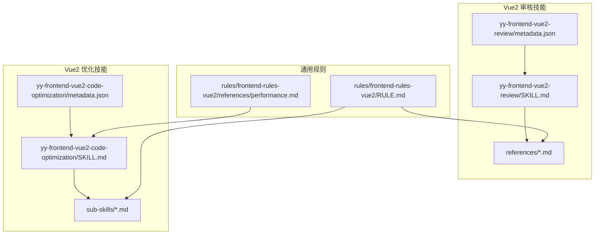
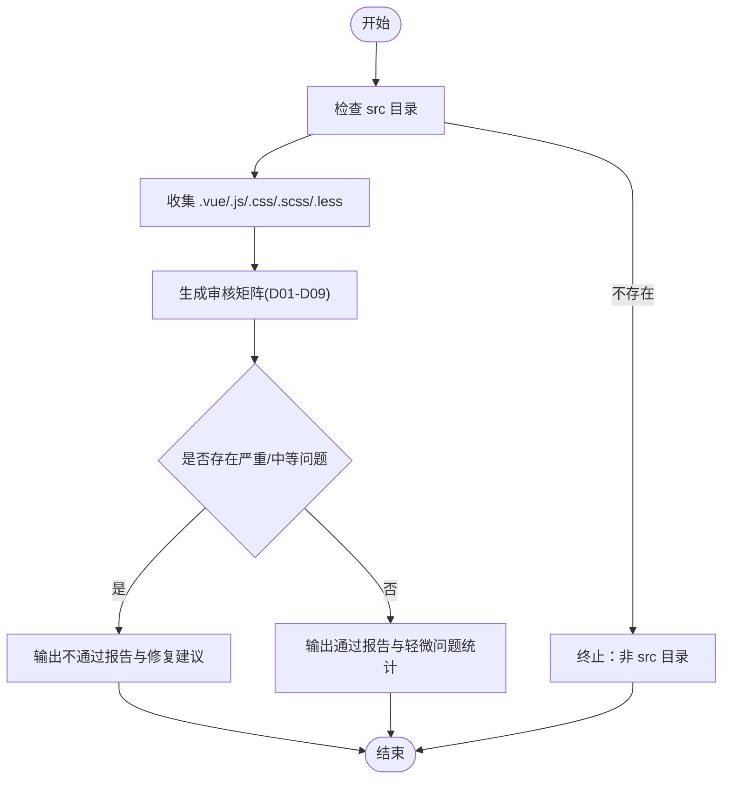
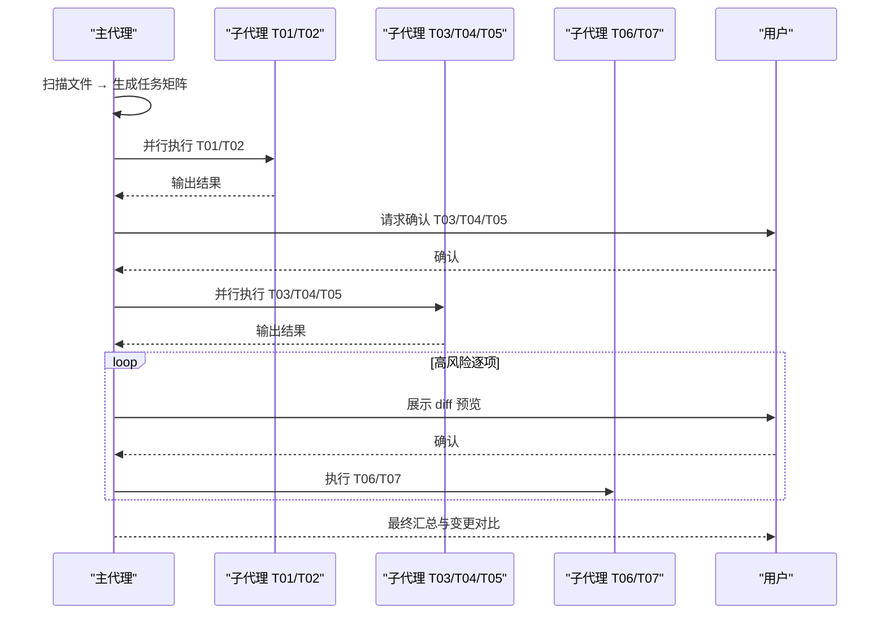
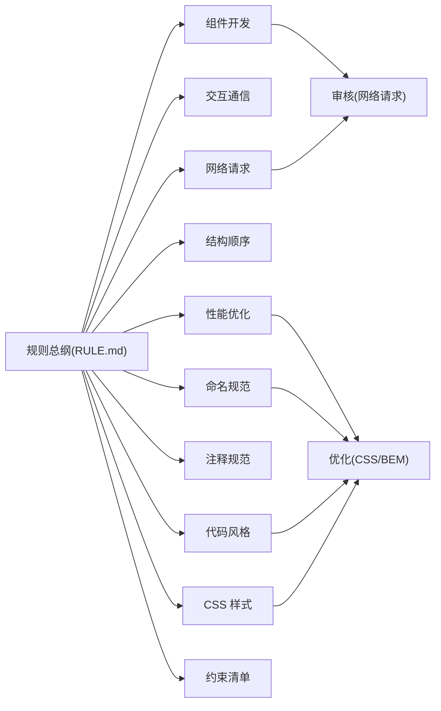
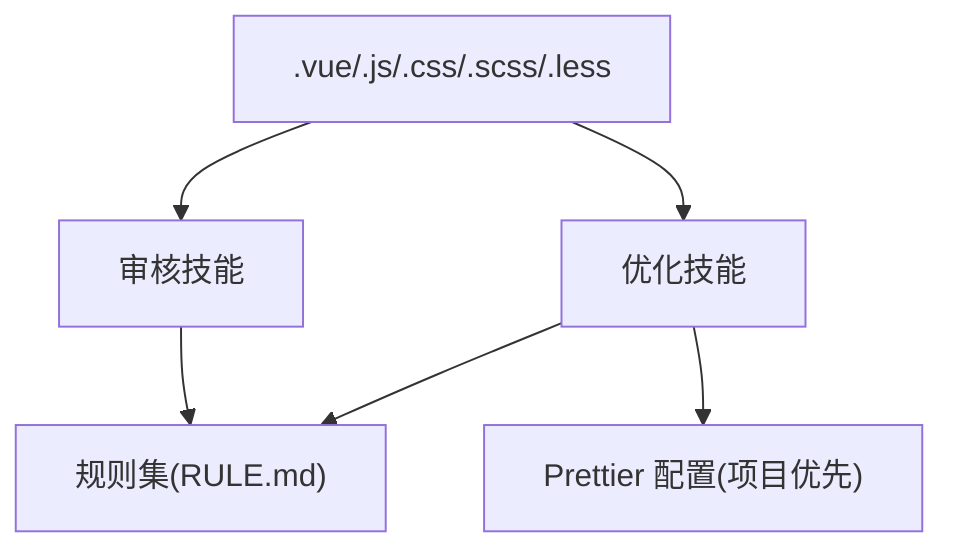

# Vue2 开发支持

<cite>
**本文引用的文件**
- [metadata.json](file://skills/yy-frontend-vue2-review/metadata.json)
- [SKILL.md](file://skills/yy-frontend-vue2-review/SKILL.md)
- [RULE.md](file://rules/frontend-rules-vue2/RULE.md)
- [best-practice.md](file://skills/yy-frontend-vue2-review/references/best-practice.md)
- [component.md](file://skills/yy-frontend-vue2-review/references/component.md)
- [computed.md](file://skills/yy-frontend-vue2-review/references/computed.md)
- [naming.md](file://skills/yy-frontend-vue2-review/references/naming.md)
- [request.md](file://skills/yy-frontend-vue2-review/references/request.md)
- [metadata.json](file://skills/yy-frontend-vue2-code-optimization/metadata.json)
- [SKILL.md](file://skills/yy-frontend-vue2-code-optimization/SKILL.md)
- [business-logic.md](file://skills/yy-frontend-vue2-code-optimization/sub-skills/business-logic.md)
- [code-style.md](file://skills/yy-frontend-vue2-code-optimization/sub-skills/code-style.md)
- [css-style.md](file://skills/yy-frontend-vue2-code-optimization/sub-skills/css-style.md)
- [naming.md](file://skills/yy-frontend-vue2-code-optimization/sub-skills/naming.md)
- [performance.md](file://rules/frontend-rules-vue2/references/performance.md)
</cite>

## 目录
1. [简介](#简介)
2. [项目结构](#项目结构)
3. [核心组件](#核心组件)
4. [架构总览](#架构总览)
5. [详细组件分析](#详细组件分析)
6. [依赖分析](#依赖分析)
7. [性能考量](#性能考量)
8. [故障排查指南](#故障排查指南)
9. [结论](#结论)
10. [附录](#附录)

## 简介
本技术文档围绕 Vue2 开发支持模块，系统阐述“代码审核”与“代码优化”两大能力：前者聚焦于基于 Options API 的代码分析、传统开发规范检查与问题识别；后者强调标准化与优化，包括性能优化建议、代码重构提示与响应式数据管理策略。文档同时提供完整的开发规范指南、实际案例与迁移经验，以及与传统前端工具链的集成与兼容性考虑。

## 项目结构
该仓库以“技能”为核心组织单元，分别提供 Vue2 代码审核与 Vue2 代码优化两类技能，配套规则与参考文档，形成“规则驱动 + 技能执行”的闭环。



图表来源
- [metadata.json:1-34](file://skills/yy-frontend-vue2-review/metadata.json#L1-L34)
- [SKILL.md:1-167](file://skills/yy-frontend-vue2-review/SKILL.md#L1-L167)
- [metadata.json:1-40](file://skills/yy-frontend-vue2-code-optimization/metadata.json#L1-L40)
- [SKILL.md:1-415](file://skills/yy-frontend-vue2-code-optimization/SKILL.md#L1-L415)
- [RULE.md:1-62](file://rules/frontend-rules-vue2/RULE.md#L1-L62)
- [performance.md:1-179](file://rules/frontend-rules-vue2/references/performance.md#L1-L179)

章节来源
- [metadata.json:1-34](file://skills/yy-frontend-vue2-review/metadata.json#L1-L34)
- [SKILL.md:1-167](file://skills/yy-frontend-vue2-review/SKILL.md#L1-L167)
- [metadata.json:1-40](file://skills/yy-frontend-vue2-code-optimization/metadata.json#L1-L40)
- [SKILL.md:1-415](file://skills/yy-frontend-vue2-code-optimization/SKILL.md#L1-L415)
- [RULE.md:1-62](file://rules/frontend-rules-vue2/RULE.md#L1-L62)

## 核心组件
- 审核维度与严重程度分级
  - 9 大审核维度：代码风格、最佳实践、组件规范、命名、网络请求、computed、逻辑错误、安全、绝对禁止项
  - 三级严重程度：🔴 严重（D07/D08/D09）、🟡 中等（D03/D04/D05/D06）、🟢 轻微（D01/D02）
- 审核边界与范围
  - 严格限制在 src 目录内；仅支持 .vue/.js/.css/.scss/.less；拒绝 Vue3/React 项目
- 优化任务与风险分级
  - 零风险（自动执行）：业务逻辑梳理、注释增强
  - 中风险（需确认）：代码风格清洗、CSS/BEM 规范、语义化命名
  - 高风险（逐项确认）：逻辑深度优化、无效代码清理
- 通用规则与性能规范
  - 以 rules/frontend-rules-vue2 为总纲，覆盖组件开发、交互通信、命名与性能等维度

章节来源
- [SKILL.md:68-96](file://skills/yy-frontend-vue2-review/SKILL.md#L68-L96)
- [SKILL.md:18-46](file://skills/yy-frontend-vue2-review/SKILL.md#L18-L46)
- [SKILL.md:40-70](file://skills/yy-frontend-vue2-code-optimization/SKILL.md#L40-L70)
- [SKILL.md:122-130](file://skills/yy-frontend-vue2-code-optimization/SKILL.md#L122-L130)
- [RULE.md:1-62](file://rules/frontend-rules-vue2/RULE.md#L1-L62)

## 架构总览
审核与优化两条主线并行工作，均以“文件扫描 → 任务生成 → 分级执行 → 结果汇总”为流程骨架，辅以严格的边界控制与风险确认机制。

```mermaid
sequenceDiagram
participant U as "用户"
participant Rev as "审核技能"
participant Opt as "优化技能"
participant Repo as "项目仓库"
U->>Rev : 触发审核(src 目录/指定文件)
Rev->>Repo : 读取 src 下改动文件
Rev->>Rev : 生成审核矩阵(D01-D09)
Rev-->>U : 输出审核清单与结论
U->>Opt : 触发优化(默认/指定/直接提供)
Opt->>Repo : 扫描改动文件
Opt->>Opt : 生成任务矩阵(T01-T07)
Opt->>Opt : 零风险自动执行
Opt->>U : 中/高风险任务请求确认
U->>Opt : 确认后执行
Opt-->>U : 输出优化结果与变更对比
```

图表来源
- [SKILL.md:59-96](file://skills/yy-frontend-vue2-review/SKILL.md#L59-L96)
- [SKILL.md:132-155](file://skills/yy-frontend-vue2-code-optimization/SKILL.md#L132-L155)

## 详细组件分析

### 组件 A：Vue2 代码审核（yy-frontend-vue2-review）
- 能力概述
  - 基于 Options API 的代码分析，覆盖模板、脚本、样式三个区
  - 严格 src 目录边界，拒绝 Vue3/React 项目
  - 生成维度化的审核清单与问题分组
- 审核维度与规范要点
  - D01 代码风格：缩进、引号、分号、尾随逗号、箭头函数、导入分组与顺序
  - D02 最佳实践：调试代码清理、BEM 命名、scoped、未使用变量
  - D03 组件规范：Options API 结构顺序、Props/Emit 规范、模板属性顺序、v-slot 语法
  - D04 命名规范：API/事件/常量/Props/组件/方法命名约定与前缀
  - D05 网络请求：async/await + try/catch/finally、统一响应处理
  - D06 computed：try/catch 包裹、有意义命名
  - D07 逻辑错误：空指针、数组越界、判断遗漏等
  - D08 安全漏洞：XSS、敏感信息泄露
  - D09 绝对禁止项：连续解构、修改 props、mixins、多层 try/catch 嵌套等
- 执行流程
  - 目录验证 → 收集目标文件 → 生成审核矩阵 → 结果汇总与结论判定



图表来源
- [SKILL.md:61-96](file://skills/yy-frontend-vue2-review/SKILL.md#L61-L96)

章节来源
- [SKILL.md:68-96](file://skills/yy-frontend-vue2-review/SKILL.md#L68-L96)
- [best-practice.md:1-107](file://skills/yy-frontend-vue2-review/references/best-practice.md#L1-L107)
- [component.md:1-195](file://skills/yy-frontend-vue2-review/references/component.md#L1-L195)
- [computed.md:1-31](file://skills/yy-frontend-vue2-review/references/computed.md#L1-L31)
- [naming.md:1-35](file://skills/yy-frontend-vue2-review/references/naming.md#L1-L35)
- [request.md:1-44](file://skills/yy-frontend-vue2-review/references/request.md#L1-L44)

### 组件 B：Vue2 代码优化（yy-frontend-vue2-code-optimization）
- 能力概述
  - 面向 .vue/.js/.css/.scss/.less 的标准化与优化
  - 任务调度与风险分级：零风险自动执行、中风险用户确认、高风险逐项确认
  - 子代理并行执行，主代理负责高风险任务的逐项确认
- 任务清单与风险等级
  - T01 业务逻辑梳理（零风险，仅 .vue）
  - T02 注释增强（零风险）
  - T03 代码风格清洗（中风险）
  - T04 CSS/BEM 规范（中风险）
  - T05 语义化命名（中风险）
  - T06 逻辑深度优化（高风险，主代理执行）
  - T07 无效代码清理（高风险，主代理执行）
- 执行顺序与并行度
  - 阶段一：T01/T02 自动执行（可并行）
  - 阶段二：T03/T04/T05 用户确认后执行（可并行）
  - 阶段三：T06/T07 逐项展示 diff → 用户确认 → 执行（不可并行）



图表来源
- [SKILL.md:72-120](file://skills/yy-frontend-vue2-code-optimization/SKILL.md#L72-L120)
- [SKILL.md:132-155](file://skills/yy-frontend-vue2-code-optimization/SKILL.md#L132-L155)

章节来源
- [metadata.json:1-40](file://skills/yy-frontend-vue2-code-optimization/metadata.json#L1-L40)
- [SKILL.md:40-70](file://skills/yy-frontend-vue2-code-optimization/SKILL.md#L40-L70)
- [SKILL.md:132-155](file://skills/yy-frontend-vue2-code-optimization/SKILL.md#L132-L155)
- [business-logic.md:1-127](file://skills/yy-frontend-vue2-code-optimization/sub-skills/business-logic.md#L1-L127)
- [code-style.md:1-150](file://skills/yy-frontend-vue2-code-optimization/sub-skills/code-style.md#L1-L150)
- [css-style.md:1-323](file://skills/yy-frontend-vue2-code-optimization/sub-skills/css-style.md#L1-L323)
- [naming.md:1-41](file://skills/yy-frontend-vue2-code-optimization/sub-skills/naming.md#L1-L41)

### 组件 C：通用规则与性能规范
- 规则总纲
  - 以 rules/frontend-rules-vue2/RULE.md 为总纲，拆分子模块：组件开发、交互通信、命名、结构顺序、网络请求、代码风格、注释、CSS、性能、约束清单、AI 行为约束
- 性能优化要点
  - 组件懒加载、路由懒加载、KeepAlive 缓存、虚拟滚动、防抖节流、图片优化
  - 响应式陷阱（Vue2 特有）：新增对象属性、数组索引赋值、数组长度修改的正确做法
- 与审核/优化的映射
  - 审核：将规则细化为 D01-D09 维度，形成可执行的检查清单
  - 优化：将规则转化为子技能任务，形成可并行的执行流水线



图表来源
- [RULE.md:1-62](file://rules/frontend-rules-vue2/RULE.md#L1-L62)
- [performance.md:1-179](file://rules/frontend-rules-vue2/references/performance.md#L1-L179)

章节来源
- [RULE.md:1-62](file://rules/frontend-rules-vue2/RULE.md#L1-L62)
- [performance.md:1-179](file://rules/frontend-rules-vue2/references/performance.md#L1-L179)

## 依赖分析
- 技能与规则的耦合
  - 审核与优化技能均以 rules/frontend-rules-vue2 为权威依据，确保规范一致性
- 文件类型与任务映射
  - .vue：支持全部优化任务；审核覆盖模板/脚本/样式
  - .js：支持注释增强、风格清洗、命名、逻辑优化、无效代码清理
  - .css/.scss/.less：支持风格清洗与 BEM 规范
- 风险与执行的关系
  - 风险等级决定执行策略：零风险自动、中风险确认、高风险逐项确认
- 与工具链的集成
  - 优先使用项目自有 Prettier 配置；若缺失则参考技能内置配置进行格式化



图表来源
- [SKILL.md:47-56](file://skills/yy-frontend-vue2-review/SKILL.md#L47-L56)
- [SKILL.md:122-129](file://skills/yy-frontend-vue2-code-optimization/SKILL.md#L122-L129)
- [code-style.md:25-49](file://skills/yy-frontend-vue2-code-optimization/sub-skills/code-style.md#L25-L49)

章节来源
- [SKILL.md:47-56](file://skills/yy-frontend-vue2-review/SKILL.md#L47-L56)
- [SKILL.md:122-129](file://skills/yy-frontend-vue2-code-optimization/SKILL.md#L122-L129)
- [code-style.md:25-49](file://skills/yy-frontend-vue2-code-optimization/sub-skills/code-style.md#L25-L49)

## 性能考量
- 优化建议
  - 组件懒加载与路由懒加载：避免全量打包，提升首屏性能
  - KeepAlive 精确缓存：通过 include/exclude 控制缓存范围
  - 虚拟滚动：长列表场景降低 DOM 数量
  - 防抖节流：搜索、滚动、resize、按钮点击等高频事件
  - 图片优化：WebP、合适尺寸、非首屏懒加载
  - 模板层轻量化：避免复杂表达式与昂贵计算，优先使用 computed
  - 响应式性能：优先 computed 派生、大数据 freeze、避免 watch 同步 DOM
- 响应式陷阱（Vue2）
  - 新增对象属性、数组索引赋值、数组长度修改的正确做法

章节来源
- [performance.md:1-179](file://rules/frontend-rules-vue2/references/performance.md#L1-L179)

## 故障排查指南
- 审核不通过
  - 优先修复严重问题（D07/D08/D09），再处理中等问题
  - 轻微问题不影响通过，但建议按建议修复
- 优化高风险任务
  - T06/T07 需逐项确认，建议先查看 diff 预览再执行
  - 若存在动态引用或第三方库 API，需谨慎评估是否修改
- 边界与兼容性
  - 严格 src 目录边界，拒绝 Vue3/React 项目
  - Prettier 优先使用项目自有配置，避免格式不一致
  - 大型文件建议分批优化，避免 Git Diff 膨胀与合并冲突

章节来源
- [SKILL.md:82-96](file://skills/yy-frontend-vue2-review/SKILL.md#L82-L96)
- [SKILL.md:167-180](file://skills/yy-frontend-vue2-code-optimization/SKILL.md#L167-L180)
- [code-style.md:15-24](file://skills/yy-frontend-vue2-code-optimization/sub-skills/code-style.md#L15-L24)

## 结论
本模块以“规则驱动 + 技能执行”的方式，为 Vue2 项目提供了系统化的代码审核与优化能力。通过严格的边界控制、风险分级与并行执行机制，既能保障代码质量与一致性，又能降低协作成本与维护风险。配合性能优化与响应式数据管理策略，可显著提升项目的长期可维护性与运行效率。

## 附录
- 实际案例与迁移经验
  - 从 Vue2 到 Vue3 迁移：关注 Options API 与组合式 API 的差异、生命周期钩子与指令清理、响应式数据管理策略的演进
  - 常见问题与解决方案：组件拆分、状态管理模式、网络请求统一化、computed 优先策略、防抖节流与 KeepAlive 的合理使用
- 与传统前端工具链的集成
  - ESLint/Prettier/Autoprefixer/PostCSS 等工具的配置与使用建议
  - Git 工作流：提交前审核、暂存区文件检查、合并冲突预防

[本节为概念性总结，不直接分析具体文件，故无章节来源]