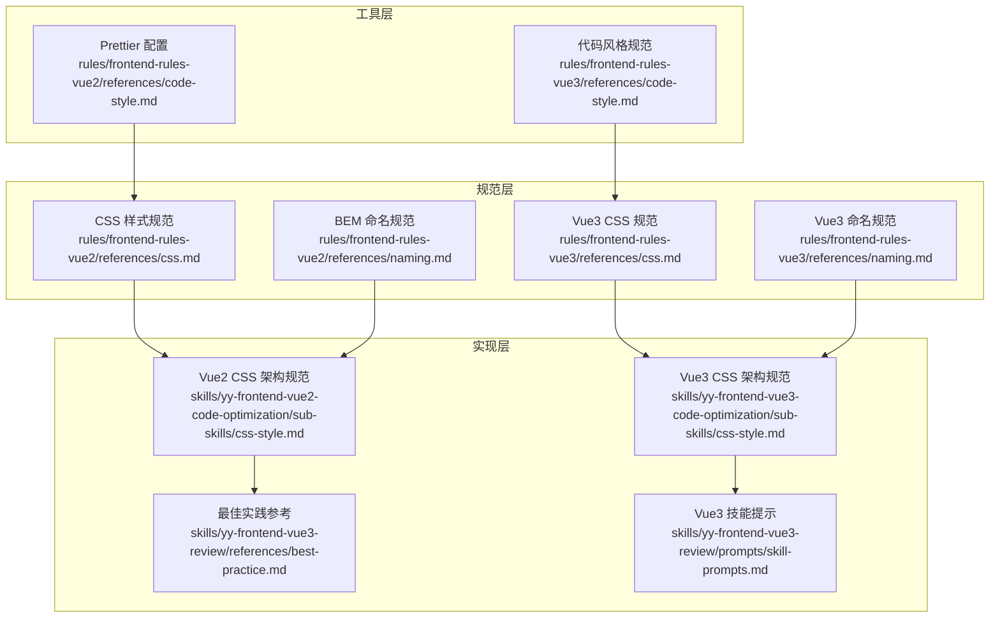
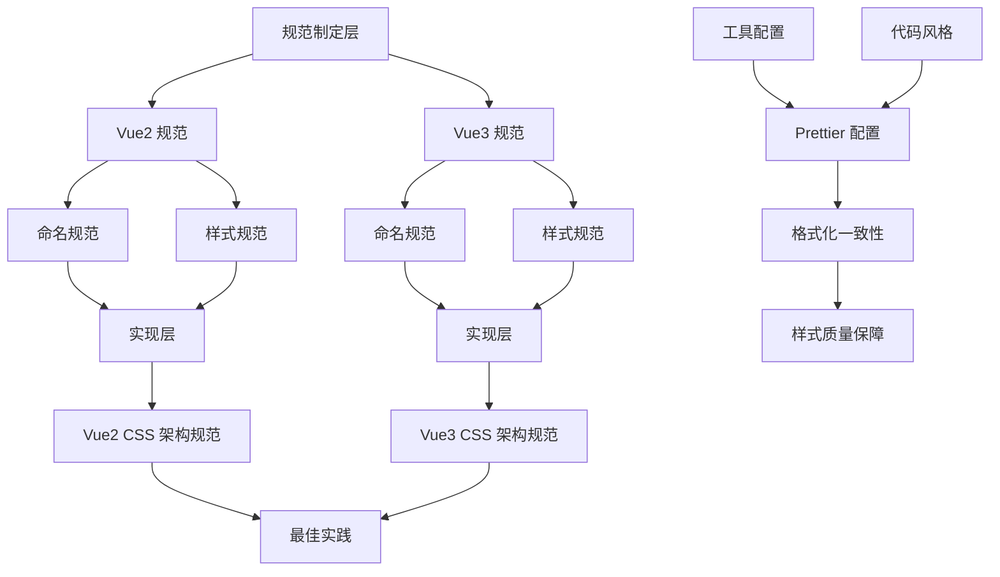
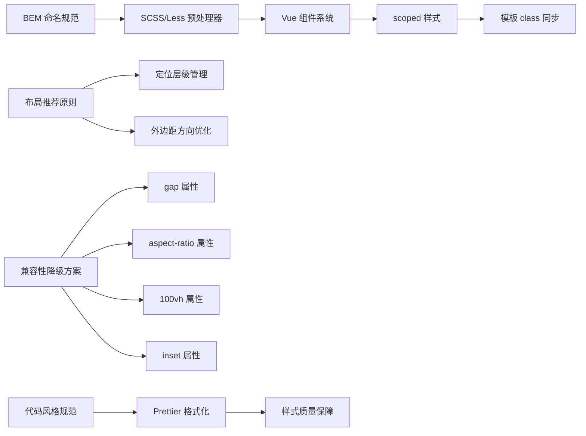

# CSS/BEM 规范

<cite>
**本文档引用的文件**
- [css.md](file://rules/frontend-rules-vue2/references/css.md)
- [naming.md](file://rules/frontend-rules-vue2/references/naming.md)
- [css-style.md](file://skills/yy-frontend-vue2-code-optimization/sub-skills/css-style.md)
- [css.md](file://rules/frontend-rules-vue3/references/css.md)
- [naming.md](file://rules/frontend-rules-vue3/references/naming.md)
- [css-style.md](file://skills/yy-frontend-vue3-code-optimization/sub-skills/css-style.md)
- [best-practice.md](file://skills/yy-frontend-vue3-review/references/best-practice.md)
- [skill-prompts.md](file://skills/yy-frontend-vue3-review/prompts/skill-prompts.md)
</cite>

## 目录
1. [简介](#简介)
2. [项目结构](#项目结构)
3. [核心组件](#核心组件)
4. [架构概览](#架构概览)
5. [详细组件分析](#详细组件分析)
6. [依赖关系分析](#依赖关系分析)
7. [性能考虑](#性能考虑)
8. [故障排除指南](#故障排除指南)
9. [结论](#结论)

## 简介

CSS/BEM 规范是前端开发中用于组织和管理样式的重要标准，特别适用于大型项目的样式维护和团队协作。本规范基于块（Block）、元素（Element）和修饰符（Modifier）三个核心要素，结合现代预处理器技术，为开发者提供了一套完整的样式架构解决方案。

该规范不仅关注命名约定，还涵盖了嵌套深度控制、作用域管理、兼容性处理等多个方面，确保样式代码的可维护性和跨浏览器兼容性。

## 项目结构

本项目中的 CSS/BEM 规范分布在多个层次中，形成了完整的规范体系：



**图表来源**
- [css.md:1-63](file://rules/frontend-rules-vue2/references/css.md#L1-L63)
- [naming.md:1-73](file://rules/frontend-rules-vue2/references/naming.md#L1-L73)
- [css-style.md:1-323](file://skills/yy-frontend-vue2-code-optimization/sub-skills/css-style.md#L1-L323)

**章节来源**
- [css.md:1-63](file://rules/frontend-rules-vue2/references/css.md#L1-L63)
- [naming.md:1-73](file://rules/frontend-rules-vue2/references/naming.md#L1-L73)
- [css-style.md:1-323](file://skills/yy-frontend-vue2-code-optimization/sub-skills/css-style.md#L1-L323)

## 核心组件

### BEM 命名体系

BEM（Block-Element-Modifier）是一种流行的 CSS 类名命名方法论，它通过明确的语义化命名来组织样式代码。

#### 命名规则

| 类型 | 说明 | 示例 | 规则要求 |
|------|------|------|----------|
| 块（Block） | 独立的组件或模块 | `.card`, `.form` | 全小写，横线连接，语义清晰 |
| 元素（Element） | 块内部的子元素 | `.card__title`, `.form__input` | 使用双下划线 `__` 连接 |
| 修饰符（Modifier） | 状态或样式变体 | `.card--dark`, `.card__title--large` | 使用双连字符 `--` 连接 |

#### 命名约束

- **全小写**：所有类名必须使用小写字母
- **横线连接**：单词之间使用短横线 `-` 连接
- **语义清晰**：类名应准确描述组件功能和用途
- **类名唯一**：确保类名在整个项目中唯一，避免冲突
- **禁止使用下划线**：除了 `__` 和 `--` 外，不得使用下划线

**章节来源**
- [naming.md:53-73](file://rules/frontend-rules-vue2/references/naming.md#L53-L73)
- [naming.md:76-85](file://rules/frontend-rules-vue3/references/naming.md#L76-L85)

### 嵌套结构规范

#### SCSS 嵌套（推荐 `&` 引用）

预处理器提供了强大的嵌套功能，但需要遵循严格的深度限制：

```scss
// ✅ 正确：使用 & 引用父选择器，嵌套层级 ≤ 2
.user-card {
  padding: 16px;

  // 元素嵌套在块内
  .user-card__header {
    font-weight: bold;

    // 修饰符嵌套在元素内
    &.user-card__header--active {
      color: #1890ff;
    }
  }

  .user-card__body { /* ... */ }
}
```

#### LESS 嵌套（推荐 `&` 引用）

LESS 提供了更简洁的嵌套语法：

```less
// ✅ 正确：利用 & 语法构建 BEM，与 SCSS 类似
.user-card {
  padding: 16px;

  &__header {
    font-weight: bold;

    &--active {
      color: #1890ff;
    }
  }

  &__body { /* ... */ }
}
```

**说明**：LESS 的 `&` 语法更简洁，但编译后与 SCSS 输出等价。推荐 LESS 中使用 `&__element` 简化写法，SCSS 中使用 `&` 或类名嵌套。

**章节来源**
- [css-style.md:20-63](file://skills/yy-frontend-vue2-code-optimization/sub-skills/css-style.md#L20-L63)
- [css-style.md:19-62](file://skills/yy-frontend-vue3-code-optimization/sub-skills/css-style.md#L19-L62)

### Vue 组件作用域管理

#### scoped 样式最佳实践

Vue 组件中的样式隔离是保证样式独立性的关键：

```vue
<style scoped>
/* 用户卡片 */
.user-card {
  padding: 16px;
  border-radius: 8px;

  /* 用户卡片 > 头部 */
  .user-card__header {
    font-weight: bold;

    /* 响应式 */
    @media (max-width: 768px) {
      font-size: 14px;
    }
  }
}
</style>
```

#### 模板 class 同步修改

**关键规则**：scoped 样式中的 class 修改时，必须同步修改模板中的 class 属性。

**修改前**：
```vue
<template>
  <div class="userCard">
    <div class="header">...</div>
  </div>
</template>

<style scoped>
.userCard {
  .header { ... }
}
</style>
```

**修改后（BEM 规范）**：
```vue
<template>
  <div class="user-card">
    <div class="user-card__header">...</div>
  </div>
</template>

<style scoped>
/* 用户卡片 */
.user-card {
  padding: 16px;

  /* 用户卡片 > 头部 */
  .user-card__header {
    font-weight: bold;
  }
}
</style>
```

**章节来源**
- [css-style.md:64-171](file://skills/yy-frontend-vue2-code-optimization/sub-skills/css-style.md#L64-L171)
- [css-style.md:63-167](file://skills/yy-frontend-vue3-code-optimization/sub-skills/css-style.md#L63-L167)

## 架构概览

CSS/BEM 规范的整体架构体现了从规范制定到具体实现的完整流程：



**图表来源**
- [css.md:1-63](file://rules/frontend-rules-vue2/references/css.md#L1-L63)
- [naming.md:1-73](file://rules/frontend-rules-vue2/references/naming.md#L1-L73)
- [css-style.md:1-323](file://skills/yy-frontend-vue2-code-optimization/sub-skills/css-style.md#L1-L323)

## 详细组件分析

### 布局推荐原则

#### 定位层级管理

合理的定位层级管理是避免 z-index 冲突的关键：

```scss
// ✅ 正确：创建独立定位上下文
.modal-wrapper {
  position: relative;
  z-index: 0;

  .modal-overlay {
    position: absolute;
    z-index: 10; // 不会影响外部元素
  }
}
```

#### 外边距与内边距方向

**padding 方向**：优先使用 `padding-top`、`padding-left`、`padding-right`，避免 `padding-bottom`

**margin 方向**：优先使用 `margin-bottom`、`margin-left`、`margin-right`，避免 `margin-top`

**原因**：向下布局更稳定，减少相邻元素的间距叠加问题（margin collapse）。

**章节来源**
- [css.md:29-41](file://rules/frontend-rules-vue2/references/css.md#L29-L41)
- [css.md:33-45](file://rules/frontend-rules-vue3/references/css.md#L33-L45)
- [css bevior.md:189-229](file://skills/yy-frontend-vue2-code-optimization/sub-skills/css-style.md#L189-L229)

### 兼容性降级方案

现代 CSS 属性在不同浏览器中的支持程度差异较大，需要提供相应的降级方案：

#### gap 属性降级

| 属性 | 问题 | 降级方案 |
|------|------|----------|
| `gap` (Flexbox) | Safari 14.4及以下、IE11 不支持 | margin 负边距 |

```scss
// ❌ 直接使用 gap（兼容性问题）
.flex-container {
  display: flex;
  gap: 16px;
}

// ✅ 使用 margin 负边距降级
.flex-container {
  display: flex;
  margin-left: -16px;
  margin-top: -16px;

  > * {
    margin-left: 16px;
    margin-top: 16px;
  }
}
```

#### aspect-ratio 属性降级

| 属性 | 问题 | 降级方案 |
|------|------|----------|
| `aspect-ratio` | iOS 15.6及以下 Safari 支持不全 | `padding-bottom` 百分比 Hack |

```scss
// ❌ 直接使用 aspect-ratio
.video-box {
  aspect-ratio: 16/9;
}

// ✅ 使用 padding-bottom Hack
.video-box {
  position: relative;
  width: 100%;
  padding-bottom: 56.25%; // 9/16 = 56.25%

  > video {
    position: absolute;
    top: 0;
    left: 0;
    width: 100%;
    height: 100%;
  }
}
```

#### 100vh 属性降级

| 属性 | 问题 | 降级方案 |
|------|------|----------|
| `100vh` | iOS Safari 地址栏导致高度偏差 | JS 动态计算或 `dvh` 单位 |

```scss
// ❌ 直接使用 100vh
.full-height {
  height: 100vh;
}

// ✅ 使用 dvh 或 JS 动态计算
.full-height {
  height: 100vh;
  height: 100dvh; // 新单位，支持动态视口高度
}
```

#### inset 属性降级

| 属性 | 问题 | 降级方案 |
|------|------|----------|
| `inset` | 旧浏览器不识别 | 先写 `top/right/bottom/left` 再覆盖 |

#### 其他兼容性属性

| 属性 | 问题 | 降级方案 |
|------|------|----------|
| `will-change` | 动画结束不重置会占用内存 | 动画结束后设为 `auto` |
| `content-visibility` | 仅 Chromium 支持 | 仅作性能增强，不影响核心布局 |
| `subgrid` | 浏览器支持不完善 | 传统 Grid/Flex 降级 |

**章节来源**
- [css.md:42-63](file://rules/frontend-rules-vue2/references/css.md#L42-L63)
- [css.md:46-67](file://rules/frontend-rules-vue3/references/css.md#L46-L67)
- [css-style.md:231-323](file://skills/yy-frontend-vue2-code-optimization/sub-skills/css-style.md#L231-L323)

### 禁止嵌套场景

为了保持样式的可维护性和性能，需要避免以下嵌套模式：

#### 嵌套层级过深（> 2 层）

```scss
// ❌ 禁止：嵌套层级过深（> 2 层）
.user-card {
  .user-card__header {
    .user-card__title {
      .user-card__title-text { /* 禁止 */ }
    }
  }
}
```

#### 元素类型选择器嵌套

```scss
// ❌ 禁止：元素类型选择器嵌套（降低特异性）
.user-card {
  .user-card__header {
    img { ... }  // 应改用类名
    span { ... }
  }
}
```

#### 后代选择器嵌套

```scss
// ❌ 禁止：使用后代选择器嵌套（降低性能）
.user-card {
  .some-class {
    ul {
      li { ... }  // 应展平为独立类
    }
  }
}
```

**推荐结构**：
- **嵌套最大深度**：2 层（块 → 元素 → 修饰符）
- **修饰符**：与块/元素同级，或使用 `&` 引用
- **媒体查询**：可嵌套在对应块/元素内部

**章节来源**
- [css-style.md:86-121](file://skills/yy-frontend-vue2-code-optimization/sub-skills/css-style.md#L86-L121)
- [css-style.md:85-120](file://skills/yy-frontend-vue3-code-optimization/sub-skills/css-style.md#L85-L120)

## 依赖关系分析

CSS/BEM 规范的实施涉及多个层面的依赖关系：



**图表来源**
- [css.md:1-63](file://rules/frontend-rules-vue2/references/css.md#L1-L63)
- [naming.md:1-73](file://rules/frontend-rules-vue2/references/naming.md#L1-L73)
- [css-style.md:1-323](file://skills/yy-frontend-vue2-code-optimization/sub-skills/css-style.md#L1-L323)

**章节来源**
- [css.md:1-63](file://rules/frontend-rules-vue2/references/css.md#L1-L63)
- [naming.md:1-73](file://rules/frontend-rules-vue2/references/naming.md#L1-L73)
- [css-style.md:1-323](file://skills/yy-frontend-vue2-code-optimization/sub-skills/css-style.md#L1-L323)

## 性能考虑

### 嵌套深度优化

过度的嵌套会增加 CSS 选择器的特异性，影响样式匹配性能。建议：

1. **限制嵌套层级**：保持在 2 层以内
2. **避免深层后代选择器**：使用扁平化的类名结构
3. **合理使用 `&` 引用**：在预处理器中保持选择器简洁

### 作用域管理

Vue 组件的作用域管理对性能有重要影响：

1. **优先使用 `scoped`**：避免样式泄漏
2. **全局样式标注**：非 `scoped` 需标注 `/* 全局 */`
3. **模板同步更新**：修改样式时同步更新模板

### 兼容性处理

现代 CSS 属性的兼容性处理需要平衡功能和性能：

1. **渐进增强**：使用 `@supports` 包裹新属性
2. **降级方案**：为关键属性提供可靠的降级方案
3. **前缀处理**：配置 Autoprefixer 自动添加浏览器前缀

## 故障排除指南

### 常见问题诊断

#### 样式不生效

**可能原因**：
1. 作用域冲突：检查是否正确使用 `scoped`
2. 嵌套层级过深：检查 CSS 嵌套结构
3. 类名不匹配：确认模板和样式中的类名一致

**解决步骤**：
1. 检查 Vue 组件的 `scoped` 属性
2. 验证 BEM 命名是否符合规范
3. 确认模板中的 `class` 属性与样式一致

#### 兼容性问题

**诊断方法**：
1. 使用 [Can I Use](https://caniuse.com/) 查询属性支持情况
2. 检查浏览器开发者工具的 Console 输出
3. 验证降级方案是否正确应用

**解决方案**：
1. 实现相应的降级方案
2. 使用 `@supports` 进行特性检测
3. 配置 Autoprefixer 自动添加前缀

#### 性能问题

**症状表现**：
1. 页面渲染缓慢
2. 样式更新延迟
3. 内存占用过高

**优化措施**：
1. 减少嵌套层级
2. 避免复杂的后代选择器
3. 使用 CSS 变量替代重复的颜色值
4. 实施渐进增强策略

**章节来源**
- [css.md:58-63](file://rules/frontend-rules-vue2/references/css.md#L58-L63)
- [css-style.md:308-323](file://skills/yy-frontend-vue2-code-optimization/sub-skills/css-style.md#L308-L323)

## 结论

CSS/BEM 规范为现代前端开发提供了一套完整的样式管理解决方案。通过明确的命名约定、合理的嵌套结构、有效的作用域管理和全面的兼容性处理，这套规范能够显著提升样式的可维护性和团队协作效率。

关键要点总结：

1. **BEM 命名体系**：通过块、元素、修饰符的清晰分离，确保类名的语义化和唯一性
2. **嵌套深度控制**：限制嵌套层级，避免选择器复杂度过高
3. **作用域管理**：利用 Vue 的 `scoped` 特性，确保样式隔离
4. **兼容性处理**：为现代 CSS 属性提供可靠的降级方案
5. **性能优化**：通过合理的结构设计和渐进增强策略，平衡功能与性能

这套规范不仅适用于 Vue2 和 Vue3 项目，其核心原则同样适用于其他前端框架和纯 CSS 项目。通过严格执行这些规范，开发团队可以建立高质量、可维护的样式体系，为项目的长期发展奠定坚实基础。