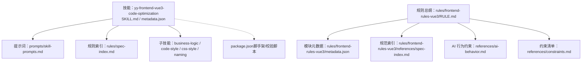
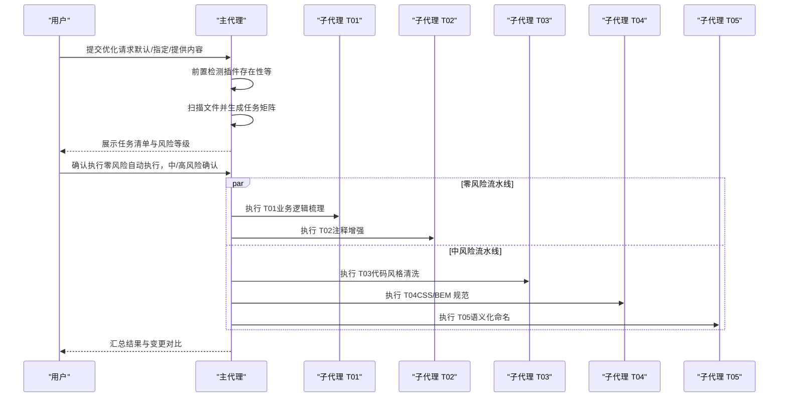
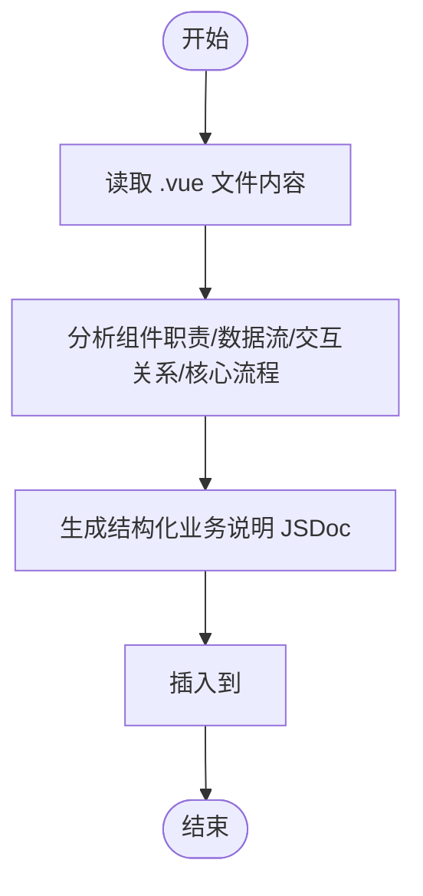
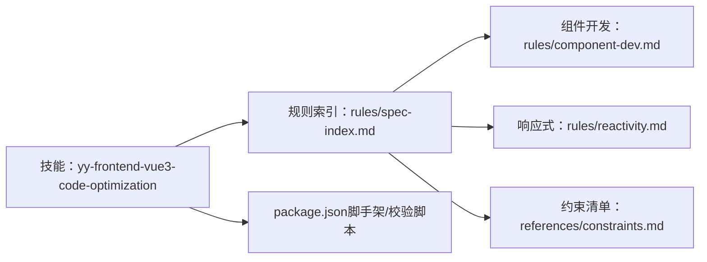

# Vue3 代码优化

<cite>
**本文引用的文件**   
- [metadata.json](file://skills/yy-frontend-vue3-code-optimization/metadata.json)
- [SKILL.md](file://skills/yy-frontend-vue3-code-optimization/SKILL.md)
- [prompts/skill-prompts.md](file://skills/yy-frontend-vue3-code-optimization/prompts/skill-prompts.md)
- [rules/spec-index.md](file://skills/yy-frontend-vue3-code-optimization/rules/spec-index.md)
- [rules/component-dev.md](file://skills/yy-frontend-vue3-code-optimization/rules/component-dev.md)
- [rules/reactivity.md](file://skills/yy-frontend-vue3-code-optimization/rules/reactivity.md)
- [sub-skills/business-logic.md](file://skills/yy-frontend-vue3-code-optimization/sub-skills/business-logic.md)
- [sub-skills/code-style.md](file://skills/yy-frontend-vue3-code-optimization/sub-skills/code-style.md)
- [sub-skills/css-style.md](file://skills/yy-frontend-vue3-code-optimization/sub-skills/css-style.md)
- [sub-skills/naming.md](file://skills/yy-frontend-vue3-code-optimization/sub-skills/naming.md)
- [rules/frontend-rules-vue3/RULE.md](file://rules/frontend-rules-vue3/RULE.md)
- [rules/frontend-rules-vue3/metadata.json](file://rules/frontend-rules-vue3/metadata.json)
- [rules/frontend-rules-vue3/references/spec-index.md](file://rules/frontend-rules-vue3/references/spec-index.md)
- [rules/frontend-rules-vue3/references/ai-behavior.md](file://rules/frontend-rules-vue3/references/ai-behavior.md)
- [rules/frontend-rules-vue3/references/constraints.md](file://rules/frontend-rules-vue3/references/constraints.md)
- [package.json](file://package.json)
</cite>

## 目录
1. [简介](#简介)
2. [项目结构](#项目结构)
3. [核心组件](#核心组件)
4. [架构总览](#架构总览)
5. [详细组件分析](#详细组件分析)
6. [依赖分析](#依赖分析)
7. [性能考量](#性能考量)
8. [故障排查指南](#故障排查指南)
9. [结论](#结论)
10. [附录](#附录)

## 简介
本技能面向 Vue3 项目，提供系统化的代码优化能力，覆盖基于 Vue3 开发规范的性能优化建议与代码重构提示。通过“主代理 + 子代理”的任务调度架构，将优化任务细分为零风险、中风险与高风险三类，分别采用自动执行、用户确认后执行与逐项确认执行策略，确保变更可控、可回溯。

优化范围包括但不限于：
- 统一 `<script setup>` 结构、导入分组与模板属性顺序
- BEM 样式命名与 scoped 同步
- 语义化命名（API/事件/常量/Hooks）
- 逻辑深度优化（async/await、Hooks 抽离、reactive 转 ref、Props/Emits 增强）
- 无效代码清理（未使用导入/变量/函数）
- 注释增强与业务逻辑梳理
- 与 TypeScript、ESLint、Prettier 等工具链的集成与效果评估

## 项目结构
该技能与规则体系采用“技能 + 规则模块 + 子技能”的分层组织：
- 技能层：定义任务清单、调度策略、输出格式与边界条件
- 规则层：按优先级组织规范模块（基础/强烈推荐/风格指南），形成可引用的参考索引
- 子技能层：针对具体任务（如业务逻辑梳理、代码风格清洗、CSS/BEM 规范、语义化命名）给出执行策略与风险说明

**图表来源**
- [SKILL.md:1-464](file://skills/yy-frontend-vue3-code-optimization/SKILL.md#L1-L464)
- [metadata.json:1-47](file://skills/yy-frontend-vue3-code-optimization/metadata.json#L1-L47)
- [prompts/skill-prompts.md:1-800](file://skills/yy-frontend-vue3-code-optimization/prompts/skill-prompts.md#L1-L800)
- [rules/spec-index.md:1-60](file://skills/yy-frontend-vue3-code-optimization/rules/spec-index.md#L1-L60)
- [rules/frontend-rules-vue3/RULE.md:1-68](file://rules/frontend-rules-vue3/RULE.md#L1-L68)
- [rules/frontend-rules-vue3/metadata.json:1-17](file://rules/frontend-rules-vue3/metadata.json#L1-L17)
- [rules/frontend-rules-vue3/references/spec-index.md:1-60](file://rules/frontend-rules-vue3/references/spec-index.md#L1-L60)
- [rules/frontend-rules-vue3/references/ai-behavior.md:1-29](file://rules/frontend-rules-vue3/references/ai-behavior.md#L1-L29)
- [rules/frontend-rules-vue3/references/constraints.md:1-45](file://rules/frontend-rules-vue3/references/constraints.md#L1-L45)
- [package.json:1-46](file://package.json#L1-L46)

**章节来源**
- [SKILL.md:1-464](file://skills/yy-frontend-vue3-code-optimization/SKILL.md#L1-L464)
- [metadata.json:1-47](file://skills/yy-frontend-vue3-code-optimization/metadata.json#L1-L47)
- [rules/frontend-rules-vue3/RULE.md:1-68](file://rules/frontend-rules-vue3/RULE.md#L1-L68)

## 核心组件
- 主代理（Orchestrator）
  - 负责扫描文件、生成任务清单、按风险等级分组、调度子代理执行、汇总结果与展示
  - 高风险任务（T06/T07）由主代理执行，逐项展示 diff 并等待用户确认
- 子代理（Sub-agent）
  - 零风险（T01/T02）与中风险（T03/T04/T05）任务由独立子代理执行，职责单一、可并行处理
- 规则引擎（Rules）
  - 基于“规范索引”与各模块规则（组件开发、交互、指令、命名、响应式、watch、网络、性能、注释等）提供执行依据与边界约束

**章节来源**
- [SKILL.md:81-129](file://skills/yy-frontend-vue3-code-optimization/SKILL.md#L81-L129)
- [prompts/skill-prompts.md:21-57](file://skills/yy-frontend-vue3-code-optimization/prompts/skill-prompts.md#L21-L57)

## 架构总览
整体执行流程分为前置检测、文件扫描、任务清单生成、用户确认、任务执行与结果汇总六个阶段。零风险任务自动执行，中风险任务需用户确认，高风险任务逐项确认并展示变更预览。

**图表来源**
- [SKILL.md:141-165](file://skills/yy-frontend-vue3-code-optimization/SKILL.md#L141-L165)
- [prompts/skill-prompts.md:40-49](file://skills/yy-frontend-vue3-code-optimization/prompts/skill-prompts.md#L40-L49)

## 详细组件分析

### 子技能：业务逻辑梳理（T01）
- 目标：仅对 .vue 文件进行纯文本分析，生成结构化业务说明，插入到 `<script setup>` 顶部
- 关键规则：
  - 组件职责、数据流向、交互关系、核心业务流程
  - 每次改动需记录“改动时间”和“改动内容”，倒序排列
  - 若已有同类注释，追加新记录而非覆盖
- 输出格式：结构化 JSDoc，包含数据来源、交互关系与依赖说明

**图表来源**
- [sub-skills/business-logic.md:1-123](file://skills/yy-frontend-vue3-code-optimization/sub-skills/business-logic.md#L1-L123)

**章节来源**
- [sub-skills/business-logic.md:1-123](file://skills/yy-frontend-vue3-code-optimization/sub-skills/business-logic.md#L1-L123)

### 子技能：注释增强（T02）
- 目标：模板/脚本/样式注释增强，遵循“只增不改”与“注释保护原则”
- 关键规则：
  - 已有注释若内容正确或与理解相近，禁止改动
  - 仅在三种情况才修改：注释错误、业务逻辑实质性变更、命名变更导致引用失效
  - 模板区：根节点、循环、条件、区块、插槽、动态组件添加注释
  - 脚本区：关键方法 JSDoc（≤5 行），Props/Ref/Reactive/Computed/Watch/Hooks/Methods/生命周期添加行内注释
  - 样式区：模块分组、子模块、响应式区块添加注释
  - JSX/TSX：根节点、循环、条件、关键区块添加注释

**章节来源**
- [SKILL.md:203-219](file://skills/yy-frontend-vue3-code-optimization/SKILL.md#L203-L219)

### 子技能：代码风格与格式清洗（T03）
- 目标：导入排序（4 组）、`<script setup>` 结构、模板属性顺序、组件 name 属性
- 关键规则：
  - 优先执行 Prettier 格式化；失败则参考 assets/.prettierrc.json 的 fallback 配置
  - 导入按 4 组排序（外部依赖 → 类型 → 全局内部 → 相对内部），组间空一行，组内字母排序
  - `<script setup>` 结构顺序：imports → defineProps/defineEmits → 全局 Hooks → 业务逻辑（按功能模块分组）→ defineExpose
  - 业务模块内部顺序：ref/reactive（优先 ref）→ computed → 方法 → watch → 生命周期钩子
  - 模板属性顺序：is → v-for → v-if/v-else-if/v-else → v-show/v-cloak → id → props/attrs → v-on → v-html/v-text → v-slot
  - 函数写法偏好：优先箭头函数，避免 function 声明
  - TSX/JSX 组件结构顺序与规范
- 风险说明：格式化可能导致 Git Diff 膨胀、合并冲突与风格不一致，建议在干净分支执行

**章节来源**
- [sub-skills/code-style.md:1-353](file://skills/yy-frontend-vue3-code-optimization/sub-skills/code-style.md#L1-L353)
- [SKILL.md:220-234](file://skills/yy-frontend-vue3-code-optimization/SKILL.md#L220-L234)

### 子技能：CSS/BEM 规范（T04）
- 目标：类名转为 BEM 格式，scoped 同步修改
- 关键规则：
  - 块（block）、元素（block__element）、修饰符（block--modifier），全小写、横线连接、类名唯一
  - 嵌套最大深度 2 层，SCSS/LESS 使用 & 引用父选择器
  - scoped 样式中的 class 修改时，必须同步修改模板中的 class 属性
- 布局与兼容性：定位层级、padding/margin 方向、常见兼容性问题与降级方案

**章节来源**
- [sub-skills/css-style.md:1-227](file://skills/yy-frontend-vue3-code-optimization/sub-skills/css-style.md#L1-L227)
- [SKILL.md:235-247](file://skills/yy-frontend-vue3-code-optimization/SKILL.md#L235-L247)

### 子技能：语义化命名（T05）
- 目标：API/事件/常量/Hooks 命名规范，涉及全局替换需谨慎
- 关键规则：
  - API 函数：api + Method + URLPath
  - 事件函数：on + EventName
  - 常量：全大写 + 下划线
  - Props：camelCase，组件名：PascalCase
  - 布尔值：isXX / hasXX / showXX 前缀
  - Hooks：use + 功能名
  - 执行策略：全局查找、分类替换、diff 预览、确认后执行
- 风险说明：引用遗漏、第三方库冲突、API 路径变更

**章节来源**
- [sub-skills/naming.md:1-42](file://skills/yy-frontend-vue3-code-optimization/sub-skills/naming.md#L1-L42)
- [SKILL.md:264-277](file://skills/yy-frontend-vue3-code-optimization/SKILL.md#L264-L277)

### 子技能：逻辑深度优化（T06）
- 目标：async/await、Hooks 抽离、reactive 转 ref、Props/Emits 增强
- 关键规则：
  - 由主代理执行，不使用子代理
  - 每项改动需用户单独确认：展示变更 → 用户确认 → 执行 → 下一项
  - `.then()` → async/await，使用 try/catch/finally + console.warn
  - 除与后端交互和定时器外，其他尽可能使用 computed
  - 网络请求：前置检查是否安装 ahooks-vue 或 vue-hooks-plus；统一响应模式 { code, data, msg }
  - 单个方法超过 50 行必须拆分，重复 ≥2 次逻辑抽离为公共函数或 Hook
  - reactive 转 ref：优先使用 ref，尽可能少用 reactive（仅复杂对象场景使用）
  - Emit 白名单与顺序：update:modelValue/value → 其他业务事件 → change/click
  - Props 增强：TypeScript 泛型定义、明确类型、添加注释、提供默认值
  - Emits 标准化：TypeScript 泛型定义、明确事件名和 payload 类型
  - Hooks 抽离：可复用逻辑超过 30 行或跨 2+ 组件使用时必须抽离

**章节来源**
- [SKILL.md:278-297](file://skills/yy-frontend-vue3-code-optimization/SKILL.md#L278-L297)

### 子技能：无效代码清理（T07）
- 目标：清理未使用的导入、未使用的变量/函数
- 关键规则：
  - 由主代理执行，不使用子代理
  - 每项改动需用户单独确认：展示变更 → 用户确认 → 执行 → 下一项
  - 清理未使用的导入语句（import）
  - 清理未使用的变量声明（const/let/var）
  - 清理未使用的函数定义
  - 谨慎判断：仅删除确实未被引用的代码；保留可能在运行时动态使用的代码；保留可能通过字符串动态调用的方法
  - 样式文件（.css/.scss/.less）无此任务

**章节来源**
- [SKILL.md:298-313](file://skills/yy-frontend-vue3-code-optimization/SKILL.md#L298-L313)

### 规则系统与规范索引
- 规范总纲（三级优先级）：基础规范（Essential）、强烈推荐（Strongly Recommended）、风格指南（Recommended）
- 组件开发：必须使用 `<script setup>`，禁止 Options API；脚本结构顺序、模板属性顺序、defineExpose 等
- 响应式状态：优先使用 ref，尽可能少用 reactive；computed 规范与 try/catch 包裹；reactive 转 ref 规则
- 交互与通信：Props 定义、Emit 事件白名单、defineExpose、provide/inject、兄弟组件通信
- 指令与模板：v-for 与 key、v-if 与 v-for 冲突、v-html 安全、指令简写、模板属性顺序
- 命名规范：文件/组件/API/事件/常量/布尔值/Hooks（Props/Emit 详见交互模块）
- Hooks：命名/返回值/使用规范、抽离建议、组件中导入顺序
- 网络请求：async/await、统一响应解构、错误处理、安全规范
- 代码风格：Prettier 配置、箭头函数优先
- 注释：模板/脚本/样式注释格式、注释保护原则
- CSS/BEM：BEM 命名、scoped 优先、自定义指令
- TypeScript：禁止 any / as any / @ts-ignore、类型注解规范、import type
- 性能：懒加载、KeepAlive、虚拟滚动、防抖节流、图片优化
- 约束清单：10 项禁止、5 项推荐、2 项不推荐、注意事项

**章节来源**
- [rules/spec-index.md:1-60](file://skills/yy-frontend-vue3-code-optimization/rules/spec-index.md#L1-L60)
- [rules/component-dev.md:1-81](file://skills/yy-frontend-vue3-code-optimization/rules/component-dev.md#L1-L81)
- [rules/reactivity.md:1-227](file://skills/yy-frontend-vue3-code-optimization/rules/reactivity.md#L1-L227)
- [rules/frontend-rules-vue3/RULE.md:1-68](file://rules/frontend-rules-vue3/RULE.md#L1-L68)
- [rules/frontend-rules-vue3/references/spec-index.md:1-60](file://rules/frontend-rules-vue3/references/spec-index.md#L1-L60)
- [rules/frontend-rules-vue3/references/ai-behavior.md:1-29](file://rules/frontend-rules-vue3/references/ai-behavior.md#L1-L29)
- [rules/frontend-rules-vue3/references/constraints.md:1-45](file://rules/frontend-rules-vue3/references/constraints.md#L1-L45)

## 依赖分析
- 技能与规则的耦合关系
  - 技能层通过“规则索引”与各模块规则建立引用关系，确保执行依据与边界约束一致
  - 子技能执行策略与规则模块相互映射，如 T03 对应“代码风格与 Prettier 配置”，T04 对应“CSS/BEM 规范”
- 工具链集成
  - Prettier：优先使用项目自有配置；失败时参考 assets/.prettierrc.json 的 fallback 配置
  - TypeScript：参数、返回值、变量必须明确类型，禁止 any
  - ESLint：注释检查默认忽略，未使用变量需自行清理
- 外部依赖
  - unplugin-vue-setup-extend-plus：用于在 `<script setup>` 上添加 name 属性（需检测项目依赖）

**图表来源**
- [SKILL.md:1-464](file://skills/yy-frontend-vue3-code-optimization/SKILL.md#L1-L464)
- [rules/spec-index.md:1-60](file://skills/yy-frontend-vue3-code-optimization/rules/spec-index.md#L1-L60)
- [rules/component-dev.md:1-81](file://skills/yy-frontend-vue3-code-optimization/rules/component-dev.md#L1-L81)
- [rules/reactivity.md:1-227](file://skills/yy-frontend-vue3-code-optimization/rules/reactivity.md#L1-L227)
- [rules/frontend-rules-vue3/references/constraints.md:1-45](file://rules/frontend-rules-vue3/references/constraints.md#L1-L45)
- [package.json:1-46](file://package.json#L1-L46)

**章节来源**
- [SKILL.md:141-165](file://skills/yy-frontend-vue3-code-optimization/SKILL.md#L141-L165)
- [prompts/skill-prompts.md:42-44](file://skills/yy-frontend-vue3-code-optimization/prompts/skill-prompts.md#L42-L44)

## 性能考量
- 代码组织层面
  - 优先使用 computed 替代派生逻辑，减少冗余 ref
  - 尽可能使用 ref，少用 reactive（仅复杂对象场景）
  - Hooks 抽离可复用逻辑，减少重复与体积
- 模板与渲染层面
  - 模板层轻量化：简单逻辑内联，不为简单逻辑额外创建函数
  - 路由与大组件使用动态 import，合理使用 KeepAlive
  - 防抖节流、虚拟滚动、图片优化等性能策略
- 工具链层面
  - Prettier 格式化可能造成 Git Diff 膨胀，建议在干净分支执行
  - TypeScript 类型注解可帮助静态分析与 Tree-shaking

**章节来源**
- [rules/reactivity.md:132-200](file://skills/yy-frontend-vue3-code-optimization/rules/reactivity.md#L132-L200)
- [SKILL.md:332-344](file://skills/yy-frontend-vue3-code-optimization/SKILL.md#L332-L344)

## 故障排查指南
- 常见问题与处理
  - Prettier 未安装或命令不存在：参考 assets/.prettierrc.json 的 fallback 配置进行手动格式化
  - 未使用变量：ESLint 已关闭检查，需自行清理无用代码
  - v-html 风险：可使用但必须防范 XSS 风险
  - 等于运算符：使用 == 不视为问题；仅接口响应 code 例外使用 ===，需列入高风险并经用户确认
  - 注释检查：注释相关问题默认忽略，不进行检查
- 风险任务确认
  - 高风险任务（T06/T07）逐项展示 diff，用户确认后执行
  - 中风险任务（T03/T04/T05）需用户明确确认后执行
  - 零风险任务（T01/T02）自动执行，无需等待用户确认

**章节来源**
- [sub-skills/code-style.md:26-50](file://skills/yy-frontend-vue3-code-optimization/sub-skills/code-style.md#L26-L50)
- [SKILL.md:359-367](file://skills/yy-frontend-vue3-code-optimization/SKILL.md#L359-L367)
- [prompts/skill-prompts.md:186-190](file://skills/yy-frontend-vue3-code-optimization/prompts/skill-prompts.md#L186-L190)

## 结论
本技能通过“主代理 + 子代理”的任务调度与风险分级机制，将 Vue3 代码优化工作分解为可执行、可确认、可回溯的具体步骤。结合规范索引与规则模块，确保在不改变业务逻辑的前提下，统一代码风格、提升可读性与可维护性，并为后续性能优化与团队协作奠定坚实基础。

## 附录
- 与 TypeScript、ESLint、Prettier 的集成要点
  - TypeScript：参数/返回值/变量必须明确类型，禁止 any；类型注解规范、import type
  - ESLint：注释检查默认忽略，未使用变量需自行清理
  - Prettier：优先使用项目自有配置；失败时参考 assets/.prettierrc.json 的 fallback 配置
- 输出契约与格式
  - 子代理输出格式：任务类型、处理文件数量、文件执行详情、变更对比（关键变更）
  - 最终汇总输出格式：处理文件数、执行任务统计、跳过任务、警告提醒、执行详情与汇总统计

**章节来源**
- [SKILL.md:370-445](file://skills/yy-frontend-vue3-code-optimization/SKILL.md#L370-L445)
- [prompts/skill-prompts.md:186-190](file://skills/yy-frontend-vue3-code-optimization/prompts/skill-prompts.md#L186-L190)