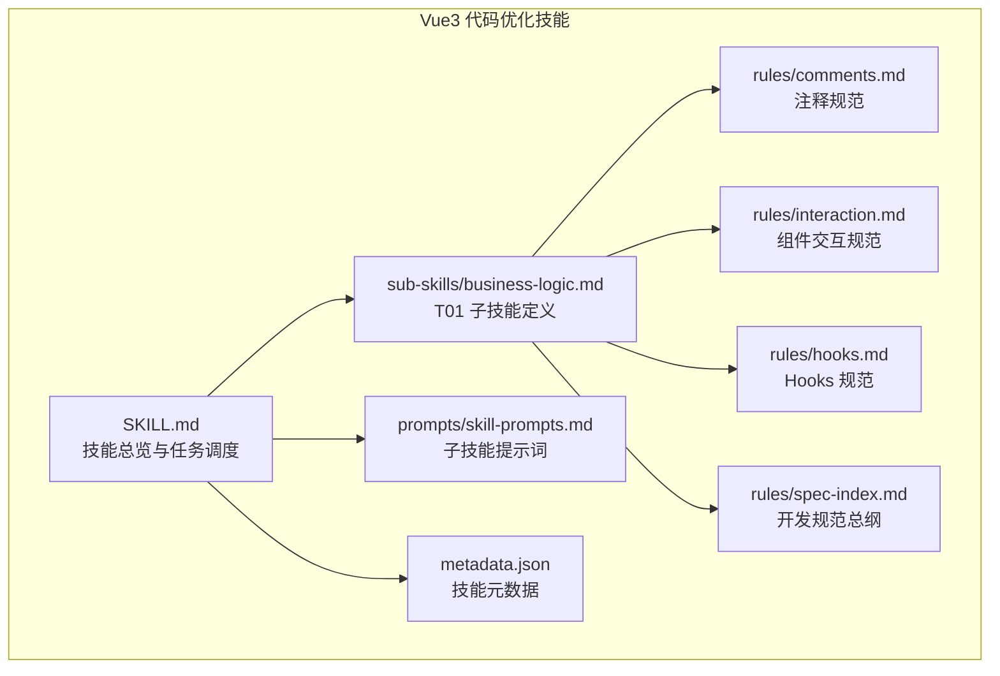
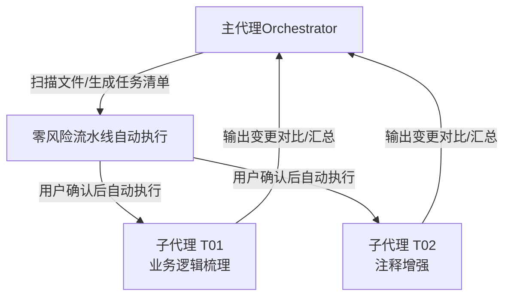
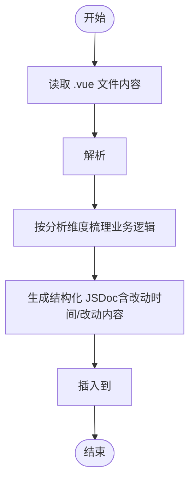
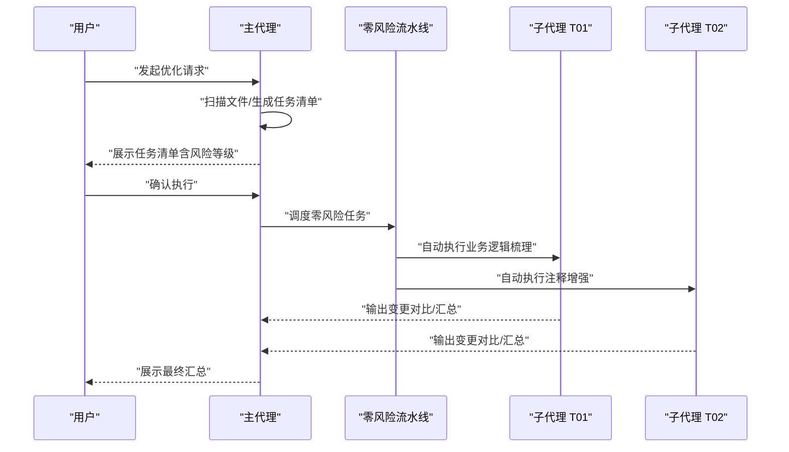
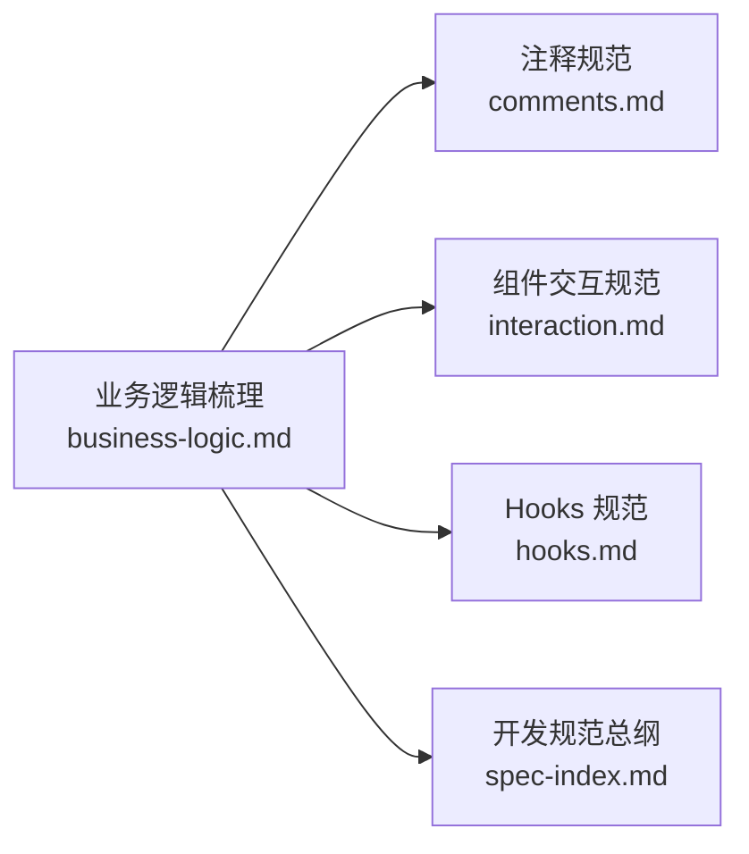

# 业务逻辑梳理

<cite>
**本文引用的文件**
- [business-logic.md](file://skills/yy-frontend-vue3-code-optimization/sub-skills/business-logic.md)
- [SKILL.md](file://skills/yy-frontend-vue3-code-optimization/SKILL.md)
- [skill-prompts.md](file://skills/yy-frontend-vue3-code-optimization/prompts/skill-prompts.md)
- [comments.md](file://skills/yy-frontend-vue3-code-optimization/rules/comments.md)
- [interaction.md](file://skills/yy-frontend-vue3-code-optimization/rules/interaction.md)
- [hooks.md](file://skills/yy-frontend-vue3-code-optimization/rules/hooks.md)
- [spec-index.md](file://skills/yy-frontend-vue3-code-optimization/rules/spec-index.md)
- [metadata.json](file://skills/yy-frontend-vue3-code-optimization/metadata.json)
</cite>

## 目录
1. [简介](#简介)
2. [项目结构](#项目结构)
3. [核心组件](#核心组件)
4. [架构概览](#架构概览)
5. [详细组件分析](#详细组件分析)
6. [依赖分析](#依赖分析)
7. [性能考虑](#性能考虑)
8. [故障排查指南](#故障排查指南)
9. [结论](#结论)
10. [附录](#附录)

## 简介
本文件面向“业务逻辑梳理”子技能，系统阐述其在 Vue3 代码优化体系中的定位、目标、执行时机、与任务调度的关系，以及如何在 `<script setup>` 标签顶部生成结构化业务说明 JSDoc 的方法与格式要求。文档还提供分析维度、执行规则、最佳实践与示例，帮助开发者高效、安全地完成业务逻辑梳理与注释增强。

## 项目结构
该子技能位于 Vue3 代码优化技能包中，配套规则与提示文件共同构成完整的执行规范与质量保障体系。

图表来源
- [SKILL.md:1-464](file://skills/yy-frontend-vue3-code-optimization/SKILL.md#L1-L464)
- [business-logic.md:1-123](file://skills/yy-frontend-vue3-code-optimization/sub-skills/business-logic.md#L1-L123)
- [comments.md:1-83](file://skills/yy-frontend-vue3-code-optimization/rules/comments.md#L1-L83)
- [interaction.md:1-125](file://skills/yy-frontend-vue3-code-optimization/rules/interaction.md#L1-L125)
- [hooks.md:1-158](file://skills/yy-frontend-vue3-code-optimization/rules/hooks.md#L1-L158)
- [spec-index.md:1-60](file://skills/yy-frontend-vue3-code-optimization/rules/spec-index.md#L1-L60)
- [metadata.json:1-47](file://skills/yy-frontend-vue3-code-optimization/metadata.json#L1-L47)

章节来源
- [SKILL.md:1-464](file://skills/yy-frontend-vue3-code-optimization/SKILL.md#L1-L464)
- [business-logic.md:1-123](file://skills/yy-frontend-vue3-code-optimization/sub-skills/business-logic.md#L1-L123)

## 核心组件
- 子技能定义文件：明确任务目标、分析维度、输出格式、注意事项与多次改动示例。
- 技能总览文件：定义任务调度、风险分级、子代理执行规则与输出契约。
- 规则文件：注释保护原则、组件交互规范、Hooks 规范、开发规范总纲。
- 提示词文件：与子技能定义一致的分析维度与输出格式，确保执行一致性。
- 元数据文件：技能能力清单与兼容性说明，体现“零风险·仅 .vue”的定位。

章节来源
- [business-logic.md:1-123](file://skills/yy-frontend-vue3-code-optimization/sub-skills/business-logic.md#L1-L123)
- [SKILL.md:177-202](file://skills/yy-frontend-vue3-code-optimization/SKILL.md#L177-L202)
- [comments.md:1-83](file://skills/yy-frontend-vue3-code-optimization/rules/comments.md#L1-L83)
- [interaction.md:1-125](file://skills/yy-frontend-vue3-code-optimization/rules/interaction.md#L1-L125)
- [hooks.md:1-158](file://skills/yy-frontend-vue3-code-optimization/rules/hooks.md#L1-L158)
- [spec-index.md:1-60](file://skills/yy-frontend-vue3-code-optimization/rules/spec-index.md#L1-L60)
- [metadata.json:1-47](file://skills/yy-frontend-vue3-code-optimization/metadata.json#L1-L47)

## 架构概览
业务逻辑梳理属于“零风险”任务，由子代理在用户确认后自动执行，贯穿于整体优化流程的“阶段一”。其与任务调度、规则体系、输出契约形成闭环。

图表来源
- [SKILL.md:81-129](file://skills/yy-frontend-vue3-code-optimization/SKILL.md#L81-L129)
- [SKILL.md:167-174](file://skills/yy-frontend-vue3-code-optimization/SKILL.md#L167-L174)

## 详细组件分析

### 子技能目标与范围
- 目标：读取 .vue 文件内容，理解组件职责、数据流向、交互关系与核心业务流程，生成结构化业务说明，插入到 `<script setup>` 标签最顶部。
- 范围：仅对 .vue 文件生效，纯文本分析，不改变原有运行逻辑。
- 风险等级：🟢 零风险。

章节来源
- [business-logic.md:3-16](file://skills/yy-frontend-vue3-code-optimization/sub-skills/business-logic.md#L3-L16)
- [SKILL.md:48-78](file://skills/yy-frontend-vue3-code-optimization/SKILL.md#L48-L78)

### 分析维度与执行要点
- 组件职责：该组件负责什么业务？属于页面级/弹窗级/表单级/独立模块级？
- 数据流向：
  - 数据来源：props 传入、API 请求、Store 注入（Pinia/Vuex）、本地 ref/reactive 初始化
  - 数据去向：emit 传递给父组件、作为参数调用下一个 API
- 交互关系：
  - 父→子：通过哪些 props 接收数据？
  - 子→父：通过哪些 emit 传递事件？
  - 外部依赖：使用了哪些 API 接口？引入了哪些第三方组件？使用了哪些 Hooks？
- 核心业务流程：关键方法的执行时序（如 init → getList → computed 派生 → 用户操作触发）

章节来源
- [business-logic.md:18-48](file://skills/yy-frontend-vue3-code-optimization/sub-skills/business-logic.md#L18-L48)
- [skill-prompts.md:332-342](file://skills/yy-frontend-vue3-code-optimization/prompts/skill-prompts.md#L332-L342)

### 输出格式与 JSDoc 结构
- 在 `<script setup>` 标签顶部生成结构化 JSDoc，每次改动必须包含“改动时间”和“改动内容”，用于追踪业务逻辑变更历史。
- 若组件已有同类注释，追加新记录而非覆盖，采用倒序排列（最新改动在最上方）。
- Vue3 特有：需注明使用的 Hooks（如 useTable、useSearchForm 等）。
- 组合式 API 特有：注明数据来自 ref 或 reactive。

图表来源
- [business-logic.md:49-76](file://skills/yy-frontend-vue3-code-optimization/sub-skills/business-logic.md#L49-L76)
- [business-logic.md:116-123](file://skills/yy-frontend-vue3-code-optimization/sub-skills/business-logic.md#L116-L123)

章节来源
- [business-logic.md:49-76](file://skills/yy-frontend-vue3-code-optimization/sub-skills/business-logic.md#L49-L76)
- [business-logic.md:116-123](file://skills/yy-frontend-vue3-code-optimization/sub-skills/business-logic.md#L116-L123)
- [comments.md:33-55](file://skills/yy-frontend-vue3-code-optimization/rules/comments.md#L33-L55)

### 执行时机与与其他任务的关系
- 执行时机：用户确认后自动执行，属于“阶段一 零风险任务”。
- 与其他任务关系：
  - 与注释增强（T02）并行执行，均属零风险。
  - 与风格清洗（T03）、CSS/BEM 规范（T04）、语义化命名（T05）同属“阶段二 中风险”，需用户确认后执行。
  - 与逻辑深度优化（T06）、无效代码清理（T07）同属“阶段三 高风险”，需逐项确认。

图表来源
- [SKILL.md:141-165](file://skills/yy-frontend-vue3-code-optimization/SKILL.md#L141-L165)
- [SKILL.md:167-174](file://skills/yy-frontend-vue3-code-optimization/SKILL.md#L167-L174)

章节来源
- [SKILL.md:141-174](file://skills/yy-frontend-vue3-code-optimization/SKILL.md#L141-L174)

### 为什么是零风险任务且可自动执行
- 仅对 .vue 文件生效，纯文本分析，不修改运行逻辑。
- 仅在 `<script setup>` 标签顶部插入结构化注释，不改变组件行为。
- 用户确认后自动执行，避免人工干预带来的误操作风险。

章节来源
- [business-logic.md:3-4](file://skills/yy-frontend-vue3-code-optimization/sub-skills/business-logic.md#L3-L4)
- [SKILL.md:72-78](file://skills/yy-frontend-vue3-code-optimization/SKILL.md#L72-L78)

### 业务逻辑分析示例与最佳实践
- 示例：参考“多次改动示例”章节，展示如何记录“改动时间”和“改动内容”，并以倒序排列。
- 最佳实践：
  - 明确组件职责与边界，区分页面级/弹窗级/表单级/独立模块级。
  - 清晰梳理数据来源与去向，标注 API 接口、Store 注入、本地状态与 Hooks。
  - 识别父子组件交互关系，明确 props 与 emit 列表。
  - 抽象核心业务流程，标注关键方法的执行时序。
  - 严格遵循注释保护原则，仅在必要时修改既有注释。

章节来源
- [business-logic.md:78-114](file://skills/yy-frontend-vue3-code-optimization/sub-skills/business-logic.md#L78-L114)
- [comments.md:70-83](file://skills/yy-frontend-vue3-code-optimization/rules/comments.md#L70-L83)

## 依赖分析
业务逻辑梳理依赖以下规则与规范，确保输出质量与一致性。

图表来源
- [business-logic.md:5-12](file://skills/yy-frontend-vue3-code-optimization/sub-skills/business-logic.md#L5-L12)
- [comments.md:1-83](file://skills/yy-frontend-vue3-code-optimization/rules/comments.md#L1-L83)
- [interaction.md:1-125](file://skills/yy-frontend-vue3-code-optimization/rules/interaction.md#L1-L125)
- [hooks.md:1-158](file://skills/yy-frontend-vue3-code-optimization/rules/hooks.md#L1-L158)
- [spec-index.md:1-60](file://skills/yy-frontend-vue3-code-optimization/rules/spec-index.md#L1-L60)

章节来源
- [business-logic.md:5-12](file://skills/yy-frontend-vue3-code-optimization/sub-skills/business-logic.md#L5-L12)

## 性能考虑
- 仅对 .vue 文件执行，避免对非目标文件的扫描与处理。
- 插入注释为纯文本操作，不涉及编译或运行时开销。
- 与任务调度结合，零风险任务自动执行，减少人工等待与误操作。

## 故障排查指南
- 若未生成注释：检查文件是否为 .vue 且包含 `<script setup>` 标签；确认任务已被用户确认。
- 若注释格式不符合规范：对照“输出格式”与“注释保护原则”，确保包含“改动时间”和“改动内容”，并采用倒序排列。
- 若遗漏 Hooks/Store 信息：检查组件是否使用了 useXxx、Pinia/Vuex，确保在“数据来源/交互关系”中完整标注。

章节来源
- [business-logic.md:49-76](file://skills/yy-frontend-vue3-code-optimization/sub-skills/business-logic.md#L49-L76)
- [comments.md:70-83](file://skills/yy-frontend-vue3-code-optimization/rules/comments.md#L70-L83)

## 结论
业务逻辑梳理子技能以“零风险·仅 .vue”为核心前提，通过结构化 JSDoc 记录业务逻辑变更历史，配合任务调度与规则体系，实现自动化、可追溯、可维护的注释增强。遵循分析维度与输出格式，能够有效提升团队对组件职责与数据流的理解，降低维护与交接成本。

## 附录
- 技能元数据：技能能力清单与兼容性说明，体现“任务调度器、业务逻辑梳理、注释增强、代码风格清洗、CSS/BEM 规范、语义化命名、异步逻辑优化、Hooks 抽离规范、TypeScript/JSX 规范、Git 变动检测、边界条件增强、输出格式统一”等特性。

章节来源
- [metadata.json:29-47](file://skills/yy-frontend-vue3-code-optimization/metadata.json#L29-L47)