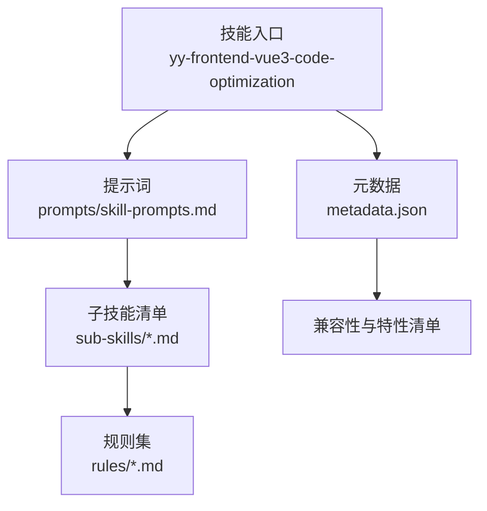
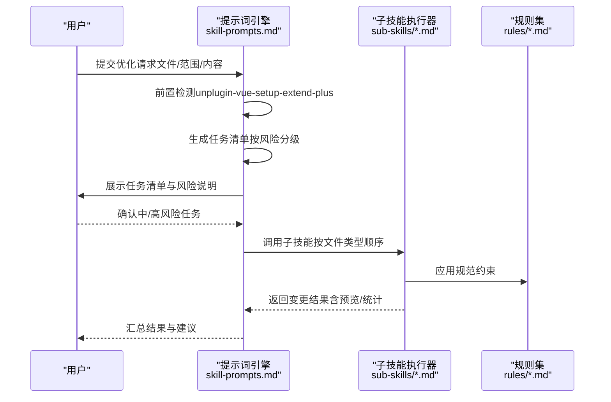
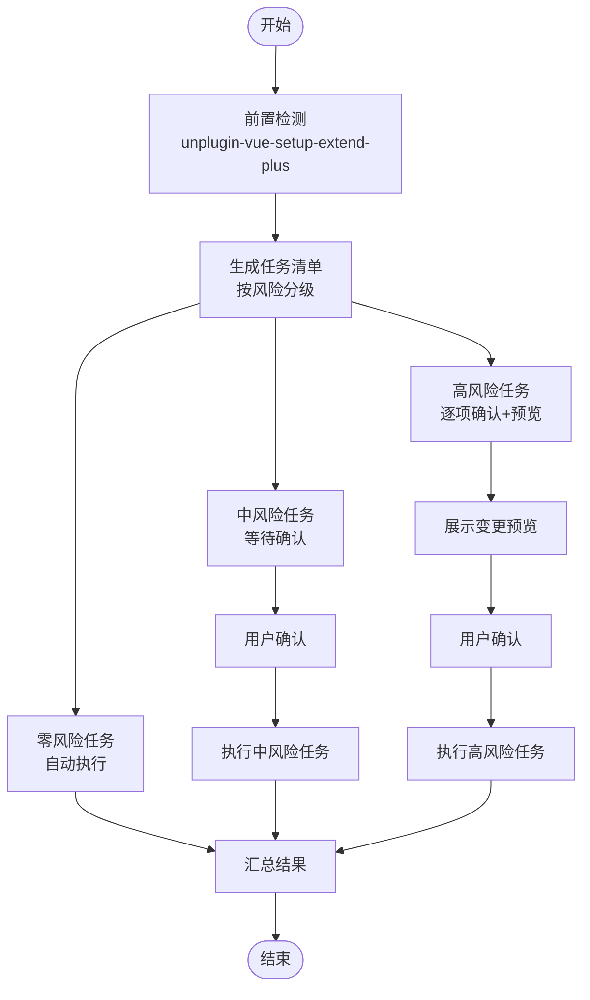
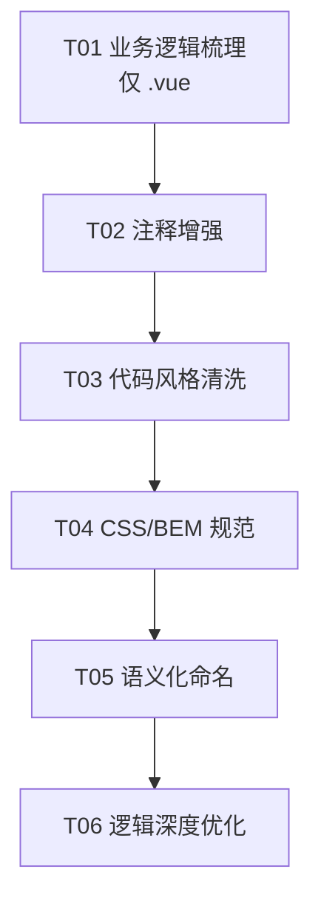
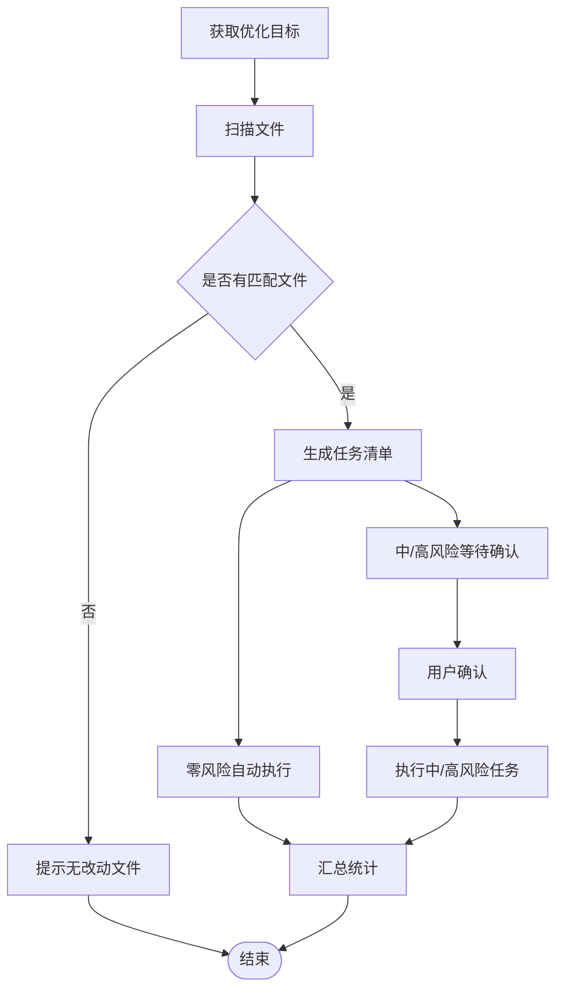
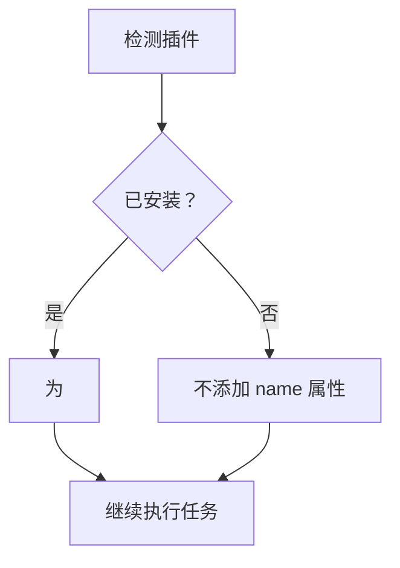
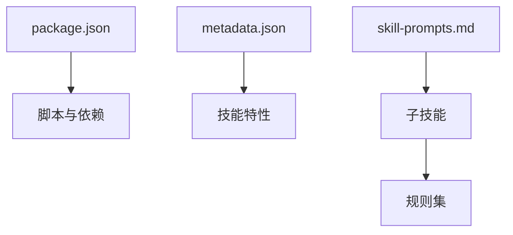

# 主优化技能

<cite>
**本文引用的文件**
- [metadata.json](file://skills/yy-frontend-vue3-code-optimization/metadata.json)
- [skill-prompts.md](file://skills/yy-frontend-vue3-code-optimization/prompts/skill-prompts.md)
- [business-logic.md](file://skills/yy-frontend-vue3-code-optimization/sub-skills/business-logic.md)
- [code-style.md](file://skills/yy-frontend-vue3-code-optimization/sub-skills/code-style.md)
- [css-style.md](file://skills/yy-frontend-vue3-code-optimization/sub-skills/css-style.md)
- [naming.md](file://skills/yy-frontend-vue3-code-optimization/sub-skills/naming.md)
- [performance.md](file://skills/yy-frontend-vue3-code-optimization/rules/performance.md)
- [reactivity.md](file://skills/yy-frontend-vue3-code-optimization/rules/reactivity.md)
- [spec-index.md](file://skills/yy-frontend-vue3-code-optimization/rules/spec-index.md)
- [order.md](file://skills/yy-frontend-vue3-code-optimization/rules/order.md)
- [naming.md](file://skills/yy-frontend-vue3-code-optimization/rules/naming.md)
- [css.md](file://skills/yy-frontend-vue3-code-optimization/rules/css.md)
- [package.json](file://package.json)
</cite>

## 目录
1. [简介](#简介)
2. [项目结构](#项目结构)
3. [核心组件](#核心组件)
4. [架构总览](#架构总览)
5. [详细组件分析](#详细组件分析)
6. [依赖分析](#依赖分析)
7. [性能考量](#性能考量)
8. [故障排查指南](#故障排查指南)
9. [结论](#结论)
10. [附录](#附录)

## 简介
本技能面向 Vue3 前端项目的代码优化与标准化，提供“任务调度器 + 风险分级 + 子技能协同”的执行机制。其核心目标是在不改变业务逻辑的前提下，统一代码风格、结构与命名，增强可读性与可维护性，并通过严格的零/中/高风险分级策略保障变更安全可控。

- 适用范围：.vue、.js、.jsx、.ts、.tsx、.css、.scss、.less 文件
- 默认扫描范围：git 变动文件（未指定时）
- 风险分级：零风险（自动执行）、中风险（用户确认）、高风险（逐项确认+变更预览）

## 项目结构
主技能位于前端 Vue3 代码优化技能包中，包含提示词、子技能与规则集，形成“提示词驱动 + 子技能执行 + 规则约束”的完整闭环。

**图表来源**
- [metadata.json:1-47](file://skills/yy-frontend-vue3-code-optimization/metadata.json#L1-L47)
- [skill-prompts.md:1-800](file://skills/yy-frontend-vue3-code-optimization/prompts/skill-prompts.md#L1-L800)

**章节来源**
- [metadata.json:1-47](file://skills/yy-frontend-vue3-code-optimization/metadata.json#L1-L47)
- [skill-prompts.md:1-800](file://skills/yy-frontend-vue3-code-optimization/prompts/skill-prompts.md#L1-L800)

## 核心组件
- 任务调度器：基于风险分级的任务清单生成与执行流程控制
- 风险分级管理：零/中/高风险三档策略，分别对应自动执行、用户确认、逐项确认+预览
- 子技能协调：按文件类型与任务顺序执行，确保结构与风格一致性
- 规则引擎：以规范文件为约束，保证执行结果符合团队标准

**章节来源**
- [skill-prompts.md:21-57](file://skills/yy-frontend-vue3-code-optimization/prompts/skill-prompts.md#L21-L57)
- [business-logic.md:1-123](file://skills/yy-frontend-vue3-code-optimization/sub-skills/business-logic.md#L1-L123)
- [code-style.md:1-353](file://skills/yy-frontend-vue3-code-optimization/sub-skills/code-style.md#L1-L353)
- [css-style.md:1-227](file://skills/yy-frontend-vue3-code-optimization/sub-skills/css-style.md#L1-L227)
- [naming.md:1-42](file://skills/yy-frontend-vue3-code-optimization/sub-skills/naming.md#L1-L42)

## 架构总览
主技能的执行架构围绕“任务调度器”展开，结合“风险分级”与“子技能执行”，形成从文件扫描到结果汇总的完整流水线。

**图表来源**
- [skill-prompts.md:21-57](file://skills/yy-frontend-vue3-code-optimization/prompts/skill-prompts.md#L21-L57)
- [code-style.md:57-65](file://skills/yy-frontend-vue3-code-optimization/sub-skills/code-style.md#L57-L65)

**章节来源**
- [skill-prompts.md:40-57](file://skills/yy-frontend-vue3-code-optimization/prompts/skill-prompts.md#L40-L57)

## 详细组件分析

### 任务调度系统
- 任务清单生成：根据文件类型与任务顺序生成 T01~T06 清单
- 风险分级策略：
  - 零风险：自动执行（如业务逻辑梳理、注释增强）
  - 中风险：用户确认后执行（如代码风格清洗、CSS/BEM 规范、语义化命名）
  - 高风险：逐项确认并展示变更预览（如 reactive 转 ref、Hooks 抽离、async/await 优化）
- 执行顺序：
  - .vue：T01 → T02 → T03 → T04 → T05 → T06（确认后）
  - .js/.jsx/.ts/.tsx：T02 → T03 → T05 → T06（确认后）
  - .css/.scss/.less：T03 → T04

**图表来源**
- [skill-prompts.md:21-57](file://skills/yy-frontend-vue3-code-optimization/prompts/skill-prompts.md#L21-L57)

**章节来源**
- [skill-prompts.md:21-57](file://skills/yy-frontend-vue3-code-optimization/prompts/skill-prompts.md#L21-L57)

### 风险分级管理
- 零风险（🟢）：仅文本分析与注释增强，不改变运行逻辑
- 中风险（🟡）：涉及结构/顺序/命名等，需用户确认
- 高风险（🔴）：涉及状态模型转换、Hooks 抽离、异步逻辑重构，需逐项确认与变更预览

**图表来源**
- [skill-prompts.md:34-39](file://skills/yy-frontend-vue3-code-optimization/prompts/skill-prompts.md#L34-L39)

**章节来源**
- [skill-prompts.md:34-39](file://skills/yy-frontend-vue3-code-optimization/prompts/skill-prompts.md#L34-L39)

### 子技能协调机制
- 业务逻辑梳理（T01，🟢）：仅 .vue，生成结构化业务说明，插入到 <script setup> 顶部
- 注释增强（T02，🟢）：模板/脚本/样式注释只增不改，遵循注释保护原则
- 代码风格清洗（T03，🟡）：导入排序、<script setup> 结构、模板属性顺序、name 属性（需插件）
- CSS/BEM 规范（T04，🟡）：类名转为 BEM，scoped 同步修改
- 语义化命名（T05，🟡）：API/事件/常量/Hooks 命名规范
- 逻辑深度优化（T06，🔴）：async/await、Hooks 抽离、reactive 转 ref、Props/Emits 增强

**图表来源**
- [business-logic.md:14-48](file://skills/yy-frontend-vue3-code-optimization/sub-skills/business-logic.md#L14-L48)
- [code-style.md:100-113](file://skills/yy-frontend-vue3-code-optimization/sub-skills/code-style.md#L100-L113)
- [css-style.md:12-18](file://skills/yy-frontend-vue3-code-optimization/sub-skills/css-style.md#L12-L18)
- [naming.md:15-20](file://skills/yy-frontend-vue3-code-optimization/sub-skills/naming.md#L15-L20)

**章节来源**
- [business-logic.md:14-48](file://skills/yy-frontend-vue3-code-optimization/sub-skills/business-logic.md#L14-L48)
- [code-style.md:100-113](file://skills/yy-frontend-vue3-code-optimization/sub-skills/code-style.md#L100-L113)
- [css-style.md:12-18](file://skills/yy-frontend-vue3-code-optimization/sub-skills/css-style.md#L12-L18)
- [naming.md:15-20](file://skills/yy-frontend-vue3-code-optimization/sub-skills/naming.md#L15-L20)

### 执行流程详解
- 阶段一：获取优化目标
  - 用户指定文件/文件夹 → 递归收集支持的文件类型
  - 用户未指定 → Git 命令获取变动文件，合并去重后过滤
  - 无匹配文件 → 回复提示
- 阶段二：逐文件优化
  - .vue：模板区属性顺序、注释保护、脚本区结构顺序、Hooks 规范、样式区 BEM
  - .js/.jsx/.ts/.tsx：导入顺序、网络请求、TypeScript 类型注解、注释保护
  - .css/.scss/.less：BEM 命名、缩进与换行、注释
- 阶段三：用户确认与执行
  - 中/高风险任务展示变更预览，用户确认后执行
- 阶段四：结果汇总
  - 汇总统计、变更对比、分级展示

**图表来源**
- [skill-prompts.md:62-67](file://skills/yy-frontend-vue3-code-optimization/prompts/skill-prompts.md#L62-L67)
- [skill-prompts.md:40-49](file://skills/yy-frontend-vue3-code-optimization/prompts/skill-prompts.md#L40-L49)

**章节来源**
- [skill-prompts.md:62-67](file://skills/yy-frontend-vue3-code-optimization/prompts/skill-prompts.md#L62-L67)
- [skill-prompts.md:40-49](file://skills/yy-frontend-vue3-code-optimization/prompts/skill-prompts.md#L40-L49)

### 零风险任务（自动执行）
- 业务逻辑梳理（T01）：仅 .vue，生成结构化业务说明，插入到 <script setup> 顶部
- 注释增强（T02）：模板/脚本/样式注释只增不改，遵循注释保护原则

**章节来源**
- [business-logic.md:14-48](file://skills/yy-frontend-vue3-code-optimization/sub-skills/business-logic.md#L14-L48)
- [business-logic.md:51-76](file://skills/yy-frontend-vue3-code-optimization/sub-skills/business-logic.md#L51-L76)
- [code-style.md:26-50](file://skills/yy-frontend-vue3-code-optimization/sub-skills/code-style.md#L26-L50)

### 中风险任务（用户确认）
- 代码风格清洗（T03）：导入排序、<script setup> 结构、模板属性顺序、name 属性（需插件）
- CSS/BEM 规范（T04）：类名转为 BEM，scoped 同步修改
- 语义化命名（T05）：API/事件/常量/Hooks 命名规范

**章节来源**
- [code-style.md:57-65](file://skills/yy-frontend-vue3-code-optimization/sub-skills/code-style.md#L57-L65)
- [code-style.md:100-113](file://skills/yy-frontend-vue3-code-optimization/sub-skills/code-style.md#L100-L113)
- [css-style.md:12-18](file://skills/yy-frontend-vue3-code-optimization/sub-skills/css-style.md#L12-L18)
- [naming.md:15-20](file://skills/yy-frontend-vue3-code-optimization/sub-skills/naming.md#L15-L20)

### 高风险任务（逐项确认+预览）
- 逻辑深度优化（T06）：async/await、Hooks 抽离、reactive 转 ref、Props/Emits 增强
- 变更预览：以 diff 格式展示前后对比，确保用户充分知情

**章节来源**
- [reactivity.md:108-129](file://skills/yy-frontend-vue3-code-optimization/rules/reactivity.md#L108-L129)
- [skill-prompts.md:32-33](file://skills/yy-frontend-vue3-code-optimization/prompts/skill-prompts.md#L32-L33)

### 与 unplugin-vue-setup-extend-plus 插件的集成
- 前置检测：检查项目是否安装该插件（package.json 或 node_modules）
- 自动注入：若检测到插件，为 .vue 的 <script setup> 添加 name="PascalCase组件名" 属性
- 未安装时：保持原有 <script setup> 写法，不添加 name 属性

**图表来源**
- [code-style.md:57-65](file://skills/yy-frontend-vue3-code-optimization/sub-skills/code-style.md#L57-L65)

**章节来源**
- [code-style.md:57-65](file://skills/yy-frontend-vue3-code-optimization/sub-skills/code-style.md#L57-L65)

## 依赖分析
- 项目依赖：技能包通过 package.json 管理脚本与依赖
- 技能特性：元数据中列出“任务调度器（严格风险分级确认机制）”、“子技能执行规范与统一引用”等特性
- 规则依赖：子技能执行严格依赖 rules 目录下的规范文件

**图表来源**
- [package.json:1-46](file://package.json#L1-L46)
- [metadata.json:29-46](file://skills/yy-frontend-vue3-code-optimization/metadata.json#L29-L46)

**章节来源**
- [package.json:1-46](file://package.json#L1-L46)
- [metadata.json:29-46](file://skills/yy-frontend-vue3-code-optimization/metadata.json#L29-L46)

## 性能考量
- 模板层轻量化：模板只负责展示，避免复杂表达式与逻辑
- 响应式性能：优先使用 computed 派生状态，减少 watch 滥用；大型数据列表考虑 shallowRef
- 组件懒加载与 KeepAlive：合理使用惰性加载与缓存，避免内存泄漏
- 虚拟滚动：长列表（100+ 项）使用虚拟滚动降低渲染开销
- 图片优化：WebP 优先、合适尺寸、非首屏图片懒加载
- 自定义指令与路由守卫清理：在 unmounted 钩子中清理事件监听器与定时器

**章节来源**
- [performance.md:1-136](file://skills/yy-frontend-vue3-code-optimization/rules/performance.md#L1-L136)

## 故障排查指南
- 未检测到改动文件：确认是否指定了文件/文件夹，或当前分支是否存在变动
- 格式化失败：若项目未安装 Prettier，参考 assets/.prettierrc.json 的配置规则手动格式化
- 合并冲突：大规模格式化可能导致与他人分支产生冲突，建议在干净分支执行
- 命名替换遗漏：全局替换需确保引用查找准确，避免遗漏动态字符串引用
- 高风险任务回滚：建议在执行前提交当前状态，以便随时回滚

**章节来源**
- [code-style.md:26-50](file://skills/yy-frontend-vue3-code-optimization/sub-skills/code-style.md#L26-L50)
- [naming.md:21-29](file://skills/yy-frontend-vue3-code-optimization/sub-skills/naming.md#L21-L29)

## 结论
本技能通过“任务调度器 + 风险分级 + 子技能协同”的机制，在保证业务逻辑不变的前提下，系统性地提升代码风格、结构与命名的规范性与一致性。结合规则集与变更预览，有效降低了高风险任务的执行成本，提升了团队协作效率与代码质量。

## 附录

### 支持的文件类型与适用场景
- 支持文件类型：.vue、.js、.jsx、.ts、.tsx、.css、.scss、.less
- 适用场景：默认扫描 git 变动文件；也可指定文件/文件夹或直接优化提供内容

**章节来源**
- [skill-prompts.md:11-18](file://skills/yy-frontend-vue3-code-optimization/prompts/skill-prompts.md#L11-L18)

### 不适用场景
- 用户明确要求直接执行具体操作
- 用户仅询问概念性问题
- 用户要求修复具体 bug（应使用相关修复技能）

**章节来源**
- [skill-prompts.md:22-27](file://skills/yy-frontend-vue3-code-optimization/prompts/skill-prompts.md#L22-L27)

### 对话开场白与交互流程
- 开场白：欢迎使用 Vue3 代码优化技能，我将为您扫描改动文件并生成优化任务清单。请告诉我您希望优化的范围（文件/文件夹/内容）。
- 交互流程：
  1) 用户提交优化范围
  2) 系统生成任务清单并展示风险说明
  3) 用户确认中/高风险任务
  4) 系统执行并返回变更预览与汇总统计
  5) 用户最终确认执行

**章节来源**
- [skill-prompts.md:40-49](file://skills/yy-frontend-vue3-code-optimization/prompts/skill-prompts.md#L40-L49)