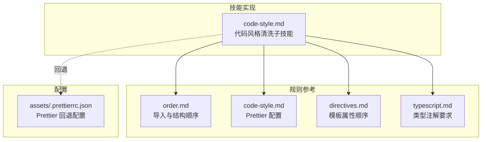
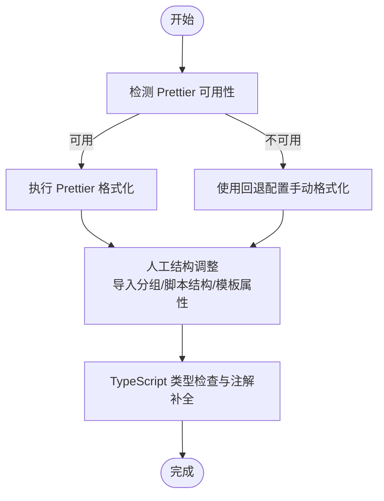
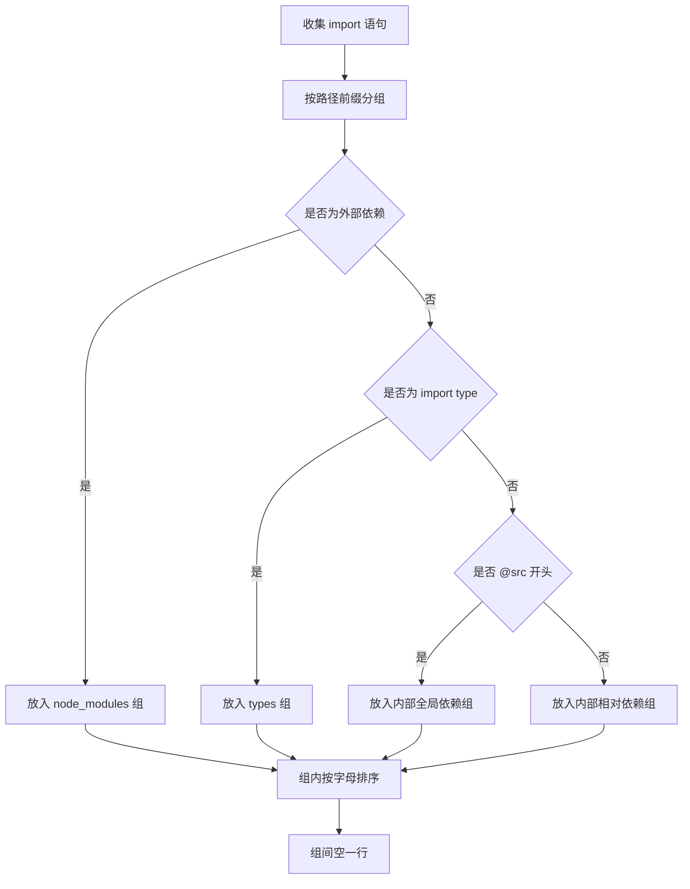
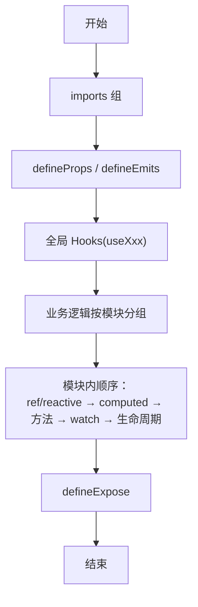
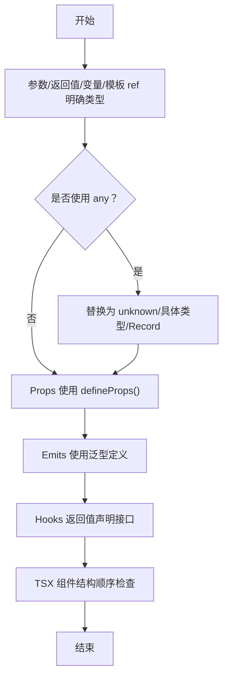
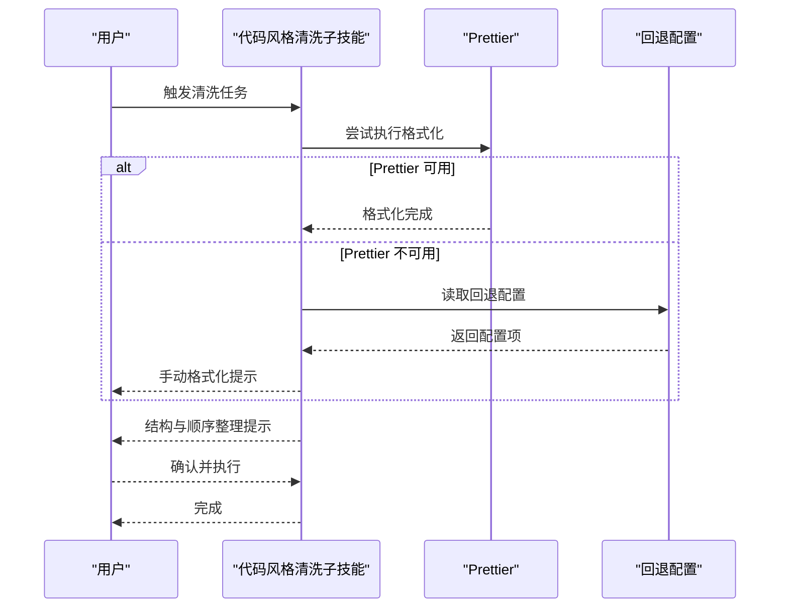
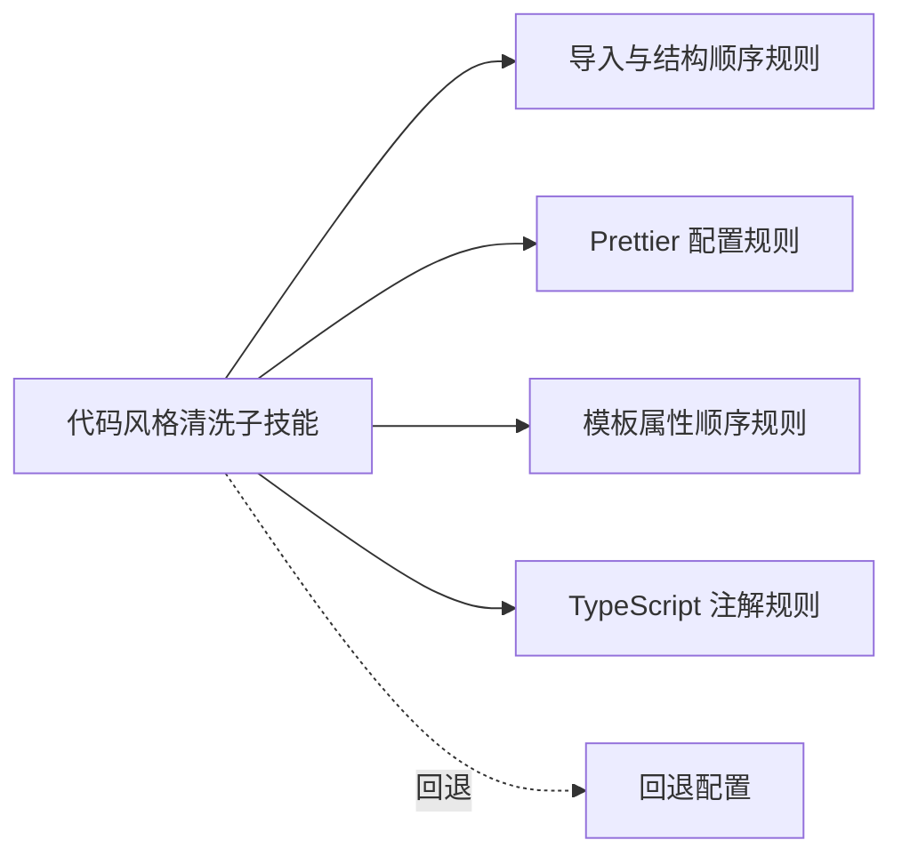

# 代码风格清洗

<cite>
**本文引用的文件**
- [skills/yy-frontend-vue3-code-optimization/sub-skills/code-style.md](file://skills/yy-frontend-vue3-code-optimization/sub-skills/code-style.md)
- [rules/frontend-rules-vue3/references/order.md](file://rules/frontend-rules-vue3/references/order.md)
- [rules/frontend-rules-vue3/references/code-style.md](file://rules/frontend-rules-vue3/references/code-style.md)
- [rules/frontend-rules-vue3/references/directives.md](file://rules/frontend-rules-vue3/references/directives.md)
- [rules/frontend-rules-vue3/references/typescript.md](file://rules/frontend-rules-vue3/references/typescript.md)
- [skills/yy-frontend-vue3-code-optimization/assets/.prettierrc.json](file://skills/yy-frontend-vue3-code-optimization/assets/.prettierrc.json)
</cite>

## 目录
1. [简介](#简介)
2. [项目结构](#项目结构)
3. [核心组件](#核心组件)
4. [架构总览](#架构总览)
5. [详细组件分析](#详细组件分析)
6. [依赖分析](#依赖分析)
7. [性能考量](#性能考量)
8. [故障排查指南](#故障排查指南)
9. [结论](#结论)
10. [附录](#附录)

## 简介
本技能面向 Vue3 前端工程，提供“代码风格与格式清洗”的系统化执行方案。其目标是在保证代码一致性的同时，兼顾 Prettier 自动化格式化与人工结构调整的协同，确保导入顺序、SFC 结构、模板属性、TypeScript 类型注解等关键规范得到严格执行，并提供回退策略与最佳实践，帮助团队在大规模重构与日常维护中保持高质量的代码风格。

## 项目结构
本技能与规则分布于以下位置：
- 技能实现：skills/yy-frontend-vue3-code-optimization/sub-skills/code-style.md
- 规则参考：rules/frontend-rules-vue3/references/*
- Prettier 配置：skills/yy-frontend-vue3-code-optimization/assets/.prettierrc.json

图表来源
- [skills/yy-frontend-vue3-code-optimization/sub-skills/code-style.md:1-353](file://skills/yy-frontend-vue3-code-optimization/sub-skills/code-style.md#L1-L353)
- [rules/frontend-rules-vue3/references/order.md:1-141](file://rules/frontend-rules-vue3/references/order.md#L1-L141)
- [rules/frontend-rules-vue3/references/code-style.md:1-49](file://rules/frontend-rules-vue3/references/code-style.md#L1-L49)
- [rules/frontend-rules-vue3/references/directives.md:1-105](file://rules/frontend-rules-vue3/references/directives.md#L1-L105)
- [rules/frontend-rules-vue3/references/typescript.md:1-202](file://rules/frontend-rules-vue3/references/typescript.md#L1-L202)
- [skills/yy-frontend-vue3-code-optimization/assets/.prettierrc.json:1-20](file://skills/yy-frontend-vue3-code-optimization/assets/.prettierrc.json#L1-L20)

章节来源
- [skills/yy-frontend-vue3-code-optimization/sub-skills/code-style.md:1-353](file://skills/yy-frontend-vue3-code-optimization/sub-skills/code-style.md#L1-L353)
- [rules/frontend-rules-vue3/references/order.md:1-141](file://rules/frontend-rules-vue3/references/order.md#L1-L141)
- [rules/frontend-rules-vue3/references/code-style.md:1-49](file://rules/frontend-rules-vue3/references/code-style.md#L1-L49)
- [rules/frontend-rules-vue3/references/directives.md:1-105](file://rules/frontend-rules-vue3/references/directives.md#L1-L105)
- [rules/frontend-rules-vue3/references/typescript.md:1-202](file://rules/frontend-rules-vue3/references/typescript.md#L1-L202)
- [skills/yy-frontend-vue3-code-optimization/assets/.prettierrc.json:1-20](file://skills/yy-frontend-vue3-code-optimization/assets/.prettierrc.json#L1-L20)

## 核心组件
- Prettier 自动格式化：优先使用项目自有配置，统一缩进、引号、分号、行宽、尾随逗号等。
- 手动结构调整：在 Prettier 无法覆盖的结构层面（导入分组、SFC 块顺序、脚本内部声明顺序、模板属性顺序、函数写法偏好）进行人工整理。
- 回退策略：当项目未安装 Prettier 时，依据技能资产中的回退配置进行手动格式化。
- TypeScript 类型注解：强制参数、返回值、变量、模板 ref 的类型标注；禁止 any，优先使用具体类型或 unknown/Record 等替代。
- 模板属性顺序：统一 is → v-for → v-if/v-else-if/v-else → v-show → id → props/attrs → v-on/@ → v-html/v-text → 动态 v-slot/# 的顺序。

章节来源
- [skills/yy-frontend-vue3-code-optimization/sub-skills/code-style.md:26-50](file://skills/yy-frontend-vue3-code-optimization/sub-skills/code-style.md#L26-L50)
- [rules/frontend-rules-vue3/references/typescript.md:7-13](file://rules/frontend-rules-vue3/references/typescript.md#L7-L13)
- [rules/frontend-rules-vue3/references/directives.md:80-98](file://rules/frontend-rules-vue3/references/directives.md#L80-L98)

## 架构总览
整体流程分为“自动化格式化 + 人工结构调整 + 回退处理”三层，确保在不同环境下都能稳定输出一致的代码风格。

图表来源
- [skills/yy-frontend-vue3-code-optimization/sub-skills/code-style.md:26-50](file://skills/yy-frontend-vue3-code-optimization/sub-skills/code-style.md#L26-L50)
- [skills/yy-frontend-vue3-code-optimization/assets/.prettierrc.json:1-20](file://skills/yy-frontend-vue3-code-optimization/assets/.prettierrc.json#L1-L20)
- [rules/frontend-rules-vue3/references/typescript.md:7-13](file://rules/frontend-rules-vue3/references/typescript.md#L7-L13)

## 详细组件分析

### Prettier 集成与回退策略
- 优先使用项目自有 Prettier 配置进行格式化，确保团队风格一致。
- 当 Prettier 命令不可用时，参考技能资产中的回退配置进行手动格式化，关键点包括：缩进 2 空格、JS/TS/JSX/TSX 单引号、Vue 模板属性双引号、强制分号、尾随逗号、箭头函数单参数无括号、行宽 120、对象花括号保留空格、不强制属性独占一行等。
- 回退配置文件路径：skills/yy-frontend-vue3-code-optimization/assets/.prettierrc.json。

章节来源
- [skills/yy-frontend-vue3-code-optimization/sub-skills/code-style.md:28-50](file://skills/yy-frontend-vue3-code-optimization/sub-skills/code-style.md#L28-L50)
- [skills/yy-frontend-vue3-code-optimization/assets/.prettierrc.json:1-20](file://skills/yy-frontend-vue3-code-optimization/assets/.prettierrc.json#L1-L20)

### 导入排序（四组规则）
- 分组原则：外部依赖 → 类型导入 → 内部全局依赖(@src/) → 内部相对依赖(./、../)，组间空一行，组内按字母顺序排列。
- 适用范围：所有 .vue/.js/.jsx/.ts/.tsx 文件的 import 语句。
- 实施要点：先按组拆分，再逐组内排序，最后统一空行分隔。

图表来源
- [rules/frontend-rules-vue3/references/order.md:92-128](file://rules/frontend-rules-vue3/references/order.md#L92-L128)
- [skills/yy-frontend-vue3-code-optimization/sub-skills/code-style.md:66-98](file://skills/yy-frontend-vue3-code-optimization/sub-skills/code-style.md#L66-L98)

章节来源
- [rules/frontend-rules-vue3/references/order.md:92-128](file://rules/frontend-rules-vue3/references/order.md#L92-L128)
- [skills/yy-frontend-vue3-code-optimization/sub-skills/code-style.md:66-98](file://skills/yy-frontend-vue3-code-optimization/sub-skills/code-style.md#L66-L98)

### `<script setup>` 结构的严格顺序
- 宏观顺序：imports → defineProps/defineEmits → 全局 Hooks → 业务逻辑（按功能模块分组，模块内：ref/reactive → computed → 方法 → watch → 生命周期）→ defineExpose。
- 业务模块内部顺序：ref/reactive → computed → 方法 → watch → 生命周期钩子。
- 适用范围：所有 .vue 文件的 <script setup> 块。

图表来源
- [rules/frontend-rules-vue3/references/order.md:15-112](file://rules/frontend-rules-vue3/references/order.md#L15-L112)
- [skills/yy-frontend-vue3-code-optimization/sub-skills/code-style.md:100-196](file://skills/yy-frontend-vue3-code-optimization/sub-skills/code-style.md#L100-L196)

章节来源
- [rules/frontend-rules-vue3/references/order.md:15-112](file://rules/frontend-rules-vue3/references/order.md#L15-L112)
- [skills/yy-frontend-vue3-code-optimization/sub-skills/code-style.md:100-196](file://skills/yy-frontend-vue3-code-optimization/sub-skills/code-style.md#L100-L196)

### 业务模块内部组织原则
- 每个功能模块内部遵循：ref/reactive → computed → 方法 → watch → 生命周期钩子。
- 模块之间通过注释分组（如“表单模块”、“表格模块”、“弹窗模块”）提升可读性与可维护性。
- 保持模块内职责单一，避免跨模块耦合。

章节来源
- [rules/frontend-rules-vue3/references/order.md:27-35](file://rules/frontend-rules-vue3/references/order.md#L27-L35)
- [skills/yy-frontend-vue3-code-optimization/sub-skills/code-style.md:139-190](file://skills/yy-frontend-vue3-code-optimization/sub-skills/code-style.md#L139-L190)

### 模板属性的标准化顺序
- 统一顺序：is → v-for → v-if/v-else-if/v-else → v-show → id → props/attrs → v-on/@ → v-html/v-text → 动态 v-slot/#。
- 指令简写：优先使用 :attr、@event、#name 等简写形式，避免冗长写法。
- 模板职责：仅负责展示，不写复杂表达式；简单逻辑可内联，不为简单逻辑额外创建函数。

章节来源
- [rules/frontend-rules-vue3/references/directives.md:80-98](file://rules/frontend-rules-vue3/references/directives.md#L80-L98)
- [skills/yy-frontend-vue3-code-optimization/sub-skills/code-style.md:215-232](file://skills/yy-frontend-vue3-code-optimization/sub-skills/code-style.md#L215-L232)

### TypeScript 与 TSX 的类型注解要求
- 参数、返回值、变量、模板 ref 必须明确类型标注；模板 ref 如 formRef 应指定元素类型。
- 禁止使用 any，优先使用 unknown、Record<string, unknown>、具体接口/类型别名。
- Props 使用 defineProps<T>() 泛型定义，必要时使用 withDefaults() 设置默认值。
- Emits 使用 TypeScript 泛型定义，避免运行时对象形式。
- Hooks 返回值声明类型接口；类型导入使用 import type，减少运行时依赖。
- TSX 组件结构顺序：imports → 类型定义 → defineComponent → name → props（含类型）→ emits → setup → 返回渲染函数。

图表来源
- [rules/frontend-rules-vue3/references/typescript.md:7-13](file://rules/frontend-rules-vue3/references/typescript.md#L7-L13)
- [rules/frontend-rules-vue3/references/typescript.md:33-71](file://rules/frontend-rules-vue3/references/typescript.md#L33-L71)
- [rules/frontend-rules-vue3/references/typescript.md:129-144](file://rules/frontend-rules-vue3/references/typescript.md#L129-L144)
- [rules/frontend-rules-vue3/references/typescript.md:148-170](file://rules/frontend-rules-vue3/references/typescript.md#L148-L170)
- [skills/yy-frontend-vue3-code-optimization/sub-skills/code-style.md:234-353](file://skills/yy-frontend-vue3-code-optimization/sub-skills/code-style.md#L234-L353)

章节来源
- [rules/frontend-rules-vue3/references/typescript.md:7-13](file://rules/frontend-rules-vue3/references/typescript.md#L7-L13)
- [rules/frontend-rules-vue3/references/typescript.md:33-71](file://rules/frontend-rules-vue3/references/typescript.md#L33-L71)
- [rules/frontend-rules-vue3/references/typescript.md:129-144](file://rules/frontend-rules-vue3/references/typescript.md#L129-L144)
- [rules/frontend-rules-vue3/references/typescript.md:148-170](file://rules/frontend-rules-vue3/references/typescript.md#L148-L170)
- [skills/yy-frontend-vue3-code-optimization/sub-skills/code-style.md:234-353](file://skills/yy-frontend-vue3-code-optimization/sub-skills/code-style.md#L234-L353)

### 执行流程与最佳实践
- 执行步骤：优先调用 Prettier 格式化；若失败则参考回退配置手动格式化；随后进行结构与顺序整理（导入分组、脚本结构、模板属性、函数写法偏好）。
- 最佳实践：
  - 在执行前确保分支干净，避免大规模 diff 带来的合并冲突。
  - 对复杂导入依赖关系，优先拆分为独立模块，减少循环依赖。
  - 保持模块内职责单一，使用注释清晰划分功能模块。
  - 在 TSX 与 .vue 之间优先选择 .vue + <script setup>，仅在必要时使用 TSX。

图表来源
- [skills/yy-frontend-vue3-code-optimization/sub-skills/code-style.md:26-50](file://skills/yy-frontend-vue3-code-optimization/sub-skills/code-style.md#L26-L50)
- [skills/yy-frontend-vue3-code-optimization/assets/.prettierrc.json:1-20](file://skills/yy-frontend-vue3-code-optimization/assets/.prettierrc.json#L1-L20)

章节来源
- [skills/yy-frontend-vue3-code-optimization/sub-skills/code-style.md:26-50](file://skills/yy-frontend-vue3-code-optimization/sub-skills/code-style.md#L26-L50)
- [skills/yy-frontend-vue3-code-optimization/sub-skills/code-style.md:51-232](file://skills/yy-frontend-vue3-code-optimization/sub-skills/code-style.md#L51-L232)

## 依赖分析
- 技能对规则的依赖：导入排序、SFC 结构顺序、模板属性顺序、TypeScript 注解要求均来自规则参考文件。
- 技能对配置的依赖：Prettier 配置优先项目自有配置，回退配置用于命令不可用场景。
- 耦合与内聚：技能将“自动化 + 人工 + 回退”整合为单一入口，规则与配置分别承担“规范 + 标准”，内聚度高、耦合度低。

图表来源
- [skills/yy-frontend-vue3-code-optimization/sub-skills/code-style.md:1-353](file://skills/yy-frontend-vue3-code-optimization/sub-skills/code-style.md#L1-L353)
- [rules/frontend-rules-vue3/references/order.md:1-141](file://rules/frontend-rules-vue3/references/order.md#L1-L141)
- [rules/frontend-rules-vue3/references/code-style.md:1-49](file://rules/frontend-rules-vue3/references/code-style.md#L1-L49)
- [rules/frontend-rules-vue3/references/directives.md:1-105](file://rules/frontend-rules-vue3/references/directives.md#L1-L105)
- [rules/frontend-rules-vue3/references/typescript.md:1-202](file://rules/frontend-rules-vue3/references/typescript.md#L1-L202)
- [skills/yy-frontend-vue3-code-optimization/assets/.prettierrc.json:1-20](file://skills/yy-frontend-vue3-code-optimization/assets/.prettierrc.json#L1-L20)

章节来源
- [skills/yy-frontend-vue3-code-optimization/sub-skills/code-style.md:1-353](file://skills/yy-frontend-vue3-code-optimization/sub-skills/code-style.md#L1-L353)
- [rules/frontend-rules-vue3/references/order.md:1-141](file://rules/frontend-rules-vue3/references/order.md#L1-L141)
- [rules/frontend-rules-vue3/references/code-style.md:1-49](file://rules/frontend-rules-vue3/references/code-style.md#L1-L49)
- [rules/frontend-rules-vue3/references/directives.md:1-105](file://rules/frontend-rules-vue3/references/directives.md#L1-L105)
- [rules/frontend-rules-vue3/references/typescript.md:1-202](file://rules/frontend-rules-vue3/references/typescript.md#L1-L202)
- [skills/yy-frontend-vue3-code-optimization/assets/.prettierrc.json:1-20](file://skills/yy-frontend-vue3-code-optimization/assets/.prettierrc.json#L1-L20)

## 性能考量
- 格式化会改变缩进、引号、分号等，导致 git diff 行数增加，影响 Code Review 效率；建议在干净分支执行，避免多人协作分支的合并冲突。
- 导入分组与模块化有助于减少不必要的运行时依赖，间接提升打包与运行效率。
- 模板层尽量保持轻量化，避免在模板中执行昂贵计算，优先使用 computed。

章节来源
- [skills/yy-frontend-vue3-code-optimization/sub-skills/code-style.md:16-25](file://skills/yy-frontend-vue3-code-optimization/sub-skills/code-style.md#L16-L25)
- [rules/frontend-rules-vue3/references/performance.md:99-104](file://rules/frontend-rules-vue3/references/performance.md#L99-L104)

## 故障排查指南
- Prettier 命令不可用：检查本地是否安装 Prettier；若未安装，参考回退配置进行手动格式化。
- 格式化后仍存在结构问题：确认已按导入分组、SFC 结构顺序、模板属性顺序进行人工整理。
- TypeScript 类型报错：检查参数/返回值/变量/模板 ref 是否具备明确类型；避免使用 any。
- 模板指令不规范：确认指令简写与顺序符合规范，避免使用完整写法与错误顺序。

章节来源
- [skills/yy-frontend-vue3-code-optimization/sub-skills/code-style.md:28-50](file://skills/yy-frontend-vue3-code-optimization/sub-skills/code-style.md#L28-L50)
- [rules/frontend-rules-vue3/references/typescript.md:14-29](file://rules/frontend-rules-vue3/references/typescript.md#L14-L29)
- [rules/frontend-rules-vue3/references/directives.md:60-76](file://rules/frontend-rules-vue3/references/directives.md#L60-L76)

## 结论
本技能通过“Prettier 自动化 + 人工结构调整 + 回退处理”的组合，系统化解决了 Vue3 项目的代码风格与格式问题。结合导入分组、SFC 结构顺序、模板属性顺序与 TypeScript 注解要求，能够在保证一致性的同时，兼顾可维护性与团队协作效率。建议在执行前做好分支管理与风险提示，并持续在团队内推广统一的规则与最佳实践。

## 附录
- 相关规则文件清单：
  - 导入与结构顺序：rules/frontend-rules-vue3/references/order.md
  - Prettier 配置：rules/frontend-rules-vue3/references/code-style.md
  - 模板属性顺序：rules/frontend-rules-vue3/references/directives.md
  - TypeScript 注解：rules/frontend-rules-vue3/references/typescript.md
  - 技能实现：skills/yy-frontend-vue3-code-optimization/sub-skills/code-style.md
  - 回退配置：skills/yy-frontend-vue3-code-optimization/assets/.prettierrc.json