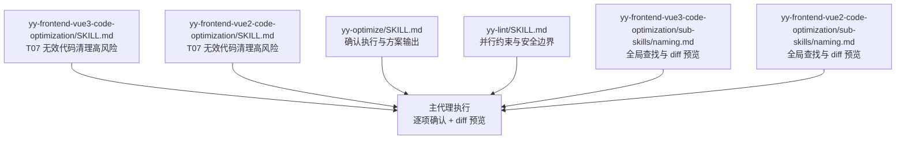
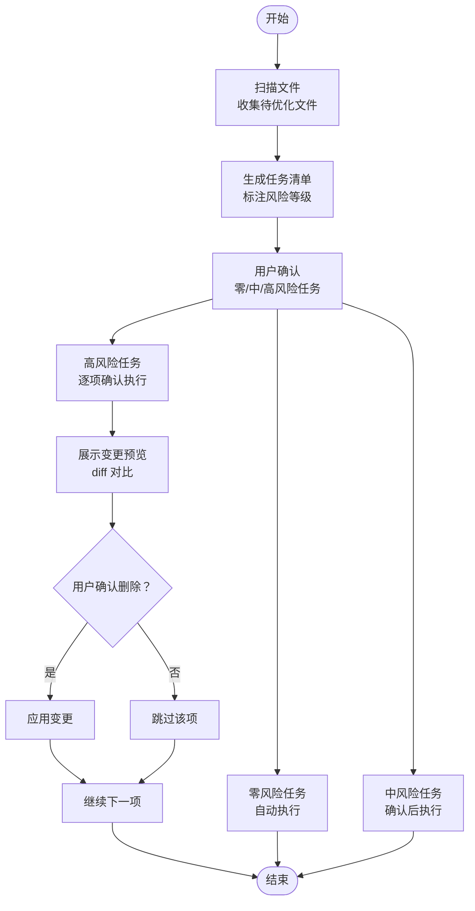
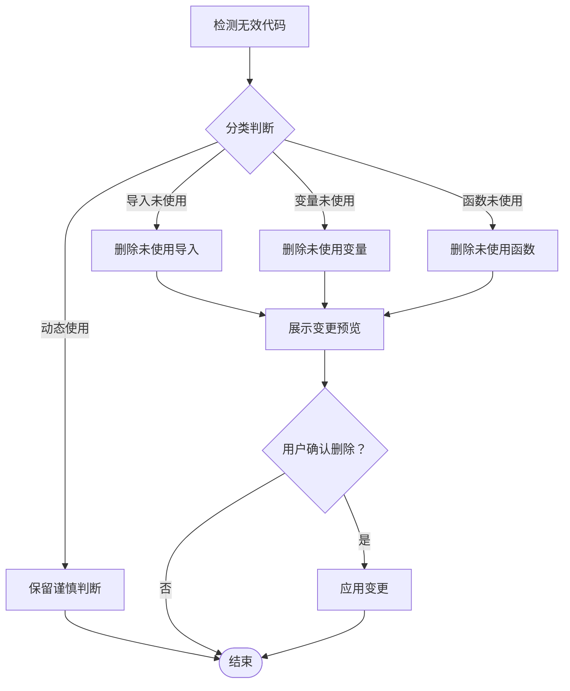
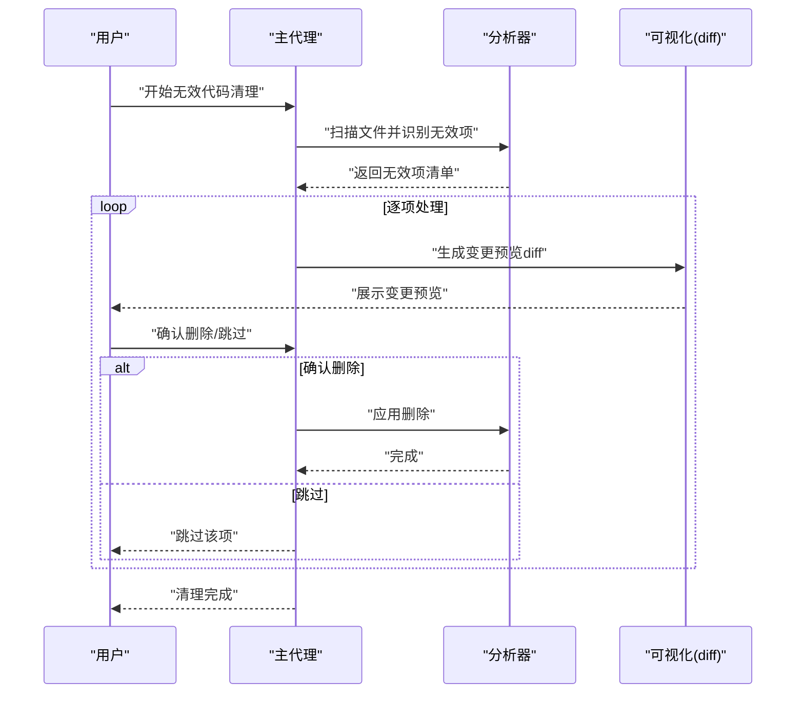
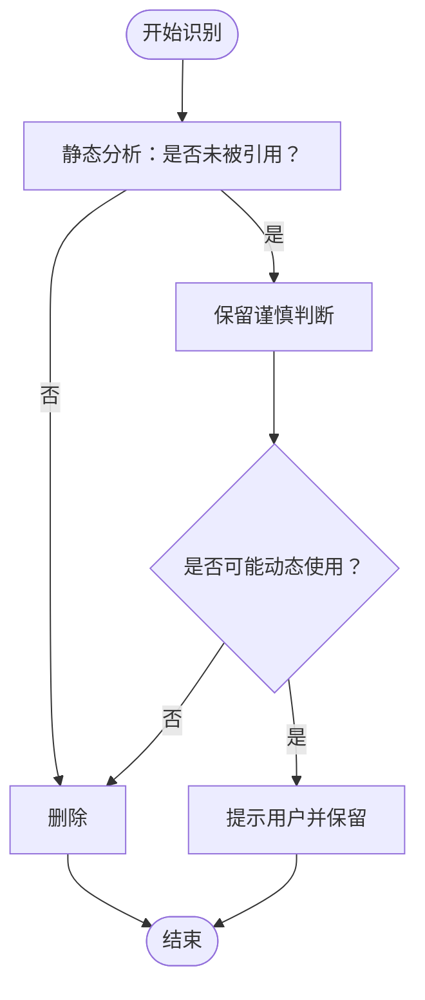
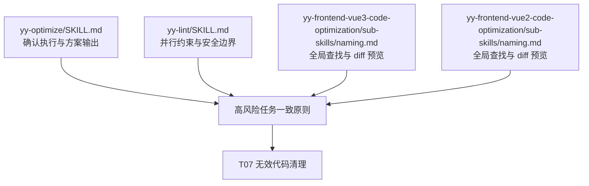

# 无效代码清理

<cite>
**本文引用的文件**
- [yy-frontend-vue3-code-optimization/SKILL.md](file://skills/yy-frontend-vue3-code-optimization/SKILL.md)
- [yy-frontend-vue2-code-optimization/SKILL.md](file://skills/yy-frontend-vue2-code-optimization/SKILL.md)
- [yy-frontend-vue3-code-optimization/sub-skills/naming.md](file://skills/yy-frontend-vue3-code-optimization/sub-skills/naming.md)
- [yy-frontend-vue2-code-optimization/sub-skills/naming.md](file://skills/yy-frontend-vue2-code-optimization/sub-skills/naming.md)
- [yy-optimize/SKILL.md](file://skills/yy-optimize/SKILL.md)
- [yy-lint/SKILL.md](file://skills/yy-lint/SKILL.md)
</cite>

## 目录
1. [简介](#简介)
2. [项目结构](#项目结构)
3. [核心组件](#核心组件)
4. [架构概览](#架构概览)
5. [详细组件分析](#详细组件分析)
6. [依赖分析](#依赖分析)
7. [性能考量](#性能考量)
8. [故障排查指南](#故障排查指南)
9. [结论](#结论)
10. [附录](#附录)

## 简介
本文件面向“无效代码清理”这一高风险子技能，系统阐述其在 Vue2/Vue3 代码优化体系中的定位、执行策略与安全机制。该子技能聚焦于三类无效代码的识别与清理：未使用的导入语句、未使用的变量声明、未使用的函数定义。为确保变更安全，系统采用“逐项确认 + 变更预览”的双重保障，并在清理过程中引入“谨慎判断”原则，以区分静态分析可见的“真正未使用”与可能在运行时动态使用的“潜在有效”代码。

## 项目结构
无效代码清理作为“代码优化技能”的一部分，分别在 Vue3 与 Vue2 两条主线中提供一致的执行框架与安全边界：
- Vue3 主线：在“yy-frontend-vue3-code-optimization”技能中，T07 为高风险任务，由主代理执行，逐项确认并展示 diff。
- Vue2 主线：在“yy-frontend-vue2-code-optimization”技能中，T07 同样为高风险任务，执行方式与 Vue3 一致。
- 通用安全机制：在“yy-optimize”和“yy-lint”中体现了“确认执行”“变更预览”“并行约束”等通用原则，为无效代码清理提供方法论支撑。

**图表来源**
- [yy-frontend-vue3-code-optimization/SKILL.md:298-313](file://skills/yy-frontend-vue3-code-optimization/SKILL.md#L298-L313)
- [yy-frontend-vue2-code-optimization/SKILL.md:272-287](file://skills/yy-frontend-vue2-code-optimization/SKILL.md#L272-L287)
- [yy-optimize/SKILL.md:83-97](file://skills/yy-optimize/SKILL.md#L83-L97)
- [yy-lint/SKILL.md:64-69](file://skills/yy-lint/SKILL.md#L64-L69)
- [yy-frontend-vue3-code-optimization/sub-skills/naming.md:15-19](file://skills/yy-frontend-vue3-code-optimization/sub-skills/naming.md#L15-L19)
- [yy-frontend-vue2-code-optimization/sub-skills/naming.md:14-18](file://skills/yy-frontend-vue2-code-optimization/sub-skills/naming.md#L14-L18)

**章节来源**
- [yy-frontend-vue3-code-optimization/SKILL.md:298-313](file://skills/yy-frontend-vue3-code-optimization/SKILL.md#L298-L313)
- [yy-frontend-vue2-code-optimization/SKILL.md:272-287](file://skills/yy-frontend-vue2-code-optimization/SKILL.md#L272-L287)
- [yy-optimize/SKILL.md:83-97](file://skills/yy-optimize/SKILL.md#L83-L97)
- [yy-lint/SKILL.md:64-69](file://skills/yy-lint/SKILL.md#L64-L69)
- [yy-frontend-vue3-code-optimization/sub-skills/naming.md:15-19](file://skills/yy-frontend-vue3-code-optimization/sub-skills/naming.md#L15-L19)
- [yy-frontend-vue2-code-optimization/sub-skills/naming.md:14-18](file://skills/yy-frontend-vue2-code-optimization/sub-skills/naming.md#L14-L18)

## 核心组件
- 任务定位与风险等级
  - Vue3：T07 为“🔴 高风险”，由主代理执行，逐项确认并展示 diff。
  - Vue2：T07 为“🔴 高风险”，执行方式与 Vue3 一致。
- 清理范围与边界
  - 仅清理未使用的导入语句、未使用的变量声明、未使用的函数定义。
  - 严格区分“真正未使用”与“可能在运行时动态使用”的代码，保留后者。
  - 不处理样式文件（.css/.scss/.less）。
- 安全机制
  - 逐项确认：每发现一个无效项，先展示位置与代码，由用户确认是否删除。
  - 变更预览：以 diff 形式呈现，确保用户对变更有直观认知。
  - 通用原则：与“yy-optimize”“yy-lint”协同，遵循“确认执行”“并行约束”“安全边界”。

**章节来源**
- [yy-frontend-vue3-code-optimization/SKILL.md:298-313](file://skills/yy-frontend-vue3-code-optimization/SKILL.md#L298-L313)
- [yy-frontend-vue2-code-optimization/SKILL.md:272-287](file://skills/yy-frontend-vue2-code-optimization/SKILL.md#L272-L287)

## 架构概览
无效代码清理在整体优化流程中的位置如下：
- 前置检测与文件扫描
- 任务清单生成（含风险等级）
- 用户确认
- 任务执行（零风险自动执行；中风险需确认；高风险逐项确认）
- 结果汇总与变更对比

**图表来源**
- [yy-frontend-vue3-code-optimization/SKILL.md:141-165](file://skills/yy-frontend-vue3-code-optimization/SKILL.md#L141-L165)
- [yy-frontend-vue2-code-optimization/SKILL.md:132-155](file://skills/yy-frontend-vue2-code-optimization/SKILL.md#L132-L155)
- [yy-optimize/SKILL.md:83-97](file://skills/yy-optimize/SKILL.md#L83-L97)

**章节来源**
- [yy-frontend-vue3-code-optimization/SKILL.md:141-165](file://skills/yy-frontend-vue3-code-optimization/SKILL.md#L141-L165)
- [yy-frontend-vue2-code-optimization/SKILL.md:132-155](file://skills/yy-frontend-vue2-code-optimization/SKILL.md#L132-L155)
- [yy-optimize/SKILL.md:83-97](file://skills/yy-optimize/SKILL.md#L83-L97)

## 详细组件分析

### 无效代码清理的识别与清理策略
- 识别范围
  - 未使用的导入语句（import/require）
  - 未使用的变量声明（const/let/var）
  - 未使用的函数定义（函数声明、具名函数表达式）
- 清理原则
  - 仅删除确实未被引用的代码
  - 保留可能在运行时动态使用的代码（如全局注册的组件、通过字符串动态调用的方法）
  - 不处理样式文件（.css/.scss/.less）

**图表来源**
- [yy-frontend-vue3-code-optimization/SKILL.md:304-312](file://skills/yy-frontend-vue3-code-optimization/SKILL.md#L304-L312)
- [yy-frontend-vue2-code-optimization/SKILL.md:278-286](file://skills/yy-frontend-vue2-code-optimization/SKILL.md#L278-L286)

**章节来源**
- [yy-frontend-vue3-code-optimization/SKILL.md:304-312](file://skills/yy-frontend-vue3-code-optimization/SKILL.md#L304-L312)
- [yy-frontend-vue2-code-optimization/SKILL.md:278-286](file://skills/yy-frontend-vue2-code-optimization/SKILL.md#L278-L286)

### 逐项确认流程与变更预览
- 逐项确认
  - 每发现一个无效项，先展示位置与代码，由用户确认是否删除
- 变更预览
  - 以 diff 形式呈现，确保用户对变更有直观认知
- 与命名重构的协同
  - 命名重构强调“全局查找 + 分类替换 + diff 预览”，与无效代码清理的“逐项确认 + diff 预览”形成一致的安全基线

**图表来源**
- [yy-frontend-vue3-code-optimization/SKILL.md:298-313](file://skills/yy-frontend-vue3-code-optimization/SKILL.md#L298-L313)
- [yy-frontend-vue2-code-optimization/SKILL.md:272-287](file://skills/yy-frontend-vue2-code-optimization/SKILL.md#L272-L287)
- [yy-frontend-vue3-code-optimization/sub-skills/naming.md:15-19](file://skills/yy-frontend-vue3-code-optimization/sub-skills/naming.md#L15-L19)
- [yy-frontend-vue2-code-optimization/sub-skills/naming.md:14-18](file://skills/yy-frontend-vue2-code-optimization/sub-skills/naming.md#L14-L18)

**章节来源**
- [yy-frontend-vue3-code-optimization/SKILL.md:298-313](file://skills/yy-frontend-vue3-code-optimization/SKILL.md#L298-L313)
- [yy-frontend-vue2-code-optimization/SKILL.md:272-287](file://skills/yy-frontend-vue2-code-optimization/SKILL.md#L272-L287)
- [yy-frontend-vue3-code-optimization/sub-skills/naming.md:15-19](file://skills/yy-frontend-vue3-code-optimization/sub-skills/naming.md#L15-L19)
- [yy-frontend-vue2-code-optimization/sub-skills/naming.md:14-18](file://skills/yy-frontend-vue2-code-optimization/sub-skills/naming.md#L14-L18)

### 谨慎判断原则与边界
- 仅删除确实未被引用的代码
- 保留可能在运行时动态使用的代码
  - 全局注册的组件：可能通过字符串或全局 API 注册，不应删除
  - 字符串动态调用的方法：如 eval/Function/new Function 或基于字符串的事件/方法名调用，不应删除
- 不处理样式文件（.css/.scss/.less）

**图表来源**
- [yy-frontend-vue3-code-optimization/SKILL.md:308-312](file://skills/yy-frontend-vue3-code-optimization/SKILL.md#L308-L312)
- [yy-frontend-vue2-code-optimization/SKILL.md:282-286](file://skills/yy-frontend-vue2-code-optimization/SKILL.md#L282-L286)

**章节来源**
- [yy-frontend-vue3-code-optimization/SKILL.md:308-312](file://skills/yy-frontend-vue3-code-optimization/SKILL.md#L308-L312)
- [yy-frontend-vue2-code-optimization/SKILL.md:282-286](file://skills/yy-frontend-vue2-code-optimization/SKILL.md#L282-L286)

### 具体示例与最佳实践
- 示例场景
  - 未使用导入：某工具函数被引入但未在代码中调用，清理后减少包体积与心智负担
  - 未使用变量：调试遗留的临时变量，清理后提升代码整洁度
  - 未使用函数：历史遗留的工具函数，清理后避免维护成本
- 最佳实践
  - 清理前备份：建议在执行前提交当前状态，以便随时回滚
  - 分批执行：大型文件建议分批优化，降低风险
  - 与 Lint 协同：在并行任务完成后统一执行 Lint，避免冲突
  - 与命名重构协同：命名重构强调“全局查找 + 分类替换 + diff 预览”，可借鉴其严谨流程

**章节来源**
- [yy-frontend-vue3-code-optimization/SKILL.md:179-191](file://skills/yy-frontend-vue3-code-optimization/SKILL.md#L179-L191)
- [yy-frontend-vue2-code-optimization/SKILL.md:169-180](file://skills/yy-frontend-vue2-code-optimization/SKILL.md#L169-L180)
- [yy-lint/SKILL.md:64-69](file://skills/yy-lint/SKILL.md#L64-L69)
- [yy-frontend-vue3-code-optimization/sub-skills/naming.md:15-19](file://skills/yy-frontend-vue3-code-optimization/sub-skills/naming.md#L15-L19)
- [yy-frontend-vue2-code-optimization/sub-skills/naming.md:14-18](file://skills/yy-frontend-vue2-code-optimization/sub-skills/naming.md#L14-L18)

## 依赖分析
- 与“yy-optimize”的关系
  - 两者均强调“确认执行”“逐项确认”“变更预览”，在高风险任务上形成一致的安全基线
- 与“yy-lint”的关系
  - “yy-lint”规定“并行任务约束”，避免在多个任务并行修改文件时执行 Lint，从而减少冲突
- 与“命名重构”的关系
  - 命名重构强调“全局查找 + 分类替换 + diff 预览”，与无效代码清理的“逐项确认 + diff 预览”形成方法论协同

**图表来源**
- [yy-optimize/SKILL.md:83-97](file://skills/yy-optimize/SKILL.md#L83-L97)
- [yy-lint/SKILL.md:64-69](file://skills/yy-lint/SKILL.md#L64-L69)
- [yy-frontend-vue3-code-optimization/sub-skills/naming.md:15-19](file://skills/yy-frontend-vue3-code-optimization/sub-skills/naming.md#L15-L19)
- [yy-frontend-vue2-code-optimization/sub-skills/naming.md:14-18](file://skills/yy-frontend-vue2-code-optimization/sub-skills/naming.md#L14-L18)

**章节来源**
- [yy-optimize/SKILL.md:83-97](file://skills/yy-optimize/SKILL.md#L83-L97)
- [yy-lint/SKILL.md:64-69](file://skills/yy-lint/SKILL.md#L64-L69)
- [yy-frontend-vue3-code-optimization/sub-skills/naming.md:15-19](file://skills/yy-frontend-vue3-code-optimization/sub-skills/naming.md#L15-L19)
- [yy-frontend-vue2-code-optimization/sub-skills/naming.md:14-18](file://skills/yy-frontend-vue2-code-optimization/sub-skills/naming.md#L14-L18)

## 性能考量
- 识别阶段
  - 静态分析工具（如 AST）可高效定位未使用导入、变量与函数
  - 对于动态使用场景，建议结合“谨慎判断”原则，避免误删
- 执行阶段
  - 逐项确认与 diff 预览会增加交互成本，但显著降低风险
  - 建议分批执行大型文件，减少单次变更规模
- 协同阶段
  - 并行任务完成后统一执行 Lint，避免冲突与重复劳动

## 故障排查指南
- 误删动态使用代码
  - 现象：运行时报错，提示组件未注册或方法不存在
  - 处理：回滚变更，重新评估动态使用场景，必要时保留代码并添加注释说明
- 未删除真正无效代码
  - 现象：包体积未下降，代码冗余未清除
  - 处理：检查静态分析工具配置，确保覆盖所有动态使用场景
- 并行任务冲突
  - 现象：多个任务同时修改文件，导致 Lint 报错或冲突
  - 处理：遵循“yy-lint”的并行约束，在所有并行任务完成后统一执行 Lint

**章节来源**
- [yy-lint/SKILL.md:64-69](file://skills/yy-lint/SKILL.md#L64-L69)

## 结论
无效代码清理作为高风险子技能，通过“逐项确认 + 变更预览 + 谨慎判断”的三重保障，确保在提升代码整洁度的同时，最大限度地避免误删动态使用代码。结合“yy-optimize”“yy-lint”“命名重构”等通用机制，可形成一套完整的安全执行闭环，既保证效率，又确保质量。

## 附录
- 术语
  - 未使用导入：在当前文件中引入但未被引用的模块
  - 未使用变量：在当前文件中声明但未被引用的变量
  - 未使用函数：在当前文件中定义但未被引用的函数
- 相关文件
  - [yy-frontend-vue3-code-optimization/SKILL.md](file://skills/yy-frontend-vue3-code-optimization/SKILL.md)
  - [yy-frontend-vue2-code-optimization/SKILL.md](file://skills/yy-frontend-vue2-code-optimization/SKILL.md)
  - [yy-frontend-vue3-code-optimization/sub-skills/naming.md](file://skills/yy-frontend-vue3-code-optimization/sub-skills/naming.md)
  - [yy-frontend-vue2-code-optimization/sub-skills/naming.md](file://skills/yy-frontend-vue2-code-optimization/sub-skills/naming.md)
  - [yy-optimize/SKILL.md](file://skills/yy-optimize/SKILL.md)
  - [yy-lint/SKILL.md](file://skills/yy-lint/SKILL.md)