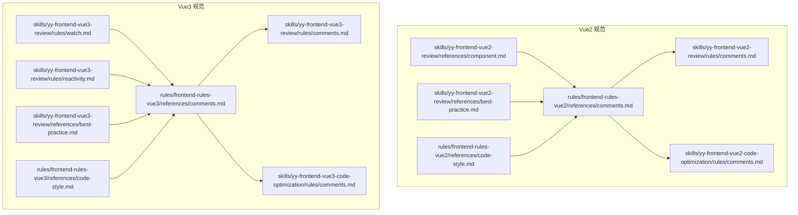
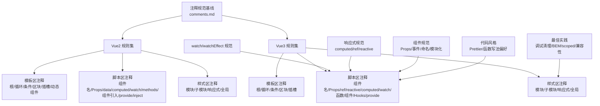
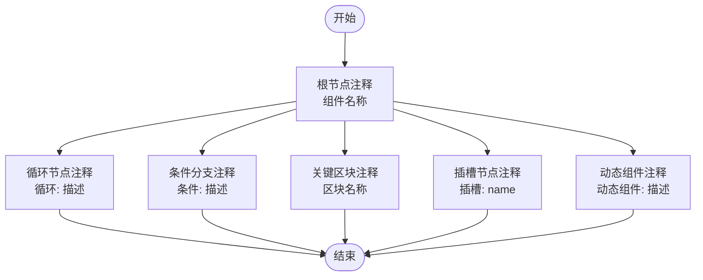
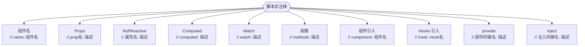
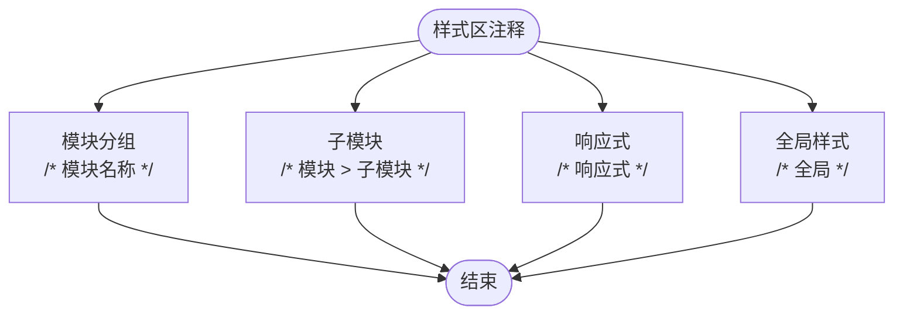
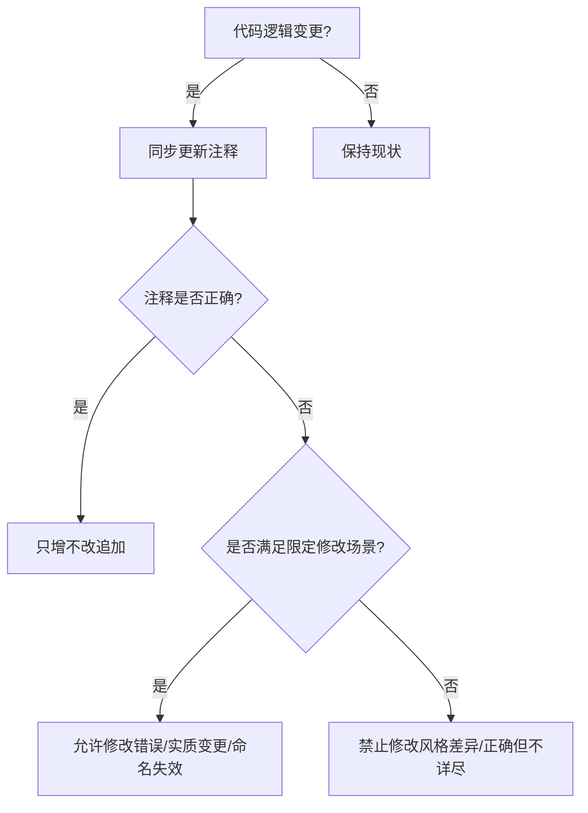
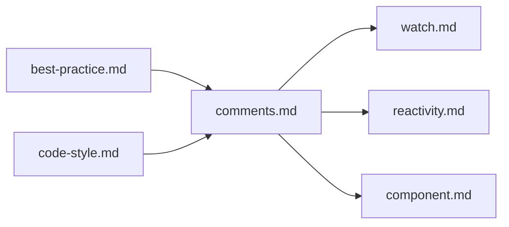

# 注释增强

<cite>
**本文档引用的文件**
- [rules/frontend-rules-vue2/references/comments.md](file://rules/frontend-rules-vue2/references/comments.md)
- [rules/frontend-rules-vue3/references/comments.md](file://rules/frontend-rules-vue3/references/comments.md)
- [skills/yy-frontend-vue2-review/rules/comments.md](file://skills/yy-frontend-vue2-review/rules/comments.md)
- [skills/yy-frontend-vue3-review/rules/comments.md](file://skills/yy-frontend-vue3-review/rules/comments.md)
- [skills/yy-frontend-vue2-code-optimization/rules/comments.md](file://skills/yy-frontend-vue2-code-optimization/rules/comments.md)
- [skills/yy-frontend-vue3-code-optimization/rules/comments.md](file://skills/yy-frontend-vue3-code-optimization/rules/comments.md)
- [skills/yy-frontend-vue3-review/rules/watch.md](file://skills/yy-frontend-vue3-review/rules/watch.md)
- [rules/frontend-rules-vue3/references/watch.md](file://rules/frontend-rules-vue3/references/watch.md)
- [skills/yy-frontend-vue3-review/references/best-practice.md](file://skills/yy-frontend-vue3-review/references/best-practice.md)
- [skills/yy-frontend-vue2-review/references/best-practice.md](file://skills/yy-frontend-vue2-review/references/best-practice.md)
- [rules/frontend-rules-vue2/references/code-style.md](file://rules/frontend-rules-vue2/references/code-style.md)
- [rules/frontend-rules-vue3/references/code-style.md](file://rules/frontend-rules-vue3/references/code-style.md)
- [skills/yy-frontend-vue2-review/references/component.md](file://skills/yy-frontend-vue2-review/references/component.md)
- [skills/yy-frontend-vue3-review/references/component.md](file://skills/yy-frontend-vue3-review/references/component.md)
- [rules/frontend-rules-vue3/references/reactivity.md](file://rules/frontend-rules-vue3/references/reactivity.md)
- [skills/yy-frontend-vue3-review/rules/reactivity.md](file://skills/yy-frontend-vue3-review/rules/reactivity.md)
- [skills/yy-frontend-vue3-code-optimization/rules/reactivity.md](file://skills/yy-frontend-vue3-code-optimization/rules/reactivity.md)
</cite>

## 目录
1. [简介](#简介)
2. [项目结构](#项目结构)
3. [核心组件](#核心组件)
4. [架构总览](#架构总览)
5. [详细组件分析](#详细组件分析)
6. [依赖关系分析](#依赖关系分析)
7. [性能考量](#性能考量)
8. [故障排查指南](#故障排查指南)
9. [结论](#结论)
10. [附录](#附录)

## 简介
本技能面向“注释增强”，目标是帮助开发者系统化地识别、保留与增强注释，确保注释与代码行为保持一致，并在必要时进行安全、可追溯的修改。文档覆盖模板区、脚本区、样式区的注释规范，以及 Vue2/Vue3 下的关键注释要求：模板节点（根节点、循环、条件、区块、插槽）、脚本区（组件名、Props、Ref/Reactive、Computed、Watch、Hooks、Methods、生命周期）、样式区（模块分组、子模块、响应式、全局样式）。同时给出注释保护原则、修改限制、JSDoc 规范、行内注释标准、示例路径与最佳实践。

## 项目结构
本技能所依据的注释规范分布在多个规则与参考文件中，按“Vue 版本 + 区域 + 内容类型”组织，便于在不同技能中复用与统一。

图表来源
- [rules/frontend-rules-vue2/references/comments.md:1-106](file://rules/frontend-rules-vue2/references/comments.md#L1-L106)
- [rules/frontend-rules-vue3/references/comments.md:1-83](file://rules/frontend-rules-vue3/references/comments.md#L1-L83)
- [skills/yy-frontend-vue2-review/rules/comments.md:1-106](file://skills/yy-frontend-vue2-review/rules/comments.md#L1-L106)
- [skills/yy-frontend-vue3-review/rules/comments.md:1-83](file://skills/yy-frontend-vue3-review/rules/comments.md#L1-L83)
- [skills/yy-frontend-vue3-review/rules/watch.md:1-85](file://skills/yy-frontend-vue3-review/rules/watch.md#L1-L85)
- [skills/yy-frontend-vue3-review/references/best-practice.md:1-123](file://skills/yy-frontend-vue3-review/references/best-practice.md#L1-L123)
- [skills/yy-frontend-vue2-review/references/best-practice.md:1-107](file://skills/yy-frontend-vue2-review/references/best-practice.md#L1-L107)
- [rules/frontend-rules-vue2/references/code-style.md:1-63](file://rules/frontend-rules-vue2/references/code-style.md#L1-L63)
- [rules/frontend-rules-vue3/references/code-style.md:1-61](file://rules/frontend-rules-vue3/references/code-style.md#L1-L61)

章节来源
- [rules/frontend-rules-vue2/references/comments.md:1-106](file://rules/frontend-rules-vue2/references/comments.md#L1-L106)
- [rules/frontend-rules-vue3/references/comments.md:1-83](file://rules/frontend-rules-vue3/references/comments.md#L1-L83)
- [skills/yy-frontend-vue2-review/rules/comments.md:1-106](file://skills/yy-frontend-vue2-review/rules/comments.md#L1-L106)
- [skills/yy-frontend-vue3-review/rules/comments.md:1-83](file://skills/yy-frontend-vue3-review/rules/comments.md#L1-L83)

## 核心组件
- 模板区注释：根节点、循环、条件、关键区块、插槽、动态组件等，统一采用“注释标签 + 中文描述”的格式，便于阅读与检索。
- 脚本区注释：组件名、Props、Ref/Reactive、Computed、Watch、函数、组件引入、Hooks 引入、provide/inject 等，均以“行内注释 + JSDoc”形式呈现。
- 样式区注释：模块分组、子模块、响应式、全局样式等，采用“分组注释 + 明确标识”的方式组织。
- 注释保护原则：变更即同步、正确只增不改、限定修改场景（错误、实质变更、命名变更导致失效）。

章节来源
- [rules/frontend-rules-vue2/references/comments.md:7-106](file://rules/frontend-rules-vue2/references/comments.md#L7-L106)
- [rules/frontend-rules-vue3/references/comments.md:7-83](file://rules/frontend-rules-vue3/references/comments.md#L7-L83)
- [skills/yy-frontend-vue2-review/rules/comments.md:7-106](file://skills/yy-frontend-vue2-review/rules/comments.md#L7-L106)
- [skills/yy-frontend-vue3-review/rules/comments.md:7-83](file://skills/yy-frontend-vue3-review/rules/comments.md#L7-L83)

## 架构总览
下图展示注释增强在不同技能中的应用关系：通用注释规范作为基线，Vue2/Vue3 分别在各自规则与参考中落地；watch、reactivity 等专项规范与注释规范协同，形成“模板/脚本/样式 + 专项能力”的完整注释体系。

图表来源
- [rules/frontend-rules-vue2/references/comments.md:1-106](file://rules/frontend-rules-vue2/references/comments.md#L1-L106)
- [rules/frontend-rules-vue3/references/comments.md:1-83](file://rules/frontend-rules-vue3/references/comments.md#L1-L83)
- [skills/yy-frontend-vue3-review/rules/watch.md:1-85](file://skills/yy-frontend-vue3-review/rules/watch.md#L1-L85)
- [rules/frontend-rules-vue3/references/watch.md:1-85](file://rules/frontend-rules-vue3/references/watch.md#L1-L85)
- [rules/frontend-rules-vue3/references/reactivity.md:132-199](file://rules/frontend-rules-vue3/references/reactivity.md#L132-L199)
- [skills/yy-frontend-vue3-review/references/best-practice.md:1-123](file://skills/yy-frontend-vue3-review/references/best-practice.md#L1-L123)
- [rules/frontend-rules-vue3/references/code-style.md:1-61](file://rules/frontend-rules-vue3/references/code-style.md#L1-L61)
- [skills/yy-frontend-vue3-review/references/component.md:1-105](file://skills/yy-frontend-vue3-review/references/component.md#L1-L105)

## 详细组件分析

### 模板区注释规范
- 根节点：使用“组件名称”注释，便于快速定位组件边界。
- 循环节点：使用“循环: 描述”格式，描述遍历目的或数据来源。
- 条件分支：使用“条件: 描述”格式，说明分支判断依据。
- 关键区块：使用“区块名称”注释，标识重要功能区域。
- 插槽节点：使用“插槽: name”格式，标注插槽名。
- 动态组件（Vue2）：使用“动态组件: 描述”格式，说明切换逻辑或用途。

图表来源
- [rules/frontend-rules-vue2/references/comments.md:11-16](file://rules/frontend-rules-vue2/references/comments.md#L11-L16)
- [rules/frontend-rules-vue3/references/comments.md:11-15](file://rules/frontend-rules-vue3/references/comments.md#L11-L15)

章节来源
- [rules/frontend-rules-vue2/references/comments.md:7-16](file://rules/frontend-rules-vue2/references/comments.md#L7-L16)
- [rules/frontend-rules-vue3/references/comments.md:7-15](file://rules/frontend-rules-vue3/references/comments.md#L7-L15)

### 脚本区注释规范
- 组件名：使用“// name: 组件名”格式，便于识别组件入口。
- Props：使用“// prop名: 描述”格式，说明字段含义与用途。
- Ref/Reactive（Vue3）：使用“// 属性名: 描述”格式，描述状态用途。
- Computed：使用“// computed: 描述”格式，说明派生逻辑。
- Watch：使用“// watch: 描述”格式，说明监听目标与动机。
- 函数：使用“// methods: 描述”格式，说明方法职责。
- 组件引入：使用“// component: 组件名”格式，标注外部组件来源。
- Hooks 引入（Vue3）：使用“// hook: Hook名”格式，标注可复用逻辑来源。
- provide/inject：使用“// 提供的键名/注入的键名: 描述”格式，说明依赖注入关系。

图表来源
- [rules/frontend-rules-vue2/references/comments.md:24-32](file://rules/frontend-rules-vue2/references/comments.md#L24-L32)
- [rules/frontend-rules-vue3/references/comments.md:23-31](file://rules/frontend-rules-vue3/references/comments.md#L23-L31)
- [skills/yy-frontend-vue3-review/rules/watch.md:53-62](file://skills/yy-frontend-vue3-review/rules/watch.md#L53-L62)

章节来源
- [rules/frontend-rules-vue2/references/comments.md:20-32](file://rules/frontend-rules-vue2/references/comments.md#L20-L32)
- [rules/frontend-rules-vue3/references/comments.md:19-31](file://rules/frontend-rules-vue3/references/comments.md#L19-L31)
- [skills/yy-frontend-vue3-review/rules/watch.md:53-62](file://skills/yy-frontend-vue3-review/rules/watch.md#L53-L62)

### 样式区注释规范
- 模块分组：使用“/* 模块名称 */”格式，标识功能模块。
- 子模块：使用“/* 模块 > 子模块 */”格式，表达层级关系。
- 响应式：使用“/* 响应式 */”标识响应式断点或适配逻辑。
- 全局样式：使用“/* 全局 */”标识非 scoped 样式，提醒样式泄漏风险。

图表来源
- [rules/frontend-rules-vue2/references/comments.md:87-92](file://rules/frontend-rules-vue2/references/comments.md#L87-L92)
- [rules/frontend-rules-vue3/references/comments.md:61-66](file://rules/frontend-rules-vue3/references/comments.md#L61-L66)
- [skills/yy-frontend-vue3-review/references/best-practice.md:86-93](file://skills/yy-frontend-vue3-review/references/best-practice.md#L86-L93)

章节来源
- [rules/frontend-rules-vue2/references/comments.md:85-93](file://rules/frontend-rules-vue2/references/comments.md#L85-L93)
- [rules/frontend-rules-vue3/references/comments.md:59-66](file://rules/frontend-rules-vue3/references/comments.md#L59-L66)
- [skills/yy-frontend-vue3-review/references/best-practice.md:86-93](file://skills/yy-frontend-vue3-review/references/best-practice.md#L86-L93)

### 注释保护原则与增强策略
- 变更即同步：当代码逻辑发生变化时，对应的注释必须同步更新，确保注释与行为一致。
- 正确只增不改：已有注释若正确且有效，应追加补充而非直接修改。
- 限定修改场景：
  - 注释明显错误（与代码实际行为不符）
  - 业务逻辑发生实质性变更（旧注释不再适用）
  - 命名变更导致旧注释引用了不存在的标识符
- 禁止修改的常见场景：仅因注释风格不同、表述方式有差异但含义一致、注释正确但不够详细（应追加而非覆盖）。

图表来源
- [rules/frontend-rules-vue2/references/comments.md:96-106](file://rules/frontend-rules-vue2/references/comments.md#L96-L106)
- [rules/frontend-rules-vue3/references/comments.md:70-83](file://rules/frontend-rules-vue3/references/comments.md#L70-L83)

章节来源
- [rules/frontend-rules-vue2/references/comments.md:96-106](file://rules/frontend-rules-vue2/references/comments.md#L96-L106)
- [rules/frontend-rules-vue3/references/comments.md:70-83](file://rules/frontend-rules-vue3/references/comments.md#L70-L83)

### JSDoc 规范（关键方法）
- 必填范围：关键方法必须提供 JSDoc，用于说明方法职责、参数与返回值。
- 格式要求：中文描述；行内注释不超过一行；JSDoc 不超过 5 行；无冗余注释。
- 示例路径：见各版本 comments.md 中的“Script 顶部 JSDoc 示例”与“JSDoc（关键方法必填）”。

章节来源
- [rules/frontend-rules-vue2/references/comments.md:34-82](file://rules/frontend-rules-vue2/references/comments.md#L34-L82)
- [rules/frontend-rules-vue3/references/comments.md:33-55](file://rules/frontend-rules-vue3/references/comments.md#L33-L55)
- [skills/yy-frontend-vue2-review/rules/comments.md:34-82](file://skills/yy-frontend-vue2-review/rules/comments.md#L34-L82)
- [skills/yy-frontend-vue3-review/rules/comments.md:33-55](file://skills/yy-frontend-vue3-review/rules/comments.md#L33-L55)

### Props、Ref/Reactive、Computed、Watch、Hooks、Methods、生命周期注释标准
- Props（Vue2）：使用“// prop名: 描述”，说明字段含义与用途。
- Props（Vue3）：使用“// prop名: 描述”，结合 TypeScript 类型定义与注释。
- Ref/Reactive（Vue3）：使用“// 属性名: 描述”，说明状态用途与边界。
- Computed（Vue2/Vue3）：使用“// computed: 描述”，说明派生逻辑；必要时包裹 try/catch 并注释防御性处理。
- Watch（Vue2/Vue3）：使用“// watch: 描述”，说明监听目标与动机；watch/watchEffect 规范见 watch.md。
- Hooks（Vue3）：使用“// hook: Hook名”，指向可复用逻辑来源。
- Methods（Vue2）：使用“// methods: 描述”，说明方法职责。
- 生命周期（Vue2）：在 export default 内按标准顺序书写，注释可与行内注释配合说明职责。
- 生命周期（Vue3）：在 <script setup> 中通过组合式 API 实现，注释与 JSDoc 配合说明职责。

章节来源
- [rules/frontend-rules-vue2/references/comments.md:24-32](file://rules/frontend-rules-vue2/references/comments.md#L24-L32)
- [rules/frontend-rules-vue3/references/comments.md:23-31](file://rules/frontend-rules-vue3/references/comments.md#L23-L31)
- [skills/yy-frontend-vue2-review/references/component.md:92-128](file://skills/yy-frontend-vue2-review/references/component.md#L92-L128)
- [skills/yy-frontend-vue3-review/references/component.md:52-56](file://skills/yy-frontend-vue3-review/references/component.md#L52-L56)
- [rules/frontend-rules-vue3/references/reactivity.md:132-199](file://rules/frontend-rules-vue3/references/reactivity.md#L132-L199)
- [skills/yy-frontend-vue3-review/rules/reactivity.md:132-199](file://skills/yy-frontend-vue3-review/rules/reactivity.md#L132-L199)
- [skills/yy-frontend-vue3-code-optimization/rules/reactivity.md:132-199](file://skills/yy-frontend-vue3-code-optimization/rules/reactivity.md#L132-L199)
- [skills/yy-frontend-vue3-review/rules/watch.md:1-85](file://skills/yy-frontend-vue3-review/rules/watch.md#L1-L85)
- [rules/frontend-rules-vue3/references/watch.md:1-85](file://rules/frontend-rules-vue3/references/watch.md#L1-L85)

### 注释增强示例与最佳实践
- 示例路径（不含具体代码内容）：
  - Vue2 模板区注释示例：[rules/frontend-rules-vue2/references/comments.md:11-16](file://rules/frontend-rules-vue2/references/comments.md#L11-L16)
  - Vue3 模板区注释示例：[rules/frontend-rules-vue3/references/comments.md:11-15](file://rules/frontend-rules-vue3/references/comments.md#L11-L15)
  - Vue2 脚本区注释示例：[rules/frontend-rules-vue2/references/comments.md:24-32](file://rules/frontend-rules-vue2/references/comments.md#L24-L32)
  - Vue3 脚本区注释示例：[rules/frontend-rules-vue3/references/comments.md:23-31](file://rules/frontend-rules-vue3/references/comments.md#L23-L31)
  - Vue2 样式区注释示例：[rules/frontend-rules-vue2/references/comments.md:87-92](file://rules/frontend-rules-vue2/references/comments.md#L87-L92)
  - Vue3 样式区注释示例：[rules/frontend-rules-vue3/references/comments.md:61-66](file://rules/frontend-rules-vue3/references/comments.md#L61-L66)
  - Script 顶部 JSDoc 示例（Vue2）：[rules/frontend-rules-vue2/references/comments.md:34-68](file://rules/frontend-rules-vue2/references/comments.md#L34-L68)
  - Script 顶部 JSDoc 示例（Vue3）：[rules/frontend-rules-vue3/references/comments.md:33-55](file://rules/frontend-rules-vue3/references/comments.md#L33-L55)
- 最佳实践要点：
  - 调试代码清理：提交前清理 console.log、debugger、alert；catch 块中的 console.warn 不视为问题。
  - 样式规范：BEM 命名 + scoped 作用域；非 scoped 需标注“/* 全局 */”。
  - 兼容性：针对 gap、aspect-ratio、100vh、inset、will-change、content-visibility、subgrid、:has() 等属性提供降级方案。
  - 代码风格：Prettier 配置与函数写法偏好（箭头函数优先）。

章节来源
- [skills/yy-frontend-vue3-review/references/best-practice.md:1-123](file://skills/yy-frontend-vue3-review/references/best-practice.md#L1-L123)
- [skills/yy-frontend-vue2-review/references/best-practice.md:1-107](file://skills/yy-frontend-vue2-review/references/best-practice.md#L1-L107)
- [rules/frontend-rules-vue2/references/code-style.md:1-63](file://rules/frontend-rules-vue2/references/code-style.md#L1-L63)
- [rules/frontend-rules-vue3/references/code-style.md:1-61](file://rules/frontend-rules-vue3/references/code-style.md#L1-L61)

## 依赖关系分析
注释增强技能与以下规则/参考存在强耦合关系：
- 注释规范基线：Vue2/Vue3 的 comments.md
- 专项能力：watch.md、reactivity.md
- 组件规范：component.md
- 最佳实践：best-practice.md
- 代码风格：code-style.md

图表来源
- [rules/frontend-rules-vue2/references/comments.md:1-106](file://rules/frontend-rules-vue2/references/comments.md#L1-L106)
- [rules/frontend-rules-vue3/references/comments.md:1-83](file://rules/frontend-rules-vue3/references/comments.md#L1-L83)
- [skills/yy-frontend-vue3-review/rules/watch.md:1-85](file://skills/yy-frontend-vue3-review/rules/watch.md#L1-L85)
- [rules/frontend-rules-vue3/references/watch.md:1-85](file://rules/frontend-rules-vue3/references/watch.md#L1-L85)
- [rules/frontend-rules-vue3/references/reactivity.md:132-199](file://rules/frontend-rules-vue3/references/reactivity.md#L132-L199)
- [skills/yy-frontend-vue3-review/references/best-practice.md:1-123](file://skills/yy-frontend-vue3-review/references/best-practice.md#L1-L123)
- [rules/frontend-rules-vue3/references/code-style.md:1-61](file://rules/frontend-rules-vue3/references/code-style.md#L1-L61)

章节来源
- [rules/frontend-rules-vue2/references/comments.md:1-106](file://rules/frontend-rules-vue2/references/comments.md#L1-L106)
- [rules/frontend-rules-vue3/references/comments.md:1-83](file://rules/frontend-rules-vue3/references/comments.md#L1-L83)
- [skills/yy-frontend-vue3-review/rules/watch.md:1-85](file://skills/yy-frontend-vue3-review/rules/watch.md#L1-L85)
- [rules/frontend-rules-vue3/references/watch.md:1-85](file://rules/frontend-rules-vue3/references/watch.md#L1-L85)
- [rules/frontend-rules-vue3/references/reactivity.md:132-199](file://rules/frontend-rules-vue3/references/reactivity.md#L132-L199)
- [skills/yy-frontend-vue3-review/references/best-practice.md:1-123](file://skills/yy-frontend-vue3-review/references/best-practice.md#L1-L123)
- [rules/frontend-rules-vue3/references/code-style.md:1-61](file://rules/frontend-rules-vue3/references/code-style.md#L1-L61)

## 性能考量
- 注释本身不直接影响运行时性能，但良好的注释组织有助于提升代码可维护性与审查效率，间接降低回归风险与重构成本。
- 在大型组件中，清晰的模板/脚本/样式注释可显著减少定位问题的时间，建议优先采用“模块分组 + 关键区块 + 行内注释”的组合方式。

## 故障排查指南
- 常见问题
  - 注释与代码行为不一致：立即同步更新注释，确保“变更即同步”。
  - 注释风格差异导致重复修改：遵循“正确只增不改”，避免覆盖已有有效注释。
  - 业务逻辑实质性变更但注释未更新：追加说明变更背景与影响。
  - 命名变更导致注释引用失效：删除或修正失效引用，确保一致性。
- 审查要点
  - 模板区：根节点、循环、条件、区块、插槽、动态组件注释是否完整、准确。
  - 脚本区：组件名、Props、Ref/Reactive、Computed、Watch、函数、组件/Hook 引入、provide/inject 注释是否清晰。
  - 样式区：模块分组、子模块、响应式、全局样式注释是否明确。
  - JSDoc：关键方法是否具备描述、参数、返回值说明，是否符合行数限制。

章节来源
- [rules/frontend-rules-vue2/references/comments.md:96-106](file://rules/frontend-rules-vue2/references/comments.md#L96-L106)
- [rules/frontend-rules-vue3/references/comments.md:70-83](file://rules/frontend-rules-vue3/references/comments.md#L70-L83)

## 结论
注释增强的核心在于“保护与增强并举”：在保证注释与代码行为一致的前提下，通过标准化的模板区、脚本区、样式区注释格式，以及严格的注释保护原则，实现高质量、可追溯、易维护的代码注释体系。结合 watch、reactivity 等专项规范与最佳实践，可在 Vue2/Vue3 场景下形成统一、高效的注释增强能力。

## 附录
- 示例路径索引（不含具体代码内容）
  - Vue2 模板区注释示例：[rules/frontend-rules-vue2/references/comments.md:11-16](file://rules/frontend-rules-vue2/references/comments.md#L11-L16)
  - Vue3 模板区注释示例：[rules/frontend-rules-vue3/references/comments.md:11-15](file://rules/frontend-rules-vue3/references/comments.md#L11-L15)
  - Vue2 脚本区注释示例：[rules/frontend-rules-vue2/references/comments.md:24-32](file://rules/frontend-rules-vue2/references/comments.md#L24-L32)
  - Vue3 脚本区注释示例：[rules/frontend-rules-vue3/references/comments.md:23-31](file://rules/frontend-rules-vue3/references/comments.md#L23-L31)
  - Vue2 样式区注释示例：[rules/frontend-rules-vue2/references/comments.md:87-92](file://rules/frontend-rules-vue2/references/comments.md#L87-L92)
  - Vue3 样式区注释示例：[rules/frontend-rules-vue3/references/comments.md:61-66](file://rules/frontend-rules-vue3/references/comments.md#L61-L66)
  - Script 顶部 JSDoc 示例（Vue2）：[rules/frontend-rules-vue2/references/comments.md:34-68](file://rules/frontend-rules-vue2/references/comments.md#L34-L68)
  - Script 顶部 JSDoc 示例（Vue3）：[rules/frontend-rules-vue3/references/comments.md:33-55](file://rules/frontend-rules-vue3/references/comments.md#L33-L55)
  - watch 规范示例：[skills/yy-frontend-vue3-review/rules/watch.md:19-62](file://skills/yy-frontend-vue3-review/rules/watch.md#L19-L62)
  - computed 规范示例：[rules/frontend-rules-vue3/references/reactivity.md:132-199](file://rules/frontend-rules-vue3/references/reactivity.md#L132-L199)
  - 组件规范要点：[skills/yy-frontend-vue3-review/references/component.md:52-56](file://skills/yy-frontend-vue3-review/references/component.md#L52-L56)
  - 最佳实践要点：[skills/yy-frontend-vue3-review/references/best-practice.md:1-123](file://skills/yy-frontend-vue3-review/references/best-practice.md#L1-L123)
  - 代码风格要点：[rules/frontend-rules-vue3/references/code-style.md:1-61](file://rules/frontend-rules-vue3/references/code-style.md#L1-L61)