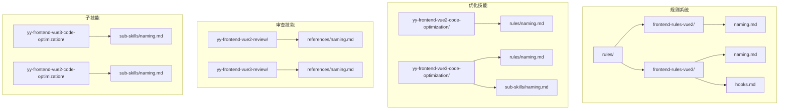
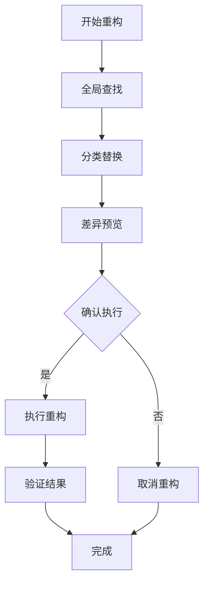
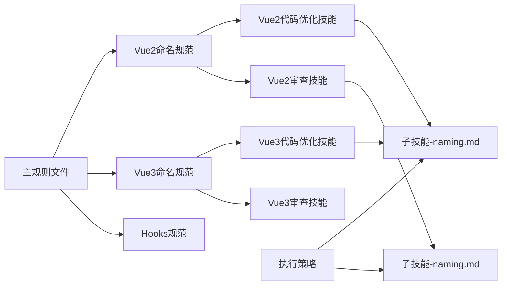

# 语义化命名重构技术文档

<cite>
**本文档引用的文件**
- [naming.md](file://rules/frontend-rules-vue2/references/naming.md)
- [naming.md](file://rules/frontend-rules-vue3/references/naming.md)
- [naming.md](file://skills/yy-frontend-vue2-code-optimization/rules/naming.md)
- [naming.md](file://skills/yy-frontend-vue3-code-optimization/rules/naming.md)
- [naming.md](file://skills/yy-frontend-vue2-review/references/naming.md)
- [naming.md](file://skills/yy-frontend-vue3-review/references/naming.md)
- [hooks.md](file://rules/frontend-rules-vue3/references/hooks.md)
- [naming.md](file://skills/yy-frontend-vue3-code-optimization/sub-skills/naming.md)
- [naming.md](file://skills/yy-frontend-vue2-code-optimization/sub-skills/naming.md)
- [skill-prompts.md](file://skills/yy-frontend-vue3-code-optimization/prompts/skill-prompts.md)
- [skill-prompts.md](file://skills/yy-frontend-vue2-review/prompts/skill-prompts.md)
</cite>

## 目录
1. [简介](#简介)
2. [项目结构](#项目结构)
3. [核心组件](#核心组件)
4. [架构概览](#架构概览)
5. [详细组件分析](#详细组件分析)
6. [依赖关系分析](#依赖关系分析)
7. [性能考虑](#性能考虑)
8. [故障排除指南](#故障排除指南)
9. [结论](#结论)

## 简介

本技术文档专注于语义化命名重构子技能，这是一个旨在统一和规范化代码库中各类标识符命名的自动化重构工具。该技能覆盖了从API函数到事件处理、从常量定义到组件命名的完整命名体系，确保整个项目的代码风格一致性和可读性。

语义化命名重构不仅关注单个标识符的命名规范，更重要的是建立了一套完整的重构流程和质量保证机制。通过全局查找、分类替换和差异预览等策略，确保重构过程的安全性和准确性。

## 项目结构

该项目采用模块化的技能架构，每个技能都专注于特定的功能领域：



**图表来源**
- [naming.md:1-73](file://rules/frontend-rules-vue2/references/naming.md#L1-L73)
- [naming.md:1-85](file://rules/frontend-rules-vue3/references/naming.md#L1-L85)
- [hooks.md:1-158](file://rules/frontend-rules-vue3/references/hooks.md#L1-L158)

**章节来源**
- [naming.md:1-73](file://rules/frontend-rules-vue2/references/naming.md#L1-L73)
- [naming.md:1-85](file://rules/frontend-rules-vue3/references/naming.md#L1-L85)

## 核心组件

### 命名规范体系

语义化命名重构涵盖了以下主要类型的标识符命名规范：

#### API函数命名规范
API函数采用`api + Method + URLPath`的格式，确保HTTP方法和URL路径的语义化表达：
- `apiGetUserInfo` - GET请求获取用户信息
- `apiPostLogin` - POST请求用户登录
- `apiPutUpdateProfile` - PUT请求更新用户资料

#### 事件函数命名规范
事件函数使用`on + EventName`的前缀约定，清晰表达事件处理职责：
- `onClickSubmit` - 点击提交事件
- `onChangeInput` - 输入框变更事件
- `onSelectOption` - 选项选择事件

#### 常量命名规范
常量采用全大写加下划线的格式，体现其不可变性：
- `MAX_RETRY_COUNT` - 最大重试次数
- `APP_CONFIG` - 应用配置
- `API_BASE_URL` - API基础URL

#### Props命名规范
Props使用camelCase命名，保持与JavaScript语言习惯一致：
- `userName` - 用户名
- `isLoading` - 加载状态
- `userList` - 用户列表

#### 组件命名规范
组件名采用PascalCase格式，文件名也使用多单词PascalCase：
- `UserCard.vue` - 用户卡片组件
- `UserProfile.vue` - 用户档案组件
- `LoginForm.vue` - 登录表单组件

**章节来源**
- [naming.md:19-35](file://rules/frontend-rules-vue2/references/naming.md#L19-L35)
- [naming.md:19-35](file://rules/frontend-rules-vue3/references/naming.md#L19-L35)
- [naming.md:19-35](file://skills/yy-frontend-vue2-code-optimization/rules/naming.md#L19-L35)

### Hooks命名规范

Vue3的组合式API引入了Hooks概念，具有严格的命名和使用规范：

#### 基本命名规则
- 必须以`use`开头
- 文件名与函数名保持一致
- 存放在`src/hooks/`目录下

#### 常见Hooks示例
- `useTable` - 表格数据管理
- `useSearchForm` - 搜索表单逻辑
- `useUserFetch` - 用户数据获取
- `usePermission` - 权限判断逻辑

#### 返回值规范
Hooks必须统一返回对象，推荐使用`toRefs`解构：
```typescript
return {
  loading,
  dataSource,
  total,
  pagination,
  getDataSourceTotal,
};
```

**章节来源**
- [naming.md:46-53](file://rules/frontend-rules-vue3/references/naming.md#L46-L53)
- [hooks.md:1-158](file://rules/frontend-rules-vue3/references/hooks.md#L1-L158)

## 架构概览

语义化命名重构技能采用分层架构设计，确保重构过程的可控性和安全性：



**图表来源**
- [naming.md:15-19](file://skills/yy-frontend-vue3-code-optimization/sub-skills/naming.md#L15-L19)

### 执行策略

重构过程分为三个主要阶段：

#### 1. 全局查找阶段
使用LSP或AST-grep工具进行全局限时查找，确保不遗漏任何引用点：
- 支持静态代码分析
- 覆盖所有文件类型
- 包含动态字符串引用检测

#### 2. 分类替换阶段
按照作用域范围逐步进行替换：
- 单文件作用域优先
- 组件内作用域次之
- 跨组件Hooks作用域
- 全局API作用域最后

#### 3. 差异预览阶段
提供变更前后的diff格式预览，确保变更的准确性：
```diff
- const userInfo = await apiGetUserInfo(userId.value)
+ const userData = await apiGetUserInfo(userId.value)
```

**章节来源**
- [naming.md:15-19](file://skills/yy-frontend-vue3-code-optimization/sub-skills/naming.md#L15-L19)
- [naming.md:15-19](file://skills/yy-frontend-vue2-code-optimization/sub-skills/naming.md#L15-L19)

## 详细组件分析

### 布尔值命名约定

布尔值命名采用前缀约定，提高代码的可读性和语义性：

#### 布尔值前缀体系

| 前缀 | 含义 | 示例 |
|------|------|------|
| `is` | 布尔状态 | `isLoading`, `isValid`, `isDisabled` |
| `has` | 存在性判断 | `hasData`, `hasPermission`, `hasError` |
| `show` | 显示状态 | `showSidebar`, `showModal` |
| `visible` | 可见性 | `isVisible`, `isDialogVisible` |

#### 命名最佳实践

布尔值命名应遵循以下原则：
- 使用语义化前缀表达布尔含义
- 避免否定形式的布尔变量
- 保持命名的一致性和可预测性

**章节来源**
- [naming.md:26-35](file://skills/yy-frontend-vue2-review/references/naming.md#L26-L35)
- [naming.md:19-21](file://skills/yy-frontend-vue3-review/references/naming.md#L19-L21)

### TypeScript类型命名规范

TypeScript类型系统提供了强大的类型安全特性，需要遵循特定的命名约定：

#### 类型别名命名
- 以`I`开头的PascalCase格式
- `IUserInfo` - 用户信息接口
- `ITableConfig` - 表格配置接口

#### 泛型参数命名
- 使用单字母大写
- `T` - 通用类型参数
- `K` - 键类型参数
- `V` - 值类型参数

#### 类型约束原则
- 在`.ts`/.vue脚本中参数、返回值、变量必须明确类型
- 禁止使用`any`类型（可用`unknown`或具体类型替代）

**章节来源**
- [naming.md:54-61](file://rules/frontend-rules-vue3/references/naming.md#L54-L61)

### CSS BEM命名规范

CSS采用BEM(Block-Element-Modifier)方法论，确保样式的模块化和可维护性：

#### BEM结构层次

| 类型 | 说明 | 示例 |
|------|------|------|
| Block | 独立组件/模块 | `.card`, `.form` |
| Element | 块内部子元素 | `.card__title`, `.form__input` |
| Modifier | 状态/样式变体 | `.card--dark`, `.card__title--large` |

#### 命名规则
- 全小写字符
- 使用`__`连接元素
- 使用`--`连接修饰符
- 类名必须唯一，禁止使用`_`（除`__`外）

**章节来源**
- [naming.md:53-73](file://rules/frontend-rules-vue2/references/naming.md#L53-L73)
- [naming.md:76-85](file://rules/frontend-rules-vue3/references/naming.md#L76-L85)

## 依赖关系分析

语义化命名重构技能之间存在复杂的依赖关系，形成了一个完整的规范体系：



**图表来源**
- [naming.md:1-73](file://rules/frontend-rules-vue2/references/naming.md#L1-L73)
- [naming.md:1-85](file://rules/frontend-rules-vue3/references/naming.md#L1-L85)
- [hooks.md:1-158](file://rules/frontend-rules-vue3/references/hooks.md#L1-L158)

### 规则优先级体系

重构技能遵循严格的规则优先级：

1. **`rules/spec-index.md`** - Vue3前端项目开发规范总纲（必读）
2. **`rules/naming.md`** - 文件与组件命名、标识符命名规范
3. **`rules/hooks.md`** - Hooks命名规范（必须以`use`开头）

### 跨文件引用处理机制

重构过程中需要处理多种类型的跨文件引用：

#### 动态字符串引用
- `this[name]` - 动态属性访问
- `obj['property']` - 字符串键访问
- 需要特殊处理，避免误替换

#### 第三方库API冲突
- 某些标识符可能是第三方库API名称
- 不应进行修改，需要进行白名单检查
- 如`console.log`、`window.location`等

#### API路径一致性
- API函数重命名时保持HTTP请求路径不变
- 仅修改函数名，不修改实际的网络请求逻辑

**章节来源**
- [naming.md:21-27](file://skills/yy-frontend-vue3-code-optimization/sub-skills/naming.md#L21-L27)
- [naming.md:21-26](file://skills/yy-frontend-vue2-code-optimization/sub-skills/naming.md#L21-L26)

## 性能考虑

语义化命名重构虽然主要是文本替换操作，但仍需考虑以下性能因素：

### 重构效率优化

1. **增量处理** - 仅对发生变化的文件进行处理
2. **并行处理** - 利用多核CPU并行执行查找和替换
3. **缓存机制** - 缓存查找结果，避免重复计算

### 内存使用优化

1. **流式处理** - 对大型文件采用流式处理方式
2. **分批处理** - 将大量文件分成批次处理
3. **及时释放** - 及时释放不再使用的内存

### 时间复杂度分析

- **查找阶段**: O(n*m)，其中n为文件数量，m为平均文件大小
- **替换阶段**: O(k)，其中k为匹配的标识符数量
- **整体复杂度**: O(n*m + k)

## 故障排除指南

### 常见问题及解决方案

#### 引用遗漏问题
**问题描述**: 全局搜索可能遗漏动态字符串引用
**解决方案**: 
- 使用AST解析器进行语法分析
- 手动检查动态字符串引用
- 实施双重检查机制

#### 第三方库冲突
**问题描述**: 某些标识符可能是第三方库API名称
**解决方案**:
- 建立第三方库API白名单
- 在重构前进行冲突检测
- 提供人工确认环节

#### API路径变更风险
**问题描述**: API函数重命名不应改变后端请求路径
**解决方案**:
- 确保仅修改函数名，不修改实现逻辑
- 进行回归测试验证
- 保持向后兼容性

### 质量保证措施

#### 代码审查流程
1. **自动化检查**: 使用静态分析工具检查潜在问题
2. **人工审查**: 由资深开发者进行代码审查
3. **测试验证**: 运行相关测试用例验证功能正确性

#### 回滚机制
- 自动备份原始文件
- 提供一键回滚功能
- 记录详细的变更日志

**章节来源**
- [naming.md:36-42](file://skills/yy-frontend-vue3-code-optimization/sub-skills/naming.md#L36-L42)
- [naming.md:35-40](file://skills/yy-frontend-vue2-code-optimization/sub-skills/naming.md#L35-L40)

## 结论

语义化命名重构技能为前端代码库提供了一套完整的命名规范化解决方案。通过建立标准化的命名规范、严格的执行策略和完善的质量保证机制，确保重构过程的安全性和有效性。

该技能的核心价值在于：
1. **统一性**: 建立全项目一致的命名规范
2. **可读性**: 提高代码的语义化程度
3. **可维护性**: 降低代码维护成本
4. **安全性**: 通过多重检查确保重构质量

未来的发展方向包括：
- 集成更多IDE支持，提供实时命名建议
- 扩展到其他编程语言和框架
- 增强AI辅助的智能重构能力
- 建立持续集成的自动化命名检查

通过持续优化和完善，语义化命名重构技能将成为前端开发团队不可或缺的重要工具，为构建高质量、可维护的代码库奠定坚实基础。