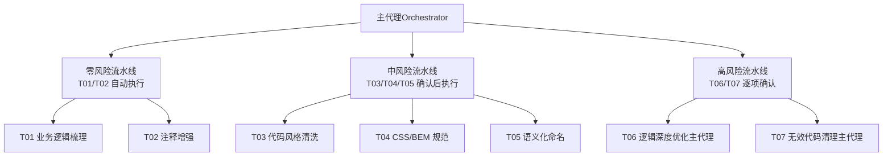
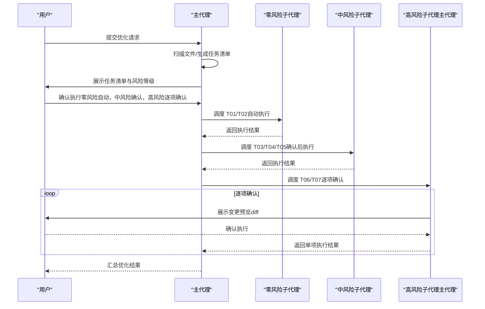
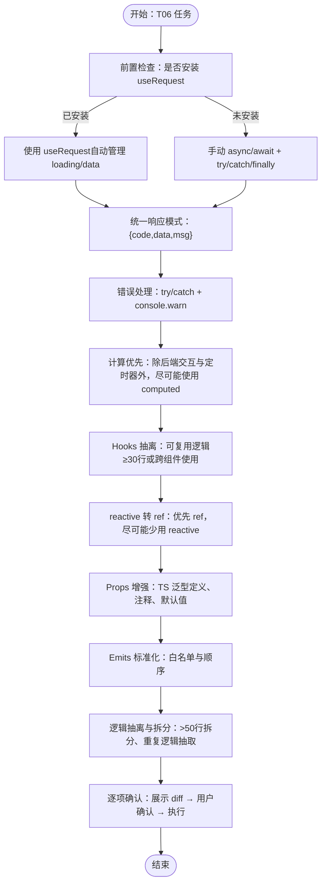
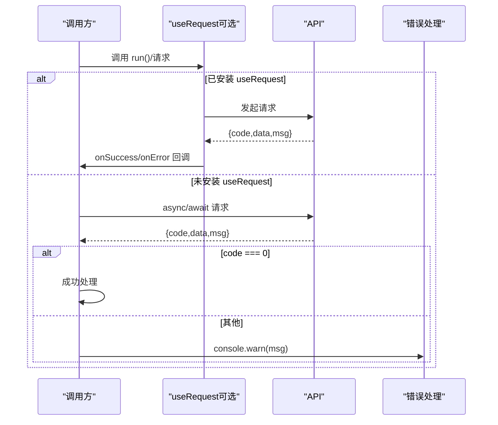
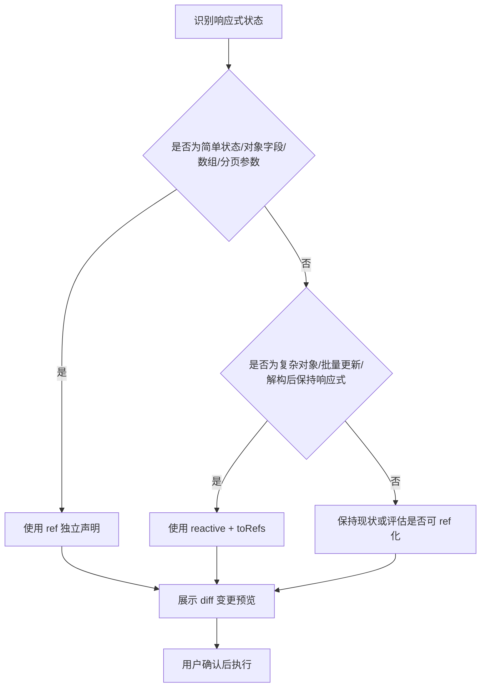
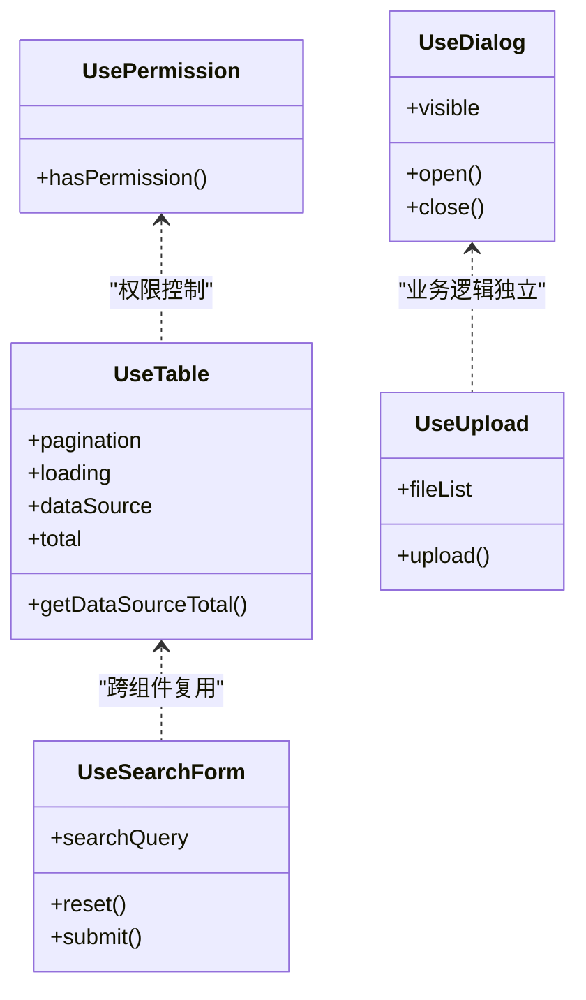
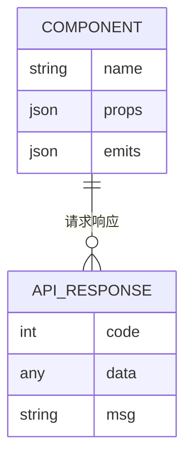
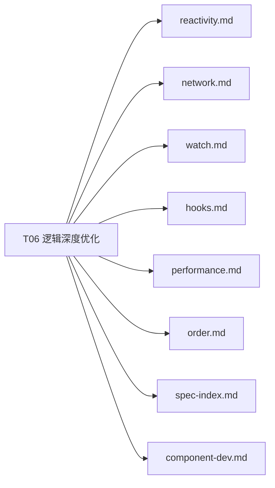

# 逻辑深度优化

<cite>
**本文引用的文件**
- [SKILL.md](file://skills/yy-frontend-vue3-code-optimization/SKILL.md)
- [skill-prompts.md](file://skills/yy-frontend-vue3-code-optimization/prompts/skill-prompts.md)
- [optimization.md](file://skills/yy-frontend-vue3-code-optimization/sub-skills/optimization.md)
- [reactivity.md](file://skills/yy-frontend-vue3-code-optimization/rules/reactivity.md)
- [network.md](file://skills/yy-frontend-vue3-code-optimization/rules/network.md)
- [watch.md](file://skills/yy-frontend-vue3-code-optimization/rules/watch.md)
- [hooks.md](file://skills/yy-frontend-vue3-code-optimization/rules/hooks.md)
- [performance.md](file://skills/yy-frontend-vue3-code-optimization/rules/performance.md)
- [order.md](file://skills/yy-frontend-vue3-code-optimization/rules/order.md)
- [spec-index.md](file://skills/yy-frontend-vue3-code-optimization/rules/spec-index.md)
- [component-dev.md](file://skills/yy-frontend-vue3-code-optimization/rules/component-dev.md)
</cite>

## 目录
1. [简介](#简介)
2. [项目结构](#项目结构)
3. [核心组件](#核心组件)
4. [架构总览](#架构总览)
5. [详细组件分析](#详细组件分析)
6. [依赖分析](#依赖分析)
7. [性能考量](#性能考量)
8. [故障排查指南](#故障排查指南)
9. [结论](#结论)
10. [附录](#附录)

## 简介
本文件聚焦“逻辑深度优化”子技能，系统阐述其作为高风险任务的特殊处理机制，包括主代理执行模式与逐项确认流程；异步优化策略（从 .then() 到 async/await 的转换、错误处理最佳实践与 try/catch/finally 使用规范）；响应式数据管理优化原则（reactive 到 ref 的优先级转换与复杂对象场景指导）；Hooks 抽离的标准与时机；以及网络请求统一模式、Emit 白名单与 Props/Emits 标准化增强策略。旨在帮助读者在不改变业务逻辑的前提下，安全、可控地提升代码质量与可维护性。

## 项目结构
该技能位于 Vue3 前端代码优化体系中，围绕“任务调度与风险分级”“子代理执行架构”“高风险任务逐项确认”展开，并配套一系列规则文件（reactivity、network、watch、hooks、performance、order、spec-index、component-dev 等）形成完整的优化规范。

图表来源
- [SKILL.md:81-129](file://skills/yy-frontend-vue3-code-optimization/SKILL.md#L81-L129)
- [SKILL.md:141-174](file://skills/yy-frontend-vue3-code-optimization/SKILL.md#L141-L174)

章节来源
- [SKILL.md:48-174](file://skills/yy-frontend-vue3-code-optimization/SKILL.md#L48-L174)

## 核心组件
- 任务调度与风险分级：将任务按风险等级分层，零风险自动执行，中风险需确认，高风险逐项确认并展示 diff。
- 子代理执行架构：每个任务类型分配独立子代理，职责单一、并行执行、故障隔离。
- 高风险任务（T06/T07）：由主代理执行，强调“每项改动需用户单独确认”，并提供变更预览。
- 规则体系：以 reactivity、network、watch、hooks、performance、order、spec-index、component-dev 等规则为依据，确保优化方向一致。

章节来源
- [SKILL.md:48-174](file://skills/yy-frontend-vue3-code-optimization/SKILL.md#L48-L174)
- [spec-index.md:1-60](file://skills/yy-frontend-vue3-code-optimization/rules/spec-index.md#L1-L60)

## 架构总览
主代理负责扫描文件、生成任务清单、按风险等级分组、调度子代理执行、汇总结果并展示。高风险任务（T06/T07）不使用子代理，由主代理逐项确认后执行，确保变更可控。

图表来源
- [SKILL.md:141-165](file://skills/yy-frontend-vue3-code-optimization/SKILL.md#L141-L165)
- [SKILL.md:177-191](file://skills/yy-frontend-vue3-code-optimization/SKILL.md#L177-L191)

章节来源
- [SKILL.md:141-174](file://skills/yy-frontend-vue3-code-optimization/SKILL.md#L141-L174)

## 详细组件分析

### 逻辑深度优化（T06）执行机制与规则
- 执行主体：主代理执行，不使用子代理。
- 逐项确认：每项改动需展示变更预览（diff）→ 用户确认 → 执行 → 下一项。
- 核心优化方向：
  - 异步优化：.then() → async/await，统一响应模式 {code, data, msg}，错误处理使用 try/catch + console.warn。
  - 计算优先：除后端交互与定时器外，尽可能使用 computed。
  - 网络请求：前置检查是否安装 useRequest（ahooks-vue/vue-hooks-plus），已安装用 useRequest，未安装用手动 async/await。
  - Hooks 抽离：可复用逻辑超过 30 行或跨 2+ 组件使用时必须抽离。
  - reactive 转 ref：优先使用 ref，尽可能少用 reactive（仅复杂对象场景使用）。
  - Props/Emits 增强：TypeScript 泛型定义、明确类型、注释、默认值；Emits 白名单与顺序规范。
  - 逻辑抽离与拆分：超过 50 行的方法拆分、重复逻辑抽取为公共函数或 Hook、简单条件内联到 template。

图表来源
- [optimization.md:1-385](file://skills/yy-frontend-vue3-code-optimization/sub-skills/optimization.md#L1-L385)
- [network.md:1-363](file://skills/yy-frontend-vue3-code-optimization/rules/network.md#L1-L363)
- [reactivity.md:1-227](file://skills/yy-frontend-vue3-code-optimization/rules/reactivity.md#L1-L227)
- [hooks.md:1-158](file://skills/yy-frontend-vue3-code-optimization/rules/hooks.md#L1-L158)

章节来源
- [optimization.md:1-385](file://skills/yy-frontend-vue3-code-optimization/sub-skills/optimization.md#L1-L385)

### 异步与网络请求优化（从 .then() 到 async/await）
- 基本原则：必须使用 async/await，禁止 .then() 链式调用；未安装 useRequest 时统一使用 try/catch/finally。
- 响应解构：统一 {code, data, msg} 模式，先判断成功再使用数据。
- 错误处理：catch 中 console.warn 记录；业务错误与网络异常分别处理。
- 防重复提交：useRequest 自动管理 loading，或手动通过 loading 状态互斥锁。
- 运算符转换：==/=== 保持原有写法，仅接口响应 code 字段比较可建议使用 ===，但需用户确认。

图表来源
- [network.md:1-363](file://skills/yy-frontend-vue3-code-optimization/rules/network.md#L1-L363)
- [optimization.md:40-83](file://skills/yy-frontend-vue3-code-optimization/sub-skills/optimization.md#L40-L83)

章节来源
- [network.md:19-110](file://skills/yy-frontend-vue3-code-optimization/rules/network.md#L19-L110)
- [optimization.md:40-89](file://skills/yy-frontend-vue3-code-optimization/sub-skills/optimization.md#L40-L89)

### 响应式数据管理优化（reactive → ref 优先级）
- 选择原则：优先使用 ref，尽可能少用 reactive；复杂对象、批量更新、解构后保持响应式时可考虑 reactive。
- 转换规则：简单状态、对象数据、数组数据、分页参数等场景从 reactive 转为 ref；展示 diff 变更预览。
- computed 规范：除后端交互与定时器外一律尽可能使用 computed；带副作用的逻辑不可转为 computed。
- watch 规范：深度监听需声明 deep: true；立即执行需 immediate: true；清理资源（定时器、事件监听）。
- Hooks 中的规范：禁止直接返回 reactive 对象，必须使用 toRefs 解构后返回。

图表来源
- [reactivity.md:1-227](file://skills/yy-frontend-vue3-code-optimization/rules/reactivity.md#L1-L227)
- [watch.md:1-154](file://skills/yy-frontend-vue3-code-optimization/rules/watch.md#L1-L154)
- [hooks.md:1-158](file://skills/yy-frontend-vue3-code-optimization/rules/hooks.md#L1-L158)

章节来源
- [reactivity.md:7-107](file://skills/yy-frontend-vue3-code-optimization/rules/reactivity.md#L7-L107)
- [watch.md:7-101](file://skills/yy-frontend-vue3-code-optimization/rules/watch.md#L7-L101)
- [hooks.md:14-19](file://skills/yy-frontend-vue3-code-optimization/rules/hooks.md#L14-L19)

### Hooks 抽离标准与时机
- 抽离条件：可复用逻辑超过 30 行；跨 2+ 组件使用；逻辑具有独立性（表格、表单、请求封装、权限判断等）。
- 存放位置：全局 Hooks 放在 @src/hooks/；局部 Hooks 放在组件同级目录。
- 返回值规范：统一返回对象，禁止直接返回 reactive 对象；必要时使用 toRefs。
- 导入顺序：遵循 import 分组排序（4 组）与注释规范。
- 风险提示：抽离后可能引入作用域问题，需重新梳理依赖与父组件 props。

图表来源
- [hooks.md:134-146](file://skills/yy-frontend-vue3-code-optimization/rules/hooks.md#L134-L146)
- [optimization.md:177-262](file://skills/yy-frontend-vue3-code-optimization/sub-skills/optimization.md#L177-L262)

章节来源
- [hooks.md:7-19](file://skills/yy-frontend-vue3-code-optimization/rules/hooks.md#L7-L19)
- [optimization.md:177-262](file://skills/yy-frontend-vue3-code-optimization/sub-skills/optimization.md#L177-L262)

### 网络请求统一模式、Emit 白名单与 Props/Emits 标准化
- 网络请求统一模式：{code, data, msg} 响应处理；useRequest 自动管理 loading/data；未安装时手动 async/await + try/catch/finally。
- Emit 白名单（19 种）：v-model 更新（update:modelValue/update:value）、交互类（change/click/select/expand/input/clear/remove/add）、弹窗类（open/close/show/hide）、操作类（cancel/confirm/ok/editSuccess/error）。
- Emit 顺序：update:modelValue/value → 其他业务事件 → change/click。
- Props 增强：TypeScript 泛型定义、明确类型、注释、默认值；与 defineProps/withDefaults 配合。
- Emits 标准化：TypeScript 泛型定义、明确事件名与 payload 类型；基础组件生命周期禁止主动 emit。

图表来源
- [network.md:20-110](file://skills/yy-frontend-vue3-code-optimization/rules/network.md#L20-L110)
- [optimization.md:325-366](file://skills/yy-frontend-vue3-code-optimization/sub-skills/optimization.md#L325-L366)

章节来源
- [network.md:19-110](file://skills/yy-frontend-vue3-code-optimization/rules/network.md#L19-L110)
- [optimization.md:325-366](file://skills/yy-frontend-vue3-code-optimization/sub-skills/optimization.md#L325-L366)

## 依赖分析
- 规则依赖：T06 优化严格依赖 reactivity、network、watch、hooks、performance、order、spec-index、component-dev 等规则文件，确保优化方向一致。
- 执行依赖：高风险任务（T06/T07）不使用子代理，由主代理逐项确认，降低耦合与风险扩散。
- 组织依赖：Hooks 抽离与响应式优化需遵循 import 分组排序与脚本内部结构顺序，保证代码可读性与一致性。

图表来源
- [optimization.md:5-16](file://skills/yy-frontend-vue3-code-optimization/sub-skills/optimization.md#L5-L16)
- [SKILL.md:177-191](file://skills/yy-frontend-vue3-code-optimization/SKILL.md#L177-L191)

章节来源
- [optimization.md:5-16](file://skills/yy-frontend-vue3-code-optimization/sub-skills/optimization.md#L5-L16)
- [order.md:15-35](file://skills/yy-frontend-vue3-code-optimization/rules/order.md#L15-L35)

## 性能考量
- 组件懒加载：路由与大组件使用动态导入；KeepAlive 合理缓存不常更新组件。
- 虚拟滚动：长列表使用虚拟滚动组件，减少 DOM 节点。
- 防抖节流：频繁触发事件（搜索、滚动、resize）使用防抖/节流。
- 图片优化：WebP 优先、合适尺寸、非首屏图片懒加载。
- 模板层轻量化：模板只负责展示，不写复杂表达式；简单逻辑可内联。
- 响应式性能：优先 computed 派生状态，减少 watch 滥用；大型数据列表考虑 shallowRef。

章节来源
- [performance.md:1-136](file://skills/yy-frontend-vue3-code-optimization/rules/performance.md#L1-L136)

## 故障排查指南
- 相等运算符转换风险：==/=== 转换可能改变行为，必须逐项确认并展示 diff。
- 错误处理空 catch：禁止空 catch，必须记录错误（console.warn）。
- 防重复提交：useRequest 自动管理 loading，或手动互斥锁；模板中按钮禁用。
- v-html 安全：必须使用 DOMPurify 过滤 HTML。
- Hooks 返回值：禁止直接返回 reactive 对象；必要时使用 toRefs。
- watch 清理：定时器、事件监听在组件销毁时清理；watchEffect 简化副作用场景。

章节来源
- [optimization.md:17-39](file://skills/yy-frontend-vue3-code-optimization/sub-skills/optimization.md#L17-L39)
- [network.md:113-147](file://skills/yy-frontend-vue3-code-optimization/rules/network.md#L113-L147)
- [hooks.md:14-19](file://skills/yy-frontend-vue3-code-optimization/rules/hooks.md#L14-L19)
- [watch.md:105-147](file://skills/yy-frontend-vue3-code-optimization/rules/watch.md#L105-L147)

## 结论
“逻辑深度优化”子技能通过主代理执行与逐项确认机制，确保高风险变更可控；结合 async/await 统一模式、computed 优先策略、reactive/ref 优化、Hooks 抽离与 Props/Emits 标准化，系统性提升代码质量与可维护性。建议在执行前充分理解规则文件，按风险等级分步推进，并在每项改动前展示 diff 以获得用户确认。

## 附录
- 任务调度与风险分级：零风险自动执行，中风险确认后执行，高风险逐项确认。
- 子代理执行架构：职责单一、并行执行、故障隔离。
- 规则索引：以 spec-index.md 为总纲，引用 reactivity、network、watch、hooks、performance、order 等规则文件。

章节来源
- [SKILL.md:48-174](file://skills/yy-frontend-vue3-code-optimization/SKILL.md#L48-L174)
- [spec-index.md:1-60](file://skills/yy-frontend-vue3-code-optimization/rules/spec-index.md#L1-L60)