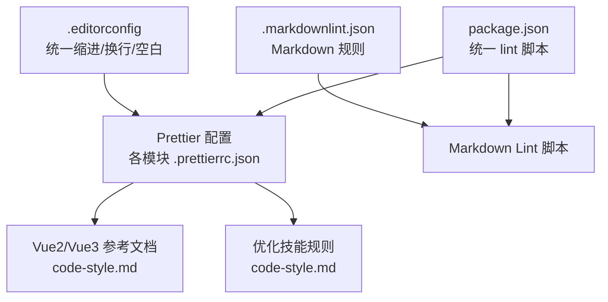
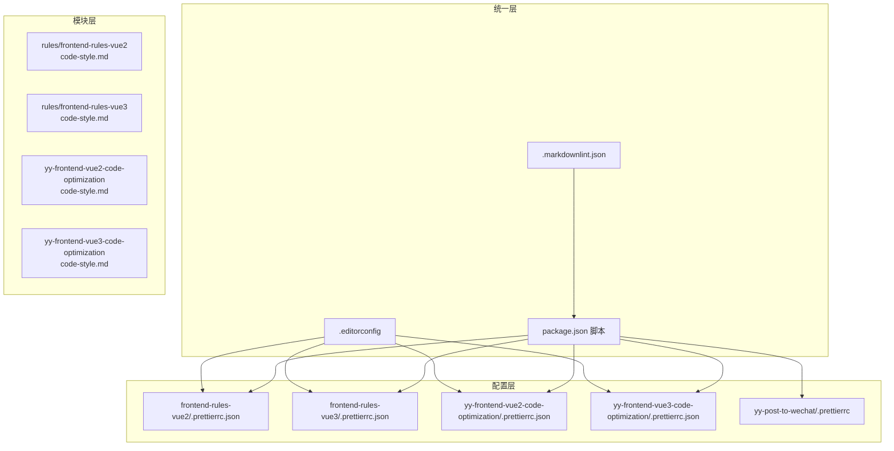
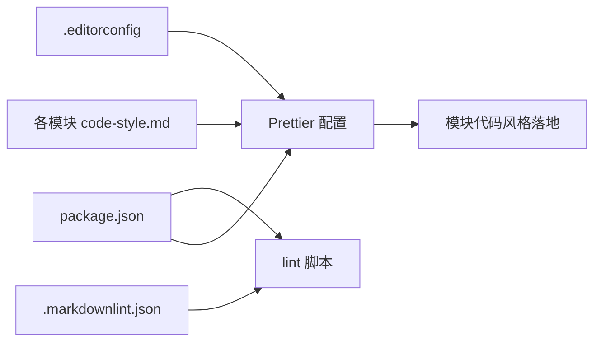

# D01 代码风格规范

<cite>
**本文引用的文件**
- [.editorconfig](file://.editorconfig)
- [.markdownlint.json](file://.markdownlint.json)
- [package.json](file://package.json)
- [rules/frontend-rules-vue2/references/code-style.md](file://rules/frontend-rules-vue2/references/code-style.md)
- [rules/frontend-rules-vue3/references/code-style.md](file://rules/frontend-rules-vue3/references/code-style.md)
- [skills/yy-frontend-vue2-code-optimization/rules/code-style.md](file://skills/yy-frontend-vue2-code-optimization/rules/code-style.md)
- [skills/yy-frontend-vue3-code-optimization/rules/code-style.md](file://skills/yy-frontend-vue3-code-optimization/rules/code-style.md)
- [rules/frontend-rules-vue2/assets/.prettierrc.json](file://rules/frontend-rules-vue2/assets/.prettierrc.json)
- [rules/frontend-rules-vue3/assets/.prettierrc.json](file://rules/frontend-rules-vue3/assets/.prettierrc.json)
- [skills/yy-frontend-vue2-code-optimization/assets/.prettierrc.json](file://skills/yy-frontend-vue2-code-optimization/assets/.prettierrc.json)
- [skills/yy-frontend-vue3-code-optimization/assets/.prettierrc.json](file://skills/yy-frontend-vue3-code-optimization/assets/.prettierrc.json)
- [skills/yy-post-to-wechat/scripts/.prettierrc](file://skills/yy-post-to-wechat/scripts/.prettierrc)
- [skills/yy-post-to-wechat/scripts/.prettierignore](file://skills/yy-post-to-wechat/scripts/.prettierignore)
</cite>

## 目录
1. [简介](#简介)
2. [项目结构](#项目结构)
3. [核心组件](#核心组件)
4. [架构总览](#架构总览)
5. [详细组件分析](#详细组件分析)
6. [依赖关系分析](#依赖关系分析)
7. [性能考量](#性能考量)
8. [故障排查指南](#故障排查指南)
9. [结论](#结论)
10. [附录](#附录)

## 简介
本规范面向前端工程（Vue2/Vue3）的 D01 代码风格检查，聚焦以下基础规则：
- 缩进：统一 2 空格缩进
- 引号：JS/TS 使用单引号；Vue 模板属性使用双引号；JSX 属性使用单引号
- 分号：语句末尾必须加分号
- 尾随逗号：多行对象/数组末尾加逗号
- 行宽限制：默认 120 字符，部分场景可放宽至 100 字符
- 其他：对象括号保留空格、箭头函数单参省略括号、HTML 空白敏感度严格、换行符自动检测等

本规范以 Prettier 为核心工具，结合各子模块的 .prettierrc.json 配置进行落地，并通过脚本统一执行。

## 项目结构
围绕 D01 规范，项目中与风格相关的关键位置如下：
- 根级统一风格与 Markdown 规则：.editorconfig、.markdownlint.json
- 子模块风格参考与实现：
  - rules/frontend-rules-vue2 / vue3：风格参考文档
  - skills/yy-frontend-vue2-code-optimization / vue3-code-optimization：风格规则与 Prettier 配置
- 特定脚本目录的 Prettier 配置与忽略规则：skills/yy-post-to-wechat/scripts/.prettierrc、.prettierignore

图表来源
- [.editorconfig:1-10](file://.editorconfig#L1-L10)
- [.markdownlint.json:1-13](file://.markdownlint.json#L1-L13)
- [package.json:7-16](file://package.json#L7-L16)

章节来源
- [.editorconfig:1-10](file://.editorconfig#L1-L10)
- [.markdownlint.json:1-13](file://.markdownlint.json#L1-L13)
- [package.json:7-16](file://package.json#L7-L16)

## 核心组件
- 统一编辑器配置（EditorConfig）
  - 缩进：space、2 空格
  - 换行：LF
  - 结尾：插入最终换行
  - 去除行尾空白
- Markdown 规则（markdownlint）
  - 默认启用
  - 列表缩进 2 空格
  - 关闭若干规则（如 MD013、MD033 等），按需调整
- Prettier 配置（各模块 .prettierrc.json）
  - 缩进：tabWidth=2
  - 引号：singleQuote=true；jsxSingleQuote=true；vueHtmlAttributes="double"
  - 分号：semi=true
  - 行宽：printWidth=120（部分模块为 100）
  - 尾随逗号：trailingComma="all"
  - 箭头函数：arrowParens="avoid"
  - 对象括号：bracketSpacing=true
  - HTML 空白敏感度：htmlWhitespaceSensitivity="strict"
  - Vue 脚本样式缩进：vueIndentScriptAndStyle=false
  - 文档散文换行：proseWrap="never"

章节来源
- [.editorconfig:1-10](file://.editorconfig#L1-L10)
- [.markdownlint.json:1-13](file://.markdownlint.json#L1-L13)
- [rules/frontend-rules-vue2/references/code-style.md:1-63](file://rules/frontend-rules-vue2/references/code-style.md#L1-L63)
- [rules/frontend-rules-vue3/references/code-style.md:1-61](file://rules/frontend-rules-vue3/references/code-style.md#L1-L61)
- [skills/yy-frontend-vue2-code-optimization/rules/code-style.md:1-63](file://skills/yy-frontend-vue2-code-optimization/rules/code-style.md#L1-L63)
- [skills/yy-frontend-vue3-code-optimization/rules/code-style.md:1-61](file://skills/yy-frontend-vue3-code-optimization/rules/code-style.md#L1-L61)

## 架构总览
下图展示了从“统一配置”到“模块化落地”的风格控制链路：

图表来源
- [.editorconfig:1-10](file://.editorconfig#L1-L10)
- [.markdownlint.json:1-13](file://.markdownlint.json#L1-L13)
- [package.json:7-16](file://package.json#L7-L16)
- [rules/frontend-rules-vue2/references/code-style.md:1-63](file://rules/frontend-rules-vue2/references/code-style.md#L1-L63)
- [rules/frontend-rules-vue3/references/code-style.md:1-61](file://rules/frontend-rules-vue3/references/code-style.md#L1-L61)
- [skills/yy-frontend-vue2-code-optimization/rules/code-style.md:1-63](file://skills/yy-frontend-vue2-code-optimization/rules/code-style.md#L1-L63)
- [skills/yy-frontend-vue3-code-optimization/rules/code-style.md:1-61](file://skills/yy-frontend-vue3-code-optimization/rules/code-style.md#L1-L61)
- [rules/frontend-rules-vue2/assets/.prettierrc.json:1-19](file://rules/frontend-rules-vue2/assets/.prettierrc.json#L1-L19)
- [rules/frontend-rules-vue3/assets/.prettierrc.json:1-20](file://rules/frontend-rules-vue3/assets/.prettierrc.json#L1-L20)
- [skills/yy-frontend-vue2-code-optimization/assets/.prettierrc.json:1-19](file://skills/yy-frontend-vue2-code-optimization/assets/.prettierrc.json#L1-L19)
- [skills/yy-frontend-vue3-code-optimization/assets/.prettierrc.json:1-20](file://skills/yy-frontend-vue3-code-optimization/assets/.prettierrc.json#L1-L20)
- [skills/yy-post-to-wechat/scripts/.prettierrc:1-9](file://skills/yy-post-to-wechat/scripts/.prettierrc#L1-L9)

## 详细组件分析

### 统一编辑器配置（EditorConfig）
- 作用：为所有语言提供一致的缩进、换行、空白处理策略，作为 Prettier 的基础约束
- 关键点：
  - indent_style=space、indent_size=2
  - end_of_line=lf
  - insert_final_newline=true
  - trim_trailing_whitespace=true

章节来源
- [.editorconfig:1-10](file://.editorconfig#L1-L10)

### Markdown 规则（markdownlint）
- 作用：统一 Markdown 文档的标题、列表、链接等格式
- 关键点：
  - default:true
  - MD007 列表缩进 2 空格
  - 关闭若干规则（如 MD013、MD033 等），按需调整

章节来源
- [.markdownlint.json:1-13](file://.markdownlint.json#L1-L13)

### Prettier 配置（各模块）
- 作用：统一前端代码风格，覆盖 JS/TS、JSX、Vue 模板、HTML 空白等
- 关键点（通用）：
  - 缩进：tabWidth=2
  - 引号：singleQuote=true；jsxSingleQuote=true；vueHtmlAttributes="double"
  - 分号：semi=true
  - 行宽：printWidth=120（部分模块为 100）
  - 尾随逗号：trailingComma="all"
  - 箭头函数：arrowParens="avoid"
  - 对象括号：bracketSpacing=true
  - HTML 空白敏感度：htmlWhitespaceSensitivity="strict"
  - Vue 脚本样式缩进：vueIndentScriptAndStyle=false
  - 文档散文换行：proseWrap="never"

章节来源
- [rules/frontend-rules-vue2/references/code-style.md:1-63](file://rules/frontend-rules-vue2/references/code-style.md#L1-L63)
- [rules/frontend-rules-vue3/references/code-style.md:1-61](file://rules/frontend-rules-vue3/references/code-style.md#L1-L61)
- [skills/yy-frontend-vue2-code-optimization/rules/code-style.md:1-63](file://skills/yy-frontend-vue2-code-optimization/rules/code-style.md#L1-L63)
- [skills/yy-frontend-vue3-code-optimization/rules/code-style.md:1-61](file://skills/yy-frontend-vue3-code-optimization/rules/code-style.md#L1-L61)
- [rules/frontend-rules-vue2/assets/.prettierrc.json:1-19](file://rules/frontend-rules-vue2/assets/.prettierrc.json#L1-L19)
- [rules/frontend-rules-vue3/assets/.prettierrc.json:1-20](file://rules/frontend-rules-vue3/assets/.prettierrc.json#L1-L20)
- [skills/yy-frontend-vue2-code-optimization/assets/.prettierrc.json:1-19](file://skills/yy-frontend-vue2-code-optimization/assets/.prettierrc.json#L1-L19)
- [skills/yy-frontend-vue3-code-optimization/assets/.prettierrc.json:1-20](file://skills/yy-frontend-vue3-code-optimization/assets/.prettierrc.json#L1-L20)

### 特定脚本目录的 Prettier 配置与忽略
- 作用：在特定脚本目录中覆盖或补充 Prettier 行为
- 关键点：
  - .prettierrc：semi=true、singleQuote=true、tabWidth=2、trailingComma="es5"、printWidth=100、bracketSpacing=true、arrowParens="avoid"
  - .prettierignore：dist/、node_modules/、*.d.ts

章节来源
- [skills/yy-post-to-wechat/scripts/.prettierrc:1-9](file://skills/yy-post-to-wechat/scripts/.prettierrc#L1-L9)
- [skills/yy-post-to-wechat/scripts/.prettierignore:1-3](file://skills/yy-post-to-wechat/scripts/.prettierignore#L1-L3)

### 规则适配与兼容性处理
- Vue2 与 Vue3 的差异：
  - 行宽：frontend-rules-vue2 为 100，frontend-rules-vue3 为 120
  - Vue 模板属性引号：frontend-rules-vue3 显式配置 vueHtmlAttributes="double"
- 优化技能模块与参考模块保持一致的 Prettier 配置
- 特定脚本目录采用更宽松的 trailingComma="es5" 与 printWidth=100，便于历史代码过渡

章节来源
- [rules/frontend-rules-vue2/assets/.prettierrc.json:1-19](file://rules/frontend-rules-vue2/assets/.prettierrc.json#L1-L19)
- [rules/frontend-rules-vue3/assets/.prettierrc.json:1-20](file://rules/frontend-rules-vue3/assets/.prettierrc.json#L1-L20)
- [skills/yy-frontend-vue2-code-optimization/assets/.prettierrc.json:1-19](file://skills/yy-frontend-vue2-code-optimization/assets/.prettierrc.json#L1-L19)
- [skills/yy-frontend-vue3-code-optimization/assets/.prettierrc.json:1-20](file://skills/yy-frontend-vue3-code-optimization/assets/.prettierrc.json#L1-L20)
- [skills/yy-post-to-wechat/scripts/.prettierrc:1-9](file://skills/yy-post-to-wechat/scripts/.prettierrc#L1-L9)

## 依赖关系分析
- 统一配置依赖关系：
  - .editorconfig 为所有模块提供基础缩进/换行约束
  - .markdownlint.json 为 Markdown 文档提供统一规则
  - package.json 中的 lint 脚本串联 markdownlint 与各模块 Prettier 执行
- 模块依赖关系：
  - 各模块的 code-style.md 与 .prettierrc.json 彼此呼应，形成“文档-配置”闭环
  - 特定脚本目录的 .prettierrc 与 .prettierignore 作为补充

图表来源
- [.editorconfig:1-10](file://.editorconfig#L1-L10)
- [.markdownlint.json:1-13](file://.markdownlint.json#L1-L13)
- [package.json:7-16](file://package.json#L7-L16)
- [rules/frontend-rules-vue2/references/code-style.md:1-63](file://rules/frontend-rules-vue2/references/code-style.md#L1-L63)
- [rules/frontend-rules-vue3/references/code-style.md:1-61](file://rules/frontend-rules-vue3/references/code-style.md#L1-L61)
- [skills/yy-frontend-vue2-code-optimization/rules/code-style.md:1-63](file://skills/yy-frontend-vue2-code-optimization/rules/code-style.md#L1-L63)
- [skills/yy-frontend-vue3-code-optimization/rules/code-style.md:1-61](file://skills/yy-frontend-vue3-code-optimization/rules/code-style.md#L1-L61)

章节来源
- [package.json:7-16](file://package.json#L7-L16)

## 性能考量
- Prettier 的性能受以下因素影响：
  - 文件数量与体积：大规模项目建议配合 .prettierignore 忽略构建产物与依赖目录
  - 行宽设置：printWidth 过小会增加换行与重排成本；过大可能降低可读性
  - 尾随逗号策略：开启 trailingComma="all" 可减少 diff，但格式化时需处理多行结构
- 建议：
  - 在 CI 中缓存 Prettier 与依赖，避免重复安装
  - 对大文件采用增量格式化策略（若可行）

## 故障排查指南
- 常见问题与修复建议
  - 缩进不一致
    - 现象：混用空格与制表符，或 tabWidth 设置不一致
    - 修复：统一使用 EditorConfig；确保 IDE 插件遵循 .editorconfig
    - 参考：[.editorconfig:5-6](file://.editorconfig#L5-L6)
  - 引号不统一
    - 现象：JS/TS 使用双引号；Vue 模板属性未使用双引号；JSX 属性未使用单引号
    - 修复：校验各模块 .prettierrc.json；确保 Prettier 生效
    - 参考：[rules/frontend-rules-vue3/assets/.prettierrc.json](file://rules/frontend-rules-vue3/assets/.prettierrc.json#L18)
  - 分号缺失
    - 现象：语句末尾缺少分号
    - 修复：启用 semi=true 并运行 Prettier
    - 参考：[rules/frontend-rules-vue2/assets/.prettierrc.json](file://rules/frontend-rules-vue2/assets/.prettierrc.json#L2)
  - 尾随逗号未添加
    - 现象：多行对象/数组末尾缺少逗号
    - 修复：启用 trailingComma="all" 并运行 Prettier
    - 参考：[rules/frontend-rules-vue3/assets/.prettierrc.json](file://rules/frontend-rules-vue3/assets/.prettierrc.json#L9)
  - 行宽超限
    - 现象：单行过长导致阅读困难
    - 修复：调整 printWidth 或拆分行；注意模块差异（Vue2 通常为 100，Vue3 为 120）
    - 参考：[rules/frontend-rules-vue2/assets/.prettierrc.json](file://rules/frontend-rules-vue2/assets/.prettierrc.json#L4)
  - HTML 空白处理异常
    - 现象：模板中多余空格导致渲染差异
    - 修复：启用 htmlWhitespaceSensitivity="strict"
    - 参考：[rules/frontend-rules-vue3/assets/.prettierrc.json](file://rules/frontend-rules-vue3/assets/.prettierrc.json#L17)
  - 特定脚本目录格式不一致
    - 现象：脚本目录 trailingComma="es5" 与模块默认策略不同
    - 修复：根据目录职责选择合适策略；必要时在该目录单独管理 .prettierrc
    - 参考：[skills/yy-post-to-wechat/scripts/.prettierrc](file://skills/yy-post-to-wechat/scripts/.prettierrc#L5)

- 识别方法
  - 使用 Prettier 对目标文件执行格式化，观察差异
  - 在 IDE 中启用 Prettier 插件，实时提示
  - 在 CI 中执行统一 lint 脚本，集中暴露问题

章节来源
- [.editorconfig:5-6](file://.editorconfig#L5-L6)
- [rules/frontend-rules-vue2/assets/.prettierrc.json:2-4](file://rules/frontend-rules-vue2/assets/.prettierrc.json#L2-L4)
- [rules/frontend-rules-vue3/assets/.prettierrc.json:9-18](file://rules/frontend-rules-vue3/assets/.prettierrc.json#L9-L18)
- [skills/yy-post-to-wechat/scripts/.prettierrc:1-9](file://skills/yy-post-to-wechat/scripts/.prettierrc#L1-L9)

## 结论
- D01 规范以 EditorConfig 提供统一基础，以 Prettier 实现跨模块一致性，辅以 markdownlint 保障文档质量
- Vue2 与 Vue3 在行宽与 HTML 属性引号上存在差异，需按模块匹配相应配置
- 特定脚本目录可按需调整策略，但应保持与主流程的清晰边界
- 通过统一脚本与配置，显著降低团队协作中的风格分歧，提升可读性与可维护性

## 附录

### 规则对照表（摘要）
- 缩进：2 空格
- 引号：JS/TS 单引号；JSX 单引号；Vue 模板属性双引号
- 分号：语句末尾必须有分号
- 行宽：默认 120（Vue2 可为 100）
- 尾随逗号：多行对象/数组末尾加逗号
- 箭头函数：单参数省略括号
- 对象括号：保留空格
- HTML 空白敏感度：严格
- 换行符：自动检测

章节来源
- [rules/frontend-rules-vue2/references/code-style.md:32-49](file://rules/frontend-rules-vue2/references/code-style.md#L32-L49)
- [rules/frontend-rules-vue3/references/code-style.md:32-49](file://rules/frontend-rules-vue3/references/code-style.md#L32-L49)
- [skills/yy-frontend-vue2-code-optimization/rules/code-style.md:32-49](file://skills/yy-frontend-vue2-code-optimization/rules/code-style.md#L32-L49)
- [skills/yy-frontend-vue3-code-optimization/rules/code-style.md:32-49](file://skills/yy-frontend-vue3-code-optimization/rules/code-style.md#L32-L49)