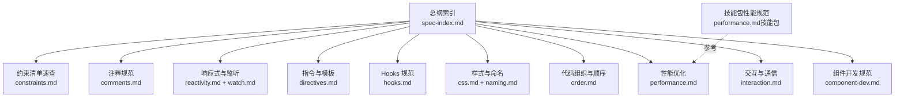
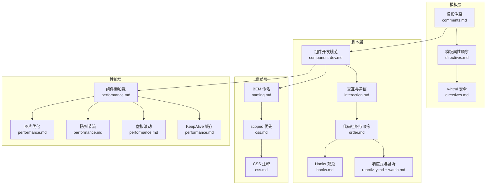
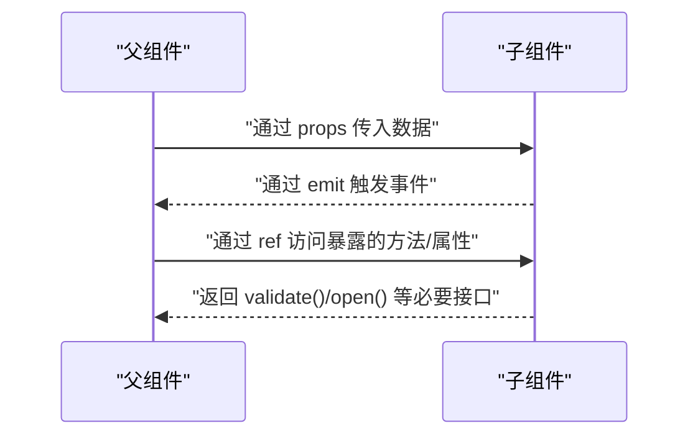
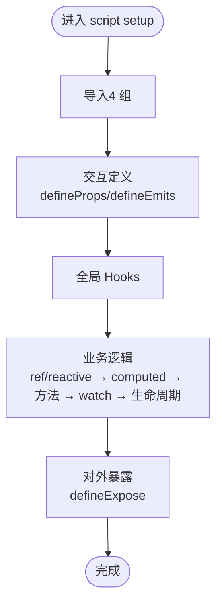
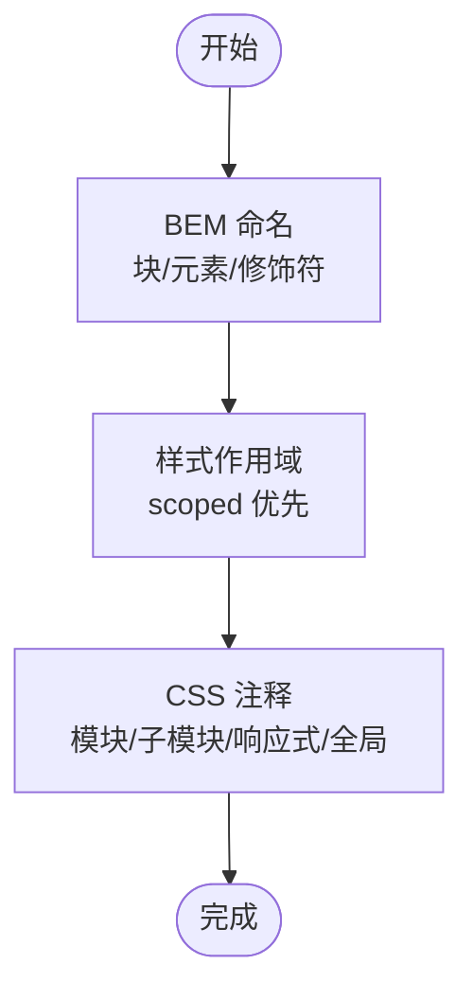
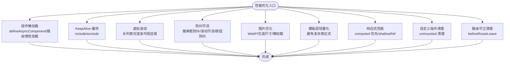
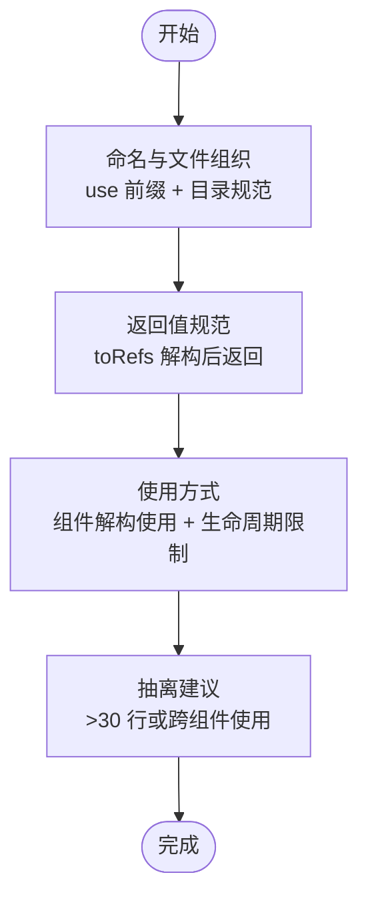
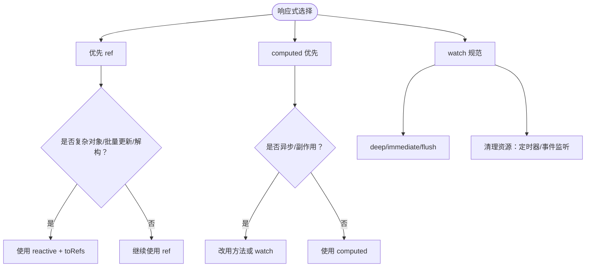
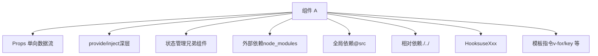

# D02 最佳实践规范

<cite>
**本文引用的文件**
- [RULE.md](file://rules/frontend-rules-vue3/RULE.md)
- [spec-index.md](file://rules/frontend-rules-vue3/references/spec-index.md)
- [component-dev.md](file://rules/frontend-rules-vue3/references/component-dev.md)
- [interaction.md](file://rules/frontend-rules-vue3/references/interaction.md)
- [order.md](file://rules/frontend-rules-vue3/references/order.md)
- [css.md](file://rules/frontend-rules-vue3/references/css.md)
- [performance.md](file://rules/frontend-rules-vue3/references/performance.md)
- [hooks.md](file://rules/frontend-rules-vue3/references/hooks.md)
- [naming.md](file://rules/frontend-rules-vue3/references/naming.md)
- [directives.md](file://rules/frontend-rules-vue3/references/directives.md)
- [reactivity.md](file://rules/frontend-rules-vue3/references/reactivity.md)
- [watch.md](file://rules/frontend-rules-vue3/references/watch.md)
- [comments.md](file://rules/frontend-rules-vue3/references/comments.md)
- [constraints.md](file://rules/frontend-rules-vue3/references/constraints.md)
- [performance.md（技能包）](file://skills/yy-frontend-vue3-code-optimization/rules/performance.md)
</cite>

## 目录
1. [简介](#简介)
2. [项目结构](#项目结构)
3. [核心组件](#核心组件)
4. [架构概览](#架构概览)
5. [详细组件分析](#详细组件分析)
6. [依赖分析](#依赖分析)
7. [性能考量](#性能考量)
8. [故障排查指南](#故障排查指南)
9. [结论](#结论)
10. [附录](#附录)

## 简介
本文件面向 D02 最佳实践规范，聚焦以下主题：
- 调试代码清理：模板与脚本注释、未使用变量处理、调试日志与临时代码清理
- BEM + scoped：样式命名与作用域策略
- 未使用变量处理：代码整洁与体积优化
- defineExpose 使用：对外暴露接口的规范与边界
- 组件拆分、懒加载、KeepAlive、Hooks 规范：性能优化与代码组织原则
- 代码示例对比：展示最佳实践应用场景
- 性能优化建议与代码重构指导

本规范基于 Vue3 单文件组件（SFC）的开发实践，结合脚本区、模板区与样式区的组织与约束，形成系统化的检查规则与实施建议。

## 项目结构
本规范由“总纲索引”“模块化规则”“性能专项”“约束清单”等构成，围绕 Vue3 组件开发的“基础规范（Essential）”“强烈推荐（Strongly Recommended）”“风格指南（Recommended）”三个层级展开，并在“组件开发”“交互通信”“代码组织”“样式与命名”“性能优化”“Hooks 规范”等方面提供具体规则与示例路径。

图表来源
- [spec-index.md:1-60](file://rules/frontend-rules-vue3/references/spec-index.md#L1-L60)
- [RULE.md:1-68](file://rules/frontend-rules-vue3/RULE.md#L1-L68)

章节来源
- [RULE.md:1-68](file://rules/frontend-rules-vue3/RULE.md#L1-L68)
- [spec-index.md:1-60](file://rules/frontend-rules-vue3/references/spec-index.md#L1-L60)

## 核心组件
本节从“调试代码清理”“BEM + scoped”“未使用变量处理”“defineExpose 使用”四个维度，给出 D02 最佳实践的检查要点与实施路径。

- 调试代码清理
  - 模板注释：使用统一注释格式标注根节点、循环、条件、关键区块与插槽，便于快速定位与审查。
  - 脚本注释：在 Script 顶部维护“改动时间 + 改动内容”的 JSDoc，以及 props/ref/reactive/computed/watch/methods/component/hook 的注释，确保注释与代码行为一致。
  - 未使用变量处理：遵循“未使用变量”注意事项，虽 ESLint 默认关闭检查，仍需人工清理无用代码，避免冗余与混淆。
  - v-html 安全：如需使用 v-html，必须进行 DOMPurify 过滤，防止 XSS。
  - 调试日志与临时代码：模板与脚本中不得保留调试日志、console.*、临时注释块或未删除的测试代码。

- BEM + scoped
  - BEM 命名：块/元素/修饰符采用全小写、短横线连接、类名唯一，避免嵌套。
  - 样式作用域：优先使用 scoped；非 scoped 样式需标注“全局”，并评估污染风险。
  - CSS 注释：模块分组、子模块、响应式与全局样式需按规范注释，提升可读性与可维护性。

- 未使用变量处理
  - 约束清单指出“未使用变量”问题默认不检查，需自行清理；建议在评审阶段重点检查，避免引入无用依赖与变量，降低包体积与心智负担。

- defineExpose 使用
  - 明确声明：仅暴露父组件业务必须调用的方法或属性，避免暴露内部状态实现细节。
  - 父组件访问：父组件通过 ref 访问子组件暴露内容。
  - 禁止滥用：不暴露内部实现、不暴露过多公共接口，保持接口最小可用集。

章节来源
- [comments.md:1-83](file://rules/frontend-rules-vue3/references/comments.md#L1-L83)
- [constraints.md:38-45](file://rules/frontend-rules-vue3/references/constraints.md#L38-L45)
- [directives.md:43-56](file://rules/frontend-rules-vue3/references/directives.md#L43-L56)
- [css.md:19-31](file://rules/frontend-rules-vue3/references/css.md#L19-L31)
- [naming.md:76-85](file://rules/frontend-rules-vue3/references/naming.md#L76-L85)
- [interaction.md:86-106](file://rules/frontend-rules-vue3/references/interaction.md#L86-L106)

## 架构概览
下图展示 D02 最佳实践在组件开发中的关键交互与约束关系：从“组件开发”“交互通信”“代码组织”“样式与命名”“性能优化”“Hooks 规范”六个方面协同，形成“模板层轻量化、脚本层结构化、样式层可维护”的整体架构。

图表来源
- [component-dev.md:1-81](file://rules/frontend-rules-vue3/references/component-dev.md#L1-L81)
- [interaction.md:1-125](file://rules/frontend-rules-vue3/references/interaction.md#L1-L125)
- [order.md:1-141](file://rules/frontend-rules-vue3/references/order.md#L1-L141)
- [reactivity.md:1-227](file://rules/frontend-rules-vue3/references/reactivity.md#L1-L227)
- [watch.md:1-154](file://rules/frontend-rules-vue3/references/watch.md#L1-L154)
- [hooks.md:1-158](file://rules/frontend-rules-vue3/references/hooks.md#L1-L158)
- [css.md:1-67](file://rules/frontend-rules-vue3/references/css.md#L1-L67)
- [naming.md:1-85](file://rules/frontend-rules-vue3/references/naming.md#L1-L85)
- [directives.md:1-105](file://rules/frontend-rules-vue3/references/directives.md#L1-L105)
- [performance.md:1-136](file://rules/frontend-rules-vue3/references/performance.md#L1-L136)

## 详细组件分析

### 组件开发与交互通信（含 defineExpose）
- 要点
  - 必须使用 `<script setup>`，禁止 Options API 写法与 this 使用。
  - Props 定义需类型注解、命名 camelCase、必须添加注释说明。
  - v-model 兼容写法：标准 modelValue 与 Ant Design Vue 风格 value。
  - Emit 事件白名单与顺序：update:*、业务事件、交互反馈事件。
  - defineExpose：仅暴露父组件必须调用的方法，禁止暴露内部状态实现。
  - 组件间通信：provide/inject 仅用于深层传参，兄弟组件通信使用状态管理，禁止滥用 $parent/$children。

图表来源
- [interaction.md:7-106](file://rules/frontend-rules-vue3/references/interaction.md#L7-L106)

章节来源
- [component-dev.md:7-68](file://rules/frontend-rules-vue3/references/component-dev.md#L7-L68)
- [interaction.md:7-125](file://rules/frontend-rules-vue3/references/interaction.md#L7-L125)

### 代码组织与顺序（Import 分组、SFC 块顺序、defineExpose 位置）
- 要点
  - SFC 块顺序：template → script setup → style scoped
  - Import 分组排序：外部依赖 → 类型导入 → 全局依赖(@src) → 相对依赖(./../)
  - script setup 内部顺序：imports → defineProps/defineEmits → 全局 Hooks → 业务逻辑（ref/reactive → computed → 方法 → watch → 生命周期）→ defineExpose
  - 模板属性顺序：is → v-for → v-if/else → v-show → id → props/attrs → v-on → v-html/v-text → 动态 v-slot

图表来源
- [order.md:7-88](file://rules/frontend-rules-vue3/references/order.md#L7-L88)

章节来源
- [order.md:1-141](file://rules/frontend-rules-vue3/references/order.md#L1-L141)
- [directives.md:80-98](file://rules/frontend-rules-vue3/references/directives.md#L80-L98)

### 样式规范（BEM + scoped）
- 要点
  - BEM 命名：块/元素/修饰符，全小写、短横线连接、类名唯一。
  - scoped 优先：仅作用于当前组件；非 scoped 需标注“全局”。
  - CSS 注释：模块分组、子模块、响应式、全局样式标注。
  - 布局与兼容：定位层级、内外边距方向、兼容性风险与降级方案。

图表来源
- [naming.md:76-85](file://rules/frontend-rules-vue3/references/naming.md#L76-L85)
- [css.md:19-31](file://rules/frontend-rules-vue3/references/css.md#L19-L31)

章节来源
- [css.md:1-67](file://rules/frontend-rules-vue3/references/css.md#L1-L67)
- [naming.md:1-85](file://rules/frontend-rules-vue3/references/naming.md#L1-L85)

### 性能优化（懒加载、KeepAlive、虚拟滚动、防抖节流、图片优化）
- 要点
  - 组件懒加载：defineAsyncComponent 动态导入、路由页面惰性加载
  - KeepAlive：通过 include/exclude 精确控制缓存范围，避免内存泄漏
  - 虚拟滚动：长列表（100+ 项）仅渲染可视区域
  - 防抖节流：搜索框输入（防抖）、滚动/窗口 resize（节流）、按钮点击（防抖/锁）
  - 图片优化：WebP 优先、合适尺寸、非首屏图片懒加载
  - 模板层轻量化：模板只负责展示，避免复杂表达式与昂贵计算
  - 响应式性能：computed 优先、大型数据列表考虑 shallowRef、避免在 watch 中执行同步 DOM 操作
  - 自定义指令清理：unmounted 钩子清理事件监听器与定时器
  - 路由守卫清理：beforeRouteLeave 清理定时器、取消未完成请求、关闭弹窗

图表来源
- [performance.md:7-136](file://rules/frontend-rules-vue3/references/performance.md#L7-L136)
- [performance.md（技能包）:1-136](file://skills/yy-frontend-vue3-code-optimization/rules/performance.md#L1-L136)

章节来源
- [performance.md:1-136](file://rules/frontend-rules-vue3/references/performance.md#L1-L136)
- [performance.md（技能包）:1-136](file://skills/yy-frontend-vue3-code-optimization/rules/performance.md#L1-L136)

### Hooks 规范（命名、返回值、使用方式、抽离建议）
- 要点
  - 命名：use 前缀，文件名与函数名一致，存放于 src/hooks 或组件同级目录
  - 返回值：统一返回对象（推荐 toRefs 解构后返回），禁止直接返回 reactive 对象
  - 使用：组件中通过解构使用；生命周期钩子只能在组件顶层或 setup 中调用
  - 抽离：可复用逻辑超过 30 行或跨 2 个以上组件使用时，必须抽离为 Hook
  - 注释：JSDoc + @description；内部 ref 与方法按规范注释

图表来源
- [hooks.md:7-158](file://rules/frontend-rules-vue3/references/hooks.md#L7-L158)

章节来源
- [hooks.md:1-158](file://rules/frontend-rules-vue3/references/hooks.md#L1-L158)

### 响应式与监听（ref/reactive/computed 选择、watch/watchEffect）
- 要点
  - 优先使用 ref，尽可能少用 reactive；reactive 仅用于复杂对象、批量更新、解构场景
  - computed 优先替代 watch 中的派生逻辑，避免副作用与异步逻辑
  - watch：深度监听需声明 deep: true，初始化需触发时加 immediate: true，注意清理定时器与事件监听
  - watchEffect：自动追踪依赖，适合简单副作用场景

图表来源
- [reactivity.md:7-227](file://rules/frontend-rules-vue3/references/reactivity.md#L7-L227)
- [watch.md:7-154](file://rules/frontend-rules-vue3/references/watch.md#L7-L154)

章节来源
- [reactivity.md:1-227](file://rules/frontend-rules-vue3/references/reactivity.md#L1-L227)
- [watch.md:1-154](file://rules/frontend-rules-vue3/references/watch.md#L1-L154)

### 指令与模板（v-for/key、v-if/v-for 冲突、v-html 安全、指令简写、属性顺序）
- 要点
  - v-for 必须使用唯一 ID 作为 key，禁止使用 index
  - 禁止在同一元素上同时使用 v-if 与 v-for，可通过 template 包裹或 computed 预过滤
  - v-html 必须用 DOMPurify 过滤 HTML
  - 指令简写：v-bind → :、v-on → @、v-slot → #
  - 模板属性顺序：is → v-for → v-if/else → v-show → id → props/attrs → v-on → v-html/v-text → 动态 v-slot

章节来源
- [directives.md:1-105](file://rules/frontend-rules-vue3/references/directives.md#L1-L105)

### 组件拆分与页面拆分建议
- 要点
  - 页面组件超过 300 行时，建议拆分独立子组件
  - 按功能区块拆分：搜索表单、数据表格、分页器、操作按钮组
  - 与性能优化协同：拆分后可配合组件懒加载与 KeepAlive 提升首屏与切换性能

章节来源
- [component-dev.md:61-64](file://rules/frontend-rules-vue3/references/component-dev.md#L61-L64)

## 依赖分析
- 组件耦合与内聚
  - Props 单向数据流：父 -> 子，子组件不得直接修改 props
  - provide/inject 仅用于深层传参，兄弟组件通信使用状态管理
  - 禁止 $parent/$children 链式访问，避免高耦合
- 外部依赖与集成点
  - 外部依赖（node_modules）优先导入，类型导入（import type）次之，全局依赖（@src）再次之，相对依赖（./../）最后
  - Hooks 与工具函数按模块分组，避免全局污染
- 约束与风险
  - 禁止 mixins、禁止 this、禁止 Options API 写法
  - v-for 与 v-if 同元素禁止；index 作为 key 禁止
  - v-html 必须过滤，防止 XSS

图表来源
- [interaction.md:110-125](file://rules/frontend-rules-vue3/references/interaction.md#L110-L125)
- [order.md:92-128](file://rules/frontend-rules-vue3/references/order.md#L92-L128)
- [constraints.md:3-17](file://rules/frontend-rules-vue3/references/constraints.md#L3-L17)
- [directives.md:7-18](file://rules/frontend-rules-vue3/references/directives.md#L7-L18)

章节来源
- [interaction.md:110-125](file://rules/frontend-rules-vue3/references/interaction.md#L110-L125)
- [order.md:92-128](file://rules/frontend-rules-vue3/references/order.md#L92-L128)
- [constraints.md:3-17](file://rules/frontend-rules-vue3/references/constraints.md#L3-L17)
- [directives.md:7-18](file://rules/frontend-rules-vue3/references/directives.md#L7-L18)

## 性能考量
- 懒加载与路由优化：大组件使用 defineAsyncComponent 动态导入；路由页面使用惰性加载，降低首屏体积
- 缓存与切换：合理使用 KeepAlive，通过 include/exclude 精确控制缓存范围，避免内存泄漏
- 长列表渲染：虚拟滚动仅渲染可视区域，降低 DOM 数量
- 事件与计算：频繁触发事件使用防抖/节流；模板层避免昂贵计算，优先使用 computed
- 图片与资源：WebP 优先、合适尺寸、非首屏懒加载
- 响应式与监听：computed 优先、大型数据列表考虑 shallowRef、watch 中避免同步 DOM 操作
- 自定义指令与路由守卫：unmounted 清理事件与定时器；beforeRouteLeave 清理定时器、取消请求、关闭弹窗

章节来源
- [performance.md:1-136](file://rules/frontend-rules-vue3/references/performance.md#L1-L136)
- [performance.md（技能包）:1-136](file://skills/yy-frontend-vue3-code-optimization/rules/performance.md#L1-L136)

## 故障排查指南
- 调试代码残留
  - 症状：模板或脚本中存在 console.*、临时注释块、未删除的测试代码
  - 排查：对照注释规范逐项检查，确保注释与代码行为一致
  - 处置：清理调试日志与临时代码，保留必要的注释与 JSDoc

- v-html 安全问题
  - 症状：页面出现异常 HTML 或潜在 XSS 风险
  - 排查：确认是否使用 DOMPurify 过滤
  - 处置：对 v-html 内容进行过滤后再渲染

- 未使用变量与冗余代码
  - 症状：包体积增大、构建警告、逻辑混乱
  - 排查：在评审阶段重点检查未使用变量与无用代码
  - 处置：清理无用变量与导入，保持代码整洁

- defineExpose 滥用
  - 症状：父组件可以访问内部状态实现细节，导致耦合度上升
  - 排查：核对暴露接口是否最小可用集
  - 处置：仅暴露必要方法，避免暴露内部状态

- 指令与模板问题
  - 症状：v-for 与 v-if 同元素报错、key 使用 index、v-html 未过滤
  - 排查：检查模板属性顺序与指令使用
  - 处置：使用 template 包裹或 computed 过滤；key 使用唯一 ID；v-html 使用 DOMPurify

章节来源
- [comments.md:70-83](file://rules/frontend-rules-vue3/references/comments.md#L70-L83)
- [directives.md:22-56](file://rules/frontend-rules-vue3/references/directives.md#L22-L56)
- [constraints.md:38-45](file://rules/frontend-rules-vue3/references/constraints.md#L38-L45)
- [interaction.md:86-106](file://rules/frontend-rules-vue3/references/interaction.md#L86-L106)

## 结论
D02 最佳实践规范围绕“调试代码清理、BEM + scoped、未使用变量处理、defineExpose 使用”四大主题，结合“组件拆分、懒加载、KeepAlive、Hooks 规范”等性能优化与代码组织原则，形成系统化的检查规则与实施路径。通过统一的注释规范、严格的模板与脚本约束、合理的样式命名与作用域策略、以及面向性能的工程化手段，能够有效提升代码质量、可维护性与运行效率。

## 附录
- 快速导航（模块与核心内容）
  - 规范总纲：三级优先级索引（基础/强烈推荐/风格指南）
  - 组件开发：script setup 脚本结构、JSDoc、元素顺序、方法职责、页面拆分
  - 交互通信：Props 定义、Emit 白名单、defineExpose、provide/inject、禁用 $parent/$children
  - 模板指令：v-for/key、v-if 冲突、v-html 安全、指令简写、属性顺序
  - 结构顺序：4 组 import 排序、script setup 内部 5 段结构
  - 命名规范：文件/组件/API/事件/常量/布尔值/Hooks（Props/Emit 详见交互通信）
  - Hooks：命名/返回值/使用规范、抽离建议、组件中导入顺序
  - 响应式：ref 优先、reactive 转 ref、computed 规范、try/catch 包裹
  - 监听：watch 深度/立即、清理资源、与 computed 选择策略
  - 网络请求：async/await、统一响应解构、错误处理、安全规范
  - 代码风格：Prettier 配置、箭头函数优先
  - 注释：模板/脚本/样式注释格式、注释保护原则
  - CSS/BEM：BEM 命名、scoped 优先、自定义指令
  - TypeScript：禁止 any / as any / @ts-ignore、类型注解规范、import type
  - 性能：懒加载、KeepAlive、虚拟滚动、防抖节流、图片优化
  - 约束清单：10 项禁止、5 项推荐、2 项不推荐、注意事项

章节来源
- [RULE.md:48-68](file://rules/frontend-rules-vue3/RULE.md#L48-L68)