# D03 Vue3 组件规范

<cite>
**本文引用的文件**
- [RULE.md](file://rules/frontend-rules-vue3/RULE.md)
- [metadata.json](file://rules/frontend-rules-vue3/metadata.json)
- [spec-index.md](file://rules/frontend-rules-vue3/references/spec-index.md)
- [order.md](file://rules/frontend-rules-vue3/references/order.md)
- [component-dev.md](file://rules/frontend-rules-vue3/references/component-dev.md)
- [interaction.md](file://rules/frontend-rules-vue3/references/interaction.md)
- [directives.md](file://rules/frontend-rules-vue3/references/directives.md)
- [naming.md](file://rules/frontend-rules-vue3/references/naming.md)
- [reactivity.md](file://rules/frontend-rules-vue3/references/reactivity.md)
- [watch.md](file://rules/frontend-rules-vue3/references/watch.md)
- [hooks.md](file://rules/frontend-rules-vue3/references/hooks.md)
- [typescript.md](file://rules/frontend-rules-vue3/references/typescript.md)
- [performance.md](file://rules/frontend-rules-vue3/references/performance.md)
- [constraints.md](file://rules/frontend-rules-vue3/references/constraints.md)
- [code-style.md](file://rules/frontend-rules-vue3/references/code-style.md)
</cite>

## 目录
1. [简介](#简介)
2. [项目结构](#项目结构)
3. [核心组件](#核心组件)
4. [架构总览](#架构总览)
5. [详细组件分析](#详细组件分析)
6. [依赖关系分析](#依赖关系分析)
7. [性能考量](#性能考量)
8. [故障排查指南](#故障排查指南)
9. [结论](#结论)
10. [附录](#附录)

## 简介
本文件面向 Vue3 单文件组件（SFC）开发，系统化梳理 D03 规范中的关键检查点，聚焦以下主题：
- `<script setup>` 语法与脚本结构顺序
- Props TS 定义与 v-model 兼容
- Emit 事件白名单与触发顺序
- 生命周期钩子使用限制
- 组件命名与文件组织
- 响应式状态管理（ref/reactive/computed）
- Hooks 设计与复用
- 模板指令与属性顺序
- 组件交互与通信（provide/inject、defineExpose）
- 性能优化与最佳实践

## 项目结构
该规范以模块化方式组织，分为“基础规范（Essential）”“强烈推荐（Strongly Recommended）”“风格指南（Recommended）”，并配套“AI 行为约束”。核心模块与职责如下：
- 基础规范：必须遵守的规则，规避错误与潜在 Bug（如必须使用 `<script setup>`、v-for/key、v-if/v-for 冲突、v-html 安全等）
- 强烈推荐：显著提升可读性与开发体验的规则（命名、响应式、watch、Hooks、结构顺序、模板属性顺序、通信、网络请求等）
- 风格指南：统一代码风格与工具链（TypeScript、Prettier、注释、CSS/BEM、性能、约束清单）

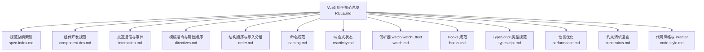

图表来源
- [RULE.md:1-68](file://rules/frontend-rules-vue3/RULE.md#L1-L68)
- [metadata.json:1-17](file://rules/frontend-rules-vue3/metadata.json#L1-L17)

章节来源
- [RULE.md:1-68](file://rules/frontend-rules-vue3/RULE.md#L1-L68)
- [metadata.json:1-17](file://rules/frontend-rules-vue3/metadata.json#L1-L17)

## 核心组件
本节聚焦 D03 规范中与组件开发直接相关的关键模块与规则。

- `<script setup>` 语法与结构顺序
  - 必须使用 `<script setup>`，禁止 Options API 写法；禁止在其中使用 `this`
  - 脚本内部声明顺序：imports → defineProps/defineEmits → Hooks → 业务逻辑（按功能模块分组：ref/reactive → computed → 方法 → watch → 生命周期钩子）→ defineExpose
  - Import 分组：node_modules → types → @src 全局 → ./../ 相对路径，组间空行，组内字母序
  - 模板属性顺序：is → v-for → v-if/else → v-show → id → props/attrs → v-on(@) → v-html/text → 动态 v-slot(#)

- Props TS 定义与 v-model 兼容
  - 必须使用 TypeScript 泛型定义 Props，推荐使用对象形式，包含 required/default/validator
  - Props 命名采用 camelCase，并添加注释说明
  - v-model 支持 Vue3 标准（modelValue）与 Ant Design Vue 风格（value），二者可共存

- Emit 事件白名单与触发顺序
  - 事件白名单覆盖 v-model 更新、交互类、弹窗类、操作类等
  - 触发顺序建议：update:modelValue/value → 其他业务事件 → change/click
  - 使用 TypeScript 泛型定义 emits，明确参数类型

- 生命周期限制与 defineExpose
  - 禁止在 Hooks 内部直接调用生命周期钩子（除非 Hooks 本身在组件顶层执行）
  - 禁止在 `<script setup>` 中使用 this
  - defineExpose 必须显式声明，仅暴露父组件业务必须调用的方法，避免暴露内部状态

- 响应式状态管理
  - 优先使用 ref，尽可能少用 reactive；复杂对象、批量更新、解构场景可使用 reactive
  - computed 优先替代派生逻辑，避免副作用与异步
  - watch/watchEffect 使用规范：深度监听需声明 deep，初始化需触发加 immediate；清理定时器与事件监听

- Hooks 设计与复用
  - 命名以 use 开头，文件名与函数名一致，存放于 @src/hooks 或组件同级目录
  - 返回值统一对象，禁止直接返回 reactive；必要时使用 toRefs
  - 可复用逻辑超 30 行或跨 2 个以上组件使用时，必须抽离为 Hook

- 组件命名与文件组织
  - 组件文件名：多单词 + PascalCase；目录：kebab-case；组件使用 PascalCase
  - 函数命名：API 函数（apiXxx）、事件函数（onXxx）
  - 变量/常量：常量全大写+下划线；Props camelCase；emit camelCase；布尔值 isXX/hasXX/showXX 前缀
  - Hooks：useXxx；TypeScript 类型：I+PascalCase；CSS BEM：块__元素--修饰符

- 模板指令与属性顺序
  - v-for 必须配合唯一 ID 的 key；禁止在同一元素上同时使用 v-if 与 v-for
  - v-html 必须用 DOMPurify 过滤
  - 指令简写：v-bind → :、v-on → @、v-slot → #
  - 模板属性统一顺序：is → v-for → v-if/else → v-show → id → props/attrs → v-on → v-html/text → 动态 v-slot

- 组件交互与通信
  - provide/inject 仅用于三层以上深层传参，避免跨层级滥用
  - 禁止使用 $parent/$children；数据流向单向（父→子），修改父状态通过 emit 通知

- 性能优化与最佳实践
  - 组件懒加载（defineAsyncComponent、路由惰性加载）
  - KeepAlive 缓存与 include/exclude 精确控制
  - 长列表使用虚拟滚动
  - 防抖节流：搜索框输入（防抖）、滚动/窗口 resize（节流）
  - 图片优化：WebP、合适尺寸、懒加载
  - 模板层轻量化：简单逻辑内联，复杂逻辑移至 computed/methods

章节来源
- [component-dev.md:1-81](file://rules/frontend-rules-vue3/references/component-dev.md#L1-L81)
- [order.md:1-141](file://rules/frontend-rules-vue3/references/order.md#L1-L141)
- [interaction.md:1-125](file://rules/frontend-rules-vue3/references/interaction.md#L1-L125)
- [directives.md:1-105](file://rules/frontend-rules-vue3/references/directives.md#L1-L105)
- [naming.md:1-85](file://rules/frontend-rules-vue3/references/naming.md#L1-L85)
- [reactivity.md:1-227](file://rules/frontend-rules-vue3/references/reactivity.md#L1-L227)
- [watch.md:1-154](file://rules/frontend-rules-vue3/references/watch.md#L1-L154)
- [hooks.md:1-158](file://rules/frontend-rules-vue3/references/hooks.md#L1-L158)
- [typescript.md:1-202](file://rules/frontend-rules-vue3/references/typescript.md#L1-L202)
- [performance.md:1-136](file://rules/frontend-rules-vue3/references/performance.md#L1-L136)
- [constraints.md:1-45](file://rules/frontend-rules-vue3/references/constraints.md#L1-L45)
- [code-style.md:1-61](file://rules/frontend-rules-vue3/references/code-style.md#L1-L61)

## 架构总览
下图展示了 Vue3 组件开发的总体架构与关键模块之间的关系，体现从“脚本结构顺序”到“交互通信”再到“性能优化”的闭环。

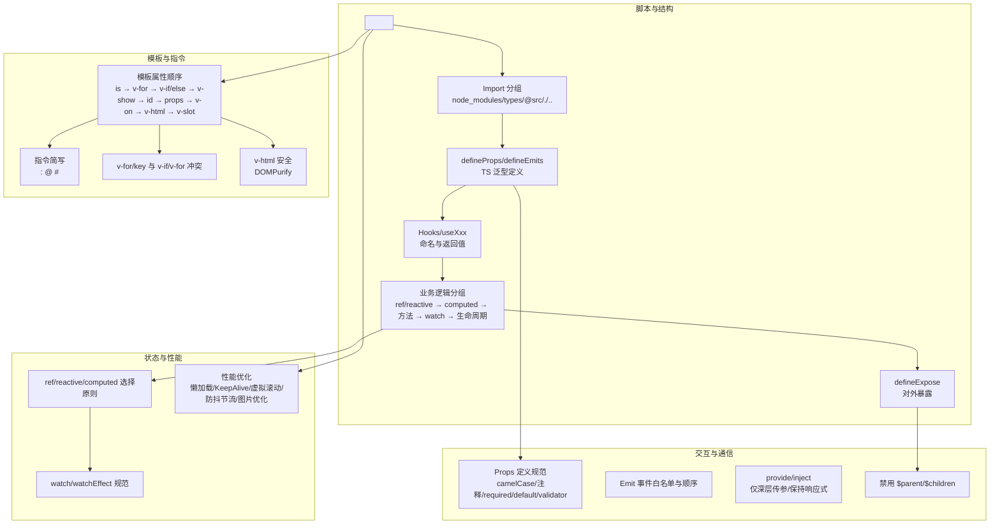

图表来源
- [order.md:1-141](file://rules/frontend-rules-vue3/references/order.md#L1-L141)
- [component-dev.md:1-81](file://rules/frontend-rules-vue3/references/component-dev.md#L1-L81)
- [directives.md:1-105](file://rules/frontend-rules-vue3/references/directives.md#L1-L105)
- [interaction.md:1-125](file://rules/frontend-rules-vue3/references/interaction.md#L1-L125)
- [reactivity.md:1-227](file://rules/frontend-rules-vue3/references/reactivity.md#L1-L227)
- [watch.md:1-154](file://rules/frontend-rules-vue3/references/watch.md#L1-L154)
- [performance.md:1-136](file://rules/frontend-rules-vue3/references/performance.md#L1-L136)

## 详细组件分析

### 组件脚本结构与导入顺序
- SFC 块顺序：template → script setup → style scoped
- script setup 内部顺序：imports → defineProps/defineEmits → Hooks → 业务逻辑（功能模块分组）→ defineExpose
- Import 分组与排序：node_modules → types → @src → ./../，组间空行，组内字母序
- 模板属性顺序：is → v-for → v-if/else → v-show → id → props/attrs → v-on → v-html → v-slot

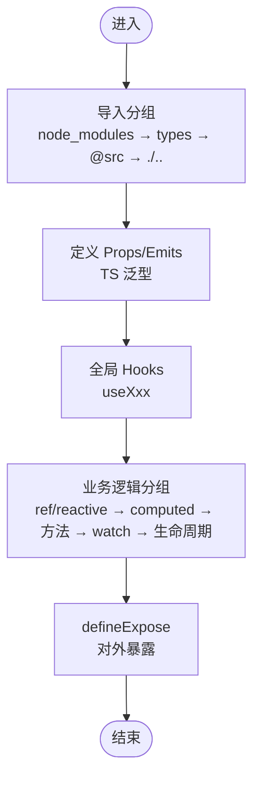

图表来源
- [order.md:1-141](file://rules/frontend-rules-vue3/references/order.md#L1-L141)
- [component-dev.md:1-81](file://rules/frontend-rules-vue3/references/component-dev.md#L1-L81)

章节来源
- [order.md:1-141](file://rules/frontend-rules-vue3/references/order.md#L1-L141)
- [component-dev.md:1-81](file://rules/frontend-rules-vue3/references/component-dev.md#L1-L81)

### Props TS 定义与 v-model 兼容
- Props 必须使用 TypeScript 泛型定义，推荐对象形式，包含 required/default/validator
- 命名 camelCase，必须添加注释说明
- v-model 支持 Vue3 标准（modelValue）与 Ant Design Vue 风格（value），二者可共存

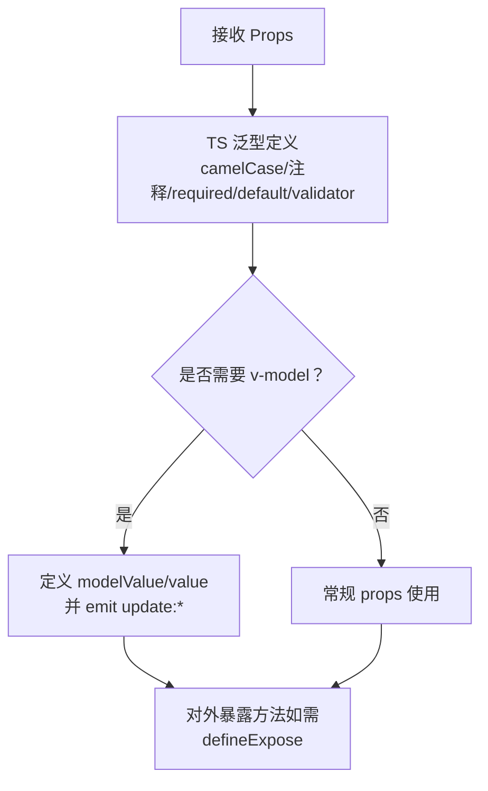

图表来源
- [typescript.md:33-76](file://rules/frontend-rules-vue3/references/typescript.md#L33-L76)
- [interaction.md:23-38](file://rules/frontend-rules-vue3/references/interaction.md#L23-L38)

章节来源
- [typescript.md:33-76](file://rules/frontend-rules-vue3/references/typescript.md#L33-L76)
- [interaction.md:7-38](file://rules/frontend-rules-vue3/references/interaction.md#L7-L38)

### Emit 事件白名单与触发顺序
- 事件白名单覆盖 v-model 更新、交互类、弹窗类、操作类等
- 触发顺序建议：update:modelValue/value → 其他业务事件 → change/click
- 使用 TypeScript 泛型定义 emits，明确参数类型

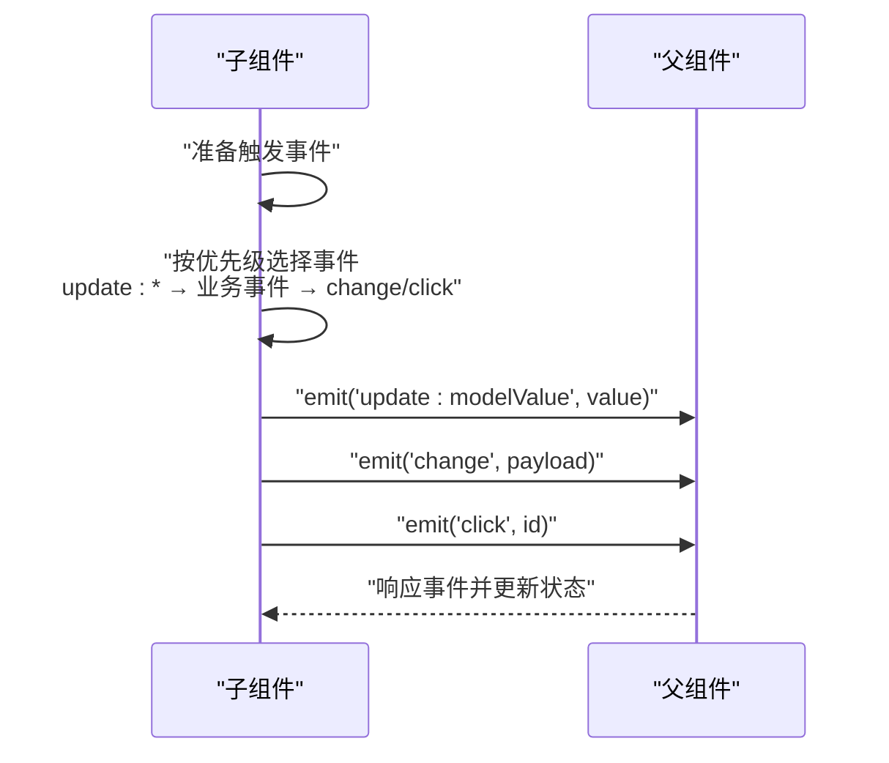

图表来源
- [interaction.md:47-82](file://rules/frontend-rules-vue3/references/interaction.md#L47-L82)

章节来源
- [interaction.md:47-82](file://rules/frontend-rules-vue3/references/interaction.md#L47-L82)

### 生命周期限制与 defineExpose
- 禁止在 Hooks 内部直接调用生命周期钩子（除非 Hooks 本身在组件顶层执行）
- 禁止在 `<script setup>` 中使用 this
- defineExpose 必须显式声明，仅暴露父组件业务必须调用的方法，避免暴露内部状态

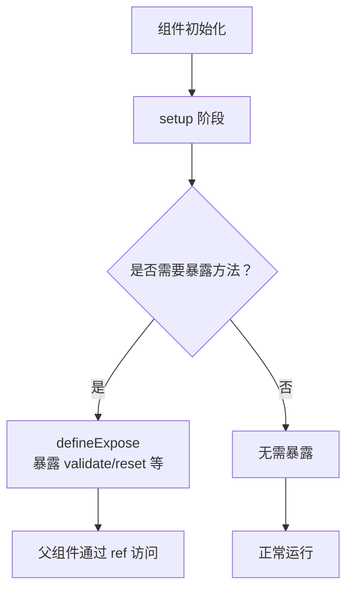

图表来源
- [interaction.md:86-106](file://rules/frontend-rules-vue3/references/interaction.md#L86-L106)
- [component-dev.md:66-68](file://rules/frontend-rules-vue3/references/component-dev.md#L66-L68)

章节来源
- [interaction.md:86-106](file://rules/frontend-rules-vue3/references/interaction.md#L86-L106)
- [component-dev.md:66-68](file://rules/frontend-rules-vue3/references/component-dev.md#L66-L68)

### 响应式状态管理（ref/reactive/computed）
- 优先使用 ref，尽可能少用 reactive；复杂对象、批量更新、解构场景可使用 reactive
- computed 优先替代派生逻辑，避免副作用与异步
- watch/watchEffect 使用规范：深度监听需声明 deep，初始化需触发加 immediate；清理定时器与事件监听

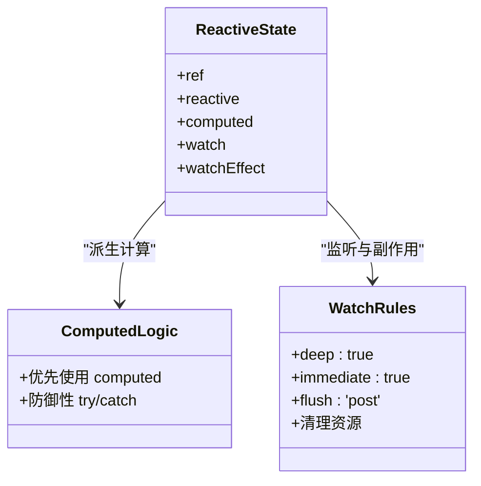

图表来源
- [reactivity.md:7-227](file://rules/frontend-rules-vue3/references/reactivity.md#L7-L227)
- [watch.md:7-154](file://rules/frontend-rules-vue3/references/watch.md#L7-L154)

章节来源
- [reactivity.md:7-227](file://rules/frontend-rules-vue3/references/reactivity.md#L7-L227)
- [watch.md:7-154](file://rules/frontend-rules-vue3/references/watch.md#L7-L154)

### Hooks 设计与复用
- 命名以 use 开头，文件名与函数名一致，存放于 @src/hooks 或组件同级目录
- 返回值统一对象，禁止直接返回 reactive；必要时使用 toRefs
- 可复用逻辑超 30 行或跨 2 个以上组件使用时，必须抽离为 Hook

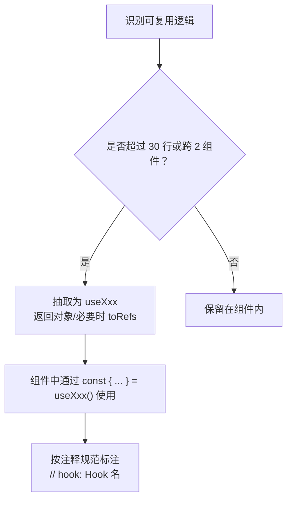

图表来源
- [hooks.md:14-158](file://rules/frontend-rules-vue3/references/hooks.md#L14-L158)
- [order.md:92-128](file://rules/frontend-rules-vue3/references/order.md#L92-L128)

章节来源
- [hooks.md:14-158](file://rules/frontend-rules-vue3/references/hooks.md#L14-L158)
- [order.md:92-128](file://rules/frontend-rules-vue3/references/order.md#L92-L128)

### 模板指令与属性顺序
- v-for 必须配合唯一 ID 的 key；禁止在同一元素上同时使用 v-if 与 v-for
- v-html 必须用 DOMPurify 过滤
- 指令简写：v-bind → :、v-on → @、v-slot → #
- 模板属性统一顺序：is → v-for → v-if/else → v-show → id → props/attrs → v-on → v-html → v-slot

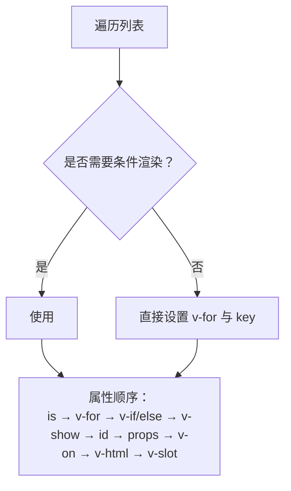

图表来源
- [directives.md:7-98](file://rules/frontend-rules-vue3/references/directives.md#L7-L98)

章节来源
- [directives.md:7-98](file://rules/frontend-rules-vue3/references/directives.md#L7-L98)

### 组件交互与通信
- provide/inject 仅用于三层以上深层传参，避免跨层级滥用；保持响应式传递
- 禁止使用 $parent/$children；数据流向单向（父→子），修改父状态通过 emit 通知

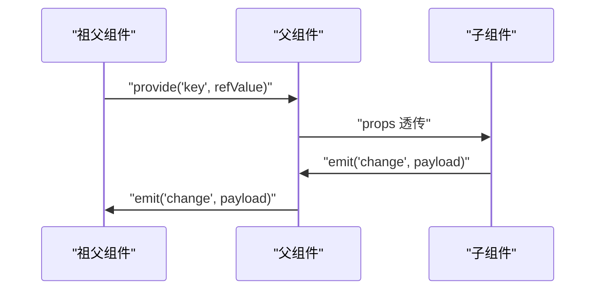

图表来源
- [interaction.md:110-125](file://rules/frontend-rules-vue3/references/interaction.md#L110-L125)

章节来源
- [interaction.md:110-125](file://rules/frontend-rules-vue3/references/interaction.md#L110-L125)

### 组件命名与文件组织
- 组件文件名：多单词 + PascalCase；目录：kebab-case；组件使用 PascalCase
- 函数命名：API 函数（apiXxx）、事件函数（onXxx）
- 变量/常量：常量全大写+下划线；Props camelCase；emit camelCase；布尔值 isXX/hasXX/showXX 前缀
- Hooks：useXxx；TypeScript 类型：I+PascalCase；CSS BEM：块__元素--修饰符

章节来源
- [naming.md:7-85](file://rules/frontend-rules-vue3/references/naming.md#L7-L85)

### 性能优化与最佳实践
- 组件懒加载：defineAsyncComponent 动态导入、路由惰性加载
- KeepAlive 缓存：include/exclude 精确控制
- 长列表：虚拟滚动
- 防抖节流：搜索框输入（防抖）、滚动/窗口 resize（节流）
- 图片优化：WebP、合适尺寸、懒加载
- 模板层轻量化：简单逻辑内联，复杂逻辑移至 computed/methods

章节来源
- [performance.md:7-136](file://rules/frontend-rules-vue3/references/performance.md#L7-L136)

## 依赖关系分析
- 模块耦合与内聚
  - component-dev 与 order 紧密耦合，共同定义脚本结构与导入顺序
  - interaction 与 directives、typescript 协同，确保 Props/Emit/指令使用的类型安全与一致性
  - reactivity 与 watch 提供状态与监听基础能力，hooks 在其之上构建可复用逻辑
  - performance 与 code-style 为风格与工具链层面的支撑

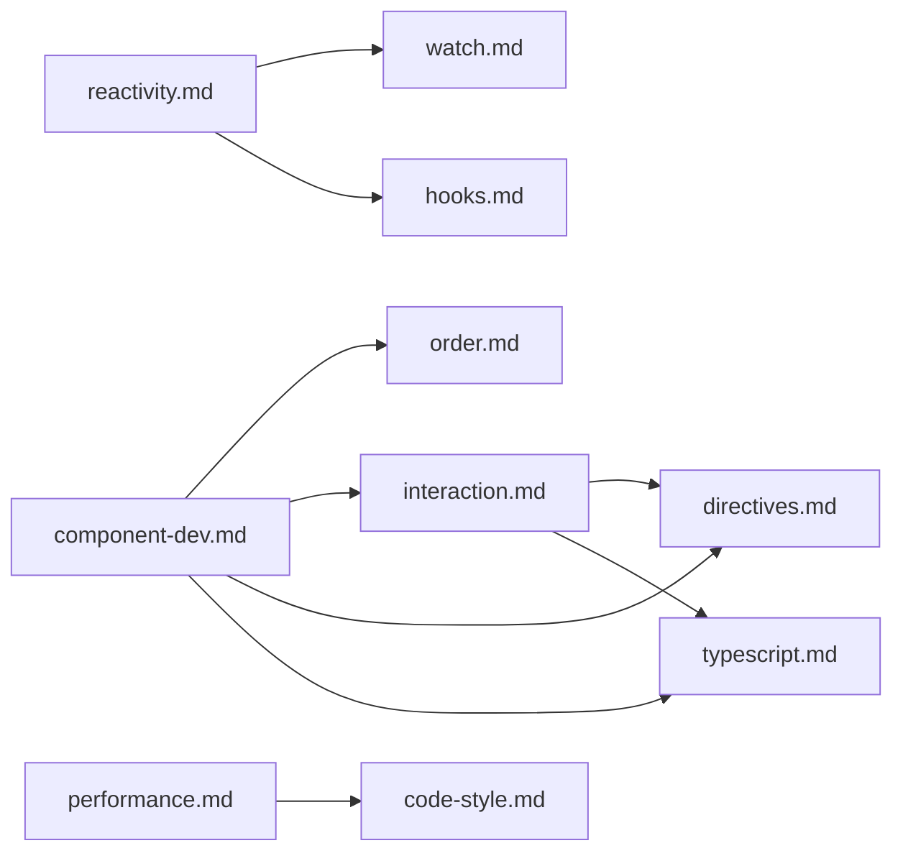

图表来源
- [component-dev.md:1-81](file://rules/frontend-rules-vue3/references/component-dev.md#L1-L81)
- [order.md:1-141](file://rules/frontend-rules-vue3/references/order.md#L1-L141)
- [interaction.md:1-125](file://rules/frontend-rules-vue3/references/interaction.md#L1-L125)
- [directives.md:1-105](file://rules/frontend-rules-vue3/references/directives.md#L1-L105)
- [typescript.md:1-202](file://rules/frontend-rules-vue3/references/typescript.md#L1-L202)
- [reactivity.md:1-227](file://rules/frontend-rules-vue3/references/reactivity.md#L1-L227)
- [watch.md:1-154](file://rules/frontend-rules-vue3/references/watch.md#L1-L154)
- [hooks.md:1-158](file://rules/frontend-rules-vue3/references/hooks.md#L1-L158)
- [performance.md:1-136](file://rules/frontend-rules-vue3/references/performance.md#L1-L136)
- [code-style.md:1-61](file://rules/frontend-rules-vue3/references/code-style.md#L1-L61)

## 性能考量
- 优先使用 computed 派生状态，减少 watch 滥用
- 大型数据列表考虑 shallowRef 减少深层响应式开销
- 避免在 watch 中执行同步 DOM 操作
- 自定义指令与路由守卫中清理定时器与事件监听
- 防抖节流策略：搜索框输入（防抖）、滚动/窗口 resize（节流）

章节来源
- [reactivity.md:132-205](file://rules/frontend-rules-vue3/references/reactivity.md#L132-L205)
- [performance.md:107-136](file://rules/frontend-rules-vue3/references/performance.md#L107-L136)

## 故障排查指南
- 常见违规与修复
  - 连续数据解构：避免 `...data.data`，改为扁平化访问
  - 父组件修改子组件数据：通过 emit 通知父组件更新
  - 修改 ref/reactive 类型：严格遵循后端给定类型
  - 修改 props：使用只读访问，通过 emit 通知父组件
  - 使用 mixins：改用 Hooks/组合式函数
  - 无意义命名：避免 `data1`、`temp2`，采用语义化命名
  - 使用 this：禁止在 `<script setup>` 中使用 `this`
  - Options API：统一使用 `<script setup>`
  - v-for 与 v-if 同元素：使用 <template> 包裹或 computed 过滤
  - index 作为 key：必须使用唯一 ID

- 推荐与不推荐
  - 推荐：函数 try/catch、async/await、computed 优先、watch 深度/立即监听、Hooks 抽离
  - 不推荐：多层 try/catch 嵌套、生命周期 emit、可选链操作符 `?.`、CSS 原生嵌套、`:has()` 伪类

章节来源
- [constraints.md:3-45](file://rules/frontend-rules-vue3/references/constraints.md#L3-L45)

## 结论
D03 Vue3 组件规范围绕“脚本结构顺序、Props TS 定义、Emit 事件白名单、生命周期限制、组件命名、响应式状态管理、Hooks 设计、模板指令与属性顺序、组件交互与通信、性能优化”十个维度，形成一套可落地、可检查、可演进的工程化规范。遵循该规范可显著提升代码质量、可读性与可维护性，降低协作成本与回归风险。

## 附录
- 快速导航（模块与核心内容）
  - 规范总纲：三级优先级索引（基础/强烈推荐/风格指南）
  - 组件开发：`<script setup>` 脚本结构、JSDoc、元素顺序、方法职责、页面拆分
  - 交互通信：Props 定义、Emit 白名单、defineExpose、provide/inject、禁用 $parent/$children
  - 模板指令：v-for/key、v-if 冲突、v-html 安全、指令简写、属性顺序
  - 结构顺序：4 组 import 排序、`<script setup>` 内部 5 段结构
  - 命名规范：文件/组件/API/事件/常量/布尔值/Hooks（Props/Emit 详见交互通信）
  - Hooks：命名/返回值/使用规范、抽离建议、组件中导入顺序
  - 响应式：ref 优先、reactive 转 ref、computed 规范、try/catch 包裹
  - 监听：watch 深度/立即、清理资源、与 computed 选择策略
  - 网络请求：async/await、统一响应解构、错误处理、安全规范
  - 代码风格：Prettier 配置、箭头函数优先
  - 注释：模板/脚本/样式注释格式、注释保护原则
  - CSS/BEM：BEM 命名、scoped 优先、自定义指令
  - TypeScript：禁止 any/as any/@ts-ignore、类型注解规范、import type
  - 性能：懒加载、KeepAlive、虚拟滚动、防抖节流、图片优化
  - 约束清单：10 项禁止、5 项推荐、2 项不推荐、注意事项

章节来源
- [RULE.md:48-68](file://rules/frontend-rules-vue3/RULE.md#L48-L68)