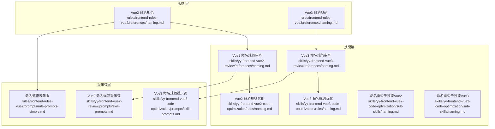
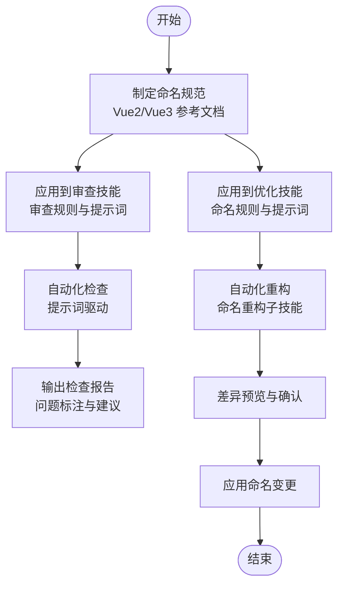
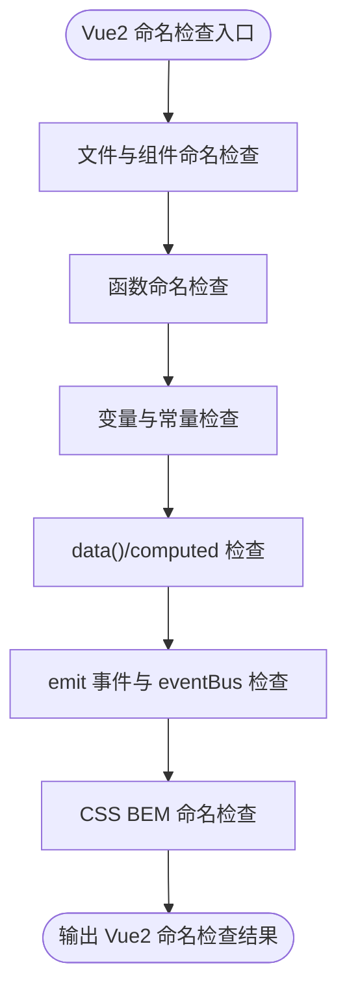
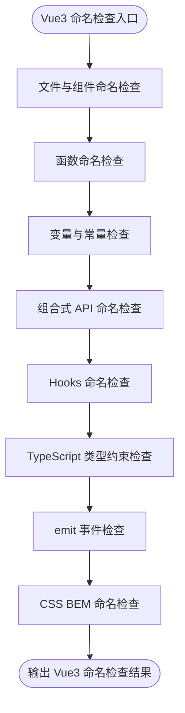
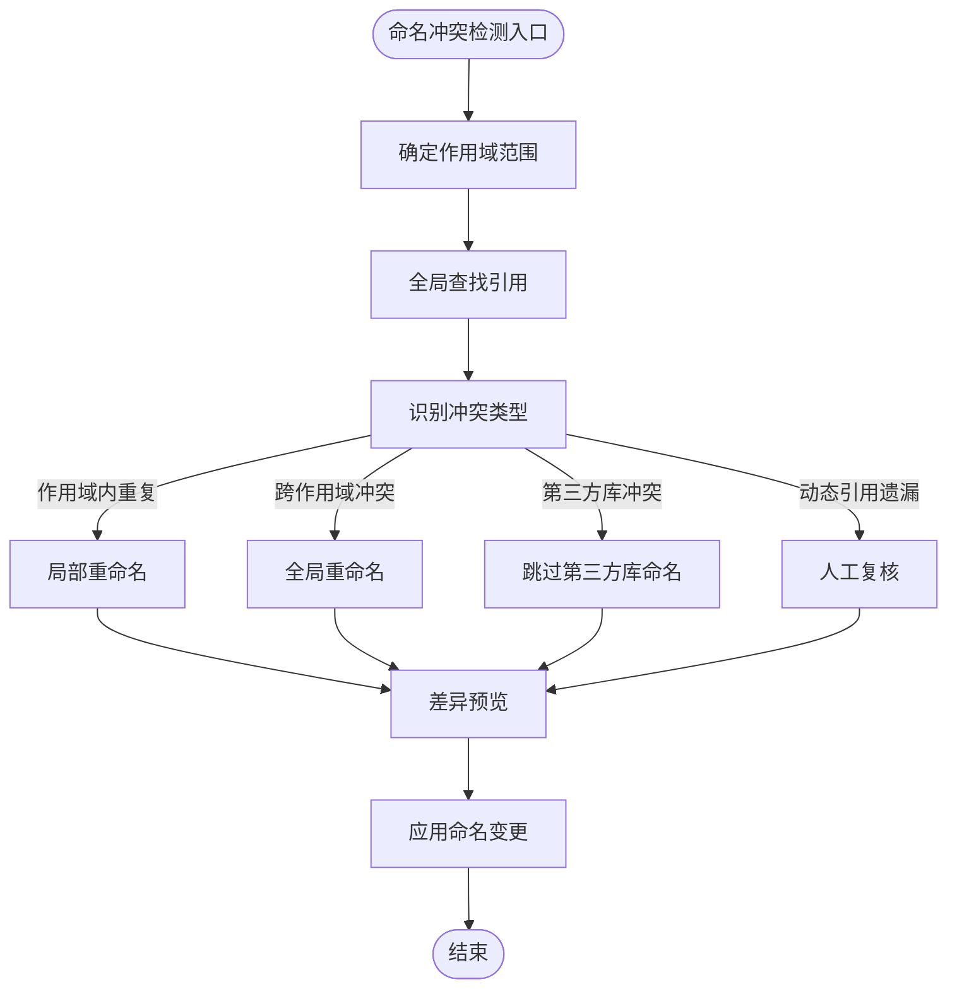
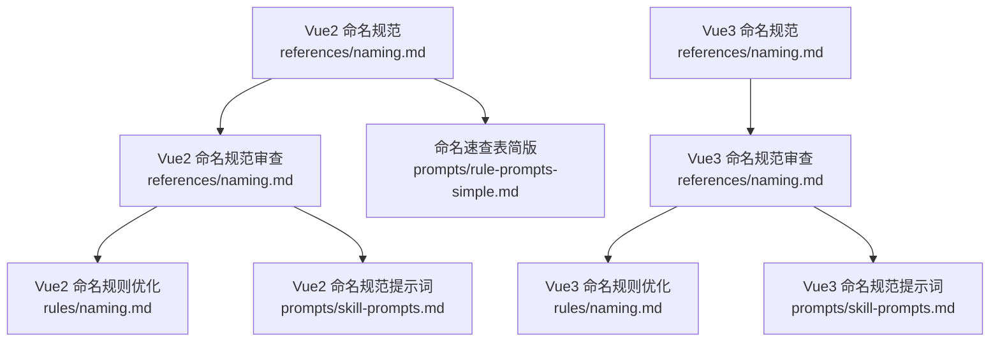

# D04 命名规范

<cite>
**本文引用的文件**
- [rules/frontend-rules-vue2/references/naming.md](file://rules/frontend-rules-vue2/references/naming.md)
- [rules/frontend-rules-vue3/references/naming.md](file://rules/frontend-rules-vue3/references/naming.md)
- [skills/yy-frontend-vue2-review/references/naming.md](file://skills/yy-frontend-vue2-review/references/naming.md)
- [skills/yy-frontend-vue3-review/references/naming.md](file://skills/yy-frontend-vue3-review/references/naming.md)
- [skills/yy-frontend-vue2-code-optimization/rules/naming.md](file://skills/yy-frontend-vue2-code-optimization/rules/naming.md)
- [skills/yy-frontend-vue3-code-optimization/rules/naming.md](file://skills/yy-frontend-vue3-code-optimization/rules/naming.md)
- [skills/yy-frontend-vue2-code-optimization/sub-skills/naming.md](file://skills/yy-frontend-vue2-code-optimization/sub-skills/naming.md)
- [skills/yy-frontend-vue3-code-optimization/sub-skills/naming.md](file://skills/yy-frontend-vue3-code-optimization/sub-skills/naming.md)
- [rules/frontend-rules-vue2/prompts/rule-prompts-simple.md](file://rules/frontend-rules-vue2/prompts/rule-prompts-simple.md)
- [skills/yy-frontend-vue2-review/prompts/skill-prompts.md](file://skills/yy-frontend-vue2-review/prompts/skill-prompts.md)
- [skills/yy-frontend-vue3-code-optimization/prompts/skill-prompts.md](file://skills/yy-frontend-vue3-code-optimization/prompts/skill-prompts.md)
- [package.json](file://package.json)
</cite>

## 目录
1. [简介](#简介)
2. [项目结构](#项目结构)
3. [核心组件](#核心组件)
4. [架构概览](#架构概览)
5. [详细组件分析](#详细组件分析)
6. [依赖分析](#依赖分析)
7. [性能考虑](#性能考虑)
8. [故障排除指南](#故障排除指南)
9. [结论](#结论)
10. [附录](#附录)

## 简介
本文件系统化梳理 D04 命名规范，覆盖 Vue2/Vue3 生态中的 API 函数、事件函数、变量/方法、常量、Props、组件名、文件名、emit 事件、Hooks、布尔值、TS 类型约束等各类命名约定。同时提供命名冲突检测与解决方法、语义化原则与可读性要求、命名一致性检查与重构建议，帮助团队建立统一、清晰、可维护的命名体系。

## 项目结构
该仓库围绕前端规则与技能构建了多层级的命名规范文档与工具链：
- 规则层：Vue2/Vue3 分别提供命名规范参考文档，统一术语与标准
- 技能层：面向审查与优化的命名规则文档与提示词，强调实践落地
- 工具层：通过脚本与提示词驱动自动化检查与重构

**图表来源**
- [rules/frontend-rules-vue2/references/naming.md](file://rules/frontend-rules-vue2/references/naming.md)
- [rules/frontend-rules-vue3/references/naming.md](file://rules/frontend-rules-vue3/references/naming.md)
- [skills/yy-frontend-vue2-review/references/naming.md](file://skills/yy-frontend-vue2-review/references/naming.md)
- [skills/yy-frontend-vue3-review/references/naming.md](file://skills/yy-frontend-vue3-review/references/naming.md)
- [skills/yy-frontend-vue2-code-optimization/rules/naming.md](file://skills/yy-frontend-vue2-code-optimization/rules/naming.md)
- [skills/yy-frontend-vue3-code-optimization/rules/naming.md](file://skills/yy-frontend-vue3-code-optimization/rules/naming.md)
- [rules/frontend-rules-vue2/prompts/rule-prompts-simple.md](file://rules/frontend-rules-vue2/prompts/rule-prompts-simple.md)
- [skills/yy-frontend-vue2-review/prompts/skill-prompts.md](file://skills/yy-frontend-vue2-review/prompts/skill-prompts.md)
- [skills/yy-frontend-vue3-code-optimization/prompts/skill-prompts.md](file://skills/yy-frontend-vue3-code-optimization/prompts/skill-prompts.md)

**章节来源**
- [rules/frontend-rules-vue2/references/naming.md](file://rules/frontend-rules-vue2/references/naming.md)
- [rules/frontend-rules-vue3/references/naming.md](file://rules/frontend-rules-vue3/references/naming.md)
- [skills/yy-frontend-vue2-review/references/naming.md](file://skills/yy-frontend-vue2-review/references/naming.md)
- [skills/yy-frontend-vue3-review/references/naming.md](file://skills/yy-frontend-vue3-review/references/naming.md)
- [skills/yy-frontend-vue2-code-optimization/rules/naming.md](file://skills/yy-frontend-vue2-code-optimization/rules/naming.md)
- [skills/yy-frontend-vue3-code-optimization/rules/naming.md](file://skills/yy-frontend-vue3-code-optimization/rules/naming.md)
- [rules/frontend-rules-vue2/prompts/rule-prompts-simple.md](file://rules/frontend-rules-vue2/prompts/rule-prompts-simple.md)
- [skills/yy-frontend-vue2-review/prompts/skill-prompts.md](file://skills/yy-frontend-vue2-review/prompts/skill-prompts.md)
- [skills/yy-frontend-vue3-code-optimization/prompts/skill-prompts.md](file://skills/yy-frontend-vue3-code-optimization/prompts/skill-prompts.md)

## 核心组件
本节聚焦 D04 命名规范的关键要素与检查要点，形成统一的检查规则矩阵与判定标准。

- 文件与组件命名
  - 组件文件名：多单词 + PascalCase（如 UserList.vue）
  - 目录命名：kebab-case（如 user-profile/）
  - 组件使用：PascalCase（如 <UserCard />）
  - 重要提醒：组件名应使用多个单词，避免与 HTML 原生元素冲突

- 函数命名体系
  - API 函数：api + Method + URLPath（小驼峰，如 apiGetUserInfo）
  - 事件函数：on + EventName（小驼峰，如 onClickSubmit）

- 变量与常量规范
  - 常量：全大写 + 下划线（如 MAX_RETRY_COUNT）
  - Props/Emits：camelCase（如 userName, userChange）
  - 布尔值：isXX / hasXX / showXX 前缀（如 isVisible, hasPermission）
  - 变量/方法：有意义的驼峰命名，禁止 data1、temp2 等无意义命名

- Vue3 组合式 API 命名
  - ref/reactive/computed：camelCase（如 isLoading, formData）
  - Hooks：必须以 use 开头（如 useTable, useSearchForm）

- TypeScript 类型约束
  - 类型别名/接口：I + PascalCase（如 IUserInfo, IUser）
  - 泛型参数：单字母大写（如 T, K, V）
  - 参数/返回值/变量必须明确类型，禁止使用 any（推荐 unknown 或具体类型）

- 事件命名
  - emit 事件名：camelCase（如 userChange）
  - eventBus 事件名：小驼峰（如 userChange, formSubmit）

- CSS 命名（BEM 规范）
  - 块：独立组件/模块（如 card, form）
  - 元素：块内部子元素（如 card__title, form__input）
  - 修饰符：状态/样式变体（如 card--dark, card__title--large）
  - 规则：全小写、横线连接、类名唯一；禁止使用下划线（除 __ 外）

**章节来源**
- [rules/frontend-rules-vue2/references/naming.md](file://rules/frontend-rules-vue2/references/naming.md)
- [rules/frontend-rules-vue3/references/naming.md](file://rules/frontend-rules-vue3/references/naming.md)
- [skills/yy-frontend-vue2-review/references/naming.md](file://skills/yy-frontend-vue2-review/references/naming.md)
- [skills/yy-frontend-vue3-review/references/naming.md](file://skills/yy-frontend-vue3-review/references/naming.md)
- [skills/yy-frontend-vue2-code-optimization/rules/naming.md](file://skills/yy-frontend-vue2-code-optimization/rules/naming.md)
- [skills/yy-frontend-vue3-code-optimization/rules/naming.md](file://skills/yy-frontend-vue3-code-optimization/rules/naming.md)

## 架构概览
D04 命名规范在仓库中的落地路径如下：
- 规则制定：各版本 Vue 的命名规范参考文档
- 实践应用：审查与优化技能中的命名规则与提示词
- 自动化支持：通过脚本与提示词驱动的检查与重构流程

**图表来源**
- [rules/frontend-rules-vue2/references/naming.md](file://rules/frontend-rules-vue2/references/naming.md)
- [rules/frontend-rules-vue3/references/naming.md](file://rules/frontend-rules-vue3/references/naming.md)
- [skills/yy-frontend-vue2-review/references/naming.md](file://skills/yy-frontend-vue2-review/references/naming.md)
- [skills/yy-frontend-vue3-review/references/naming.md](file://skills/yy-frontend-vue3-review/references/naming.md)
- [skills/yy-frontend-vue2-code-optimization/sub-skills/naming.md](file://skills/yy-frontend-vue2-code-optimization/sub-skills/naming.md)
- [skills/yy-frontend-vue3-code-optimization/sub-skills/naming.md](file://skills/yy-frontend-vue3-code-optimization/sub-skills/naming.md)

## 详细组件分析

### Vue2 命名规范
- 文件与组件命名：组件文件名多单词 + PascalCase，目录 kebab-case，组件使用 PascalCase
- 函数命名：API 函数与事件函数采用小驼峰命名
- 变量与常量：常量全大写 + 下划线，Props/Emits camelCase，布尔值使用 isXX/hasXX/showXX 前缀
- data()/computed 命名：camelCase，computed 建议使用 isXX/hasXX 前缀
- 事件命名：emit 事件与 eventBus 事件均使用小驼峰
- CSS 命名：BEM 规范，全小写、__ 连接元素、-- 连接修饰符，类名唯一

**图表来源**
- [rules/frontend-rules-vue2/references/naming.md](file://rules/frontend-rules-vue2/references/naming.md)
- [skills/yy-frontend-vue2-review/references/naming.md](file://skills/yy-frontend-vue2-review/references/naming.md)
- [skills/yy-frontend-vue2-code-optimization/rules/naming.md](file://skills/yy-frontend-vue2-code-optimization/rules/naming.md)

**章节来源**
- [rules/frontend-rules-vue2/references/naming.md](file://rules/frontend-rules-vue2/references/naming.md)
- [skills/yy-frontend-vue2-review/references/naming.md](file://skills/yy-frontend-vue2-review/references/naming.md)
- [skills/yy-frontend-vue2-code-optimization/rules/naming.md](file://skills/yy-frontend-vue2-code-optimization/rules/naming.md)

### Vue3 命名规范
- 文件与组件命名：与 Vue2 一致，组件名应使用多个单词
- 函数命名：API 函数与事件函数采用小驼峰命名
- 变量与常量：常量全大写 + 下划线，Props camelCase，emit 事件 camelCase，布尔值使用 isXX/hasXX/showXX 前缀
- 组合式 API：ref/reactive/computed 使用 camelCase
- Hooks：必须以 use 开头，如 useTable, useSearchForm
- TypeScript 类型：I + PascalCase，泛型参数单字母大写
- CSS 命名：BEM 规范，全小写、横线连接、类名唯一

**图表来源**
- [rules/frontend-rules-vue3/references/naming.md](file://rules/frontend-rules-vue3/references/naming.md)
- [skills/yy-frontend-vue3-review/references/naming.md](file://skills/yy-frontend-vue3-review/references/naming.md)
- [skills/yy-frontend-vue3-code-optimization/rules/naming.md](file://skills/yy-frontend-vue3-code-optimization/rules/naming.md)

**章节来源**
- [rules/frontend-rules-vue3/references/naming.md](file://rules/frontend-rules-vue3/references/naming.md)
- [skills/yy-frontend-vue3-review/references/naming.md](file://skills/yy-frontend-vue3-review/references/naming.md)
- [skills/yy-frontend-vue3-code-optimization/rules/naming.md](file://skills/yy-frontend-vue3-code-optimization/rules/naming.md)

### 命名冲突检测与解决
- 冲突类型
  - 作用域内重复：同一文件或组件内同名标识符
  - 跨作用域冲突：跨文件、跨组件、跨模块命名重复
  - 第三方库冲突：某些标识符可能是第三方库 API 名称，不应修改
  - 动态引用遗漏：全局搜索可能遗漏动态字符串引用（如 this[name]）

- 检测策略
  - 全局查找：使用 LSP 或 AST-grep 查找所有引用，确保不遗漏任何引用点
  - 分类替换：按作用域范围（单文件 → 组件内 → 跨组件 → 全局 API）逐个替换
  - 差异预览：展示变更前后的 diff 格式，确认无误后执行

- 解决方法
  - 引用遗漏：补充动态字符串引用的静态分析或人工复核
  - 第三方库冲突：保留第三方库 API 名称，仅修改自有命名
  - API 路径变更：API 函数重命名时保持 HTTP 请求路径不变
  - 组件名变更：同步更新组件注册（如有）

**图表来源**
- [skills/yy-frontend-vue2-code-optimization/sub-skills/naming.md](file://skills/yy-frontend-vue2-code-optimization/sub-skills/naming.md)
- [skills/yy-frontend-vue3-code-optimization/sub-skills/naming.md](file://skills/yy-frontend-vue3-code-optimization/sub-skills/naming.md)

**章节来源**
- [skills/yy-frontend-vue2-code-optimization/sub-skills/naming.md](file://skills/yy-frontend-vue2-code-optimization/sub-skills/naming.md)
- [skills/yy-frontend-vue3-code-optimization/sub-skills/naming.md](file://skills/yy-frontend-vue3-code-optimization/sub-skills/naming.md)

### 语义化原则与可读性要求
- 语义化原则
  - API 函数：以 api 前缀 + HTTP 方法 + URL 路径（小驼峰），体现接口语义
  - 事件函数：以 on 前缀 + 事件名（小驼峰），体现事件触发语义
  - Props/Emits：camelCase，配合注释说明用途
  - 布尔值：isXX/hasXX/showXX 前缀，直观表达布尔含义
  - Hooks：use 前缀，明确组合式逻辑语义
  - TypeScript 类型：I + PascalCase，泛型参数单字母大写，提升类型表达力

- 可读性要求
  - 禁止无意义命名（如 data1、temp2），优先使用描述性语义
  - computed 属性建议使用 is/has/visible/formatted/total 等前缀，增强可读性
  - CSS BEM 命名全小写、横线连接，避免嵌套与下划线（除 __ 外）

**章节来源**
- [rules/frontend-rules-vue2/references/naming.md](file://rules/frontend-rules-vue2/references/naming.md)
- [rules/frontend-rules-vue3/references/naming.md](file://rules/frontend-rules-vue3/references/naming.md)
- [skills/yy-frontend-vue2-review/references/naming.md](file://skills/yy-frontend-vue2-review/references/naming.md)
- [skills/yy-frontend-vue3-review/references/naming.md](file://skills/yy-frontend-vue3-review/references/naming.md)

### 命名一致性检查与重构建议
- 一致性检查
  - 统一命名风格：在团队内推广 PascalCase、camelCase、全大写 + 下划线等约定
  - 规则可视化：通过命名速查表与提示词，形成可执行的检查清单
  - 覆盖面检查：确保文件名、组件名、函数名、变量名、常量名、Hooks、TS 类型、CSS 类名等全面覆盖

- 重构建议
  - 语义化命名重构：优先替换无意义命名，提升可读性与可维护性
  - 作用域分层：先单文件，再组件内，后跨组件，最后全局 API 的顺序进行替换
  - 差异预览：在应用变更前展示 diff，确保变更准确且无副作用
  - 类型安全：TypeScript 类型重命名后，确认类型引用已同步更新

**章节来源**
- [rules/frontend-rules-vue2/prompts/rule-prompts-simple.md](file://rules/frontend-rules-vue2/prompts/rule-prompts-simple.md)
- [skills/yy-frontend-vue2-review/prompts/skill-prompts.md](file://skills/yy-frontend-vue2-review/prompts/skill-prompts.md)
- [skills/yy-frontend-vue3-code-optimization/prompts/skill-prompts.md](file://skills/yy-frontend-vue3-code-optimization/prompts/skill-prompts.md)

## 依赖分析
D04 命名规范在仓库中的依赖关系主要体现在规则与技能之间的传递与复用：

**图表来源**
- [rules/frontend-rules-vue2/references/naming.md](file://rules/frontend-rules-vue2/references/naming.md)
- [rules/frontend-rules-vue3/references/naming.md](file://rules/frontend-rules-vue3/references/naming.md)
- [skills/yy-frontend-vue2-review/references/naming.md](file://skills/yy-frontend-vue2-review/references/naming.md)
- [skills/yy-frontend-vue3-review/references/naming.md](file://skills/yy-frontend-vue3-review/references/naming.md)
- [skills/yy-frontend-vue2-code-optimization/rules/naming.md](file://skills/yy-frontend-vue2-code-optimization/rules/naming.md)
- [skills/yy-frontend-vue3-code-optimization/rules/naming.md](file://skills/yy-frontend-vue3-code-optimization/rules/naming.md)
- [rules/frontend-rules-vue2/prompts/rule-prompts-simple.md](file://rules/frontend-rules-vue2/prompts/rule-prompts-simple.md)
- [skills/yy-frontend-vue2-review/prompts/skill-prompts.md](file://skills/yy-frontend-vue2-review/prompts/skill-prompts.md)
- [skills/yy-frontend-vue3-code-optimization/prompts/skill-prompts.md](file://skills/yy-frontend-vue3-code-optimization/prompts/skill-prompts.md)

**章节来源**
- [rules/frontend-rules-vue2/references/naming.md](file://rules/frontend-rules-vue2/references/naming.md)
- [rules/frontend-rules-vue3/references/naming.md](file://rules/frontend-rules-vue3/references/naming.md)
- [skills/yy-frontend-vue2-review/references/naming.md](file://skills/yy-frontend-vue2-review/references/naming.md)
- [skills/yy-frontend-vue3-review/references/naming.md](file://skills/yy-frontend-vue3-review/references/naming.md)
- [skills/yy-frontend-vue2-code-optimization/rules/naming.md](file://skills/yy-frontend-vue2-code-optimization/rules/naming.md)
- [skills/yy-frontend-vue3-code-optimization/rules/naming.md](file://skills/yy-frontend-vue3-code-optimization/rules/naming.md)
- [rules/frontend-rules-vue2/prompts/rule-prompts-simple.md](file://rules/frontend-rules-vue2/prompts/rule-prompts-simple.md)
- [skills/yy-frontend-vue2-review/prompts/skill-prompts.md](file://skills/yy-frontend-vue2-review/prompts/skill-prompts.md)
- [skills/yy-frontend-vue3-code-optimization/prompts/skill-prompts.md](file://skills/yy-frontend-vue3-code-optimization/prompts/skill-prompts.md)

## 性能考虑
- 命名检查的性能影响主要来自全局查找与差异预览，建议：
  - 在大型项目中分模块执行检查，减少一次性扫描范围
  - 使用增量检查策略，仅针对变更文件进行命名规范校验
  - 差异预览阶段避免过大的 diff 输出，必要时分批展示

## 故障排除指南
- 常见问题与处理
  - 引用遗漏：使用 LSP/AST-grep 确保全局查找完整；对动态字符串引用进行人工复核
  - 第三方库冲突：识别第三方库 API 名称，避免修改；仅修改自有命名
  - API 路径变更：API 函数重命名时保持 HTTP 请求路径不变
  - 组件名变更：同步更新组件注册（如有），确保模板与路由引用正确
  - 类型重命名：TypeScript 类型重命名后，确认类型引用已同步更新

- 质量门禁
  - lint 检查通过
  - TypeScript 编译无错误
  - 安全扫描通过

**章节来源**
- [skills/yy-frontend-vue2-code-optimization/sub-skills/naming.md](file://skills/yy-frontend-vue2-code-optimization/sub-skills/naming.md)
- [skills/yy-frontend-vue3-code-optimization/sub-skills/naming.md](file://skills/yy-frontend-vue3-code-optimization/sub-skills/naming.md)
- [package.json](file://package.json)

## 结论
D04 命名规范通过规则层、技能层与工具层的协同，实现了从标准制定到实践落地的闭环。团队应以 Vue2/Vue3 命名规范为基准，结合审查与优化技能中的提示词与流程，严格执行命名冲突检测、语义化重构与一致性检查，最终达成统一、清晰、可维护的命名体系。

## 附录
- 命名速查表（简版）
  - 文件与组件：组件文件多单词 + PascalCase，目录 kebab-case，组件使用 PascalCase
  - 函数命名：API 函数与事件函数采用小驼峰命名
  - 变量与常量：常量全大写 + 下划线，Props/Emits camelCase，布尔值使用 isXX/hasXX/showXX 前缀
  - Vue3 组合式 API：ref/reactive/computed 使用 camelCase，Hooks 必须以 use 开头
  - TypeScript 类型：I + PascalCase，泛型参数单字母大写
  - CSS 命名：BEM 规范，全小写、横线连接、类名唯一

**章节来源**
- [rules/frontend-rules-vue2/prompts/rule-prompts-simple.md](file://rules/frontend-rules-vue2/prompts/rule-prompts-simple.md)
- [skills/yy-frontend-vue2-review/prompts/skill-prompts.md](file://skills/yy-frontend-vue2-review/prompts/skill-prompts.md)
- [skills/yy-frontend-vue3-code-optimization/prompts/skill-prompts.md](file://skills/yy-frontend-vue3-code-optimization/prompts/skill-prompts.md)