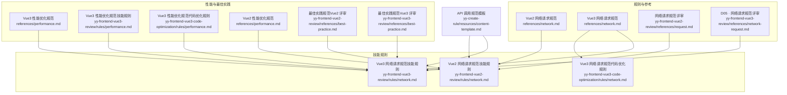
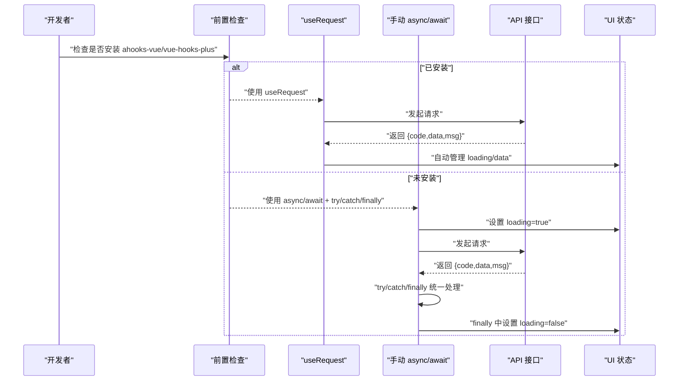
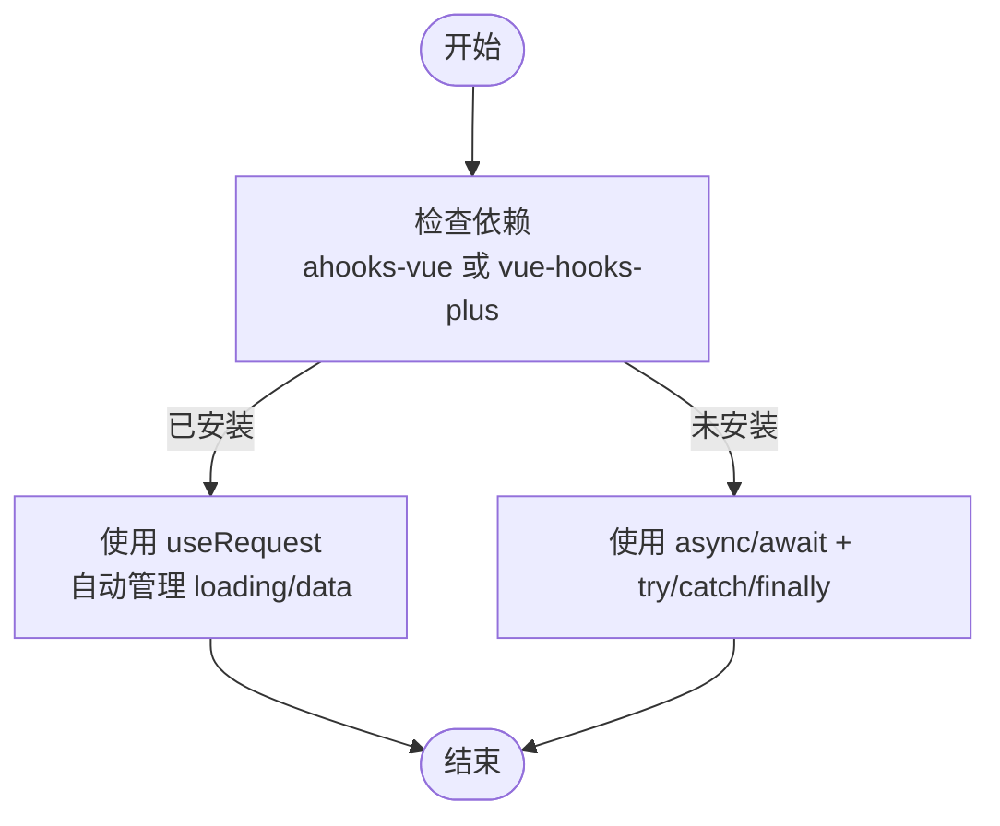
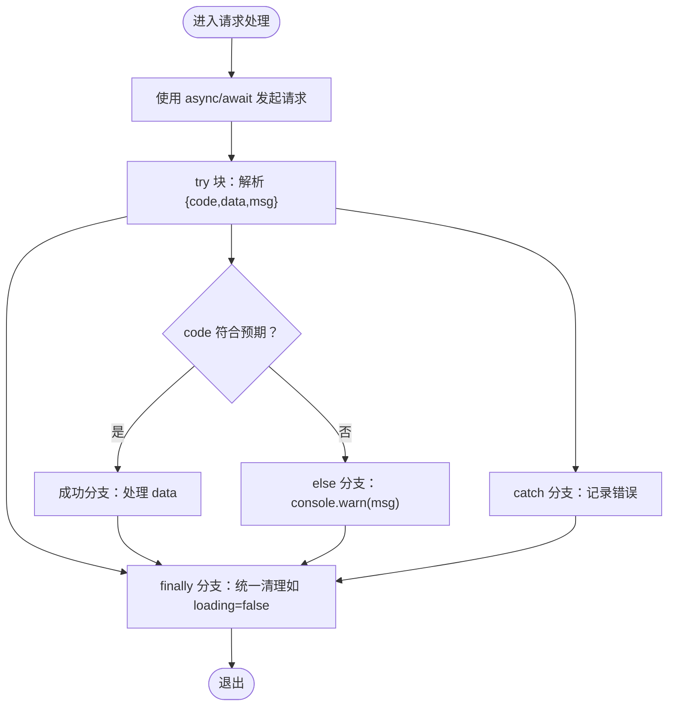
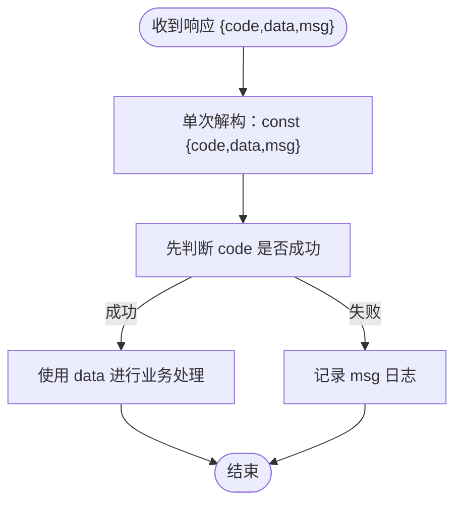
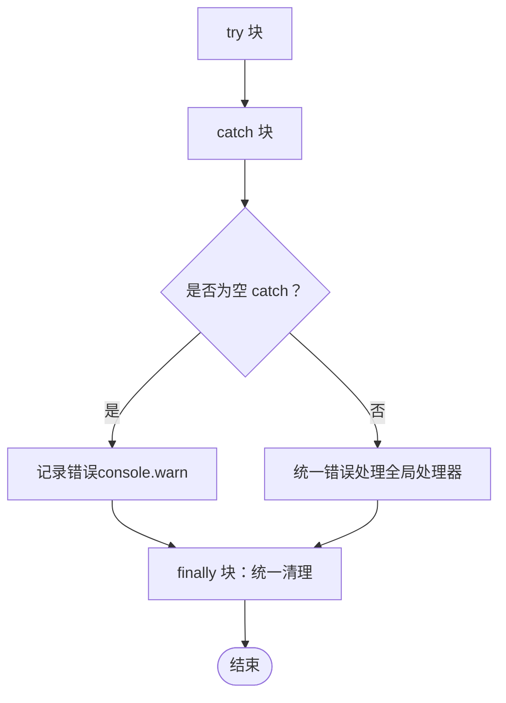
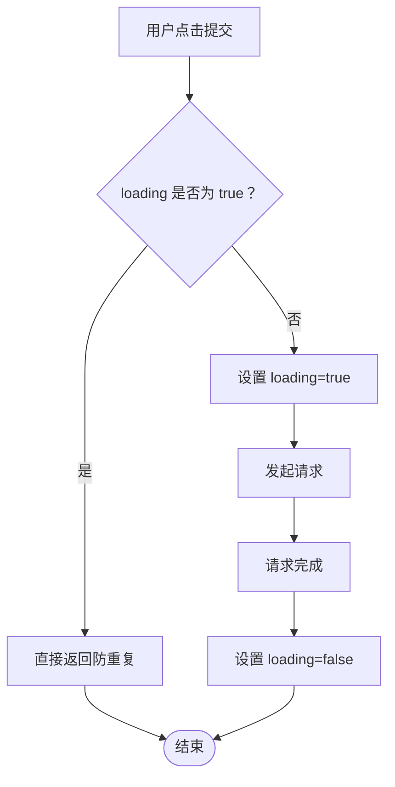

# D05 网络请求规范

<cite>
**本文引用的文件**
- [Vue3 网络请求规范（参考）](file://rules/frontend-rules-vue3/references/network.md)
- [D05 · 网络请求规范（参考）](file://skills/yy-frontend-vue3-review/references/network-request.md)
- [Vue3 网络请求规范（技能规则）](file://skills/yy-frontend-vue3-review/rules/network.md)
- [Vue3 网络请求规范（代码优化规则）](file://skills/yy-frontend-vue3-code-optimization/rules/network.md)
- [Vue2 网络请求规范（参考）](file://rules/frontend-rules-vue2/references/network.md)
- [网络请求规范（评审参考）](file://skills/yy-frontend-vue2-review/references/request.md)
- [Vue3 性能优化规范](file://rules/frontend-rules-vue3/references/performance.md)
- [Vue3 性能优化规范（技能规则）](file://skills/yy-frontend-vue3-review/rules/performance.md)
- [Vue3 性能优化规范（代码优化规则）](file://skills/yy-frontend-vue3-code-optimization/rules/performance.md)
- [Vue2 性能优化规范（参考）](file://rules/frontend-rules-vue2/references/performance.md)
- [Vue2 性能优化规范（技能规则）](file://skills/yy-frontend-vue2-review/rules/performance.md)
- [Vue2 性能优化规范（代码优化规则）](file://skills/yy-frontend-vue2-code-optimization/rules/performance.md)
- [最佳实践规范（Vue2 评审）](file://skills/yy-frontend-vue2-review/references/best-practice.md)
- [最佳实践规范（Vue3 评审）](file://skills/yy-frontend-vue3-review/references/best-practice.md)
- [API 调用规范模板（规则资源）](file://skills/yy-create-rule/resources/content-template.md)
</cite>

## 目录
1. [简介](#简介)
2. [项目结构](#项目结构)
3. [核心组件](#核心组件)
4. [架构总览](#架构总览)
5. [详细组件分析](#详细组件分析)
6. [依赖关系分析](#依赖关系分析)
7. [性能考量](#性能考量)
8. [故障排查指南](#故障排查指南)
9. [结论](#结论)
10. [附录](#附录)

## 简介
本规范面向前端网络请求的统一治理，围绕“前置检查 useRequest、async/await + try/catch/finally 异步处理模式、禁止多层 try/catch、禁止连续解构、统一响应模式”等关键规则，结合错误处理、数据缓存与请求优化的最佳实践，帮助团队在 Vue2/Vue3 项目中建立一致、可维护且用户体验友好的网络层。

## 项目结构
本仓库中与 D05 网络请求相关的内容主要分布在以下位置：
- 规则参考与评审：rules/frontend-rules-vue2、rules/frontend-rules-vue3、skills/yy-frontend-vue2-review、skills/yy-frontend-vue3-review
- 技能规则与代码优化：skills/yy-frontend-vue2-code-optimization、skills/yy-frontend-vue3-code-optimization
- 性能优化与交互规范：performance.md 与 interaction.md
- API 调用与错误处理模板：content-template.md

**图表来源**
- [Vue3 网络请求规范（参考）:1-303](file://rules/frontend-rules-vue3/references/network.md#L1-L303)
- [Vue3 网络请求规范（技能规则）:1-303](file://skills/yy-frontend-vue3-review/rules/network.md#L1-L303)
- [Vue3 网络请求规范（代码优化规则）:1-303](file://skills/yy-frontend-vue3-code-optimization/rules/network.md#L1-L303)
- [Vue2 网络请求规范（参考）:1-180](file://rules/frontend-rules-vue2/references/network.md#L1-L180)
- [网络请求规范（评审参考）:1-44](file://skills/yy-frontend-vue2-review/references/request.md#L1-L44)
- [D05 · 网络请求规范（参考）:1-39](file://skills/yy-frontend-vue3-review/references/network-request.md#L1-L39)
- [Vue3 性能优化规范:1-136](file://rules/frontend-rules-vue3/references/performance.md#L1-L136)
- [Vue3 性能优化规范（技能规则）:1-72](file://skills/yy-frontend-vue3-review/rules/performance.md#L1-L72)
- [Vue3 性能优化规范（代码优化规则）:1-72](file://skills/yy-frontend-vue3-code-optimization/rules/performance.md#L1-L72)
- [Vue2 性能优化规范（参考）:1-56](file://rules/frontend-rules-vue2/references/performance.md#L1-L56)
- [最佳实践规范（Vue2 评审）:1-107](file://skills/yy-frontend-vue2-review/references/best-practice.md#L1-L107)
- [最佳实践规范（Vue3 评审）:1-123](file://skills/yy-frontend-vue3-review/references/best-practice.md#L1-L123)
- [API 调用规范模板（规则资源）:92-122](file://skills/yy-create-rule/resources/content-template.md#L92-L122)

**章节来源**
- [Vue3 网络请求规范（参考）:1-303](file://rules/frontend-rules-vue3/references/network.md#L1-L303)
- [Vue3 网络请求规范（技能规则）:1-303](file://skills/yy-frontend-vue3-review/rules/network.md#L1-L303)
- [Vue3 网络请求规范（代码优化规则）:1-303](file://skills/yy-frontend-vue3-code-optimization/rules/network.md#L1-L303)
- [Vue2 网络请求规范（参考）:1-180](file://rules/frontend-rules-vue2/references/network.md#L1-L180)
- [网络请求规范（评审参考）:1-44](file://skills/yy-frontend-vue2-review/references/request.md#L1-L44)
- [D05 · 网络请求规范（参考）:1-39](file://skills/yy-frontend-vue3-review/references/network-request.md#L1-L39)
- [Vue3 性能优化规范:1-136](file://rules/frontend-rules-vue3/references/performance.md#L1-L136)
- [Vue3 性能优化规范（技能规则）:1-72](file://skills/yy-frontend-vue3-review/rules/performance.md#L1-L72)
- [Vue3 性能优化规范（代码优化规则）:1-72](file://skills/yy-frontend-vue3-code-optimization/rules/performance.md#L1-L72)
- [Vue2 性能优化规范（参考）:1-56](file://rules/frontend-rules-vue2/references/performance.md#L1-L56)
- [最佳实践规范（Vue2 评审）:1-107](file://skills/yy-frontend-vue2-review/references/best-practice.md#L1-L107)
- [最佳实践规范（Vue3 评审）:1-123](file://skills/yy-frontend-vue3-review/references/best-practice.md#L1-L123)
- [API 调用规范模板（规则资源）:92-122](file://skills/yy-create-rule/resources/content-template.md#L92-L122)

## 核心组件
- 前置检查 useRequest：在编写网络请求前，检查项目是否安装 ahooks-vue 或 vue-hooks-plus。已安装则使用 useRequest（自动管理 loading/data）；未安装则使用手动 async/await + try/catch/finally。
- 异步处理：必须使用 async/await，禁止 .then 链式调用；统一使用 try/catch/finally 结构（未使用 useRequest 时）。
- 响应处理：单次解构，禁止 data.data 连续解构；统一响应模式 { code, data, msg } 解构处理。
- 错误处理：禁止空 catch；业务错误在 else 分支中 console.warn 记录；统一错误处理需使用全局错误处理器。
- 防重复提交：useRequest 的 loading 自动控制，按钮直接用 :disabled="loading" 禁用；未安装 useRequest 时采用互斥锁方式。
- 性能优化：防抖/节流、组件懒加载、KeepAlive 缓存、虚拟滚动、图片优化、模板层轻量化、响应式性能、自定义指令清理、路由守卫清理。

**章节来源**
- [Vue3 网络请求规范（参考）:5-303](file://rules/frontend-rules-vue3/references/network.md#L5-L303)
- [Vue3 网络请求规范（技能规则）:5-303](file://skills/yy-frontend-vue3-review/rules/network.md#L5-L303)
- [Vue3 网络请求规范（代码优化规则）:5-303](file://skills/yy-frontend-vue3-code-optimization/rules/network.md#L5-L303)
- [Vue2 网络请求规范（参考）:7-180](file://rules/frontend-rules-vue2/references/network.md#L7-L180)
- [D05 · 网络请求规范（参考）:7-39](file://skills/yy-frontend-vue3-review/references/network-request.md#L7-L39)
- [网络请求规范（评审参考）:9-44](file://skills/yy-frontend-vue2-review/references/request.md#L9-L44)
- [Vue3 性能优化规范:7-136](file://rules/frontend-rules-vue3/references/performance.md#L7-L136)
- [Vue3 性能优化规范（技能规则）:7-72](file://skills/yy-frontend-vue3-review/rules/performance.md#L7-L72)
- [Vue3 性能优化规范（代码优化规则）:7-72](file://skills/yy-frontend-vue3-code-optimization/rules/performance.md#L7-L72)
- [Vue2 性能优化规范（参考）:1-56](file://rules/frontend-rules-vue2/references/performance.md#L1-L56)

## 架构总览
下图展示了从“前置检查 useRequest”到“异步处理与响应解构”的端到端流程，以及与“错误处理、防重复提交、性能优化”的协同关系。

**图表来源**
- [Vue3 网络请求规范（参考）:5-17](file://rules/frontend-rules-vue3/references/network.md#L5-L17)
- [Vue3 网络请求规范（技能规则）:5-17](file://skills/yy-frontend-vue3-review/rules/network.md#L5-L17)
- [Vue3 网络请求规范（代码优化规则）:5-17](file://skills/yy-frontend-vue3-code-optimization/rules/network.md#L5-L17)
- [Vue2 网络请求规范（参考）:7-12](file://rules/frontend-rules-vue2/references/network.md#L7-L12)
- [D05 · 网络请求规范（参考）:7-13](file://skills/yy-frontend-vue3-review/references/network-request.md#L7-L13)

## 详细组件分析

### 组件 A：前置检查 useRequest
- 目标：在请求前判断是否具备 useRequest 能力，决定后续请求写法。
- 规则要点：
  - 检查项目 package.json 的 dependencies 是否包含 ahooks-vue 或 vue-hooks-plus。
  - 已安装：使用 useRequest（自动管理 loading/data）。
  - 未安装：使用手动 async/await + try/catch/finally。
- 示例路径：
  - [前置检查与分支选择（Vue3 参考）:5-17](file://rules/frontend-rules-vue3/references/network.md#L5-L17)
  - [前置检查与分支选择（Vue3 技能规则）:5-17](file://skills/yy-frontend-vue3-review/rules/network.md#L5-L17)
  - [前置检查与分支选择（Vue3 代码优化规则）:5-17](file://skills/yy-frontend-vue3-code-optimization/rules/network.md#L5-L17)
  - [前置检查与分支选择（Vue2 参考）:7-12](file://rules/frontend-rules-vue2/references/network.md#L7-L12)
  - [前置检查与分支选择（D05 参考）:7-13](file://skills/yy-frontend-vue3-review/references/network-request.md#L7-L13)

**图表来源**
- [Vue3 网络请求规范（参考）:5-17](file://rules/frontend-rules-vue3/references/network.md#L5-L17)
- [Vue3 网络请求规范（技能规则）:5-17](file://skills/yy-frontend-vue3-review/rules/network.md#L5-L17)
- [Vue3 网络请求规范（代码优化规则）:5-17](file://skills/yy-frontend-vue3-code-optimization/rules/network.md#L5-L17)
- [Vue2 网络请求规范（参考）:7-12](file://rules/frontend-rules-vue2/references/network.md#L7-L12)
- [D05 · 网络请求规范（参考）:7-13](file://skills/yy-frontend-vue3-review/references/network-request.md#L7-L13)

**章节来源**
- [Vue3 网络请求规范（参考）:5-17](file://rules/frontend-rules-vue3/references/network.md#L5-L17)
- [Vue3 网络请求规范（技能规则）:5-17](file://skills/yy-frontend-vue3-review/rules/network.md#L5-L17)
- [Vue3 网络请求规范（代码优化规则）:5-17](file://skills/yy-frontend-vue3-code-optimization/rules/network.md#L5-L17)
- [Vue2 网络请求规范（参考）:7-12](file://rules/frontend-rules-vue2/references/network.md#L7-L12)
- [D05 · 网络请求规范（参考）:7-13](file://skills/yy-frontend-vue3-review/references/network-request.md#L7-L13)

### 组件 B：异步处理与统一响应模式
- 目标：统一异步处理风格，确保错误与状态管理一致性。
- 规则要点：
  - 必须使用 async/await，禁止 .then 链式调用。
  - 统一使用 try/catch/finally 结构（未使用 useRequest 时）。
  - 统一响应模式 { code, data, msg } 解构处理。
  - 禁止多层 try/catch 嵌套，异步操作需扁平化。
- 示例路径：
  - [异步处理与目标结构（Vue3 参考）:19-67](file://rules/frontend-rules-vue3/references/network.md#L19-L67)
  - [异步处理与目标结构（Vue3 技能规则）:19-67](file://skills/yy-frontend-vue3-review/rules/network.md#L19-L67)
  - [异步处理与目标结构（Vue3 代码优化规则）:19-67](file://skills/yy-frontend-vue3-code-optimization/rules/network.md#L19-L67)
  - [异步处理与目标结构（Vue2 参考）:7-44](file://rules/frontend-rules-vue2/references/network.md#L7-L44)
  - [统一响应处理模式（D05 参考）:29-38](file://skills/yy-frontend-vue3-review/references/network-request.md#L29-L38)
  - [统一响应处理模式（评审参考）:37-44](file://skills/yy-frontend-vue2-review/references/request.md#L37-L44)

**图表来源**
- [Vue3 网络请求规范（参考）:19-67](file://rules/frontend-rules-vue3/references/network.md#L19-L67)
- [Vue3 网络请求规范（技能规则）:19-67](file://skills/yy-frontend-vue3-review/rules/network.md#L19-L67)
- [Vue3 网络请求规范（代码优化规则）:19-67](file://skills/yy-frontend-vue3-code-optimization/rules/network.md#L19-L67)
- [Vue2 网络请求规范（参考）:7-44](file://rules/frontend-rules-vue2/references/network.md#L7-L44)
- [D05 · 网络请求规范（参考）:29-38](file://skills/yy-frontend-vue3-review/references/network-request.md#L29-L38)
- [网络请求规范（评审参考）:37-44](file://skills/yy-frontend-vue2-review/references/request.md#L37-L44)

**章节来源**
- [Vue3 网络请求规范（参考）:19-67](file://rules/frontend-rules-vue3/references/network.md#L19-L67)
- [Vue3 网络请求规范（技能规则）:19-67](file://skills/yy-frontend-vue3-review/rules/network.md#L19-L67)
- [Vue3 网络请求规范（代码优化规则）:19-67](file://skills/yy-frontend-vue3-code-optimization/rules/network.md#L19-L67)
- [Vue2 网络请求规范（参考）:7-44](file://rules/frontend-rules-vue2/references/network.md#L7-L44)
- [D05 · 网络请求规范（参考）:29-38](file://skills/yy-frontend-vue3-review/references/network-request.md#L29-L38)
- [网络请求规范（评审参考）:37-44](file://skills/yy-frontend-vue2-review/references/request.md#L37-L44)

### 组件 C：响应解构与连续解构禁止
- 目标：保证响应解构的一致性与可读性。
- 规则要点：
  - 单次解构，禁止 ...data.data 连续解构。
  - 统一响应模式 { code, data, msg } 解构处理。
  - 先判断成功再使用数据，避免假设 res.data 一定存在。
- 示例路径：
  - [响应处理与解构示例（Vue3 参考）:70-116](file://rules/frontend-rules-vue3/references/network.md#L70-L116)
  - [响应处理与解构示例（Vue3 技能规则）:70-116](file://skills/yy-frontend-vue3-review/rules/network.md#L70-L116)
  - [响应处理与解构示例（Vue3 代码优化规则）:70-116](file://skills/yy-frontend-vue3-code-optimization/rules/network.md#L70-L116)
  - [响应处理与解构示例（Vue2 参考）:77-116](file://rules/frontend-rules-vue2/references/network.md#L77-L116)

**图表来源**
- [Vue3 网络请求规范（参考）:70-116](file://rules/frontend-rules-vue3/references/network.md#L70-L116)
- [Vue3 网络请求规范（技能规则）:70-116](file://skills/yy-frontend-vue3-review/rules/network.md#L70-L116)
- [Vue3 网络请求规范（代码优化规则）:70-116](file://skills/yy-frontend-vue3-code-optimization/rules/network.md#L70-L116)
- [Vue2 网络请求规范（参考）:77-116](file://rules/frontend-rules-vue2/references/network.md#L77-L116)

**章节来源**
- [Vue3 网络请求规范（参考）:70-116](file://rules/frontend-rules-vue3/references/network.md#L70-L116)
- [Vue3 网络请求规范（技能规则）:70-116](file://skills/yy-frontend-vue3-review/rules/network.md#L70-L116)
- [Vue3 网络请求规范（代码优化规则）:70-116](file://skills/yy-frontend-vue3-code-optimization/rules/network.md#L70-L116)
- [Vue2 网络请求规范（参考）:77-116](file://rules/frontend-rules-vue2/references/network.md#L77-L116)

### 组件 D：错误处理与统一错误处理
- 目标：确保错误被捕获与记录，避免静默失败。
- 规则要点：
  - 禁止空 catch；捕获错误后必须进行记录。
  - 业务错误处理：else 分支中 console.warn 记录。
  - 统一错误处理需使用全局错误处理器，不能在本地 catch 后静默忽略。
- 示例路径：
  - [错误处理与空 catch 禁止（Vue3 参考）:113-147](file://rules/frontend-rules-vue3/references/network.md#L113-L147)
  - [错误处理与空 catch 禁止（Vue3 技能规则）:113-147](file://skills/yy-frontend-vue3-review/rules/network.md#L113-L147)
  - [错误处理与空 catch 禁止（Vue3 代码优化规则）:113-147](file://skills/yy-frontend-vue3-code-optimization/rules/network.md#L113-L147)
  - [错误处理与空 catch 禁止（Vue2 参考）:120-153](file://rules/frontend-rules-vue2/references/network.md#L120-L153)
  - [统一错误处理模板（规则资源）:92-122](file://skills/yy-create-rule/resources/content-template.md#L92-L122)

**图表来源**
- [Vue3 网络请求规范（参考）:113-147](file://rules/frontend-rules-vue3/references/network.md#L113-L147)
- [Vue3 网络请求规范（技能规则）:113-147](file://skills/yy-frontend-vue3-review/rules/network.md#L113-L147)
- [Vue3 网络请求规范（代码优化规则）:113-147](file://skills/yy-frontend-vue3-code-optimization/rules/network.md#L113-L147)
- [Vue2 网络请求规范（参考）:120-153](file://rules/frontend-rules-vue2/references/network.md#L120-L153)
- [API 调用规范模板（规则资源）:92-122](file://skills/yy-create-rule/resources/content-template.md#L92-L122)

**章节来源**
- [Vue3 网络请求规范（参考）:113-147](file://rules/frontend-rules-vue3/references/network.md#L113-L147)
- [Vue3 网络请求规范（技能规则）:113-147](file://skills/yy-frontend-vue3-review/rules/network.md#L113-L147)
- [Vue3 网络请求规范（代码优化规则）:113-147](file://skills/yy-frontend-vue3-code-optimization/rules/network.md#L113-L147)
- [Vue2 网络请求规范（参考）:120-153](file://rules/frontend-rules-vue2/references/network.md#L120-L153)
- [API 调用规范模板（规则资源）:92-122](file://skills/yy-create-rule/resources/content-template.md#L92-L122)

### 组件 E：防重复提交与互斥锁
- 目标：防止用户在请求进行中重复提交，提升稳定性与一致性。
- 规则要点：
  - useRequest：loading 自动控制，按钮直接 :disabled="loading"。
  - 未安装 useRequest：采用互斥锁（loading.value）防止重复提交。
- 示例路径：
  - [防重复提交（Vue3 参考）:249-303](file://rules/frontend-rules-vue3/references/network.md#L249-L303)
  - [防重复提交（Vue3 技能规则）:249-303](file://skills/yy-frontend-vue3-review/rules/network.md#L249-L303)
  - [防重复提交（Vue3 代码优化规则）:249-303](file://skills/yy-frontend-vue3-code-optimization/rules/network.md#L249-L303)
  - [防重复提交（Vue2 参考）:164-172](file://rules/frontend-rules-vue2/references/network.md#L164-L172)

**图表来源**
- [Vue3 网络请求规范（参考）:249-303](file://rules/frontend-rules-vue3/references/network.md#L249-L303)
- [Vue3 网络请求规范（技能规则）:249-303](file://skills/yy-frontend-vue3-review/rules/network.md#L249-L303)
- [Vue3 网络请求规范（代码优化规则）:249-303](file://skills/yy-frontend-vue3-code-optimization/rules/network.md#L249-L303)
- [Vue2 网络请求规范（参考）:164-172](file://rules/frontend-rules-vue2/references/network.md#L164-L172)

**章节来源**
- [Vue3 网络请求规范（参考）:249-303](file://rules/frontend-rules-vue3/references/network.md#L249-L303)
- [Vue3 网络请求规范（技能规则）:249-303](file://skills/yy-frontend-vue3-review/rules/network.md#L249-L303)
- [Vue3 网络请求规范（代码优化规则）:249-303](file://skills/yy-frontend-vue3-code-optimization/rules/network.md#L249-L303)
- [Vue2 网络请求规范（参考）:164-172](file://rules/frontend-rules-vue2/references/network.md#L164-L172)

## 依赖关系分析
- 规则来源一致性：Vue3 与 Vue2 的网络请求规范在“前置检查 useRequest、异步处理、响应解构、错误处理、防重复提交”等方面保持高度一致，便于跨版本统一治理。
- 技能规则与参考文件协同：技能规则（yy-frontend-vueX-review/rules/network.md）与参考文件（frontend-rules-vueX/references/network.md）互补，前者强调落地实践，后者强调规范条目。
- 性能与网络协同：性能优化（防抖/节流、组件懒加载、KeepAlive、虚拟滚动、图片优化）与网络请求规范共同构成前端性能治理闭环。

**图表来源**
- [Vue3 网络请求规范（参考）:1-303](file://rules/frontend-rules-vue3/references/network.md#L1-L303)
- [Vue3 网络请求规范（技能规则）:1-303](file://skills/yy-frontend-vue3-review/rules/network.md#L1-L303)
- [Vue2 网络请求规范（参考）:1-180](file://rules/frontend-rules-vue2/references/network.md#L1-L180)
- [Vue2 网络请求规范（技能规则）:1-180](file://skills/yy-frontend-vue2-review/rules/network.md#L1-L180)
- [Vue3 性能优化规范:1-136](file://rules/frontend-rules-vue3/references/performance.md#L1-L136)
- [Vue2 性能优化规范（参考）:1-56](file://rules/frontend-rules-vue2/references/performance.md#L1-L56)
- [最佳实践规范（Vue2 评审）:1-107](file://skills/yy-frontend-vue2-review/references/best-practice.md#L1-L107)
- [最佳实践规范（Vue3 评审）:1-123](file://skills/yy-frontend-vue3-review/references/best-practice.md#L1-L123)

**章节来源**
- [Vue3 网络请求规范（参考）:1-303](file://rules/frontend-rules-vue3/references/network.md#L1-L303)
- [Vue3 网络请求规范（技能规则）:1-303](file://skills/yy-frontend-vue3-review/rules/network.md#L1-L303)
- [Vue2 网络请求规范（参考）:1-180](file://rules/frontend-rules-vue2/references/network.md#L1-L180)
- [Vue2 网络请求规范（技能规则）:1-180](file://skills/yy-frontend-vue2-review/rules/network.md#L1-L180)
- [Vue3 性能优化规范:1-136](file://rules/frontend-rules-vue3/references/performance.md#L1-L136)
- [Vue2 性能优化规范（参考）:1-56](file://rules/frontend-rules-vue2/references/performance.md#L1-L56)
- [最佳实践规范（Vue2 评审）:1-107](file://skills/yy-frontend-vue2-review/references/best-practice.md#L1-L107)
- [最佳实践规范（Vue3 评审）:1-123](file://skills/yy-frontend-vue3-review/references/best-practice.md#L1-L123)

## 性能考量
- 防抖/节流：搜索输入（防抖 300ms）、滚动（节流 100ms）、窗口 resize（节流）、按钮点击（防抖/锁）。
- 组件懒加载：使用 defineAsyncComponent 或 () => import() 实现惰性加载。
- KeepAlive 缓存：通过 include/exclude 精确控制缓存范围，避免内存泄漏。
- 虚拟滚动：长列表（100+ 项）使用虚拟滚动组件，仅渲染可视区域。
- 图片优化：WebP 优先、合适尺寸、非首屏图片延迟加载。
- 模板层轻量化：模板只负责展示，避免复杂表达式与逻辑。
- 响应式性能：优先使用 computed 派生状态，大型数据列表考虑 shallowRef。
- 自定义指令清理：unmounted 钩子中清理事件监听器和定时器。
- 路由守卫清理：beforeRouteLeave 中清理定时器、取消未完成请求、关闭弹窗。

**章节来源**
- [Vue3 性能优化规范:53-136](file://rules/frontend-rules-vue3/references/performance.md#L53-L136)
- [Vue3 性能优化规范（技能规则）:53-72](file://skills/yy-frontend-vue3-review/rules/performance.md#L53-L72)
- [Vue3 性能优化规范（代码优化规则）:53-72](file://skills/yy-frontend-vue3-code-optimization/rules/performance.md#L53-L72)
- [Vue2 性能优化规范（参考）:1-56](file://rules/frontend-rules-vue2/references/performance.md#L1-L56)
- [Vue2 性能优化规范（技能规则）:1-56](file://skills/yy-frontend-vue2-review/rules/performance.md#L1-L56)
- [Vue2 性能优化规范（代码优化规则）:1-56](file://skills/yy-frontend-vue2-code-optimization/rules/performance.md#L1-L56)

## 故障排查指南
- 常见问题
  - 空 catch 导致错误被静默忽略：确保 catch 中记录错误或交由全局错误处理器处理。
  - 连续解构导致运行时错误：统一使用单次解构 { code, data, msg }。
  - 多层 try/catch 嵌套导致逻辑复杂：将异步操作扁平化，避免嵌套。
  - 未安装 useRequest 时未禁用重复提交：使用 loading 互斥锁或按钮禁用。
- 建议
  - 在 finally 中统一清理状态（如 loading=false）。
  - 对于表单提交、支付等写操作，务必在请求进行中禁用按钮。
  - 使用统一的错误处理模板，避免本地 catch 后静默忽略。

**章节来源**
- [Vue3 网络请求规范（参考）:113-147](file://rules/frontend-rules-vue3/references/network.md#L113-L147)
- [Vue3 网络请求规范（技能规则）:113-147](file://skills/yy-frontend-vue3-review/rules/network.md#L113-L147)
- [Vue3 网络请求规范（代码优化规则）:113-147](file://skills/yy-frontend-vue3-code-optimization/rules/network.md#L113-L147)
- [Vue2 网络请求规范（参考）:120-153](file://rules/frontend-rules-vue2/references/network.md#L120-L153)
- [D05 · 网络请求规范（参考）:22-26](file://skills/yy-frontend-vue3-review/references/network-request.md#L22-L26)
- [API 调用规范模板（规则资源）:92-122](file://skills/yy-create-rule/resources/content-template.md#L92-L122)

## 结论
通过统一前置检查 useRequest、异步处理模式、响应解构与错误处理策略，并结合防重复提交与性能优化手段，团队可在 Vue2/Vue3 项目中构建一致、可靠且高性能的网络层。建议在评审与日常开发中严格遵循本规范，以降低技术债、提升可维护性与用户体验。

## 附录
- 相关文件索引
  - [Vue3 网络请求规范（参考）](file://rules/frontend-rules-vue3/references/network.md)
  - [Vue3 网络请求规范（技能规则）](file://skills/yy-frontend-vue3-review/rules/network.md)
  - [Vue3 网络请求规范（代码优化规则）](file://skills/yy-frontend-vue3-code-optimization/rules/network.md)
  - [Vue2 网络请求规范（参考）](file://rules/frontend-rules-vue2/references/network.md)
  - [网络请求规范（评审参考）](file://skills/yy-frontend-vue2-review/references/request.md)
  - [D05 · 网络请求规范（评审）](file://skills/yy-frontend-vue3-review/references/network-request.md)
  - [Vue3 性能优化规范](file://rules/frontend-rules-vue3/references/performance.md)
  - [Vue3 性能优化规范（技能规则）](file://skills/yy-frontend-vue3-review/rules/performance.md)
  - [Vue3 性能优化规范（代码优化规则）](file://skills/yy-frontend-vue3-code-optimization/rules/performance.md)
  - [Vue2 性能优化规范（参考）](file://rules/frontend-rules-vue2/references/performance.md)
  - [最佳实践规范（Vue2 评审）](file://skills/yy-frontend-vue2-review/references/best-practice.md)
  - [最佳实践规范（Vue3 评审）](file://skills/yy-frontend-vue3-review/references/best-practice.md)
  - [API 调用规范模板（规则资源）](file://skills/yy-create-rule/resources/content-template.md)