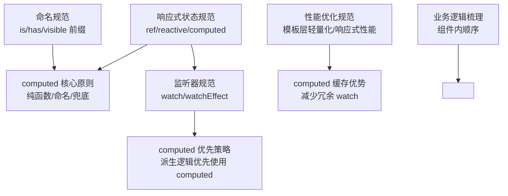
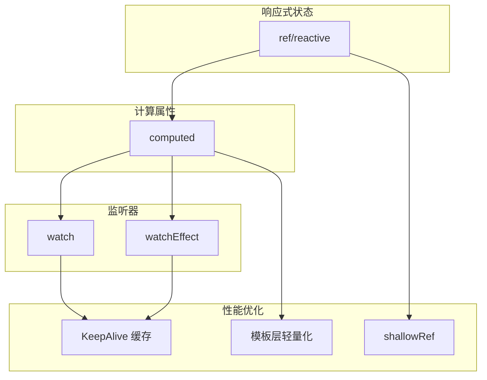
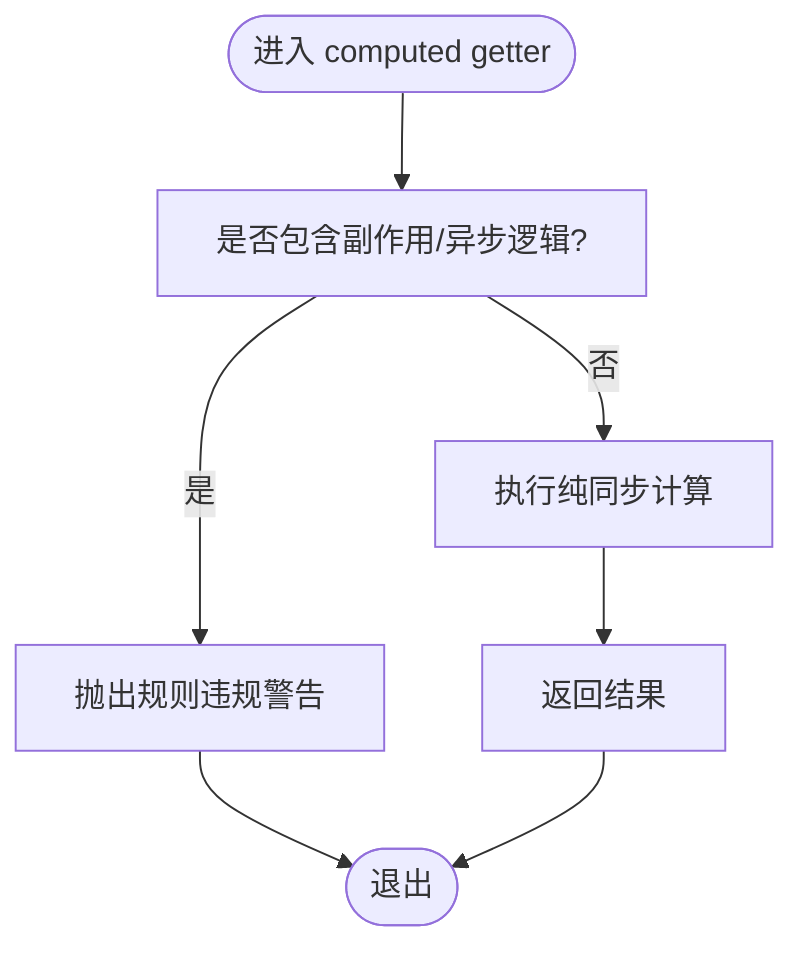
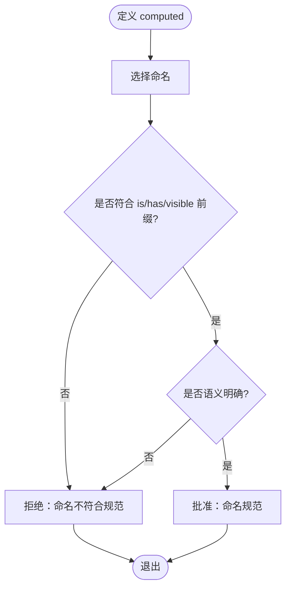
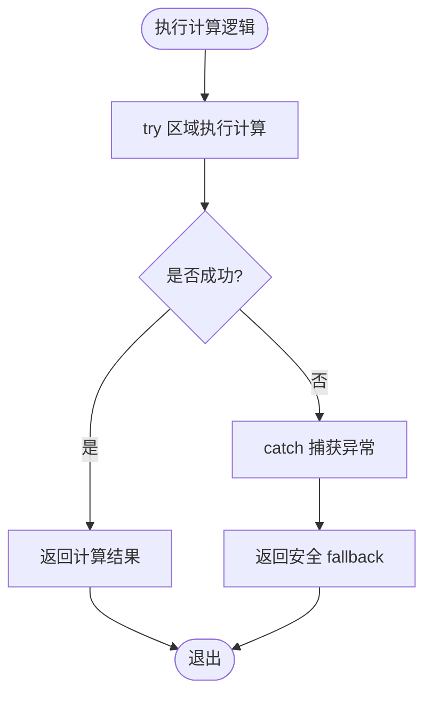
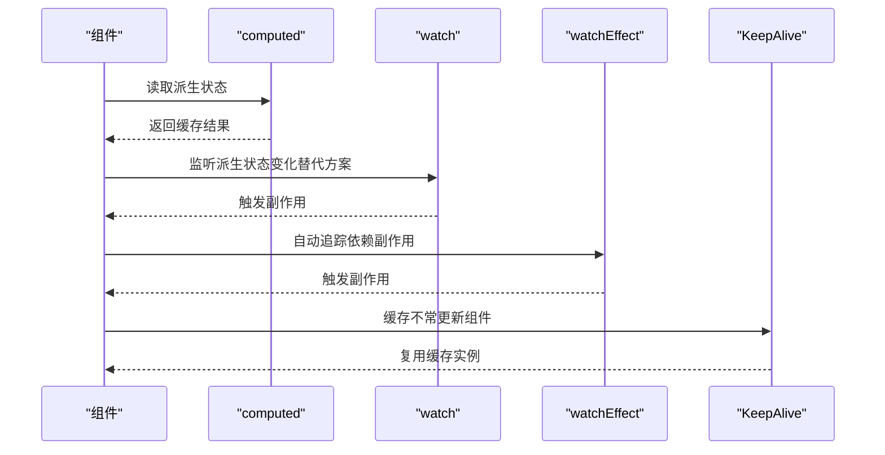
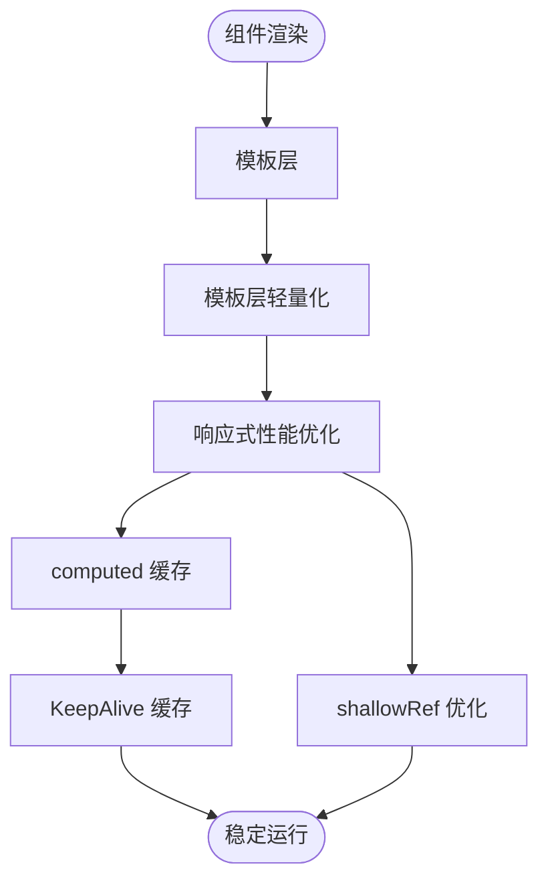
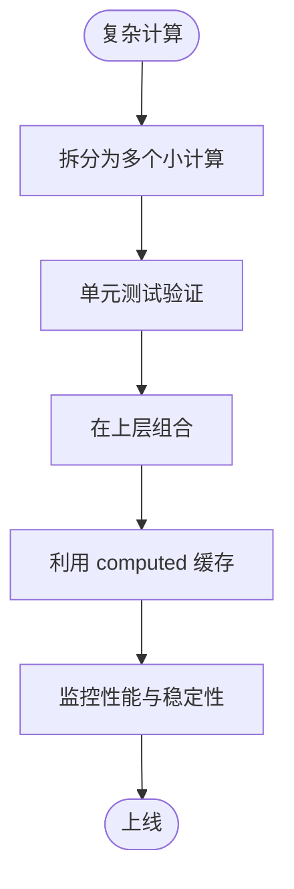
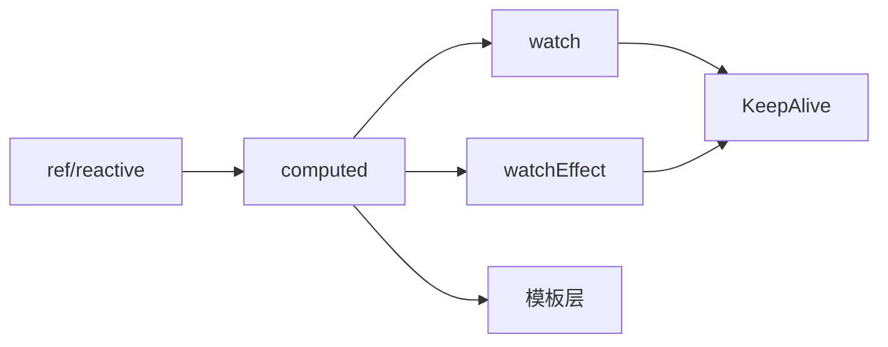

# D06 Computed 规范

<cite>
**本文引用的文件**
- [computed.md](file://skills/yy-frontend-vue3-review/references/computed.md)
- [reactivity.md](file://skills/yy-frontend-vue3-code-optimization/rules/reactivity.md)
- [reactivity.md](file://rules/frontend-rules-vue3/references/reactivity.md)
- [watch.md](file://rules/frontend-rules-vue3/references/watch.md)
- [performance.md](file://rules/frontend-rules-vue3/references/performance.md)
- [business-logic.md](file://skills/yy-frontend-vue3-code-optimization/sub-skills/business-logic.md)
- [naming.md](file://skills/yy-frontend-vue3-review/references/naming.md)
- [RULE.md](file://rules/frontend-rules-vue3/RULE.md)
</cite>

## 目录
1. [简介](#简介)
2. [项目结构](#项目结构)
3. [核心组件](#核心组件)
4. [架构概览](#架构概览)
5. [详细组件分析](#详细组件分析)
6. [依赖分析](#依赖分析)
7. [性能考量](#性能考量)
8. [故障排查指南](#故障排查指南)
9. [结论](#结论)
10. [附录](#附录)

## 简介
本文件系统化阐述 D06 Computed 规范，围绕“纯函数原则”“有意义命名”“复杂逻辑兜底”三大主题，结合 Vue3 响应式体系，给出计算属性的使用边界、与其他响应式 API 的配合策略、性能优化与内存管理建议，并总结复杂逻辑分解与缓存策略的最佳实践。目标是帮助团队在保证正确性的同时，提升代码可维护性与运行效率。

## 项目结构
本规范相关知识主要分布在以下模块：
- 响应式状态规范：ref/reactive/computed 的选择与转换、computed 的核心原则与风险
- 监听器规范：watch/watchEffect 的使用边界与与 computed 的选择策略
- 性能优化规范：模板层轻量化、响应式性能、KeepAlive 缓存、防抖节流等
- 命名规范：布尔值命名前缀（is/has/visible）与通用命名约定
- 业务逻辑梳理：在组件中如何组织 ref/reactive/computed/watch 的顺序与职责划分

图表来源
- [reactivity.md:132-206](file://skills/yy-frontend-vue3-code-optimization/rules/reactivity.md#L132-L206)
- [watch.md:86-90](file://rules/frontend-rules-vue3/references/watch.md#L86-L90)
- [performance.md:107-112](file://rules/frontend-rules-vue3/references/performance.md#L107-L112)
- [naming.md:19-21](file://skills/yy-frontend-vue3-review/references/naming.md#L19-L21)
- [business-logic.md:220-226](file://skills/yy-frontend-vue3-code-optimization/sub-skills/business-logic.md#L220-L226)

章节来源
- [RULE.md:30-46](file://rules/frontend-rules-vue3/RULE.md#L30-L46)

## 核心组件
- 纯函数原则
  - computed 必须是纯同步 getter，不应包含副作用（如修改响应式数据、发起网络请求、DOM 操作）。
  - computed 不应处理异步逻辑（如 async/await）。
- 有意义命名
  - 布尔值命名优先使用 is/has/visible 前缀，或语义明确的名词短语，避免无意义命名。
- 复杂逻辑兜底
  - 对可能抛出异常的计算逻辑，建议包裹 try/catch 并返回安全 fallback，确保 UI 稳定性。
- 与其他响应式 API 的配合
  - 优先使用 computed 替代 watch 中的派生逻辑，利用其缓存机制。
  - watch/watchEffect 用于副作用与复杂依赖追踪，computed 用于同步派生状态。
- 性能与内存管理
  - 模板层尽量不写复杂表达式，优先使用 computed。
  - 大型数据列表可考虑 shallowRef 减少深层响应式开销。
  - 合理使用 KeepAlive 缓存不常更新组件，避免内存泄漏。
- 复杂逻辑分解与缓存策略
  - 将复杂计算拆分为多个小的、可测试的 computed，必要时在上层组合。
  - 对昂贵计算使用缓存（computed 的自动缓存），避免重复计算。
  - 对易变且昂贵的数据，考虑使用 shallowRef 或手动缓存策略。

章节来源
- [computed.md:7-22](file://skills/yy-frontend-vue3-review/references/computed.md#L7-L22)
- [reactivity.md:134-185](file://skills/yy-frontend-vue3-code-optimization/rules/reactivity.md#L134-L185)
- [reactivity.md:134-185](file://rules/frontend-rules-vue3/references/reactivity.md#L134-L185)
- [watch.md:86-90](file://rules/frontend-rules-vue3/references/watch.md#L86-L90)
- [performance.md:99-112](file://rules/frontend-rules-vue3/references/performance.md#L99-L112)
- [naming.md:19-21](file://skills/yy-frontend-vue3-review/references/naming.md#L19-L21)
- [business-logic.md:220-226](file://skills/yy-frontend-vue3-code-optimization/sub-skills/business-logic.md#L220-L226)

## 架构概览
下图展示了在组件中，响应式状态、计算属性与监听器之间的协作关系，以及与性能优化策略的衔接。

图表来源
- [reactivity.md:132-206](file://skills/yy-frontend-vue3-code-optimization/rules/reactivity.md#L132-L206)
- [watch.md:86-101](file://rules/frontend-rules-vue3/references/watch.md#L86-L101)
- [performance.md:22-31](file://rules/frontend-rules-vue3/references/performance.md#L22-L31)
- [performance.md:99-112](file://rules/frontend-rules-vue3/references/performance.md#L99-L112)

## 详细组件分析

### 纯函数原则与副作用隔离
- 设计要点
  - computed 仅用于同步派生，不包含副作用；副作用统一交给 watch/watchEffect 或组件方法。
  - 异步逻辑与网络请求必须在组件方法或生命周期中执行，computed 仅消费已有的响应式数据。
- 风险与边界
  - 将副作用放入 computed 会导致不可预测的 UI 行为与调试困难。
  - 异步计算会破坏 computed 的纯函数特性，引发缓存失效与性能问题。

图表来源
- [reactivity.md:136-139](file://skills/yy-frontend-vue3-code-optimization/rules/reactivity.md#L136-L139)
- [reactivity.md:136-139](file://rules/frontend-rules-vue3/references/reactivity.md#L136-L139)

章节来源
- [computed.md:7-11](file://skills/yy-frontend-vue3-review/references/computed.md#L7-L11)
- [reactivity.md:134-139](file://skills/yy-frontend-vue3-code-optimization/rules/reactivity.md#L134-L139)
- [reactivity.md:134-139](file://rules/frontend-rules-vue3/references/reactivity.md#L134-L139)

### 有意义命名与布尔值前缀
- 命名建议
  - 布尔值优先使用 is/has/visible 前缀，例如 isXxx、hasXxx、visibleXxx。
  - 避免无意义命名（如 data1、temp2），确保语义清晰。
- 与 computed 的关系
  - computed 的命名应与其返回值类型一致，布尔值命名可直接反映语义，便于模板与逻辑使用。

图表来源
- [naming.md:19-21](file://skills/yy-frontend-vue3-review/references/naming.md#L19-L21)
- [naming.md:30-33](file://skills/yy-frontend-vue3-review/references/naming.md#L30-L33)

章节来源
- [naming.md:19-21](file://skills/yy-frontend-vue3-review/references/naming.md#L19-L21)
- [naming.md:30-33](file://skills/yy-frontend-vue3-review/references/naming.md#L30-L33)
- [computed.md:13-16](file://skills/yy-frontend-vue3-review/references/computed.md#L13-L16)

### 复杂逻辑兜底与异常处理
- 防御性 try/catch
  - 对可能因边界情况抛错的计算逻辑，建议包裹 try/catch 并返回安全 fallback，确保 UI 稳定。
- 典型场景
  - JSON 解析、数组长度比较、对象属性访问等易出现异常的路径。

图表来源
- [reactivity.md:141-154](file://skills/yy-frontend-vue3-code-optimization/rules/reactivity.md#L141-L154)
- [reactivity.md:141-154](file://rules/frontend-rules-vue3/references/reactivity.md#L141-L154)
- [computed.md:19-22](file://skills/yy-frontend-vue3-review/references/computed.md#L19-L22)

章节来源
- [reactivity.md:141-154](file://skills/yy-frontend-vue3-code-optimization/rules/reactivity.md#L141-L154)
- [reactivity.md:141-154](file://rules/frontend-rules-vue3/references/reactivity.md#L141-L154)
- [computed.md:19-22](file://skills/yy-frontend-vue3-review/references/computed.md#L19-L22)

### computed 与其他响应式 API 的配合
- 优先使用 computed 替代 watch 中的派生逻辑
  - 通过 computed 自动缓存，减少冗余 watch 的使用，提升性能与可维护性。
- watch/watchEffect 的适用场景
  - watch：精确控制监听源，支持深拷贝、立即执行、刷新时机等配置。
  - watchEffect：自动追踪依赖，适合简单副作用场景。
- 与 KeepAlive 的配合
  - 对不常更新的组件使用 KeepAlive 缓存，避免重复计算与渲染。
- 与模板层的关系
  - 模板层尽量不写复杂表达式，优先使用 computed，降低模板负担。

图表来源
- [reactivity.md:187-199](file://skills/yy-frontend-vue3-code-optimization/rules/reactivity.md#L187-L199)
- [watch.md:86-101](file://rules/frontend-rules-vue3/references/watch.md#L86-L101)
- [performance.md:22-31](file://rules/frontend-rules-vue3/references/performance.md#L22-L31)

章节来源
- [reactivity.md:187-199](file://skills/yy-frontend-vue3-code-optimization/rules/reactivity.md#L187-L199)
- [watch.md:86-101](file://rules/frontend-rules-vue3/references/watch.md#L86-L101)
- [performance.md:22-31](file://rules/frontend-rules-vue3/references/performance.md#L22-L31)

### 性能优化与内存管理
- 模板层轻量化
  - 模板只负责展示，不写复杂表达式与逻辑；简单逻辑可内联，不过度封装为函数。
- 响应式性能
  - 优先使用 computed 派生状态，减少 watch 滥用；大型数据列表考虑使用 shallowRef 减少深层响应式开销。
- KeepAlive 缓存
  - 通过 include/exclude 精确控制缓存范围，避免内存泄漏。
- 防抖节流
  - 频繁触发的事件必须使用防抖或节流优化，减少无效计算与渲染。

图表来源
- [performance.md:99-112](file://rules/frontend-rules-vue3/references/performance.md#L99-L112)
- [performance.md:107-112](file://rules/frontend-rules-vue3/references/performance.md#L107-L112)
- [performance.md:22-31](file://rules/frontend-rules-vue3/references/performance.md#L22-L31)

章节来源
- [performance.md:99-112](file://rules/frontend-rules-vue3/references/performance.md#L99-L112)
- [performance.md:107-112](file://rules/frontend-rules-vue3/references/performance.md#L107-L112)
- [performance.md:22-31](file://rules/frontend-rules-vue3/references/performance.md#L22-L31)

### 复杂逻辑分解与缓存策略最佳实践
- 分解策略
  - 将复杂计算拆分为多个小的、可测试的 computed，必要时在上层组合。
  - 对易变且昂贵的数据，考虑使用 shallowRef 或手动缓存策略。
- 缓存策略
  - computed 的自动缓存是首选；对需要更细粒度控制的场景，可在上层实现手动缓存。
- 顺序与职责
  - 在 <script setup> 内部，按业务逻辑分组，通常顺序为：ref/reactive → computed → 方法 → watch → 生命周期钩子。

图表来源
- [business-logic.md:220-226](file://skills/yy-frontend-vue3-code-optimization/sub-skills/business-logic.md#L220-L226)
- [reactivity.md:134-139](file://skills/yy-frontend-vue3-code-optimization/rules/reactivity.md#L134-L139)

章节来源
- [business-logic.md:220-226](file://skills/yy-frontend-vue3-code-optimization/sub-skills/business-logic.md#L220-L226)
- [reactivity.md:134-139](file://skills/yy-frontend-vue3-code-optimization/rules/reactivity.md#L134-L139)

## 依赖分析
- 组件耦合与内聚
  - computed 与 ref/reactive 高内聚，与 watch/watchEffect 低耦合；优先使用 computed 以降低副作用扩散。
- 直接与间接依赖
  - computed 依赖上游响应式数据；watch/watchEffect 依赖 computed 的结果或直接依赖响应式数据。
- 外部依赖与集成点
  - KeepAlive 与模板层轻量化是外部优化集成点；computed 与 watch 的选择影响整体性能。
- 接口契约与实现细节
  - computed 的纯函数契约要求其不产生副作用；watch/watchEffect 的副作用应在组件方法或生命周期中处理。

图表来源
- [reactivity.md:132-206](file://skills/yy-frontend-vue3-code-optimization/rules/reactivity.md#L132-L206)
- [watch.md:86-101](file://rules/frontend-rules-vue3/references/watch.md#L86-L101)
- [performance.md:22-31](file://rules/frontend-rules-vue3/references/performance.md#L22-L31)

章节来源
- [reactivity.md:132-206](file://skills/yy-frontend-vue3-code-optimization/rules/reactivity.md#L132-L206)
- [watch.md:86-101](file://rules/frontend-rules-vue3/references/watch.md#L86-L101)
- [performance.md:22-31](file://rules/frontend-rules-vue3/references/performance.md#L22-L31)

## 性能考量
- 优先使用 computed 派生状态，减少 watch 滥用，利用其缓存机制。
- 大型数据列表考虑使用 shallowRef 减少深层响应式开销。
- 模板层尽量不写复杂表达式，优先使用 computed。
- 合理使用 KeepAlive 缓存不常更新组件，避免内存泄漏。
- 频繁触发的事件必须使用防抖或节流优化，减少无效计算与渲染。

## 故障排查指南
- 常见问题
  - 在 computed 中执行副作用或异步逻辑，导致缓存失效与不可预测行为。
  - 命名无意义或不符合 is/has/visible 前缀，影响可读性与一致性。
  - 复杂逻辑未兜底，出现异常导致 UI 崩溃。
- 排查步骤
  - 检查 computed 是否包含副作用或异步逻辑。
  - 检查命名是否符合布尔值前缀与语义明确要求。
  - 检查复杂逻辑是否包裹 try/catch 并返回安全 fallback。
  - 检查模板层是否过度复杂，是否应迁移到 computed。
  - 检查 watch 是否可以替换为 computed，减少冗余监听。
- 修复建议
  - 将副作用迁移至 watch/watchEffect 或组件方法。
  - 重构命名，使用 is/has/visible 前缀与语义明确的名称。
  - 为复杂逻辑添加 try/catch 与 fallback。
  - 将模板复杂表达式迁移到 computed。
  - 用 computed 替代 watch 中的派生逻辑。

章节来源
- [computed.md:7-22](file://skills/yy-frontend-vue3-review/references/computed.md#L7-L22)
- [reactivity.md:134-185](file://skills/yy-frontend-vue3-code-optimization/rules/reactivity.md#L134-L185)
- [watch.md:86-101](file://rules/frontend-rules-vue3/references/watch.md#L86-L101)
- [performance.md:99-112](file://rules/frontend-rules-vue3/references/performance.md#L99-L112)

## 结论
D06 Computed 规范的核心在于：坚持纯函数原则、使用有意义命名、为复杂逻辑提供兜底、优先使用 computed 替代 watch 中的派生逻辑，并结合模板层轻量化、KeepAlive 缓存与防抖节流等策略进行性能优化。通过合理的复杂逻辑分解与缓存策略，既能保证 UI 的稳定性，又能提升整体性能与可维护性。

## 附录
- 相关文件索引
  - 响应式状态规范：ref/reactive/computed 的选择与转换、computed 的核心原则与风险
  - 监听器规范：watch/watchEffect 的使用边界与与 computed 的选择策略
  - 性能优化规范：模板层轻量化、响应式性能、KeepAlive 缓存、防抖节流
  - 命名规范：布尔值命名前缀（is/has/visible）与通用命名约定
  - 业务逻辑梳理：在组件中如何组织 ref/reactive/computed/watch 的顺序与职责划分

章节来源
- [RULE.md:30-46](file://rules/frontend-rules-vue3/RULE.md#L30-L46)
- [reactivity.md:132-206](file://skills/yy-frontend-vue3-code-optimization/rules/reactivity.md#L132-L206)
- [watch.md:86-101](file://rules/frontend-rules-vue3/references/watch.md#L86-L101)
- [performance.md:99-112](file://rules/frontend-rules-vue3/references/performance.md#L99-L112)
- [naming.md:19-21](file://skills/yy-frontend-vue3-review/references/naming.md#L19-L21)
- [business-logic.md:220-226](file://skills/yy-frontend-vue3-code-optimization/sub-skills/business-logic.md#L220-L226)