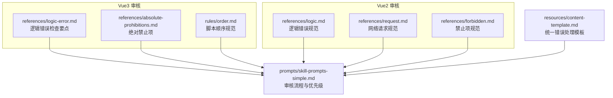
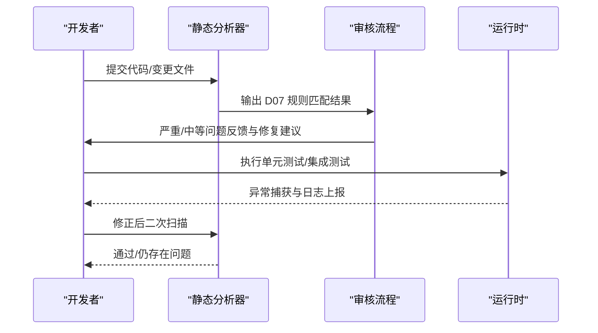
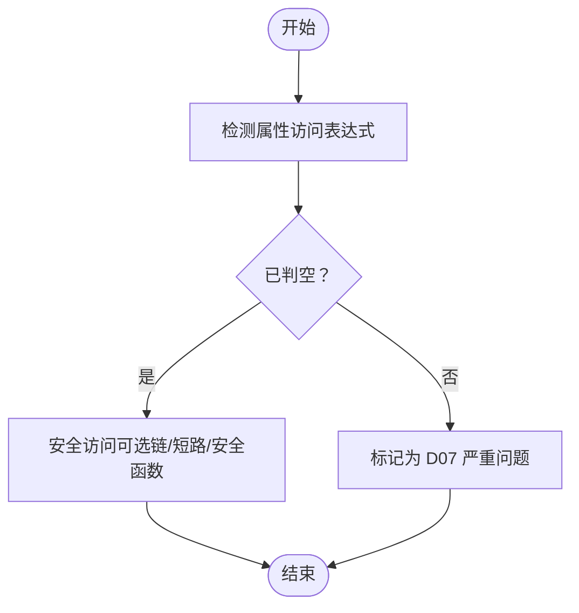
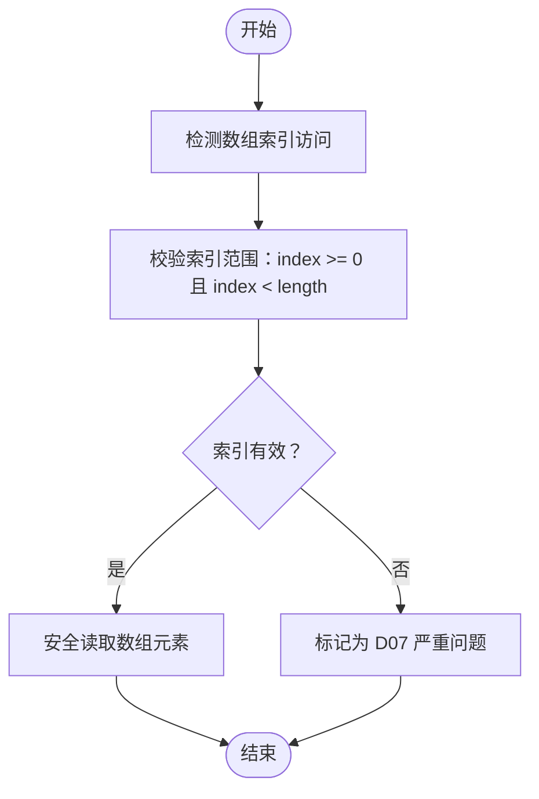
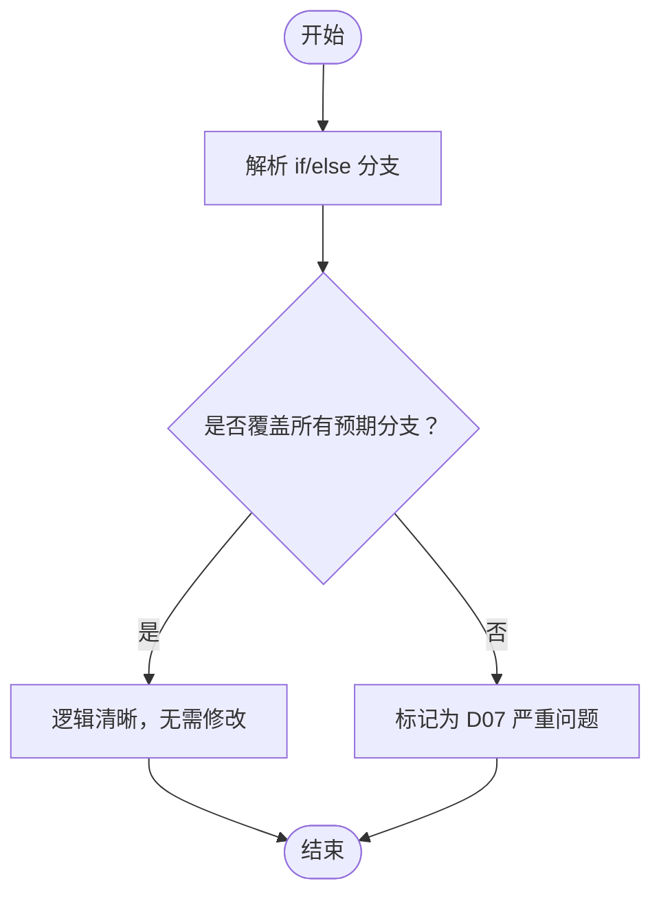
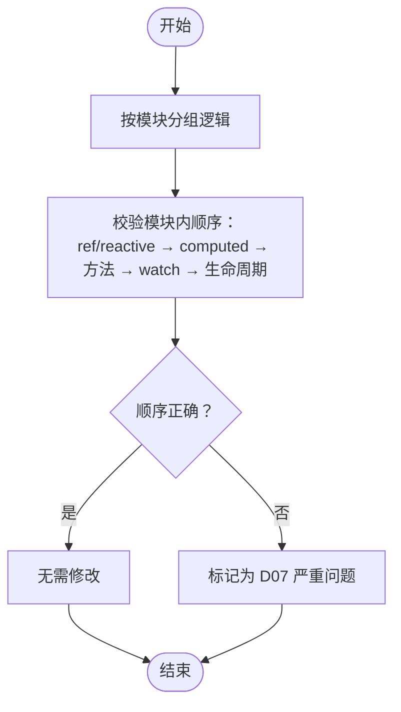
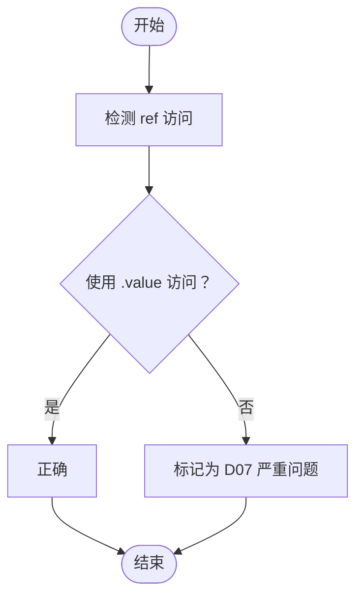
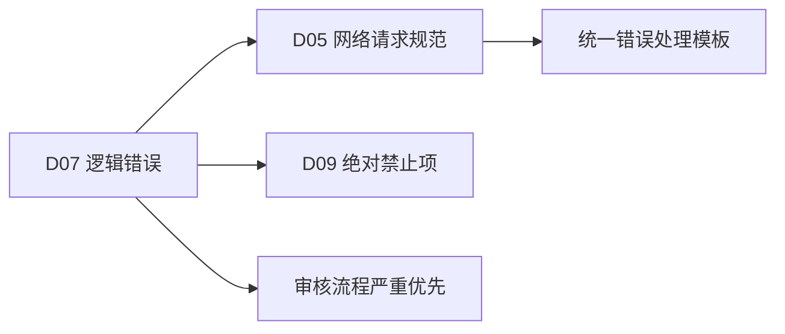

# D07 逻辑错误检查

<cite>
**本文档引用的文件**
- [skills/yy-frontend-vue3-review/references/logic-error.md](file://skills/yy-frontend-vue3-review/references/logic-error.md)
- [skills/yy-frontend-vue2-review/references/logic.md](file://skills/yy-frontend-vue2-review/references/logic.md)
- [skills/yy-frontend-vue3-review/references/absolute-prohibitions.md](file://skills/yy-frontend-vue3-review/references/absolute-prohibitions.md)
- [skills/yy-frontend-vue2-review/references/forbidden.md](file://skills/yy-frontend-vue2-review/references/forbidden.md)
- [skills/yy-frontend-vue3-review/rules/order.md](file://skills/yy-frontend-vue3-review/rules/order.md)
- [skills/yy-frontend-vue2-review/references/request.md](file://skills/yy-frontend-vue2-review/references/request.md)
- [skills/yy-frontend-vue2-review/prompts/skill-prompts-simple.md](file://skills/yy-frontend-vue2-review/prompts/skill-prompts-simple.md)
- [skills/yy-create-rule/resources/content-template.md](file://skills/yy-create-rule/resources/content-template.md)
</cite>

## 目录
1. [简介](#简介)
2. [项目结构](#项目结构)
3. [核心组件](#核心组件)
4. [架构总览](#架构总览)
5. [详细组件分析](#详细组件分析)
6. [依赖关系分析](#依赖关系分析)
7. [性能考量](#性能考量)
8. [故障排查指南](#故障排查指南)
9. [结论](#结论)
10. [附录](#附录)

## 简介
本文件面向 D07 逻辑错误检查，聚焦于空指针、数组越界、逻辑判断、方法内部顺序、ref 访问等常见逻辑错误的识别与预防。结合静态分析与动态检查，提供可执行的检查清单、调试技巧与修复建议，并给出边界条件与异常场景的应对策略。

## 项目结构
围绕 D07 逻辑错误检查，仓库中与 Vue2/Vue3 审核相关的参考与规则文件如下：
- Vue3 审核参考：逻辑错误、绝对禁止项、脚本顺序规范
- Vue2 审核参考：逻辑错误、网络请求规范、禁止项
- 审核流程与提示词：用于指导整体审核顺序与优先级

图表来源
- [skills/yy-frontend-vue3-review/references/logic-error.md:1-37](file://skills/yy-frontend-vue3-review/references/logic-error.md#L1-L37)
- [skills/yy-frontend-vue3-review/references/absolute-prohibitions.md:1-23](file://skills/yy-frontend-vue3-review/references/absolute-prohibitions.md#L1-L23)
- [skills/yy-frontend-vue3-review/rules/order.md:1-141](file://skills/yy-frontend-vue3-review/rules/order.md#L1-L141)
- [skills/yy-frontend-vue2-review/references/logic.md:1-64](file://skills/yy-frontend-vue2-review/references/logic.md#L1-L64)
- [skills/yy-frontend-vue2-review/references/request.md:1-44](file://skills/yy-frontend-vue2-review/references/request.md#L1-L44)
- [skills/yy-frontend-vue2-review/references/forbidden.md:1-36](file://skills/yy-frontend-vue2-review/references/forbidden.md#L1-L36)
- [skills/yy-frontend-vue2-review/prompts/skill-prompts-simple.md:61-101](file://skills/yy-frontend-vue2-review/prompts/skill-prompts-simple.md#L61-L101)
- [skills/yy-create-rule/resources/content-template.md:92-122](file://skills/yy-create-rule/resources/content-template.md#L92-L122)

章节来源
- [skills/yy-frontend-vue3-review/references/logic-error.md:1-37](file://skills/yy-frontend-vue3-review/references/logic-error.md#L1-L37)
- [skills/yy-frontend-vue2-review/references/logic.md:1-64](file://skills/yy-frontend-vue2-review/references/logic.md#L1-L64)
- [skills/yy-frontend-vue3-review/references/absolute-prohibitions.md:1-23](file://skills/yy-frontend-vue3-review/references/absolute-prohibitions.md#L1-L23)
- [skills/yy-frontend-vue2-review/references/forbidden.md:1-36](file://skills/yy-frontend-vue2-review/references/forbidden.md#L1-L36)
- [skills/yy-frontend-vue3-review/rules/order.md:1-141](file://skills/yy-frontend-vue3-review/rules/order.md#L1-L141)
- [skills/yy-frontend-vue2-review/references/request.md:1-44](file://skills/yy-frontend-vue2-review/references/request.md#L1-L44)
- [skills/yy-frontend-vue2-review/prompts/skill-prompts-simple.md:61-101](file://skills/yy-frontend-vue2-review/prompts/skill-prompts-simple.md#L61-L101)
- [skills/yy-create-rule/resources/content-template.md:92-122](file://skills/yy-create-rule/resources/content-template.md#L92-L122)

## 核心组件
- 空指针检查：要求在访问对象属性前进行判空，推荐使用可选链或短路逻辑进行安全访问；不推荐深层可选链，建议使用安全访问函数替代。
- 数组越界检查：访问数组元素前必须校验索引范围，确保 index >= 0 且 index < arr.length。
- 逻辑判断检查：if/else 必须覆盖所有预期分支，避免遗漏分支导致的逻辑错误。
- 方法内部顺序检查：建议将逻辑按“初始化 → 网络请求 → 事件处理 → 特殊计算”的顺序组织，提升可维护性与可读性。
- ref 访问检查：在 script 中访问 ref 值必须使用 .value，避免直接访问底层引用。

章节来源
- [skills/yy-frontend-vue3-review/references/logic-error.md:7-36](file://skills/yy-frontend-vue3-review/references/logic-error.md#L7-L36)
- [skills/yy-frontend-vue2-review/references/logic.md:9-64](file://skills/yy-frontend-vue2-review/references/logic.md#L9-L64)
- [skills/yy-frontend-vue3-review/rules/order.md:27-35](file://skills/yy-frontend-vue3-review/rules/order.md#L27-L35)

## 架构总览
D07 逻辑错误检查贯穿静态分析与动态检查两个层面：
- 静态分析：基于规则文件与审核流程，对代码结构、命名、访问模式进行扫描与约束。
- 动态检查：结合网络请求规范与统一错误处理模板，确保运行时异常被正确捕获与上报。

图表来源
- [skills/yy-frontend-vue2-review/prompts/skill-prompts-simple.md:69-101](file://skills/yy-frontend-vue2-review/prompts/skill-prompts-simple.md#L69-L101)
- [skills/yy-create-rule/resources/content-template.md:92-122](file://skills/yy-create-rule/resources/content-template.md#L92-L122)

## 详细组件分析

### 空指针检查
- 规则要点
  - 访问对象属性前必须判空，避免直接访问可能为 null/undefined 的引用。
  - 不推荐深层可选链，建议使用安全访问函数替代，降低可读性与维护成本。
- 静态分析关注点
  - 检测未判空的属性访问表达式。
  - 识别深层可选链模式并标记为潜在风险。
- 动态检查关注点
  - 运行时若出现空指针异常，应通过统一错误处理进行捕获与上报。
- 修复建议
  - 将直接访问改为安全访问（可选链或短路），并在必要时提供默认值。
  - 对深层嵌套结构使用安全访问函数，明确边界与默认值策略。

图表来源
- [skills/yy-frontend-vue2-review/references/logic.md:9-22](file://skills/yy-frontend-vue2-review/references/logic.md#L9-L22)
- [skills/yy-create-rule/resources/content-template.md:92-122](file://skills/yy-create-rule/resources/content-template.md#L92-L122)

章节来源
- [skills/yy-frontend-vue2-review/references/logic.md:9-22](file://skills/yy-frontend-vue2-review/references/logic.md#L9-L22)
- [skills/yy-frontend-vue2-review/references/forbidden.md:13-13](file://skills/yy-frontend-vue2-review/references/forbidden.md#L13-L13)
- [skills/yy-create-rule/resources/content-template.md:92-122](file://skills/yy-create-rule/resources/content-template.md#L92-L122)

### 数组越界检查
- 规则要点
  - 访问数组元素前必须校验索引范围，确保 index >= 0 且 index < arr.length。
  - 对空数组访问提供兜底逻辑（如返回 null 或默认值）。
- 静态分析关注点
  - 检测数组索引访问表达式，识别未校验长度的访问。
- 动态检查关注点
  - 运行时数组越界应被捕获并记录，避免程序崩溃。
- 修复建议
  - 在访问前增加长度判断与边界校验。
  - 对可能为空的数组提供默认安全值。

图表来源
- [skills/yy-frontend-vue2-review/references/logic.md:33-46](file://skills/yy-frontend-vue2-review/references/logic.md#L33-L46)

章节来源
- [skills/yy-frontend-vue2-review/references/logic.md:33-46](file://skills/yy-frontend-vue2-review/references/logic.md#L33-L46)

### 逻辑判断检查
- 规则要点
  - if/else 必须覆盖所有预期分支，避免遗漏分支导致的逻辑错误。
  - 条件判断应清晰、可读，避免复杂嵌套。
- 静态分析关注点
  - 检测 if/else 分支完整性，识别缺失分支或冗余分支。
- 动态检查关注点
  - 通过单元测试覆盖不同分支，确保每条路径均被验证。
- 修复建议
  - 使用卫语句简化条件，拆分复杂判断。
  - 补充缺失分支或合并冗余逻辑。

图表来源
- [skills/yy-frontend-vue2-review/references/logic.md:49-53](file://skills/yy-frontend-vue2-review/references/logic.md#L49-L53)

章节来源
- [skills/yy-frontend-vue2-review/references/logic.md:49-53](file://skills/yy-frontend-vue2-review/references/logic.md#L49-L53)

### 方法内部顺序检查
- 规则要点
  - 建议将逻辑按“初始化 → 网络请求 → 事件处理 → 特殊计算”的顺序组织。
  - 在 Vue3 中，脚本内部结构建议遵循 ref/reactive → computed → 方法 → watch → 生命周期钩子的模块内顺序。
- 静态分析关注点
  - 检查方法声明与调用顺序是否符合规范。
  - 对模块内顺序进行一致性检查。
- 动态检查关注点
  - 顺序不当可能导致副作用或状态不一致，需通过测试验证。
- 修复建议
  - 将初始化逻辑前置，网络请求与事件处理分离，特殊计算独立封装。

图表来源
- [skills/yy-frontend-vue3-review/rules/order.md:27-35](file://skills/yy-frontend-vue3-review/rules/order.md#L27-L35)

章节来源
- [skills/yy-frontend-vue3-review/rules/order.md:27-35](file://skills/yy-frontend-vue3-review/rules/order.md#L27-L35)

### ref 访问检查
- 规则要点
  - 在 script 中访问 ref 值必须使用 .value，避免直接访问底层引用。
  - 绝对禁止项中明确禁止在 <script setup> 中使用 this，禁止使用 Options API。
- 静态分析关注点
  - 检测 script 中对 ref 的访问是否使用 .value。
  - 检查是否在 <script setup> 中使用 this。
- 动态检查关注点
  - 运行时若 .value 使用不当，会导致响应式异常或访问错误。
- 修复建议
  - 统一使用 .value 访问 ref 值。
  - 使用 Composition API 与 <script setup> 语法，避免混用 Options API。

图表来源
- [skills/yy-frontend-vue3-review/references/logic-error.md:34-36](file://skills/yy-frontend-vue3-review/references/logic-error.md#L34-L36)
- [skills/yy-frontend-vue3-review/references/absolute-prohibitions.md:15-15](file://skills/yy-frontend-vue3-review/references/absolute-prohibitions.md#L15-L15)

章节来源
- [skills/yy-frontend-vue3-review/references/logic-error.md:34-36](file://skills/yy-frontend-vue3-review/references/logic-error.md#L34-L36)
- [skills/yy-frontend-vue3-review/references/absolute-prohibitions.md:15-15](file://skills/yy-frontend-vue3-review/references/absolute-prohibitions.md#L15-L15)

## 依赖关系分析
D07 逻辑错误检查与其他维度的关联如下：
- 与 D05 网络请求规范联动：网络请求必须使用 async/await + try/catch/finally，避免多层嵌套，统一错误处理。
- 与 D09 绝对禁止项联动：禁止在 <script setup> 中使用 this、禁止 Options API、禁止多层 try/catch 等，这些都属于逻辑错误的高风险行为。
- 与审核流程联动：D07 作为严重维度，发现即终止判定，需优先处理。

图表来源
- [skills/yy-frontend-vue2-review/references/request.md:9-34](file://skills/yy-frontend-vue2-review/references/request.md#L9-L34)
- [skills/yy-frontend-vue3-review/references/absolute-prohibitions.md:18-18](file://skills/yy-frontend-vue3-review/references/absolute-prohibitions.md#L18-L18)
- [skills/yy-frontend-vue2-review/prompts/skill-prompts-simple.md:92-98](file://skills/yy-frontend-vue2-review/prompts/skill-prompts-simple.md#L92-L98)
- [skills/yy-create-rule/resources/content-template.md:92-122](file://skills/yy-create-rule/resources/content-template.md#L92-L122)

章节来源
- [skills/yy-frontend-vue2-review/references/request.md:9-34](file://skills/yy-frontend-vue2-review/references/request.md#L9-L34)
- [skills/yy-frontend-vue3-review/references/absolute-prohibitions.md:18-18](file://skills/yy-frontend-vue3-review/references/absolute-prohibitions.md#L18-L18)
- [skills/yy-frontend-vue2-review/prompts/skill-prompts-simple.md:92-98](file://skills/yy-frontend-vue2-review/prompts/skill-prompts-simple.md#L92-L98)
- [skills/yy-create-rule/resources/content-template.md:92-122](file://skills/yy-create-rule/resources/content-template.md#L92-L122)

## 性能考量
- 静态分析阶段尽早发现逻辑错误，可减少运行时异常与回退成本。
- 合理的模块划分与顺序有助于降低耦合，提升可维护性与测试效率。
- 统一错误处理与日志上报可帮助快速定位问题，避免性能劣化。

## 故障排查指南
- 空指针
  - 现象：访问属性时报错或返回 undefined/null。
  - 排查：确认访问前是否判空；避免深层可选链；使用安全访问函数。
  - 修复：补充判空逻辑或提供默认值。
- 数组越界
  - 现象：读取索引时报错或得到未预期值。
  - 排查：检查索引范围与数组长度；确认边界条件。
  - 修复：增加长度判断与边界校验。
- 逻辑判断
  - 现象：某些分支未覆盖，导致异常路径未处理。
  - 排查：梳理所有分支；简化复杂条件。
  - 修复：补充缺失分支或重构条件。
- 方法内部顺序
  - 现象：状态不一致或副作用异常。
  - 排查：检查初始化、请求、事件、计算的先后顺序。
  - 修复：按建议顺序重新组织。
- ref 访问
  - 现象：响应式异常或访问报错。
  - 排查：确认是否使用 .value；是否在 <script setup> 中使用 this。
  - 修复：统一使用 .value；改用 Composition API。

章节来源
- [skills/yy-frontend-vue2-review/references/logic.md:9-64](file://skills/yy-frontend-vue2-review/references/logic.md#L9-L64)
- [skills/yy-frontend-vue3-review/references/logic-error.md:7-36](file://skills/yy-frontend-vue3-review/references/logic-error.md#L7-L36)
- [skills/yy-frontend-vue3-review/references/absolute-prohibitions.md:15-15](file://skills/yy-frontend-vue3-review/references/absolute-prohibitions.md#L15-L15)

## 结论
D07 逻辑错误检查通过静态分析与动态检查相结合的方式，能够有效识别空指针、数组越界、逻辑判断、方法顺序与 ref 访问等常见问题。建议在审核流程中优先处理严重问题，配合统一错误处理与模块化顺序规范，持续提升代码质量与稳定性。

## 附录
- 审核流程与优先级
  - D07、D08、D09 严重维度优先检查，发现即终止判定。
  - D03、D04、D05、D06 中等维度，发现则不通过。
  - D01、D02 轻微维度，不影响通过。
- 统一错误处理
  - 所有 API 错误使用统一错误处理器，不得静默忽略。
  - 对预期内的错误可在处理后返回默认值。

章节来源
- [skills/yy-frontend-vue2-review/prompts/skill-prompts-simple.md:69-101](file://skills/yy-frontend-vue2-review/prompts/skill-prompts-simple.md#L69-L101)
- [skills/yy-create-rule/resources/content-template.md:92-122](file://skills/yy-create-rule/resources/content-template.md#L92-L122)