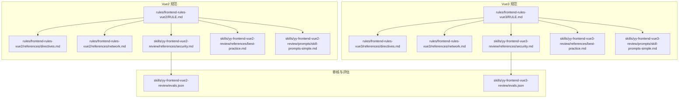
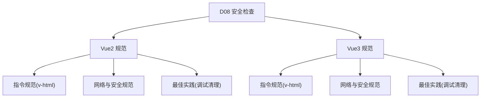
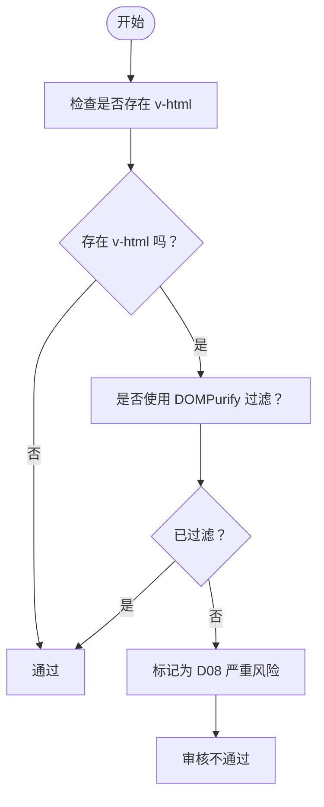
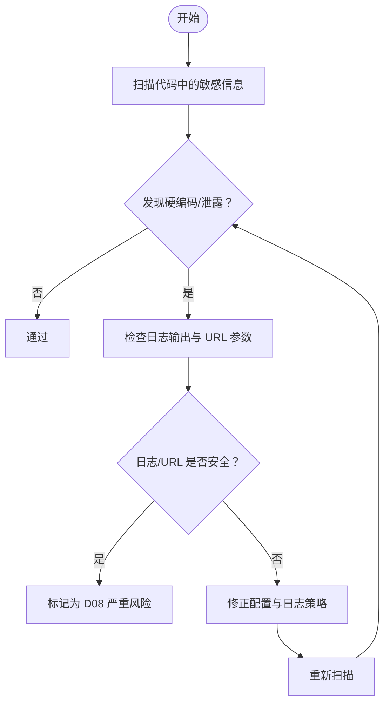
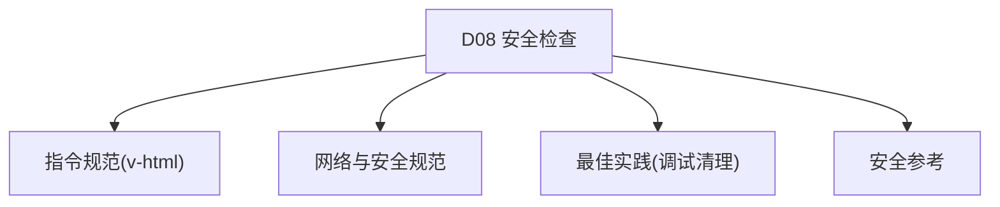

# D08 安全漏洞检查

<cite>
**本文档引用的文件**
- [security.md](file://skills/yy-frontend-vue2-review/references/security.md)
- [security.md](file://skills/yy-frontend-vue3-review/references/security.md)
- [directives.md](file://rules/frontend-rules-vue2/references/directives.md)
- [directives.md](file://rules/frontend-rules-vue3/references/directives.md)
- [network.md](file://rules/frontend-rules-vue2/references/network.md)
- [network.md](file://rules/frontend-rules-vue3/references/network.md)
- [RULE.md](file://rules/frontend-rules-vue2/RULE.md)
- [RULE.md](file://rules/frontend-rules-vue3/RULE.md)
- [skill-prompts-simple.md](file://skills/yy-frontend-vue2-review/prompts/skill-prompts-simple.md)
- [skill-prompts.md](file://skills/yy-frontend-vue2-review/prompts/skill-prompts.md)
- [evals.json](file://skills/yy-frontend-vue2-review/evals.json)
- [evals.json](file://skills/yy-frontend-vue3-review/evals.json)
- [best-practice.md](file://skills/yy-frontend-vue2-review/references/best-practice.md)
- [best-practice.md](file://skills/yy-frontend-vue3-review/references/best-practice.md)
</cite>

## 目录
1. [简介](#简介)
2. [项目结构](#项目结构)
3. [核心组件](#核心组件)
4. [架构概览](#架构概览)
5. [详细组件分析](#详细组件分析)
6. [依赖关系分析](#依赖关系分析)
7. [性能考虑](#性能考虑)
8. [故障排除指南](#故障排除指南)
9. [结论](#结论)
10. [附录](#附录)

## 简介
本文件面向 D08 安全漏洞检查，聚焦两类关键风险：v-html XSS 风险与敏感信息硬编码/泄露。基于仓库中的 Vue2/Vue3 前端规范与审核技能，系统阐述识别与防护方法、安全编码规范、威胁建模与检测工具，并提供安全测试与渗透测试建议。

## 项目结构
该仓库围绕 Vue 前端开发制定了两套规范体系：
- Vue2 规范：包含组件开发、指令规范、网络请求与安全等模块
- Vue3 规范：在 Vue2 基础上引入组合式 API、响应式管理与 Hooks 规范
- 审核技能：针对 D08 维度的自动化评估与人工复核流程

**图表来源**
- [RULE.md:1-62](file://rules/frontend-rules-vue2/RULE.md#L1-L62)
- [RULE.md:1-68](file://rules/frontend-rules-vue3/RULE.md#L1-L68)
- [directives.md:1-116](file://rules/frontend-rules-vue2/references/directives.md#L1-L116)
- [directives.md:1-105](file://rules/frontend-rules-vue3/references/directives.md#L1-L105)
- [network.md:1-180](file://rules/frontend-rules-vue2/references/network.md#L1-L180)
- [network.md:1-363](file://rules/frontend-rules-vue3/references/network.md#L1-L363)
- [security.md:1-32](file://skills/yy-frontend-vue2-review/references/security.md#L1-L32)
- [security.md:1-16](file://skills/yy-frontend-vue3-review/references/security.md#L1-L16)
- [evals.json:132-149](file://skills/yy-frontend-vue2-review/evals.json#L132-L149)
- [evals.json:117-162](file://skills/yy-frontend-vue3-review/evals.json#L117-L162)

**章节来源**
- [RULE.md:1-62](file://rules/frontend-rules-vue2/RULE.md#L1-L62)
- [RULE.md:1-68](file://rules/frontend-rules-vue3/RULE.md#L1-L68)

## 核心组件
- v-html 安全规范：要求对用户输入或外部 HTML 进行 DOMPurify 过滤，避免 XSS 攻击
- 敏感信息管控：禁止硬编码密钥/Token/密码；禁止在日志/URL 中泄露敏感数据
- 网络请求安全：统一响应解构、错误处理、防重复提交、全局错误捕获
- 审核评估：D08 为严重级别，发现即不通过，需提供修复建议

**章节来源**
- [security.md:9-31](file://skills/yy-frontend-vue2-review/references/security.md#L9-L31)
- [security.md:7-15](file://skills/yy-frontend-vue3-review/references/security.md#L7-L15)
- [directives.md:43-61](file://rules/frontend-rules-vue2/references/directives.md#L43-L61)
- [directives.md:43-56](file://rules/frontend-rules-vue3/references/directives.md#L43-L56)
- [network.md:176-179](file://rules/frontend-rules-vue2/references/network.md#L176-L179)
- [network.md:347-354](file://rules/frontend-rules-vue3/references/network.md#L347-L354)
- [skill-prompts.md:35-44](file://skills/yy-frontend-vue2-review/prompts/skill-prompts.md#L35-L44)

## 架构概览
下图展示了 D08 安全检查在 Vue2/Vue3 体系中的位置与交互：

**图表来源**
- [directives.md:43-61](file://rules/frontend-rules-vue2/references/directives.md#L43-L61)
- [directives.md:43-56](file://rules/frontend-rules-vue3/references/directives.md#L43-L56)
- [network.md:176-179](file://rules/frontend-rules-vue2/references/network.md#L176-L179)
- [network.md:347-354](file://rules/frontend-rules-vue3/references/network.md#L347-L354)
- [best-practice.md:9-19](file://skills/yy-frontend-vue2-review/references/best-practice.md#L9-L19)
- [best-practice.md:7-10](file://skills/yy-frontend-vue3-review/references/best-practice.md#L7-L10)

## 详细组件分析

### v-html XSS 风险防护
- 风险点：直接渲染用户输入或外部 HTML 易被注入恶意脚本
- 防护措施：
  - 使用 DOMPurify 对原始 HTML 进行净化
  - 将净化逻辑封装在计算属性或响应式变量中
  - 严格限制可渲染的 HTML 范围与来源
- 审核要点：模板中出现 v-html 必须配套过滤；禁止将未经净化的变量直接绑定到 v-html

**图表来源**
- [directives.md:43-61](file://rules/frontend-rules-vue2/references/directives.md#L43-L61)
- [directives.md:43-56](file://rules/frontend-rules-vue3/references/directives.md#L43-L56)
- [security.md:9-21](file://skills/yy-frontend-vue2-review/references/security.md#L9-L21)

**章节来源**
- [directives.md:43-61](file://rules/frontend-rules-vue2/references/directives.md#L43-L61)
- [directives.md:43-56](file://rules/frontend-rules-vue3/references/directives.md#L43-L56)
- [security.md:9-21](file://skills/yy-frontend-vue2-review/references/security.md#L9-L21)

### 敏感信息硬编码与泄露
- 禁止项：
  - 硬编码密码、密钥、Token、私钥
  - 在日志中输出敏感数据
  - 在前端暴露后端内部接口地址
- 防护措施：
  - 将敏感信息置于环境变量或受控配置中心
  - 使用加密存储与传输
  - 严格控制日志输出范围，避免打印凭证
  - 前端仅使用公开可用的 API 地址

**图表来源**
- [security.md:25-31](file://skills/yy-frontend-vue2-review/references/security.md#L25-L31)
- [security.md:13-15](file://skills/yy-frontend-vue3-review/references/security.md#L13-L15)
- [network.md:176-179](file://rules/frontend-rules-vue2/references/network.md#L176-L179)
- [network.md:347-352](file://rules/frontend-rules-vue3/references/network.md#L347-L352)

**章节来源**
- [security.md:25-31](file://skills/yy-frontend-vue2-review/references/security.md#L25-L31)
- [security.md:13-15](file://skills/yy-frontend-vue3-review/references/security.md#L13-L15)
- [network.md:176-179](file://rules/frontend-rules-vue2/references/network.md#L176-L179)
- [network.md:347-352](file://rules/frontend-rules-vue3/references/network.md#L347-L352)

### 安全编码规范与威胁建模
- 编码规范：
  - 统一使用 DOMPurify 过滤 v-html
  - 禁止在 URL 传递 Token/密码
  - 禁止在日志中输出敏感数据
  - 使用 try/catch 包裹异步与计算逻辑
- 威胁建模方法：
  - 识别攻击面：用户输入、外部 HTML、日志输出、API 调用
  - 评估风险等级：XSS、信息泄露、会话劫持
  - 制定缓解策略：输入验证、输出编码、最小权限、审计日志

**章节来源**
- [directives.md:43-61](file://rules/frontend-rules-vue2/references/directives.md#L43-L61)
- [directives.md:43-56](file://rules/frontend-rules-vue3/references/directives.md#L43-L56)
- [network.md:176-179](file://rules/frontend-rules-vue2/references/network.md#L176-L179)
- [network.md:347-354](file://rules/frontend-rules-vue3/references/network.md#L347-L354)
- [best-practice.md:9-19](file://skills/yy-frontend-vue2-review/references/best-practice.md#L9-L19)
- [best-practice.md:7-10](file://skills/yy-frontend-vue3-review/references/best-practice.md#L7-L10)

### 安全漏洞检测工具与手动检查技巧
- 自动化工具：
  - ESLint + Vue 插件：检查 v-html 使用与日志输出
  - SAST 工具：扫描敏感信息硬编码与不安全 API 调用
  - 静态 HTML 分析：结合 DOMPurify 规则验证输出
- 手动检查技巧：
  - 模板扫描：定位 v-html 使用点，确认是否过滤
  - 配置审查：检查环境变量与构建产物，避免泄露
  - 日志审计：排查 console.log、warn、error 中的敏感字段
  - API 调用链：追踪请求参数与响应，确认未携带敏感信息

**章节来源**
- [directives.md:43-61](file://rules/frontend-rules-vue2/references/directives.md#L43-L61)
- [directives.md:43-56](file://rules/frontend-rules-vue3/references/directives.md#L43-L56)
- [network.md:176-179](file://rules/frontend-rules-vue2/references/network.md#L176-L179)
- [network.md:347-354](file://rules/frontend-rules-vue3/references/network.md#L347-L354)

### 安全测试与渗透测试建议
- 安全测试：
  - XSS 测试：构造含脚本的 v-html 输入，验证过滤效果
  - 敏感信息测试：检查日志输出与网络请求参数
  - 权限测试：模拟越权访问，验证鉴权与授权
- 渗透测试：
  - 前端注入：尝试在 v-html、富文本编辑器中注入恶意脚本
  - 配置泄露：检查前端构建产物与环境变量
  - 会话测试：验证 Token 传递与存储安全性

**章节来源**
- [evals.json:132-149](file://skills/yy-frontend-vue2-review/evals.json#L132-L149)
- [evals.json:117-162](file://skills/yy-frontend-vue3-review/evals.json#L117-L162)
- [skill-prompts-simple.md:102-121](file://skills/yy-frontend-vue2-review/prompts/skill-prompts-simple.md#L102-L121)

## 依赖关系分析
D08 安全检查贯穿 Vue2/Vue3 规范体系，与指令、网络与安全、最佳实践模块紧密耦合：

**图表来源**
- [directives.md:43-61](file://rules/frontend-rules-vue2/references/directives.md#L43-L61)
- [directives.md:43-56](file://rules/frontend-rules-vue3/references/directives.md#L43-L56)
- [network.md:176-179](file://rules/frontend-rules-vue2/references/network.md#L176-L179)
- [network.md:347-354](file://rules/frontend-rules-vue3/references/network.md#L347-L354)
- [best-practice.md:9-19](file://skills/yy-frontend-vue2-review/references/best-practice.md#L9-L19)
- [best-practice.md:7-10](file://skills/yy-frontend-vue3-review/references/best-practice.md#L7-L10)
- [security.md:9-31](file://skills/yy-frontend-vue2-review/references/security.md#L9-L31)
- [security.md:7-15](file://skills/yy-frontend-vue3-review/references/security.md#L7-L15)

**章节来源**
- [RULE.md:18-36](file://rules/frontend-rules-vue2/RULE.md#L18-L36)
- [RULE.md:24-38](file://rules/frontend-rules-vue3/RULE.md#L24-L38)

## 性能考虑
- DOMPurify 过滤成本：在大量 HTML 渲染场景下，建议缓存净化结果或按需过滤
- 日志输出：避免在高频路径中输出敏感数据，减少 I/O 开销
- 防重复提交：通过 loading 状态或互斥锁降低无效请求次数

## 故障排除指南
- v-html 未过滤：
  - 现象：页面出现脚本执行或弹窗
  - 处理：引入 DOMPurify 并在计算属性中统一过滤
- 敏感信息泄露：
  - 现象：日志中出现 Token/密码；网络请求参数包含敏感信息
  - 处理：移除硬编码，使用环境变量；在日志中脱敏
- 审核不通过：
  - 现象：D08 维度标记为严重
  - 处理：提供修复建议，包括补丁与回归测试

**章节来源**
- [security.md:9-31](file://skills/yy-frontend-vue2-review/references/security.md#L9-L31)
- [security.md:7-15](file://skills/yy-frontend-vue3-review/references/security.md#L7-L15)
- [network.md:176-179](file://rules/frontend-rules-vue2/references/network.md#L176-L179)
- [network.md:347-354](file://rules/frontend-rules-vue3/references/network.md#L347-L354)
- [skill-prompts.md:35-44](file://skills/yy-frontend-vue2-review/prompts/skill-prompts.md#L35-L44)

## 结论
D08 安全漏洞检查的核心在于：对 v-html 实施严格的 XSS 防护，杜绝敏感信息硬编码与泄露，并通过统一的网络请求与日志策略降低风险。结合自动化工具与人工复核，可有效提升前端代码的安全性与合规性。

## 附录
- 审核维度与严重程度：D08 为严重级别，发现即不通过
- 评估用例：针对 v-html 使用的专项检测用例已在评审脚本中定义

**章节来源**
- [skill-prompts.md:35-44](file://skills/yy-frontend-vue2-review/prompts/skill-prompts.md#L35-L44)
- [evals.json:132-149](file://skills/yy-frontend-vue2-review/evals.json#L132-L149)
- [evals.json:117-162](file://skills/yy-frontend-vue3-review/evals.json#L117-L162)