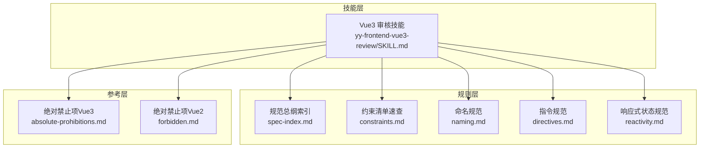
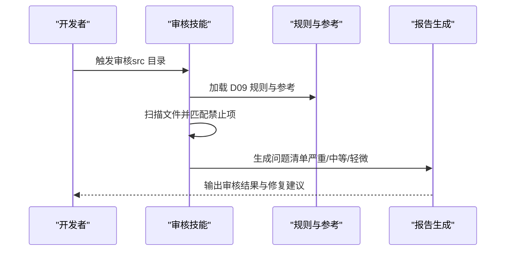
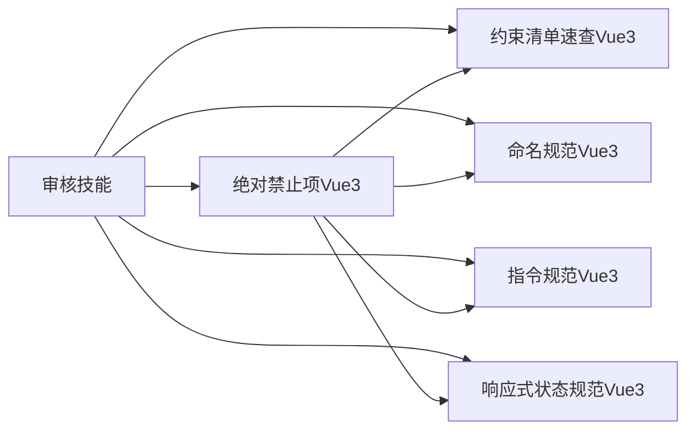

# D09 绝对禁止项

<cite>
**本文档引用的文件**
- [绝对禁止项（Vue3）](file://skills/yy-frontend-vue3-review/references/absolute-prohibitions.md)
- [约束清单速查（Vue3）](file://rules/frontend-rules-vue3/references/constraints.md)
- [命名规范（Vue3）](file://rules/frontend-rules-vue3/references/naming.md)
- [指令规范（Vue3）](file://rules/frontend-rules-vue3/references/directives.md)
- [响应式状态规范（ref/reactive/computed）](file://rules/frontend-rules-vue3/references/reactivity.md)
- [Vue3 前端项目开发规范总纲（索引）](file://rules/frontend-rules-vue3/references/spec-index.md)
- [Vue3 前端代码审核技能](file://skills/yy-frontend-vue3-review/SKILL.md)
- [绝对禁止项规范（Vue2）](file://skills/yy-frontend-vue2-review/references/forbidden.md)
- [约束清单速查（Vue2）](file://rules/frontend-rules-vue2/references/constraints.md)
</cite>

## 目录
1. [简介](#简介)
2. [项目结构](#项目结构)
3. [核心组件](#核心组件)
4. [架构概览](#架构概览)
5. [详细组件分析](#详细组件分析)
6. [依赖关系分析](#依赖关系分析)
7. [性能考量](#性能考量)
8. [故障排查指南](#故障排查指南)
9. [结论](#结论)

## 简介
本文件系统性梳理 D09 绝对禁止项，面向 Vue3 项目，聚焦以下严格禁止的行为：连续解构、父改子数据、修改 ref/reactive 类型、修改 props、this 使用、Options API、mixins、多层 try/catch、生命周期 emit、无意义命名、v-for 与 v-if 同元素、index 作为 key、any 类型。文档从设计原理、潜在风险、识别方法与替换方案四个维度展开，帮助开发者建立统一的质量标准与最佳实践。

## 项目结构
D09 规则由“技能 + 规则 + 参考”三层构成：
- 技能层：审核技能负责扫描 src 目录、按维度生成清单、判定严重程度
- 规则层：各模块规范文件提供具体规则与示例
- 参考层：约束清单、命名规范、指令规范、响应式规范等提供权威依据

图表来源
- [Vue3 前端代码审核技能:1-206](file://skills/yy-frontend-vue3-review/SKILL.md#L1-L206)
- [Vue3 前端项目开发规范总纲（索引）:1-60](file://rules/frontend-rules-vue3/references/spec-index.md#L1-L60)
- [约束清单速查（Vue3）:1-45](file://rules/frontend-rules-vue3/references/constraints.md#L1-L45)
- [命名规范（Vue3）:1-85](file://rules/frontend-rules-vue3/references/naming.md#L1-L85)
- [指令规范（Vue3）:1-105](file://rules/frontend-rules-vue3/references/directives.md#L1-L105)
- [响应式状态规范（ref/reactive/computed）:1-227](file://rules/frontend-rules-vue3/references/reactivity.md#L1-L227)
- [绝对禁止项（Vue3）:1-23](file://skills/yy-frontend-vue3-review/references/absolute-prohibitions.md#L1-L23)
- [绝对禁止项规范（Vue2）:1-36](file://skills/yy-frontend-vue2-review/references/forbidden.md#L1-L36)

章节来源
- [Vue3 前端代码审核技能:1-206](file://skills/yy-frontend-vue3-review/SKILL.md#L1-L206)
- [Vue3 前端项目开发规范总纲（索引）:1-60](file://rules/frontend-rules-vue3/references/spec-index.md#L1-L60)

## 核心组件
- 绝对禁止项清单：明确列出禁止行为及其严重性
- 约束清单速查：提供禁止/推荐/不推荐/注意事项的快速查阅
- 命名规范：约束变量/函数/组件/文件等命名，杜绝无意义命名
- 指令规范：明确 v-for/key、v-if/v-for 冲突、v-html 安全等
- 响应式规范：指导 ref/reactive/computed 的正确使用与类型固定
- 审核技能：自动扫描 src 目录，按维度输出问题与修复建议

章节来源
- [绝对禁止项（Vue3）:1-23](file://skills/yy-frontend-vue3-review/references/absolute-prohibitions.md#L1-L23)
- [约束清单速查（Vue3）:1-45](file://rules/frontend-rules-vue3/references/constraints.md#L1-L45)
- [命名规范（Vue3）:1-85](file://rules/frontend-rules-vue3/references/naming.md#L1-L85)
- [指令规范（Vue3）:1-105](file://rules/frontend-rules-vue3/references/directives.md#L1-L105)
- [响应式状态规范（ref/reactive/computed）:1-227](file://rules/frontend-rules-vue3/references/reactivity.md#L1-L227)
- [Vue3 前端代码审核技能:1-206](file://skills/yy-frontend-vue3-review/SKILL.md#L1-L206)

## 架构概览
D09 审核流程以“技能驱动 + 规则支撑”的方式运行：技能扫描文件，规则提供判据，参考文件给出示例与修正路径。

图表来源
- [Vue3 前端代码审核技能:1-206](file://skills/yy-frontend-vue3-review/SKILL.md#L1-L206)
- [绝对禁止项（Vue3）:1-23](file://skills/yy-frontend-vue3-review/references/absolute-prohibitions.md#L1-L23)

## 详细组件分析

### 连续解构
- 设计原理：深层嵌套解构增加空指针风险，降低可读性与可维护性
- 潜在风险：访问不存在的深层属性导致运行时错误；逻辑分支复杂化
- 识别方法：检测连续点号访问（如 data.data）或深层解构模式
- 替换方案：拆分为多步赋值；使用防御性校验；引入安全访问工具函数

章节来源
- [绝对禁止项（Vue3）:11-11](file://skills/yy-frontend-vue3-review/references/absolute-prohibitions.md#L11-L11)
- [约束清单速查（Vue3）:7-7](file://rules/frontend-rules-vue3/references/constraints.md#L7-L7)
- [绝对禁止项规范（Vue2）:13-13](file://skills/yy-frontend-vue2-review/references/forbidden.md#L13-L13)

### 父改子数据
- 设计原理：违反单向数据流，破坏组件状态一致性与可追踪性
- 潜在风险：状态来源不明确，调试困难；组件间耦合度上升
- 识别方法：检测父组件通过 $refs/$children 直接修改子组件内部状态
- 替换方案：通过 props 传入只读数据；通过 emit 上抛变更；使用 provide/inject 或状态管理

章节来源
- [绝对禁止项（Vue3）:12-12](file://skills/yy-frontend-vue3-review/references/absolute-prohibitions.md#L12-L12)
- [约束清单速查（Vue3）:8-8](file://rules/frontend-rules-vue3/references/constraints.md#L8-L8)
- [绝对禁止项规范（Vue2）:14-14](file://skills/yy-frontend-vue2-review/references/forbidden.md#L14-L14)

### 修改 ref/reactive 类型
- 设计原理：响应式系统对类型有预期假设，频繁变更类型会破坏响应式与类型推断
- 潜在风险：类型不一致导致编译期/运行期错误；响应式失效或异常
- 识别方法：检测对同一状态变量进行不同类型的赋值（如数组→字符串）
- 替换方案：后端给什么类型就用什么类型；必要时拆分为多个独立状态；使用联合类型或包装器

章节来源
- [绝对禁止项（Vue3）:13-13](file://skills/yy-frontend-vue3-review/references/absolute-prohibitions.md#L13-L13)
- [约束清单速查（Vue3）:9-9](file://rules/frontend-rules-vue3/references/constraints.md#L9-L9)
- [响应式状态规范（ref/reactive/computed）:1-227](file://rules/frontend-rules-vue3/references/reactivity.md#L1-L227)

### 修改 props
- 设计原理：props 应为只读输入，避免组件内部状态与外部状态产生分歧
- 潜在风险：违反单向数据流；父子组件状态不同步
- 识别方法：检测对 props.xxx 的直接赋值
- 替换方案：使用本地状态复制 props 初始值；通过 emit 通知父组件变更

章节来源
- [绝对禁止项（Vue3）:14-14](file://skills/yy-frontend-vue3-review/references/absolute-prohibitions.md#L14-L14)
- [约束清单速查（Vue3）:10-10](file://rules/frontend-rules-vue3/references/constraints.md#L10-L10)
- [绝对禁止项规范（Vue2）:16-16](file://skills/yy-frontend-vue2-review/references/forbidden.md#L16-L16)

### 使用 this
- 设计原理：在 <script setup> 中 this 不存在，使用会导致编译或运行时错误
- 潜在风险：语法错误；无法访问实例成员
- 识别方法：检测 <script setup> 中出现 this 关键字
- 替换方案：使用组合式 API；将方法/状态声明在 <script setup> 作用域内

章节来源
- [绝对禁止项（Vue3）:15-15](file://skills/yy-frontend-vue3-review/references/absolute-prohibitions.md#L15-L15)
- [约束清单速查（Vue3）:13-13](file://rules/frontend-rules-vue3/references/constraints.md#L13-L13)

### Options API
- 设计原理：强制使用 <script setup> 与组合式 API，提升逻辑复用与可测试性
- 潜在风险：历史写法与现代最佳实践脱节；迁移成本高
- 识别方法：检测 data()/methods/mounted() 等 Options API 特征
- 替换方案：迁移到 <script setup>；使用组合式函数抽离逻辑

章节来源
- [绝对禁止项（Vue3）:16-16](file://skills/yy-frontend-vue3-review/references/absolute-prohibitions.md#L16-L16)
- [约束清单速查（Vue3）:14-14](file://rules/frontend-rules-vue3/references/constraints.md#L14-L14)
- [Vue3 前端项目开发规范总纲（索引）:15-15](file://rules/frontend-rules-vue3/references/spec-index.md#L15-L15)

### 使用 mixins
- 设计原理：mixins 导致命名冲突与作用域不清晰；组合式 API 更易维护
- 潜在风险：逻辑分散；难以追踪副作用
- 识别方法：检测 mixins 选项
- 替换方案：使用组合式函数；通过 provide/inject 传递依赖

章节来源
- [绝对禁止项（Vue3）:17-17](file://skills/yy-frontend-vue3-review/references/absolute-prohibitions.md#L17-L17)
- [约束清单速查（Vue3）:11-11](file://rules/frontend-rules-vue3/references/constraints.md#L11-L11)

### 多层 try/catch
- 设计原理：嵌套 try/catch 降低可读性与可维护性；应扁平化异步流程
- 潜在风险：异常处理分散；错误传播路径不清晰
- 识别方法：检测多个连续的 try/catch 嵌套
- 替换方案：使用 async/await；统一错误处理中心；提取公共错误处理逻辑

章节来源
- [绝对禁止项（Vue3）:18-18](file://skills/yy-frontend-vue3-review/references/absolute-prohibitions.md#L18-L18)
- [约束清单速查（Vue3）:32-32](file://rules/frontend-rules-vue3/references/constraints.md#L32-L32)
- [约束清单速查（Vue2）:33-33](file://rules/frontend-rules-vue2/references/constraints.md#L33-L33)

### 生命周期 emit
- 设计原理：基础组件在生命周期中主动 emit 易造成滥用；业务组件允许但不推荐
- 潜在风险：组件生命周期与外部通信耦合；事件风暴
- 识别方法：检测 mounted/updated 等生命周期中 emit
- 替换方案：将 emit 移至用户交互或明确的业务流程中；使用状态驱动视图更新

章节来源
- [绝对禁止项（Vue3）:19-19](file://skills/yy-frontend-vue3-review/references/absolute-prohibitions.md#L19-L19)
- [约束清单速查（Vue3）:33-33](file://rules/frontend-rules-vue3/references/constraints.md#L33-L33)

### 无意义命名
- 设计原理：有意义的命名提升可读性与可维护性；无意义命名降低理解成本
- 潜在风险：增加阅读与调试成本；不利于代码审查与协作
- 识别方法：检测 data1/temp2 等无意义标识符
- 替换方案：采用语义化命名；遵循命名规范（见命名规范）

章节来源
- [绝对禁止项（Vue3）:20-20](file://skills/yy-frontend-vue3-review/references/absolute-prohibitions.md#L20-L20)
- [约束清单速查（Vue3）:12-12](file://rules/frontend-rules-vue3/references/constraints.md#L12-L12)
- [命名规范（Vue3）:26-34](file://rules/frontend-rules-vue3/references/naming.md#L26-L34)

### v-for 与 v-if 同元素
- 设计原理：同元素同时使用 v-for 与 v-if 会产生歧义与性能问题
- 潜在风险：渲染顺序不确定；v-if 条件变化导致不必要的循环
- 识别方法：检测同一元素同时绑定 v-for 与 v-if
- 替换方案：使用 <template> 包裹；通过 computed 预过滤数据

章节来源
- [绝对禁止项（Vue3）:21-21](file://skills/yy-frontend-vue3-review/references/absolute-prohibitions.md#L21-L21)
- [指令规范（Vue3）:22-39](file://rules/frontend-rules-vue3/references/directives.md#L22-L39)

### index 作为 key
- 设计原理：key 需唯一且稳定；使用 index 无法区分元素变化
- 潜在风险：列表重排异常；组件状态错乱
- 识别方法：检测 v-for 使用 index 作为 key
- 替换方案：使用唯一 ID；若无 ID，考虑使用稳定标识符

章节来源
- [绝对禁止项（Vue3）:22-22](file://skills/yy-frontend-vue3-review/references/absolute-prohibitions.md#L22-L22)
- [指令规范（Vue3）:7-18](file://rules/frontend-rules-vue3/references/directives.md#L7-L18)

### any 类型（TypeScript）
- 设计原理：any 类型抹去类型安全保障；应使用明确类型或 unknown
- 潜在风险：编译期/运行期错误；类型推断失效
- 识别方法：检测 any/ as any/@ts-ignore
- 替换方案：使用具体类型；必要时使用 unknown 并进行显式校验

章节来源
- [Vue3 前端代码审核技能:205-205](file://skills/yy-frontend-vue3-review/SKILL.md#L205-L205)
- [约束清单速查（Vue3）:1-45](file://rules/frontend-rules-vue3/references/constraints.md#L1-L45)

## 依赖关系分析
D09 规则在技能层与规则层之间形成强依赖：技能层依赖规则层提供的判据与示例，规则层又相互引用形成知识闭环。

图表来源
- [Vue3 前端代码审核技能:1-206](file://skills/yy-frontend-vue3-review/SKILL.md#L1-L206)
- [绝对禁止项（Vue3）:1-23](file://skills/yy-frontend-vue3-review/references/absolute-prohibitions.md#L1-L23)
- [约束清单速查（Vue3）:1-45](file://rules/frontend-rules-vue3/references/constraints.md#L1-L45)
- [命名规范（Vue3）:1-85](file://rules/frontend-rules-vue3/references/naming.md#L1-L85)
- [指令规范（Vue3）:1-105](file://rules/frontend-rules-vue3/references/directives.md#L1-L105)
- [响应式状态规范（ref/reactive/computed）:1-227](file://rules/frontend-rules-vue3/references/reactivity.md#L1-L227)

章节来源
- [Vue3 前端项目开发规范总纲（索引）:1-60](file://rules/frontend-rules-vue3/references/spec-index.md#L1-L60)

## 性能考量
- 连续解构与深层访问：增加运行时开销与错误处理成本
- 父改子数据：导致不必要的重渲染与状态回流
- 多层 try/catch：降低代码可读性，间接影响维护效率
- v-for 与 v-if 同元素：引发不必要遍历与 DOM 操作
- index 作为 key：破坏列表复用，导致组件状态错乱与重绘

## 故障排查指南
- 规则未生效：确认文件位于 src 目录；检查是否使用 <script setup> 语法
- 误报/漏报：核对规则引用文件；补充或调整正则/AST 检测逻辑
- 修复建议不明确：结合命名规范、指令规范与响应式规范给出具体替换步骤
- 复杂场景：优先拆分逻辑；使用组合式函数与 provide/inject 降低耦合

## 结论
D09 绝对禁止项是保障 Vue3 项目质量与可维护性的底线规则。通过统一的规则判据、清晰的识别方法与可操作的替换方案，团队可在开发早期规避高风险问题，提升整体交付质量。建议将 D09 规则纳入 CI/CD 流程，持续约束代码演进方向。