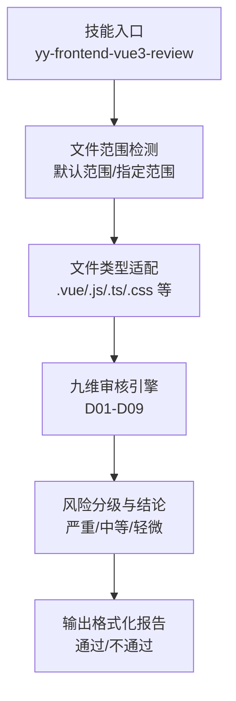
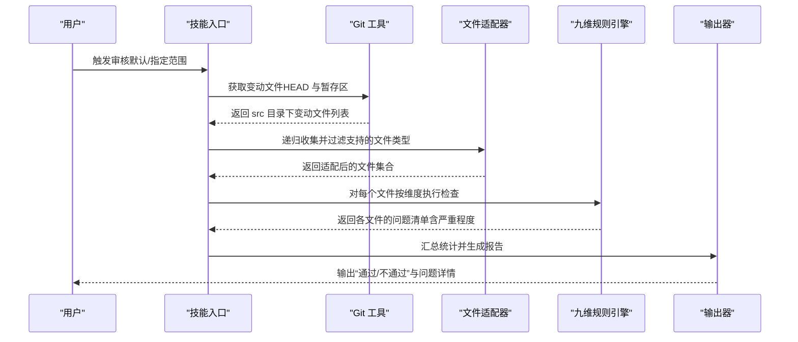
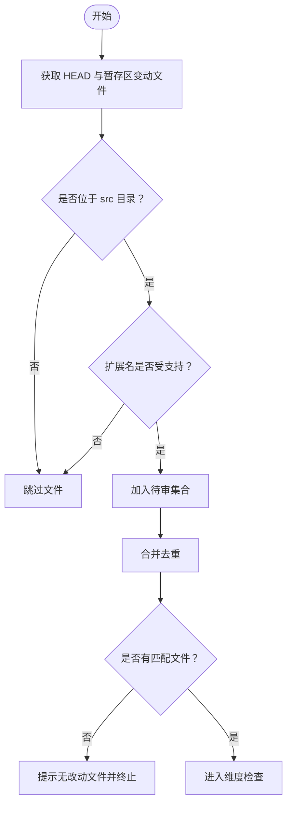
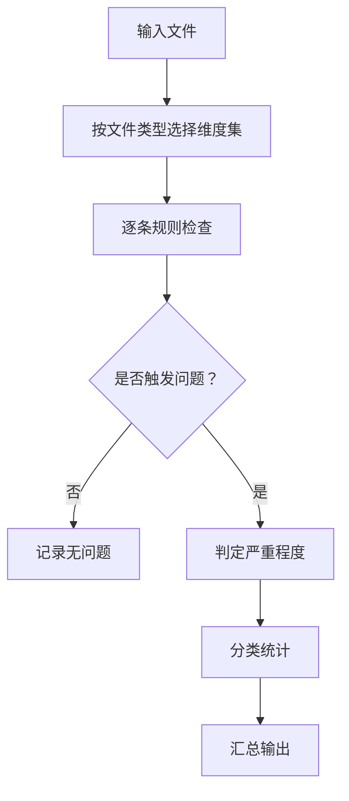
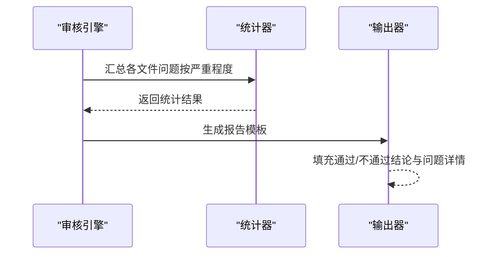
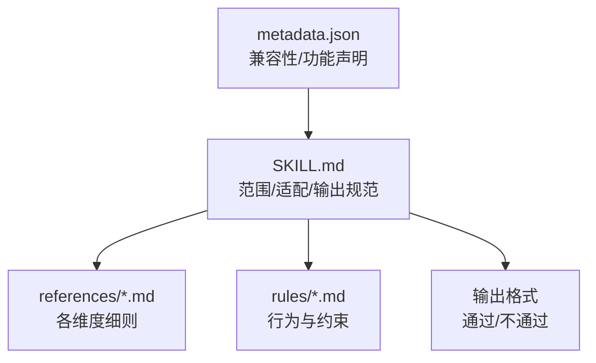

# Vue3 代码审核

<cite>
**本文引用的文件**
- [metadata.json](file://skills/yy-frontend-vue3-review/metadata.json)
- [SKILL.md](file://skills/yy-frontend-vue3-review/SKILL.md)
- [ai-behavior.md](file://skills/yy-frontend-vue3-review/rules/ai-behavior.md)
- [absolute-prohibitions.md](file://skills/yy-frontend-vue3-review/references/absolute-prohibitions.md)
- [best-practice.md](file://skills/yy-frontend-vue3-review/references/best-practice.md)
- [code-style.md](file://skills/yy-frontend-vue3-review/references/code-style.md)
- [component.md](file://skills/yy-frontend-vue3-review/references/component.md)
- [naming.md](file://skills/yy-frontend-vue3-review/references/naming.md)
- [network-request.md](file://skills/yy-frontend-vue3-review/references/network-request.md)
- [computed.md](file://skills/yy-frontend-vue3-review/references/computed.md)
- [logic-error.md](file://skills/yy-frontend-vue3-review/references/logic-error.md)
- [security.md](file://skills/yy-frontend-vue3-review/references/security.md)
</cite>

## 目录
1. [简介](#简介)
2. [项目结构](#项目结构)
3. [核心组件](#核心组件)
4. [架构总览](#架构总览)
5. [详细组件分析](#详细组件分析)
6. [依赖分析](#依赖分析)
7. [性能考虑](#性能考虑)
8. [故障排查指南](#故障排查指南)
9. [结论](#结论)
10. [附录](#附录)

## 简介
本技能面向 Vue3 项目（Composition API + script setup）的代码审核，基于 Git diff 自动检测 src 目录下的改动文件，结合九个审核维度对代码进行质量评估与风险分级。系统支持默认范围（HEAD 与暂存区）与指定范围两种扫描模式，严格限定 src 目录边界，输出“通过/不通过”的审核结论，并按严重程度汇总问题明细与修复建议。

## 项目结构
- 技能元数据与说明：metadata.json、SKILL.md
- 规则与参考文档：rules/ 与 references/ 下的各类规范文件
- AI 行为约束：rules/ai-behavior.md

图表来源
- [SKILL.md:14-21](file://skills/yy-frontend-vue3-review/SKILL.md#L14-L21)
- [metadata.json:21-26](file://skills/yy-frontend-vue3-review/metadata.json#L21-L26)

章节来源
- [metadata.json:1-42](file://skills/yy-frontend-vue3-review/metadata.json#L1-L42)
- [SKILL.md:1-206](file://skills/yy-frontend-vue3-review/SKILL.md#L1-L206)

## 核心组件
- 文件范围检测与适配
  - 默认范围：从 git diff HEAD 与 git diff --cached 中提取 src 目录下的变动文件，合并去重并严格过滤
  - 指定范围：用户提供的 src 目录下文件或目录，递归收集支持的文件类型
  - 不匹配文件：若无匹配则终止并提示“当前 src 目录下没有需要审核的改动文件”
- 审核维度与风险分级
  - D01 代码风格（轻微）
  - D02 最佳实践（轻微）
  - D03 Vue3 组件规范（中等）
  - D04 命名规范（中等）
  - D05 网络请求规范（中等）
  - D06 computed 规范（中等）
  - D07 逻辑错误（严重）
  - D08 安全漏洞（严重）
  - D09 绝对禁止项（严重）
- 执行规则
  - 严重/中等问题导致“不通过”，轻微问题不影响通过结论
- 文件类型适配
  - .vue：覆盖全部九维
  - .js/.jsx/.ts/.tsx：覆盖 D01、D03、D04、D05、D06、D07、D09
  - .css/.scss/.less：覆盖 D01、D02
- 输出格式
  - 通过：统计三类严重程度数量，提示“所有文件符合 Vue3 前端开发规范”
  - 不通过：按文件分组输出问题详情，分别列出严重/中等/轻微问题，最后给出修复建议

章节来源
- [SKILL.md:14-206](file://skills/yy-frontend-vue3-review/SKILL.md#L14-L206)
- [metadata.json:21-26](file://skills/yy-frontend-vue3-review/metadata.json#L21-L26)

## 架构总览
整体流程分为“范围检测 → 文件适配 → 维度检查 → 风险汇总 → 结论输出”。

图表来源
- [SKILL.md:14-21](file://skills/yy-frontend-vue3-review/SKILL.md#L14-L21)
- [SKILL.md:52-72](file://skills/yy-frontend-vue3-review/SKILL.md#L52-L72)
- [SKILL.md:91-144](file://skills/yy-frontend-vue3-review/SKILL.md#L91-L144)

## 详细组件分析

### 组件 A：文件范围检测与适配
- 默认范围检测
  - 从 git diff HEAD 与 git diff --cached 中提取文件名，过滤非 src 目录与非支持类型
  - 合并去重后作为待审核集合
- 指定范围检测
  - 用户输入 src 目录下的文件或目录，递归收集支持类型
- 适配策略
  - 严格限制仅处理 src 目录内的文件
  - 支持类型：.vue、.js、.jsx、.ts、.tsx、.css、.scss、.less
- 边界条件
  - 无匹配文件：提示“当前 src 目录下没有需要审核的改动文件”，终止
  - 大型文件：超过 1000 行分段审核（降低单次处理压力）

图表来源
- [SKILL.md:14-21](file://skills/yy-frontend-vue3-review/SKILL.md#L14-L21)
- [SKILL.md:58-64](file://skills/yy-frontend-vue3-review/SKILL.md#L58-L64)
- [SKILL.md:148-161](file://skills/yy-frontend-vue3-review/SKILL.md#L148-L161)

章节来源
- [SKILL.md:14-21](file://skills/yy-frontend-vue3-review/SKILL.md#L14-L21)
- [SKILL.md:58-64](file://skills/yy-frontend-vue3-review/SKILL.md#L58-L64)
- [SKILL.md:148-161](file://skills/yy-frontend-vue3-review/SKILL.md#L148-L161)

### 组件 B：九维审核引擎与风险分级
- D01 代码风格（轻微）
  - 缩进、引号、分号、尾随逗号、行宽、箭头函数、对象括号、导入顺序、Prettier 配置等
  - == 运算符不视为问题
- D02 最佳实践（轻微）
  - 调试代码清理、BEM + scoped、未使用变量、defineExpose、组件拆分、懒加载、KeepAlive、Hooks 规范、函数 try/catch
- D03 Vue3 组件规范（中等）
  - 必须使用 <script setup>、禁止 this、禁止 mixins、name 属性（按插件安装状态判定）、脚本顺序、元素特性顺序、Props TS 定义、emit 顺序与限制、组件命名、v-slot 动态风格、ref/computed 使用、模块化、不要过度封装
- D04 命名规范（中等）
  - API 函数、事件函数、变量/方法、常量、Props、组件名、文件名、emit 事件、Hooks、布尔值、TS 类型约束、禁止无意义命名
- D05 网络请求规范（中等）
  - 前置检查 useRequest 或手动 async/await + try/catch/finally、禁止多层 try/catch、禁止连续解构、统一响应模式
- D06 computed 规范（中等）
  - 纯函数原则、有意义命名、复杂逻辑建议 try/catch
- D07 逻辑错误（严重）
  - 空指针、数组越界、逻辑判断、方法内部顺序、ref.value 访问
- D08 安全漏洞（严重）
  - v-html XSS 风险、敏感信息硬编码/泄露
- D09 绝对禁止项（严重）
  - 连续解构、父改子数据、修改 ref/reactive 类型、修改 props、this、Options API、mixins、多层 try/catch、生命周期 emit、无意义命名、v-for 与 v-if 同元素、index 作为 key

图表来源
- [SKILL.md:36-72](file://skills/yy-frontend-vue3-review/SKILL.md#L36-L72)
- [SKILL.md:58-64](file://skills/yy-frontend-vue3-review/SKILL.md#L58-L64)

章节来源
- [SKILL.md:36-72](file://skills/yy-frontend-vue3-review/SKILL.md#L36-L72)
- [SKILL.md:58-64](file://skills/yy-frontend-vue3-review/SKILL.md#L58-L64)

### 组件 C：输出格式与结论
- 通过（无问题或仅轻微）
  - 统计三类严重程度数量，提示“所有文件符合 Vue3 前端开发规范，审核通过”
- 不通过（存在严重或中等问题）
  - 按文件分组展示问题详情，分别列出严重/中等/轻微问题
  - 每条问题包含：类型描述、位置、描述、代码片段、修复建议
  - 最后给出“请优先修复严重和中等问题”的建议

图表来源
- [SKILL.md:91-144](file://skills/yy-frontend-vue3-review/SKILL.md#L91-L144)

章节来源
- [SKILL.md:91-144](file://skills/yy-frontend-vue3-review/SKILL.md#L91-L144)

### 组件 D：规则与参考文件映射
- D01 代码风格：参考 code-style.md
- D02 最佳实践：参考 best-practice.md
- D03 Vue3 组件规范：参考 component.md
- D04 命名规范：参考 naming.md
- D05 网络请求规范：参考 network-request.md
- D06 computed 规范：参考 computed.md
- D07 逻辑错误：参考 logic-error.md
- D08 安全漏洞：参考 security.md
- D09 绝对禁止项：参考 absolute-prohibitions.md

章节来源
- [SKILL.md:75-88](file://skills/yy-frontend-vue3-review/SKILL.md#L75-L88)
- [code-style.md:1-71](file://skills/yy-frontend-vue3-review/references/code-style.md#L1-L71)
- [best-practice.md:1-123](file://skills/yy-frontend-vue3-review/references/best-practice.md#L1-L123)
- [component.md:1-105](file://skills/yy-frontend-vue3-review/references/component.md#L1-L105)
- [naming.md:1-33](file://skills/yy-frontend-vue3-review/references/naming.md#L1-L33)
- [network-request.md:1-39](file://skills/yy-frontend-vue3-review/references/network-request.md#L1-L39)
- [computed.md:1-22](file://skills/yy-frontend-vue3-review/references/computed.md#L1-L22)
- [logic-error.md:1-37](file://skills/yy-frontend-vue3-review/references/logic-error.md#L1-L37)
- [security.md:1-16](file://skills/yy-frontend-vue3-review/references/security.md#L1-L16)
- [absolute-prohibitions.md:1-23](file://skills/yy-frontend-vue3-review/references/absolute-prohibitions.md#L1-L23)

## 依赖分析
- 技能元数据与能力声明
  - 兼容性：Vue3 3.x、Composition API（script setup）、支持文件类型、要求 src 目录
  - 功能：九维覆盖、Git 变动检测、三级风险分级、按文件分组输出、自动通过判断
- 规则与参考文件
  - 各维度规则集中在 references/ 与 rules/ 下，形成“规则定义 + 参考细则”的双层结构
- AI 行为约束
  - 仅允许修改 src 目录下的文件，禁止未经用户明确要求创建 README/说明文档等

图表来源
- [metadata.json:21-40](file://skills/yy-frontend-vue3-review/metadata.json#L21-L40)
- [SKILL.md:36-72](file://skills/yy-frontend-vue3-review/SKILL.md#L36-L72)
- [ai-behavior.md:1-29](file://skills/yy-frontend-vue3-review/rules/ai-behavior.md#L1-L29)

章节来源
- [metadata.json:21-40](file://skills/yy-frontend-vue3-review/metadata.json#L21-L40)
- [SKILL.md:36-72](file://skills/yy-frontend-vue3-review/SKILL.md#L36-L72)
- [ai-behavior.md:1-29](file://skills/yy-frontend-vue3-review/rules/ai-behavior.md#L1-L29)

## 性能考虑
- 大文件分段审核：超过 1000 行的文件建议分段处理，降低单次分析开销
- 合并去重：默认范围下先合并去重再过滤，减少重复扫描
- 仅 src 目录：严格限制目录边界，避免无关文件影响性能
- 递归收集：指定范围采用递归收集，注意目录层级与文件数量控制

## 故障排查指南
- 无改动文件
  - 现象：提示“当前 src 目录下没有需要审核的改动文件”
  - 处理：确认是否在 src 目录下进行改动，或检查文件类型是否受支持
- 非 Vue3 项目
  - 现象：检测到 Options API 或 React 导入时拒绝处理
  - 处理：使用对应的 Vue2 或 React 审核技能
- 仅轻微问题
  - 现象：审核通过，但列出轻微问题
  - 处理：按需修复，不影响结论
- 存在中/严重问题
  - 现象：审核不通过，按文件分组输出问题详情
  - 处理：优先修复严重与中等问题，完成后重新审核
- TypeScript 类型约束
  - 现象：参数、返回值、变量必须明确类型，禁止 any
  - 处理：使用具体类型或 unknown 替代 any

章节来源
- [SKILL.md:148-161](file://skills/yy-frontend-vue3-review/SKILL.md#L148-L161)
- [SKILL.md:192-206](file://skills/yy-frontend-vue3-review/SKILL.md#L192-L206)

## 结论
本技能以 Git diff 为基础，结合九维规则体系与风险分级机制，实现了对 Vue3 项目的自动化代码审核。通过严格的 src 目录边界与文件类型适配，确保审核聚焦且高效；通过“通过/不通过”的明确结论与问题详情输出，帮助团队快速定位并修复问题，提升代码质量与安全性。

## 附录
- 推荐实践
  - 函数 try/catch：推荐包裹 computed、函数等，catch 中 console.warn 打印错误
  - 异步写法：尽可能使用 async/await，少用 .then 链式
  - 计算优先：除后端交互和定时器外，一律使用 computed
  - v-html：可使用，但必须防范 XSS 风险
  - 响应式数据：优先 ref，复杂对象用 reactive
  - Hooks 抽离：可复用逻辑抽离到 useXxx，全局放在 @src/hooks/，局部直接在组件同级目录新建
  - 未使用变量：需自行清理
  - 注释问题：默认忽略，不检查
  - 不要过度封装：简单逻辑直接写在 template，不为简单条件判断创建函数
  - 组件懒加载：路由和大组件用 defineAsyncComponent
  - KeepAlive：合理使用页面缓存
- 不推荐项
  - 多层 try/catch 嵌套：异步操作尽量扁平化
  - 生命周期 emit：不推荐在生命周期中主动向外 emit
  - 可选链操作符 ?.：不推荐 a?.b?.c，建议使用 lodash get 替代
  - CSS 嵌套原生写法：不推荐直接使用原生嵌套语法，需经 PostCSS 编译后使用
  - :has() 伪类：Safari 15.4-15.6 存严重渲染 Bug，谨慎在生产环境使用
- 禁止规则
  - 禁止连续解构（如 ...data.data）
  - 禁止父组件直接修改子组件数据
  - 禁止多次修改 ref/reactive 属性类型
  - 禁止直接修改 props（只读访问 props.xxx）
  - 禁止在 <script setup> 中使用 this
  - 禁止使用 Options API 写法
  - 禁止使用 mixins
  - 禁止多层 try/catch 嵌套
  - 禁止无意义命名（如 data1、temp2）
  - 禁止 v-for 与 v-if 同时用在同一元素上
  - 禁止使用 index 作为 v-for 的 key（必须用唯一 ID）
  - 禁止使用 any 类型（TypeScript 中参数、返回值、变量必须明确类型）

章节来源
- [SKILL.md:164-206](file://skills/yy-frontend-vue3-review/SKILL.md#L164-L206)