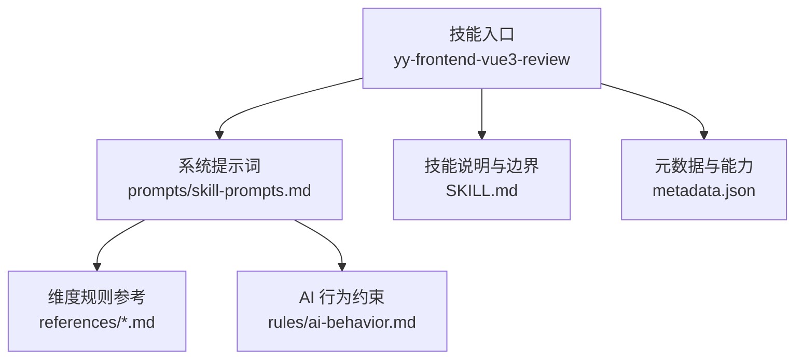
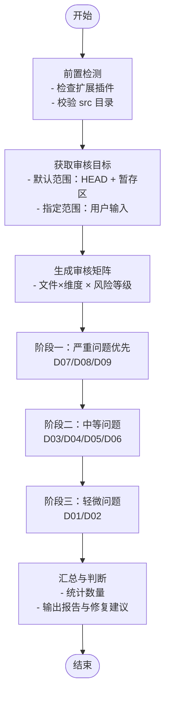
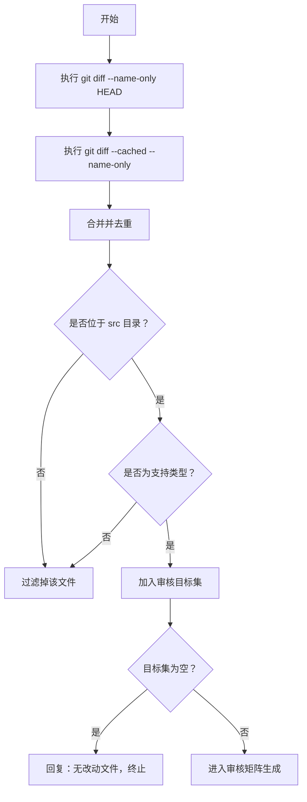
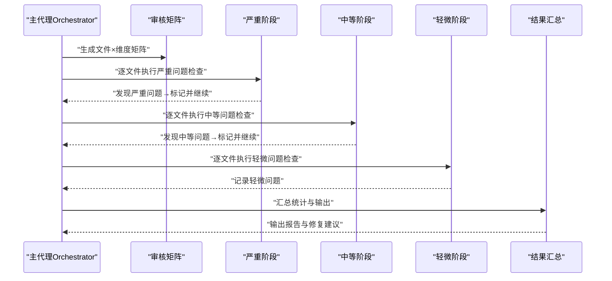
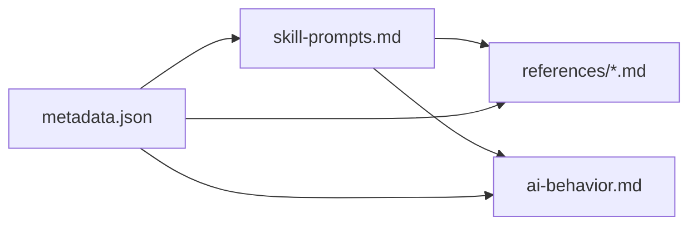

# 审核执行流程

<cite>
**本文引用的文件**
- [SKILL.md](file://skills/yy-frontend-vue3-review/SKILL.md)
- [metadata.json](file://skills/yy-frontend-vue3-review/metadata.json)
- [skill-prompts.md](file://skills/yy-frontend-vue3-review/prompts/skill-prompts.md)
- [ai-behavior.md](file://skills/yy-frontend-vue3-review/rules/ai-behavior.md)
- [code-style.md](file://skills/yy-frontend-vue3-review/references/code-style.md)
</cite>

## 目录
1. [简介](#简介)
2. [项目结构](#项目结构)
3. [核心组件](#核心组件)
4. [架构总览](#架构总览)
5. [详细组件分析](#详细组件分析)
6. [依赖分析](#依赖分析)
7. [性能考虑](#性能考虑)
8. [故障排查指南](#故障排查指南)
9. [结论](#结论)
10. [附录](#附录)

## 简介
本文件面向 Vue3 代码审核技能“yy-frontend-vue3-review”，系统化阐述其“审核执行流程”。重点包括：
- 基于 Git diff 的文件检测机制：默认范围检测（HEAD 与暂存区 cached diff）与指定范围检测的实现原理与边界。
- 文件类型适配策略与审核范围确定方法。
- 审核流程的状态管理与错误处理机制。
- 性能优化与大规模代码库处理策略。

该技能以“分层审核、并行处理、故障隔离”为核心设计原则，确保在严格 src 目录边界内，对改动文件进行多维度、可追溯的代码质量评估。

## 项目结构
围绕“yy-frontend-vue3-review”技能，与审核执行流程直接相关的核心文件如下：
- 技能元数据与能力声明：metadata.json
- 技能说明与边界：SKILL.md
- 系统提示词与审核流程：prompts/skill-prompts.md
- 审核维度与规则参考：references/*.md
- AI 行为与交互约束：rules/ai-behavior.md

图表来源
- [SKILL.md:1-206](file://skills/yy-frontend-vue3-review/SKILL.md#L1-L206)
- [metadata.json:1-42](file://skills/yy-frontend-vue3-review/metadata.json#L1-L42)
- [skill-prompts.md:1-613](file://skills/yy-frontend-vue3-review/prompts/skill-prompts.md#L1-L613)
- [ai-behavior.md:1-29](file://skills/yy-frontend-vue3-review/rules/ai-behavior.md#L1-L29)

章节来源
- [SKILL.md:1-206](file://skills/yy-frontend-vue3-review/SKILL.md#L1-L206)
- [metadata.json:1-42](file://skills/yy-frontend-vue3-review/metadata.json#L1-L42)
- [skill-prompts.md:1-613](file://skills/yy-frontend-vue3-review/prompts/skill-prompts.md#L1-L613)
- [ai-behavior.md:1-29](file://skills/yy-frontend-vue3-review/rules/ai-behavior.md#L1-L29)

## 核心组件
- 前置检测与环境准备
  - 检测项目是否安装扩展插件（用于 .vue 文件的 name 属性审核），决定后续维度检查策略。
  - 校验 src 目录存在性，确保仅在 src 下执行审核。
- Git 变动文件检测
  - 默认范围：合并 HEAD 与暂存区（cached）的改动文件，严格过滤 src 目录下的支持文件类型。
  - 指定范围：用户输入的 src 目录下文件或文件夹，递归收集支持类型。
- 审核矩阵与阶段化执行
  - 按“文件 × 维度”生成审核矩阵，标注风险等级。
  - 分阶段执行：严重（D07/D08/D09）→ 中等（D03/D04/D05/D06）→ 轻微（D01/D02），严重问题即时终止判定。
- 结果汇总与输出
  - 统计各严重程度数量，按文件分组、按严重程度排序输出问题详情与修复建议。
  - 仅轻微问题或无问题时判定为“通过”。

章节来源
- [SKILL.md:14-72](file://skills/yy-frontend-vue3-review/SKILL.md#L14-L72)
- [skill-prompts.md:115-141](file://skills/yy-frontend-vue3-review/prompts/skill-prompts.md#L115-L141)

## 架构总览
下图展示了从“获取审核目标”到“结果汇总”的整体流程，映射至实际提示词与规则文件：

图表来源
- [skill-prompts.md:70-141](file://skills/yy-frontend-vue3-review/prompts/skill-prompts.md#L70-L141)
- [SKILL.md:14-72](file://skills/yy-frontend-vue3-review/SKILL.md#L14-L72)

章节来源
- [skill-prompts.md:70-141](file://skills/yy-frontend-vue3-review/prompts/skill-prompts.md#L70-L141)
- [SKILL.md:14-72](file://skills/yy-frontend-vue3-review/SKILL.md#L14-L72)

## 详细组件分析

### Git 变动文件检测机制
- 默认范围检测
  - 通过 HEAD 与暂存区（cached）的 diff 命令获取改动文件集合，合并去重后，严格过滤仅保留 src 目录下的支持文件类型。
  - 若无匹配文件，回复“当前 src 目录下没有需要审核的改动文件”，并终止。
- 指定范围检测
  - 用户指定 src 目录下的文件或文件夹，递归收集支持的文件类型，形成审核目标集。
- 文件类型适配策略
  - 支持类型：.vue（Vue3 <script setup> SFC）、.js、.jsx、.ts、.tsx、.css、.scss、.less。
  - 不适用场景：非 src 目录、Vue2（Options API 特征）、React 项目等。

图表来源
- [SKILL.md:16-18](file://skills/yy-frontend-vue3-review/SKILL.md#L16-L18)
- [skill-prompts.md:11-13](file://skills/yy-frontend-vue3-review/prompts/skill-prompts.md#L11-L13)

章节来源
- [SKILL.md:16-18](file://skills/yy-frontend-vue3-review/SKILL.md#L16-L18)
- [skill-prompts.md:11-13](file://skills/yy-frontend-vue3-review/prompts/skill-prompts.md#L11-L13)

### 审核矩阵与阶段化执行
- 审核矩阵
  - 按“文件 × 维度”生成任务矩阵，并标注风险等级（严重/中等/轻微）。
- 阶段化执行
  - 严重优先：一旦发现 D07/D08/D09 问题，立即标记并终止该文件的进一步判定，继续完成其他维度检查。
  - 中等次之：若存在 D03/D04/D05/D06 问题，则判定为“不通过”，输出问题详情与修复建议。
  - 轻微收尾：仅 D01/D02 问题不影响通过结论，但仍需列出。
- 结果汇总
  - 统计各严重程度数量，按文件分组、按严重程度排序输出问题详情与修复建议。

图表来源
- [skill-prompts.md:134-141](file://skills/yy-frontend-vue3-review/prompts/skill-prompts.md#L134-L141)

章节来源
- [skill-prompts.md:134-141](file://skills/yy-frontend-vue3-review/prompts/skill-prompts.md#L134-L141)

### 文件类型与审核范围确定
- 文件类型适配
  - .vue：覆盖全部维度（D01-D09）。
  - .js/.jsx/.ts/.tsx：覆盖维度 D01、D03-D06、D07、D09。
  - .css/.scss/.less：覆盖维度 D01、D02。
- 审核范围
  - 严格限定在 src 目录下，禁止审核 src 之外的文件。
  - 对 Vue3 项目，必须使用 <script setup> 组合式 API；检测到 Options API 或 React 导入时拒绝处理。

章节来源
- [SKILL.md:58-64](file://skills/yy-frontend-vue3-review/SKILL.md#L58-L64)
- [ai-behavior.md:7-8](file://skills/yy-frontend-vue3-review/rules/ai-behavior.md#L7-L8)

### 审核维度与规则要点
- D01 代码风格（轻微）：缩进、引号、分号、尾随逗号、行宽、箭头函数、对象括号、导入顺序、Prettier 配置等。
- D02 最佳实践（轻微）：调试代码清理、BEM + scoped、未使用变量、defineExpose、组件拆分、懒加载、KeepAlive、Hooks 规范、函数 try/catch。
- D03 Vue3 组件规范（中等）：<script setup>、name 属性（受扩展插件影响）、Props TS 定义、emit 顺序/生命周期 emit 限制、组件命名、v-slot 动态风格、ref/computed 使用、模块化、禁止 mixins、不要过度封装。
- D04 命名规范（中等）：API 函数、事件函数、变量/方法、常量、Props、组件名、文件名、emit 事件、Hooks、布尔值、TS 类型约束、禁止无意义命名。
- D05 网络请求规范（中等）：前置检查 useRequest、async/await + try/catch/finally、禁止多层 try/catch、禁止连续解构、统一响应模式。
- D06 computed 规范（中等）：纯函数原则、有意义命名、复杂逻辑建议 try/catch 兜底。
- D07 逻辑错误（严重）：空指针、数组越界、逻辑判断、方法内部顺序、ref.value 访问。
- D08 安全漏洞（严重）：v-html XSS 风险、敏感信息硬编码/泄露。
- D09 绝对禁止项（严重）：连续解构、父改子数据、修改 ref/reactive 类型、修改 props、this、Options API、mixins、多层 try/catch、生命周期 emit、无意义命名、v-for 与 v-if 同元素、index 作为 key。

章节来源
- [SKILL.md:36-51](file://skills/yy-frontend-vue3-review/SKILL.md#L36-L51)
- [code-style.md:1-71](file://skills/yy-frontend-vue3-review/references/code-style.md#L1-L71)

### 状态管理与错误处理
- 状态管理
  - 审核过程采用“阶段化”状态机：阶段一（严重）→ 阶段二（中等）→ 阶段三（轻微）→ 汇总。
  - 每个文件的审核状态独立，单文件问题不影响其他文件的审核。
- 错误处理
  - 无匹配文件：回复提示并终止。
  - 非 Vue3/React 项目：拒绝处理并告知用户。
  - 无 src 目录：终止审核并回复目录要求不符。
  - 大型文件：超过 1000 行分段审核，避免一次性处理超大文件。
  - 重复问题：统计总数，提供统一修复方案。
  - 用户要求修复：仅在用户明确要求后才执行代码修复，否则仅保留审核结果。

章节来源
- [SKILL.md:148-161](file://skills/yy-frontend-vue3-review/SKILL.md#L148-L161)

## 依赖分析
- 技能元数据与能力
  - 元数据声明了 Vue 版本、API 风格、支持文件类型与必需目录（src/），为审核范围与类型适配提供依据。
- 系统提示词与规则
  - 提示词定义了完整的审核流程、阶段划分与输出格式，是执行流程的权威来源。
- 规则与参考
  - 各维度规则参考文件细化了检查点与修复建议，支撑具体维度的实现。

图表来源
- [metadata.json:21-40](file://skills/yy-frontend-vue3-review/metadata.json#L21-L40)
- [skill-prompts.md:1-613](file://skills/yy-frontend-vue3-review/prompts/skill-prompts.md#L1-L613)
- [ai-behavior.md:1-29](file://skills/yy-frontend-vue3-review/rules/ai-behavior.md#L1-L29)

章节来源
- [metadata.json:21-40](file://skills/yy-frontend-vue3-review/metadata.json#L21-L40)
- [skill-prompts.md:1-613](file://skills/yy-frontend-vue3-review/prompts/skill-prompts.md#L1-L613)
- [ai-behavior.md:1-29](file://skills/yy-frontend-vue3-review/rules/ai-behavior.md#L1-L29)

## 性能考虑
- 并行审核
  - 多文件可并行审核，提升整体吞吐。
- 故障隔离
  - 单个文件问题不影响其他文件的审核，缩短整体耗时。
- 大文件分段
  - 超过 1000 行的文件分段审核，降低内存压力与单次处理时间。
- 严格边界
  - 仅在 src 目录下扫描，避免无关目录带来的 IO 开销。
- 早期终止
  - 严重问题即时终止判定，减少无效工作量。

章节来源
- [skill-prompts.md:72-79](file://skills/yy-frontend-vue3-review/prompts/skill-prompts.md#L72-L79)
- [SKILL.md:157-158](file://skills/yy-frontend-vue3-review/SKILL.md#L157-L158)

## 故障排查指南
- 无改动文件
  - 现象：提示“当前 src 目录下没有需要审核的改动文件”。
  - 处理：确认 HEAD 与暂存区是否有改动，或检查用户指定范围是否正确。
- 非 Vue3/React 项目
  - 现象：检测到 Options API 或 React 导入时拒绝处理。
  - 处理：使用对应的 Vue2 或 React 审核技能，或迁移至 Vue3 组合式 API。
- 无 src 目录
  - 现象：终止审核并回复目录要求不符。
  - 处理：确认项目根目录包含 src 目录。
- 大型文件导致卡顿
  - 处理：启用分段审核策略，避免一次性处理超大文件。
- 重复问题统计
  - 处理：系统会统计总数并提供统一修复方案，优先修复严重与中等问题。

章节来源
- [SKILL.md:148-161](file://skills/yy-frontend-vue3-review/SKILL.md#L148-L161)

## 结论
“yy-frontend-vue3-review”以严格的 src 目录边界、明确的 Git 变动文件检测与阶段化审核流程为核心，实现了对 Vue3 代码的高质量、高效率审核。通过并行处理、故障隔离与早期终止等策略，能够在大规模代码库中保持稳定与高效。建议在 CI/CD 流水线中集成该技能，结合“默认范围检测”与“指定范围检测”，实现提交前的质量把关与持续改进。

## 附录
- 审核维度与风险分级速览
  - D01-D02：轻微，不影响通过结论。
  - D03-D06：中等，导致不通过。
  - D07-D09：严重，必须修复。
- 输出格式
  - 通过/不通过结论、问题统计、问题详情与修复建议，按文件分组、按严重程度排序输出。

章节来源
- [SKILL.md:52-56](file://skills/yy-frontend-vue3-review/SKILL.md#L52-L56)
- [SKILL.md:91-144](file://skills/yy-frontend-vue3-review/SKILL.md#L91-L144)