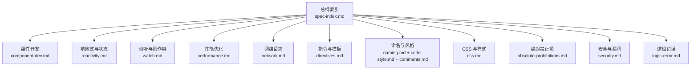
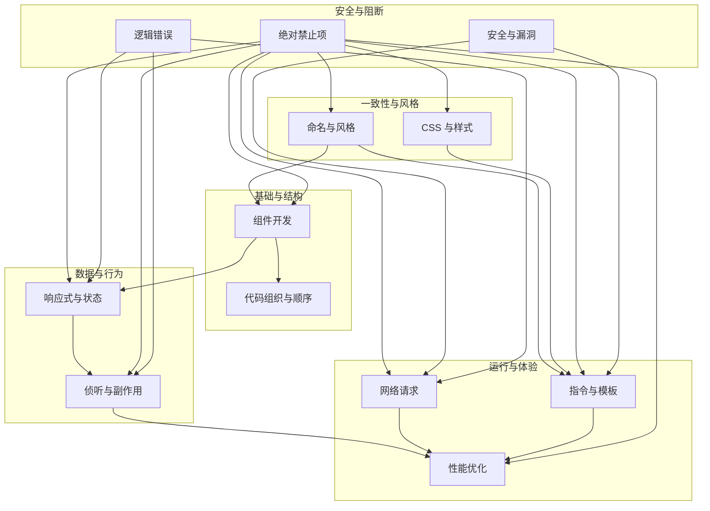
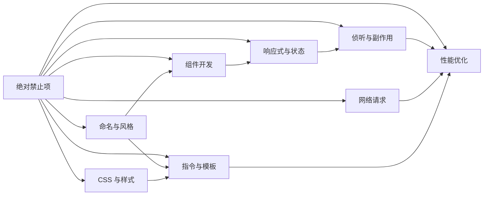

# 审核维度总览

<cite>
**本文引用的文件**
- [spec-index.md](file://skills/yy-frontend-vue3-review/rules/spec-index.md)
- [reactivity.md](file://skills/yy-frontend-vue3-review/rules/reactivity.md)
- [watch.md](file://skills/yy-frontend-vue3-review/rules/watch.md)
- [performance.md](file://skills/yy-frontend-vue3-review/rules/performance.md)
- [network.md](file://skills/yy-frontend-vue3-review/rules/network.md)
- [component-dev.md](file://skills/yy-frontend-vue3-review/rules/component-dev.md)
- [css.md](file://skills/yy-frontend-vue3-review/rules/css.md)
- [directives.md](file://skills/yy-frontend-vue3-review/rules/directives.md)
- [naming.md](file://skills/yy-frontend-vue3-review/rules/naming.md)
- [order.md](file://skills/yy-frontend-vue3-review/rules/order.md)
- [code-style.md](file://skills/yy-frontend-vue3-review/rules/code-style.md)
- [comments.md](file://skills/yy-frontend-vue3-review/rules/comments.md)
- [absolute-prohibitions.md](file://skills/yy-frontend-vue3-review/references/absolute-prohibitions.md)
- [security.md](file://skills/yy-frontend-vue3-review/references/security.md)
- [logic-error.md](file://skills/yy-frontend-vue3-review/references/logic-error.md)
</cite>

## 目录
1. [简介](#简介)
2. [项目结构](#项目结构)
3. [核心组件](#核心组件)
4. [架构总览](#架构总览)
5. [详细组件分析](#详细组件分析)
6. [依赖分析](#依赖分析)
7. [性能考量](#性能考量)
8. [故障排查指南](#故障排查指南)
9. [结论](#结论)
10. [附录](#附录)

## 简介
本文件面向 Vue3 代码审核，系统梳理九个审核维度，给出每个维度的检查重点、严重程度分级与影响范围，并解释维度间的相互关系与协同机制。文档旨在帮助开发者建立统一的审核标准与优先级策略，提升代码质量、安全性与可维护性。

## 项目结构
该仓库围绕“Vue3 前端审核”构建，规则与参考文件集中在 skills/yy-frontend-vue3-review 目录下，形成“总纲索引 + 维度规则 + 参考清单”的结构化体系。总纲索引对九个维度进行归类与优先级划分，各维度规则提供具体检查点与最佳实践，参考清单给出严重问题与风险项的快速定位。

图表来源
- [spec-index.md:1-60](file://skills/yy-frontend-vue3-review/rules/spec-index.md#L1-L60)
- [component-dev.md:1-81](file://skills/yy-frontend-vue3-review/rules/component-dev.md#L1-L81)
- [reactivity.md:1-227](file://skills/yy-frontend-vue3-review/rules/reactivity.md#L1-L227)
- [watch.md:1-154](file://skills/yy-frontend-vue3-review/rules/watch.md#L1-L154)
- [performance.md:1-136](file://skills/yy-frontend-vue3-review/rules/performance.md#L1-L136)
- [network.md:1-363](file://skills/yy-frontend-vue3-review/rules/network.md#L1-L363)
- [directives.md:1-105](file://skills/yy-frontend-vue3-review/rules/directives.md#L1-L105)
- [naming.md:1-85](file://skills/yy-frontend-vue3-review/rules/naming.md#L1-L85)
- [code-style.md:1-61](file://skills/yy-frontend-vue3-review/rules/code-style.md#L1-L61)
- [comments.md:1-83](file://skills/yy-frontend-vue3-review/rules/comments.md#L1-L83)
- [css.md:1-67](file://skills/yy-frontend-vue3-review/rules/css.md#L1-L67)
- [absolute-prohibitions.md:1-23](file://skills/yy-frontend-vue3-review/references/absolute-prohibitions.md#L1-L23)
- [security.md:1-16](file://skills/yy-frontend-vue3-review/references/security.md#L1-L16)
- [logic-error.md:1-37](file://skills/yy-frontend-vue3-review/references/logic-error.md#L1-L37)

章节来源
- [spec-index.md:1-60](file://skills/yy-frontend-vue3-review/rules/spec-index.md#L1-L60)

## 核心组件
本节对九个审核维度进行总览式说明，明确检查重点、严重程度与影响范围，并给出维度间的关系与协同要点。

- 组件开发（Essential）
  - 检查重点：必须使用 script setup、禁止 Options API、禁止在 script setup 中使用 this、Props/Emit/Expose 规范、脚本内部结构顺序、模板属性顺序、插槽风格、方法职责、页面拆分建议。
  - 严重程度：🔴 严重（违反即阻断开发流程）
  - 影响范围：组件结构、交互契约、可读性、可维护性
  - 关联维度：响应式与状态、指令与模板、命名与风格

- 响应式与状态（Essential）
  - 检查重点：ref/reactive/computed 选择原则、reactive 转 ref 规则、computed 纯同步 getter、Hooks 返回 toRefs、访问方式（.value）、批量更新与解构响应式。
  - 严重程度：🔴 严重（错误的响应式会导致运行时异常与性能问题）
  - 影响范围：运行时稳定性、性能、类型安全
  - 关联维度：侦听与副作用、性能优化、网络请求

- 侦听与副作用（Essential）
  - 检查重点：watch/watchEffect 使用规范、深度监听、立即执行、清理资源（定时器/事件）、与 computed 的选择策略。
  - 严重程度：🔴 严重（资源泄漏与副作用滥用）
  - 影响范围：内存泄漏、性能退化、行为不可控
  - 关联维度：响应式与状态、性能优化、网络请求

- 性能优化（Essential）
  - 检查重点：组件懒加载、KeepAlive 缓存、虚拟滚动、防抖节流、图片优化、模板层轻量化、响应式性能、自定义指令清理、路由守卫清理。
  - 严重程度：🟡 高（影响用户体验与资源占用）
  - 影响范围：首屏速度、滚动性能、内存占用、CPU 占用
  - 关联维度：组件开发、指令与模板、网络请求

- 网络请求（Essential）
  - 检查重点：前置检查 useRequest、async/await、响应解构、错误处理、防重复提交、安全规范（DOMPurify、敏感信息、全局错误捕获）。
  - 严重程度：🔴 严重（错误的网络处理易引发崩溃与安全问题）
  - 影响范围：稳定性、安全性、用户体验
  - 关联维度：响应式与状态、侦听与副作用、性能优化

- 指令与模板（Essential）
  - 检查重点：v-for 与 key、v-if 与 v-for 冲突、v-html 安全、指令简写、模板属性顺序、v-model 写法。
  - 严重程度：🔴 严重（模板错误导致渲染异常与安全风险）
  - 影响范围：渲染正确性、可访问性、安全
  - 关联维度：组件开发、性能优化、CSS 与样式

- 命名与风格（Strongly Recommended）
  - 检查重点：文件与组件命名、函数命名、变量与常量、Hooks 命名、TypeScript 类型命名、BEM 命名、Prettier 配置、注释规范、模板属性顺序、导入顺序。
  - 严重程度：🟢 低（影响一致性与可读性）
  - 影响范围：可读性、协作效率、长期维护成本
  - 关联维度：组件开发、指令与模板、CSS 与样式

- CSS 与样式（Recommended）
  - 检查重点：预处理器与格式化、作用域、BEM 命名、布局推荐、兼容性指南、自定义指令清理。
  - 严重程度：🟢 低（影响视觉与兼容性）
  - 影响范围：视觉一致性、跨浏览器表现
  - 关联维度：指令与模板、命名与风格、性能优化

- 绝对禁止项（绝对阻断）
  - 检查重点：连续解构、修改子组件数据、修改 ref/reactive 类型、直接修改 props、使用 this、Options API、mixin、多层 try/catch、生命周期 emit、无意义命名、v-for 与 v-if 同元素、index 作为 key。
  - 严重程度：🔴 严重（直接阻断评审）
  - 影响范围：稳定性、安全性、可维护性
  - 关联维度：全部维度（直接影响）

章节来源
- [spec-index.md:9-60](file://skills/yy-frontend-vue3-review/rules/spec-index.md#L9-L60)
- [absolute-prohibitions.md:7-23](file://skills/yy-frontend-vue3-review/references/absolute-prohibitions.md#L7-L23)

## 架构总览
下图展示九个审核维度在 Vue3 审核中的整体关系与协同机制。组件开发是基础骨架，响应式与状态、侦听与副作用构成行为与数据流，性能优化贯穿模板与网络层，网络请求与指令模板保障正确性与安全，命名与风格、CSS 与样式提升一致性与兼容性，绝对禁止项作为“红线”贯穿所有维度。

图表来源
- [component-dev.md:1-81](file://skills/yy-frontend-vue3-review/rules/component-dev.md#L1-L81)
- [reactivity.md:1-227](file://skills/yy-frontend-vue3-review/rules/reactivity.md#L1-L227)
- [watch.md:1-154](file://skills/yy-frontend-vue3-review/rules/watch.md#L1-L154)
- [performance.md:1-136](file://skills/yy-frontend-vue3-review/rules/performance.md#L1-L136)
- [network.md:1-363](file://skills/yy-frontend-vue3-review/rules/network.md#L1-L363)
- [directives.md:1-105](file://skills/yy-frontend-vue3-review/rules/directives.md#L1-L105)
- [naming.md:1-85](file://skills/yy-frontend-vue3-review/rules/naming.md#L1-L85)
- [css.md:1-67](file://skills/yy-frontend-vue3-review/rules/css.md#L1-L67)
- [absolute-prohibitions.md:1-23](file://skills/yy-frontend-vue3-review/references/absolute-prohibitions.md#L1-L23)
- [security.md:1-16](file://skills/yy-frontend-vue3-review/references/security.md#L1-L16)
- [logic-error.md:1-37](file://skills/yy-frontend-vue3-review/references/logic-error.md#L1-L37)

## 详细组件分析

### 维度一：组件开发（Essential）
- 检查要点
  - 必须使用 script setup，禁止 Options API 与 this
  - Props/Emit/Expose 明确、顺序规范
  - 脚本内部结构：imports → defineProps/defineEmits → Hooks → 业务逻辑（ref/reactive/computed/methods/watch/lifecycle）→ defineExpose
  - 模板属性顺序与插槽风格
  - 方法职责单一、页面拆分建议
- 严重程度与影响
  - 违反即阻断开发流程，影响交互契约与可维护性
- 关联与协同
  - 与响应式、指令、命名共同决定组件可读性与一致性

章节来源
- [component-dev.md:7-81](file://skills/yy-frontend-vue3-review/rules/component-dev.md#L7-L81)
- [order.md:15-141](file://skills/yy-frontend-vue3-review/rules/order.md#L15-L141)

### 维度二：响应式与状态（Essential）
- 检查要点
  - 优先使用 ref，尽量少用 reactive；reactive 转 ref 的场景与示例
  - computed 用于同步派生逻辑，禁止异步与副作用
  - Hooks 返回 toRefs，避免直接返回 reactive
  - 访问方式与类型推断差异、批量更新影响
- 严重程度与影响
  - 错误的响应式会导致运行时异常、性能问题与类型不一致
- 关联与协同
  - 与侦听、网络、性能密切相关

章节来源
- [reactivity.md:7-227](file://skills/yy-frontend-vue3-review/rules/reactivity.md#L7-L227)

### 维度三：侦听与副作用（Essential）
- 检查要点
  - watch/watchEffect 使用规范、深度监听、立即执行、刷新时机
  - 清理资源：定时器、事件监听、自定义指令 unmounted、路由守卫
  - 与 computed 的选择策略：优先使用 computed 替代派生逻辑
- 严重程度与影响
  - 资源泄漏与副作用滥用导致内存与性能问题
- 关联与协同
  - 与响应式、网络、性能协同

章节来源
- [watch.md:1-154](file://skills/yy-frontend-vue3-review/rules/watch.md#L1-L154)

### 维度四：性能优化（Essential）
- 检查要点
  - 组件懒加载、KeepAlive 缓存、虚拟滚动、防抖节流、图片优化
  - 模板层轻量化、响应式性能、自定义指令清理、路由守卫清理
- 严重程度与影响
  - 高影响用户体验与资源占用
- 关联与协同
  - 与组件开发、指令、网络协同

章节来源
- [performance.md:1-136](file://skills/yy-frontend-vue3-review/rules/performance.md#L1-L136)

### 维度五：网络请求（Essential）
- 检查要点
  - useRequest 前置检查、async/await、响应解构、错误处理、防重复提交
  - 安全规范：DOMPurify、敏感信息、全局错误捕获
- 严重程度与影响
  - 错误的网络处理易引发崩溃与安全问题
- 关联与协同
  - 与响应式、侦听、性能协同

章节来源
- [network.md:5-363](file://skills/yy-frontend-vue3-review/rules/network.md#L5-L363)

### 维度六：指令与模板（Essential）
- 检查要点
  - v-for 与 key（唯一 ID）、v-if 与 v-for 冲突、v-html 安全（DOMPurify）
  - 指令简写、模板属性顺序、v-model 写法
- 严重程度与影响
  - 模板错误导致渲染异常与安全风险
- 关联与协同
  - 与组件开发、性能、CSS 协同

章节来源
- [directives.md:7-105](file://skills/yy-frontend-vue3-review/rules/directives.md#L7-L105)

### 维度七：命名与风格（Strongly Recommended）
- 检查要点
  - 文件与组件命名、函数命名、变量与常量、Hooks 命名、TypeScript 类型命名、BEM 命名
  - Prettier 配置、注释规范、模板属性顺序、导入顺序
- 严重程度与影响
  - 影响一致性与可读性
- 关联与协同
  - 与组件开发、指令、CSS 协同

章节来源
- [naming.md:1-85](file://skills/yy-frontend-vue3-review/rules/naming.md#L1-L85)
- [code-style.md:1-61](file://skills/yy-frontend-vue3-review/rules/code-style.md#L1-L61)
- [comments.md:1-83](file://skills/yy-frontend-vue3-review/rules/comments.md#L1-L83)
- [order.md:92-141](file://skills/yy-frontend-vue3-review/rules/order.md#L92-L141)

### 维度八：CSS 与样式（Recommended）
- 检查要点
  - 预处理器与格式化、作用域、BEM 命名、布局推荐、兼容性指南、自定义指令清理
- 严重程度与影响
  - 影响视觉一致性与跨浏览器表现
- 关联与协同
  - 与指令、命名、性能协同

章节来源
- [css.md:1-67](file://skills/yy-frontend-vue3-review/rules/css.md#L1-L67)

### 维度九：绝对禁止项（绝对阻断）
- 检查要点
  - 连续解构、修改子组件数据、修改 ref/reactive 类型、直接修改 props、使用 this、Options API、mixin、多层 try/catch、生命周期 emit、无意义命名、v-for 与 v-if 同元素、index 作为 key
- 严重程度与影响
  - 直接阻断评审
- 关联与协同
  - 影响全部维度

章节来源
- [absolute-prohibitions.md:7-23](file://skills/yy-frontend-vue3-review/references/absolute-prohibitions.md#L7-L23)

## 依赖分析
- 维度耦合关系
  - 组件开发是基础骨架，决定 Props/Emit/Expose 与脚本结构顺序
  - 响应式与状态决定数据流与派生逻辑，与侦听协同
  - 侦听与副作用决定副作用与资源清理，与性能协同
  - 指令与模板决定渲染正确性与安全，与 CSS 协同
  - 网络请求决定数据获取与错误处理，与性能协同
  - 命名与风格、CSS 与样式提升一致性与兼容性
  - 绝对禁止项作为“红线”，贯穿所有维度
- 冲突与风险
  - 违反绝对禁止项将阻断后续审核
  - 响应式与侦听不当将引发性能与稳定性问题
  - 模板与网络处理不当将引发安全与渲染问题

图表来源
- [absolute-prohibitions.md:1-23](file://skills/yy-frontend-vue3-review/references/absolute-prohibitions.md#L1-L23)
- [component-dev.md:1-81](file://skills/yy-frontend-vue3-review/rules/component-dev.md#L1-L81)
- [reactivity.md:1-227](file://skills/yy-frontend-vue3-review/rules/reactivity.md#L1-L227)
- [watch.md:1-154](file://skills/yy-frontend-vue3-review/rules/watch.md#L1-L154)
- [performance.md:1-136](file://skills/yy-frontend-vue3-review/rules/performance.md#L1-L136)
- [network.md:1-363](file://skills/yy-frontend-vue3-review/rules/network.md#L1-L363)
- [directives.md:1-105](file://skills/yy-frontend-vue3-review/rules/directives.md#L1-L105)
- [naming.md:1-85](file://skills/yy-frontend-vue3-review/rules/naming.md#L1-L85)
- [css.md:1-67](file://skills/yy-frontend-vue3-review/rules/css.md#L1-L67)

## 性能考量
- 性能优先级
  - 首屏与交互流畅度优先，其次滚动与长列表性能，最后资源占用与 CPU 占用
- 优化策略
  - 组件懒加载、KeepAlive 缓存、虚拟滚动、防抖节流、图片优化、模板层轻量化
- 风险控制
  - 避免在 watch 中执行同步 DOM 操作，谨慎使用深度监听，及时清理资源

章节来源
- [performance.md:7-136](file://skills/yy-frontend-vue3-review/rules/performance.md#L7-L136)

## 故障排查指南
- 常见问题定位
  - 绝对禁止项：直接阻断评审，优先处理
  - 安全漏洞：XSS 风险、敏感信息泄露
  - 逻辑错误：空指针、数组越界、逻辑判断错误、ref 访问缺失
- 处理流程
  - 发现问题 → 明确严重程度 → 评估影响范围 → 优先级排序 → 修复与验证 → 复审

章节来源
- [absolute-prohibitions.md:1-23](file://skills/yy-frontend-vue3-review/references/absolute-prohibitions.md#L1-L23)
- [security.md:1-16](file://skills/yy-frontend-vue3-review/references/security.md#L1-L16)
- [logic-error.md:1-37](file://skills/yy-frontend-vue3-review/references/logic-error.md#L1-L37)

## 结论
本审核体系以“总纲索引”为纲，九个维度形成从结构到行为、从性能到安全的闭环。通过“绝对禁止项”守住底线，结合“严重/高/低”分级与影响范围评估，实现优先级与权重的合理分配。建议在实际评审中：
- 优先处理绝对禁止项与严重问题
- 按维度权重分配时间：组件开发、响应式与状态、侦听与副作用、网络请求、性能优化占比更高
- 以“最小修复面”为目标，强调可追溯与可验证的变更

## 附录
- 维度权重与优先级建议（示例）
  - 组件开发：20%
  - 响应式与状态：18%
  - 侦听与副作用：15%
  - 性能优化：15%
  - 网络请求：12%
  - 指令与模板：8%
  - 命名与风格：1%
  - CSS 与样式：1%
  - 绝对禁止项：100%（阻断）
- 风险评估方法（示例）
  - 影响范围：用户可见性、稳定性、安全性
  - 修复难度：低/中/高
  - 评分模型：严重程度 × 影响范围 × 修复难度
  - 优先级：A（立即修复）、B（尽快修复）、C（可延后）