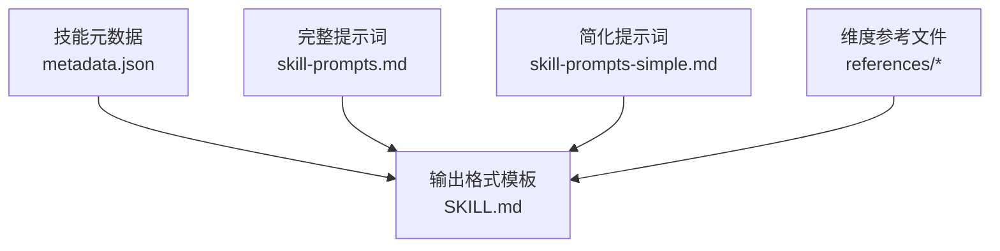
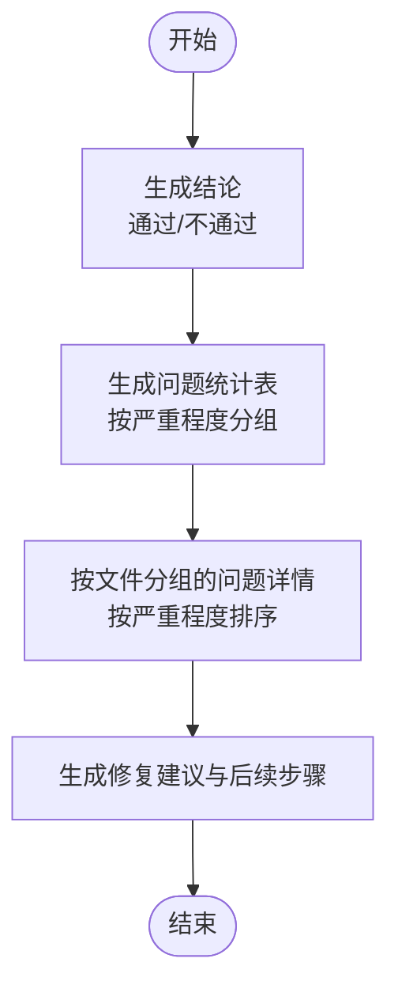
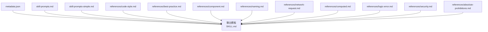

# 输出格式规范

<cite>
**本文引用的文件**
- [SKILL.md](file://skills/yy-frontend-vue3-review/SKILL.md)
- [skill-prompts.md](file://skills/yy-frontend-vue3-review/prompts/skill-prompts.md)
- [skill-prompts-simple.md](file://skills/yy-frontend-vue3-review/prompts/skill-prompts-simple.md)
- [metadata.json](file://skills/yy-frontend-vue3-review/metadata.json)
- [code-style.md](file://skills/yy-frontend-vue3-review/references/code-style.md)
- [best-practice.md](file://skills/yy-frontend-vue3-review/references/best-practice.md)
- [component.md](file://skills/yy-frontend-vue3-review/references/component.md)
- [naming.md](file://skills/yy-frontend-vue3-review/references/naming.md)
- [network-request.md](file://skills/yy-frontend-vue3-review/references/network-request.md)
- [computed.md](file://skills/yy-frontend-vue3-review/references/computed.md)
- [logic-error.md](file://skills/yy-frontend-vue3-review/references/logic-error.md)
- [security.md](file://skills/yy-frontend-vue3-review/references/security.md)
- [absolute-prohibitions.md](file://skills/yy-frontend-vue3-review/references/absolute-prohibitions.md)
</cite>

## 目录
1. [简介](#简介)
2. [项目结构](#项目结构)
3. [核心组件](#核心组件)
4. [架构概览](#架构概览)
5. [详细组件分析](#详细组件分析)
6. [依赖分析](#依赖分析)
7. [性能考虑](#性能考虑)
8. [故障排查指南](#故障排查指南)
9. [结论](#结论)
10. [附录](#附录)

## 简介
本规范文档面向 Vue3 代码审核技能的输出格式，系统化定义“通过”和“不通过”两类结果的完整结构、字段定义与呈现方式，明确问题统计表格、问题详情列表、修复建议等输出组件的格式要求，并提供 Markdown 标准模板与示例，帮助提升输出的可读性与自动化处理能力。

## 项目结构
- 输出格式由技能元数据与提示词共同决定，核心输出模板来自技能文档与提示词文件。
- 参考文件（references/*）提供各维度规则细节，支撑输出内容的准确性与一致性。

图表来源
- [metadata.json:1-42](file://skills/yy-frontend-vue3-review/metadata.json#L1-L42)
- [SKILL.md:91-145](file://skills/yy-frontend-vue3-review/SKILL.md#L91-L145)
- [skill-prompts.md:483-552](file://skills/yy-frontend-vue3-review/prompts/skill-prompts.md#L483-L552)
- [skill-prompts-simple.md:445-514](file://skills/yy-frontend-vue3-review/prompts/skill-prompts-simple.md#L445-L514)

章节来源
- [metadata.json:1-42](file://skills/yy-frontend-vue3-review/metadata.json#L1-L42)
- [SKILL.md:91-145](file://skills/yy-frontend-vue3-review/SKILL.md#L91-L145)
- [skill-prompts.md:483-552](file://skills/yy-frontend-vue3-review/prompts/skill-prompts.md#L483-L552)
- [skill-prompts-simple.md:445-514](file://skills/yy-frontend-vue3-review/prompts/skill-prompts-simple.md#L445-L514)

## 核心组件
- 审核结果标题与结论
  - 通过：使用“✅ 通过”
  - 不通过：使用“❌ 不通过”
- 问题统计表格
  - 列：严重程度（🔴 严重、🟡 中等、🟢 轻微）
  - 行：数量（整数）
- 问题详情列表
  - 分组：按文件路径分组
  - 严重程度分层：先“🔴 严重”，再“🟡 中等”，最后“🟢 轻微”
  - 每条问题包含：
    - 问题类型（简述）
    - 位置（文件路径:行号）
    - 描述（影响与后果）
    - 代码片段（代码围栏）
    - 修复建议（具体可执行）
- 修复建议
  - 明确优先级：优先修复“严重”和“中等”问题
  - 提示重新审核

章节来源
- [SKILL.md:95-144](file://skills/yy-frontend-vue3-review/SKILL.md#L95-L144)
- [skill-prompts.md:487-549](file://skills/yy-frontend-vue3-review/prompts/skill-prompts.md#L487-L549)
- [skill-prompts-simple.md:462-511](file://skills/yy-frontend-vue3-review/prompts/skill-prompts-simple.md#L462-L511)

## 架构概览
输出格式遵循“结论 → 统计 → 详情 → 建议”的线性结构，确保从宏观到微观的信息流清晰、可检索。

图表来源
- [SKILL.md:95-144](file://skills/yy-frontend-vue3-review/SKILL.md#L95-L144)
- [skill-prompts.md:487-549](file://skills/yy-frontend-vue3-review/prompts/skill-prompts.md#L487-L549)
- [skill-prompts-simple.md:462-511](file://skills/yy-frontend-vue3-review/prompts/skill-prompts-simple.md#L462-L511)

## 详细组件分析

### 通过（无问题或仅轻微）
- 结论标题：使用“✅ 通过”
- 问题统计：仅显示“🟢 轻微”数量，其余为 0
- 文本说明：总结“所有文件符合 Vue3 前端开发规范，审核通过”

章节来源
- [SKILL.md:95-107](file://skills/yy-frontend-vue3-review/SKILL.md#L95-L107)
- [skill-prompts.md:498-512](file://skills/yy-frontend-vue3-review/prompts/skill-prompts.md#L498-L512)
- [skill-prompts-simple.md:460-474](file://skills/yy-frontend-vue3-review/prompts/skill-prompts-simple.md#L460-L474)

### 不通过（存在中等问题或严重问题）
- 结论标题：使用“❌ 不通过”
- 问题统计：显示“🔴 严重”、“🟡 中等”、“🟢 轻微”的数量
- 问题详情
  - 分组：按文件路径分组
  - 严重程度分层：先“🔴 严重”，再“🟡 中等”，最后“🟢 轻微”
  - 每条问题字段：
    - 问题类型（简述）
    - 位置（文件路径:行号）
    - 描述（影响与后果）
    - 代码片段（代码围栏）
    - 修复建议（具体可执行）
- 修复建议：提示优先修复“严重”和“中等”问题，修复后可再次发起审核

章节来源
- [SKILL.md:109-144](file://skills/yy-frontend-vue3-review/SKILL.md#L109-L144)
- [skill-prompts.md:514-549](file://skills/yy-frontend-vue3-review/prompts/skill-prompts.md#L514-L549)
- [skill-prompts-simple.md:476-511](file://skills/yy-frontend-vue3-review/prompts/skill-prompts-simple.md#L476-L511)

### 问题统计表格
- 表头：严重程度、数量
- 行：分别对应“🔴 严重”、“🟡 中等”、“🟢 轻微”
- 值：整数计数

章节来源
- [SKILL.md:98-121](file://skills/yy-frontend-vue3-review/SKILL.md#L98-L121)
- [skill-prompts.md:519-526](file://skills/yy-frontend-vue3-review/prompts/skill-prompts.md#L519-L526)
- [skill-prompts-simple.md:481-488](file://skills/yy-frontend-vue3-review/prompts/skill-prompts-simple.md#L481-L488)

### 问题详情列表
- 分组：文件路径
- 严重程度分层：先“🔴 严重”，再“🟡 中等”，最后“🟢 轻微”
- 每条问题字段：
  - 问题类型（简述）
  - 位置（文件路径:行号）
  - 描述（影响与后果）
  - 代码片段（代码围栏）
  - 修复建议（具体可执行）

章节来源
- [SKILL.md:122-144](file://skills/yy-frontend-vue3-review/SKILL.md#L122-L144)
- [skill-prompts.md:527-549](file://skills/yy-frontend-vue3-review/prompts/skill-prompts.md#L527-L549)
- [skill-prompts-simple.md:489-511](file://skills/yy-frontend-vue3-review/prompts/skill-prompts-simple.md#L489-L511)

### 修复建议
- 优先级：优先修复“严重”和“中等”问题
- 后续：修复完成后可再次发起审核

章节来源
- [SKILL.md:141-144](file://skills/yy-frontend-vue3-review/SKILL.md#L141-L144)
- [skill-prompts.md:546-549](file://skills/yy-frontend-vue3-review/prompts/skill-prompts.md#L546-L549)
- [skill-prompts-simple.md:508-511](file://skills/yy-frontend-vue3-review/prompts/skill-prompts-simple.md#L508-L511)

## 依赖分析
输出格式与以下文件强相关：
- SKILL.md：提供最终输出模板与示例
- skill-prompts.md / skill-prompts-simple.md：提供输出结构与字段定义
- metadata.json：提供技能元信息，辅助自动化处理
- references/*：提供各维度规则细节，支撑输出内容的准确性

图表来源
- [metadata.json:1-42](file://skills/yy-frontend-vue3-review/metadata.json#L1-L42)
- [SKILL.md:91-145](file://skills/yy-frontend-vue3-review/SKILL.md#L91-L145)
- [skill-prompts.md:483-552](file://skills/yy-frontend-vue3-review/prompts/skill-prompts.md#L483-L552)
- [skill-prompts-simple.md:445-514](file://skills/yy-frontend-vue3-review/prompts/skill-prompts-simple.md#L445-L514)
- [code-style.md:1-71](file://skills/yy-frontend-vue3-review/references/code-style.md#L1-L71)
- [best-practice.md:1-123](file://skills/yy-frontend-vue3-review/references/best-practice.md#L1-L123)
- [component.md:1-105](file://skills/yy-frontend-vue3-review/references/component.md#L1-L105)
- [naming.md:1-33](file://skills/yy-frontend-vue3-review/references/naming.md#L1-L33)
- [network-request.md:1-39](file://skills/yy-frontend-vue3-review/references/network-request.md#L1-L39)
- [computed.md:1-22](file://skills/yy-frontend-vue3-review/references/computed.md#L1-L22)
- [logic-error.md:1-37](file://skills/yy-frontend-vue3-review/references/logic-error.md#L1-L37)
- [security.md:1-16](file://skills/yy-frontend-vue3-review/references/security.md#L1-L16)
- [absolute-prohibitions.md:1-23](file://skills/yy-frontend-vue3-review/references/absolute-prohibitions.md#L1-L23)

章节来源
- [metadata.json:1-42](file://skills/yy-frontend-vue3-review/metadata.json#L1-L42)
- [SKILL.md:91-145](file://skills/yy-frontend-vue3-review/SKILL.md#L91-L145)
- [skill-prompts.md:483-552](file://skills/yy-frontend-vue3-review/prompts/skill-prompts.md#L483-L552)
- [skill-prompts-simple.md:445-514](file://skills/yy-frontend-vue3-review/prompts/skill-prompts-simple.md#L445-L514)
- [code-style.md:1-71](file://skills/yy-frontend-vue3-review/references/code-style.md#L1-L71)
- [best-practice.md:1-123](file://skills/yy-frontend-vue3-review/references/best-practice.md#L1-L123)
- [component.md:1-105](file://skills/yy-frontend-vue3-review/references/component.md#L1-L105)
- [naming.md:1-33](file://skills/yy-frontend-vue3-review/references/naming.md#L1-L33)
- [network-request.md:1-39](file://skills/yy-frontend-vue3-review/references/network-request.md#L1-L39)
- [computed.md:1-22](file://skills/yy-frontend-vue3-review/references/computed.md#L1-L22)
- [logic-error.md:1-37](file://skills/yy-frontend-vue3-review/references/logic-error.md#L1-L37)
- [security.md:1-16](file://skills/yy-frontend-vue3-review/references/security.md#L1-L16)
- [absolute-prohibitions.md:1-23](file://skills/yy-frontend-vue3-review/references/absolute-prohibitions.md#L1-L23)

## 性能考虑
- 输出生成应避免重复计算统计，可在审核阶段同步维护计数器，减少二次遍历
- 问题详情按文件分组时，建议在审核阶段就建立映射，降低输出阶段的排序与分组成本
- 代码片段截取应控制长度，避免超长文本影响渲染与传输效率

## 故障排查指南
- 未出现“严重”或“中等”问题但仍显示“不通过”：检查统计逻辑是否误将“轻微”计入“中等/严重”
- 问题详情缺失：确认输出阶段是否按文件路径进行分组，以及是否按严重程度排序
- 修复建议缺失：确认输出阶段是否包含“优先修复严重和中等问题”的提示
- 自动化处理困难：建议在输出中固定字段顺序与层级，便于解析工具提取关键信息

## 结论
本规范明确了 Vue3 代码审核输出的结构与字段，确保“通过/不通过”两类结果的一致性与可读性。通过标准化的问题统计、问题详情与修复建议，可显著提升人工审阅效率与自动化处理能力。

## 附录

### 标准模板与示例（Markdown）
- 通过（无问题或仅轻微）
  - 标题：使用“✅ 通过”
  - 问题统计：仅显示“🟢 轻微”数量
  - 文本说明：总结“所有文件符合 Vue3 前端开发规范，审核通过”
- 不通过（存在中等问题或严重问题）
  - 标题：使用“❌ 不通过”
  - 问题统计：显示“🔴 严重”、“🟡 中等”、“🟢 轻微”的数量
  - 问题详情：按文件路径分组，按严重程度排序，每条问题包含问题类型、位置、描述、代码片段、修复建议
  - 修复建议：提示优先修复“严重”和“中等”问题，修复后可再次发起审核

章节来源
- [SKILL.md:95-144](file://skills/yy-frontend-vue3-review/SKILL.md#L95-L144)
- [skill-prompts.md:487-549](file://skills/yy-frontend-vue3-review/prompts/skill-prompts.md#L487-L549)
- [skill-prompts-simple.md:462-511](file://skills/yy-frontend-vue3-review/prompts/skill-prompts-simple.md#L462-L511)