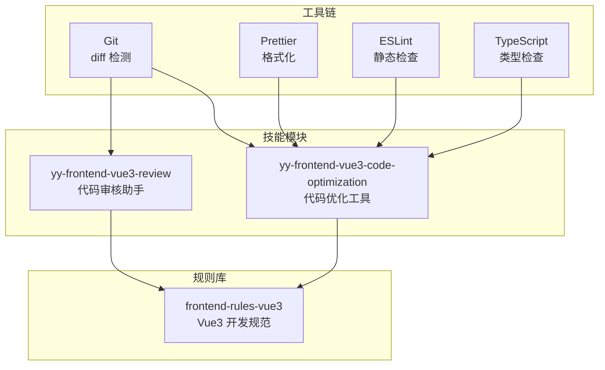
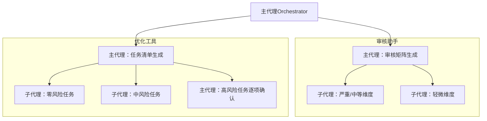
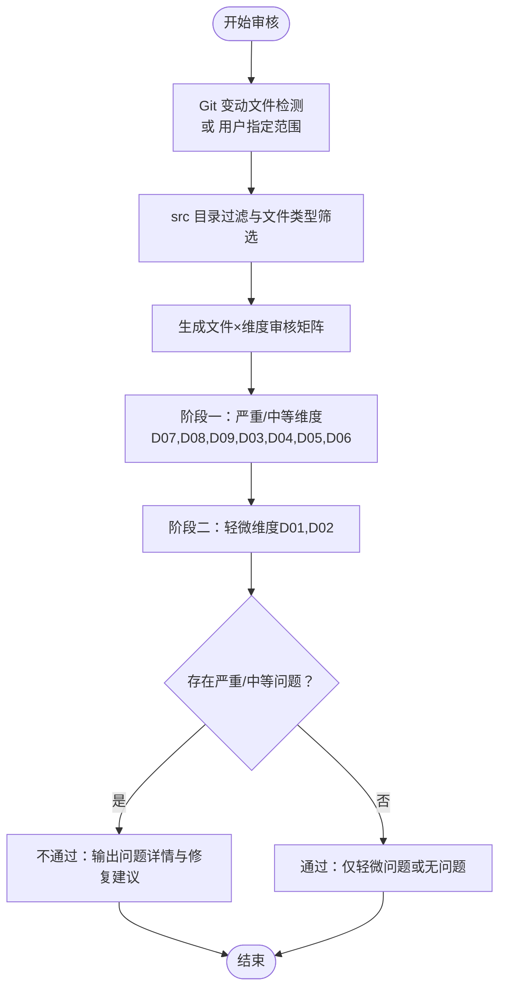
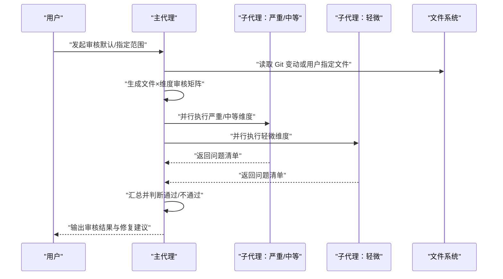
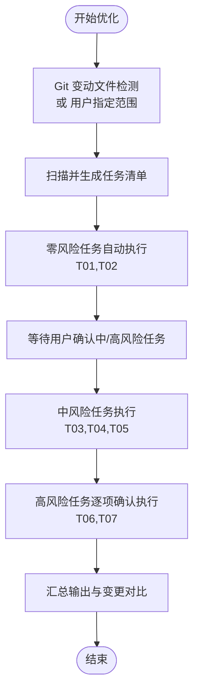
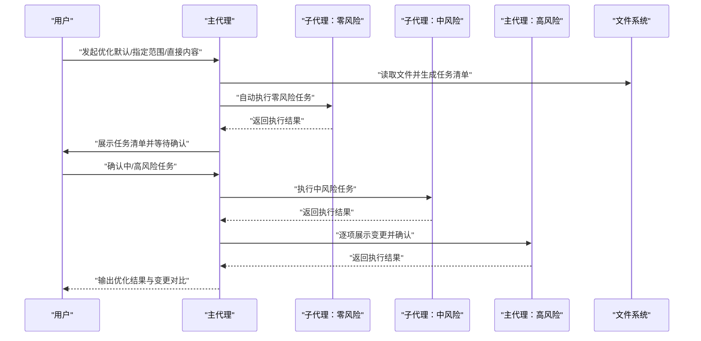
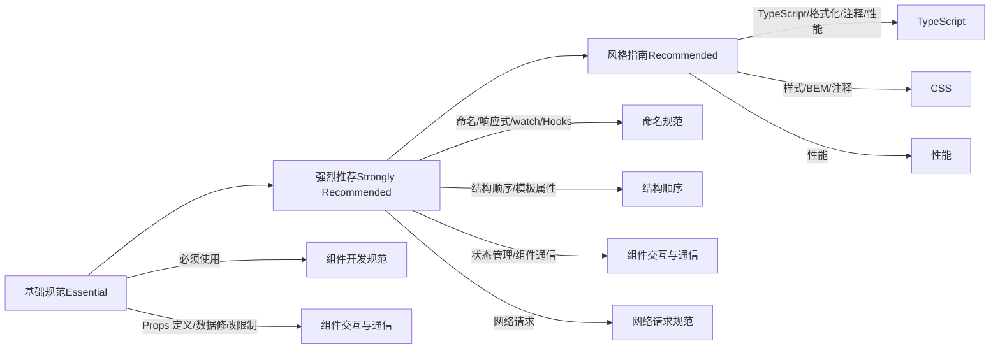
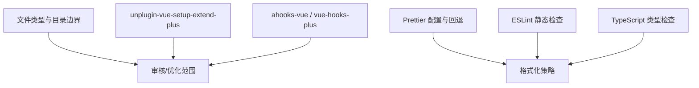

# Vue3 开发支持

<cite>
**本文引用的文件**
- [metadata.json](file://skills/yy-frontend-vue3-review/metadata.json)
- [SKILL.md](file://skills/yy-frontend-vue3-review/SKILL.md)
- [skill-prompts.md](file://skills/yy-frontend-vue3-review/prompts/skill-prompts.md)
- [RULE.md](file://rules/frontend-rules-vue3/RULE.md)
- [metadata.json](file://rules/frontend-rules-vue3/metadata.json)
- [spec-index.md](file://rules/frontend-rules-vue3/references/spec-index.md)
- [component-dev.md](file://rules/frontend-rules-vue3/references/component-dev.md)
- [interaction.md](file://rules/frontend-rules-vue3/references/interaction.md)
- [best-practice.md](file://skills/yy-frontend-vue3-review/references/best-practice.md)
- [component.md](file://skills/yy-frontend-vue3-review/references/component.md)
- [computed.md](file://skills/yy-frontend-vue3-review/references/computed.md)
- [absolute-prohibitions.md](file://skills/yy-frontend-vue3-review/references/absolute-prohibitions.md)
- [metadata.json](file://skills/yy-frontend-vue3-code-optimization/metadata.json)
- [SKILL.md](file://skills/yy-frontend-vue3-code-optimization/SKILL.md)
- [skill-prompts.md](file://skills/yy-frontend-vue3-code-optimization/prompts/skill-prompts.md)
</cite>

## 目录
1. [简介](#简介)
2. [项目结构](#项目结构)
3. [核心组件](#核心组件)
4. [架构总览](#架构总览)
5. [详细组件分析](#详细组件分析)
6. [依赖分析](#依赖分析)
7. [性能考量](#性能考量)
8. [故障排查指南](#故障排查指南)
9. [结论](#结论)
10. [附录](#附录)

## 简介
本技术文档围绕 Vue3 前端开发支持模块，系统阐述“代码审核助手”与“代码优化工具”的工作原理、实现机制与最佳实践。重点包括：
- 基于 Git diff 的文件检测与范围限定
- 多维度审核规则（代码风格、最佳实践、组件规范、命名规范、网络请求、computed 规范、逻辑错误、安全漏洞、绝对禁止项）
- 问题报告生成与风险分级
- 与 TypeScript、ESLint、Prettier 等工具链的集成方法
- 开发规范指南与实战案例

## 项目结构
本仓库包含两套核心能力：
- 代码审核助手：yy-frontend-vue3-review
- 代码优化工具：yy-frontend-vue3-code-optimization
- 规范规则库：rules/frontend-rules-vue3

图表来源
- [SKILL.md:14-33](file://skills/yy-frontend-vue3-review/SKILL.md#L14-L33)
- [SKILL.md:27-45](file://skills/yy-frontend-vue3-code-optimization/SKILL.md#L27-L45)
- [RULE.md:18-22](file://rules/frontend-rules-vue3/RULE.md#L18-L22)

章节来源
- [metadata.json:1-42](file://skills/yy-frontend-vue3-review/metadata.json#L1-L42)
- [metadata.json:1-47](file://skills/yy-frontend-vue3-code-optimization/metadata.json#L1-L47)
- [RULE.md:1-68](file://rules/frontend-rules-vue3/RULE.md#L1-L68)

## 核心组件
- 代码审核助手（yy-frontend-vue3-review）
  - 基于 Git 变动文件与用户指定范围，对 src 目录下 .vue/.js/.jsx/.ts/.tsx/.css/.scss/.less 文件进行多维度审核
  - 风险分级：严重（🔴）、中等（🟡）、轻微（🟢）
  - 审核维度：D01-D09，覆盖代码风格、最佳实践、组件规范、命名规范、网络请求、computed、逻辑错误、安全漏洞、绝对禁止项
  - 输出：通过/不通过、问题统计、问题详情、修复建议
- 代码优化工具（yy-frontend-vue3-code-optimization）
  - 面向 Vue3 页面组件、JS/TS/JSX/TSX、CSS/SCSS/Less 的代码优化
  - 任务调度：零风险（自动）、中风险（确认后执行）、高风险（逐项确认）
  - 子技能：业务逻辑梳理、注释增强、代码风格清洗、CSS/BEM 规范、语义化命名、逻辑深度优化、无效代码清理

章节来源
- [SKILL.md:36-72](file://skills/yy-frontend-vue3-review/SKILL.md#L36-L72)
- [SKILL.md:148-161](file://skills/yy-frontend-vue3-review/SKILL.md#L148-L161)
- [SKILL.md:48-78](file://skills/yy-frontend-vue3-code-optimization/SKILL.md#L48-L78)

## 架构总览
审核与优化均采用“主代理 + 子代理”的分层架构，实现维度/任务单一、并行处理、故障隔离与自动判断。

图表来源
- [skill-prompts.md:70-111](file://skills/yy-frontend-vue3-review/prompts/skill-prompts.md#L70-L111)
- [SKILL.md:81-129](file://skills/yy-frontend-vue3-code-optimization/SKILL.md#L81-L129)

## 详细组件分析

### 代码审核助手（yy-frontend-vue3-review）

#### 审核维度与风险分级
- D01 代码风格（🟢 轻微）
  - Prettier 配置、导入顺序（4 组）、缩进/引号/分号/行宽/箭头函数/对象括号/尾随逗号
- D02 最佳实践（🟢 轻微）
  - 调试代码清理、BEM + scoped、未使用变量、defineExpose、组件拆分、懒加载、KeepAlive、Hooks 规范、函数 try/catch
- D03 Vue3 组件规范（🟡 中等）
  - `<script setup>`、name 属性、脚本结构顺序、元素特性顺序、Props TS 定义、emit 顺序/生命周期 emit 限制、组件命名、v-slot 动态风格、ref/computed 使用、模块化、禁止 mixins、不要过度封装
- D04 命名规范（🟡 中等）
  - API 函数、事件函数、变量/方法、常量、Props、组件名、文件名、emit 事件、Hooks、布尔值、TS 类型约束、禁止无意义命名
- D05 网络请求规范（🟡 中等）
  - 前置检查 useRequest、async/await + try/catch/finally、禁止多层 try/catch、禁止连续解构、统一响应模式
- D06 computed 规范（🟡 中等）
  - 纯函数原则、有意义命名、复杂逻辑建议 try/catch 兜底
- D07 逻辑错误（🔴 严重）
  - 空指针、数组越界、逻辑判断、方法内部顺序、ref `.value` 访问
- D08 安全漏洞（🔴 严重）
  - v-html XSS 风险、敏感信息硬编码/泄露
- D09 绝对禁止项（🔴 严重）
  - 连续解构、父改子数据、修改 ref/reactive 类型、修改 props、this、Options API、mixins、多层 try/catch、生命周期 emit、无意义命名、v-for 与 v-if 同元素、index 作为 key

图表来源
- [skill-prompts.md:115-141](file://skills/yy-frontend-vue3-review/prompts/skill-prompts.md#L115-L141)
- [SKILL.md:36-72](file://skills/yy-frontend-vue3-review/SKILL.md#L36-L72)

章节来源
- [SKILL.md:36-72](file://skills/yy-frontend-vue3-review/SKILL.md#L36-L72)
- [SKILL.md:148-161](file://skills/yy-frontend-vue3-review/SKILL.md#L148-L161)
- [absolute-prohibitions.md:1-23](file://skills/yy-frontend-vue3-review/references/absolute-prohibitions.md#L1-L23)
- [component.md:1-105](file://skills/yy-frontend-vue3-review/references/component.md#L1-L105)
- [computed.md:1-22](file://skills/yy-frontend-vue3-review/references/computed.md#L1-L22)
- [best-practice.md:1-123](file://skills/yy-frontend-vue3-review/references/best-practice.md#L1-L123)

#### 审核流程（序列图）

图表来源
- [skill-prompts.md:70-111](file://skills/yy-frontend-vue3-review/prompts/skill-prompts.md#L70-L111)
- [SKILL.md:14-33](file://skills/yy-frontend-vue3-review/SKILL.md#L14-L33)

### 代码优化工具（yy-frontend-vue3-code-optimization）

#### 任务调度与风险分级
- 零风险（自动）：业务逻辑梳理、注释增强
- 中风险（确认后执行）：代码风格清洗、CSS/BEM 规范、语义化命名
- 高风险（逐项确认）：逻辑深度优化、无效代码清理

图表来源
- [SKILL.md:48-78](file://skills/yy-frontend-vue3-code-optimization/SKILL.md#L48-L78)
- [SKILL.md:141-166](file://skills/yy-frontend-vue3-code-optimization/SKILL.md#L141-L166)

章节来源
- [SKILL.md:48-78](file://skills/yy-frontend-vue3-code-optimization/SKILL.md#L48-L78)
- [SKILL.md:141-166](file://skills/yy-frontend-vue3-code-optimization/SKILL.md#L141-L166)

#### 优化流程（序列图）

图表来源
- [SKILL.md:81-129](file://skills/yy-frontend-vue3-code-optimization/SKILL.md#L81-L129)
- [SKILL.md:141-166](file://skills/yy-frontend-vue3-code-optimization/SKILL.md#L141-L166)

### 规则体系与开发规范

#### 规范总纲（三级优先级）
- 基础规范（Essential）：必须遵守，规避错误与潜在 Bug
  - `<script setup>`、Props 定义、数据修改限制、v-for 与 key、v-if 与 v-for 冲突、v-html 安全
- 强烈推荐（Strongly Recommended）：显著改善可读性与开发体验
  - 命名规范、ref/reactive/computed 原则、watch 规范、Hooks 规范、`<script setup>` 结构与代码组织、模板属性顺序、状态管理、组件交互与通信、网络请求规范
- 风格指南（Recommended）：统一风格，保持一致性
  - TypeScript 类型注解、格式化与工具链、指令简写、样式命名与作用域、注释规范、性能优化、约束清单

图表来源
- [spec-index.md:9-56](file://rules/frontend-rules-vue3/references/spec-index.md#L9-L56)
- [component-dev.md:1-81](file://rules/frontend-rules-vue3/references/component-dev.md#L1-L81)
- [interaction.md:1-125](file://rules/frontend-rules-vue3/references/interaction.md#L1-L125)

章节来源
- [RULE.md:18-68](file://rules/frontend-rules-vue3/RULE.md#L18-L68)
- [metadata.json:1-17](file://rules/frontend-rules-vue3/metadata.json#L1-L17)
- [spec-index.md:1-60](file://rules/frontend-rules-vue3/references/spec-index.md#L1-L60)
- [component-dev.md:1-81](file://rules/frontend-rules-vue3/references/component-dev.md#L1-L81)
- [interaction.md:1-125](file://rules/frontend-rules-vue3/references/interaction.md#L1-L125)

## 依赖分析
- 目录边界与文件类型
  - 仅处理 src 目录下的 .vue/.js/.jsx/.ts/.tsx/.css/.scss/.less
  - 不适用场景：非 src 目录、Vue2（Options API）、React 项目、非 `<script setup>` 的 Vue3 组件
- 工具链集成
  - Prettier：格式化优先使用项目自有配置，失败时参考内置 .prettierrc.json
  - ESLint：用于静态检查（未在技能中直接调用，但与规范互补）
  - TypeScript：类型注解规范（禁止 any，要求明确类型）
- 外部依赖检测
  - unplugin-vue-setup-extend-plus：影响 name 属性审核
  - ahooks-vue/vue-hooks-plus：影响网络请求 useRequest 使用

图表来源
- [SKILL.md:14-33](file://skills/yy-frontend-vue3-review/SKILL.md#L14-L33)
- [SKILL.md:24-28](file://skills/yy-frontend-vue3-code-optimization/SKILL.md#L24-L28)
- [skill-prompts.md:11-28](file://skills/yy-frontend-vue3-review/prompts/skill-prompts.md#L11-L28)
- [skill-prompts.md:42-44](file://skills/yy-frontend-vue3-code-optimization/prompts/skill-prompts.md#L42-L44)

章节来源
- [SKILL.md:14-33](file://skills/yy-frontend-vue3-review/SKILL.md#L14-L33)
- [SKILL.md:24-28](file://skills/yy-frontend-vue3-code-optimization/SKILL.md#L24-L28)
- [skill-prompts.md:11-28](file://skills/yy-frontend-vue3-review/prompts/skill-prompts.md#L11-L28)
- [skill-prompts.md:42-44](file://skills/yy-frontend-vue3-code-optimization/prompts/skill-prompts.md#L42-L44)

## 性能考量
- 审核与优化均支持并行处理，提升大规模文件集合的处理效率
- 大型文件（>1000 行）建议分段处理，降低单次变更风险
- 高风险任务逐项确认，避免一次性大面积变更带来的回归风险
- 推荐实践：优先使用 computed、组件懒加载、KeepAlive、虚拟滚动、防抖节流、图片优化

章节来源
- [SKILL.md:148-161](file://skills/yy-frontend-vue3-review/SKILL.md#L148-L161)
- [SKILL.md:177-191](file://skills/yy-frontend-vue3-code-optimization/SKILL.md#L177-L191)
- [best-practice.md:104-123](file://skills/yy-frontend-vue3-review/references/best-practice.md#L104-L123)

## 故障排查指南
- 无匹配文件
  - 现象：当前 src 目录下没有需要审核/优化的改动文件
  - 处理：确认文件类型与 src 目录边界
- 非 Vue3/React 项目
  - 现象：检测到 Options API 或 React 导入
  - 处理：使用对应技能（yy-frontend-vue2-review 或 yy-frontend-vue2-code-optimization）
- 仅轻微问题
  - 现象：审核通过，问题列表仍展示
  - 处理：关注修复建议，后续可再次发起审核
- 存在中/严重问题
  - 现象：审核不通过，按文件分组、按严重程度排序输出问题详情
  - 处理：优先修复严重与中等问题，修复后重新审核
- 大型文件
  - 现象：超过 1000 行分段审核/优化
  - 处理：分批处理，降低风险
- 用户要求修复
  - 现象：仅在用户明确要求后才执行代码修复
  - 处理：先输出问题与修复建议，获得确认后再执行

章节来源
- [SKILL.md:148-161](file://skills/yy-frontend-vue3-review/SKILL.md#L148-L161)
- [SKILL.md:177-191](file://skills/yy-frontend-vue3-code-optimization/SKILL.md#L177-L191)

## 结论
本模块通过“代码审核助手”与“代码优化工具”双轮驱动，结合规范规则库，形成覆盖全面、风险可控、可并行执行的 Vue3 开发支持体系。建议在团队中统一使用 Prettier、ESLint、TypeScript，配合本模块进行自动化质量把关与持续优化，显著提升代码质量与协作效率。

## 附录

### 实战案例与优化效果
- 案例一：组件结构与命名优化
  - 场景：`.vue` 文件导入顺序混乱、命名不规范、缺少注释
  - 优化：统一导入顺序（4 组）、语义化命名、注释增强、模板属性顺序整理
  - 效果：提升可读性与可维护性，降低沟通成本
- 案例二：网络请求规范化
  - 场景：混合使用 `.then()` 与 try/catch、响应解构不统一
  - 优化：统一为 async/await + try/catch/finally，统一响应模式
  - 效果：提高错误处理一致性，降低异常分支遗漏风险
- 案例三：computed 与响应式数据优化
  - 场景：频繁修改 ref/reactive 类型、复杂逻辑未包裹 try/catch
  - 优化：优先 ref、reactive 转 ref、computed 优先、复杂逻辑兜底
  - 效果：降低运行时异常概率，提升性能与稳定性

章节来源
- [SKILL.md:278-297](file://skills/yy-frontend-vue3-code-optimization/SKILL.md#L278-L297)
- [computed.md:1-22](file://skills/yy-frontend-vue3-review/references/computed.md#L1-L22)
- [best-practice.md:34-36](file://skills/yy-frontend-vue3-review/references/best-practice.md#L34-L36)

### 与工具链集成方法
- Prettier
  - 优先使用项目自有配置；失败时参考内置 .prettierrc.json
- ESLint
  - 与规范互补，建议启用相关规则以辅助静态检查
- TypeScript
  - 参数、返回值、变量必须明确类型，禁止 any；使用 unknown 或具体类型

章节来源
- [skill-prompts.md:439-456](file://skills/yy-frontend-vue3-code-optimization/prompts/skill-prompts.md#L439-L456)
- [SKILL.md:160-160](file://skills/yy-frontend-vue3-review/SKILL.md#L160-L160)
- [SKILL.md:188-188](file://skills/yy-frontend-vue3-code-optimization/SKILL.md#L188-L188)