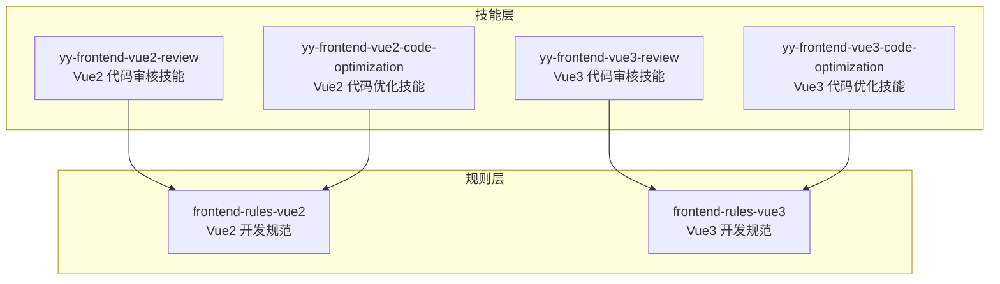
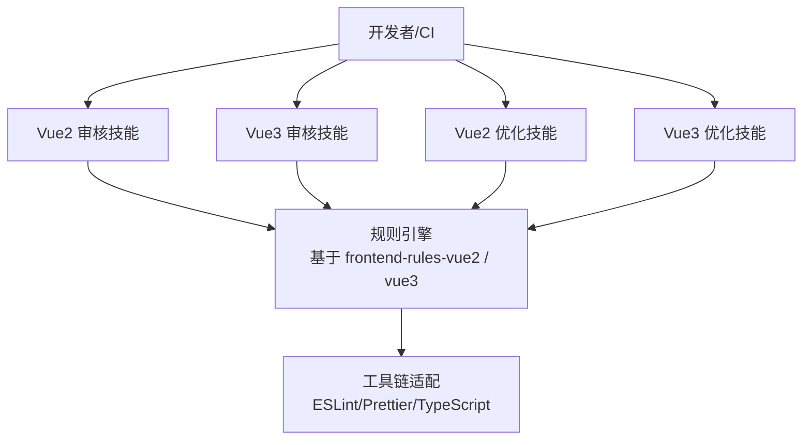
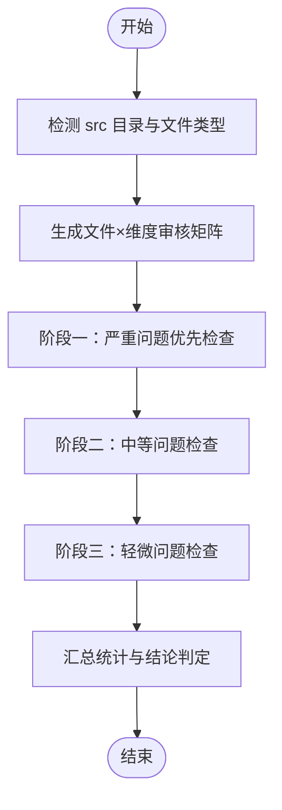
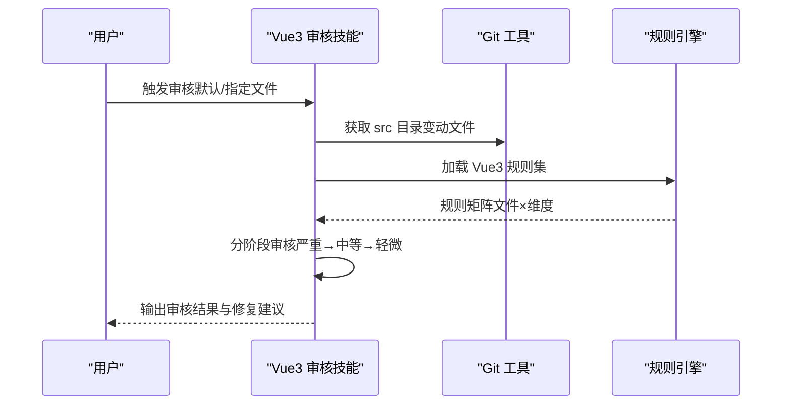
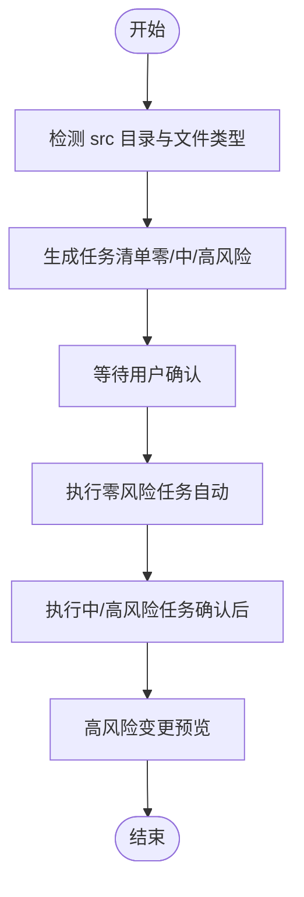
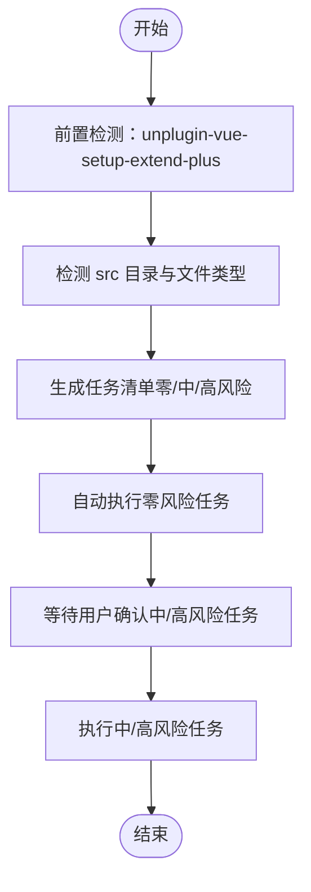
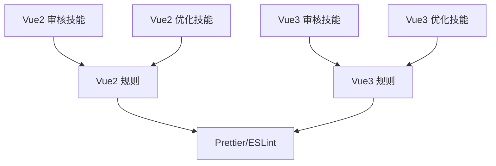

# 前端开发支持

<cite>
**本文引用的文件**
- [metadata.json](file://skills/yy-frontend-vue2-review/metadata.json)
- [metadata.json](file://skills/yy-frontend-vue3-review/metadata.json)
- [metadata.json](file://skills/yy-frontend-vue2-code-optimization/metadata.json)
- [metadata.json](file://skills/yy-frontend-vue3-code-optimization/metadata.json)
- [RULE.md](file://rules/frontend-rules-vue2/RULE.md)
- [RULE.md](file://rules/frontend-rules-vue3/RULE.md)
- [spec-index.md](file://rules/frontend-rules-vue2/references/spec-index.md)
- [spec-index.md](file://rules/frontend-rules-vue3/references/spec-index.md)
- [best-practice.md](file://skills/yy-frontend-vue2-review/references/best-practice.md)
- [absolute-prohibitions.md](file://skills/yy-frontend-vue3-review/references/absolute-prohibitions.md)
- [performance.md](file://skills/yy-frontend-vue2-code-optimization/rules/performance.md)
- [reactivity.md](file://skills/yy-frontend-vue3-code-optimization/rules/reactivity.md)
- [skill-prompts-simple.md](file://skills/yy-frontend-vue2-review/prompts/skill-prompts-simple.md)
- [skill-prompts-simple.md](file://skills/yy-frontend-vue3-review/prompts/skill-prompts-simple.md)
- [skill-prompts.md](file://skills/yy-frontend-vue2-code-optimization/prompts/skill-prompts.md)
- [skill-prompts.md](file://skills/yy-frontend-vue3-code-optimization/prompts/skill-prompts.md)
- [.prettierrc.json](file://rules/frontend-rules-vue2/assets/.prettierrc.json)
- [.prettierrc.json](file://rules/frontend-rules-vue3/assets/.prettierrc.json)
</cite>

## 目录
1. [简介](#简介)
2. [项目结构](#项目结构)
3. [核心组件](#核心组件)
4. [架构总览](#架构总览)
5. [详细组件分析](#详细组件分析)
6. [依赖分析](#依赖分析)
7. [性能考量](#性能考量)
8. [故障排查指南](#故障排查指南)
9. [结论](#结论)
10. [附录](#附录)

## 简介
本技术文档面向前端开发者，系统阐述“前端开发支持”模块的能力与使用方法，覆盖 Vue2 与 Vue3 的代码审核、性能优化与最佳实践指导。文档重点包括：
- 代码审核系统工作原理：静态规则匹配、问题分级与报告生成
- 代码优化工具功能特性：性能优化建议、代码重构提示、安全漏洞检测
- 开发规范指南：命名约定、组件设计原则、状态管理最佳实践
- 工具链集成：ESLint、Prettier、TypeScript 的协同使用
- 调试技巧与性能分析方法

## 项目结构
该模块围绕“技能”（Skill）与“规则”（Rule）两大体系组织：
- 技能层：提供可直接调用的前端开发辅助能力（代码审核、代码优化）
- 规则层：沉淀 Vue2/Vue3 的开发规范与最佳实践，支撑技能的规则引擎

图表来源
- [metadata.json:1-34](file://skills/yy-frontend-vue2-review/metadata.json#L1-L34)
- [metadata.json:1-42](file://skills/yy-frontend-vue3-review/metadata.json#L1-L42)
- [metadata.json:1-40](file://skills/yy-frontend-vue2-code-optimization/metadata.json#L1-L40)
- [metadata.json:1-47](file://skills/yy-frontend-vue3-code-optimization/metadata.json#L1-L47)
- [RULE.md:1-62](file://rules/frontend-rules-vue2/RULE.md#L1-L62)
- [RULE.md:1-68](file://rules/frontend-rules-vue3/RULE.md#L1-L68)

章节来源
- [metadata.json:1-34](file://skills/yy-frontend-vue2-review/metadata.json#L1-L34)
- [metadata.json:1-42](file://skills/yy-frontend-vue3-review/metadata.json#L1-L42)
- [metadata.json:1-40](file://skills/yy-frontend-vue2-code-optimization/metadata.json#L1-L40)
- [metadata.json:1-47](file://skills/yy-frontend-vue3-code-optimization/metadata.json#L1-L47)
- [RULE.md:1-62](file://rules/frontend-rules-vue2/RULE.md#L1-L62)
- [RULE.md:1-68](file://rules/frontend-rules-vue3/RULE.md#L1-L68)

## 核心组件
- Vue2 代码审核技能（yy-frontend-vue2-review）
  - 适用范围：src 目录下 .vue/.js/.css/.scss/.less
  - 审核维度：代码风格、最佳实践、组件规范、命名、网络请求、computed、逻辑错误、安全、绝对禁止项
  - 风险分级：严重/中等/轻微，严重问题直接判定不通过
- Vue3 代码审核技能（yy-frontend-vue3-review）
  - 适用范围：src 目录下 .vue/.js/.jsx/.ts/.tsx/.css/.scss/.less
  - 审核维度：代码风格、最佳实践、组件规范、命名、网络请求、computed、逻辑错误、安全、绝对禁止项
  - 特色：严格区分 <script setup> 与 Options API，支持 TypeScript 类型检查
- Vue2 代码优化技能（yy-frontend-vue2-code-optimization）
  - 任务调度：零风险/中风险/高风险三级确认机制
  - 优化内容：业务逻辑梳理、注释增强、代码风格清洗、CSS/BEM 规范、语义化命名、逻辑深度优化
- Vue3 代码优化技能（yy-frontend-vue3-code-optimization）
  - 任务调度：零风险/中风险/高风险三级确认机制
  - 优化内容：业务逻辑梳理、注释增强、代码风格清洗、CSS/BEM 规范、语义化命名、逻辑深度优化（含 reactive/ref 转换）

章节来源
- [metadata.json:18-33](file://skills/yy-frontend-vue2-review/metadata.json#L18-L33)
- [metadata.json:21-40](file://skills/yy-frontend-vue3-review/metadata.json#L21-L40)
- [metadata.json:19-38](file://skills/yy-frontend-vue2-code-optimization/metadata.json#L19-L38)
- [metadata.json:24-46](file://skills/yy-frontend-vue3-code-optimization/metadata.json#L24-L46)

## 架构总览
整体架构由“规则引擎 + 技能执行器 + 工具链适配”构成，确保审核与优化过程可追溯、可配置、可扩展。

图表来源
- [RULE.md:1-62](file://rules/frontend-rules-vue2/RULE.md#L1-L62)
- [RULE.md:1-68](file://rules/frontend-rules-vue3/RULE.md#L1-L68)
- [skill-prompts-simple.md:1-346](file://skills/yy-frontend-vue2-review/prompts/skill-prompts-simple.md#L1-L346)
- [skill-prompts-simple.md:1-554](file://skills/yy-frontend-vue3-review/prompts/skill-prompts-simple.md#L1-L554)

## 详细组件分析

### Vue2 代码审核技能（yy-frontend-vue2-review）
- 审核范围与边界
  - 仅审核 src 目录下改动文件，支持 .vue/.js/.css/.scss/.less
  - 严格拒绝 Vue3/React 项目，避免误用
- 审核流程
  - Git 变动文件检测（HEAD 与暂存区）
  - 生成“文件×维度”审核矩阵，按风险等级分阶段执行
  - 严重问题优先判定，中等问题导致不通过，轻微问题不影响通过
- 维度与规则
  - D01：代码风格（导入顺序、缩进、引号、分号、行宽、箭头函数）
  - D02：最佳实践（调试代码清理、scoped、未使用变量、Props 解构）
  - D03：组件规范（Options API 结构、元素特性顺序、v-slot 动态风格）
  - D04：命名规范（API/事件/常量/组件名/Props）
  - D05：网络请求（async/await + try/catch/finally、统一响应模式）
  - D06：computed（同步 getter、try/catch 包裹、有意义命名）
  - D07：逻辑错误（空指针、数组越界、遗漏分支）
  - D08：安全漏洞（XSS、敏感信息泄露）
  - D09：绝对禁止项（连续解构、修改子组件数据、修改 data 类型、直接修改 props、mixins、v-for 与 v-if 同元素、index 作为 key）

图表来源
- [skill-prompts-simple.md:69-100](file://skills/yy-frontend-vue2-review/prompts/skill-prompts-simple.md#L69-L100)

章节来源
- [skill-prompts-simple.md:1-346](file://skills/yy-frontend-vue2-review/prompts/skill-prompts-simple.md#L1-L346)
- [best-practice.md:1-107](file://skills/yy-frontend-vue2-review/references/best-practice.md#L1-L107)

### Vue3 代码审核技能（yy-frontend-vue3-review）
- 审核范围与边界
  - 仅审核 src 目录下改动文件，支持 .vue/.js/.jsx/.ts/.tsx/.css/.scss/.less
  - 严格拒绝 Vue2/React 项目，区分 <script setup> 与 Options API
- 审核流程
  - 前置检测：是否安装 unplugin-vue-setup-extend-plus（影响 .vue 文件 name 属性审核）
  - Git 变动文件检测（HEAD 与暂存区）
  - 生成“文件×维度”审核矩阵，按风险等级分阶段执行
- 维度与规则
  - D01：代码风格（导入顺序 4 组、缩进、引号、分号、行宽、箭头函数）
  - D02：最佳实践（调试代码清理、BEM/scoped、未使用变量、defineExpose、组件拆分、Hooks 规范）
  - D03：组件规范（<script setup>、name 属性、脚本结构顺序、元素特性顺序、Props TS 定义、emit 顺序、生命周期 emit 限制）
  - D04：命名规范（API/事件/变量/常量/组件名/文件名/emit/Hooks/布尔值、TS 类型约束）
  - D05：网络请求（async/await + try/catch/finally、禁止多层 try/catch、禁止连续解构、统一响应模式）
  - D06：computed（纯函数原则、有意义命名、复杂逻辑 try/catch）
  - D07：逻辑错误（空指针、数组越界、逻辑判断、方法内部顺序、ref 访问）
  - D08：安全漏洞（v-html XSS 风险、敏感信息硬编码/泄露）
  - D09：绝对禁止项（连续解构、父改子数据、修改 ref/reactive 类型、修改 props、this、Options API、mixins、多层 try/catch、生命周期 emit、无意义命名、v-for 与 v-if 同元素、index 作为 key）

图表来源
- [skill-prompts-simple.md:70-96](file://skills/yy-frontend-vue3-review/prompts/skill-prompts-simple.md#L70-L96)

章节来源
- [skill-prompts-simple.md:1-554](file://skills/yy-frontend-vue3-review/prompts/skill-prompts-simple.md#L1-L554)
- [absolute-prohibitions.md:1-23](file://skills/yy-frontend-vue3-review/references/absolute-prohibitions.md#L1-L23)

### Vue2 代码优化技能（yy-frontend-vue2-code-optimization）
- 任务调度与风险分级
  - 零风险：业务逻辑梳理、注释增强
  - 中风险：代码风格清洗、CSS/BEM 规范、语义化命名
  - 高风险：逻辑深度优化（async/await、computed 优先、逻辑拆分、Props 增强）
- 优化流程
  - Git 变动文件检测（HEAD 与暂存区）
  - 生成任务清单并等待用户确认
  - 用户确认后按任务执行，高风险任务需展示变更预览
- 优化内容
  - 业务逻辑梳理：生成 JSDoc，记录业务职责与数据流
  - 注释增强：模板/脚本/样式注释，遵循“只增不改”原则
  - 代码风格清洗：导入顺序（3 组）、Options API 结构排序、模板属性顺序、组件 name 属性
  - CSS/BEM 规范：BEM 命名、scoped 同步修改
  - 语义化命名：API/事件/常量命名规范
  - 逻辑深度优化：async/await、computed 优先、逻辑拆分、Props 增强

图表来源
- [skill-prompts.md:19-51](file://skills/yy-frontend-vue2-code-optimization/prompts/skill-prompts.md#L19-L51)

章节来源
- [skill-prompts.md:1-800](file://skills/yy-frontend-vue2-code-optimization/prompts/skill-prompts.md#L1-L800)

### Vue3 代码优化技能（yy-frontend-vue3-code-optimization）
- 任务调度与风险分级
  - 零风险：业务逻辑梳理、注释增强
  - 中风险：代码风格清洗、CSS/BEM 规范、语义化命名
  - 高风险：逻辑深度优化（async/await、Hooks 抽离、reactive 转 ref、Props/Emits 增强）
- 优化流程
  - 前置检测：是否安装 unplugin-vue-setup-extend-plus（影响 .vue 文件 name 属性）
  - Git 变动文件检测（HEAD 与暂存区）
  - 生成任务清单并自动执行零风险任务，中/高风险任务等待用户确认
- 优化内容
  - 业务逻辑梳理：生成 JSDoc，记录业务职责与数据流（含 Hooks 使用）
  - 注释增强：模板/脚本/样式注释，遵循“只增不改”原则
  - 代码风格清洗：导入顺序（4 组）、<script setup> 结构、模板属性顺序、组件 name 属性
  - CSS/BEM 规范：BEM 命名、scoped 同步修改
  - 语义化命名：API/事件/常量/Hooks 命名规范
  - 逻辑深度优化：async/await、computed 优先、Hooks 抽离、reactive 转 ref、Props/Emits 增强

图表来源
- [skill-prompts.md:21-57](file://skills/yy-frontend-vue3-code-optimization/prompts/skill-prompts.md#L21-L57)

章节来源
- [skill-prompts.md:1-800](file://skills/yy-frontend-vue3-code-optimization/prompts/skill-prompts.md#L1-L800)

### 规则体系与规范总览
- Vue2 规则总纲
  - 基础规范（Essential）：必须遵守，规避错误与潜在 Bug
  - 强烈推荐（Strongly Recommended）：显著改善可读性与开发体验
  - 风格指南（Recommended）：统一团队代码风格
- Vue3 规则总纲
  - 基础规范（Essential）：必须遵守，规避错误与潜在 Bug
  - 强烈推荐（Strongly Recommended）：显著改善可读性与开发体验
  - 风格指南（Recommended）：统一团队代码风格
- 适用范围与技术栈
  - Vue2：Options API，src 目录下 .vue/.js/.css/.scss/.less
  - Vue3：<script setup>，src 目录下 .vue/.js/.jsx/.ts/.tsx/.css/.scss/.less

章节来源
- [spec-index.md:1-61](file://rules/frontend-rules-vue2/references/spec-index.md#L1-L61)
- [spec-index.md:1-60](file://rules/frontend-rules-vue3/references/spec-index.md#L1-L60)
- [RULE.md:38-44](file://rules/frontend-rules-vue2/RULE.md#L38-L44)
- [RULE.md:18-23](file://rules/frontend-rules-vue3/RULE.md#L18-L23)

### 性能优化与最佳实践
- Vue2 性能优化
  - 组件懒加载、KeepAlive、路由懒加载、虚拟滚动、防抖节流、图片优化、响应式性能、指令清理、路由守卫清理、过滤器
  - 响应式陷阱（$set/$set/splice）与 computed 优先策略
- Vue3 响应式状态规范
  - ref/reactive/computed 选择原则：优先 ref，尽可能少用 reactive
  - reactive 转 ref 规则与转换示例
  - computed 规范：纯同步 getter、try/catch 包裹、命名规范
  - Hooks 规范：命名、返回值、抽离建议、导入顺序

章节来源
- [performance.md:1-179](file://skills/yy-frontend-vue2-code-optimization/rules/performance.md#L1-L179)
- [reactivity.md:1-227](file://skills/yy-frontend-vue3-code-optimization/rules/reactivity.md#L1-L227)

### 开发规范与工具链集成
- Prettier 配置
  - Vue2：printWidth=100，singleQuote=true，trailingComma=all，arrowParens=avoid
  - Vue3：printWidth=120，singleQuote=true，trailingComma=all，arrowParens=avoid
- ESLint 集成
  - 与 Prettier 协同，统一代码风格与格式
- TypeScript 集成
  - Vue3 优化技能中强调类型注解规范，禁止 any，要求明确类型
- 命名约定
  - Vue2：API 函数、事件函数、常量、组件名、Props、Emit、布尔值、BEM
  - Vue3：API 函数、事件函数、变量/方法、常量、Props、组件名、文件名、Emit、Hooks、布尔值、TS 类型约束

章节来源
- [.prettierrc.json:1-19](file://rules/frontend-rules-vue2/assets/.prettierrc.json#L1-L19)
- [.prettierrc.json:1-20](file://rules/frontend-rules-vue3/assets/.prettierrc.json#L1-L20)
- [skill-prompts-simple.md:164-177](file://skills/yy-frontend-vue2-review/prompts/skill-prompts-simple.md#L164-L177)
- [skill-prompts-simple.md:124-137](file://skills/yy-frontend-vue3-review/prompts/skill-prompts-simple.md#L124-L137)
- [skill-prompts-simple.md:187-198](file://skills/yy-frontend-vue2-review/prompts/skill-prompts-simple.md#L187-L198)
- [skill-prompts-simple.md:269-283](file://skills/yy-frontend-vue3-review/prompts/skill-prompts-simple.md#L269-L283)

## 依赖分析
- 技能与规则的耦合关系
  - 审核与优化技能均依赖规则层（frontend-rules-vue2 / vue3），规则层提供规范索引与详细规则
- 工具链依赖
  - Prettier：统一格式化
  - ESLint：静态检查与规则约束
  - TypeScript：Vue3 优化技能中的类型检查与注解规范

图表来源
- [RULE.md:1-62](file://rules/frontend-rules-vue2/RULE.md#L1-L62)
- [RULE.md:1-68](file://rules/frontend-rules-vue3/RULE.md#L1-L68)
- [metadata.json:18-22](file://skills/yy-frontend-vue2-review/metadata.json#L18-L22)
- [metadata.json:21-26](file://skills/yy-frontend-vue3-review/metadata.json#L21-L26)

章节来源
- [RULE.md:1-62](file://rules/frontend-rules-vue2/RULE.md#L1-L62)
- [RULE.md:1-68](file://rules/frontend-rules-vue3/RULE.md#L1-L68)
- [metadata.json:18-22](file://skills/yy-frontend-vue2-review/metadata.json#L18-L22)
- [metadata.json:21-26](file://skills/yy-frontend-vue3-review/metadata.json#L21-L26)

## 性能考量
- 审核与优化的分层策略
  - 严重问题优先检查，避免低效的中/轻微问题阻塞关键修复
  - 高风险优化任务需变更预览，降低回滚成本
- 大文件处理
  - 超过 1000 行的文件建议分批处理，避免单次变更过大
- 工具链协同
  - Prettier 与 ESLint 的配置一致性，减少格式化冲突与合并冲突

## 故障排查指南
- 常见问题与修复建议
  - 绝对禁止项：连续解构、修改子组件数据、修改 data/props 类型、直接修改 props、mixins、v-for 与 v-if 同元素、index 作为 key
  - 逻辑错误：空指针、数组越界、遗漏分支、方法内部顺序不当
  - 安全漏洞：v-html XSS 风险、敏感信息泄露
- 审核不通过后的处理
  - 优先修复“严重”和“中等”问题，修复完成后重新发起审核
  - 轻微问题不影响通过，但仍建议修复以提升代码质量

章节来源
- [absolute-prohibitions.md:7-23](file://skills/yy-frontend-vue3-review/references/absolute-prohibitions.md#L7-L23)
- [skill-prompts-simple.md:218-230](file://skills/yy-frontend-vue2-review/prompts/skill-prompts-simple.md#L218-L230)
- [skill-prompts-simple.md:343-359](file://skills/yy-frontend-vue3-review/prompts/skill-prompts-simple.md#L343-L359)

## 结论
本模块通过“规则 + 技能 + 工具链”的一体化设计，为 Vue2/Vue3 前端开发提供了系统化的代码审核与优化能力。建议在团队中：
- 将规则体系纳入 CI，实现自动化质量门禁
- 在本地开发中结合 Prettier/ESLint/TypeScript，提升一致性
- 使用优化技能进行周期性重构，持续改进代码质量与可维护性

## 附录
- 实际案例与优化效果
  - Vue2：通过 computed 优先策略减少冗余状态，使用 KeepAlive 与懒加载优化首屏性能
  - Vue3：通过 reactive 转 ref 降低响应式复杂度，使用 Hooks 抽离可复用逻辑
- 调试技巧与性能分析
  - 使用浏览器性能面板与 Vue DevTools 定位渲染瓶颈
  - 利用 ESLint 规则与 Prettier 格式化减少格式化冲突