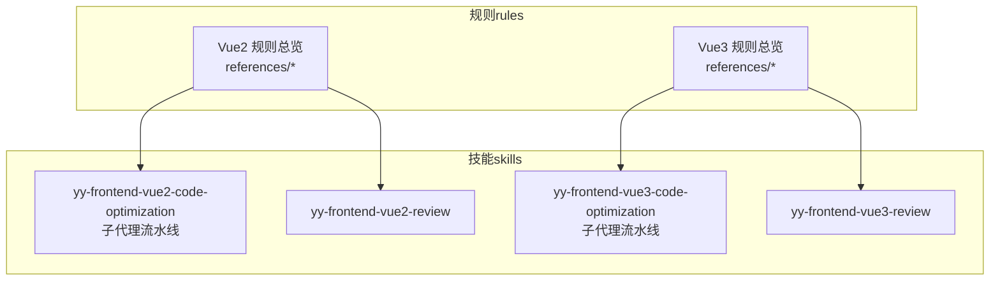
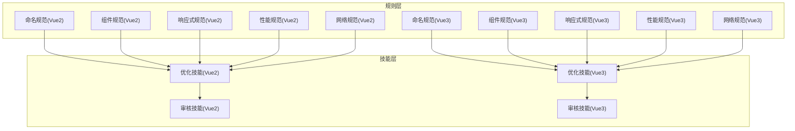
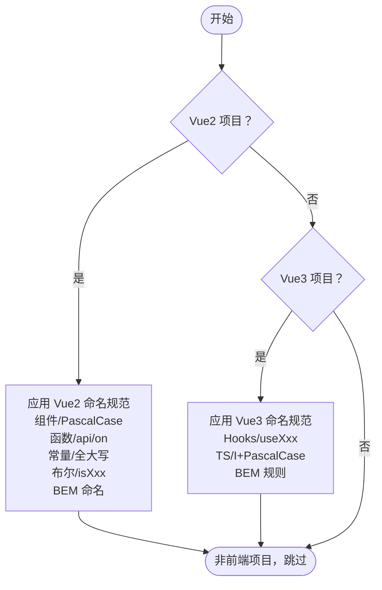
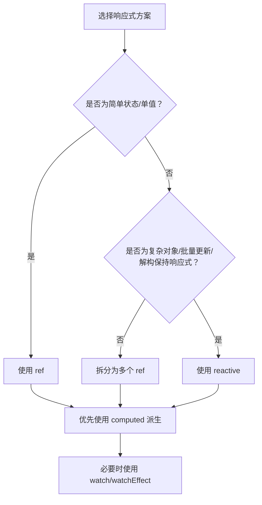
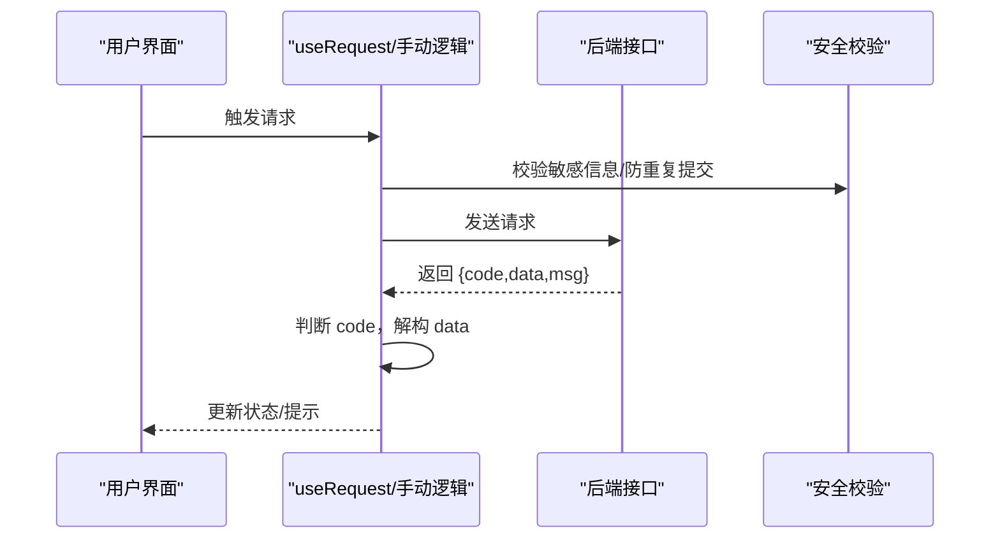
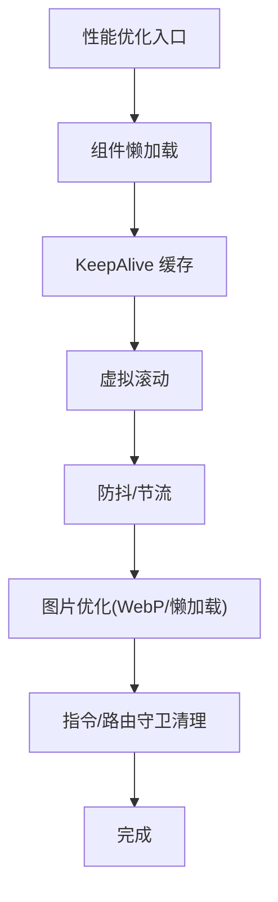
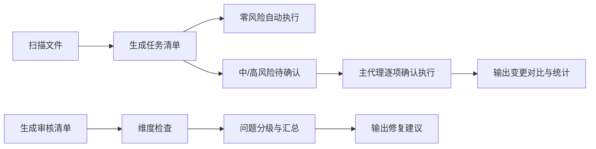
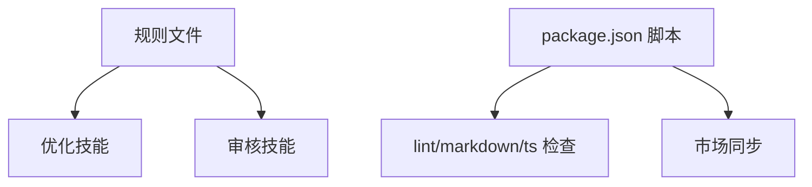

# 前端开发最佳实践

<cite>
**本文引用的文件**
- [Vue2 规则总览](file://rules/frontend-rules-vue2/RULE.md)
- [Vue3 规则总览](file://rules/frontend-rules-vue3/RULE.md)
- [Vue2 命名规范](file://rules/frontend-rules-vue2/references/naming.md)
- [Vue3 命名规范](file://rules/frontend-rules-vue3/references/naming.md)
- [Vue2 性能优化规范](file://rules/frontend-rules-vue2/references/performance.md)
- [Vue3 性能优化规范](file://rules/frontend-rules-vue3/references/performance.md)
- [Vue2 组件开发规范](file://rules/frontend-rules-vue2/references/component-dev.md)
- [Vue3 组件开发规范](file://rules/frontend-rules-vue3/references/component-dev.md)
- [Vue3 响应式状态规范](file://rules/frontend-rules-vue3/references/reactivity.md)
- [Vue2 网络请求规范](file://rules/frontend-rules-vue2/references/network.md)
- [Vue3 网络请求规范](file://rules/frontend-rules-vue3/references/network.md)
- [Vue2 代码优化技能](file://skills/yy-frontend-vue2-code-optimization/SKILL.md)
- [Vue3 代码优化技能](file://skills/yy-frontend-vue3-code-optimization/SKILL.md)
- [Vue2 代码审核技能](file://skills/yy-frontend-vue2-review/SKILL.md)
- [Vue3 代码审核技能](file://skills/yy-frontend-vue3-review/SKILL.md)
- [项目根配置](file://package.json)
</cite>

## 目录
1. [简介](#简介)
2. [项目结构](#项目结构)
3. [核心组件](#核心组件)
4. [架构总览](#架构总览)
5. [详细组件分析](#详细组件分析)
6. [依赖分析](#依赖分析)
7. [性能考量](#性能考量)
8. [故障排查指南](#故障排查指南)
9. [结论](#结论)
10. [附录](#附录)

## 简介
本文件面向前端工程师，系统总结 Vue2 与 Vue3 项目的开发规范与最佳实践，覆盖代码风格、组件设计、状态管理、性能优化、网络安全、测试与发布流程、工具链配置与自动化工作流。文档以仓库内“规则”与“技能”为核心依据，结合 Vue2 与 Vue3 的差异，提供可落地的实施建议与可视化图示，帮助团队建立一致、高质量、可维护的前端工程体系。

## 项目结构
该仓库采用“规则 + 技能”的双轨结构：
- 规则（rules）：以模块化参考文件形式沉淀 Vue2/Vue3 的开发规范与约束，便于查阅与版本演进。
- 技能（skills）：以可执行的 AI 技能形式提供代码优化、审核、评审等自动化能力，支持在本地或 CI 中集成。



图表来源
- [Vue2 规则总览:1-62](file://rules/frontend-rules-vue2/RULE.md#L1-L62)
- [Vue3 规则总览:1-68](file://rules/frontend-rules-vue3/RULE.md#L1-L68)
- [Vue2 代码优化技能:1-415](file://skills/yy-frontend-vue2-code-optimization/SKILL.md#L1-L415)
- [Vue3 代码优化技能:1-464](file://skills/yy-frontend-vue3-code-optimization/SKILL.md#L1-L464)
- [Vue2 代码审核技能:1-167](file://skills/yy-frontend-vue2-review/SKILL.md#L1-L167)
- [Vue3 代码审核技能:1-206](file://skills/yy-frontend-vue3-review/SKILL.md#L1-L206)

章节来源
- [Vue2 规则总览:1-62](file://rules/frontend-rules-vue2/RULE.md#L1-L62)
- [Vue3 规则总览:1-68](file://rules/frontend-rules-vue3/RULE.md#L1-L68)

## 核心组件
围绕 Vue2/Vue3 的开发规范，核心组件包括：
- 命名规范：文件/组件/API/事件/常量/Hooks/BEM 等命名约定，确保一致性与可读性。
- 组件开发规范：Options API（Vue2）与 <script setup>（Vue3）的结构顺序、注释、职责拆分与模板层轻量化。
- 响应式状态管理：ref/reactive/computed 的选择与转换、watch/watchEffect 的使用策略。
- 网络请求与安全：统一响应解构、错误处理、防重复提交、XSS 防护与敏感信息保护。
- 性能优化：懒加载、KeepAlive、虚拟滚动、防抖节流、图片优化与指令/路由守卫清理。
- 工具链与自动化：代码优化技能（子代理流水线）、代码审核技能（维度分级）、CI 脚本与市场同步。

章节来源
- [Vue2 命名规范:1-73](file://rules/frontend-rules-vue2/references/naming.md#L1-L73)
- [Vue3 命名规范:1-85](file://rules/frontend-rules-vue3/references/naming.md#L1-L85)
- [Vue2 组件开发规范:1-92](file://rules/frontend-rules-vue2/references/component-dev.md#L1-L92)
- [Vue3 组件开发规范:1-81](file://rules/frontend-rules-vue3/references/component-dev.md#L1-L81)
- [Vue3 响应式状态规范:1-227](file://rules/frontend-rules-vue3/references/reactivity.md#L1-L227)
- [Vue2 网络请求规范:1-180](file://rules/frontend-rules-vue2/references/network.md#L1-L180)
- [Vue3 网络请求规范:1-363](file://rules/frontend-rules-vue3/references/network.md#L1-L363)
- [Vue2 性能优化规范:1-179](file://rules/frontend-rules-vue2/references/performance.md#L1-L179)
- [Vue3 性能优化规范:1-136](file://rules/frontend-rules-vue3/references/performance.md#L1-L136)

## 架构总览
下图展示了从“规则”到“技能”的落地路径，以及“优化/审核”两类自动化能力如何与规则协同，形成闭环的质量保障体系。



图表来源
- [Vue2 规则总览:1-62](file://rules/frontend-rules-vue2/RULE.md#L1-L62)
- [Vue3 规则总览:1-68](file://rules/frontend-rules-vue3/RULE.md#L1-L68)
- [Vue2 代码优化技能:1-415](file://skills/yy-frontend-vue2-code-optimization/SKILL.md#L1-L415)
- [Vue3 代码优化技能:1-464](file://skills/yy-frontend-vue3-code-optimization/SKILL.md#L1-L464)
- [Vue2 代码审核技能:1-167](file://skills/yy-frontend-vue2-review/SKILL.md#L1-L167)
- [Vue3 代码审核技能:1-206](file://skills/yy-frontend-vue3-review/SKILL.md#L1-L206)

## 详细组件分析

### 命名规范（Vue2/Vue3）
- Vue2：组件文件多单词 PascalCase、目录 kebab-case；函数命名 apiXxx、onXxx；常量全大写下划线；布尔值前缀 isXX/hasXX/showXX；BEM 命名块/元素/修饰符。
- Vue3：新增 Hooks 命名 useXxx；TypeScript 类型 I+PascalCase；BEM 规则一致；强调文件/组件/API/事件/常量/Hooks/布尔值的统一命名。



图表来源
- [Vue2 命名规范:1-73](file://rules/frontend-rules-vue2/references/naming.md#L1-L73)
- [Vue3 命名规范:1-85](file://rules/frontend-rules-vue3/references/naming.md#L1-L85)

章节来源
- [Vue2 命名规范:1-73](file://rules/frontend-rules-vue2/references/naming.md#L1-L73)
- [Vue3 命名规范:1-85](file://rules/frontend-rules-vue3/references/naming.md#L1-L85)

### 组件开发规范（Options API vs <script setup>）
- Vue2：Options API 结构顺序 name → components → props → data → computed → watch → methods → 生命周期；模板层轻量化、方法职责单一、页面拆分建议。
- Vue3：<script setup> 必须使用；结构顺序 imports → defineProps/defineEmits → Hooks → 业务逻辑 → defineExpose；v-slot 动态风格；模板层轻量化；注释与职责拆分。

```mermaid
sequenceDiagram
participant Dev as "开发者"
participant Rule as "组件规范"
participant Opt as "优化技能"
participant Rev as "审核技能"
Dev->>Rule : 查阅结构顺序与职责
Rule-->>Dev : 返回规范要点
Dev->>Opt : 触发代码优化
Opt-->>Dev : 输出变更对比与执行状态
Dev->>Rev : 触发代码审核
Rev-->>Dev : 输出问题清单与修复建议
```

图表来源
- [Vue2 组件开发规范:1-92](file://rules/frontend-rules-vue2/references/component-dev.md#L1-L92)
- [Vue3 组件开发规范:1-81](file://rules/frontend-rules-vue3/references/component-dev.md#L1-L81)
- [Vue2 代码优化技能:1-415](file://skills/yy-frontend-vue2-code-optimization/SKILL.md#L1-L415)
- [Vue3 代码优化技能:1-464](file://skills/yy-frontend-vue3-code-optimization/SKILL.md#L1-L464)
- [Vue2 代码审核技能:1-167](file://skills/yy-frontend-vue2-review/SKILL.md#L1-L167)
- [Vue3 代码审核技能:1-206](file://skills/yy-frontend-vue3-review/SKILL.md#L1-L206)

章节来源
- [Vue2 组件开发规范:1-92](file://rules/frontend-rules-vue2/references/component-dev.md#L1-L92)
- [Vue3 组件开发规范:1-81](file://rules/frontend-rules-vue3/references/component-dev.md#L1-L81)

### 响应式状态管理（ref/reactive/computed）
- Vue3 优先使用 ref，尽可能少用 reactive；复杂对象/批量更新/解构保持响应式时可用 reactive；computed 用于同步派生逻辑，避免副作用；watch/watchEffect 选择策略与资源清理。
- Vue2 响应式陷阱：新增对象属性、数组索引赋值、数组长度修改的正确写法。



图表来源
- [Vue3 响应式状态规范:1-227](file://rules/frontend-rules-vue3/references/reactivity.md#L1-L227)
- [Vue2 性能优化规范:172-179](file://rules/frontend-rules-vue2/references/performance.md#L172-L179)

章节来源
- [Vue3 响应式状态规范:1-227](file://rules/frontend-rules-vue3/references/reactivity.md#L1-L227)
- [Vue2 性能优化规范:172-179](file://rules/frontend-rules-vue2/references/performance.md#L172-L179)

### 网络请求与安全
- 统一响应解构：{ code, data, msg }；先判断成功再使用数据；禁止连续解构；防重复提交（loading/互斥锁）。
- Vue3 前置检查：优先使用 useRequest（ahooks-vue/vue-hooks-plus）；未安装则手动 async/await + try/catch/finally。
- 安全规范：v-html 使用 DOMPurify 过滤；敏感信息不出现在 URL 与控制台。



图表来源
- [Vue2 网络请求规范:1-180](file://rules/frontend-rules-vue2/references/network.md#L1-L180)
- [Vue3 网络请求规范:1-363](file://rules/frontend-rules-vue3/references/network.md#L1-L363)

章节来源
- [Vue2 网络请求规范:1-180](file://rules/frontend-rules-vue2/references/network.md#L1-L180)
- [Vue3 网络请求规范:1-363](file://rules/frontend-rules-vue3/references/network.md#L1-L363)

### 性能优化
- 组件懒加载（Vue2 动态导入，Vue3 defineAsyncComponent）、KeepAlive 精确缓存、虚拟滚动、防抖节流、图片优化（WebP/懒加载）、模板层轻量化、指令/路由守卫清理。
- Vue2 特有的响应式陷阱与过滤器使用建议。



图表来源
- [Vue2 性能优化规范:1-179](file://rules/frontend-rules-vue2/references/performance.md#L1-L179)
- [Vue3 性能优化规范:1-136](file://rules/frontend-rules-vue3/references/performance.md#L1-L136)

章节来源
- [Vue2 性能优化规范:1-179](file://rules/frontend-rules-vue2/references/performance.md#L1-L179)
- [Vue3 性能优化规范:1-136](file://rules/frontend-rules-vue3/references/performance.md#L1-L136)

### 工具链与自动化工作流
- 代码优化技能：按任务类型分配子代理，零/中/高风险分级，逐项展示 diff 并由用户确认后执行。
- 代码审核技能：按维度（代码风格/最佳实践/组件规范/命名/网络请求/computed/逻辑错误/安全/禁止项）分级，生成审核清单与修复建议。
- 项目脚本：lint/markdownlint/ts 检查、CRLF 转 LF、市场同步等。



图表来源
- [Vue2 代码优化技能:1-415](file://skills/yy-frontend-vue2-code-optimization/SKILL.md#L1-L415)
- [Vue3 代码优化技能:1-464](file://skills/yy-frontend-vue3-code-optimization/SKILL.md#L1-L464)
- [Vue2 代码审核技能:1-167](file://skills/yy-frontend-vue2-review/SKILL.md#L1-L167)
- [Vue3 代码审核技能:1-206](file://skills/yy-frontend-vue3-review/SKILL.md#L1-L206)
- [项目根配置:1-46](file://package.json#L1-L46)

章节来源
- [Vue2 代码优化技能:1-415](file://skills/yy-frontend-vue2-code-optimization/SKILL.md#L1-L415)
- [Vue3 代码优化技能:1-464](file://skills/yy-frontend-vue3-code-optimization/SKILL.md#L1-L464)
- [Vue2 代码审核技能:1-167](file://skills/yy-frontend-vue2-review/SKILL.md#L1-L167)
- [Vue3 代码审核技能:1-206](file://skills/yy-frontend-vue3-review/SKILL.md#L1-L206)
- [项目根配置:1-46](file://package.json#L1-L46)

## 依赖分析
- 规则到技能的依赖：优化/审核技能均以对应规则为权威依据，确保执行与规范一致。
- 项目脚本依赖：markdownlint、typescript、js-yaml 等工具链保证文档与类型检查质量。



图表来源
- [Vue2 规则总览:1-62](file://rules/frontend-rules-vue2/RULE.md#L1-L62)
- [Vue3 规则总览:1-68](file://rules/frontend-rules-vue3/RULE.md#L1-L68)
- [Vue2 代码优化技能:1-415](file://skills/yy-frontend-vue2-code-optimization/SKILL.md#L1-L415)
- [Vue3 代码优化技能:1-464](file://skills/yy-frontend-vue3-code-optimization/SKILL.md#L1-L464)
- [Vue2 代码审核技能:1-167](file://skills/yy-frontend-vue2-review/SKILL.md#L1-L167)
- [Vue3 代码审核技能:1-206](file://skills/yy-frontend-vue3-review/SKILL.md#L1-L206)
- [项目根配置:1-46](file://package.json#L1-L46)

章节来源
- [项目根配置:1-46](file://package.json#L1-L46)

## 性能考量
- 优先使用 computed 派生状态，减少 watch 滥用与同步 DOM 操作。
- 大型数据列表考虑 shallowRef 减少深层响应式开销。
- 防抖节流策略：搜索（防抖 300ms）、滚动（节流 100ms）、resize（节流）、按钮点击（防抖/锁）。
- KeepAlive include/exclude 精确控制缓存范围，避免内存泄漏。
- 虚拟滚动仅渲染可视区域，降低长列表渲染开销。
- 图片优化：WebP 优先、合适尺寸、非首屏 lazy 加载。

## 故障排查指南
- 审核不通过：按严重/中等/轻微分级查看问题详情与修复建议，优先修复严重与中等问题。
- 优化风险项：高风险任务需逐项确认并展示 diff，确保用户对每次变更有完全控制。
- 网络请求异常：检查统一响应解构、错误处理与防重复提交逻辑；Vue3 建议使用 useRequest 自动管理 loading/data。
- 响应式陷阱：Vue2 避免直接设置对象属性/数组索引/长度修改；Vue3 避免多次修改 ref/reactive 类型与直接修改 props。

章节来源
- [Vue2 代码审核技能:1-167](file://skills/yy-frontend-vue2-review/SKILL.md#L1-L167)
- [Vue3 代码审核技能:1-206](file://skills/yy-frontend-vue3-review/SKILL.md#L1-L206)
- [Vue2 代码优化技能:1-415](file://skills/yy-frontend-vue2-code-optimization/SKILL.md#L1-L415)
- [Vue3 代码优化技能:1-464](file://skills/yy-frontend-vue3-code-optimization/SKILL.md#L1-L464)
- [Vue2 网络请求规范:1-180](file://rules/frontend-rules-vue2/references/network.md#L1-L180)
- [Vue3 网络请求规范:1-363](file://rules/frontend-rules-vue3/references/network.md#L1-L363)

## 结论
本最佳实践以规则为纲、以技能为目，构建了从规范制定到自动化执行与审核的闭环。通过统一命名、组件结构、响应式与网络请求规范，以及性能与安全策略，能够有效提升代码质量与团队协作效率。建议在项目中固化规则与技能的使用流程，并结合 CI 脚本持续保障质量门槛。

## 附录
- 开发流程建议：项目初始化 → 代码编写（遵循命名/组件/响应式/网络规范）→ 测试验证（含审核）→ 自动化优化 → 部署发布。
- 工具链配置建议：使用 Prettier 配置、ESLint 规则、TypeScript 类型检查；在 package.json 中统一脚本命令，确保团队一致。
- 自动化工作流：在 CI 中集成 lint/markdown/ts 检查与市场同步脚本，结合优化/审核技能实现 PR 质量门禁。