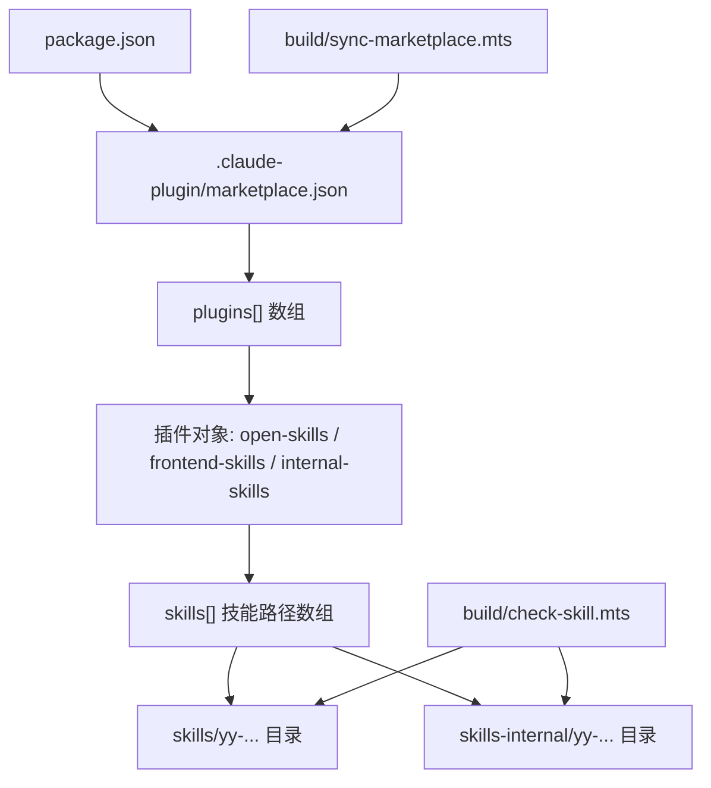
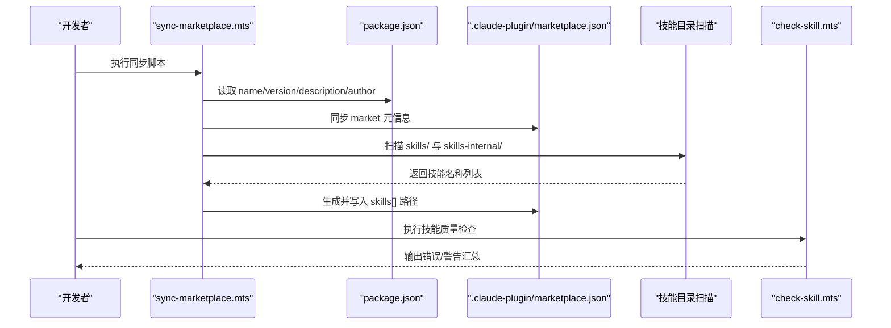
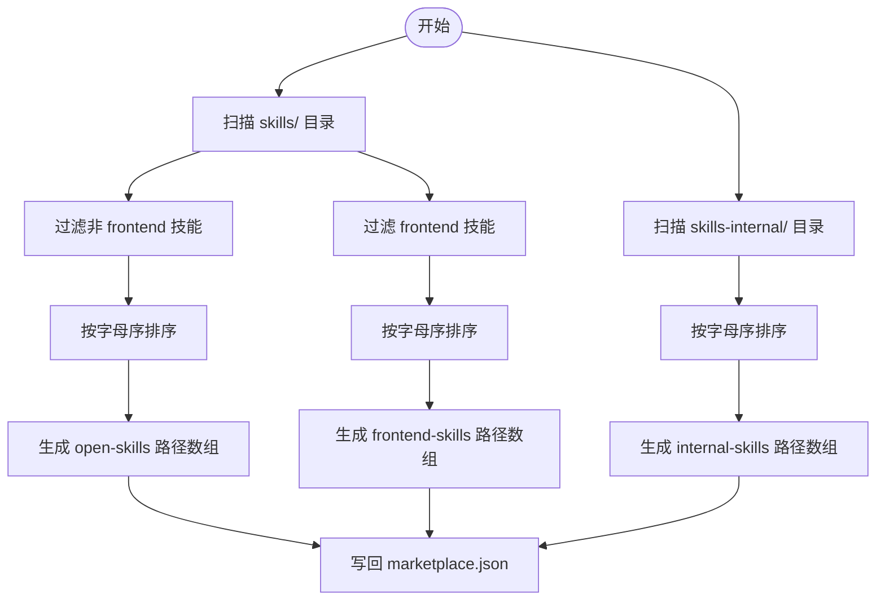
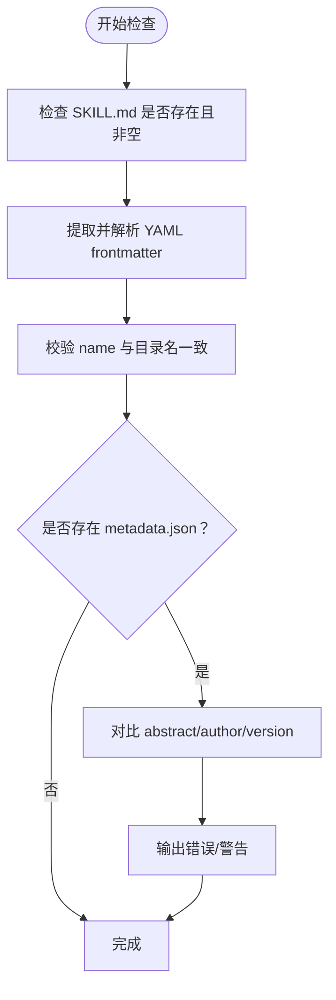
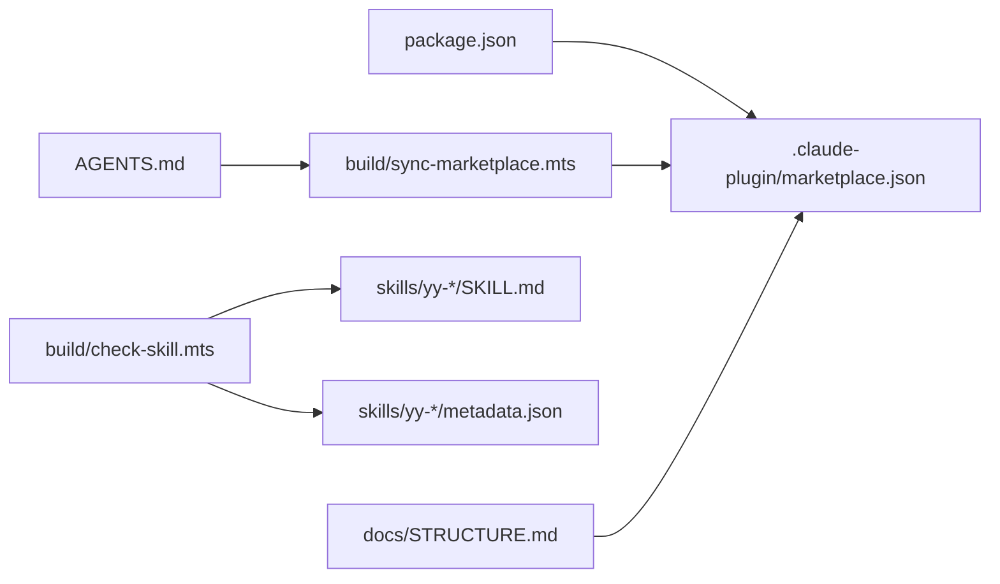

# 市场配置管理

<cite>
**本文引用的文件**
- [.claude-plugin/marketplace.json](file://.claude-plugin/marketplace.json)
- [build/sync-marketplace.mts](file://build/sync-marketplace.mts)
- [build/check-skill.mts](file://build/check-skill.mts)
- [package.json](file://package.json)
- [docs/STRUCTURE.md](file://docs/STRUCTURE.md)
- [docs/CLAUDE_CODE_SKILL.md](file://docs/CLAUDE_CODE_SKILL.md)
- [AGENTS.md](file://AGENTS.md)
- [skills/yy-comment/SKILL.md](file://skills/yy-comment/SKILL.md)
- [skills/yy-create-skill/templates/skill-template.md](file://skills/yy-create-skill/templates/skill-template.md)
- [skills/yy-frontend-vue2-review/metadata.json](file://skills/yy-frontend-vue2-review/metadata.json)
- [skills/yy-frontend-vue3-review/metadata.json](file://skills/yy-frontend-vue3-review/metadata.json)
- [skills/yy-frontend-commit/metadata.json](file://skills/yy-frontend-commit/metadata.json)
</cite>

## 目录
1. [简介](#简介)
2. [项目结构](#项目结构)
3. [核心组件](#核心组件)
4. [架构总览](#架构总览)
5. [详细组件分析](#详细组件分析)
6. [依赖关系分析](#依赖关系分析)
7. [性能考量](#性能考量)
8. [故障排查指南](#故障排查指南)
9. [结论](#结论)
10. [附录](#附录)

## 简介
本文件面向市场运营人员与技术维护者，系统化阐述“市场配置管理”模块的设计与使用，重点围绕 .claude-plugin/marketplace.json 的结构与参数、插件组组织方式、技能路径映射机制、严格模式（strict mode）的应用、配置验证与错误处理流程，以及配置更新与维护的最佳实践。文档同时结合仓库内的构建脚本与规范文件，提供可操作的配置同步与质量保障流程。

## 项目结构
该仓库采用“技能即产品”的组织方式，市场配置位于 .claude-plugin/marketplace.json，技能主体分布在 skills/ 与 skills-internal/ 两个目录，配套的元数据与规范文件位于各技能子目录中。package.json 提供项目级元信息，AGENTS.md 与 docs/STRUCTURE.md 提供项目结构与质量门禁说明。

图表来源
- [.claude-plugin/marketplace.json:1-65](file://.claude-plugin/marketplace.json#L1-L65)
- [build/sync-marketplace.mts:1-93](file://build/sync-marketplace.mts#L1-L93)
- [package.json:1-46](file://package.json#L1-L46)

章节来源
- [docs/STRUCTURE.md:1-10](file://docs/STRUCTURE.md#L1-L10)
- [.claude-plugin/marketplace.json:1-65](file://.claude-plugin/marketplace.json#L1-L65)
- [package.json:1-46](file://package.json#L1-L46)

## 核心组件
- 市场配置文件 marketplace.json：定义市场名称、拥有者、元数据与插件组，其中插件组包含技能路径映射。
- 构建脚本 sync-marketplace.mts：负责从 package.json 同步市场元信息，并扫描 skills/ 与 skills-internal/ 目录动态生成技能路径列表。
- 质量检查脚本 check-skill.mts：对 SKILL.md 与 metadata.json 进行一致性与格式校验，保障技能元数据质量。
- 项目元信息 package.json：提供 name、version、description、author 等，作为 marketplace.json 的同步源。
- 规范与指引 AGENTS.md、docs/STRUCTURE.md、docs/CLAUDE_CODE_SKILL.md：定义质量门禁、路径规范与安装流程。

章节来源
- [.claude-plugin/marketplace.json:1-65](file://.claude-plugin/marketplace.json#L1-L65)
- [build/sync-marketplace.mts:1-93](file://build/sync-marketplace.mts#L1-L93)
- [build/check-skill.mts:1-230](file://build/check-skill.mts#L1-L230)
- [package.json:1-46](file://package.json#L1-L46)
- [AGENTS.md:1-155](file://AGENTS.md#L1-L155)
- [docs/STRUCTURE.md:1-10](file://docs/STRUCTURE.md#L1-L10)
- [docs/CLAUDE_CODE_SKILL.md:1-10](file://docs/CLAUDE_CODE_SKILL.md#L1-L10)

## 架构总览
市场配置管理的运行链路如下：
- 项目元信息（package.json）驱动市场元数据同步；
- 动态扫描技能目录，生成技能路径映射；
- 质量检查脚本保障技能元数据一致性；
- 安装与使用流程通过文档指引落地。

图表来源
- [build/sync-marketplace.mts:1-93](file://build/sync-marketplace.mts#L1-L93)
- [package.json:1-46](file://package.json#L1-L46)
- [.claude-plugin/marketplace.json:1-65](file://.claude-plugin/marketplace.json#L1-L65)
- [build/check-skill.mts:1-230](file://build/check-skill.mts#L1-L230)

## 详细组件分析

### marketplace.json 结构与字段详解
- name：市场名称，与 package.json 的 name 保持一致，用于在插件市场中标识该市场。
- owner：市场拥有者信息，包含 name 字段，通常与 package.json 的 author 对齐。
- metadata：市场元数据，包含 description 与 version，用于展示与版本管理。
- plugins：插件组数组，每个插件对象包含以下关键字段：
  - name：插件组名称（如 open-skills、frontend-skills、internal-skills）。
  - description：插件组描述。
  - source：插件组的源路径前缀（当前为相对路径 “./”）。
  - strict：严格模式开关，开启后对技能加载与执行进行更强约束。
  - skills：技能路径数组，使用相对路径指向 skills/ 或 skills-internal/ 下的具体技能目录。

技能路径映射机制
- 相对路径以 “./” 为前缀，分别指向：
  - skills/：对外公开的通用技能集合。
  - skills-internal/：内部维护技能集合，通常用于仓库自检与同步。
- 路径按字母序排序，保证稳定与可维护性。

严格模式（strict mode）
- 严格模式开启时，系统对技能加载、边界检查与执行行为施加更严格的约束，有助于减少误用与越界访问风险。
- 适用于对安全性与稳定性要求较高的生产环境或团队协作场景。

章节来源
- [.claude-plugin/marketplace.json:1-65](file://.claude-plugin/marketplace.json#L1-L65)
- [build/sync-marketplace.mts:18-30](file://build/sync-marketplace.mts#L18-L30)
- [AGENTS.md:123-132](file://AGENTS.md#L123-L132)

### 插件组组织方式
- open-skills：通用技能集合，排除包含 “frontend” 的技能，其余技能按字母序排列。
- frontend-skills：前端相关技能集合，仅包含包含 “frontend” 的技能，按字母序排列。
- internal-skills：内部维护技能集合，指向 skills-internal/ 下的技能目录，按字母序排列。

图表来源
- [build/sync-marketplace.mts:31-83](file://build/sync-marketplace.mts#L31-L83)

章节来源
- [build/sync-marketplace.mts:31-83](file://build/sync-marketplace.mts#L31-L83)
- [.claude-plugin/marketplace.json:10-62](file://.claude-plugin/marketplace.json#L10-L62)

### 技能元数据与一致性校验
- SKILL.md：每个技能的主文档，使用 YAML frontmatter 定义 name、description 等关键字段；name 必须与目录名一致。
- metadata.json：可选的技能元数据文件，包含 version、author、abstract、tags、compatibility 等字段。
- check-skill.mts：对 SKILL.md 与 metadata.json 进行一致性检查，包括：
  - 文件存在性与非空检查；
  - YAML frontmatter 格式与解析；
  - name 与目录名匹配；
  - metadata.json 与 SKILL.md 的 abstract、author、version 字段一致性比对；
  - 输出错误与警告，并在出现错误时终止流程。

图表来源
- [build/check-skill.mts:50-172](file://build/check-skill.mts#L50-L172)

章节来源
- [build/check-skill.mts:50-172](file://build/check-skill.mts#L50-L172)
- [skills/yy-comment/SKILL.md:1-192](file://skills/yy-comment/SKILL.md#L1-L192)
- [skills/yy-create-skill/templates/skill-template.md:1-37](file://skills/yy-create-skill/templates/skill-template.md#L1-L37)
- [skills/yy-frontend-vue2-review/metadata.json:1-34](file://skills/yy-frontend-vue2-review/metadata.json#L1-L34)
- [skills/yy-frontend-vue3-review/metadata.json:1-42](file://skills/yy-frontend-vue3-review/metadata.json#L1-L42)
- [skills/yy-frontend-commit/metadata.json:1-11](file://skills/yy-frontend-commit/metadata.json#L1-L11)

### 配置同步与自动化
- 同步来源：package.json 的 name、version、description、author。
- 同步目标：marketplace.json 的 name、metadata.version、metadata.description、owner.name。
- 动态生成：扫描 skills/ 与 skills-internal/ 目录，按字母序生成 skills[] 路径数组，并分别写入 open-skills、frontend-skills、internal-skills 插件组。
- 清理空目录：若技能目录为空，同步脚本会删除空目录并输出日志。

章节来源
- [build/sync-marketplace.mts:12-30](file://build/sync-marketplace.mts#L12-L30)
- [build/sync-marketplace.mts:31-83](file://build/sync-marketplace.mts#L31-L83)
- [package.json:1-46](file://package.json#L1-L46)

### 安装与使用流程
- 在 Claude Code 中通过插件市场添加仓库并安装插件市场，随后选择具体插件进行安装。
- 安装完成后可通过命令唤起技能。

章节来源
- [docs/CLAUDE_CODE_SKILL.md:1-10](file://docs/CLAUDE_CODE_SKILL.md#L1-L10)

## 依赖关系分析
- marketplace.json 依赖 package.json 的元信息进行同步。
- sync-marketplace.mts 依赖 fs、path、fileURLToPath 等 Node.js 模块，扫描目录并写回 JSON。
- check-skill.mts 依赖 js-yaml 解析 YAML frontmatter，并与 metadata.json 进行对比。
- AGENTS.md 与 docs/STRUCTURE.md 为市场配置与技能开发提供规范与质量门禁。

图表来源
- [build/sync-marketplace.mts:1-93](file://build/sync-marketplace.mts#L1-L93)
- [build/check-skill.mts:1-230](file://build/check-skill.mts#L1-L230)
- [package.json:1-46](file://package.json#L1-L46)
- [AGENTS.md:1-155](file://AGENTS.md#L1-L155)
- [docs/STRUCTURE.md:1-10](file://docs/STRUCTURE.md#L1-L10)

章节来源
- [build/sync-marketplace.mts:1-93](file://build/sync-marketplace.mts#L1-L93)
- [build/check-skill.mts:1-230](file://build/check-skill.mts#L1-L230)
- [AGENTS.md:1-155](file://AGENTS.md#L1-L155)
- [docs/STRUCTURE.md:1-10](file://docs/STRUCTURE.md#L1-L10)

## 性能考量
- 目录扫描与排序：在大型仓库中，skills/ 与 skills-internal/ 的目录数量较多时，扫描与排序可能成为瓶颈。建议：
  - 控制技能数量增长节奏，定期清理不再使用的技能目录。
  - 保持技能命名与目录结构稳定，减少不必要的重排。
- I/O 次数：同步脚本会多次读写 marketplace.json，建议在 CI 中集中执行，避免频繁触发。
- 元数据一致性检查：check-skill.mts 对每个技能逐一检查，建议在本地开发阶段及时修复错误，减少 CI 成本。

## 故障排查指南
常见问题与处理建议：
- marketplace.json 与 package.json 元信息不一致
  - 现象：market 名称、版本、描述或作者不匹配。
  - 处理：执行同步脚本，确保 package.json 的元信息更新后重新运行同步。
  - 参考：[build/sync-marketplace.mts:18-30](file://build/sync-marketplace.mts#L18-L30)
- 技能路径缺失或路径错误
  - 现象：插件市场无法显示某些技能。
  - 处理：确认技能目录存在且未被删除；检查 marketplace.json 中的 skills[] 路径是否正确；运行同步脚本重新生成。
  - 参考：[build/sync-marketplace.mts:47-83](file://build/sync-marketplace.mts#L47-L83)
- SKILL.md 格式错误或字段缺失
  - 现象：check-skill.mts 报错或警告。
  - 处理：修正 YAML frontmatter 格式；确保 name 与目录名一致；补齐 description；对齐 metadata.json 的 abstract/author/version。
  - 参考：[build/check-skill.mts:50-172](file://build/check-skill.mts#L50-L172)
- 严格模式导致技能加载失败
  - 现象：开启 strict 后技能无法加载或执行受限。
  - 处理：检查技能边界与权限设置，确保符合严格模式约束；必要时关闭严格模式进行调试，再逐步收紧。
  - 参考：[AGENTS.md:123-132](file://AGENTS.md#L123-L132)

章节来源
- [build/sync-marketplace.mts:18-30](file://build/sync-marketplace.mts#L18-L30)
- [build/sync-marketplace.mts:47-83](file://build/sync-marketplace.mts#L47-L83)
- [build/check-skill.mts:50-172](file://build/check-skill.mts#L50-L172)
- [AGENTS.md:123-132](file://AGENTS.md#L123-L132)

## 结论
市场配置管理通过 marketplace.json 将技能以插件组形式组织，并借助 sync-marketplace.mts 实现与 package.json 的元信息同步与技能路径的自动化生成。配合 check-skill.mts 的一致性校验，能够有效保障技能质量与市场展示的一致性。严格模式为高安全需求场景提供了执行约束。建议在日常维护中遵循 AGENTS.md 的质量门禁与路径规范，确保配置更新与技能演进的稳定性与可追溯性。

## 附录

### 配置更新与维护操作指南
- 更新项目元信息
  - 修改 package.json 的 name、version、description、author。
  - 运行同步脚本，使 marketplace.json 与 package.json 保持一致。
  - 参考：[build/sync-marketplace.mts:18-30](file://build/sync-marketplace.mts#L18-L30)，[package.json:1-46](file://package.json#L1-L46)
- 新增/移除技能
  - 在 skills/ 或 skills-internal/ 下新增或删除技能目录。
  - 运行同步脚本，自动生成并写回 skills[] 路径。
  - 参考：[build/sync-marketplace.mts:31-83](file://build/sync-marketplace.mts#L31-L83)
- 质量检查与修复
  - 执行技能质量检查脚本，修复错误与警告。
  - 参考：[build/check-skill.mts:177-230](file://build/check-skill.mts#L177-L230)
- 安装与使用
  - 按文档指引在 Claude Code 中添加市场与安装插件。
  - 参考：[docs/CLAUDE_CODE_SKILL.md:1-10](file://docs/CLAUDE_CODE_SKILL.md#L1-L10)

### 最佳实践清单
- 命名规范
  - 技能目录名与 SKILL.md 的 name 字段保持一致。
  - 插件组名称具有明确语义（如 open-skills、frontend-skills、internal-skills）。
- 描述优化
  - marketplace.json 的 metadata.description 与 package.json 的 description 保持一致。
  - SKILL.md 的 description 应简洁明了，突出技能用途与触发条件。
- 元数据管理
  - metadata.json 的 abstract、author、version 应与 SKILL.md 的 description、metadata.author、metadata.version 保持一致。
- 严格模式
  - 在生产或高风险场景启用 strict，确保边界与权限控制。
- 路径映射
  - 使用相对路径 “./skills/...” 与 “./skills-internal/...”，避免硬编码绝对路径。
- 质量门禁
  - 本地执行 lint 与技能一致性检查，确保变更满足 AGENTS.md 的质量门禁。

章节来源
- [build/sync-marketplace.mts:18-30](file://build/sync-marketplace.mts#L18-L30)
- [build/sync-marketplace.mts:31-83](file://build/sync-marketplace.mts#L31-L83)
- [build/check-skill.mts:50-172](file://build/check-skill.mts#L50-L172)
- [AGENTS.md:11-24](file://AGENTS.md#L11-L24)
- [AGENTS.md:123-132](file://AGENTS.md#L123-L132)
- [docs/CLAUDE_CODE_SKILL.md:1-10](file://docs/CLAUDE_CODE_SKILL.md#L1-L10)